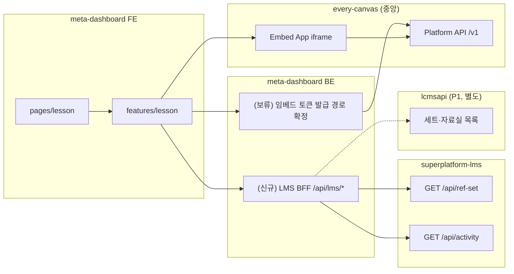

# everyCanvas SDK + LMS API 연동 개발 계획

> **대상**: `meta-dashboard-new/frontend` 프론트엔드 개발자  
> **범위(1차)**: 슬라이드 저작(SlideEditor) · 수업하기(SlideViewer) 임베드, 수업자료실·나의 자료 API 연동  
> **준수**: [`frontend/AGENTS.md`](../AGENTS.md) — FSD Lite, React Query, 기존 인증·API 클라이언트  
> **상태**: 계획 (기능은 단계적으로 추가·갱신)

---

## 1. 한 줄 요약

| 계층 | 저장소 | 역할 |
| --- | --- | --- |
| **슬라이드 렌더·저작 UI** | `every-canvas-fe` (중앙 Embed App + SDK) | iframe 임베드. 슬라이드 본문·렌더링은 중앙이 유지 |
| **학습 구조(보관함·출제·결과)** | `superplatform-lms` (P2) | `ref_set`(나의 자료) · `activity`(출제) · `activity_result`(제출) |
| **호스트 플랫폼** | `meta-dashboard-new` | GNB·목록 UI, embed token 프록시(백엔드), LMS/CMS 호출 |

프론트는 **(1) everyCanvas SDK로 iframe을 띄우고**, **(2) LMS API로 목록·메타를 가져오며**, **(3) 콘텐츠 본문 ID는 CMS/everyCanvas 쪽 키(`lcmsSetId`, `slideId`)로 연결**한다.

---

## 2. 3개 프로젝트 역할 (프론트 관점)



### every-canvas-fe (SDK · 가이드)

| 산출물 | 프론트 사용 방식 |
| --- | --- |
| Embed App | `embedBaseUrl` + iframe (React SDK 내부 `createEmbed`) |
| 정적 SDK (react) | `.../sdk/react/index.js` — **URL 동적 import 불가** (`react` bare specifier). npm 발행 또는 소스 vendoring 필요 |
| 정적 SDK (embed) | `.../sdk/embed/index.js` → `createEmbed` (**1차 채택**, 얇은 React 훅으로 래핑) |
| 정적 SDK (api) | `.../sdk/api/index.js` (필요 시) |

컴포넌트 Props·이벤트 정본: [`everycanvas-react-sdk-components.html`](../../every-canvas-fe/docs/03-guide/everycanvas-react-sdk-components.html)  
소비 방식: [`addAPI-소비팀-공지 §3.2`](../../every-canvas-fe/docs/03-guide/addAPI-소비팀-공지-t-everyclass.md) — React는 embed 코어 + 로컬 래퍼 권장.

**핵심 원칙** ([`addAPI-integration-guide.md`](../../every-canvas-fe/docs/03-guide/addAPI-integration-guide.md)):

- M2M 토큰은 **브라우저에 노출 금지**. 프론트는 **단기 embed token**만 자사 백엔드에서 받는다.
- **뷰어·저작만** 쓰는 1차 범위에서는 Result 서버 배포가 **필수 아님**.
- `getToken`은 최초 핸드셰이크 + `TOKEN_EXPIRED` 시 재호출된다.

스테이징 접속 정보 ([`addAPI-소비팀-공지-t-everyclass.md`](../../every-canvas-fe/docs/03-guide/addAPI-소비팀-공지-t-everyclass.md)):

| 항목 | 값 |
| --- | --- |
| `embedBaseUrl` | `https://t-everyclass.vsaidt.com` |
| Platform API | `https://t-everyclass.vsaidt.com/api` |
| 정적 SDK (embed) | `https://t-everyclass.vsaidt.com/sdk/embed/index.js` |
| 정적 SDK (react) | `https://t-everyclass.vsaidt.com/sdk/react/index.js` |
| 정적 SDK (api) | `https://t-everyclass.vsaidt.com/sdk/api/index.js` |

### superplatform-lms (학습 활동 API)

- Base URL: 로컬 `http://localhost:10053` · 개발 `https://t-gw.vschool.at/v1/lms` ([`공통규격.md`](../../superplatform-lms/docs/03-API연동규격서/00-공통/공통규격.md))
- 인증: `Authorization: Bearer <SSO access token>` (기존 `shared/api/client.ts` 인터셉터)
- 응답: envelope — **실제 데이터는 `resultData`**

**LMS가 소유하지 않는 것**: 슬라이드·세트 **본문** → CMS(lcmsapi, P1). LMS는 `lcmsSetId`로 **참조만** 한다.

### meta-dashboard-new (현재)

| 구분 | 상태 |
| --- | --- |
| embed token API | (보류) 토큰 호출/교환은 SSO 기반으로 전환 예정이라, 확정 전까지 경로는 보류 |
| FE 임베드 컴포넌트 | ✅ `features/lesson/ui/LessonEditorEmbed` · `LessonViewerEmbed` (React SDK + 공통 토큰/SDK 로더) |
| LMS 프록시/BFF | ❌ 미구현 — FE가 LMS를 직접 부를지, meta BE 경유할지 결정 필요 |
| `LessonMyPage` | 빈 페이지 (임시 버튼·목록 UI 추가 대상) |
| `LessonLibraryPage` | FilterPanel UI만, 목록 API 미연동 |

상세 임베드 가이드: [`everyclass-embed-수업-저작.md`](./everyclass-embed-수업-저작.md)

---

## 3. 화면명 ↔ API 매핑 (중요)

UI(GNB) 명칭과 LMS API 명칭이 **다르다**. 연동 전 아래 표를 기준으로 한다.

| GNB / 화면 | 라우트 | UI에서 기대하는 데이터 | LMS API (P2) | 비고 |
| --- | --- | --- | --- | --- |
| **수업 자료실** | `/lesson/library` | 공유·추천 세트 카탈로그, 필터 | **없음** (P1 CMS) | LMS `ref-set`은 "내 보관함"용. 자료실 목록은 **lcmsapi** 또는 meta BE BFF |
| **나의 자료** | `/lesson/my` | 내가 담아둔 세트(저작·복제·배포 전) | **`GET /api/ref-set`** (보관함 목록) | 온보딩 문서의 **「보관함(나의자료)」** |
| **수업 결과 보기** | `/lesson/result` | 배포된 활동·제출 통계 | **`GET /api/activity`**, **`GET /api/activity-log`** | 1차 범위 밖, 후속 Phase |

### 나의 자료 — LMS `GET /api/ref-set`

([`보관함-목록 (GET ref-set).md`](../../superplatform-lms/docs/03-API연동규격서/07-세트문항참조-LCMS연동/보관함-목록%20(GET%20ref-set).md) · `ContentRefController#list`)

**Request**: 쿼리/바디 없음. 신원은 토큰 `sub`(author)·`client_id`로 스코핑.

```http
GET /api/ref-set
Authorization: Bearer {JWT}
```

응답 (`resultData`) — LMS는 **참조 키 + 서비스 옵션만** 반환. CMS 메타 컬럼은 없음. meta-dashboard는 등록 시 `options`에 카드용 메타를 넣어 store-and-echo:

```json
{
  "totalCount": 1,
  "list": [{
    "refSetId": "a2b3...",
    "lcmsSetId": "L-SET-123",
    "makeMethod": 3,
    "status": 1,
    "options": {
      "title": "분수의 덧셈 진단",
      "thumbnailUrl": "https://cdn.example.com/thumbs/L-SET-123.png"
    },
    "createdAt": "2026-07-21T09:00:00"
  }]
}
```

| 필드 | 타입 | 설명 |
| --- | --- | --- |
| `totalCount` | int | 보관함 세트 수 |
| `list[].refSetId` | string | 보관함 참조 ID |
| `list[].lcmsSetId` | string | CMS 세트 ID (본문 로드 키) |
| `list[].makeMethod` | int | 1신규직접 / 2완성형 / 3자료실 / 4AI생성 / 5AI가공 |
| `list[].status` | int | 상태 (`status_cd`) |
| `list[].options` | object \| null | 서비스 자유 KV (store-and-echo). **meta-dashboard 계약** 아래 표 |
| `list[].createdAt` | string | 등록 시각 |

**`options` (meta-dashboard 계약)** — LMS는 스키마 검증 없이 그대로 저장·반환. FE가 아래 키를 사용한다:

| 키 | 타입 | 필수 | 설명 |
| --- | --- | --- | --- |
| `title` | string | ✅ | 카드 제목 |
| `thumbnailUrl` | string |  | 카드 썸네일 URL |

- `author_id` / `client_id`는 토큰에서 자동 주입 (body 불필요)
- 세트 본문·슬라이드 미리보기는 **`lcmsSetId`로 CMS/everyCanvas에서 추가 조회** ([`서비스-연동-온보딩 §6`](../../superplatform-lms/docs/03-API연동규격서/서비스-연동-온보딩.md)). 카드 제목·썸네일은 `options`에서 읽음

### 수업 자료실 — API 후보 (확인 필요)

LMS 규격서에 **「수업자료실」이라는 이름의 API는 없다**. 프로토타입(`prototype/.../mock-data.ts`의 `LIB`)은 공유 카탈로그 mock.

| 후보 | API | 담당 | 프론트 작업 |
| --- | --- | --- | --- |
| **A. CMS(lcmsapi, P1)** | 세트/교과서 목록 (lcmsapi 규격) | 다른 연구소 | meta BE BFF 또는 게이트웨이 경유 호출 |
| **B. everyCanvas Platform** | `platform.listSlides({ page, limit })` | everyCanvas 팀 | meta BE M2M → 슬라이드 메타 (자료실 UX와 1:1 대응 여부 확인) |
| **C. meta BE 자체** | `GET /api/lesson/library` (집계) | meta-dashboard BE | FE는 meta API만 호출 (권장 — CORS·토큰 단순화) |

**1차 권장**: 백엔드·기획과 **수업자료실 데이터 소스(A/B/C)** 를 확정한 뒤 FE service 계약을 고정한다. 확정 전까지는 프로토타입 mock을 `features/lesson` mock adapter로 유지.

---

## 4. Phase 1 — SlideEditor / SlideViewer (임시 버튼)

> **목표**: `LessonMyPage`에서 버튼 클릭으로 저작·수업 iframe을 띄워 SDK 연동을 검증한다.  
> **범위**: PoC 수준 UI. 프로토타입 최종 UX·문구는 후속 Phase.

### 4.1 UX (임시)

`LessonMyPage`에 로컬 상태로 모드 전환:

```
[슬라이드 저작] [수업하기]   ← 임시 Button 2개
─────────────────────────
(선택 시) LessonEditorEmbed | LessonViewerEmbed
```

- **슬라이드 저작**: `LessonEditorEmbed` — **SDK 1.5.0**: 기존 `slideId` URL 편집 → **`openSet(lcmsSetId)`** 또는 신규(`/embed/editor/new`). (§4.3)
- **수업하기**: `LessonViewerEmbed` — **변경 없음**. Platform `slideId` 필수 (`/embed/viewer/:slideId`)
- 한 컨테이너에 embed **한 번만** 마운트 (탭/모드 전환 시 cleanup → `destroy()`)

### 4.2 FSD 배치 (AGENTS.md) — 반영 완료

임시로 `pages/lesson/*Embed.tsx`에 두었던 SDK·fetch·styled를 **features**로 이동했다. pages는 조합만 담당.

```
features/lesson/
├── lib/
│   ├── everyCanvasEmbedSdk.ts   # /sdk/embed/index.js 1회 로드 + 타입
│   ├── useEveryCanvasEmbed.ts   # createEmbed 얇은 React 훅 (공식 권장 패턴)
│   └── getSsoAccessToken.ts     # SlideEditor 전용 getSsoToken
├── ui/
│   ├── LessonEditorEmbed/       # editor mode 래퍼 (Props는 SlideEditor 스펙 준수)
│   └── LessonViewerEmbed/       # viewer mode 래퍼 (Props는 SlideViewer 스펙 준수)
└── index.ts                     # public export
```

| 레이어 | 파일 | 역할 |
| --- | --- | --- |
| `pages/lesson/LessonMyPage.tsx` | pages | 임시 버튼 + feature embed 마운트만 |
| `features/lesson/ui/LessonEditorEmbed` | features | editor embed + `getToken`/`getSsoToken` (**목표**: `openSet`, `onSaved` 제거) |
| `features/lesson/ui/LessonViewerEmbed` | features | viewer embed + `getToken` (SSO 미전달, `slideId` 유지) |
| `features/lesson/lib/everyCanvasEmbedSdk.ts` | features | embed 코어 SDK 동적 import 단일화 |
| `features/lesson/lib/useEveryCanvasEmbed.ts` | features | createEmbed 마운트/cleanup 공통 훅 |
| `shared/config/env.ts` | shared | `ENV.EVERYCLASS_EMBED_BASE_URL` |

**금지**: page에 SDK import·fetch·대형 styled·React Query 훅 직접 배치.  
**참고**: `LessonLibraryPage`에 남아 있던 미사용 `createEmbed` PoC 코드는 제거함.

### 4.3 SlideEditor / SlideViewer 호출 방법 (SDK 1.5.0 · openSet)

> **참조**  
> - [`everycanvas-react-sdk-components.html`](../../every-canvas-fe/frontend/public/docs/everycanvas-react-sdk-components.html) (v1.5.0, 2026-08-14)  
> - [`everycanvas-openset-notice.html`](../../every-canvas-fe/frontend/public/docs/everycanvas-openset-notice.html)  
> - [`everycanvas-openset-changes.html`](../../every-canvas-fe/frontend/public/docs/everycanvas-openset-changes.html)  
> - [`everycanvas-openset-editor-ux-guide.html`](../../every-canvas-fe/frontend/public/docs/everycanvas-openset-editor-ux-guide.html)  
>
> **코드 상태**: 아래는 **신규 계약**. 현재 `LessonEditorEmbed` / `LessonViewerEmbed`는 **구계약**( `slideId`·`onSaved` )으로 동작 중 — **당장 코드 수정하지 않음**. 마이그레이션 시 §4.3.7 체크리스트 따름.

#### 4.3.0 Before → After (중대 변경)

| 구분 | Before (현재 FE 코드) | After (SDK 1.5.0) |
| --- | --- | --- |
| Editor 진입 | `mode:'editor'` + optional `slideId` → `/embed/editor/{slideId}` 또는 `/new` | **`slideId`로 기존 문서 로드 폐지**. `/embed/editor` + **`openSet(setId)`** 또는 `/embed/editor/new`(빈 신규) |
| setId 의미 | Platform slideId | **CBS 세트지 id** (= meta의 `lcmsSetId` / CMS `setId`) |
| 저장 | Platform `/v1/slides` → Host `onSaved` / `onDirty` | **중앙 저장 제거** (로컬 편집만). `onSaved`·`onDirty` **제거** |
| 편집 결과 보존 | `onSaved({ slideId, lcmsSetId, title, … })` | Host가 **`onStartLesson` / `onExitRequested`** 시점에 스냅샷·LMS 등록 등 처리 |
| Viewer | `/embed/viewer/:slideId` | **변경 없음** |
| ActivityJoin / Report | 임베드 모드 존재 | **제거** (타입만 하위호환, Frame capability 없음) |

#### 4.3.1 토큰 콜백 (유지 · 역할 강화)

| 콜백 | 대상 | 역할 | meta 구현 |
| --- | --- | --- | --- |
| `getToken` | Editor·Viewer **필수** | Platform `POST /v1/embed-tokens` 단기 **embed token** | `fetchEmbedToken` (scope `editor` \| `viewer`) |
| `getSsoToken` | **Editor only** | CBS 세트지·완성형 콘텐츠 조회용 **v-school SSO AT** | `getSsoAccessToken` |

- embed token ≠ SSO token. URL에 넣지 말 것 (`ec:init` 페이로드만).
- **`openSet` 사용 시 `getSsoToken` 필수** — 미전달이면 CBS 조회 실패 → `OPEN_SET_FAILED` / 빈 화면.
- 신규 저작(`/new`)만 하면 `getSsoToken`은 optional (단 CBS 콘텐츠 목록 비활성).
- Viewer에는 `getSsoToken` **전달하지 않음**.

```ts
// Editor
getToken={() => fetchEmbedToken({ scope: 'editor' })}
getSsoToken={getSsoAccessToken}   // openSet 시 필수

// Viewer
getToken={() => fetchEmbedToken({ scope: 'viewer', slideId })}
```

#### 4.3.2 `<SlideEditor>` — 권장 사용법

**진입 2가지**

| 목적 | React prop / createEmbed | Frame 경로 |
| --- | --- | --- |
| 기존 CBS 세트 열기 | `openSet="{lcmsSetId}"` 또는 ready 후 `embed.openSet(setId)` | `/embed/editor` (slideId 없음) |
| 빈 신규 저작 | `openSet` 생략 | `/embed/editor/new` |

**React SDK 예시**

```tsx
// ① 세트지 열기 (자료실·나의 자료 → 편집)
<SlideEditor
  embedBaseUrl={ENV.EVERYCLASS_EMBED_BASE_URL}
  openSet={lcmsSetId}                 // CBS setId / LMS lcmsSetId
  getToken={() => fetchEmbedToken({ scope: 'editor' })}
  getSsoToken={getSsoAccessToken}     // openSet 시 필수
  features={{ showExit: true }}       // Host 닫기 UI 없으면
  locale="ko-KR"
  onStartLesson={(p) => {/* Host가 수업 화면 실행 */}}
  onExitRequested={() => {/* iframe 종료 + 필요 시 상태 보존 */}}
  onError={(e) => {
    if (e.code === 'TOKEN_EXPIRED') remount();
    // OPEN_SET_INVALID | OPEN_SET_EMPTY | OPEN_SET_FAILED
  }}
/>

// ② 신규 저작
<SlideEditor
  embedBaseUrl={ENV.EVERYCLASS_EMBED_BASE_URL}
  getToken={() => fetchEmbedToken({ scope: 'editor' })}
  getSsoToken={getSsoAccessToken}     // CBS 콘텐츠 추가 시 권장
  onExitRequested={() => closeEditor()}
/>
```

**meta 패턴 (`createEmbed` + `useEveryCanvasEmbed`) 예시**

```ts
// options: mode 'editor', slideId 넣지 않음
const handle = createEmbed(container, {
  embedBaseUrl,
  mode: 'editor',
  // src는 SDK가 /embed/editor 구성 (slideId 파라미터 없음)
  getToken,
  getSsoToken, // openSet 시 필수
  features: { showStartLesson: false, showExit: true },
  locale: 'ko-KR',
});

handle.onReady(() => {
  if (lcmsSetId) handle.openSet?.(lcmsSetId); // EmbedHandle에 openSet 추가 필요(마이그레이션)
});

handle.on('startLesson', (p) => onStartLesson?.(p));
handle.on('exitRequested', (p) => onExitRequested?.(p));
handle.onError((e) => { /* OPEN_SET_* / TOKEN_* */ });
```

| Prop / 이벤트 | 필수 | 설명 |
| --- | --- | --- |
| `openSet` |  | CBS 세트지 id. 생략 = 신규 |
| `getToken` | ✅ | embed token |
| `getSsoToken` | ✅* | *openSet 시 필수 |
| `onStartLesson` |  | `{ lcmsSetId?, title?, lessonMeta? }` — **수업 실행은 Host** |
| `onExitRequested` |  | iframe 종료 위임 |
| `onError` |  | `OPEN_SET_*`, `TOKEN_*` 등 |
| ~~`slideId`~~ | — | **Editor에서 폐기** (Viewer만 사용) |
| ~~`onSaved` / `onDirty`~~ | — | **제거** |

`lessonMeta`: `{ schoolLevel?; subject?; textbookSubject?; curriculumVersion?; curriculum?; makeMethod? }`

#### 4.3.3 `<SlideViewer>` — 변경 없음

```tsx
<SlideViewer
  embedBaseUrl={ENV.EVERYCLASS_EMBED_BASE_URL}
  slideId={slideId}                   // Platform slideId 필수
  getToken={() => fetchEmbedToken({ scope: 'viewer', slideId })}
  locale="ko-KR"
  onSlideChanged={(p) => …}
  onCompleted={(p) => …}
  onExitRequested={() => …}
/>
```

| Prop | 필수 | 설명 |
| --- | --- | --- |
| `slideId` | ✅ | viewer 대상 Platform 슬라이드 ID |
| `getToken` | ✅ | scope=`viewer` |
| `onSlideChanged` / `onCompleted` / `onExitRequested` |  | 기존과 동일 |

> **주의**: Editor의 `openSet(setId)` ≠ Viewer의 `slideId`. 세트(CBS) vs 슬라이드(Platform) 키가 다름. 수업 재생에 Platform `slideId`가 필요하면 Host가 매핑을 유지해야 함.

#### 4.3.4 features 플래그 (Editor)

| 플래그 | 기본 | 설명 | 이벤트 |
| --- | --- | --- | --- |
| `features.showStartLesson` | `false` | 헤더 '수업하기' | `onStartLesson` |
| `features.showExit` | `false` | 헤더 '나가기' | `onExitRequested` |
| `features.readonly` | — | 조회만 (편집 UI 비활성) — UX 가이드 | |
| `features.autoResize` | — | Host 높이 동적 조절 | `onResize` |

**meta 지침**: Host에 자체 수업하기·닫기 UI가 있으면 `showStartLesson` / `showExit`를 켜지 말 것(중복). 풀스크린 Embed만 띄울 때는 `showExit: true` 권장.

#### 4.3.5 openSet 계약 · 오류 · UX

| 항목 | 값 |
| --- | --- |
| 커맨드 | `ec:command` / `action: 'openSet'` / `payload: { setId }` |
| capability | `content.openSet` (`ec:ready`에 광고) |
| 재호출 | 다른 setId로 재호출 → 슬라이드 **누적 추가** |
| 성공 | fire-and-forget (별도 success 이벤트 없음, 슬라이드 전개) |

| `onError` code | 의미 | 대응 |
| --- | --- | --- |
| `OPEN_SET_INVALID` | setId 누락·형식 오류 | payload 확인 |
| `OPEN_SET_EMPTY` | 세트에 열 콘텐츠 없음 | ⚠️ CBS `GET /api/sets/{id}` → `slides:[]` 결함 가능 |
| `OPEN_SET_FAILED` | CBS 조회 실패 | `getSsoToken`·네트워크 |
| `TOKEN_INVALID` / `TOKEN_EXPIRED` | embed token | 재발급 후 remount |

편집 화면 UX(대기→로딩→4영역): [`everycanvas-openset-editor-ux-guide.html`](../../every-canvas-fe/frontend/public/docs/everycanvas-openset-editor-ux-guide.html)

#### 4.3.6 토큰 만료 · Host가 안 해도 되는 것

- 핸드셰이크 시 `getToken`(+ Editor면 `getSsoToken`) 호출
- `TOKEN_EXPIRED` → Host **재발급 후 재마운트** (`setInterval`로 토큰 푸시 금지)

| 처리 주체 | 내용 |
| --- | --- |
| everyCanvas SDK | iframe·핸드셰이크·`openSet` 브리지 |
| SSO SDK (`getAuth()`) | AT 갱신 |
| Host | LMS `POST /api/ref-set`, 수업 화면 실행, iframe 종료 |

#### 4.3.7 meta FE 마이그레이션 체크리스트 (코드 변경 시)

현재 → 목표. **지금은 문서만.**

- [ ] `LessonEditorEmbed`: `slideId` prop 제거/대체 → `openSet?: string` (`lcmsSetId`)
- [ ] `createEmbed` options에서 editor `slideId` 전달 중단; ready 후 `openSet` 또는 SDK prop
- [ ] `EmbedHandle` 타입에 `openSet?(setId: string)` 추가 (`everyCanvasEmbedSdk.ts`)
- [ ] handlers: `saved` / `dirty` 제거; `startLesson` / `exitRequested` / `onError` 중심으로 재배선
- [ ] `LessonEditorPage.onSaved` → LMS `registerRefSet` 트리거를 **`onStartLesson` 또는 별도 Host 저장 UX**로 재설계 (SDK가 `onSaved` 안 줌)
- [ ] `LessonViewerEmbed`: 유지 (`slideId` + `getToken`). Viewer용 Platform slideId 확보 경로 재확인
- [ ] ActivityJoin/Report 참조 있으면 제거
- [ ] `OPEN_SET_*` 에러 UI + CBS `slides:[]` 제약 인지

#### 4.3.8 확정 필요 항목

- [ ] BE `/api/everyclass/embed-token` 경로·파라미터 확정
- [ ] Host `TOKEN_EXPIRED` remount UX
- [ ] embed token TTL 확인 (가이드: 15분~1시간)
- [ ] **편집 결과 영속화 정책**: LMS/CMS 어디에 무엇을 언제 저장할지 (SDK 저장 없음)
- [ ] Viewer용 Platform `slideId` ↔ CBS `lcmsSetId` 매핑
- [ ] CBS `GET /api/sets/{setId}.slides` 빈배열 결함 해소 (everyCanvas/CBS팀)

### 4.4 선행 조건 체크리스트

- [ ] 중앙에 meta-dashboard **origin 등록** (`everyclass.allowed-origins`)
- [ ] meta BE **M2M** 설정 (`everyclass.m2m.*` 또는 `superplatform.auth` 폴백)
- [ ] 로컬: (SSO 교환/발급이 가능한) token 발급 경로(교환/발급 API) 확정 + FE vite proxy `/api/everyclass` 확인
- [ ] PoC `slideId` 확보 (Platform에 존재하는 슬라이드 ID)

### 4.5 Phase 1 완료 기준

- [ ] `LessonMyPage` 임시 버튼 → Editor/Viewer 전환
- [ ] editor (SDK 1.5): `openSet(lcmsSetId)` 또는 신규 `/new` + `onStartLesson` / `onExitRequested` 확인 (**`onSaved` 의존 제거**)
- [ ] viewer: `onSlideChanged` / `onCompleted` 확인 (기존과 동일)
- [x] FSD: embed는 `features/lesson`, pages는 조합만
- [x] `npx tsc -b --noEmit`, eslint 통과
- [ ] §4.3.7 마이그레이션 체크리스트 반영 (코드 작업 시)

---

## 5. Phase 2 — 수업자료실 · 나의 자료 API

### 5.1 나의 자료 (`GET /api/ref-set`)

#### 백엔드 연동 방식 (택 1)

| 방식 | 장점 | FE 호출 |
| --- | --- | --- |
| **직접 LMS** | BFF 없이 빠른 PoC | `ENV.SP_LMS_API_URL` + Bearer (게이트웨이 CORS 확인) |
| **meta BE BFF** | 토큰·client_id 일원화, CMS 집계 가능 | `GET /api/lms/ref-set` (신규) |

AGENTS.md: *「API 타입과 연동 방식을 정하기 전에 backend Controller, DTO, 서비스 계약을 확인」* → **meta BE에 BFF 추가 시 backend DTO 먼저 확인**.

#### FSD 구조 (제안)

```
features/lesson/
├── api/
│   ├── queryKeys.ts          # lessonKeys.refSets(), lessonKeys.library(...)
│   ├── types.ts              # RefSetItem, LibraryItem (LMS/CMS DTO 매핑)
│   ├── lmsRefSetService.ts   # GET ref-set
│   ├── lmsLibraryService.ts  # (소스 확정 후)
│   └── queries.ts            # useRefSetList(), useLibraryList(...)
├── model/
│   └── mapRefSetToCard.ts    # UI 카드 view-model (lcmsSetId + CMS 메타/options)
└── ui/
    └── MyDataGrid/           # 나의 자료 카드 목록
```

#### React Query 패턴

```ts
// queryKeys.ts
export const lessonKeys = {
  all: ['lesson'] as const,
  refSets: () => [...lessonKeys.all, 'ref-set'] as const,
  library: (params: LibraryQueryParams) =>
    [...lessonKeys.all, 'library', params] as const,
};

// queries.ts
export function useRefSetList() {
  return useQuery({
    queryKey: lessonKeys.refSets(),
    queryFn: () => lmsRefSetService.list(),
    select: (data) => data.list.map(mapRefSetToCard),
  });
}
```

- `useEffect` fetch **금지**
- mutation(보관함 등록 `POST /api/ref-set`) 성공 시 `lessonKeys.refSets()` invalidate

#### UI 연결

| 화면 | 위젯 | 데이터 |
| --- | --- | --- |
| `/lesson/my` | `widgets/lesson/MyDataSection` | `useRefSetList()` |
| 카드 액션 [편집] | navigate 또는 overlay | `LessonEditorEmbed` + `lcmsSetId`/`slideId` 매핑 |
| 카드 액션 [수업하기] | overlay | `LessonViewerEmbed` |

프로토타입 참조: `prototype/.../MyDataView.tsx`, `MyLessonCard.tsx` — **UI/문구/상태만** 참고, Tailwind·mock 복사 금지.

### 5.2 수업자료실 (API 소스 확정 후)

[`lesson-library.plan.md`](./lesson-library.plan.md) Phase 2와 통합:

1. `useLibraryFilters()` (로컬) + `useLibraryResources({ filters, sort })` (React Query)
2. `queryKey`에 filters/sort 포함
3. 백엔드 DTO 확정 후 `lessonLibraryService`에서 query param 매핑

필터 taxonomy(`filterTaxonomy.ts`)는 UI 전용. API 파라미터명은 CMS/BFF 스펙에 맞게 **service 레이어에서만** 변환.

### 5.3 저장·등록 흐름 (나의 자료에 담기)

자료실 → 나의 자료 저장 시 LMS 호출 ([`POST /api/ref-set`](../../superplatform-lms/docs/03-API연동규격서/07-세트문항참조-LCMS연동/보관함-등록%20(POST%20ref-set).md) · `RefSetRegisterRequest`):

```json
{
  "lcmsSetId": "L-SET-123",
  "makeMethod": 3,
  "options": {
    "title": "분수의 덧셈 진단",
    "thumbnailUrl": "https://cdn.example.com/thumbs/L-SET-123.png"
  }
}
```

| 필드 | 타입 | 필수 | 설명 |
| --- | --- | --- | --- |
| `lcmsSetId` | string | ✅ | CMS 세트 ID |
| `makeMethod` | int |  | 미지정 시 기본 `3`(자료실) |
| `options` | object | ✅ | 서비스 자유 옵션(store-and-echo). **meta-dashboard**: `title`(필수), `thumbnailUrl`(선택) |

| `options` 키 | 타입 | 필수 | 설명 |
| --- | --- | --- | --- |
| `title` | string | ✅ | 카드 제목 (GET 목록에서 그대로 사용) |
| `thumbnailUrl` | string |  | 카드 썸네일 URL |

응답: `resultData.refSetId` (이후 `POST /api/activity`의 `refSetId`).

저작 완료(`onSaved` → `slideId`) 후 **CMS 세트 ID와의 매핑**을 meta BE 또는 everyCanvas Platform 메타에서 가져와 `ref-set` 등록 — **팀 협의 필요**.

### 5.4 Phase 2 완료 기준

- [ ] 나의 자료: `GET /api/ref-set` 목록 렌더 (로딩/에러/빈 상태)
- [ ] 401 → 기존 SSO 흐름, 404 스코핑 메시지 처리
- [ ] 수업자료실: API 소스 확정 + 목록 1페이지 연동 (또는 mock adapter + TODO 명시)
- [ ] `lessonKeys` factory 사용, 임의 query key 문자열 없음

---

## 6. 환경 변수 · 설정 (제안)

`shared/config/env.ts`에 추가 검토:

| 변수 | 용도 | 상태 | 예시 |
| --- | --- | --- | --- |
| `VITE_EVERYCLASS_EMBED_BASE_URL` | Embed App + `/sdk/react` 오리진 | ✅ `ENV.EVERYCLASS_EMBED_BASE_URL` | `https://t-everyclass.vsaidt.com` |
| `VITE_SP_LMS_API_URL` | LMS 직접 호출 시 (BFF 없을 때) | 미추가 | `https://t-gw.vschool.at/v1/lms` |

M2M·Platform URL은 **FE env에 넣지 않음** (meta BE `everyclass.*`만).

---

## 7. 인증 · 보안 (AGENTS.md + addAPI)

- HTTP: 기존 `shared/api/client.ts` + SSO SDK (`auth.login()` 리다이렉트)
- Access Token localStorage 직접 접근 **금지**
- embed: `Referrer-Policy: strict-origin-when-cross-origin` 이상
- iframe `allowedOrigins` = meta-dashboard origin (중앙 등록)

---

## 8. 구현 순서 (체크리스트)

### Phase 1 — 임베드 PoC

1. [x] `ENV.EVERYCLASS_EMBED_BASE_URL` (`VITE_EVERYCLASS_EMBED_BASE_URL`)
2. [x] `LessonMyPage` — 임시 버튼 + feature embed 마운트
3. [x] FSD 이동: `pages/*Embed` → `features/lesson` + embed 코어(`createEmbed`) + `useEveryCanvasEmbed` 공통 훅 (React SDK URL import는 bare `react`로 불가)
4. [ ] 로컬 token 교환/발급 + origin 등록 확인 (BE 경로 확정 후)
5. [x] tsc / eslint 통과 (`npm run build` 는 미확인)

### Phase 2a — 나의 자료 API

1. [ ] meta BE LMS BFF 여부 결정 + DTO 확인
2. [ ] `features/lesson/api/queryKeys.ts`, `lmsRefSetService.ts`, `queries.ts`
3. [ ] `widgets/lesson/MyDataSection` + 카드 UI (Emotion, theme 토큰)
4. [ ] `LessonMyPage` — PoC 버튼과 목록 공존 또는 탭 분리

### Phase 2b — 수업자료실 API

1. [ ] 자료실 데이터 소스(CMS / Platform / BFF) 확정
2. [ ] `useLibraryResources` + `LessonLibraryPage` 그리드
3. [ ] 필터 → query param 매핑 (`lesson-library.plan.md` Phase 2)

### 후속 (문서에만 기록, 구현은 별도 추가)

- 활동 배포 `POST /api/activity` + `<ActivityJoin>`
- 결과보기 `GET /api/activity-log` + `<ActivityReport>`
- Result 서버 배포 (활동 사용 시)
- `POST /api/ref-set` (자료실 → 나의 자료 담기)
- 저작 로그 `POST /api/authoring-log`

---

## 9. 검증

```powershell
cd frontend
npx tsc -b --noEmit
npx eslint src/pages/lesson src/widgets/lesson src/features/lesson
npm run build
```

런타임:

| 시나리오 | 확인 |
| --- | --- |
| 임시 [슬라이드 저작] | editor iframe 로드, dirty/saved |
| 임시 [수업하기] | viewer iframe, slideChanged |
| 단기 embed token 실패 | SSO 토큰/교환 API 경로/스코프 오류 vs UI 에러 표시 |
| 나의 자료 목록 | ref-set list, 빈 목록, 401 |
| CORS | LMS 직호출 vs BFF |

---

## 10. 리스크 · 협의 필요

| # | 항목 | 내용 |
| --- | --- | --- |
| 1 | **수업자료실 API** | LMS에 동명 API 없음 → CMS/BFF 확정 필요 |
| 2 | **slideId ↔ lcmsSetId** | everyCanvas 슬라이드 ID와 LMS `lcmsSetId` 매핑 규칙 |
| 3 | **CMS 메타** | 제목·썸네일을 FE가 직접 넘길지 LMS/CMS 연동으로 채울지 ([온보딩 §6]( ../../superplatform-lms/docs/03-API연동규격서/서비스-연동-온보딩.md)) |
| 4 | **LMS 호출 경로** | FE → 게이트웨이 직접 vs meta BE BFF |
| 5 | **client_id** | SSO 토큰 `client_id`가 LMS 스코핑과 일치하는지 |

---

## 11. 참고 문서

### every-canvas-fe (`docs/03-guide/`)

| 문서 | 용도 |
| --- | --- |
| [`addAPI-integration-guide.md`](../../every-canvas-fe/docs/03-guide/addAPI-integration-guide.md) | end-to-end 통합 |
| [`everycanvas-react-sdk-components.html`](../../every-canvas-fe/docs/03-guide/everycanvas-react-sdk-components.html) | SlideEditor/Viewer/Join/Report Props·이벤트 정본 |
| [`addAPI-소비팀-온보딩.md`](../../every-canvas-fe/docs/03-guide/addAPI-소비팀-온보딩.md) | 전달물·4단계 |
| [`addAPI-소비팀-공지-t-everyclass.md`](../../every-canvas-fe/docs/03-guide/addAPI-소비팀-공지-t-everyclass.md) | 스테이징 URL |
| [`addAPI-versioning-policy.md`](../../every-canvas-fe/docs/03-guide/addAPI-versioning-policy.md) | v1 호환 |

### superplatform-lms

| 문서 | 용도 |
| --- | --- |
| [`README.md`](../../superplatform-lms/README.md) | P1/P2/P3 분류 |
| [`docs/03-API연동규격서/README.md`](../../superplatform-lms/docs/03-API연동규격서/README.md) | API 목록 |
| [`서비스-연동-온보딩.md`](../../superplatform-lms/docs/03-API연동규격서/서비스-연동-온보딩.md) | 보관함·출제·제출 흐름 |
| [`00-공통/공통규격.md`](../../superplatform-lms/docs/03-API연동규격서/00-공통/공통규격.md) | Base URL, envelope |

### meta-dashboard-new/frontend

| 문서 | 용도 |
| --- | --- |
| [`AGENTS.md`](../AGENTS.md) | FSD, React Query, 인증 |
| [`everyclass-embed-수업-저작.md`](./everyclass-embed-수업-저작.md) | embed PoC 상세 |
| [`lesson-library.plan.md`](./lesson-library.plan.md) | 자료실 필터 UI |

---

## 변경 이력

| 날짜 | 내용 |
| --- | --- |
| 2026-08-11 | 1차 작성: Phase 1(임베드 PoC), Phase 2(나의 자료 ref-set, 수업자료실 API 후보), API 명칭 매핑 |
| 2026-08-11 | npm 패키지 부재 전제 반영, 정적 SDK URL 명시, 토큰 호출/교환은 SSO 기반 전환 예정(보류) |
| 2026-08-12 | §4.3 SSO getToken 분석 추가 (방향 A/B, 10분 만료 갱신 흐름), 참조 파일명 lesson-library.plan.md로 변경 |
| 2026-08-12 | §4.3 구조 확정 — getToken(embed token, stub)·getSsoToken(SSO AT, 구현완료) 분리 반영 |
| 2026-08-12 | FSD 정리: pages Embed → `features/lesson`, React SDK(`SlideEditor`/`SlideViewer`) 공통 로더·토큰 서비스 추출, `getSsoToken`은 Editor 전용, `ENV.EVERYCLASS_EMBED_BASE_URL` 반영 |
| 2026-08-12 | `/sdk/react` URL import 실패(bare `react`) 확인 → 소비팀 공지대로 `/sdk/embed` `createEmbed` + `useEveryCanvasEmbed` 로컬 래퍼로 전환 |
| 2026-08-13 | SDK 레퍼런스(`everycanvas-react-sdk-components.html`) 갱신 반영: §4.3.3 `features.showStartLesson`(SDK 1.3.0)·`features.showExit`(SDK 1.4.0) 플래그 및 `onStartLesson` 콜백 페이로드·`lessonMeta` 구조 추가. 기존 §4.3.3~5 → §4.3.4~6 재번호 |
| 2026-08-14 | §3 `GET /api/ref-set`·§5.3 `POST /api/ref-set`를 LMS 코드(`ContentRefController`/`RefSetRegisterRequest`/`toView`)·규격서에 맞춤: 응답에서 `title`/`subjectCd`/`schoolLevelCd` 제거, `options` 추가. CMS 메타는 `lcmsSetId`로 로드 |
| 2026-08-14 | meta-dashboard `options` 계약 고정: `title`(필수)·`thumbnailUrl`(선택). GET/POST `/api/ref-set` 예시·표 반영 |
| 2026-08-14 | §4.3 SDK 1.5.0(`openSet`·저장 제거·Activity 제거) 반영. Editor는 `openSet(lcmsSetId)`/`/new`, Viewer는 `slideId` 유지. 현재 FE 코드는 구계약 — 마이그레이션 체크리스트만 문서화(코드 미변경) |
