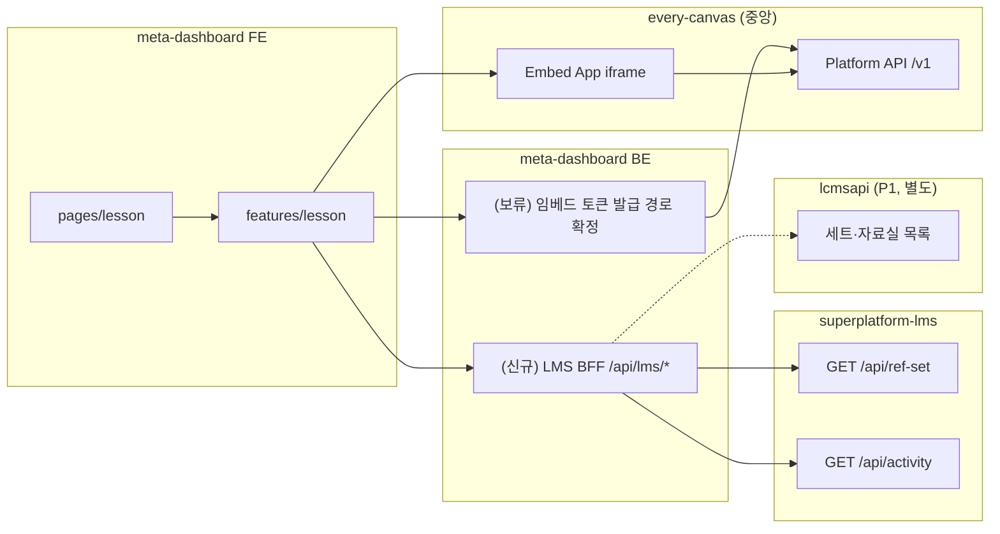

# everyCanvas SDK + LMS API 연동 개발 계획

> **대상**: `meta-dashboard-new/frontend` 프론트엔드 개발자  
> **범위(1차)**: 슬라이드 저작(SlideEditor) · 수업하기(SlideViewer) 임베드, 수업자료실·나의 자료 API 연동  
> **준수**: [`frontend/AGENTS.md`](../AGENTS.md) — FSD Lite, React Query, 기존 인증·API 클라이언트  
> **상태**: 계획 (기능은 단계적으로 추가·갱신)

---

## 1. 한 줄 요약

| 계층 | 저장소 | 역할 |
| --- | --- | --- |
| **슬라이드 렌더·저작 UI** | `every-canvas-fe` (중앙 Embed App + SDK) | iframe 임베드. 슬라이드 본문·렌더링은 중앙이 유지 |
| **학습 구조(보관함·출제·결과)** | `superplatform-lms` (P2) | `ref_set`(나의 자료) · `activity`(출제) · `activity_result`(제출) |
| **호스트 플랫폼** | `meta-dashboard-new` | GNB·목록 UI, embed token 프록시(백엔드), LMS/CMS 호출 |

프론트는 **(1) everyCanvas SDK로 iframe을 띄우고**, **(2) LMS API로 목록·메타를 가져오며**, **(3) 콘텐츠 본문 ID는 CMS/everyCanvas 쪽 키(`lcmsSetId`, `slideId`)로 연결**한다.

---

## 2. 3개 프로젝트 역할 (프론트 관점)



### every-canvas-fe (SDK · 가이드)

| 산출물 | 프론트 사용 방식 |
| --- | --- |
| Embed App | `embedBaseUrl` + iframe (`createEmbed`) |
| 정적 SDK (embed) | `.../sdk/embed/index.js` 로 `createEmbed` import |
| 정적 SDK (react) | `.../sdk/react/index.js` (번들러/사용 가능 여부 확인 필요) |
| 정적 SDK (api) | `.../sdk/api/index.js` (필요 시) |

**핵심 원칙** ([`addAPI-integration-guide.md`](../../every-canvas-fe/docs/03-guide/addAPI-integration-guide.md)):

- M2M 토큰은 **브라우저에 노출 금지**. 프론트는 **단기 embed token**만 자사 백엔드에서 받는다.
- **뷰어·저작만** 쓰는 1차 범위에서는 Result 서버 배포가 **필수 아님**.
- `getToken`은 최초 핸드셰이크 + `TOKEN_EXPIRED` 시 재호출된다.

스테이징 접속 정보 ([`addAPI-소비팀-공지-t-everyclass.md`](../../every-canvas-fe/docs/03-guide/addAPI-소비팀-공지-t-everyclass.md)):

| 항목 | 값 |
| --- | --- |
| `embedBaseUrl` | `https://t-everyclass.vsaidt.com` |
| Platform API | `https://t-everyclass.vsaidt.com/api` |
| 정적 SDK (embed) | `https://t-everyclass.vsaidt.com/sdk/embed/index.js` |
| 정적 SDK (react) | `https://t-everyclass.vsaidt.com/sdk/react/index.js` |
| 정적 SDK (api) | `https://t-everyclass.vsaidt.com/sdk/api/index.js` |

### superplatform-lms (학습 활동 API)

- Base URL: 로컬 `http://localhost:10053` · 개발 `https://t-gw.vschool.at/v1/lms` ([`공통규격.md`](../../superplatform-lms/docs/03-API연동규격서/00-공통/공통규격.md))
- 인증: `Authorization: Bearer <SSO access token>` (기존 `shared/api/client.ts` 인터셉터)
- 응답: envelope — **실제 데이터는 `resultData`**

**LMS가 소유하지 않는 것**: 슬라이드·세트 **본문** → CMS(lcmsapi, P1). LMS는 `lcmsSetId`로 **참조만** 한다.

### meta-dashboard-new (현재)

| 구분 | 상태 |
| --- | --- |
| embed token API | (보류) 토큰 호출/교환은 SSO 기반으로 전환 예정이라, 확정 전까지 경로는 보류 |
| FE 임베드 컴포넌트 | ✅ `LessonEditorEmbed`, `LessonViewerEmbed` (현재 PoC는 임시 엔드포인트를 호출 중) |
| LMS 프록시/BFF | ❌ 미구현 — FE가 LMS를 직접 부를지, meta BE 경유할지 결정 필요 |
| `LessonMyPage` | 빈 페이지 (임시 버튼·목록 UI 추가 대상) |
| `LessonLibraryPage` | FilterPanel UI만, 목록 API 미연동 |

상세 임베드 가이드: [`everyclass-embed-수업-저작.md`](./everyclass-embed-수업-저작.md)

---

## 3. 화면명 ↔ API 매핑 (중요)

UI(GNB) 명칭과 LMS API 명칭이 **다르다**. 연동 전 아래 표를 기준으로 한다.

| GNB / 화면 | 라우트 | UI에서 기대하는 데이터 | LMS API (P2) | 비고 |
| --- | --- | --- | --- | --- |
| **수업 자료실** | `/lesson/library` | 공유·추천 세트 카탈로그, 필터 | **없음** (P1 CMS) | LMS `ref-set`은 "내 보관함"용. 자료실 목록은 **lcmsapi** 또는 meta BE BFF |
| **나의 자료** | `/lesson/my` | 내가 담아둔 세트(저작·복제·배포 전) | **`GET /api/ref-set`** (보관함 목록) | 온보딩 문서의 **「보관함(나의자료)」** |
| **수업 결과 보기** | `/lesson/result` | 배포된 활동·제출 통계 | **`GET /api/activity`**, **`GET /api/activity-log`** | 1차 범위 밖, 후속 Phase |

### 나의 자료 — LMS `GET /api/ref-set`

([`보관함-목록 (GET ref-set).md`](../../superplatform-lms/docs/03-API연동규격서/07-세트문항참조-LCMS연동/보관함-목록%20(GET%20ref-set).md))

```http
GET /api/ref-set
Authorization: Bearer {JWT}
```

응답 (`resultData`):

```json
{
  "totalCount": 1,
  "list": [{
    "refSetId": "a2b3...",
    "lcmsSetId": "L-SET-123",
    "title": "분수의 덧셈 진단",
    "subjectCd": "MA",
    "schoolLevelCd": "E",
    "makeMethod": 3,
    "status": 1,
    "createdAt": "2026-07-21T09:00:00"
  }]
}
```

- `author_id` / `client_id`는 토큰에서 자동 주입 (body 불필요)
- 카드 썸네일·슬라이드 미리보기는 **`lcmsSetId`로 CMS/everyCanvas에서 추가 조회** (협의 중, [`서비스-연동-온보딩 §6`](../../superplatform-lms/docs/03-API연동규격서/서비스-연동-온보딩.md))

### 수업 자료실 — API 후보 (확인 필요)

LMS 규격서에 **「수업자료실」이라는 이름의 API는 없다**. 프로토타입(`prototype/.../mock-data.ts`의 `LIB`)은 공유 카탈로그 mock.

| 후보 | API | 담당 | 프론트 작업 |
| --- | --- | --- | --- |
| **A. CMS(lcmsapi, P1)** | 세트/교과서 목록 (lcmsapi 규격) | 다른 연구소 | meta BE BFF 또는 게이트웨이 경유 호출 |
| **B. everyCanvas Platform** | `platform.listSlides({ page, limit })` | everyCanvas 팀 | meta BE M2M → 슬라이드 메타 (자료실 UX와 1:1 대응 여부 확인) |
| **C. meta BE 자체** | `GET /api/lesson/library` (집계) | meta-dashboard BE | FE는 meta API만 호출 (권장 — CORS·토큰 단순화) |

**1차 권장**: 백엔드·기획과 **수업자료실 데이터 소스(A/B/C)** 를 확정한 뒤 FE service 계약을 고정한다. 확정 전까지는 프로토타입 mock을 `features/lesson` mock adapter로 유지.

---

## 4. Phase 1 — SlideEditor / SlideViewer (임시 버튼)

> **목표**: `LessonMyPage`에서 버튼 클릭으로 저작·수업 iframe을 띄워 SDK 연동을 검증한다.  
> **범위**: PoC 수준 UI. 프로토타입 최종 UX·문구는 후속 Phase.

### 4.1 UX (임시)

`LessonMyPage`에 로컬 상태로 모드 전환:

```
[슬라이드 저작] [수업하기]   ← 임시 Button 2개
─────────────────────────
(선택 시) LessonEditorEmbed | LessonViewerEmbed
```

- **슬라이드 저작**: `LessonEditorEmbed` — `slideId` 없으면 신규(`/embed/editor/new`)
- **수업하기**: `LessonViewerEmbed` — PoC용 고정 `slideId` 또는 ref-set 목록에서 선택한 `lcmsSetId` ↔ Platform `slideId` 매핑 확정 후 연결
- 한 컨테이너에 embed **한 번만** 마운트 (탭/모드 전환 시 cleanup → `destroy()`)

### 4.2 FSD 배치 (AGENTS.md)

| 레이어 | 파일 | 역할 |
| --- | --- | --- |
| `pages/lesson/LessonMyPage.tsx` | 페이지 | `슬라이드 저작` / `수업하기` 버튼 + `LessonEditorEmbed`/`LessonViewerEmbed` 마운트(임시 PoC) |
| `pages/lesson/LessonEditorEmbed.tsx` | pages | iframe 마운트 (기존 재사용) |
| `pages/lesson/LessonViewerEmbed.tsx` | pages | iframe 마운트 (기존 재사용) |
| `shared/config/env.ts` | shared | `EVERYCLASS_EMBED_BASE_URL` 추가 검토 (하드코드 URL 제거) |

**금지**: page에 styled 대형 블록·fetch 로직·React Query 훅 직접 배치.

### 4.3 embed token 호출 (기존 계약)

프론트 `getToken` → **임베드 토큰(단기 토큰) 발급**

> 토큰 호출/교환은 요청하신 전제대로 **SSO 인증 토큰 기반**으로 전환합니다.
> 현재 문서는 SSO 기반 경로의 확정 전까지 **보류**로 두고, 확정 항목으로 분리합니다.

응답 token 추출 (`resultData.token` 폴백 처리는 `LessonEditorEmbed`/`LessonViewerEmbed`에 이미 부분 처리 형태가 있음):

```ts
const json = await res.json();
return json.resultData?.token ?? json.token;
```

| mode | scope | slideId |
| --- | --- | --- |
| editor | `editor` | 선택 (신규 생략) |
| viewer | `viewer` | **필수** |

#### 확정 필요 항목 (보류)

- [ ] SSO access token을 프론트에서 어떤 방식으로 변환/교환해 단기 embed token을 받는지 (meta BE 경유인지, 직접 호출인지)
- [ ] 단기 embed token 발급 API 경로/요청 파라미터 (`scope`, `slideId`) 정합성
- [ ] `LessonEditorEmbed`/`LessonViewerEmbed`의 현재 구현이 새 흐름으로 업데이트되어야 하는지 여부

### 4.4 선행 조건 체크리스트

- [ ] 중앙에 meta-dashboard **origin 등록** (`everyclass.allowed-origins`)
- [ ] meta BE **M2M** 설정 (`everyclass.m2m.*` 또는 `superplatform.auth` 폴백)
- [ ] 로컬: (SSO 교환/발급이 가능한) token 발급 경로(교환/발급 API) 확정 + FE vite proxy `/api/everyclass` 확인
- [ ] PoC `slideId` 확보 (Platform에 존재하는 슬라이드 ID)

### 4.5 Phase 1 완료 기준

- [ ] `LessonMyPage` 임시 버튼 → Editor/Viewer 전환
- [ ] editor: 저장 `saved` 이벤트 콘솔 또는 토스트 확인
- [ ] viewer: `slideChanged` / `completed` 이벤트 확인
- [ ] `npx tsc -b --noEmit`, eslint 통과

---

## 5. Phase 2 — 수업자료실 · 나의 자료 API

### 5.1 나의 자료 (`GET /api/ref-set`)

#### 백엔드 연동 방식 (택 1)

| 방식 | 장점 | FE 호출 |
| --- | --- | --- |
| **직접 LMS** | BFF 없이 빠른 PoC | `ENV.LMS_API_URL` + Bearer (게이트웨이 CORS 확인) |
| **meta BE BFF** | 토큰·client_id 일원화, CMS 집계 가능 | `GET /api/lms/ref-set` (신규) |

AGENTS.md: *「API 타입과 연동 방식을 정하기 전에 backend Controller, DTO, 서비스 계약을 확인」* → **meta BE에 BFF 추가 시 backend DTO 먼저 확인**.

#### FSD 구조 (제안)

```
features/lesson/
├── api/
│   ├── queryKeys.ts          # lessonKeys.refSets(), lessonKeys.library(...)
│   ├── types.ts              # RefSetItem, LibraryItem (LMS/CMS DTO 매핑)
│   ├── lmsRefSetService.ts   # GET ref-set
│   ├── lmsLibraryService.ts  # (소스 확정 후)
│   └── queries.ts            # useRefSetList(), useLibraryList(...)
├── model/
│   └── mapRefSetToCard.ts    # UI 카드 view-model (lcmsSetId, title, ...)
└── ui/
    └── MyDataGrid/           # 나의 자료 카드 목록
```

#### React Query 패턴

```ts
// queryKeys.ts
export const lessonKeys = {
  all: ['lesson'] as const,
  refSets: () => [...lessonKeys.all, 'ref-set'] as const,
  library: (params: LibraryQueryParams) =>
    [...lessonKeys.all, 'library', params] as const,
};

// queries.ts
export function useRefSetList() {
  return useQuery({
    queryKey: lessonKeys.refSets(),
    queryFn: () => lmsRefSetService.list(),
    select: (data) => data.list.map(mapRefSetToCard),
  });
}
```

- `useEffect` fetch **금지**
- mutation(보관함 등록 `POST /api/ref-set`) 성공 시 `lessonKeys.refSets()` invalidate

#### UI 연결

| 화면 | 위젯 | 데이터 |
| --- | --- | --- |
| `/lesson/my` | `widgets/lesson/MyDataSection` | `useRefSetList()` |
| 카드 액션 [편집] | navigate 또는 overlay | `LessonEditorEmbed` + `lcmsSetId`/`slideId` 매핑 |
| 카드 액션 [수업하기] | overlay | `LessonViewerEmbed` |

프로토타입 참조: `prototype/.../MyDataView.tsx`, `MyLessonCard.tsx` — **UI/문구/상태만** 참고, Tailwind·mock 복사 금지.

### 5.2 수업자료실 (API 소스 확정 후)

[`lesson-library-filter.plan.md`](./lesson-library-filter.plan.md) Phase 2와 통합:

1. `useLibraryFilters()` (로컬) + `useLibraryResources({ filters, sort })` (React Query)
2. `queryKey`에 filters/sort 포함
3. 백엔드 DTO 확정 후 `lessonLibraryService`에서 query param 매핑

필터 taxonomy(`filterTaxonomy.ts`)는 UI 전용. API 파라미터명은 CMS/BFF 스펙에 맞게 **service 레이어에서만** 변환.

### 5.3 저장·등록 흐름 (나의 자료에 담기)

자료실 → 나의 자료 저장 시 LMS 호출 ([`POST /api/ref-set`](../../superplatform-lms/docs/03-API연동규격서/07-세트문항참조-LCMS연동/보관함-등록%20(POST%20ref-set).md)):

```json
{
  "lcmsSetId": "cms-set-123",
  "title": "세트 제목",
  "makeMethod": 3
}
```

저작 완료(`onSaved` → `slideId`) 후 **CMS 세트 ID와의 매핑**을 meta BE 또는 everyCanvas Platform 메타에서 가져와 `ref-set` 등록 — **팀 협의 필요**.

### 5.4 Phase 2 완료 기준

- [ ] 나의 자료: `GET /api/ref-set` 목록 렌더 (로딩/에러/빈 상태)
- [ ] 401 → 기존 SSO 흐름, 404 스코핑 메시지 처리
- [ ] 수업자료실: API 소스 확정 + 목록 1페이지 연동 (또는 mock adapter + TODO 명시)
- [ ] `lessonKeys` factory 사용, 임의 query key 문자열 없음

---

## 6. 환경 변수 · 설정 (제안)

`shared/config/env.ts`에 추가 검토:

| 변수 | 용도 | 예시 |
| --- | --- | --- |
| `VITE_EVERYCLASS_EMBED_BASE_URL` | iframe base | `https://t-everyclass.vsaidt.com` |
| `VITE_LMS_API_URL` | LMS 직접 호출 시 (BFF 없을 때) | `https://t-gw.vschool.at/v1/lms` |

M2M·Platform URL은 **FE env에 넣지 않음** (meta BE `everyclass.*`만).

---

## 7. 인증 · 보안 (AGENTS.md + addAPI)

- HTTP: 기존 `shared/api/client.ts` + SSO SDK (`auth.login()` 리다이렉트)
- Access Token localStorage 직접 접근 **금지**
- embed: `Referrer-Policy: strict-origin-when-cross-origin` 이상
- iframe `allowedOrigins` = meta-dashboard origin (중앙 등록)

---

## 8. 구현 순서 (체크리스트)

### Phase 1 — 임베드 PoC

1. [ ] `EVERYCLASS_EMBED_BASE_URL` env 정리 (선택)
2. [x] `LessonMyPage` — `슬라이드 저작` / `수업하기` 버튼 + `LessonEditorEmbed`/`LessonViewerEmbed` 마운트
3. [ ] 기존 `LessonEditorEmbed` / `LessonViewerEmbed` — SSO 토큰 기반 교환/발급 경로 확정 후 연동 정리
4. [ ] 로컬 token 교환/발급 + origin 등록 확인
5. [x] tsc / eslint 통과 ( `npm run build` 는 미확인 )

### Phase 2a — 나의 자료 API

1. [ ] meta BE LMS BFF 여부 결정 + DTO 확인
2. [ ] `features/lesson/api/queryKeys.ts`, `lmsRefSetService.ts`, `queries.ts`
3. [ ] `widgets/lesson/MyDataSection` + 카드 UI (Emotion, theme 토큰)
4. [ ] `LessonMyPage` — PoC 버튼과 목록 공존 또는 탭 분리

### Phase 2b — 수업자료실 API

1. [ ] 자료실 데이터 소스(CMS / Platform / BFF) 확정
2. [ ] `useLibraryResources` + `LessonLibraryPage` 그리드
3. [ ] 필터 → query param 매핑 (`lesson-library-filter.plan.md` Phase 2)

### 후속 (문서에만 기록, 구현은 별도 추가)

- 활동 배포 `POST /api/activity` + `<ActivityJoin>`
- 결과보기 `GET /api/activity-log` + `<ActivityReport>`
- Result 서버 배포 (활동 사용 시)
- `POST /api/ref-set` (자료실 → 나의 자료 담기)
- 저작 로그 `POST /api/authoring-log`

---

## 9. 검증

```powershell
cd frontend
npx tsc -b --noEmit
npx eslint src/pages/lesson src/widgets/lesson src/features/lesson
npm run build
```

런타임:

| 시나리오 | 확인 |
| --- | --- |
| 임시 [슬라이드 저작] | editor iframe 로드, dirty/saved |
| 임시 [수업하기] | viewer iframe, slideChanged |
| 단기 embed token 실패 | SSO 토큰/교환 API 경로/스코프 오류 vs UI 에러 표시 |
| 나의 자료 목록 | ref-set list, 빈 목록, 401 |
| CORS | LMS 직호출 vs BFF |

---

## 10. 리스크 · 협의 필요

| # | 항목 | 내용 |
| --- | --- | --- |
| 1 | **수업자료실 API** | LMS에 동명 API 없음 → CMS/BFF 확정 필요 |
| 2 | **slideId ↔ lcmsSetId** | everyCanvas 슬라이드 ID와 LMS `lcmsSetId` 매핑 규칙 |
| 3 | **CMS 메타** | 제목·썸네일을 FE가 직접 넘길지 LMS/CMS 연동으로 채울지 ([온보딩 §6]( ../../superplatform-lms/docs/03-API연동규격서/서비스-연동-온보딩.md)) |
| 4 | **LMS 호출 경로** | FE → 게이트웨이 직접 vs meta BE BFF |
| 5 | **client_id** | SSO 토큰 `client_id`가 LMS 스코핑과 일치하는지 |

---

## 11. 참고 문서

### every-canvas-fe (`docs/03-guide/`)

| 문서 | 용도 |
| --- | --- |
| [`addAPI-integration-guide.md`](../../every-canvas-fe/docs/03-guide/addAPI-integration-guide.md) | end-to-end 통합 |
| [`addAPI-소비팀-온보딩.md`](../../every-canvas-fe/docs/03-guide/addAPI-소비팀-온보딩.md) | 전달물·4단계 |
| [`addAPI-소비팀-공지-t-everyclass.md`](../../every-canvas-fe/docs/03-guide/addAPI-소비팀-공지-t-everyclass.md) | 스테이징 URL |
| [`addAPI-versioning-policy.md`](../../every-canvas-fe/docs/03-guide/addAPI-versioning-policy.md) | v1 호환 |

### superplatform-lms

| 문서 | 용도 |
| --- | --- |
| [`README.md`](../../superplatform-lms/README.md) | P1/P2/P3 분류 |
| [`docs/03-API연동규격서/README.md`](../../superplatform-lms/docs/03-API연동규격서/README.md) | API 목록 |
| [`서비스-연동-온보딩.md`](../../superplatform-lms/docs/03-API연동규격서/서비스-연동-온보딩.md) | 보관함·출제·제출 흐름 |
| [`00-공통/공통규격.md`](../../superplatform-lms/docs/03-API연동규격서/00-공통/공통규격.md) | Base URL, envelope |

### meta-dashboard-new/frontend

| 문서 | 용도 |
| --- | --- |
| [`AGENTS.md`](../AGENTS.md) | FSD, React Query, 인증 |
| [`everyclass-embed-수업-저작.md`](./everyclass-embed-수업-저작.md) | embed PoC 상세 |
| [`lesson-library-filter.plan.md`](./lesson-library-filter.plan.md) | 자료실 필터 UI |

---

## 변경 이력

| 날짜 | 내용 |
| --- | --- |
| 2026-08-11 | 1차 작성: Phase 1(임베드 PoC), Phase 2(나의 자료 ref-set, 수업자료실 API 후보), API 명칭 매핑 |
| 2026-08-11 | npm 패키지 부재 전제 반영, 정적 SDK URL 명시, 토큰 호출/교환은 SSO 기반 전환 예정(보류) |
