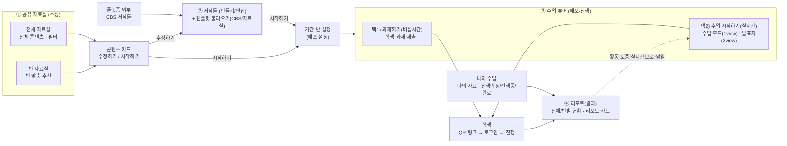
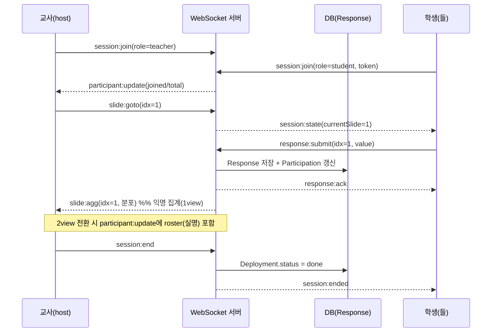
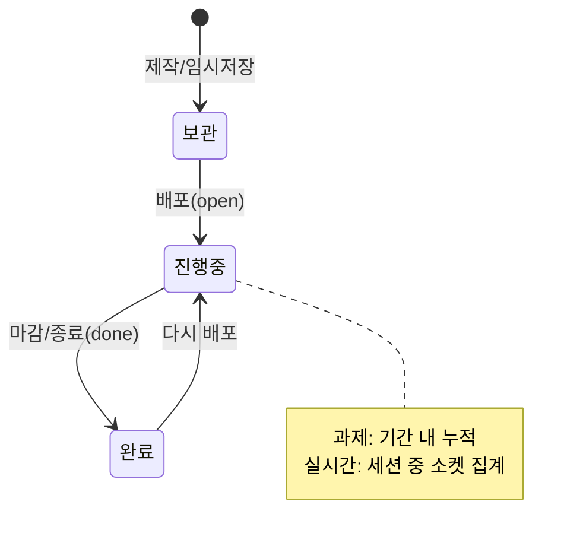

# 수업(Class) 서비스 기획서 — README

> **한 줄 정의**: 교사가 SEL(사회정서학습) 활동을 **만들고 → 반에 배포하고 → (과제/실시간으로) 진행하고 → 결과를 리포트로 확인**하는, 비상교육 학심정 플랫폼의 수업 도구.
>
> 이 문서 하나로 기획·디자인·개발·영업 누구나 "수업" 서비스를 설명하고 착수할 수 있게 하는 것이 목표입니다.
> 참고 산출물: 메인 플로우 이미지(수업 > 메인 플로우), 인터랙티브 목업 `everyclass-v2.html`, 설계 문서 `05-data-model.md`, `09~11`.
> 작성 기준일: 2026-07-16

---

## 목차
1. [서비스 정의](#1-서비스-정의)
2. [페르소나](#2-페르소나)
3. [정보 구조(IA)](#3-정보-구조-ia)
4. [메인 플로우](#4-메인-플로우)
5. [Depth별 상세 설명](#5-depth별-상세-설명)
6. [데이터 모델](#6-데이터-모델)
7. [개발 방안(아키텍처)](#7-개발-방안-아키텍처)
8. [실시간 소켓 연결 방안](#8-실시간-소켓-연결-방안)
9. [상태·정합성 규칙](#9-상태정합성-규칙)
10. [범위·우선순위](#10-범위우선순위)

---

## 1. 서비스 정의

### 무엇을(What)
교사가 **감정·관계·자기이해** 같은 SEL 활동을 **슬라이드(세트지)** 형태로 제작·배포하고, 학생 참여 응답을 수집·집계하는 **캔버스형 수업 도구**.

### 왜(Why)
- 학심정 **검사**로 학생의 심리·정서 상태를 파악한 뒤, **수업**에서 그에 맞는 활동으로 개입하는 흐름을 완성.
- 교사가 결과를 **반/학생/슬라이드 단위로 근거 있게** 확인 → 관찰 기록·수업 발표·상담 자료로 활용.

### 포지셔닝
- 벤치마킹: 매쓰캔버스(MATH CANVAS), 젤리보드 → "캔버스 활동 + 결과 리포트" 패턴을 **SEL 맥락**으로 재구성.
- 검사·코칭·AI 어시스턴트와 함께 **학심정 플랫폼의 1Depth 대메뉴** 중 하나("수업")로 존재.

### 핵심 루프
```
소싱(자료실) → 제작(저작툴) → 배포(과제/실시간) → 진행(참여) → 리포트(결과)
```

---

## 2. 페르소나

### P1. 교사 — 김민지 (주 사용자)
- 중학교 2학년 담임 겸 상담 담당. SEL·정서 지도에 관심, 디지털 도구는 "간단하면 쓴다".
- **목표**: 준비 시간을 줄이면서, 학생 정서 상태를 수업 중/후에 빠르게 파악하고 싶다.
- **행동**: 자료실에서 활동을 가져와 살짝 편집 → 반에 배포 → 실시간 수업 또는 과제로 진행 → 결과보기로 참여·응답 확인 → 미제출 학생 리마인드.
- **불편(Pain)**: 목록과 상세의 수치가 안 맞음, 개별 답안이 한 화면에 다 노출됨, "누가 무엇을 냈는지" 찾기 어려움.

### P2. 학생 — 중2 참여자 (부 사용자)
- **목표**: 링크/QR로 빠르게 들어가 부담 없이 응답하고 싶다.
- **행동**: QR·링크 접속 → (로그인) → 활동 뷰어에서 슬라이드별 응답 제출 → 완료 시 내 결과 다시보기.
- **불편**: 로그인 번거로움, 실시간 수업에서 내 화면이 뒤처짐/끊김.

### P3. (선택) 학년부장/관리자
- 반·학년 단위 참여·결과 집계를 **export**로 받아보는 정도. 이번 범위에서는 인터페이스만 고려.

---

## 3. 정보 구조(IA)

```
학심정 플랫폼
├─ 1Depth 대메뉴: 검사 · 코칭 · 수업 · AI 어시스턴트
│                              └────────── (본 문서)
└─ 수업 (2Depth)
   ├─ ① 공유 자료실           ← 소싱
   │    ├─ 전체 자료실 (전체 콘텐츠 · 필터)
   │    └─ 반 자료실 (반 맞춤 추천)
   └─ ② 나의 수업
        ├─ 나의 자료           ← 제작·관리(저작툴 진입, 배포 액션)
        └─ 수업 결과보기        ← 리포트(전체/반 현황 + 카드 + 상세)
              상태: 진행예정 · 진행중 · 완료

플랫폼 외부: CBS 저작툴 (콘텐츠 소스 연동)
```

- **좌측 LNB**의 `전체 / 2-3반 / 2-4반 / 2-5반` 선택 → 현황·자료실의 **스코프**를 결정.
- 상단 브레드크럼으로 depth 표시: `수업 › 나의 수업 › 수업 결과보기 › {세트지}`.

---

## 4. 메인 플로우

> 아래 다이어그램은 "수업 > 메인 플로우" 이미지를 그대로 옮긴 것입니다.



**두 가지 진행 방식**
- **택1) 과제(비실시간)**: 배포 기간 안에 학생이 각자 응답 제출. 결과는 마감까지 누적.
- **택2) 실시간(수업 모드)**: 교사가 슬라이드를 넘기며 진행, 학생 응답이 **실시간 집계**로 쌓임. **1view**(교사 슬라이드+익명 집계) ↔ **2view 발표자 모드**(교사 자료 / 학생 실명 현황) 전환.

> ℹ️ 현재 `everyclass-v2.html` 목업의 **결과보기**는 시연 단순화를 위해 과제/실시간 구분을 없애고 **배포 기간 기준**으로 통합했습니다. 본 기획서는 이미지 기준의 **완성형 서비스**를 정의하며, 실시간(소켓)은 8장에서 다룹니다.

---

## 5. Depth별 상세 설명

### 1Depth — 대메뉴 (검사 · 코칭 · 수업 · AI 어시스턴트)
- 상단 GNB에 쉐브론(›)으로 위계 표시. 본 범위는 **수업**만 실제 동작, 나머지는 placeholder.
- AI 어시스턴트는 우측 하단 **플로팅 버튼(FAB)** 으로 상시 노출(현재 화면 맥락 기반 도움).

### 2Depth ① 공유 자료실 (소싱)
- **전체 자료실**: 전체 콘텐츠 카드(썸네일·출처·SEL 영역·조회/저장). 필터(출처·SEL·학교급·검색). 카드 액션: **미리보기 · 바로 사용(→저작툴) · 링크복사(QR)**.
- **반 자료실**: LNB에서 반을 고르면 **반 맞춤 추천**(상담기반 강점 도안, 검사요인 맞춤, 성장 로드맵)으로 전환.

### 2Depth ② 저작툴 (만들기/편집)
- 좌측 슬라이드 목록 + 중앙 캔버스 + 툴바(텍스트/이미지/도형/펜).
- **템플릿 추가 기능**: CBS/자료공유실 **불러오기**, 문항형·SEL(학심정)용 템플릿.
- 편집 잠금: **배포중/완료는 복제만** 가능(원본 보호).
- 완료 시 **[배포하기]** → 배포 설정.

### 배포 설정
- 대상 **반 선택** + **진행 방식(과제/실시간)** + **기간(시작~마감)** + 채널(QR/링크).
- 배포 순간 세트지 상태가 `open`이 되고 QR·링크 발급.

### 2Depth ③ 수업 뷰어 (배포·진행)
- **과제(비실시간)**: 학생이 기간 내 각자 제출.
- **실시간(수업 모드)**:
  - **1view(수업 모드)**: 교사 슬라이드 + 문항별 **익명 실시간 집계**(막대), 넘김·타이머·참여수·종료, 접속 QR.
  - **2view(발표자 모드)**: 듀얼 — 교사 자료·노트 / 학생 **실명** 현황.
- **학생**: QR·링크 접속 → (로그인) → 활동 뷰어 → 제출 → 완료 시 다시보기.

### 2Depth ② 나의 수업 — 수업 결과보기 (리포트) ★
> 상세 설계는 [11-수업-리포트-기획서.md](11-수업-리포트-기획서.md) 참고. 요약:

- **상단 학습현황(스코프 연동)** KPI 4종: `현재 진행 중인 활동 · 이번 주 진행한 활동 · 평균 참여율 · 미제출` (+반 스코프는 미제출 학생 칩·리마인드).
- **하단 리포트 카드**: 상태 필터(전체/진행예정/진행중/완료). 카드 = 상태 배지·반·제목·`📅 배포 기간`·참여 n/m·[결과보기]. **상태 무관 균일 크기**.
- **리포트 상세(인라인 전환)**: `← 돌아가기` + `↗ 내보내기` / 요약 타일(참여·완성도·시간·**조건부 정답률**) / **탭 2개**:
  - **슬라이드별 보기** — 좌: 슬라이드 리스트, 우: 문항형 분포+정답률 / 서술형은 **답안 기본 숨김→클릭 시 펼침**.
  - **학생별 보기** — 좌: 학생 리스트, 우: 학습요약 + 슬라이드별 응답 타임라인(+캡처/활동 다시보기).

---

## 6. 데이터 모델

```mermaid
erDiagram
  GROUP ||--o{ STUDENT : has
  GROUP ||--o{ DEPLOYMENT : targets
  CONTENT ||--o{ SLIDE : contains
  CONTENT ||--o{ DEPLOYMENT : deployed-as
  DEPLOYMENT ||--o{ RESPONSE : collects
  STUDENT ||--o{ RESPONSE : submits
  SLIDE ||--o{ RESPONSE : answered-in

  GROUP { string id; string name }
  STUDENT { string id; string name; string status }
  CONTENT { string id; string title; string status }
  SLIDE { string id; int idx; string kind; string title; json options; int correct }
  DEPLOYMENT { string id; string mode; string status; date start; date end; string channel }
  RESPONSE { string id; string studentId; int slideIdx; string value; bool correct; int timeSec; datetime submittedAt }
  PARTICIPATION { string deployId; int joined; int total; float rate }
```

| 엔티티 | 핵심 필드 | 비고 |
|---|---|---|
| **Content(세트지)** | `status(scrap/draft/ready/open/done)`, `slides[]` | 편집은 보관 상태일 때만 |
| **Slide** | `kind`, (문항형) `options`·`correct` | kind = 활동형(개방)·문항형(정답) |
| **Deployment(배포)** | `mode(assignment/live)`, `status(open/closed)`, `start~end`, `channel(qr/link)` | 마감 지나면 제출 불가 |
| **Response(응답)** | `studentId·slideIdx·value·correct·timeSec·submittedAt` | **리포트의 원자 단위**, value=null=미제출 |
| **Participation** | `joined/total/rate` | 집계 캐시 (목록·상세 동일 소스) |

**집계 API(순수 함수)**
- `slideAgg(deployId, slideIdx)` → `{responded, total, distribution}`
- `lessonParticipation(deployId)` → `{joined, total, rate, unsubmitted[]}`
- `studentResponses(deployId, studentId)` → `Response[]`

---

## 7. 개발 방안 (아키텍처)

### 7-1. 프론트엔드
- **현재 목업**: 단일 HTML + 인라인 CSS/JS. 전역 `nav` 상태 + `render()`가 `innerHTML` 재생성.
- **양산 전환 권장**: 컴포넌트 프레임워크(React/Vue) + 상태관리. 목업의 순수 렌더 함수를 컴포넌트로 승격.

| 목업 함수 | → 컴포넌트 |
|---|---|
| `renderStatusPanel` | `<StatusPanel scope>` (KPI 4 + 미제출칩) |
| `renderReportList` | `<ReportCardGrid filter>` |
| `renderReportDetail` | `<ReportDetail>` (요약 + 탭) |
| `renderRdSlides`/`slideDetailHTML` | `<SlideTab>`(좌 리스트 / 우 상세) |
| `renderRdStudents` | `<StudentTab>`(좌 리스트 / 우 타임라인) |
| `slideAgg`·`participation`·`accuracy` | 서버 집계 API로 이관 |

### 7-2. 백엔드 (REST)
```
GET   /me/lessons?scope=all|classId      # 나의 수업 목록(상태 포함)
GET   /lessons/{id}                       # 세트지 메타 + 슬라이드
POST  /lessons/{id}/deploy                # 배포(과제/실시간·기간·채널)
GET   /deploys/{id}/report                # 리포트 집계(참여율·슬라이드·정답률)
GET   /deploys/{id}/slides/{idx}/agg      # 슬라이드 분포
GET   /deploys/{id}/students/{sid}        # 학생 응답 타임라인
POST  /deploys/{id}/responses             # 학생 응답 제출(폴백 경로)
POST  /deploys/{id}/remind                # 미제출 리마인드
GET   /deploys/{id}/export?format=pdf     # 결과 내보내기
```

### 7-3. 원칙
- **집계는 서버 단일 소스**: 목록 카드의 참여수 = 상세 요약 = 슬라이드/학생 뷰 수치가 항상 일치.
- **개인정보**: 서술형 답안은 목록/집계 화면에서 기본 숨김, 명시적 조회 시에만 반환.
- **조건부 정답률**: 세트지에 문항형 슬라이드가 있을 때만 정답률 필드 반환.

---

## 8. 실시간 소켓 연결 방안

> "실시간 수업 모드"와 "리포트가 활동 도중 실시간으로 쌓임"을 담당. WebSocket(권장: Socket.IO/native WS) 사용.

### 8-1. 방(Room) 구조
- **룸 = `session:{deployId}`**. 한 배포(수업)당 하나의 룸.
- 참가자 역할: **teacher(host)**, **student(participant)**.
- 인증: 접속 시 발급 토큰(QR/링크에 포함) 검증 → studentId/teacherId 확정.

### 8-2. 이벤트 프로토콜

**클라이언트 → 서버**
| 이벤트 | payload | 발신 |
|---|---|---|
| `session:join` | `{deployId, role, token, studentId?}` | 공통 |
| `slide:goto` | `{slideIdx}` | 교사 |
| `response:submit` | `{slideIdx, value}` | 학생 |
| `view:switch` | `{view: "1view"\|"2view"}` | 교사 |
| `session:end` | `{}` | 교사 |
| `ping` | `{}` | 공통(하트비트) |

**서버 → 클라이언트**
| 이벤트 | payload | 수신 |
|---|---|---|
| `session:state` | `{currentSlide, deploy, joined, total}` | 재접속 복구 |
| `participant:update` | `{joined, total, roster?}` | roster(실명)는 **2view 교사에게만** |
| `slide:agg` | `{slideIdx, distribution, responded, total}` | 교사(1view, **익명**) |
| `response:ack` | `{slideIdx, ok}` | 해당 학생 |
| `session:ended` | `{}` | 공통 |

### 8-3. 시퀀스 (실시간 수업)



### 8-4. 리포트와의 연결
- 모든 `response:submit`은 **DB에 즉시 저장** → 리포트는 같은 DB를 읽으므로 **"활동 도중 실시간으로 쌓임"** 이 자연히 성립.
- 진행 중 세트지의 결과보기는 `slide:agg` 스트림을 구독하면 라이브로 갱신 가능.

### 8-5. 성능·신뢰성
- **브로드캐스트 디바운스**: 집계는 매 제출이 아니라 ~500ms/또는 N건 단위로 묶어 전송(플러딩 방지).
- **재연결**: 끊기면 클라이언트가 `session:join` 재전송 → 서버가 `session:state`로 현재 상태 리플레이.
- **오프라인 큐**: 학생 제출은 로컬 큐에 쌓았다 재연결 시 전송, 서버는 `(studentId, slideIdx)` 멱등 처리.
- **폴백**: WS 불가 환경 → 학생 제출은 `POST /responses`, 교사 1view는 `GET /slides/{idx}/agg` **폴링(3~5s)**.
- **스케일**: 룸 단위 팬아웃, 다중 인스턴스는 Redis Pub/Sub 어댑터로 브로드캐스트 공유.

---

## 9. 상태·정합성 규칙

### 세트지 상태 흐름


- **편집 잠금**: 보관 상태에서만 편집, 진행중/완료는 복제만.
- **정합성**: 카드 참여수 = 상세 참여수 = 슬라이드/학생 뷰 합계 (단일 집계 소스).
- **개인정보**: 개별 서술형 답안은 의도적 조회 시에만 노출.

---

## 10. 범위·우선순위

**우선순위 1 (핵심)**
- 자료실 카드·미리보기·바로 사용·링크복사(QR)
- 저작툴 기본 요소·슬라이드 조작·불러오기·임시/저장·배포
- 뷰어: 배포(기간)·QR/링크·수업 모드·발표자 모드
- 리포트: 전체·반별 현황 + 세트지별(슬라이드별/학생별) + 개인 결과
- 학생: 로그인·활동 뷰어→제출·내 결과

**우선순위 2 / 범위 밖**
- 필터 대폭 확장·추천 고도화·배포 예약·알림·조별 활동
- 활동 과정 **영상 리플레이/캡처 전송** 실제 재생
- 리마인드 실제 발송, 내보내기(PDF) 실제 생성
- 검사·코칭 딥링크(학생 심리·정서 데이터 연결), 관리자 export

---

## 부록. 참고 문서
- 리포트 상세 스펙: [11-수업-리포트-기획서.md](11-수업-리포트-기획서.md)
- 현황/리포트 재설계: [09-현황리포트-재설계.md](09-현황리포트-재설계.md)
- v2 화면안: [10-수업화면안-v2.md](10-수업화면안-v2.md)
- 데이터 모델: [05-data-model.md](05-data-model.md)
- 목업: `everyclass-v2.html`
