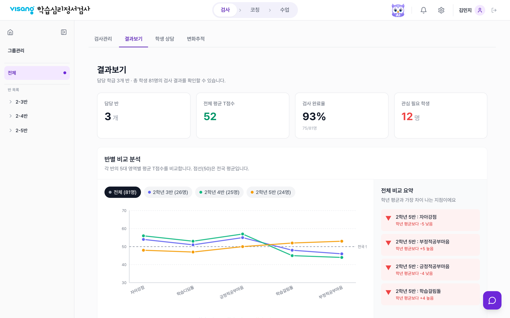
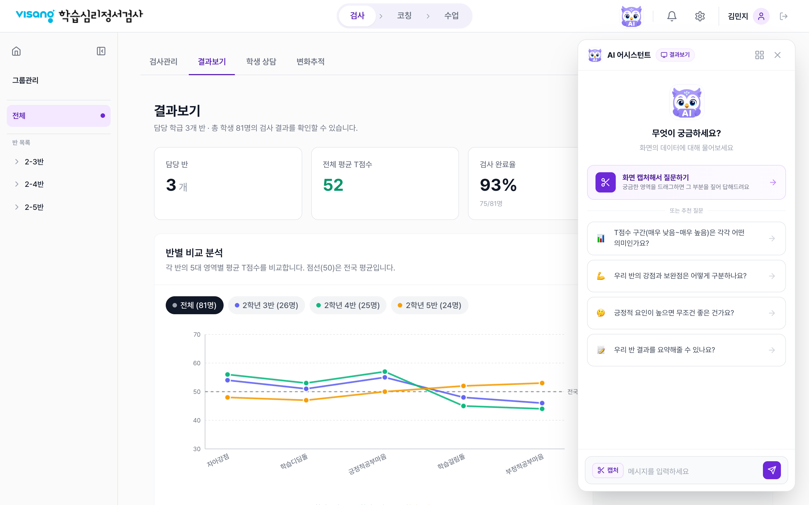
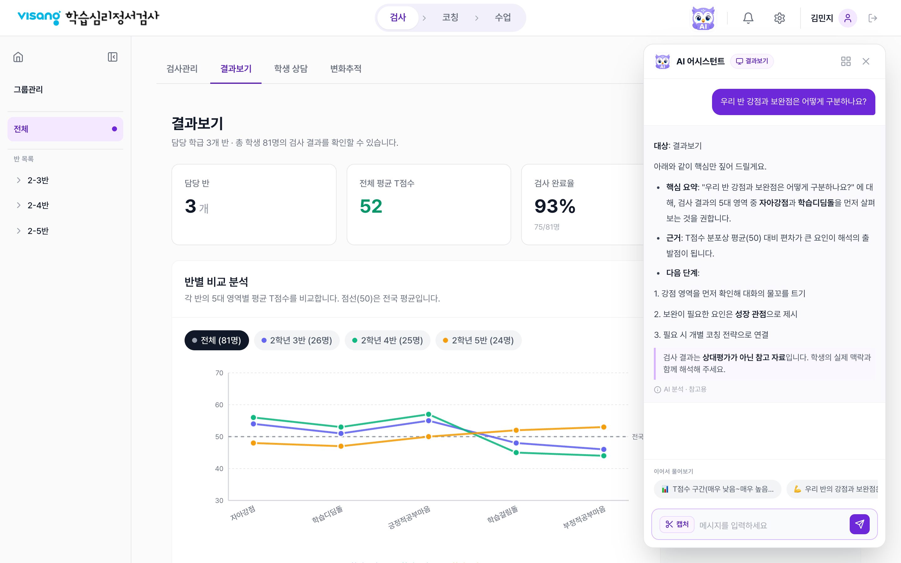
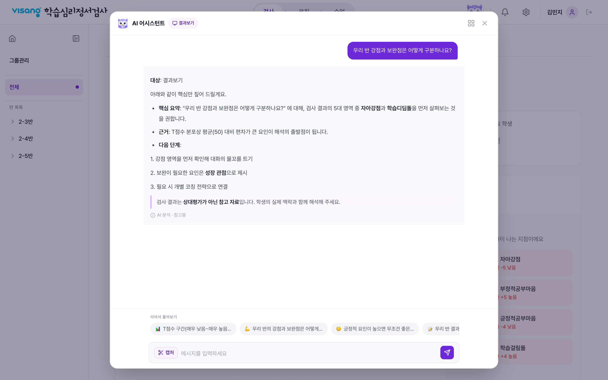
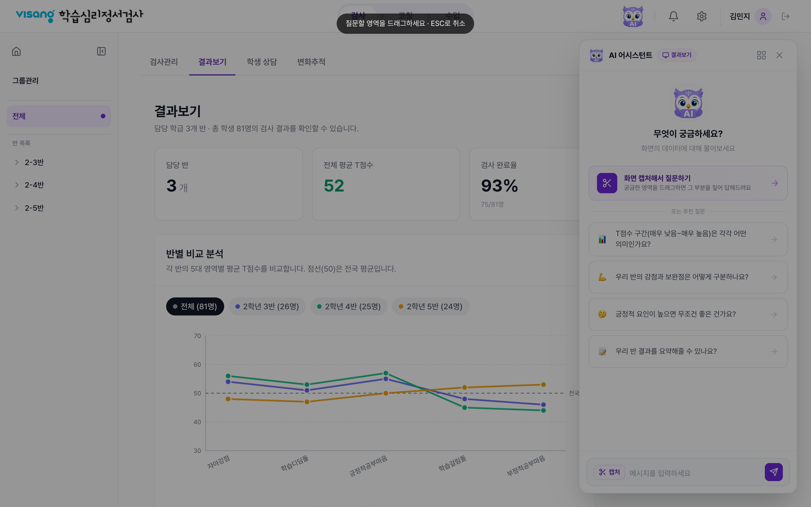
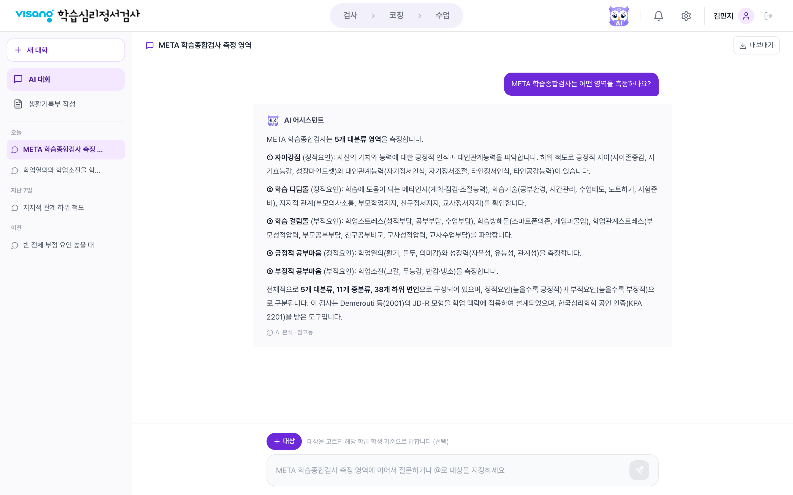
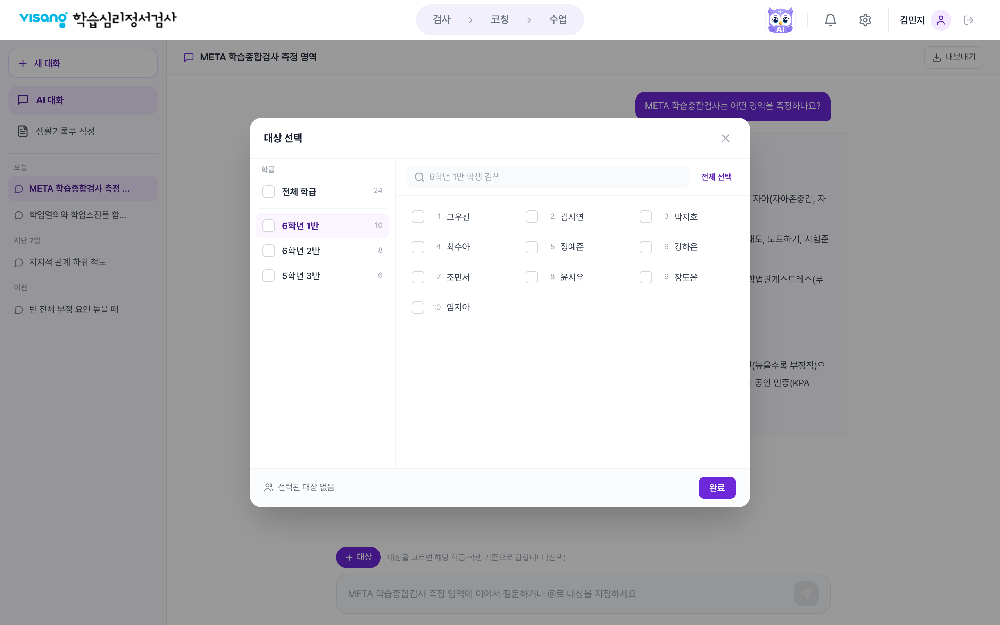
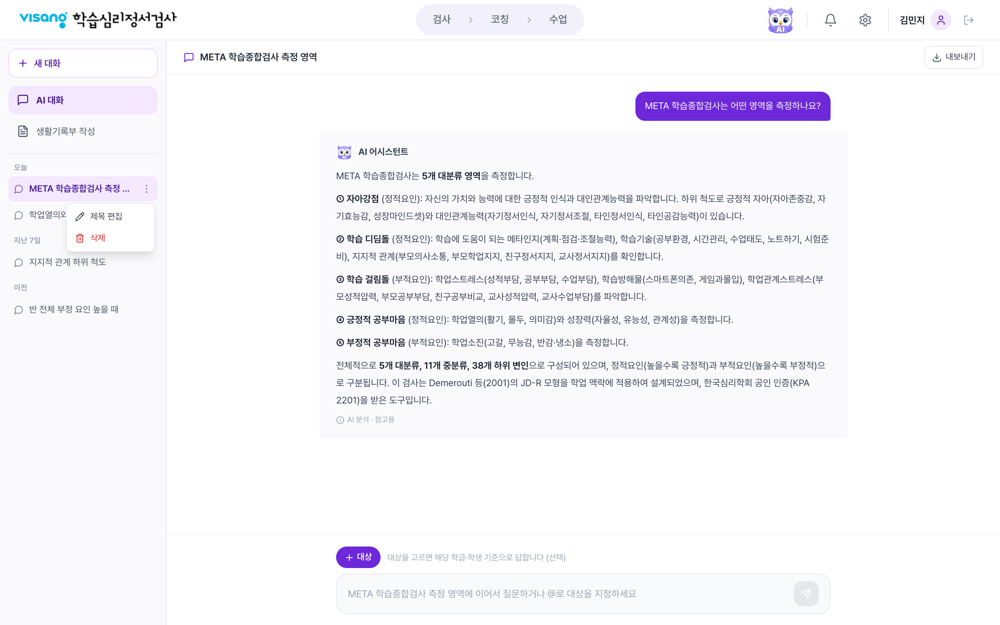
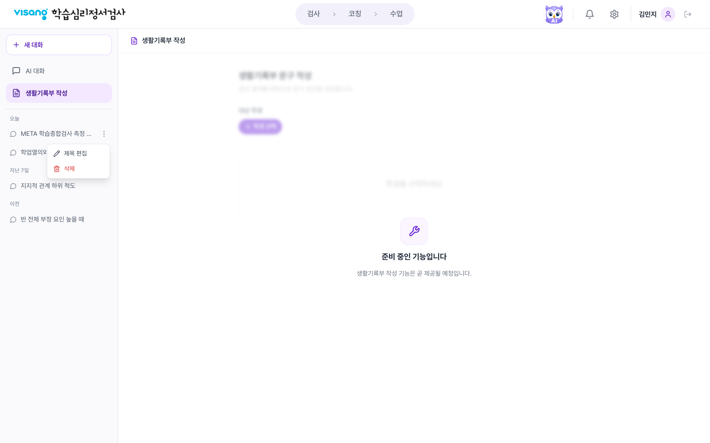

# AI 어시스턴트 스토리보드 (SB)

> 화면 단위 스토리보드. 각 화면의 실제 캡처 + 구성요소 · 인터랙션 · 비고.
> 기능 상세는 [`기능정의서.md`](./기능정의서.md) 참조 | 캡처 기준: prototype

## 화면 목록

| SB | 화면 ID | 화면명 | 영역 |
|----|---------|--------|------|
| SB-A1 | FLT-BUBBLE | 플로팅 챗봇 - 버블 | A |
| SB-A2 | FLT-EMPTY | 플로팅 챗봇 - 코너/빈 화면 | A |
| SB-A3 | FLT-CHAT | 플로팅 챗봇 - 대화 | A |
| SB-A4 | FLT-FULL | 플로팅 챗봇 - 전체화면 | A |
| SB-A5 | FLT-CAPTURE | 플로팅 챗봇 - 화면 캡처 | A |
| SB-B1 | PAGE-CHAT | 어시스턴트 페이지 - AI 대화 | B |
| SB-B2 | PAGE-TARGET | 어시스턴트 페이지 - 대상 선택 모달 | B |
| SB-B3 | PAGE-HISTORY | 어시스턴트 페이지 - 히스토리 메뉴 | B |
| SB-B4 | PAGE-RECORD | 어시스턴트 페이지 - 생활기록부(준비 중) | B |

---

## SB-A1 · 플로팅 챗봇 - 버블 (FLT-BUBBLE)

- **구성요소**: 서비스 화면(결과보기) 우측 하단 52×52 보라 버블(채팅 아이콘).
- **인터랙션**: 버블 클릭 → 코너 모드로 열림(SB-A2). hover 시 살짝 확대.
- **비고**: 모든 보호 화면 위에 오버레이. 래퍼는 `pointer-events:none`로 뒤 화면 클릭 허용.

## SB-A2 · 플로팅 챗봇 - 코너/빈 화면 (FLT-EMPTY)

- **구성요소**: 헤더(부엉이 + `AI 어시스턴트` + `🖥 결과보기` 화면 배지 + ⊞/✕), 부엉이 일러스트 + `무엇이 궁금하세요?`, **화면 캡처 CTA**(강조), `또는 추천 질문` 구분선 + 화면별 추천 질문 리스트, 하단 컴포저(캡처 버튼 + 입력 + 전송).
- **인터랙션**: 추천 질문/캡처 CTA 클릭 → 즉시 실행. 헤더 드래그 이동, 상단·좌측 핸들로 리사이즈. ⊞ → 모드 팝오버.
- **비고**: 추천 질문은 현재 화면(결과보기) 기준. LNB에서 학생 선택 시 학생 단위로 교체.

## SB-A3 · 플로팅 챗봇 - 대화 (FLT-CHAT)

- **구성요소**: 사용자 말풍선(우측), 봇 전체폭 블록 답변(마크다운 + `AI 분석 · 참고용`), `이어서 물어보기` 칩, 컴포저.
- **인터랙션**: Enter 전송, 응답 생성 중 `분석 중` 인디케이터. 이미 물어본 추천 질문은 `이어서 물어보기`에서 제외.
- **비고**: 이 대화는 공유 히스토리에 `결과보기` 화면 태그로 저장됨.

## SB-A4 · 플로팅 챗봇 - 전체화면 (FLT-FULL)

- **구성요소**: 딤 배경 위 중앙 패널(`min(920px,92vw)`), 내용 760 중앙 정렬. 헤더/메시지/이어서 물어보기/컴포저.
- **인터랙션**: ⊞ 팝오버에서 `전체화면` 선택 시 진입. 이동·리사이즈 불가. ✕로 종료.
- **비고**: 몰입형 읽기/작성용. 뒤 대시보드를 밀어내지 않고 위에 얹힘.

## SB-A5 · 플로팅 챗봇 - 화면 캡처 (FLT-CAPTURE)

- **구성요소**: 전체화면 crosshair 오버레이 + 상단 안내(`질문할 영역을 드래그하세요 · ESC로 취소`).
- **인터랙션**: 컴포저의 `✂ 캡처` → 오버레이 진입 → 드래그로 영역 선택(최소 20×20) → 첨부 미리보기 카드 생성 + placeholder 전환. ESC 취소.
- **비고**: 현재 **영역 선택·치수(w×h)까지만** 구현(실제 픽셀 캡처 미구현). 개발 시 캡처 방식 결정 필요.

---

## SB-B1 · 어시스턴트 페이지 - AI 대화 (PAGE-CHAT)

- **구성요소**: 상단 GNB 유지(부엉이 활성) · 좌측 LNB(＋새 대화 / AI 대화·생활기록부 / 히스토리 오늘·지난7일·이전) · 제목 바(`↓ 내보내기`) · 본문(사용자 말풍선 + 부엉이 헤더 블록 답변) · 하단 컴포저(`＋대상` + 입력).
- **인터랙션**: 히스토리 클릭 → 대화 복원. `＋대상`/`@` → 대상 선택 모달(SB-B2). `내보내기` → .md 다운로드.
- **비고**: 진입 시 mock 대화(META 측정 영역)가 기본 표시. GNB가 유지되어 다른 메뉴로 자연 이동.

## SB-B2 · 어시스턴트 페이지 - 대상 선택 모달 (PAGE-TARGET)

- **구성요소**: 좌 학급 목록(`전체 학급` + 학급별 체크·인원수), 우 학생 그리드(검색 + `전체 선택`), 하단(`선택 N명` + `전체 해제` + `완료`).
- **인터랙션**: 학급 체크 = 그 반 전체 / `전체 학급` = 모든 반 / 학생 개별 체크 / 검색 후 일괄 선택. 배경·ESC·완료로 닫기. 선택 결과는 학급 단위 요약 칩으로 입력창 위에 표시.
- **비고**: 다중 학급 + 대인원(40명+) 대응. 부분 선택은 학급 체크에 indeterminate 표시.

## SB-B3 · 어시스턴트 페이지 - 히스토리 메뉴 (PAGE-HISTORY)

- **구성요소**: 히스토리 항목 hover 시 ⋮ 버튼 → 드롭다운(`제목 편집` / `삭제`). 본문은 META 답변(부엉이 헤더 + 마크다운 블록).
- **인터랙션**: `제목 편집` → 인라인 입력(Enter 저장/Esc 취소). `삭제` → 대화 제거(활성 삭제 시 자동 전환). 바깥 클릭으로 메뉴 닫힘.
- **비고**: 플로팅 챗봇 대화는 화면 배지가 상세보기(제목 바)에 표시됨.

## SB-B4 · 어시스턴트 페이지 - 생활기록부(준비 중) (PAGE-RECORD)

- **기획 완료 후 리뷰 예정**

---

**캡처 환경**: 1440×900 @2x, mock 데이터 기준. 실제 데이터/응답 연동 시 콘텐츠만 달라지며 레이아웃은 동일.
