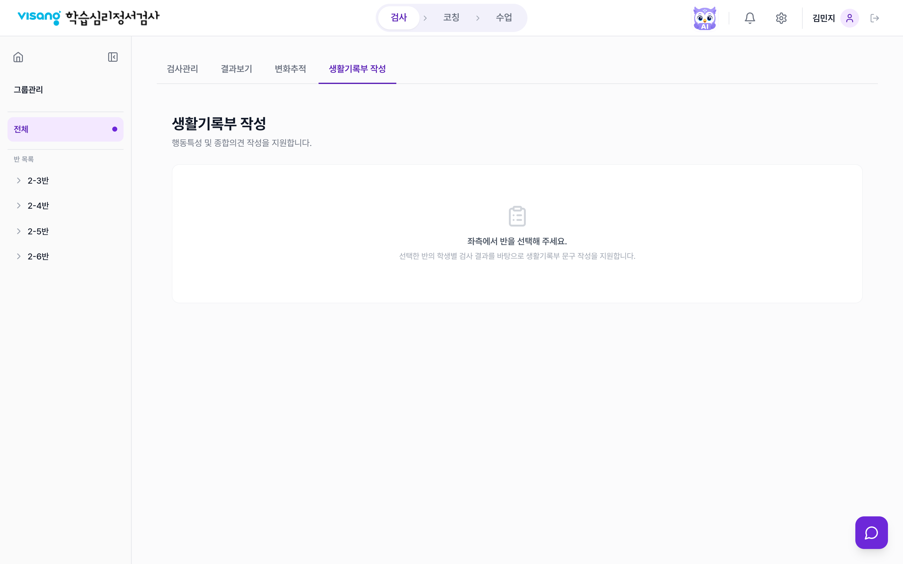
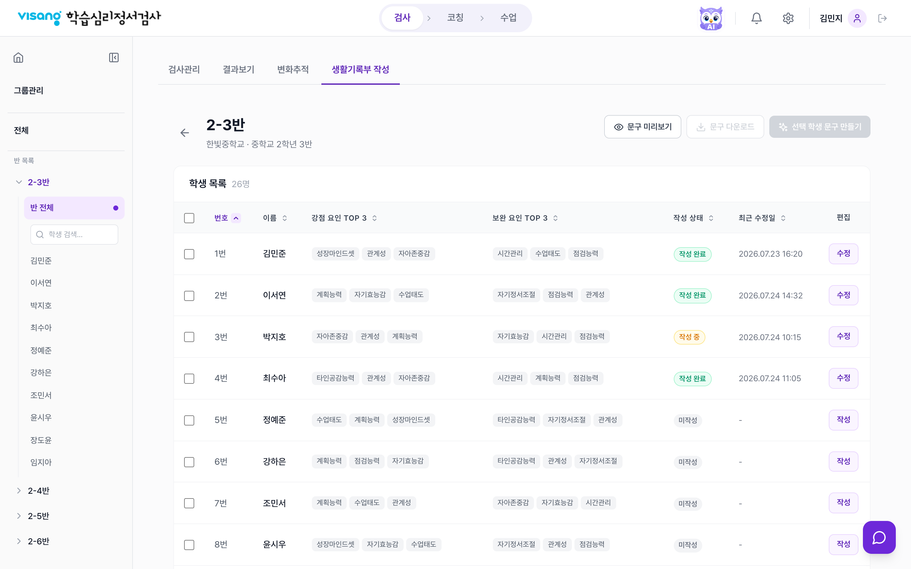
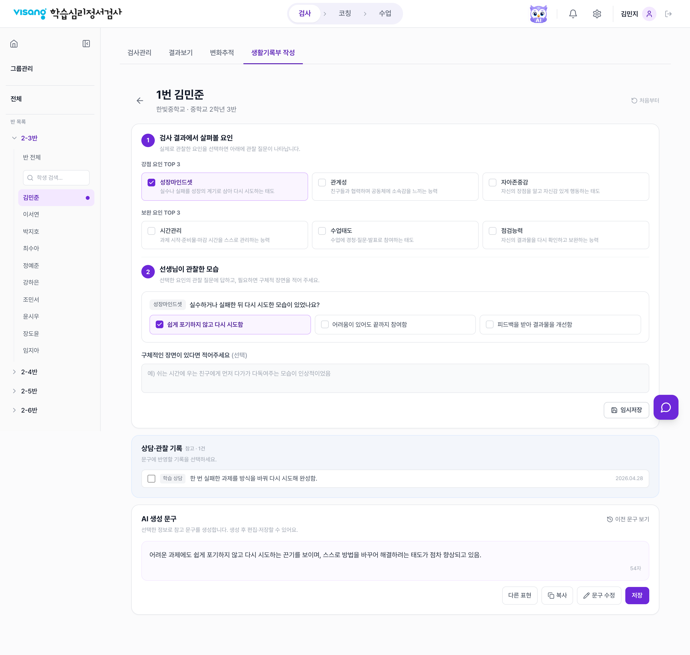
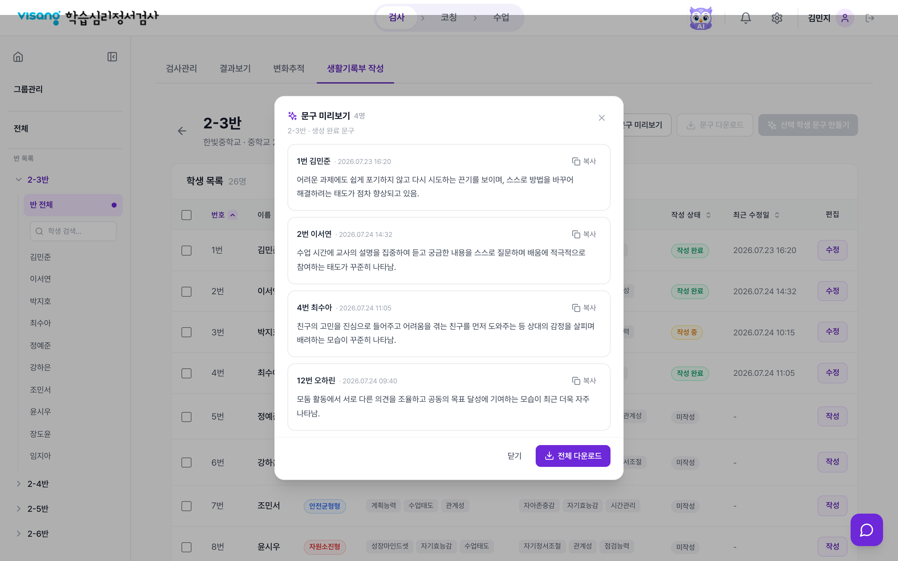
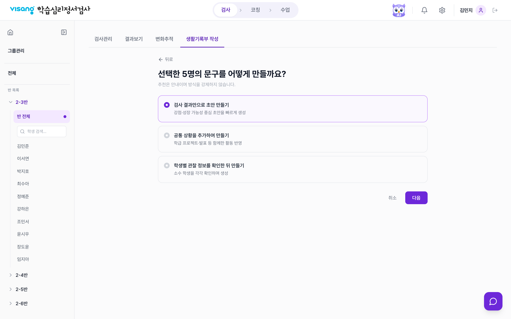
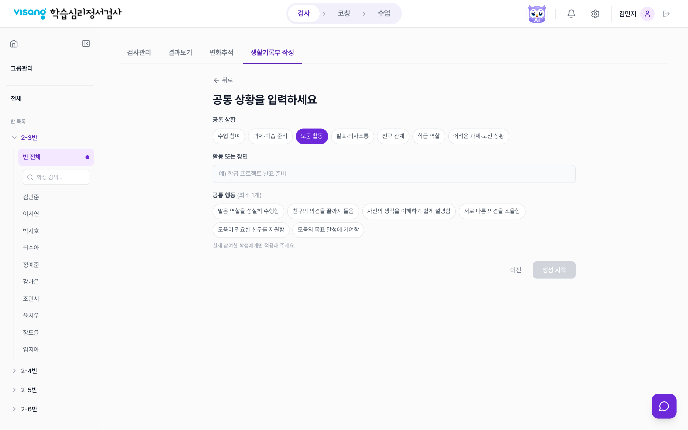
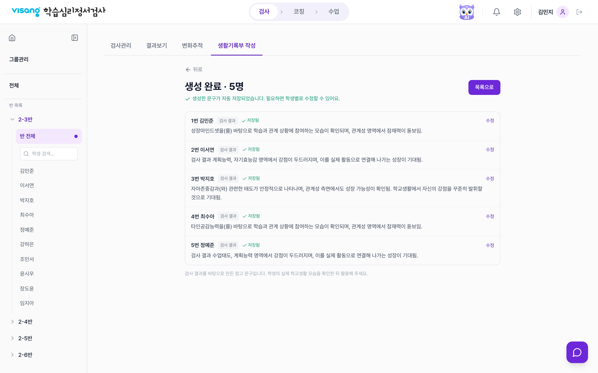

# 생활기록부 작성 지원 스토리보드 (SB)

> 화면 단위 스토리보드. 각 화면의 실제 캡처 + 구성요소 · 인터랙션 · 비고.
> 기능 상세는 [`기능정의서.md`](./기능정의서.md) 참조 | 캡처 기준: prototype (검사 > 생활기록부 작성 탭)

## 화면 목록

| SB | 화면 ID | 화면명 |
|----|---------|--------|
| SB-1 | REC-EMPTY | 학급 미선택 (반 선택 유도) |
| SB-2 | REC-LIST | 학급 현황 — 학생 목록 |
| SB-3 | REC-WRITE | 학생별 작성 |
| SB-4 | REC-PREVIEW | 문구 미리보기 모달 |
| SB-5 | REC-BULK-METHOD | 일괄 생성 — 방식 선택 |
| SB-6 | REC-BULK-COMMON | 일괄 생성 — 공통 상황 입력 (방식 B) |
| SB-7 | REC-BULK-RESULT | 일괄 생성 — 결과(자동 저장) |

> 위치: 상단 GNB **검사** > 하위 서브탭 **생활기록부 작성**(`/exam/record`). 학급·학생 선택은 좌측 LNB(스코프)에서 수행.

---

## SB-1 · 학급 미선택 (REC-EMPTY)

**구성요소**

1. 검사 서브탭 바 — 검사관리 · 결과보기 · 변화추적 · **생활기록부 작성**(활성)
2. `생활기록부 작성` 제목 + 부제("행동특성 및 종합의견 작성을 지원합니다")
3. 안내 카드 — `좌측에서 반을 선택해 주세요`

**인터랙션**

1. 좌측 LNB `반 목록`에서 반 클릭 → 해당 학급 현황(SB-2)

**비고**

- 스코프가 '전체'일 때의 기본 화면
- 반 미선택 시 목록 대신 안내 카드만 노출

---

## SB-2 · 학급 현황 — 학생 목록 (REC-LIST)

**구성요소**

1. 상세 헤더 — ← 뒤로 + 반 이름 + `학교명 · 학교급 학년 반` 부제
2. 우측 액션 — 문구 미리보기 · 문구 다운로드 · 선택 학생 문구 만들기
3. 학생 목록 표 컬럼 — 체크박스 · 번호 · 이름 · 강점 요인 TOP 3 · 보완 요인 TOP 3 · 작성 상태 · 최근 수정일 · 편집

**인터랙션**

1. 표 헤더 클릭 → 정렬(오름/내림 토글 · 활성 ▲/▼ · 비활성 ⇅)
2. 이름 / 편집 클릭 → 학생별 작성(SB-3)
3. 체크 후 `선택 학생 문구 만들기` → 1명=개별 작성, 2명 이상=일괄 생성(SB-5)
4. `문구 미리보기` / `문구 다운로드`(CSV)

**비고**

- LNB에서 학생 클릭해도 SB-3로 진입(수정/작성 버튼과 동일)
- 최근 수정일: 작성 중 학생도 표기(임시저장 시각), 미작성은 `-`

---

## SB-3 · 학생별 작성 (REC-WRITE)

**구성요소**

1. 학생 상세 헤더 — ← 뒤로 + `N번 이름` + `학교명 · 학교급 학년 반` + 처음부터
2. **① 검사 결과에서 살펴볼 요인** — 강점/보완 요인 각 한 행(정의 설명 포함 체크박스 카드)
3. **② 선생님이 관찰한 모습** — 선택 요인별 관찰 질문 + 행동 옵션 그리드 + 구체적 장면 + 임시저장
4. **상담·관찰 기록**(참고) — 문구에 반영할 기록 선택
5. **AI 생성 문구** — 생성 / 다른 표현 / 복사 / 문구 수정 / 저장

**인터랙션**

1. 요인 체크 → 하단 관찰 질문 노출
2. 행동 1개 이상 선택 시 `문구 생성` 활성
3. 생성 후 입력 변경 시 상단 `다시 생성` 배너 노출
4. `이전 문구 보기`(헤더 우측)로 직전 문구 확인·복원

**비고**

- 전체폭 레이아웃(결과보기 학생 화면과 동일 폭)
- 임시저장 시 '작성 중'으로 전환

---

## SB-4 · 문구 미리보기 모달 (REC-PREVIEW)

**구성요소**

1. `문구 미리보기 · N명` 헤더
2. 학생별 카드 — 번호·이름·저장시각 + 문구 + 복사
3. 하단 — 닫기 · 전체/선택 다운로드

**인터랙션**

1. 선택이 있으면 선택 학생, 없으면 반 전체 완료 문구 표시
2. 배경·ESC로 닫기
3. 하단 다운로드 = CSV 저장

**비고**

- `문구 미리보기`는 선택 학생 중 1명 이상 문구가 있으면 활성, 모두 없을 때만 비활성화

---

## SB-5 · 일괄 생성 — 방식 선택 (REC-BULK-METHOD)

**구성요소**

1. `선택한 N명의 문구를 어떻게 만들까요?` 제목
2. 방식 라디오 카드 3종 — 검사 결과만 / 공통 상황 추가 / 학생별 관찰 확인
3. 하단 — 취소 · 다음

**인터랙션**

1. 방식 선택 후 `다음`
2. '공통 상황을 추가하여 만들기' → 공통 상황 입력(SB-6)으로 이동
3. 그 외 두 방식(검사 결과만 / 학생별 관찰 확인) → 폼 없이 바로 생성 진행 후 결과(SB-7)

**비고**

- 목록에서 2명 이상 선택 시 진입 (1명은 개별 작성)

---

## SB-6 · 일괄 생성 — 공통 상황 입력 (REC-BULK-COMMON)

**구성요소**

1. `공통 상황을 입력하세요` 제목
2. **공통 상황** 칩(택 1) — 수업 참여 / 과제·학습 준비 / 모둠 활동 / 발표·의사소통 / 친구 관계 / 학급 역할 / 어려운 과제·도전 상황
3. **활동 또는 장면** 입력 — 예) `학급 프로젝트 발표 준비`
4. **공통 행동** 칩(최소 1개) — 선택한 상황에 맞는 행동 목록
5. 안내문 — "실제 참여한 학생에게만 적용해 주세요"
6. 하단 — 이전 · 생성 시작

**인터랙션**

1. 공통 상황 칩 선택 → 해당 상황의 공통 행동 목록으로 갱신(기존 행동 선택은 초기화)
2. 공통 행동 1개 이상 선택 시 `생성 시작` 활성
3. `생성 시작` → 진행 후 결과(SB-7)
4. `이전` → 방식 선택(SB-5)로 복귀

**비고**

- 방식 선택(SB-5)에서 **'공통 상황을 추가하여 만들기'** 를 고른 경우에만 나타나는 화면
- 입력한 공통 상황·활동·행동은 선택 학생 전원에게 공통 적용되어 문구가 생성됨

---

## SB-7 · 일괄 생성 — 결과(자동 저장) (REC-BULK-RESULT)

**구성요소**

1. `생성 완료 · N명` + "✓ 생성한 문구가 자동 저장되었습니다" 안내
2. 학생별 리스트 — 이름 · 방식 배지 · ✓ 저장됨 · 문구 · 수정
3. 우측 상단 `목록으로`

**인터랙션**

1. 생성 완료 시 전체 결과가 즉시 자동 저장(작성 완료)
2. `수정`으로 개별 보정
3. `목록으로` 복귀

**비고**

- 별도 저장 단계 없음
- 진행 단계에서 학생별 생성 진행(대기 / 생성 중 / 완료) 표시

---

**캡처 환경**: 1440×900 @2x, mock 데이터(2-3반) 기준. 실제 데이터/생성 연동 시 콘텐츠만 달라지며 레이아웃은 동일.
