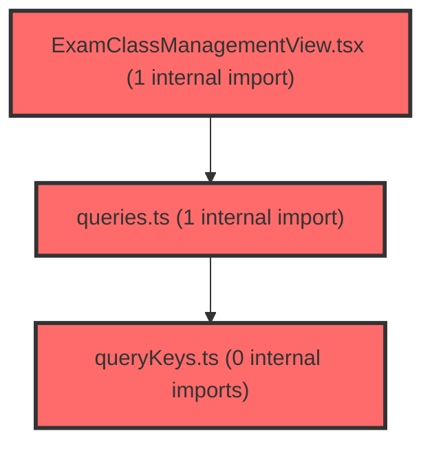

> [!IMPORTANT]
> **⚠️ 수동 검토 권장 (자가힐링 주의)**
>
> AI 자가힐링 결과물이 실제 의도와 다를 수 있으므로, **상세 리뷰 내용에 기반한 수동 점검**을 우선해 주시기 바랍니다. 자가힐링 기능을 활용하실 경우 최종 결과물을 신중하게 확인해 주세요.

# 코드 리뷰 - 007587ea

## 코드 복잡도 분석

**분석된 파일**: 4개 / 변경된 파일: 4개


### Import 의존관계 다이어그램



**범례**: 중심 파일 (변경됨) | 많은 import (10개 이상)


### 정상 범위 (NONE)


**`assessmentservice.ts`** (other)

- 평균 복잡도: **0.003**

- 최대 복잡도: 0.008

- 청크 수: 37개


**권장사항:**

- 파일 크기가 큼 (37개 청크) - 파일 분리 검토


**`queries.ts`** (other)

- 평균 복잡도: **0.003**

- 최대 복잡도: 0.014

- 청크 수: 51개


**권장사항:**

- 파일 크기가 큼 (51개 청크) - 파일 분리 검토


**`querykeys.ts`** (other)

- 평균 복잡도: **0.001**

- 최대 복잡도: 0.003

- 청크 수: 4개


**권장사항:**

- 복잡도 정상 범위


**`examclassmanagementview.tsx`** (component)

- 평균 복잡도: **0.000**

- 최대 복잡도: 0.006

- 청크 수: 80개


**권장사항:**

- 파일 크기가 큼 (80개 청크) - 파일 분리 검토


---


## 변경 배경
이 커밋은 교사용 검사 관리 화면(`ExamClassManagementView`)에서 학생별 제출 여부와 제출일시를 정확하게 표시하기 위한 기능을 추가합니다. 기존에는 `selectedSlot`의 `notSubmittedStudents`와 `submittedCount`를 기반으로 제출 상태를 추정했지만, 이번 변경으로 전용 API(`/api/dgnss/tc/submissions`)를 통해 학생별 제출 상태(`submAt`)와 제출일시(`submDt`)를 직접 조회하여 정확한 데이터를 보여줍니다.

- **목적**: 검사별 학생 제출 여부 및 제출일시를 정확히 조회·표시
- **도메인**: API (프론트엔드 서비스 계층) + UI (React 컴포넌트)
- **변경 방향**: 추정 기반 제출 상태 → 실제 API 데이터 기반으로 전환, 제출일시 컬럼 신설

## [GOOD] 잘된 점
- `ExamSubmission` 인터페이스와 `ExamSubmissionsResponse`를 명확히 분리하여 타입 안정성을 확보했습니다.
- `submissionsQuery.isSuccess` 여부에 따라 API 데이터 우선, 실패 시 기존 로직으로 폴백하는 이중 안전장치를 마련했습니다.
- `formatSubmissionDateTime`에서 `Number.isNaN(date.getTime())` 검증으로 잘못된 날짜를 방어하고, `null`/빈 값에 대해 `'-'`를 반환하는 등 방어적 코딩이 잘 되어 있습니다.
- 로딩/에러 상태에 대한 UI 처리를 추가하고 에러 시 "다시 시도" 버튼을 제공하여 사용자 경험을 개선했습니다.

## 변경사항 요약
검사별 학생 제출 현황을 조회하는 `fetchExamSubmissions` API 함수와 `useExamSubmissionsQuery` 훅을 추가하고, `ExamClassManagementView`에서 이를 활용해 학생별 제출 상태와 제출일시를 표시하도록 개선했습니다. 제출 상태는 API 성공 시 `submAt` 값을 우선 사용하고, 실패 시 기존 추정 로직으로 폴백합니다.

---

## [ISSUE] 개선이 필요한 부분

### Critical (즉시 수정 필요)
없음

### High (우선 수정 권장)

**1. `useExamSubmissionsQuery`의 `dgnssId ?? 0` 및 `dgnssId!` 사용**

`enabled: !!dgnssId`로 가드되어 있어 실제로 `dgnssId`가 0인 경우는 없지만, `queryKey`에 `0`이 들어가고 `queryFn`에서 `dgnssId!` non-null assertion을 사용하는 것은 안전하지 않은 패턴입니다. `dgnssId`가 undefined일 때 `queryKey`가 `['assessment', 'exam-submissions', 0]`으로 생성되어, 이후 실제 `dgnssId=0`이 존재하는 경우 캐시 충돌 가능성이 있습니다.

- **위치**: `queries.ts` 28-34행
- **기존 코드**:
```ts
export const useExamSubmissionsQuery = (dgnssId: number | undefined) =>
  useQuery({
    queryKey: assessmentKeys.examSubmissions(dgnssId ?? 0),
    queryFn: () => fetchExamSubmissions(dgnssId!),
    enabled: !!dgnssId,
    staleTime: 0,
  });
```
- **해결 방안 (수정 코드)**:
```ts
export const useExamSubmissionsQuery = (dgnssId: number | undefined) =>
  useQuery({
    queryKey: assessmentKeys.examSubmissions(dgnssId ?? -1),
    queryFn: () => fetchExamSubmissions(dgnssId as number),
    enabled: !!dgnssId,
    staleTime: 0,
  });
```
`dgnssId ?? -1`로 변경하여 실제 유효한 dgnssId(0 이상)와 충돌하지 않도록 하고, `dgnssId!` 대신 `as number`로 명시적 캐스팅을 사용하는 것이 안전합니다.

**2. `submitted` 로직에서 API 응답에 없는 학생 처리**

`submissionsQuery.isSuccess`일 때 `submission?.submAt === 'Y'`로 판단하는데, API 응답(`students`)에 해당 학생이 포함되지 않은 경우 `submission`이 `undefined`가 되어 `submitted`가 `false`로 처리됩니다. 이는 기존 로직(`hasStarted && hasIdentifiableSubmissionState && !isMissing`)과 다른 동작으로, API 데이터가 불완전할 때 미제출로 잘못 표시될 수 있습니다.

- **위치**: `ExamClassManagementView.tsx` 500-505행
- **기존 코드**:
```ts
submitted: submissionsQuery.isSuccess
  ? submission?.submAt === 'Y'
  : hasStarted && hasIdentifiableSubmissionState && !isMissing,
```
- **해결 방안 (수정 코드)**:
```ts
submitted: submissionsQuery.isSuccess
  ? submission?.submAt === 'Y' || (submission === undefined && hasStarted && hasIdentifiableSubmissionState && !isMissing)
  : hasStarted && hasIdentifiableSubmissionState && !isMissing,
```
API 응답에 학생이 없는 경우 기존 추정 로직으로 폴백하여, 데이터 누락 시에도 정확한 상태를 유지하도록 개선할 수 있습니다.

### Medium (개선 권장)

- **`staleTime: 0`**: 제출 상태는 실시간성이 중요하므로 `staleTime: 0`은 의도된 설정으로 보이나, 화면 전환 시마다 매번 refetch가 발생하여 불필요한 네트워크 요청이 생길 수 있습니다. `refetchInterval`을 활용하거나, 검사 상태가 변경되는 시점(시작/종료)에만 무효화하는 방식이 더 효율적일 수 있습니다.
- **로딩 메시지 의미 변경**: `isMembersLoading || submissionsQuery.isLoading` 조건에서 기존 "학생 목록을 불러오는 중입니다" 메시지가 "학생 제출 현황을 불러오는 중입니다"로 대체되었습니다. `isMembersLoading`이 true인 경우에도 제출 현황 메시지가 표시되어, 학생 목록 로딩 중임을 알리는 기존 UX가 사라졌습니다. 두 로딩 상태를 구분하여 처리하는 것이 좋습니다.
- **`submittedAt` 컬럼의 정렬 기능**: 테이블 헤더에 "제출일시 ↕" 정렬 아이콘이 있지만, 실제 정렬 로직은 구현되어 있지 않습니다. 기존 "번호 ↕", "이름 ↕"과 마찬가지로 정렬 기능이 없는 상태로 보입니다.

---

## 주요 파일 분석

### frontend/src/features/assessment/api/assessmentService.ts
**변경 내용:**
`ExamSubmission` 인터페이스와 `ExamSubmissionsResponse` 타입을 추가하고, `fetchExamSubmissions` 함수로 검사별 학생 제출 현황을 조회하는 API를 추가했습니다.

**개선 제안:**
1. `fetchExamSubmissions`에서 `res.resultData.students ?? []`로 방어 처리를 잘 했습니다. 다만 `ExamSubmissionsResponse`의 `students`가 항상 존재한다고 가정하는 것보다, `resultData` 자체가 null일 가능성도 고려하면 더 견고합니다.
   - **위치**: `assessmentService.ts` 147-152행
   - **기존 코드**:
```ts
export async function fetchExamSubmissions(dgnssId: number): Promise<ExamSubmission[]> {
  const res = await apiClient.get<ExamSubmissionsResponse>(
    `/api/dgnss/tc/submissions?dgnssId=${dgnssId}`,
  );
  return res.resultData.students ?? [];
}
```
   - **해결 방안 (수정 코드)**:
```ts
export async function fetchExamSubmissions(dgnssId: number): Promise<ExamSubmission[]> {
  const res = await apiClient.get<ExamSubmissionsResponse>(
    `/api/dgnss/tc/submissions?dgnssId=${dgnssId}`,
  );
  return res.resultData?.students ?? [];
}
```

### frontend/src/features/assessment/api/queries.ts
**변경 내용:**
`useExamSubmissionsQuery` 훅을 추가하여 검사별 학생 제출 현황을 조회하는 React Query 훅을 정의했습니다.

**개선 제안:**
1. `dgnssId ?? 0`과 `dgnssId!` 사용에 대한 안전성 개선 (High 섹션에서 상세 설명)

### frontend/src/features/assessment/ui/ExamClassManagementView.tsx
**변경 내용:**
`useExamSubmissionsQuery`를 사용해 학생별 제출 상태와 제출일시를 표시하고, 로딩/에러 상태를 처리했습니다.

**개선 제안:**
1. `submitted` 로직의 API 응답 누락 학생 처리 (High 섹션에서 상세 설명)
2. 로딩 메시지 의미 변경에 대한 개선 (Medium 섹션에서 상세 설명)

---

## 최종 평가

**결론**: 
- [ ] [OK] **승인 (Approved)** - Critical/High 이슈 없음
- [x] [WARN] **조건부 승인 (Approved with Comments)** - Medium 이하 이슈만 존재
- [ ] [FIX] **수정 필요 (Changes Requested)** - Critical/High 이슈 존재

**종합 의견:**
전반적으로 잘 구조화된 변경입니다. 제출 상태를 API 데이터 기반으로 전환하고 폴백 로직을 마련한 점, 방어적 날짜 포맷팅, 로딩/에러 UI 처리가 훌륭합니다. 다만 `dgnssId ?? 0`의 캐시 키 충돌 가능성과 API 응답 누락 학생의 제출 상태 처리에 대한 안전성 개선을 권장합니다. 이 두 가지를 보완하면 실무에서 바로 사용 가능한 수준입니다.