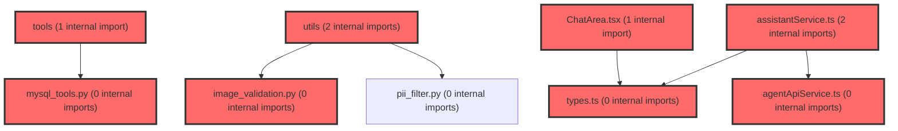

> [!IMPORTANT]
> **⚠️ 수동 검토 권장 (자가힐링 주의)**
>
> AI 자가힐링 결과물이 실제 의도와 다를 수 있으므로, **상세 리뷰 내용에 기반한 수동 점검**을 우선해 주시기 바랍니다. 자가힐링 기능을 활용하실 경우 최종 결과물을 신중하게 확인해 주세요.

# 코드 리뷰 - 016def48

## 코드 복잡도 분석

**분석된 파일**: 37개 / 변경된 파일: 67개


### Import 의존관계 다이어그램



**범례**: 중심 파일 (변경됨) | 많은 import (10개 이상)


### 정상 범위 (NONE)


**`dgnssmapper.xml`** (other)

- 평균 복잡도: **0.242**

- 최대 복잡도: 0.473

- 청크 수: 2개

- 평균 사용처: 7.0곳


**권장사항:**

- 복잡도 정상 범위


**`dgnsscontroller.java`** (other)

- 평균 복잡도: **0.210**

- 최대 복잡도: 0.470

- 청크 수: 25개

- 평균 사용처: 25.8곳


**권장사항:**

- 파일 크기가 큼 (25개 청크) - 파일 분리 검토


**`main.py`** (other)

- 평균 복잡도: **0.204**

- 최대 복잡도: 0.471

- 청크 수: 7개

- 평균 사용처: 6.9곳


**권장사항:**

- 복잡도 정상 범위


**`dgnssmapper.java`** (other)

- 평균 복잡도: **0.187**

- 최대 복잡도: 0.466

- 청크 수: 199개

- 평균 사용처: 27.9곳


**권장사항:**

- 파일 크기가 큼 (199개 청크) - 파일 분리 검토


**`schemas.py`** (other)

- 평균 복잡도: **0.166**

- 최대 복잡도: 0.464

- 청크 수: 7개

- 평균 사용처: 5.0곳


**권장사항:**

- 복잡도 정상 범위


**`__init__.py`** (utility)

- 평균 복잡도: **0.153**

- 최대 복잡도: 0.304

- 청크 수: 2개

- 평균 사용처: 3.0곳


**권장사항:**

- 복잡도 정상 범위


**`dgnssservice.java`** (other)

- 평균 복잡도: **0.111**

- 최대 복잡도: 0.473

- 청크 수: 69개

- 평균 사용처: 12.8곳


**권장사항:**

- 파일 크기가 큼 (69개 청크) - 파일 분리 검토


**`agent_service.py`** (other)

- 평균 복잡도: **0.080**

- 최대 복잡도: 0.464

- 청크 수: 18개

- 평균 사용처: 3.1곳


**권장사항:**

- 복잡도 정상 범위


**`routes.tsx`** (other)

- 평균 복잡도: **0.073**

- 최대 복잡도: 0.463

- 청크 수: 17개

- 평균 사용처: 3.3곳


**권장사항:**

- 복잡도 정상 범위


**`__init__.py`** (other)

- 평균 복잡도: **0.006**

- 최대 복잡도: 0.006

- 청크 수: 1개


**권장사항:**

- 복잡도 정상 범위


**`test_stateless_memory.py`** (store)

- 평균 복잡도: **0.006**

- 최대 복잡도: 0.008

- 청크 수: 7개


**권장사항:**

- Store 파일은 높은 연결도가 정상적임


**`mysql_tools.py`** (other)

- 평균 복잡도: **0.005**

- 최대 복잡도: 0.011

- 청크 수: 8개


**권장사항:**

- 복잡도 정상 범위


**`image_validation.py`** (utility)

- 평균 복잡도: **0.005**

- 최대 복잡도: 0.010

- 청크 수: 2개


**권장사항:**

- 복잡도 정상 범위


**`agent_graph.py`** (other)

- 평균 복잡도: **0.004**

- 최대 복잡도: 0.007

- 청크 수: 6개


**권장사항:**

- 복잡도 정상 범위


**`agentapiservice.ts`** (other)

- 평균 복잡도: **0.004**

- 최대 복잡도: 0.012

- 청크 수: 9개


**권장사항:**

- 복잡도 정상 범위


**`chatapiservice.ts`** (other)

- 평균 복잡도: **0.004**

- 최대 복잡도: 0.008

- 청크 수: 21개


**권장사항:**

- 파일 크기가 큼 (21개 청크) - 파일 분리 검토


**`captureregion.ts`** (utility)

- 평균 복잡도: **0.004**

- 최대 복잡도: 0.012

- 청크 수: 8개


**권장사항:**

- 복잡도 정상 범위


**`dashboardservice.ts`** (other)

- 평균 복잡도: **0.004**

- 최대 복잡도: 0.010

- 청크 수: 59개


**권장사항:**

- 파일 크기가 큼 (59개 청크) - 파일 분리 검토


**`datahelperservice.ts`** (utility)

- 평균 복잡도: **0.003**

- 최대 복잡도: 0.008

- 청크 수: 34개


**권장사항:**

- 파일 크기가 큼 (34개 청크) - 파일 분리 검토


**`usecapturestore.ts`** (store)

- 평균 복잡도: **0.003**

- 최대 복잡도: 0.012

- 청크 수: 12개


**권장사항:**

- Store 파일은 높은 연결도가 정상적임


**`index.ts`** (other)

- 평균 복잡도: **0.003**

- 최대 복잡도: 0.011

- 청크 수: 92개


**권장사항:**

- 파일 크기가 큼 (92개 청크) - 파일 분리 검토


**`__init__.py`** (other)

- 평균 복잡도: **0.002**

- 최대 복잡도: 0.002

- 청크 수: 1개


**권장사항:**

- 복잡도 정상 범위


**`assistantservice.ts`** (other)

- 평균 복잡도: **0.002**

- 최대 복잡도: 0.012

- 청크 수: 14개


**권장사항:**

- 복잡도 정상 범위


**`useconversations.ts`** (other)

- 평균 복잡도: **0.002**

- 최대 복잡도: 0.010

- 청크 수: 73개


**권장사항:**

- 파일 크기가 큼 (73개 청크) - 파일 분리 검토


**`types.ts`** (other)

- 평균 복잡도: **0.002**

- 최대 복잡도: 0.004

- 청크 수: 10개


**권장사항:**

- 복잡도 정상 범위


**`useapidata.ts`** (other)

- 평균 복잡도: **0.002**

- 최대 복잡도: 0.010

- 청크 수: 58개


**권장사항:**

- 파일 크기가 큼 (58개 청크) - 파일 분리 검토


**`authcontext.tsx`** (other)

- 평균 복잡도: **0.002**

- 최대 복잡도: 0.008

- 청크 수: 16개


**권장사항:**

- 복잡도 정상 범위


**`aichatpanel.tsx`** (other)

- 평균 복잡도: **0.001**

- 최대 복잡도: 0.004

- 청크 수: 48개


**권장사항:**

- 파일 크기가 큼 (48개 청크) - 파일 분리 검토


**`datahelperchatbot.tsx`** (utility)

- 평균 복잡도: **0.001**

- 최대 복잡도: 0.008

- 청크 수: 22개


**권장사항:**

- 파일 크기가 큼 (22개 청크) - 파일 분리 검토


**`schoolrecordpanel.tsx`** (other)

- 평균 복잡도: **0.001**

- 최대 복잡도: 0.007

- 청크 수: 59개


**권장사항:**

- 파일 크기가 큼 (59개 청크) - 파일 분리 검토


**`airoompage.tsx`** (component)

- 평균 복잡도: **0.001**

- 최대 복잡도: 0.008

- 청크 수: 9개


**권장사항:**

- 복잡도 정상 범위


**`studentdashboardpage.tsx`** (component)

- 평균 복잡도: **0.001**

- 최대 복잡도: 0.008

- 청크 수: 50개


**권장사항:**

- 파일 크기가 큼 (50개 청크) - 파일 분리 검토


**`captureoverlay.tsx`** (other)

- 평균 복잡도: **0.001**

- 최대 복잡도: 0.004

- 청크 수: 25개


**권장사항:**

- 파일 크기가 큼 (25개 청크) - 파일 분리 검토


**`floatingcapturebutton.tsx`** (other)

- 평균 복잡도: **0.001**

- 최대 복잡도: 0.008

- 청크 수: 16개


**권장사항:**

- 복잡도 정상 범위


**`chatarea.tsx`** (other)

- 평균 복잡도: **0.000**

- 최대 복잡도: 0.008

- 청크 수: 81개


**권장사항:**

- 파일 크기가 큼 (81개 청크) - 파일 분리 검토


**`airoomchatarea.tsx`** (other)

- 평균 복잡도: **0.000**

- 최대 복잡도: 0.000

- 청크 수: 52개


**권장사항:**

- 파일 크기가 큼 (52개 청크) - 파일 분리 검토


**`index.ts`** (other)

- 평균 복잡도: **0.000**

- 최대 복잡도: 0.000

- 청크 수: 2개


**권장사항:**

- 복잡도 정상 범위


---


## 변경 배경

이 커밋은 AI Agent 서비스의 오케스트레이션 레이어를 기존 수작업 ReAct 루프(Legacy)와 LangGraph StateGraph 기반 구현으로 병행 운영할 수 있도록 아키텍처를 확장하는 대규모 변경입니다. 주요 변경 동기는 다음과 같습니다:

- **목적**: MySQL Tool 연동(8종), 멀티모달 이미지 입력, 요청 단위 무상태(stateless) 모드, 프롬프트 파일 분리, LangGraph 기반 오케스트레이션 도입
- **도메인**: AI Agent 백엔드 (오케스트레이션, Tool Calling, API 스키마, 설정/문서)
- **변경 방향**: 단일 구현체(MetaAgentService)에서 `AGENT_BACKEND` 플래그 기반 전환 가능한 이중 구현체 구조로 전환. 하드코딩된 프롬프트를 `.md` 파일로 분리하여 기획자도 수정 가능하게 개선. Neo4j 전용 Tool에서 MySQL Tool을 포함한 `all_tools_list`로 확장

---

## [GOOD] 잘된 점

**1. 프롬프트 파일 분리 아키텍처**

`app/core/prompts/` 디렉토리로 시스템 프롬프트와 Tool 정책을 `.md` 파일로 분리하고, `load_prompt()`가 매 호출 파일을 새로 읽어 서버 재시작 없이 반영되도록 한 설계는 실무적으로 매우 실용적입니다. `__init__.py`의 docstring에 명시된 대로 "기획자가 Python 코드를 몰라도 시스템 프롬프트/Tool 정책 문구를 수정할 수 있도록" 한 점이 명확히 드러납니다. 또한 Tool 함수의 docstring은 이 디렉토리에 포함하지 않는다는 경계 설정도 명확하여, LLM 함수 호출 스키마가 깨지는 위험을 방지하고 있습니다.

**2. LangGraph 도입 방식의 현실성**

`create_react_agent` 같은 prebuilt를 쓰지 않고 기존 `llm_router`(LiteLLM Router)를 그대로 재사용하는 커스텀 노드 구성은, 기존 멀티키 로테이션 + 폴백 로직을 유지하면서 점진적 마이그레이션이 가능하도록 한 현명한 선택입니다. `agent_graph.py`의 모듈 docstring에 "LLM 호출은 LangChain ChatModel이 아니라 기존 llm_router를 그대로 호출하므로 prebuilt create_react_agent는 쓰지 않고 커스텀 노드로 구성한다"고 명시되어 있어 설계 의도가 명확합니다. `RECURSION_LIMIT = MAX_ITERATIONS * 2`와 같은 실측 기반 상수 설정도 신뢰할 수 있습니다.

**3. 무상태(stateless) 모드 도입**

`AgentQuery.history` 필드를 통해 프론트엔드가 이력의 정본을 관리하는 무상태 모드를 추가한 것은, 인메모리 `session_store`의 확장성 한계(Redis 미도입 상태)를 우회하는 실용적인 설계입니다. `agent_service.py`의 `_build_messages()` 메서드에서 `history is not None`을 무상태 모드의 신호로 사용하고, 반환값 `session_history = None`으로 영속을 건너뛰는 방식이 깔끔합니다. `LangGraphAgentService`에서도 `ephemeral thread_id`를 생성하고 사용 후 `delete_thread`로 정리하는 방식으로 동일한 패턴을 따르고 있습니다.

**4. 예외 처리 일관성 유지**

Legacy와 LangGraph 두 구현체 모두 동일한 litellm 예외 매핑(`_LITELLM_ERROR_MESSAGES` 튜플)과 사용자 노출 메시지를 공유하여, 전환 시 사용자 경험 차이가 없도록 한 점이 좋습니다. 특히 `agent_graph.py`의 docstring에 "구체적인 예외부터 순서대로 검사해야 하위 클래스가 상위 클래스로 오분류되지 않는다"고 명시한 것은 예외 처리의 일반적인 함정을 인지하고 있음을 보여줍니다.

---

## 변경사항 요약

LangGraph 기반 `LangGraphAgentService` 신규 구현, MySQL Tool 8종 연동, 멀티모달 이미지 입력 지원, 요청 단위 무상태 모드, 프롬프트 파일 분리, `.env.example`/`README.md` 대규모 문서 업데이트, `AgentQuery` 스키마 확장.

---

## [ISSUE] 개선이 필요한 부분

### Critical (즉시 수정 필요)

없음

### High (우선 수정 권장)

**1. `_build_system_prompt()`와 `_normalize_tool_args()`의 중복 구현**

- **위치**: `agent/app/core/agent_graph.py` (라인 72-130)와 `agent/app/services/agent_service.py` (라인 100-160)
- **문제**: 두 파일에 동일한 `_build_system_prompt()` 정적 메서드가 완전히 중복 구현되어 있습니다. 약 60라인에 달하는 로직(mode 분기, profile_block 조립, high_school_notice 등)이 그대로 복사되어 있어, 향후 프롬프트 정책 변경 시 두 군데를 동시에 수정해야 합니다. 누락 시 두 구현체 간 동작 불일치가 발생합니다. `_normalize_tool_args()`도 동일한 문제가 있습니다.

실제 코드를 비교해보면, `agent_graph.py`의 `_build_system_prompt()`:
```python
def _build_system_prompt(student_context: Optional[dict]) -> str:
    ctx = student_context or {}
    mode = ctx.get("mode")
    profile = ctx.get("profile") or {}
    context_text = ctx.get("context") or "No additional context provided."
    # ... (60라인 분기 로직)
    return (
        f"{load_prompt('role_and_rules')}\n\n"
        f"{profile_block}"
        f"## Tool 호출 정책\n{tool_policy}\n"
        "\n## 학생 컨텍스트 (마크다운)\n"
        f"{context_text}"
    )
```

그리고 `agent_service.py`의 `_build_system_prompt()`:
```python
@staticmethod
def _build_system_prompt(masked_context: dict | None) -> str:
    ctx = masked_context or {}
    mode = ctx.get("mode")
    profile = ctx.get("profile") or {}
    context_text = ctx.get("context") or "No additional context provided."
    # ... (동일한 60라인 분기 로직)
    return (
        f"{load_prompt('role_and_rules')}\n\n"
        f"{profile_block}"
        f"## Tool 호출 정책\n{tool_policy}\n"
        "\n## 학생 컨텍스트 (마크다운)\n"
        f"{context_text}"
    )
```

매개변수명만 `student_context`와 `masked_context`로 다를 뿐 로직이 완전히 동일합니다.

- **해결 방안**: 공통 로직을 `app/core/prompts/` 디렉토리 내의 별도 모듈(예: `app/core/prompts/builder.py`)로 추출하고, 두 서비스가 이를 import하여 사용하도록 리팩토링하세요. `_normalize_tool_args()`도 `app/tools/` 또는 `app/utils/`의 공통 유틸리티로 추출하는 것을 권장합니다.

**2. `LangGraphAgentService._recover_from_recursion_limit()`의 노드명 하드코딩**

- **위치**: `agent/app/services/agent_service.py` (라인 580-590)
- **문제**: `GraphRecursionError` 발생 시 `aupdate_state`를 `as_node="call_model"`로 호출하여 복구하는데, 이는 그래프 내부 노드명(`call_model`)에 강하게 결합되어 있습니다. 향후 그래프 구조 변경(노드명 변경, 노드 추가) 시 이 복구 로직이 조용히 깨질 수 있습니다. 또한 `aupdate_state` 호출이 실패할 경우(예: thread가 이미 삭제된 상태)에 대한 예외 처리가 없습니다.

```python
async def _recover_from_recursion_limit(self, thread_id: str) -> None:
    config = {"configurable": {"thread_id": thread_id}}
    await self.graph.aupdate_state(
        config,
        {"messages": [AIMessage(content=MAX_ITERATIONS_FALLBACK_MESSAGE)]},
        as_node="call_model",  # 하드코딩된 노드명
    )
```

- **해결 방안**: `agent_graph.py`에서 `CALL_MODEL_NODE = "call_model"` 상수로 노드명을 정의하고, `agent_service.py`에서 이를 import하여 사용하세요. `aupdate_state` 호출을 try-except으로 감싸서 복구 실패 시에도 서비스가 중단되지 않도록 보호하는 것도 고려하세요.

### Medium (개선 권장)

**1. `agent_graph.py` 모듈 레벨에서 `_build_graph()` 즉시 실행**

- **위치**: `agent/app/core/agent_graph.py` (라인 262)
- **문제**: 모듈 import 시점에 그래프가 컴파일됩니다. `AGENT_BACKEND=legacy` 환경에서도 `agent_service.py`가 `from app.core.agent_graph import compiled_graph`를 수행하므로, LangGraph가 전혀 필요 없는 환경에서도 LangGraph 의존성 전체가 로드되고 그래프가 컴파일됩니다.

```python
# 모듈 로드 시 1회 컴파일되는 싱글톤 그래프 (agent_service.py에서 참조)
compiled_graph = _build_graph()
```

- **해결 방안**: 지연 로딩(lazy loading) 패턴을 적용하여 `LangGraphAgentService.__init__()`에서 최초 호출 시에만 그래프를 컴파일하거나, `agent_service.py`의 `AGENT_BACKEND == "langgraph"` 분기 내에서만 import하도록 변경하세요.

**2. `call_model_node`의 예외 처리에서 fallback 메시지 누락**

- **위치**: `agent/app/core/agent_graph.py` (라인 195-200)
- **문제**: `_LITELLM_ERROR_MESSAGES`에 매칭되지 않는 예외는 `logger.error`로 로깅되지만, `writer`를 통해 사용자에게 fallback 메시지를 전송하는 코드가 누락되어 있습니다. 즉, 알려지지 않은 예외 타입이 발생하면 `writer`를 통해 아무 메시지도 전송되지 않고 빈 응답이 반환됩니다.

```python
except Exception as e:
    for exc_type, message in _LITELLM_ERROR_MESSAGES:
        if isinstance(e, exc_type):
            logger.error(f"{exc_type.__name__}: {e}")
            writer({"type": "token", "text": message})
            return {"messages": [AIMessage(content=message)]}
    logger.error(f"Unexpected error in call_model_node: {e}", exc_info=True)
    message = "예상치 못한 오류가 발생했습니다."
    # writer({"type": "token", "text": message})  # 이 줄이 누락됨
    return {"messages": [AIMessage(content=message)]}
```

- **해결 방안**: for 루프 이후에 `writer({"type": "token", "text": message})`를 추가하여 fallback 메시지도 스트림으로 전송되도록 하세요.

**3. `image_validation.py`의 base64 크기 근사 계산 정확도**

- **위치**: `agent/app/utils/image_validation.py` (라인 28)
- **문제**: base64 문자열 길이로 원본 바이트를 근사 계산하는 방식은 padding(`=`)을 고려하지 않아 최대 2바이트의 오차가 발생할 수 있습니다.

```python
approx_bytes = len(match.group(2)) * 3 // 4  # padding 미고려
```

- **해결 방안**: `len(match.group(2)) * 3 // 4 - match.group(2).count('=')`로 padding을 차감하여 정확도를 높이세요.

---

## 주요 파일 분석

### `agent/app/services/agent_service.py`

**변경 내용:** `MetaAgentService`에 무상태 모드, 멀티모달 이미지, MySQL Tool 통합. `LangGraphAgentService` 신규 클래스 추가. `AGENT_BACKEND` 플래그로 두 구현체 전환.

**핵심 설계 포인트:**

1. **무상태 모드 분기**: `_build_messages()`에서 `history is not None`을 기준으로 무상태/레거시 모드를 분기합니다. 무상태 모드에서는 `session_store`/`session_context_store`를 읽거나 쓰지 않고, `session_history`로 `None`을 반환하여 `run_agent()`의 후반부에서 이력 저장을 건너뜁니다.

2. **`LangGraphAgentService`의 ephemeral thread 관리**: 무상태 모드에서 `f"{session_id}:{uuid.uuid4().hex}"` 형태의 ephemeral thread_id를 생성하고, `finally` 블록에서 `self.graph.checkpointer.delete_thread(thread_id)`로 정리하여 메모리 누수를 방지합니다. 이는 LangGraph의 `MemorySaver`가 기본적으로 모든 체크포인트를 메모리에 보관하는 특성에 대한 적절한 대응입니다.

3. **`_history_count()`의 정확한 카운트**: LangGraph는 tool-call 중간 AIMessage/ToolMessage도 함께 영속화하므로, 전체 messages 길이를 그대로 쓰면 레거시 대비 값이 부풀려집니다. 이를 방지하기 위해 `isinstance(m, HumanMessage) or (isinstance(m, AIMessage) and not m.tool_calls)` 조건으로 실제 사용자-어시스턴트 턴만 카운트합니다.

**개선 제안:**
- `_build_system_prompt()`와 `_normalize_tool_args()`를 `agent_graph.py`와 공유 모듈로 추출 (High #1 참고)
- `run_agent_stream()`의 예외 처리 5종 catch 블록을 `run_agent()`와 공유하는 헬퍼 함수로 추출 (단, LangGraph로 완전 이관 후 Legacy 코드 제거 시 자연 해소됨)

### `agent/app/core/agent_graph.py` (신규)

**변경 내용:** LangGraph StateGraph 기반 Agent 오케스트레이션 구현. `call_model_node`와 `ToolNode`로 구성된 2-노드 그래프.

**핵심 설계 포인트:**

1. **`stream=True` 통일**: `call_model_node`에서 항상 `stream=True`로 LLM을 호출하고, `get_stream_writer()`로 토큰을 흘려보냅니다. `ainvoke`(비스트리밍) 컨텍스트에서는 `get_stream_writer()`가 no-op으로 동작하므로, `/chat`과 `/chat/stream`이 완전히 동일한 노드 구현을 공유합니다.

2. **`_inject_pending_images()`의 비영속 정책**: 이미지는 `state["messages"]`에 포함되지 않고 `state["pending_images"]`에 별도로 보관됩니다. `_inject_pending_images()`는 LLM 전송 직전에만 가장 최근 user 메시지의 content를 멀티모달 블록으로 변환합니다. 이로 인해 이미지는 체크포인트(세션 히스토리)에 저장되지 않아 토큰 비용과 메모리 사용을 절약합니다.

3. **`_stream_llm_call()`의 LangSmith 트레이싱**: async generator를 `@traceable(run_type="llm")`로 감싸서, LangGraph의 스트리밍 LLM 호출도 LangSmith에 nested LLM span으로 기록합니다. 이는 레거시에서 "스트림 LLM 호출은 개별 추적 불가"였던 한계를 해소합니다.

**개선 제안:**
- 예외 처리 fallback 메시지 `writer` 누락 수정 (Medium #2 참고)
- 모듈 레벨 그래프 컴파일을 지연 로딩으로 변경 (Medium #1 참고)

### `agent/app/core/prompts/` (신규)

**변경 내용:** 5개의 `.md` 프롬프트 파일과 `__init__.py` 로더.

**핵심 설계 포인트:**

1. **캐싱 없는 파일 읽기**: `load_prompt()`는 매 호출마다 `path.read_text(encoding="utf-8")`로 파일을 새로 읽습니다. docstring에 명시된 대로 "프롬프트 문구는 요청당 1회 정도만 조립되므로 파일 IO 비용은 무시할 수 있고, 대신 planner가 파일을 수정하면 서버 재시작 없이 다음 요청부터 바로 반영됩니다."

2. **trailing newline 정규화**: `rstrip("\n")`으로 파일 끝의 개행을 제거하여, 에디터/OS별 차이가 섹션 간 공백 줄 수에 영향을 주지 않도록 합니다. 호출부(`agent_graph.py`/`agent_service.py`) 코드가 명시적으로 공백 줄을 통제합니다.

3. **mode별 Tool 정책 분리**: `tool_policy_student.md`, `tool_policy_class.md`, `tool_policy_teacher.md`, `tool_policy_none.md`로 4가지 모드에 대한 Tool 호출 정책을 분리했습니다. 각 파일은 상황별로 사용 가능한 Tool 목록, 인자값 규칙, 호출 절차, 개인정보 주의사항을 상세히 기술하고 있습니다.

**개선 제안:**
- 고트래픽 환경을 위한 경량 캐싱 도입 검토 (예: `DEBUG=True`일 때만 캐싱 비활성화)

### `agent/app/models/schemas.py`

**변경 내용:** `AgentQuery`에 `history`와 `images` 필드 추가.

**핵심 설계 포인트:**

1. **`history` 필드의 이중 모드**: `history`가 주어지면(빈 리스트 포함) 무상태 모드로 동작하고, 생략 시 기존 인메모리 세션 모드로 폴백합니다. docstring에 "현재 사용자 발화(text)는 포함하지 않는다"고 명시하여, 프론트엔드가 이력을 구성할 때 실수하지 않도록 가이드하고 있습니다.

2. **`images` 필드의 휘발성**: docstring에 "해당 턴에서만 사용되며 세션 히스토리에는 저장되지 않습니다"고 명시하여, 이미지의 비영속 정책을 API 스키마 수준에서 문서화하고 있습니다.

---

## 최종 평가

**결론**: 
- [ ] [OK] **승인 (Approved)** - Critical/High 이슈 없음
- [ ] [WARN] **조건부 승인 (Approved with Comments)** - Medium 이하 이슈만 존재
- [x] [FIX] **수정 필요 (Changes Requested)** - Critical/High 이슈 존재

**종합 의견:**

전반적으로 아키텍처 설계 수준이 높고, 문서화와 하위 호환성에 대한 고려가 돋보이는 훌륭한 커밋입니다. 특히 프롬프트 파일 분리, LangGraph 도입 방식의 현실성, 무상태 모드 설계는 실무적으로 매우 가치 있는 결정입니다.

다만 `_build_system_prompt()`와 `_normalize_tool_args()`의 중복 구현(High #1)은 두 구현체 간 프롬프트 정책 불일치로 이어질 수 있는 명백한 유지보수 위험입니다. LangGraph 마이그레이션이 완료되기 전에 공유 모듈로 추출하여 해소할 것을 권장합니다. `agent_graph.py`의 예외 처리 fallback 메시지 누락(Medium #2)도 실제 장애 상황에서 사용자 경험에 영향을 줄 수 있으므로 함께 수정을 권장합니다.

이 두 가지만 해결되면 즉시 승인 가능한 수준의 코드 품질입니다.