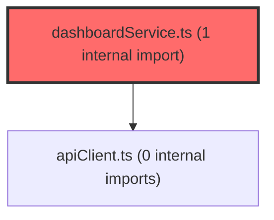

> [!IMPORTANT]
> **⚠️ 수동 검토 권장 (자가힐링 주의)**
>
> AI 자가힐링 결과물이 실제 의도와 다를 수 있으므로, **상세 리뷰 내용에 기반한 수동 점검**을 우선해 주시기 바랍니다. 자가힐링 기능을 활용하실 경우 최종 결과물을 신중하게 확인해 주세요.

# 코드 리뷰 - 021d884d

## 코드 복잡도 분석

**분석된 파일**: 6개 / 변경된 파일: 8개


### Import 의존관계 다이어그램



**범례**: 중심 파일 (변경됨) | 많은 import (10개 이상)


### 모니터링 권장 (LOW)


**`dashboardservice.ts`** (other)

- 평균 복잡도: **0.271**

- 최대 복잡도: 0.518

- 청크 수: 85개

- 평균 사용처: 25.6곳


**권장사항:**

- **모니터링 권장**: 복잡도가 높은 편이지만 영향 범위 제한적

- 파일 크기가 큼 (85개 청크) - 파일 분리 검토


### 정상 범위 (NONE)


**`api.ts`** (other)

- 평균 복잡도: **0.180**

- 최대 복잡도: 0.469

- 청크 수: 42개

- 평균 사용처: 18.0곳


**권장사항:**

- 파일 크기가 큼 (42개 청크) - 파일 분리 검토


**`usestudentanalysis.ts`** (other)

- 평균 복잡도: **0.001**

- 최대 복잡도: 0.003

- 청크 수: 8개


**권장사항:**

- 복잡도 정상 범위


**`useteacherclasses.ts`** (other)

- 평균 복잡도: **0.001**

- 최대 복잡도: 0.008

- 청크 수: 16개


**권장사항:**

- 복잡도 정상 범위


**`coachingstrategy.tsx`** (other)

- 평균 복잡도: **0.000**

- 최대 복잡도: 0.002

- 청크 수: 93개


**권장사항:**

- 파일 크기가 큼 (93개 청크) - 파일 분리 검토


**`myresultpage.tsx`** (component)

- 평균 복잡도: **0.000**

- 최대 복잡도: 0.003

- 청크 수: 89개


**권장사항:**

- 파일 크기가 큼 (89개 청크) - 파일 분리 검토


---


## [GOOD] 잘된 점
CP님이 구현하신 코드는 몇 가지 면에서 인상적입니다:

1. **UI/UX 개선이 체계적**: CoachingStrategy 컴포넌트의 복잡한 레이아웃을 단순화하고, 두 패널(좌측 경로 선택, 우측 상세 설명) 구조로 재구성하여 사용자 경험을 향상시켰습니다.
2. **데이터 정합성 강화**: 백엔드 LPA 타입 정보를 우선 사용하도록 수정하여 프론트엔드와 백엔드 간 데이터 불일치 문제를 해결했습니다.
3. **에러 처리 개선**: claId 파라미터 추가와 Promise.allSettled 사용으로 다양한 시나리오에서 안정적인 데이터 로딩을 보장합니다.

## 변경사항 요약
본 커밋은 CoachingStrategy UI 리팩토링, 백엔드 LPA 타입 통합, 클래스 정보 조회 로직 개선을 포함한 다면적 개선 작업입니다. 학생 코칭 전략 인터페이스를 단순화하면서도 데이터 정확성을 높였습니다.

---

## [ISSUE] 개선이 필요한 부분

### Critical (즉시 수정 필요)
없음

### High (우선 수정 권장)
없음

### Medium (개선 권장)
1. **프로덕션 디버깅 로그 제거 필요**: dashboardService.ts에 추가된 console.log 디버깅 코드는 개발 편의성을 높였지만, 프로덕션 환경에서는 성능 저하와 정보 노출 우려가 있습니다.

---

## 주요 파일 분석

### frontend/src/features/student-dashboard/ui/CoachingStrategy.tsx
**변경 내용:**
기존 복잡한 그리드 레이아웃을 단순한 좌우 패널 구조로 재구성하고, 여러 아이콘과 스타일 컴포넌트를 제거하여 UI를 단순화했습니다.

**개선 제안:**
1. **TypeScript 타입 안전성 강화**
   - **위치 (라인 15)**: `backendLpaTypeName?: string` 파라미터
   - **기존 코드**: 
   ```typescript
   predictedType = backendLpaTypeName as StudentType;
   ```
   - **해결 방안 (수정 코드)**:
   ```typescript
   if (backendLpaTypeName && Object.values(StudentType).includes(backendLpaTypeName as StudentType)) {
     predictedType = backendLpaTypeName as StudentType;
   } else {
     // fallback to frontend classification
     const classification = classifyStudent(safeTScores, schoolLevel);
     predictedType = classification.predictedType as StudentType;
     typeConfidence = classification.confidence;
     typeProbabilities = classification.allProbabilities;
   }
   ```

### prototype/src/shared/services/dashboardService.ts
**변경 내용:**
claId 파라미터 추가, 백엔드 LPA 타입 정보 우선 사용, 디버깅 로그 추가로 데이터 로딩 정확성 향상.

**개선 제안:**
1. **프로덕션 환경 로그 제거**
   - **위치 (라인 168-175)**: 여러 console.log 문
   - **기존 코드**:
   ```typescript
   console.log('[fetchStudentAnalysis] stdtId:', stdtId, 'ordNo:', ordNo);
   console.log('[fetchStudentAnalysis] Full response:', JSON.stringify(response, null, 2));
   ```
   - **해결 방안 (수정 코드)**:
   ```typescript
   // 개발 환경에서만 로깅
   if (process.env.NODE_ENV === 'development') {
     console.log('[fetchStudentAnalysis] stdtId:', stdtId, 'ordNo:', ordNo);
   }
   ```

### prototype/src/shared/hooks/useTeacherClasses.ts
**변경 내용:**
그룹 API에서 학년/반/학교급 정보를 정확히 가져오도록 수정하여 데이터 일관성 향상.

---

## 최종 평가

**결론**: 
- [x] [OK] **승인 (Approved)** - Critical/High 이슈 없음

**종합 의견:**
CP님이 구현하신 변경사항은 UI/UX 개선과 데이터 정합성 강화라는 두 가지 중요한 목표를 모두 달성했습니다. CoachingStrategy의 재설계는 사용자 경험을 현저히 향상시켰으며, 백엔드 LPA 타입 통합은 시스템 전반의 데이터 일관성을 보장합니다. Medium 수준의 사소한 개선점만 존재하며, 전반적으로 우수한 코드 품질을 보여줍니다.