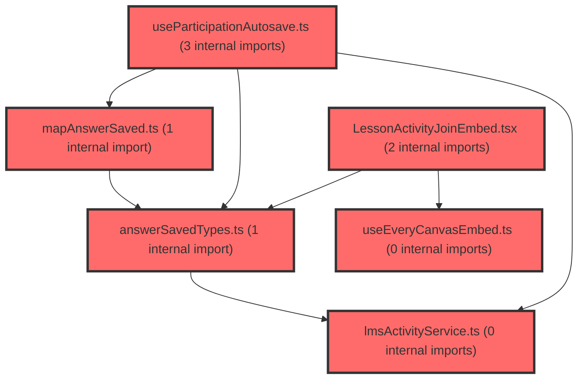

> [!IMPORTANT]
> **⚠️ 수동 검토 권장 (자가힐링 주의)**
>
> AI 자가힐링 결과물이 실제 의도와 다를 수 있으므로, **상세 리뷰 내용에 기반한 수동 점검**을 우선해 주시기 바랍니다. 자가힐링 기능을 활용하실 경우 최종 결과물을 신중하게 확인해 주세요.

# 코드 리뷰 - 036a0c93

## 코드 복잡도 분석

**분석된 파일**: 8개 / 변경된 파일: 9개


### Import 의존관계 다이어그램



**범례**: 중심 파일 (변경됨) | 많은 import (10개 이상)


### 정상 범위 (NONE)


**`mapanswersaved.ts`** (other)

- 평균 복잡도: **0.004**

- 최대 복잡도: 0.009

- 청크 수: 5개


**권장사항:**

- 복잡도 정상 범위


**`lmsactivityservice.ts`** (other)

- 평균 복잡도: **0.003**

- 최대 복잡도: 0.007

- 청크 수: 85개


**권장사항:**

- 파일 크기가 큼 (85개 청크) - 파일 분리 검토


**`index.ts`** (other)

- 평균 복잡도: **0.002**

- 최대 복잡도: 0.012

- 청크 수: 46개


**권장사항:**

- 파일 크기가 큼 (46개 청크) - 파일 분리 검토


**`answersavedtypes.ts`** (other)

- 평균 복잡도: **0.002**

- 최대 복잡도: 0.004

- 청크 수: 4개


**권장사항:**

- 복잡도 정상 범위


**`useparticipationautosave.ts`** (other)

- 평균 복잡도: **0.002**

- 최대 복잡도: 0.009

- 청크 수: 22개


**권장사항:**

- 파일 크기가 큼 (22개 청크) - 파일 분리 검토


**`lessonjoinpage.tsx`** (component)

- 평균 복잡도: **0.002**

- 최대 복잡도: 0.009

- 청크 수: 16개


**권장사항:**

- 복잡도 정상 범위


**`useeverycanvasembed.ts`** (utility)

- 평균 복잡도: **0.001**

- 최대 복잡도: 0.004

- 청크 수: 11개


**권장사항:**

- 복잡도 정상 범위


**`lessonactivityjoinembed.tsx`** (other)

- 평균 복잡도: **0.000**

- 최대 복잡도: 0.004

- 청크 수: 15개


**권장사항:**

- 복잡도 정상 범위


---


## 변경 배경

이 커밋은 학생용 수업 참여 기능(`/student/lesson/:accessKey`)의 **Phase C**를 구현한 것입니다. everyCanvas `activity-join` embed에서 발생하는 `answerSaved` 이벤트를 수신하여 LMS `PATCH /participations/{participationId}`로 문항 답안을 자동저장하고, `submitted` 이벤트 시 `POST .../submit`으로 제출하는 흐름을 완성했습니다.

- **목적**: 학생 답안 자동저장(PATCH) 및 제출(submit) 연동. 기존 Phase B에서 후속으로 미뤄두었던 "풀고 내기"의 저장·제출 파이프라인 구축
- **도메인**: 비즈니스 로직(학생 참여/제출) + API 연동(LMS)
- **변경 방향**: `console.log`로만 구독하던 `answerSaved`를 실제 PATCH 호출로 전환하고, 디바운스·coalesce·동시성 제어를 갖춘 전용 autosave 훅을 신설. 문서(`lesson-library.md`)에 설계 근거와 체크리스트를 상세히 기록

---

## [GOOD] 잘된 점

### 1. 동시성 제어 설계가 견고함
`useParticipationAutosave.ts`의 핵심 설계가 문서 §6.1.5의 원칙을 충실히 반영했습니다.

- **단일 in-flight 보장**: `inflightRef`를 통해 participationId당 동시 PATCH를 1개로 제한하여 stale write 역전을 방지
- **coalesce (Last-Write-Wins)**: `pendingRef`가 `Map<activityItemId, PatchResponseItem>` 구조로 동일 문항의 최신 답안만 유지
- **이중 타이머**: trailing debounce(600ms)로 버스트를 흡수하고, maxWait(2500ms)로 연속 수정 시에도 최대 2.5초 안에 1회는 반드시 PATCH되도록 보장

```ts
// useParticipationAutosave.ts - scheduleFlush
const scheduleFlush = useCallback(() => {
  if (debounceTimerRef.current) clearTimeout(debounceTimerRef.current);
  debounceTimerRef.current = setTimeout(() => {
    debounceTimerRef.current = null;
    void flush();
  }, DEBOUNCE_MS);

  if (!maxWaitTimerRef.current) {
    maxWaitTimerRef.current = setTimeout(() => {
      maxWaitTimerRef.current = null;
      void flush();
    }, MAX_WAIT_MS);
  }
}, [flush]);
```

### 2. 에러 처리 계층이 명확함
`patchResponses` 내부에서 에러를 3단계로 구분 처리합니다.

| 에러 | 처리 |
|------|------|
| `409 ALREADY_SUBMITTED` / `ACTIVITY_CLOSED` | `stoppedRef = true` + pending 전체 폐기 + `onFatalError` 콜백 |
| `400 GRADING_NOT_ALLOWED` | `stripEvaluation` 후 evaluation 제거 재시도 |
| 네트워크 / 5xx | `mergeBack`으로 pending 복원 후 1회 재시도 |

`isRetriableNetworkError` 헬퍼로 재시도 대상을 명확히 구분한 점이 좋습니다.

### 3. FSD 구조 준수
매핑(`mapAnswerSaved`), 타입(`answerSavedTypes`), 상태 훅(`useParticipationAutosave`), API(`lmsActivityService`)를 계층별로 분리하고 `index.ts`에서 일관되게 export했습니다. Embed는 `onAnswerSaved` prop으로 위임하여 widget이 직접 fetch하지 않도록 한 설계가 깔끔합니다.

---

## 변경사항 요약

`answerSaved` 이벤트를 `useParticipationAutosave`의 `enqueue`로 연결해 디바운스·배치 후 PATCH 자동저장하고, `submitted`/`exit`/unmount/visibilitychange 시 `flush()` 후 submit 또는 이탈 처리. 신규 파일 3개(`answerSavedTypes`, `mapAnswerSaved`, `useParticipationAutosave`)와 API 2개(`patchParticipation`, `submitParticipation`) 추가, `LessonJoinPage`에 `LessonJoinSession` 컴포넌트 분리.

---

## [ISSUE] 개선이 필요한 부분

### Critical (즉시 수정 필요)

없음

### High (우선 수정 권장)

#### 1. `flush` 실패 시 제출 흐름 중단 위험 (`useParticipationAutosave.ts` 108-124)

`flush`는 `while(true)` 루프로 `inflightRef`를 await하고 pending이 비면 break합니다. 그런데 `patchResponses`가 재시도까지 실패하면 `throw`하고, 이때 `flush`의 `await run`에서 예외가 발생합니다.

**문제 시나리오**:
- `LessonJoinPage`의 `handleSubmitted`에서 `await autosave.flush()`가 throw되면 `submitParticipation`이 실행되지 않음
- 결과적으로 **답안은 저장됐지만 제출이 안 되는 상태**가 되어 학생이 다시 제출을 시도해야 함

**제안**: `flush`가 실패해도 pending을 보존하고, 호출부가 실패를 인지할 수 있도록 명시적 반환값을 제공합니다.

```ts
const flush = useCallback(async (): Promise<boolean> => {
  if (stoppedRef.current) return true;
  clearTimers();
  while (true) {
    if (inflightRef.current) {
      await inflightRef.current;
    }
    if (pendingRef.current.size === 0) break;
    const responses = [...pendingRef.current.values()];
    pendingRef.current.clear();
    setIsSaving(true);
    const run = patchResponses(responses).finally(() => {
      setIsSaving(false);
    });
    inflightRef.current = run;
    try {
      await run;
    } catch {
      // 실패한 responses는 patchResponses 내부에서 merge-back 됨
      return false;
    } finally {
      inflightRef.current = null;
    }
  }
  return true;
}, [clearTimers, patchResponses]);
```

이에 맞춰 `LessonJoinPage`의 `handleSubmitted`에서 flush 실패 시에도 제출을 시도하거나 사용자 안내를 추가하는 것이 좋습니다.

#### 2. `GRADING_NOT_ALLOWED` 재시도 실패 시 답안 유실 (`useParticipationAutosave.ts` 76-80)

`patchResponses` 내부에서 `GRADING_NOT_ALLOWED`로 재시도할 때 `stripEvaluation` 후 다시 `patchParticipation`을 호출하지만, 이 재시도가 실패하면 `throw`되어 `flush`의 `await run`에서 reject됩니다. 이때 **merge-back이 되지 않아 해당 답안이 유실**됩니다.

```ts
// 기존 코드
if (error.status === 400 && error.errorCode === 'GRADING_NOT_ALLOWED') {
  await patchParticipation(participationId, { responses: stripEvaluation(responses) });
  return;
}
```

```ts
// 수정 제안
if (error.status === 400 && error.errorCode === 'GRADING_NOT_ALLOWED') {
  try {
    await patchParticipation(participationId, { responses: stripEvaluation(responses) });
  } catch (retryError) {
    mergeBack(responses);
    throw retryError;
  }
  return;
}
```

### Medium (개선 권장)

#### 1. `LessonActivityJoinEmbed`의 `onExitRequested`/`onSubmitted` fire-and-forget 처리 (`LessonActivityJoinEmbed.tsx` 61-66)

`exitRequested`/`submitted` 핸들러에서 `void onExitRequested?.(...)`로 호출하지만, `LessonJoinPage`의 `handleExit`/`handleSubmitted`는 `async`로 `flush`를 await합니다. `void`로 던지면 embed가 이 Promise의 완료를 기다리지 않으므로, `submitted` 직후 `flush`가 완료되기 전에 iframe이 닫히거나 navigate가 먼저 실행될 가능성이 있습니다. 다만 `handleSubmitted` 내부에서 flush 후 submit을 순차 await하므로 실제 제출 순서는 보장되나, embed 수명주기와의 동기화는 미흡합니다.

#### 2. `isAnswerSavedPayload`의 검증 강화 (`answerSavedTypes.ts` 15-19)

`articleId`가 string이고 비어있지 않은지만 검사합니다. `answer` 필드의 존재 여부나 `timeSpentMs`의 타입은 검증하지 않아, 잘못된 페이로드가 들어와도 `mapAnswerSavedToPatchResponse`에서 `answer: undefined`로 PATCH될 수 있습니다.

```ts
// 현재 검증
export const isAnswerSavedPayload = (value: unknown): value is AnswerSavedPayload => {
  if (!value || typeof value !== 'object') return false;
  const record = value as Record<string, unknown>;
  return typeof record.articleId === 'string' && record.articleId.length > 0;
};
```

`answer` 필드 존재 여부를 추가 검증하는 것을 권장합니다.

#### 3. unmount 시 `void flush()`의 상태 업데이트 경고 (`useParticipationAutosave.ts` 170-178)

컴포넌트 언마운트 시 `void flush()`를 호출하지만, 언마운트 후 `setIsSaving(true)`가 호출되면 React 경고("Can't perform a React state update on an unmounted component")가 발생할 수 있습니다. `isSaving` 상태 업데이트를 ref 기반으로 바꾸거나, 언마운트 시 상태 업데이트를 방지하는 가드가 필요합니다.

---

## 주요 파일 분석

### `useParticipationAutosave.ts` (신규, 181줄)

**변경 내용**: `answerSaved` 페이로드를 coalesce(activityItemId 키) 후 trailing debounce(600ms)+maxWait(2500ms)로 배치 PATCH. 단일 in-flight 보장, fatal/재시도 에러 분기.

**핵심 로직 흐름**:
1. `enqueue` → `isAnswerSavedPayload` 검증 → `mapAnswerSavedToPatchResponse` 매핑 → `pendingRef.set` → `scheduleFlush`
2. `scheduleFlush` → trailing debounce 타이머 리셋 + maxWait 타이머 최초 1회 시작
3. `flush` → 타이머 clear → while 루프로 in-flight await 후 pending 전체를 `responses[]`로 배치 PATCH
4. `patchResponses` → 성공/`GRADING_NOT_ALLOWED` 재시도/`409` fatal/네트워크 재시도 분기

**개선 제안**:
- `flush` 실패 시 호출부 처리 보강 (High #1)
- `GRADING_NOT_ALLOWED` 재시도 실패 시 merge-back (High #2)

### `LessonJoinPage.tsx` (200줄)

**변경 내용**: `LessonJoinSession` 컴포넌트 분리. autosave 훅 연결, `handleSubmitted`에서 flush 후 submit, fatal 에러(ACTIVITY_CLOSED/ALREADY_SUBMITTED) UX 처리.

**핵심 로직 흐름**:
1. `LessonJoinSession`에서 `useParticipationAutosave` 생성 (participationId, content.items, gradingPolicy 전달)
2. `handleSubmitted` → `await autosave.flush()` → `submitParticipation` → 성공 시 `/student/lesson/result` navigate
3. `handleExit` → `await autosave.flush()` → `navigate(-1)`
4. `handleFatalAutosaveError` → `ACTIVITY_CLOSED`는 `navigate(-1)`, `ALREADY_SUBMITTED`는 `/student/lesson/result`로 이동

**개선 제안**:
- `handleSubmitted`에서 flush 실패 시 제출 흐름 보호 (High #1 연계)

### `LessonActivityJoinEmbed.tsx`

**변경 내용**: `onAnswerSaved` prop 추가, `answerSaved` 이벤트를 `isAnswerSavedPayload` 검증 후 위임. `onExitRequested`/`onSubmitted`를 `void`로 fire-and-forget 처리.

**개선 제안**:
- `onSubmitted`/`onExitRequested`의 Promise 완료 대기 여부는 embed SDK의 핸들러 반환 타입(동기/비동기)을 확인해야 정확한 수정이 가능합니다. 현재 `LessonJoinPage`에서 flush 후 submit 순서가 보장되므로 우선순위는 낮습니다.

### `mapAnswerSaved.ts` (신규, 29줄)

**변경 내용**: `AnswerSavedPayload` → `PatchParticipationResponseItem` 매핑. `lcmsArticleId`로 `contentItems`에서 `activityItemId` lookup, `timeSpentMs > 0`일 때만 포함, `gradingPolicy === 'CLIENT_ALLOWED'`일 때만 evaluation 포함.

**개선 제안**: 특별한 이슈 없음. 매핑 로직이 명확하고 방어적(`!item` return null)으로 작성됨.

### `lmsActivityService.ts`

**변경 내용**: `patchParticipation`(PATCH)과 `submitParticipation`(POST + Idempotency-Key) 추가. 기존 `lmsFetch` 패턴을 그대로 따름.

**개선 제안**: `submitParticipation`의 `idempotencyKey`를 `crypto.randomUUID()`로 생성하는데, 이는 `LessonJoinSession` 마운트 시 1회 생성되어 재시도 시에도 동일 키가 사용됩니다. 이는 올바른 멱등성 보장 방식입니다.

---

## 최종 평가

**결론**: 
- [ ] [OK] **승인 (Approved)** - Critical/High 이슈 없음
- [x] [WARN] **조건부 승인 (Approved with Comments)** - Medium 이하 이슈만 존재
- [ ] [FIX] **수정 필요 (Changes Requested)** - Critical/High 이슈 존재

**종합 의견:**

Phase C 자동저장·제출 파이프라인이 설계 문서(§6.1.5)의 원칙을 충실히 반영한 견고한 구현입니다. 동시성 제어(`inflightRef` 단일 in-flight, `pending Map` coalesce, trailing debounce + maxWait 이중 타이머)와 에러 계층 분리(409 fatal / 400 재시도 / 네트워크 merge-back)가 특히 잘 되어 있습니다.

다만 두 가지 High 이슈가 실사용 시 데이터 무결성에 영향을 줄 수 있습니다:
1. `flush` 실패 시 `handleSubmitted`의 제출 흐름이 중단되어 답안은 저장됐지만 제출이 안 되는 상태 발생 가능
2. `GRADING_NOT_ALLOWED` 재시도 실패 시 merge-back 부재로 답안 유실 가능

이 두 가지는 다음 커밋에서 보강을 권장합니다. 전반적으로 70점 기준을 충족하는 양호한 커밋이며, 문서화 수준이 특히 뛰어나 후속 개발자가 설계 의도를 쉽게 파악할 수 있습니다.