> [!IMPORTANT]
> **⚠️ 수동 검토 권장 (자가힐링 주의)**
>
> AI 자가힐링 결과물이 실제 의도와 다를 수 있으므로, **상세 리뷰 내용에 기반한 수동 점검**을 우선해 주시기 바랍니다. 자가힐링 기능을 활용하실 경우 최종 결과물을 신중하게 확인해 주세요.

# 코드 리뷰 - 04506e2d

## 코드 복잡도 분석

**분석된 파일**: 21개 / 변경된 파일: 23개


### Import 의존관계 다이어그램

```mermaid
flowchart TD
    F0["DeleteGroupModal.tsx (1 internal import)"]:::center
    F1["utils.ts (1 internal import)"]:::center
    F2["StudentLayout.tsx (0 internal imports)"]
    F3["Layout.tsx (0 internal imports)"]:::center
    F4["AssessmentPageV2.tsx (1 internal import)"]:::center
    F5["GroupDetailView.tsx (4 internal imports)"]:::center
    F6["RichTextEditor.tsx (0 internal imports)"]
    F7["GroupFormModal.tsx (2 internal imports)"]:::center
    F8["routes.tsx (19 internal imports)"]:::center
    F9["AuthContext.tsx (1 internal import)"]:::center
    F10["components/index.ts (0 internal imports)"]
    F11["class-dashboard/index.ts (0 internal imports)"]
    F12["ExamTimelineCard.tsx (3 internal imports)"]:::center
    F13["StudentManagementPanel.tsx (1 internal import)"]:::center
    F14["GroupListView.tsx (2 internal imports)"]:::center
    F15["GroupCard.tsx (2 internal imports)"]:::center
    F16["MinimalLayout.tsx (0 internal imports)"]
    F17["constants.ts (1 internal import)"]:::center
    F18["components/index.ts (0 internal imports)"]
    F19["types.ts (0 internal imports)"]:::center
    F8 --> F0
    F8 --> F2
    F8 --> F3
    F8 --> F6
    F8 --> F9
    F8 --> F10
    F8 --> F11
    F8 --> F16
    F9 --> F18
    F0 --> F19
    F12 --> F19
    F12 --> F1
    F12 --> F17
    F15 --> F19
    F15 --> F1
    F5 --> F13
    F5 --> F19
    F5 --> F12
    F5 --> F17
    F7 --> F19
    F7 --> F1
    F14 --> F19
    F14 --> F15
    F13 --> F19
    F17 --> F19
    F4 --> F17
    F1 --> F17
    classDef center fill:#ff6b6b,stroke:#333,stroke-width:3px
    classDef high fill:#ffd93d,stroke:#333,stroke-width:2px
```



**범례**: 중심 파일 (변경됨) | 많은 import (10개 이상)


### 모니터링 권장 (LOW)


**`routes.tsx`** (other)

- 평균 복잡도: **0.240**

- 최대 복잡도: 0.528

- 청크 수: 48개

- 평균 사용처: 16.7곳


**권장사항:**

- **모니터링 권장**: 복잡도가 높은 편이지만 영향 범위 제한적

- 파일 크기가 큼 (48개 청크) - 파일 분리 검토


### 정상 범위 (NONE)


**`layout.tsx`** (other)

- 평균 복잡도: **0.249**

- 최대 복잡도: 0.487

- 청크 수: 30개

- 평균 사용처: 30.3곳


**권장사항:**

- 파일 크기가 큼 (30개 청크) - 파일 분리 검토


**`drawpdfservice.java`** (other)

- 평균 복잡도: **0.235**

- 최대 복잡도: 0.470

- 청크 수: 16개

- 평균 사용처: 31.4곳


**권장사항:**

- 복잡도 정상 범위


**`authcontext.tsx`** (other)

- 평균 복잡도: **0.200**

- 최대 복잡도: 0.487

- 청크 수: 45개

- 평균 사용처: 69.7곳


**권장사항:**

- 파일 크기가 큼 (45개 청크) - 파일 분리 검토


**`dgnssservice.java`** (other)

- 평균 복잡도: **0.129**

- 최대 복잡도: 0.473

- 청크 수: 59개

- 평균 사용처: 14.9곳


**권장사항:**

- 파일 크기가 큼 (59개 청크) - 파일 분리 검토


**`fileservice.java`** (other)

- 평균 복잡도: **0.120**

- 최대 복잡도: 0.468

- 청크 수: 16개

- 평균 사용처: 21.9곳


**권장사항:**

- 복잡도 정상 범위


**`constants.ts`** (other)

- 평균 복잡도: **0.003**

- 최대 복잡도: 0.009

- 청크 수: 9개


**권장사항:**

- 복잡도 정상 범위


**`utils.ts`** (utility)

- 평균 복잡도: **0.003**

- 최대 복잡도: 0.014

- 청크 수: 29개


**권장사항:**

- 파일 크기가 큼 (29개 청크) - 파일 분리 검토


**`groupformmodal.tsx`** (component)

- 평균 복잡도: **0.002**

- 최대 복잡도: 0.008

- 청크 수: 19개


**권장사항:**

- 복잡도 정상 범위


**`studentmanagementpanel.tsx`** (component)

- 평균 복잡도: **0.002**

- 최대 복잡도: 0.012

- 청크 수: 10개


**권장사항:**

- 복잡도 정상 범위


**`assessmentpagev2.tsx`** (component)

- 평균 복잡도: **0.002**

- 최대 복잡도: 0.012

- 청크 수: 57개


**권장사항:**

- 파일 크기가 큼 (57개 청크) - 파일 분리 검토


**`types.ts`** (other)

- 평균 복잡도: **0.002**

- 최대 복잡도: 0.004

- 청크 수: 14개


**권장사항:**

- 복잡도 정상 범위


**`deletegroupmodal.tsx`** (component)

- 평균 복잡도: **0.001**

- 최대 복잡도: 0.003

- 청크 수: 7개


**권장사항:**

- 복잡도 정상 범위


**`examtimelinecard.tsx`** (component)

- 평균 복잡도: **0.001**

- 최대 복잡도: 0.006

- 청크 수: 17개


**권장사항:**

- 복잡도 정상 범위


**`groupcard.tsx`** (component)

- 평균 복잡도: **0.001**

- 최대 복잡도: 0.002

- 청크 수: 6개


**권장사항:**

- 복잡도 정상 범위


**`groupdetailview.tsx`** (component)

- 평균 복잡도: **0.001**

- 최대 복잡도: 0.007

- 청크 수: 16개


**권장사항:**

- 복잡도 정상 범위


**`grouplistview.tsx`** (component)

- 평균 복잡도: **0.001**

- 최대 복잡도: 0.004

- 청크 수: 6개


**권장사항:**

- 복잡도 정상 범위


**`myresultpage.tsx`** (component)

- 평균 복잡도: **0.000**

- 최대 복잡도: 0.008

- 청크 수: 93개


**권장사항:**

- 파일 크기가 큼 (93개 청크) - 파일 분리 검토


**`emptystate.tsx`** (store)

- 평균 복잡도: **0.000**

- 최대 복잡도: 0.000

- 청크 수: 2개


**권장사항:**

- Store 파일은 높은 연결도가 정상적임


**`index.ts`** (component)

- 평균 복잡도: **0.000**

- 최대 복잡도: 0.000

- 청크 수: 8개


**권장사항:**

- 복잡도 정상 범위


**`index.ts`** (other)

- 평균 복잡도: **0.000**

- 최대 복잡도: 0.000

- 청크 수: 1개


**권장사항:**

- 복잡도 정상 범위


---


## 변경 배경

이 커밋은 PDF 생성 성능 최적화와 프로토타입 UI 개선을 위한 변경입니다.

- **목적**: PDF 생성 시 DB 쿼리 병렬화를 통한 응답 시간 단축, PDF 렌더링 캐시 최적화, 프로토타입 검사하기/그룹 관리 UX 통합
- **도메인**: Backend API (PDF 생성 성능), Frontend (프로토타입 UI/라우팅)
- **변경 방향**: 순차적 DB 쿼리를 `CompletableFuture` + `ExecutorService`로 병렬 처리하여 대기 시간 감소, PDF 렌더링 시 `reportCacheMap` 선행 로드로 O(n) 순회 1회로 제한, 클라이언트 연결 끊김에 대한 방어적 예외 처리 추가

---

## [GOOD] 잘된 점

1. **성능 로깅 도입**: `[PDF 성능]` 접두사로 각 단계별 소요 시간을 측정하여 추후 성능 병목 지점 파악이 용이해졌습니다. `totalStart`, `dbStart`, `pdfStart`, `updateStart` 등 세분화된 측정 지점이 잘 설계되었습니다.

2. **스레드 풀 생명주기 관리**: `@PreDestroy`에서 `shutdown()` -> `awaitTermination(5s)` -> `shutdownNow()`의 graceful shutdown 패턴을 정확히 구현하여 리소스 누수를 방지했습니다.

3. **학생용 `makeStPdf`의 스레드 안전성**: 각 DEPTH별로 별도의 `param3`, `param4`, `param5` 맵을 생성하여 병렬 쿼리 간 파라미터 충돌을 방지한 점이 좋습니다.

4. **클라이언트 연결 끊김 방어**: `FileService.dgnssDownloadAll`에서 `StreamingResponseBody` 내 `IOException`을 `log.debug`로 처리하여 Broken pipe 예외가 상위로 전파되지 않도록 한 점이 실무적으로 적절합니다.

5. **프로토타입 UI 통합**: `/groups`와 `/assessment`를 `/assessment`로 통합하고 레거시 라우트를 `Navigate`로 리다이렉트 처리한 점이 깔끔합니다.

---

## 변경사항 요약

Backend 3개 파일(DgnssService, DrawPdfService, FileService)과 Frontend 프로토타입 6개 파일(라우트, 신규 컴포넌트 4개, MyResultPage)이 변경되었습니다. 핵심은 PDF 생성 시 DB 쿼리 병렬화와 캐시 최적화, 그리고 검사하기 V2 UI 도입입니다.

---

## [ISSUE] 개선이 필요한 부분

### Critical (즉시 수정 필요)

없음

### High (우선 수정 권장)

**1. `makeTcPdf`에서 동일 `param` 맵 객체를 병렬 태스크 간 공유 (경합 조건 위험)**

`makeTcPdf` 메서드에서 하나의 `param` 맵 객체를 5개의 `CompletableFuture`에 전달하고 있습니다. MyBatis가 `Map` 파라미터를 읽기 전용으로 사용한다고 가정할 수 있지만, MyBatis의 `#{}` 바인딩 처리 과정에서 내부적으로 `param.get()` 호출 외에도 `toString()` 변환 등이 발생할 수 있고, 일부 MyBatis 구현체나 사용자 정의 TypeHandler는 파라미터 맵에 값을 쓰기도 합니다. 동일한 `param` 객체가 여러 스레드에서 동시에 읽히면 `HashMap`의 비동기적 구조 변경으로 인해 `ConcurrentModificationException` 또는 무한 루프가 발생할 수 있습니다.

- **위치 (라인 번호)**: DgnssService.java, 라인 575~584
- **기존 코드**:
```java
Map<String, Object> param = new HashMap<>();
param.put("TEST_IDX", MapUtils.getString(tcUserInfo, "TEST_IDX"));
param.put("TEST_ORD", nowOrd);
param.put("DGNSS_ID", MapUtils.getString(tcUserInfo, "DGNSS_ID"));
param.put("claId", MapUtils.getString(tcUserInfo, "claId"));

CompletableFuture<List<Map<String, Object>>> reportLSFuture =
        CompletableFuture.supplyAsync(() -> dgnssMapper.getDgnssReportLS(param), pdfQueryPool);
CompletableFuture<List<Map<String, Object>>> reportSectionFuture =
        CompletableFuture.supplyAsync(() -> dgnssMapper.getDgnssReportSection(param), pdfQueryPool);
CompletableFuture<List<Map<String, Object>>> reportValidityFuture =
        CompletableFuture.supplyAsync(() -> dgnssMapper.getDgnssReportValidity(param), pdfQueryPool);
CompletableFuture<List<Map<String, Object>>> reportMemFuture =
        CompletableFuture.supplyAsync(() -> dgnssMapper.getDgnssReportMem(param), pdfQueryPool);
CompletableFuture<Object> firstTestFuture =
        CompletableFuture.supplyAsync(() -> dgnssMapper.getDgnssFirstTest(param), pdfQueryPool);
```

- **해결 방안 (수정 코드)**: `makeStPdf`에서 이미 적용한 패턴과 동일하게, 각 병렬 태스크에 전달할 때마다 새로운 `HashMap`으로 복사하여 전달합니다.
```java
Map<String, Object> param = new HashMap<>();
param.put("TEST_IDX", MapUtils.getString(tcUserInfo, "TEST_IDX"));
param.put("TEST_ORD", nowOrd);
param.put("DGNSS_ID", MapUtils.getString(tcUserInfo, "DGNSS_ID"));
param.put("claId", MapUtils.getString(tcUserInfo, "claId"));

CompletableFuture<List<Map<String, Object>>> reportLSFuture =
        CompletableFuture.supplyAsync(() -> dgnssMapper.getDgnssReportLS(new HashMap<>(param)), pdfQueryPool);
CompletableFuture<List<Map<String, Object>>> reportSectionFuture =
        CompletableFuture.supplyAsync(() -> dgnssMapper.getDgnssReportSection(new HashMap<>(param)), pdfQueryPool);
CompletableFuture<List<Map<String, Object>>> reportValidityFuture =
        CompletableFuture.supplyAsync(() -> dgnssMapper.getDgnssReportValidity(new HashMap<>(param)), pdfQueryPool);
CompletableFuture<List<Map<String, Object>>> reportMemFuture =
        CompletableFuture.supplyAsync(() -> dgnssMapper.getDgnssReportMem(new HashMap<>(param)), pdfQueryPool);
CompletableFuture<Object> firstTestFuture =
        CompletableFuture.supplyAsync(() -> dgnssMapper.getDgnssFirstTest(new HashMap<>(param)), pdfQueryPool);
```

**2. `DrawPdfService.reportCacheMap`의 스레드 안전성 문제**

`reportCacheMap`이 `HashMap` 인스턴스 변수로 선언되어 있고, `DrawPdfService`는 `@Service` 싱글톤 빈입니다. `page == 1` 조건으로 `clear()` 후 `buildReportCache()`를 호출하지만, 동시에 여러 PDF 생성 요청이 들어오면 다음과 같은 문제가 발생할 수 있습니다:
- 요청 A가 `reportCacheMap.clear()`를 호출한 직후, 요청 B가 `buildReportCache()`로 데이터를 채움
- 요청 A가 `buildReportCache()`를 실행할 때 요청 B의 데이터와 혼합됨
- 결과적으로 캐시 데이터가 오염되어 잘못된 PDF가 생성될 수 있음

- **위치 (라인 번호)**: DrawPdfService.java, 라인 3620 (`reportCacheMap` 선언), 라인 28~31, 1276~1279 (사용)
- **기존 코드**:
```java
private Map<String, Map<String, Object>> reportCacheMap = new HashMap<>();
```

- **해결 방안 (수정 코드)**: `ThreadLocal`을 사용하여 요청별로 캐시를 격리하는 것이 가장 안전합니다.
```java
private final ThreadLocal<Map<String, Map<String, Object>>> reportCacheLocal =
        ThreadLocal.withInitial(HashMap::new);

// 사용 시
Map<String, Map<String, Object>> reportCacheMap = reportCacheLocal.get();
reportCacheMap.clear();
if (dgnssReport3 != null) buildReportCache(dgnssReport3, 3);
if (dgnssReport4 != null) buildReportCache(dgnssReport4, 4);
if (dgnssReport5 != null) buildReportCache(dgnssReport5, 5);
```

`ConcurrentHashMap`으로 변경하는 방법도 있지만, `clear()`와 `putAll()`(또는 반복 `put()`) 사이의 원자성이 보장되지 않아 여전히 경합 조건이 발생할 수 있습니다. `ThreadLocal`이 가장 확실한 해결책입니다.

### Medium (개선 권장)

**1. `DrawPdfService`의 `addDgnssPage_DGNSS20_COCH`와 `addDgnssPage_DGNSS10_COCH`는 `buildReportCache` 선행 로드 미적용**

`addDgnssPage_DGNSS20_COCH`(라인 2090)와 `addDgnssPage_DGNSS10_COCH`(라인 2670) 메서드는 `page == 1`일 때 `reportCacheMap.clear()`만 수행하고 `buildReportCache()`를 호출하지 않습니다. 이 메서드들은 교사용 PDF(`createDgnssReportCoch`)에서 호출되는 것으로 보이며, `dgnssReportStat3`/`dgnssReportStat5` 데이터를 사용합니다. 만약 이 메서드들도 캐시 최적화가 필요하다면 `buildReportCache` 호출을 추가하는 것이 일관성 측면에서 좋습니다. 다만, 이 메서드들이 `dgnssReport3/4/5`가 아닌 `dgnssReportStat3/5`를 파라미터로 받으므로, 현재 구조에서는 `buildReportCache`가 적용 불가능할 수 있습니다. 이 부분은 확인 후 결정하시면 됩니다.

**2. `DgnssService` 스레드 풀 크기 20의 적정성**

`Executors.newFixedThreadPool(20)`으로 설정되어 있습니다. PDF 생성 요청은 CPU 바운드 작업(DB 쿼리 + PDF 렌더링)과 I/O 바운드 작업(DB 쿼리)이 혼합되어 있습니다. DB 커넥션 풀 크기와의 관계를 고려할 때, 20개의 스레드가 동시에 DB 쿼리를 실행하면 DB 커넥션 고갈 가능성이 있습니다. 애플리케이션의 DB 커넥션 풀 최대 크기(HikariCP `maximumPoolSize`)와의 균형을 확인하시기 바랍니다.

---

## 주요 파일 분석

### DgnssService.java
**변경 내용:** PDF 생성 시 DB 쿼리 병렬화, 성능 로깅, 스레드 풀 도입, `@PreDestroy`로 생명주기 관리

**개선 제안:**
1. `makeTcPdf`에서 동일 `param` 맵 공유 문제 (위 High 이슈 #1 참조)
2. `makeStPdf`는 이미 `param3/4/5`를 분리하여 스레드 안전하게 구현되어 있어 모범 사례

### DrawPdfService.java
**변경 내용:** `addDgnssPage_DGNSS10`과 `addDgnssPage_DGNSS20`에 `buildReportCache` 선행 로드 추가

**개선 제안:**
1. `reportCacheMap` 스레드 안전성 문제 (위 High 이슈 #2 참조)

### FileService.java
**변경 내용:** `dgnssDownloadAll`의 `StreamingResponseBody`에서 `IOException` 방어 처리

**개선 제안:** 없음. 적절한 방어적 코딩입니다.

### 프로토타입 UI (routes.tsx, 신규 컴포넌트)
**변경 내용:** 검사하기 V2 도입, 그룹 관리 통합, EmptyState/GroupCard/ExamTimelineCard/DeleteGroupModal/GroupDetailView 신규 컴포넌트

**개선 제안:** 없음. UI 구조와 라우팅 설계가 명확하고, 레거시 라우트 리다이렉트 처리도 적절합니다.

---

## 최종 평가

**결론**:
- [ ] [OK] **승인 (Approved)**
- [ ] [WARN] **조건부 승인 (Approved with Comments)**
- [X] [FIX] **수정 필요 (Changes Requested)** - High 이슈 2건 존재

**종합 의견:**

전반적으로 PDF 생성 성능 최적화 방향은 적절하며, `@PreDestroy`를 통한 리소스 정리, 성능 로깅 도입, 클라이언트 연결 끊김 방어 등 실무적으로 좋은 개선이 포함되어 있습니다.

다만, `makeTcPdf`에서 동일 `param` 맵을 병렬 태스크 간 공유하는 경합 조건 위험과 `DrawPdfService.reportCacheMap`의 스레드 안전성 문제는 실제 운영 환경에서 데이터 오염이나 예외를 유발할 수 있습니다. `makeStPdf`에서 이미 별도 파라미터를 생성하는 패턴을 적용했으므로, `makeTcPdf`도 동일한 패턴으로 일관성 있게 맞추는 것을 권장합니다. 위에서 제안한 방식으로 수정 후 배포하시기 바랍니다.