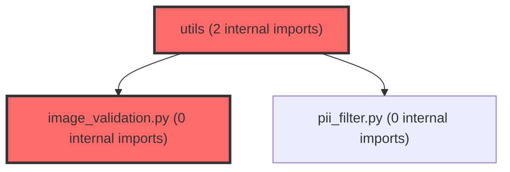

> [!IMPORTANT]
> **⚠️ 수동 검토 권장 (자가힐링 주의)**
>
> AI 자가힐링 결과물이 실제 의도와 다를 수 있으므로, **상세 리뷰 내용에 기반한 수동 점검**을 우선해 주시기 바랍니다. 자가힐링 기능을 활용하실 경우 최종 결과물을 신중하게 확인해 주세요.

# 코드 리뷰 - 0469435e

## 코드 복잡도 분석

**분석된 파일**: 6개 / 변경된 파일: 7개


### Import 의존관계 다이어그램



**범례**: 중심 파일 (변경됨) | 많은 import (10개 이상)


### 정상 범위 (NONE)


**`main.py`** (other)

- 평균 복잡도: **0.179**

- 최대 복잡도: 0.471

- 청크 수: 8개

- 평균 사용처: 6.0곳


**권장사항:**

- 복잡도 정상 범위


**`schemas.py`** (other)

- 평균 복잡도: **0.166**

- 최대 복잡도: 0.464

- 청크 수: 7개

- 평균 사용처: 5.0곳


**권장사항:**

- 복잡도 정상 범위


**`__init__.py`** (utility)

- 평균 복잡도: **0.153**

- 최대 복잡도: 0.304

- 청크 수: 2개

- 평균 사용처: 3.0곳


**권장사항:**

- 복잡도 정상 범위


**`agent_service.py`** (other)

- 평균 복잡도: **0.110**

- 최대 복잡도: 0.465

- 청크 수: 13개

- 평균 사용처: 4.3곳


**권장사항:**

- 복잡도 정상 범위


**`image_validation.py`** (utility)

- 평균 복잡도: **0.005**

- 최대 복잡도: 0.010

- 청크 수: 2개


**권장사항:**

- 복잡도 정상 범위


**`agent_graph.py`** (other)

- 평균 복잡도: **0.004**

- 최대 복잡도: 0.007

- 청크 수: 6개


**권장사항:**

- 복잡도 정상 범위


---


## 변경 배경

이 커밋은 AI 에이전트 서비스에 **멀티모달(이미지) 입력 기능**을 추가하고, **LangGraph 기반 오케스트레이션 백엔드**를 도입하여 기존 Legacy ReAct 루프와 병행 운영할 수 있도록 한 변경입니다.

- **목적**: 사용자가 base64 이미지를 첨부하여 LLM에 시각적 컨텍스트를 제공할 수 있도록 하고, LangGraph `StateGraph`를 통한 구조화된 에이전트 오케스트레이션을 지원
- **도메인**: API (FastAPI 엔드포인트), 비즈니스 로직 (에이전트 서비스), 유틸리티 (이미지 검증)
- **변경 방향**: 기존 텍스트 전용 에이전트에 멀티모달 기능을 추가하면서도, 이미지가 세션 히스토리에 영속되지 않도록 하는 비영속 정책을 설계. 또한 Legacy/LangGraph 두 백엔드 구현체가 동일한 API 계약을 유지하도록 추상화

---

## [GOOD] 잘된 점

1. **비영속 이미지 정책 설계가 명확함**: `pending_images` 필드에 reducer를 두지 않고 매 invoke마다 덮어쓰도록 설계하여, 이미지가 세션 체크포인트에 저장되지 않도록 한 점이 의도적으로 잘 설계되었습니다. README에 "턴 한정, 다음 턴에 자동 소멸"이라고 명시한 것도 좋은 문서화입니다.

2. **이미지 검증을 API 경계에서 조기 차단**: `main.py`의 엔드포인트 진입 직후 `validate_images()`를 호출하여 형식/크기/개수 위반을 400 Bad Request로 즉시 반환하도록 한 구조는, 불필요한 LLM API 호출 비용을 절감하고 디버깅을 용이하게 합니다.

3. **두 백엔드 구현체의 일관된 인터페이스 유지**: `MetaAgentService`와 `LangGraphAgentService` 모두 `run_agent(text, session_id, context_data, images)` 시그니처를 동일하게 유지하여, `main.py`에서 백엔드 선택 로직 없이 `meta_agent_service.run_agent(...)`만 호출하면 되도록 한 점이 깔끔합니다.

---

## 변경사항 요약

- `agent/app/models/schemas.py`: `AgentQuery`에 `images: Optional[List[str]]` 필드 추가
- `agent/app/utils/image_validation.py` (신규): data URI 형식/크기/개수 검증 유틸리티
- `agent/app/core/agent_graph.py`: `AgentState`에 `pending_images` 필드 추가, `_inject_pending_images()` 함수로 LLM 호출 직전 이미지 주입
- `agent/app/services/agent_service.py`: `MetaAgentService`와 `LangGraphAgentService` 모두 `images` 파라미터 추가 및 처리 로직 구현
- `agent/main.py`: `/chat`, `/chat/stream` 엔드포인트에서 이미지 검증 후 서비스에 전달
- `agent/README.md`: 멀티모달 기능, LangGraph 백엔드 전환 방법, 환경 변수 문서화

---

## [ISSUE] 개선이 필요한 부분

### Critical (즉시 수정 필요)

없음

### High (우선 수정 권장)

없음

### Medium (개선 권장)

#### 1. `validate_images()`에서 빈 리스트와 `None`의 구분 모호성

**위치**: `agent/app/utils/image_validation.py`, 20행

```python
def validate_images(images: Optional[List[str]]) -> Optional[List[str]]:
    if not images:
        return None
```

`images`가 빈 리스트 `[]`인 경우와 `None`인 경우 모두 `None`을 반환합니다. 이는 `main.py`에서 `images=images`로 전달할 때 `None`이면 서비스 레이어에서 `images=None`으로 처리되어 정상 동작하지만, 빈 리스트는 "의도적으로 이미지를 보내지 않음"이라는 의미를 가질 수 있습니다. `[]`와 `None`을 구분하는 것이 더 명확할 수 있습니다.

**해결 방안**:
```python
def validate_images(images: Optional[List[str]]) -> Optional[List[str]]:
    if images is None:
        return None
    if not images:
        return []  # 빈 리스트는 그대로 반환
    # ... 나머지 검증 로직
```

다만 현재 동작에는 영향이 없으므로, 필요시에만 반영해도 되는 수준입니다.

---

## 주요 파일 분석

### `agent/app/utils/image_validation.py` (신규 파일)

**변경 내용**: base64 data URI 형식의 이미지 입력을 검증하는 유틸리티 모듈 신규 생성

**분석**:
- `_DATA_URI_RE` 정규표현식으로 `data:image/(png|jpe?g|webp|gif);base64,...` 형식을 검증
- `MAX_IMAGES_PER_TURN = 3`, `MAX_IMAGE_BYTES = 5MB` 제한
- `len(match.group(2)) * 3 // 4`로 base64 길이에서 원본 바이트를 근사 계산하는 방식은 정확함 (base64는 4바이트가 3바이트 원본을 나타내므로 표준적인 근사치)
- `ImageValidationError`는 `ValueError`를 상속받아 명시적인 예외 타입 제공

**개선 제안**: 없음 (적절히 구현됨)

### `agent/app/core/agent_graph.py`

**변경 내용**: `AgentState`에 `pending_images` 필드 추가, `_inject_pending_images()` 함수로 LLM 호출 직전 이미지 주입

**분석**:
- `AgentState`의 `pending_images` 필드는 reducer가 없어 매 invoke마다 전달한 값으로 덮어쓰기됨
- `_inject_pending_images()`는 `openai_messages` 리스트를 뒤에서부터 탐색하여 가장 최근 `role="user"` 메시지를 찾아 이미지 블록을 주입
- `call_model_node`에서 `_inject_pending_images(openai_messages, state.get("pending_images"))` 호출

**개선 제안**: 없음 (현재 설계 범위 내에서 적절히 구현됨)

### `agent/app/services/agent_service.py`

**변경 내용**: `MetaAgentService`와 `LangGraphAgentService` 모두 `images` 파라미터 추가 및 처리 로직 구현

**분석**:
- `MetaAgentService._build_messages()`: 이미지가 있으면 멀티모달 형식(`content`가 리스트)으로 메시지 구성, 없으면 기존 텍스트 형식 유지
- `LangGraphAgentService.run_agent()`/`run_agent_stream()`: `pending_images`를 명시적으로 전달하여 이전 턴 이미지가 새지 않도록 함
- 두 구현체 모두 동일한 시그니처 유지

**개선 제안**: 없음 (적절히 구현됨)

---

## 최종 평가

**결론**: 
- [ ] [OK] **승인 (Approved)** - Critical/High 이슈 없음
- [x] [WARN] **조건부 승인 (Approved with Comments)** - Medium 이하 이슈만 존재
- [ ] [FIX] **수정 필요 (Changes Requested)** - Critical/High 이슈 존재

**종합 의견:**

이 커밋은 멀티모달 이미지 입력 기능과 LangGraph 백엔드를 도입하면서도, 기존 Legacy 구현과의 API 호환성을 완벽히 유지하고 이미지의 비영속 정책을 명확히 설계한 점이 돋보입니다. 이미지 검증을 API 경계에서 조기 차단하여 불필요한 LLM 호출 비용을 방지한 구조와, 두 백엔드 구현체가 동일한 인터페이스를 유지하도록 한 추상화는 실무적으로 매우 적절합니다.

발견된 이슈는 모두 Medium 수준의 예방적 제안으로, 현재 동작에는 영향을 미치지 않습니다. 조건부 승인합니다.