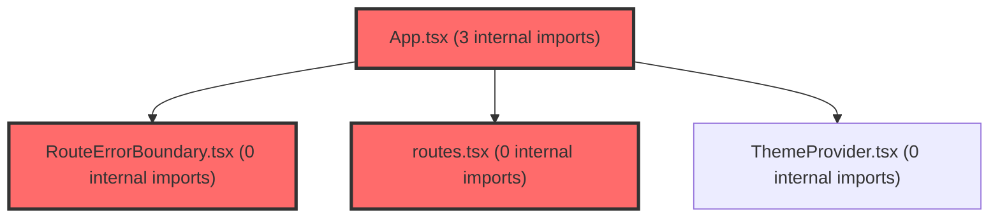

> [!IMPORTANT]
> **⚠️ 수동 검토 권장 (자가힐링 주의)**
>
> AI 자가힐링 결과물이 실제 의도와 다를 수 있으므로, **상세 리뷰 내용에 기반한 수동 점검**을 우선해 주시기 바랍니다. 자가힐링 기능을 활용하실 경우 최종 결과물을 신중하게 확인해 주세요.

# 코드 리뷰 - 052d0d35

## 코드 복잡도 분석

**분석된 파일**: 7개 / 변경된 파일: 10개


### Import 의존관계 다이어그램



**범례**: 중심 파일 (변경됨) | 많은 import (10개 이상)


### 정상 범위 (NONE)


**`app.tsx`** (other)

- 평균 복잡도: **0.212**

- 최대 복잡도: 0.466

- 청크 수: 11개

- 평균 사용처: 13.8곳


**권장사항:**

- 복잡도 정상 범위


**`main.tsx`** (other)

- 평균 복잡도: **0.107**

- 최대 복잡도: 0.462

- 청크 수: 13개

- 평균 사용처: 8.8곳


**권장사항:**

- 복잡도 정상 범위


**`routes.tsx`** (other)

- 평균 복잡도: **0.052**

- 최대 복잡도: 0.463

- 청크 수: 24개

- 평균 사용처: 2.3곳


**권장사항:**

- 파일 크기가 큼 (24개 청크) - 파일 분리 검토


**`bootstraperrorscreen.tsx`** (other)

- 평균 복잡도: **0.005**

- 최대 복잡도: 0.010

- 청크 수: 4개


**권장사항:**

- 복잡도 정상 범위


**`routeerrorboundary.tsx`** (other)

- 평균 복잡도: **0.001**

- 최대 복잡도: 0.004

- 청크 수: 6개


**권장사항:**

- 복잡도 정상 범위


**`errorboundaryprovider.tsx`** (other)

- 평균 복잡도: **0.000**

- 최대 복잡도: 0.000

- 청크 수: 9개


**권장사항:**

- 복잡도 정상 범위


**`classstrategycontent.ts`** (other)

- 평균 복잡도: **0.000**

- 최대 복잡도: 0.000

- 청크 수: 2개


**권장사항:**

- 복잡도 정상 범위


---


## 변경 배경

이 커밋은 프론트엔드 에러 처리 아키텍처를 개선하고, 부트스트랩 실패에 대한 사용자 복구 경로를 제공하는 것을 목적으로 합니다. 기존 `react-error-boundary`를 `@suspensive/react`로 교체하여 에러 경계를 계층화(부트스트랩/라우트/앱)하고, 개발용 라우트를 프로덕션 번들에서 제외했으며, 학급전략 콘텐츠에 초등(E1~E3) 데이터를 보강했습니다.

- **목적**: 에러 처리 아키텍처 통합, 부트스트랩 실패 대응, 개발용 화면의 프로덕션 노출 차단
- **도메인**: UI / 인증(부트스트랩) / 비즈니스 로직(학급전략 콘텐츠)
- **변경 방향**: 에러 경계를 계층화하고 `@suspensive/react`의 `resetKeys`를 활용해 라우트 전환 시 자동 복구하도록 개선

---

## [GOOD] 잘된 점

1. **에러 경계 계층화가 명확함**: `BootstrapErrorScreen`(부트스트랩), `RouteErrorBoundary`(라우트), `ErrorBoundaryProvider`(앱 최상단)로 역할을 분리하여 각 실패 지점에 맞는 복구 전략을 적용했습니다. 특히 `main.tsx`의 `bootstrap().catch()`에서 `BootstrapErrorScreen`을 렌더링하는 방식은 인증 SDK 초기화 실패 시 화면 블랭크를 방지하는 좋은 접근입니다.

2. **`resetKeys`를 통한 자동 초기화**: `RouteErrorBoundary`가 `location.pathname`과 `location.search`를 `resetKeys`로 사용해 경로가 바뀌면 실패한 화면을 자동으로 복구합니다. 이는 사용자가 에러 화면에 갇히지 않고 다른 페이지로 이동할 수 있게 해주는 UX적으로 훌륭한 설계입니다.

3. **개발용 라우트의 프로덕션 제외**: `/dev/errors`, `/dev/sse`를 `import.meta.env.DEV`로 가드하여 운영 번들에서 제외했습니다. 이는 보안(개발용 화면 노출 방지)과 번들 크기 측면에서 모두 적절합니다.

4. **DEV 환경에서만 에러 스택 노출**: `import.meta.env.DEV && error.stack` 조건으로 개발용 오류 정보를 프로덕션에서 숨긴 것은 보안 모범 사례입니다.

5. **부트스트랩 타임아웃 처리**: `withTimeout`으로 인증 SDK 초기화에 10초 제한을 두어 무한 대기로 인한 화면 블랭크를 방지했습니다.

---

## 변경사항 요약

에러 처리 라이브러리를 `@suspensive/react`로 통합하고, 부트스트랩 실패 시 복구 화면(`BootstrapErrorScreen`)을 추가했습니다. 라우트 전환 시 ErrorBoundary 자동 초기화(`RouteErrorBoundary`)를 도입했으며, 개발용 라우트를 프로덕션에서 제외하고 학급전략 콘텐츠에 초등 데이터를 보강했습니다.

---

## [ISSUE] 개선이 필요한 부분

### Critical (즉시 수정 필요)

없음

### High (우선 수정 권장)

**`withTimeout`의 타이머 미정리(leak)**

`Promise.race`에서 `initAuth()`가 정상 완료되더라도 `window.setTimeout`이 취소되지 않아, 10초 후에도 타이머가 남아 불필요한 리소스를 점유합니다. 또한 타임아웃으로 reject된 후에도 `initAuth()`의 실제 Promise는 계속 실행되어 부작용이 발생할 수 있습니다.

- **위치**: `frontend/src/main.tsx` 라인 12-19
- **기존 코드**:
```typescript
const withTimeout = <T,>(promise: Promise<T>, timeoutMs: number): Promise<T> =>
  Promise.race([
    promise,
    new Promise<T>((_, reject) => {
      window.setTimeout(
        () => reject(new Error('Authentication SDK initialization timed out.')),
        timeoutMs,
      );
    }),
  ]);
```
- **해결 방안 (수정 코드)**:
```typescript
const withTimeout = <T,>(promise: Promise<T>, timeoutMs: number): Promise<T> => {
  let timer: number | undefined;
  const timeout = new Promise<T>((_, reject) => {
    timer = window.setTimeout(
      () => reject(new Error('Authentication SDK initialization timed out.')),
      timeoutMs,
    );
  });
  return Promise.race([promise, timeout]).finally(() => {
    if (timer !== undefined) window.clearTimeout(timer);
  });
};
```

### Medium (개선 권장)

1. **`BootstrapErrorScreen`과 `ErrorFallback`의 스타일 중복**: 두 컴포넌트가 `FullPage`/`Container`, `Card`, `Button`/`RetryButton` 등 거의 동일한 styled 컴포넌트를 각각 정의하고 있습니다. 공통 UI 컴포넌트로 추출하면 유지보수성이 향상됩니다.

2. **`classStrategyContent.ts`의 대용량 데이터**: 초등 3종(E1~E3) 데이터가 추가되면서 파일이 크게 증가했습니다. 각 유형별 데이터가 구조적으로 동일하므로, 데이터를 별도 JSON/TS 파일로 분리하거나 스키마 기반 검증(zod 등)을 도입하면 데이터 무결성을 보장할 수 있습니다.

---

## 주요 파일 분석

### frontend/src/main.tsx

**변경 내용:**
부트스트랩에 10초 타임아웃을 추가하고, 실패 시 `BootstrapErrorScreen`을 렌더링하도록 개선했습니다.

**개선 제안:**
1. `withTimeout`의 타이머 정리 누락 (위 High 이슈 참조)
   - **위치 (라인 12-19)**: `window.setTimeout`이 `Promise.race`에서 정리되지 않음
   - **기존 코드**:
     ```typescript
     const withTimeout = <T,>(promise: Promise<T>, timeoutMs: number): Promise<T> =>
       Promise.race([
         promise,
         new Promise<T>((_, reject) => {
           window.setTimeout(
             () => reject(new Error('Authentication SDK initialization timed out.')),
             timeoutMs,
           );
         }),
       ]);
     ```
   - **해결 방안 (수정 코드)**:
     ```typescript
     const withTimeout = <T,>(promise: Promise<T>, timeoutMs: number): Promise<T> => {
       let timer: number | undefined;
       const timeout = new Promise<T>((_, reject) => {
         timer = window.setTimeout(
           () => reject(new Error('Authentication SDK initialization timed out.')),
           timeoutMs,
         );
       });
       return Promise.race([promise, timeout]).finally(() => {
         if (timer !== undefined) window.clearTimeout(timer);
       });
     };
     ```

### frontend/src/app/providers/ErrorBoundaryProvider.tsx

**변경 내용:**
`react-error-boundary`에서 `@suspensive/react`로 마이그레이션하고, styled-components 기반의 폴백 UI로 리팩토링했습니다.

**개선 제안:**
1. `ErrorFallback`과 `BootstrapErrorScreen`의 중복 스타일을 공통 컴포넌트로 추출
   - **위치 (라인 1-60)**: `FullPage`, `Card`, `Button` 등이 `BootstrapErrorScreen.tsx`와 중복 정의됨
   - **기존 코드**: 두 파일에 동일한 styled 컴포넌트가 각각 존재
   - **해결 방안**: `@shared/ui` 등에 공통 `ErrorScreen` 컴포넌트를 만들어 재사용

### frontend/src/app/router/RouteErrorBoundary.tsx

**변경 내용:**
경로 변경 시 ErrorBoundary를 자동 초기화하는 래퍼 컴포넌트를 신규 추가했습니다.

**개선 제안:**
1. `resetKeys`에 `location.key` 추가 고려
   - **위치 (라인 15)**: `resetKeys={[location.pathname, location.search]}`
   - **기존 코드**:
     ```tsx
     <ErrorBoundary fallback={ErrorFallback} resetKeys={[location.pathname, location.search]}>
     ```
   - **해결 방안**: 동일 경로에서 다른 상태로 이동하는 경우(예: 쿼리 파라미터가 같지만 내부 상태가 다른 화면)를 대비해 `location.key`를 추가하는 것을 고려하세요. 다만 이는 선택적 개선입니다.

### frontend/src/app/router/routes.tsx

**변경 내용:**
개발용 라우트(`/dev/errors`, `/dev/sse`)를 `import.meta.env.DEV`로 가드하여 프로덕션 번들에서 제외했습니다.

**개선 제안:**
1. 별도 이슈 없음 — 적절한 변경입니다.

### frontend/src/features/coaching/data/classStrategyContent.ts

**변경 내용:**
초등(E1~E3) 학급전략 콘텐츠 데이터를 추가했습니다.

**개선 제안:**
1. 데이터 검증 스키마 도입 고려
   - **위치 (라인 146-274)**: 초등 3종 데이터 추가
   - **기존 코드**: `Partial<Record<StudentType, LPATypeStrategy>>` 타입만 사용
   - **해결 방안**: `LPATypeStrategy` 타입에 대한 런타임 검증(zod 등)을 도입하면 데이터 누락이나 타입 불일치를 조기에 발견할 수 있습니다.

---

## 최종 평가

**결론**:
- [ ] [OK] **승인 (Approved)** - Critical/High 이슈 없음
- [x] [WARN] **조건부 승인 (Approved with Comments)** - Medium 이하 이슈만 존재
- [ ] [FIX] **수정 필요 (Changes Requested)** - Critical/High 이슈 존재

**종합 의견:**

에러 처리 아키텍처를 계층화하고 `@suspensive/react`로 통합한 것은 명확한 개선입니다. `withTimeout`의 타이머 정리 누락(High)만 해결하면 승인 가능한 수준이며, 나머지는 선택적 개선 사항입니다. 전반적으로 코드 품질이 우수하고, 특히 `resetKeys`를 통한 라우트 자동 복구와 개발용 라우트의 프로덕션 제외는 실무적으로 매우 적절한 설계입니다.