> [!IMPORTANT]
> **⚠️ 수동 검토 권장 (자가힐링 주의)**
>
> AI 자가힐링 결과물이 실제 의도와 다를 수 있으므로, **상세 리뷰 내용에 기반한 수동 점검**을 우선해 주시기 바랍니다. 자가힐링 기능을 활용하실 경우 최종 결과물을 신중하게 확인해 주세요.

# 코드 리뷰 - 11c050f7

## 코드 복잡도 분석

**분석된 파일**: 48개 / 변경된 파일: 59개


### Import 의존관계 다이어그램

```mermaid
flowchart TD
    F0["class-dashboard/types.ts (0 internal imports)"]:::center
    F1["StudentFactorAnalysis.tsx (0 internal imports)"]:::center
    F2["CounselingHistoryList.tsx (1 internal import)"]:::center
    F3["class-dashboard/mock-data.ts (1 internal import)"]:::center
    F4["routesV2.tsx (16 internal imports)"]:::center
    F5["assessment/mock-data.ts (1 internal import)"]:::center
    F6["StudentStatusTable.tsx (1 internal import)"]:::center
    F7["ClassCoachingPage.tsx (2 internal imports)"]:::center
    F8["CounselingWeekCalendar.tsx (1 internal import)"]:::center
    F9["counseling-dashboard/types.ts (0 internal imports)"]:::center
    F10["TypeClassification.tsx (0 internal imports)"]:::center
    F11["LayoutV2.tsx (0 internal imports)"]:::center
    F12["CounselingSummaryCards.tsx (1 internal import)"]:::center
    F13["LearningStatusCard.tsx (1 internal import)"]:::center
    F14["ExamOverviewTable.tsx (1 internal import)"]:::center
    F15["schedule/types.ts (0 internal imports)"]:::center
    F16["StudentCounselingList.tsx (1 internal import)"]:::center
    F17["StudentResultView.tsx (3 internal imports)"]:::center
    F18["AISummaryCard.tsx (1 internal import)"]:::center
    F19["RecentCounselingList.tsx (1 internal import)"]:::center
    F20["counseling-dashboard/mock-data.ts (0 internal imports)"]:::center
    F21["IndividualCoachingPage.tsx (2 internal imports)"]:::center
    F22["AuthContext.tsx (1 internal import)"]:::center
    F23["routes.tsx (21 internal imports)"]:::center
    F24["StudentCounselingHeader.tsx (1 internal import)"]:::center
    F25["ExamManagementView.tsx (2 internal imports)"]:::center
    F26["ClassResultView.tsx (1 internal import)"]:::center
    F27["StudentCoachingView.tsx (1 internal import)"]:::center
    F28["assessment/types.ts (0 internal imports)"]:::center
    F29["index.ts (0 internal imports)"]:::center
    F30["CounselingMemoEditor.tsx (1 internal import)"]:::center
    F31["AssessmentPage.tsx (2 internal imports)"]:::center
    F32["ClassDashboardPage.tsx (4 internal imports)"]:::center
    F33["SummaryCards.tsx (1 internal import)"]:::center
    F34["SchedulePage.tsx (1 internal import)"]:::center
    F35["DiagnosisResultCard.tsx (1 internal import)"]:::center
    F36["ClassCoachingView.tsx (1 internal import)"]:::center
    F23 --> F7
    F23 --> F11
    F23 --> F18
    F23 --> F22
    F31 --> F28
    F32 --> F3
    F32 --> F0
    F34 --> F30
    F4 --> F22
    F4 --> F11
    F4 --> F7
    F4 --> F18
    F26 --> F28
    F25 --> F6
    F25 --> F28
    F14 --> F28
    F17 --> F10
    F17 --> F1
    F17 --> F28
    F6 --> F28
    F33 --> F28
    F5 --> F28
    F3 --> F0
    F36 --> F9
    F27 --> F9
    F7 --> F20
    F7 --> F29
    F21 --> F20
    F21 --> F29
    F18 --> F15
    F2 --> F15
    F30 --> F15
    F12 --> F15
    F8 --> F15
    F35 --> F15
    F13 --> F15
    F19 --> F15
    F24 --> F15
    F16 --> F15
    classDef center fill:#ff6b6b,stroke:#333,stroke-width:3px
    classDef high fill:#ffd93d,stroke:#333,stroke-width:2px
```



**범례**: 중심 파일 (변경됨) | 많은 import (10개 이상)


### 모니터링 권장 (LOW)


**`classdashboardpage.tsx`** (component)

- 평균 복잡도: **0.390**

- 최대 복잡도: 0.533

- 청크 수: 53개

- 평균 사용처: 58.3곳


**권장사항:**

- **모니터링 권장**: 복잡도가 높은 편이지만 영향 범위 제한적

- 파일 크기가 큼 (53개 청크) - 파일 분리 검토


**`schedulepage.tsx`** (component)

- 평균 복잡도: **0.269**

- 최대 복잡도: 0.507

- 청크 수: 61개

- 평균 사용처: 44.1곳


**권장사항:**

- **모니터링 권장**: 복잡도가 높은 편이지만 영향 범위 제한적

- 파일 크기가 큼 (61개 청크) - 파일 분리 검토


**`assessmentpage.tsx`** (component)

- 평균 복잡도: **0.265**

- 최대 복잡도: 0.526

- 청크 수: 57개

- 평균 사용처: 34.6곳


**권장사항:**

- **모니터링 권장**: 복잡도가 높은 편이지만 영향 범위 제한적

- 파일 크기가 큼 (57개 청크) - 파일 분리 검토


**`routes.tsx`** (other)

- 평균 복잡도: **0.226**

- 최대 복잡도: 0.528

- 청크 수: 51개

- 평균 사용처: 15.7곳


**권장사항:**

- **모니터링 권장**: 복잡도가 높은 편이지만 영향 범위 제한적

- 파일 크기가 큼 (51개 청크) - 파일 분리 검토


### 정상 범위 (NONE)


**`index.ts`** (other)

- 평균 복잡도: **0.231**

- 최대 복잡도: 0.461

- 청크 수: 4개

- 평균 사용처: 30.2곳


**권장사항:**

- 복잡도 정상 범위


**`authcontext.tsx`** (other)

- 평균 복잡도: **0.200**

- 최대 복잡도: 0.487

- 청크 수: 45개

- 평균 사용처: 69.7곳


**권장사항:**

- 파일 크기가 큼 (45개 청크) - 파일 분리 검토


**`index.ts`** (component)

- 평균 복잡도: **0.154**

- 최대 복잡도: 0.463

- 청크 수: 15개

- 평균 사용처: 10.9곳


**권장사항:**

- 복잡도 정상 범위


**`index.ts`** (component)

- 평균 복잡도: **0.152**

- 최대 복잡도: 0.463

- 청크 수: 20개

- 평균 사용처: 24.1곳


**권장사항:**

- 복잡도 정상 범위


**`index.ts`** (component)

- 평균 복잡도: **0.147**

- 최대 복잡도: 0.461

- 청크 수: 22개

- 평균 사용처: 19.7곳


**권장사항:**

- 파일 크기가 큼 (22개 청크) - 파일 분리 검토


**`index.ts`** (component)

- 평균 복잡도: **0.115**

- 최대 복잡도: 0.461

- 청크 수: 8개

- 평균 사용처: 3.8곳


**권장사항:**

- 복잡도 정상 범위


**`index.ts`** (other)

- 평균 복잡도: **0.065**

- 최대 복잡도: 0.261

- 청크 수: 4개

- 평균 사용처: 1.2곳


**권장사항:**

- 복잡도 정상 범위


**`tailwind.config.js`** (config)

- 평균 복잡도: **0.017**

- 최대 복잡도: 0.017

- 청크 수: 1개


**권장사항:**

- Config 파일은 높은 연결도가 정상적임


**`summarycards.tsx`** (component)

- 평균 복잡도: **0.008**

- 최대 복잡도: 0.013

- 청크 수: 4개


**권장사항:**

- 복잡도 정상 범위


**`counselingsummarycards.tsx`** (component)

- 평균 복잡도: **0.006**

- 최대 복잡도: 0.014

- 청크 수: 5개


**권장사항:**

- 복잡도 정상 범위


**`mock-data.ts`** (other)

- 평균 복잡도: **0.005**

- 최대 복잡도: 0.011

- 청크 수: 5개


**권장사항:**

- 복잡도 정상 범위


**`types.ts`** (other)

- 평균 복잡도: **0.004**

- 최대 복잡도: 0.015

- 청크 수: 12개


**권장사항:**

- 복잡도 정상 범위


**`mock-data.ts`** (other)

- 평균 복잡도: **0.004**

- 최대 복잡도: 0.013

- 청크 수: 14개


**권장사항:**

- 복잡도 정상 범위


**`classcoachingpage.tsx`** (component)

- 평균 복잡도: **0.003**

- 최대 복잡도: 0.010

- 청크 수: 7개


**권장사항:**

- 복잡도 정상 범위


**`types.ts`** (other)

- 평균 복잡도: **0.003**

- 최대 복잡도: 0.006

- 청크 수: 30개


**권장사항:**

- 파일 크기가 큼 (30개 청크) - 파일 분리 검토


**`diagnosisresultcard.tsx`** (component)

- 평균 복잡도: **0.003**

- 최대 복잡도: 0.012

- 청크 수: 9개


**권장사항:**

- 복잡도 정상 범위


**`learningstatuscard.tsx`** (component)

- 평균 복잡도: **0.003**

- 최대 복잡도: 0.006

- 청크 수: 7개


**권장사항:**

- 복잡도 정상 범위


**`layoutv2.tsx`** (other)

- 평균 복잡도: **0.002**

- 최대 복잡도: 0.008

- 청크 수: 26개


**권장사항:**

- 파일 크기가 큼 (26개 청크) - 파일 분리 검토


**`studentfactoranalysis.tsx`** (component)

- 평균 복잡도: **0.002**

- 최대 복잡도: 0.008

- 청크 수: 18개


**권장사항:**

- 복잡도 정상 범위


**`mock-data.ts`** (other)

- 평균 복잡도: **0.002**

- 최대 복잡도: 0.009

- 청크 수: 23개


**권장사항:**

- 파일 크기가 큼 (23개 청크) - 파일 분리 검토


**`resultoverviewview.tsx`** (component)

- 평균 복잡도: **0.002**

- 최대 복잡도: 0.010

- 청크 수: 18개


**권장사항:**

- 복잡도 정상 범위


**`types.ts`** (other)

- 평균 복잡도: **0.002**

- 최대 복잡도: 0.007

- 청크 수: 12개


**권장사항:**

- 복잡도 정상 범위


**`counselingweekcalendar.tsx`** (component)

- 평균 복잡도: **0.002**

- 최대 복잡도: 0.004

- 청크 수: 18개


**권장사항:**

- 복잡도 정상 범위


**`recentcounselinglist.tsx`** (component)

- 평균 복잡도: **0.002**

- 최대 복잡도: 0.005

- 청크 수: 6개


**권장사항:**

- 복잡도 정상 범위


**`studentcounselinglist.tsx`** (component)

- 평균 복잡도: **0.002**

- 최대 복잡도: 0.008

- 청크 수: 14개


**권장사항:**

- 복잡도 정상 범위


**`types.ts`** (other)

- 평균 복잡도: **0.002**

- 최대 복잡도: 0.007

- 청크 수: 32개


**권장사항:**

- 파일 크기가 큼 (32개 청크) - 파일 분리 검토


**`studentheader.tsx`** (component)

- 평균 복잡도: **0.002**

- 최대 복잡도: 0.006

- 청크 수: 3개


**권장사항:**

- 복잡도 정상 범위


**`classresultview.tsx`** (component)

- 평균 복잡도: **0.001**

- 최대 복잡도: 0.003

- 청크 수: 12개


**권장사항:**

- 복잡도 정상 범위


**`exammanagementview.tsx`** (component)

- 평균 복잡도: **0.001**

- 최대 복잡도: 0.004

- 청크 수: 16개


**권장사항:**

- 복잡도 정상 범위


**`examoverviewtable.tsx`** (component)

- 평균 복잡도: **0.001**

- 최대 복잡도: 0.003

- 청크 수: 6개


**권장사항:**

- 복잡도 정상 범위


**`studentstatustable.tsx`** (component)

- 평균 복잡도: **0.001**

- 최대 복잡도: 0.008

- 청크 수: 16개


**권장사항:**

- 복잡도 정상 범위


**`typeclassification.tsx`** (component)

- 평균 복잡도: **0.001**

- 최대 복잡도: 0.005

- 청크 수: 14개


**권장사항:**

- 복잡도 정상 범위


**`mock-data.ts`** (other)

- 평균 복잡도: **0.001**

- 최대 복잡도: 0.005

- 청크 수: 17개


**권장사항:**

- 복잡도 정상 범위


**`classcoachingview.tsx`** (component)

- 평균 복잡도: **0.001**

- 최대 복잡도: 0.003

- 청크 수: 6개


**권장사항:**

- 복잡도 정상 범위


**`studentcoachingview.tsx`** (component)

- 평균 복잡도: **0.001**

- 최대 복잡도: 0.003

- 청크 수: 10개


**권장사항:**

- 복잡도 정상 범위


**`aisummarycard.tsx`** (component)

- 평균 복잡도: **0.001**

- 최대 복잡도: 0.003

- 청크 수: 3개


**권장사항:**

- 복잡도 정상 범위


**`counselinghistorylist.tsx`** (component)

- 평균 복잡도: **0.001**

- 최대 복잡도: 0.003

- 청크 수: 7개


**권장사항:**

- 복잡도 정상 범위


**`counselingmemoeditor.tsx`** (component)

- 평균 복잡도: **0.001**

- 최대 복잡도: 0.008

- 청크 수: 13개


**권장사항:**

- 복잡도 정상 범위


**`studentcounselingheader.tsx`** (component)

- 평균 복잡도: **0.001**

- 최대 복잡도: 0.003

- 청크 수: 5개


**권장사항:**

- 복잡도 정상 범위


**`raonavatar.tsx`** (component)

- 평균 복잡도: **0.001**

- 최대 복잡도: 0.004

- 청크 수: 10개


**권장사항:**

- 복잡도 정상 범위


**`routesv2.tsx`** (other)

- 평균 복잡도: **0.000**

- 최대 복잡도: 0.003

- 청크 수: 22개


**권장사항:**

- 파일 크기가 큼 (22개 청크) - 파일 분리 검토


**`studentresultview.tsx`** (component)

- 평균 복잡도: **0.000**

- 최대 복잡도: 0.000

- 청크 수: 7개


**권장사항:**

- 복잡도 정상 범위


**`individualcoachingpage.tsx`** (component)

- 평균 복잡도: **0.000**

- 최대 복잡도: 0.000

- 청크 수: 5개


**권장사항:**

- 복잡도 정상 범위


**`classcounselingstatustable.tsx`** (component)

- 평균 복잡도: **0.000**

- 최대 복잡도: 0.000

- 청크 수: 2개


**권장사항:**

- 복잡도 정상 범위


---


## 변경 배경

이 커밋은 **프로토타입의 IA(Information Architecture)를 전면 개편**하는 작업입니다. 기존 "상담·코칭" GNB를 "코칭"으로 단순화하고, "학생 상담"을 "검사" GNB 하위로 이동시켜 **데이터 확인 영역(검사)과 교사 실행 영역(코칭)을 명확히 분리**했습니다. 또한 GNB 디자인을 둥근 탭 + 화살표 구분자 형태로 개선하고, 로고 이미지를 교체했습니다.

- **목적**: 서비스 특장점인 "코칭"을 1Depth GNB로 부각시키고, 사용자 흐름(검사→결과→상담→변화추적→코칭)을 직관적으로 재구성
- **도메인**: UI / 프론트엔드 아키텍처 (프로토타입 단계)
- **변경 방향**: GNB 메뉴 구조 단순화, 라우팅 체계 일원화, 레거시 라우트 리다이렉트 추가

---

## [GOOD] 잘된 점

1. **IA 개편 방향이 명확함**: "검사" 탭 내에서 검사관리→결과보기→학생 상담→변화추적으로 이어지는 데이터 흐름이 자연스럽고, "코칭"을 독립 GNB로 분리하여 서비스 특장점을 효과적으로 부각시킨 점이 좋습니다. `LayoutV2.tsx`의 GNB 설정에서 `subTabs` 배열 순서가 이 흐름을 그대로 반영하고 있습니다.

2. **레거시 라우트 리다이렉트를 꼼꼼히 처리함**: `routesV2.tsx`에서 `/counseling/*`, `/schedule`, `/assessment`, `/dashboard/*` 등 기존 경로에 대한 리다이렉트를 모두 정의하여 하위 호환성을 확보했습니다. 특히 `/counseling/*` → `/coaching/class`, `/schedule` → `/exam/counseling`으로의 리다이렉트는 IA 변경으로 인한 혼란을 최소화합니다.

3. **GNB 디자인 개선이 시각적으로 효과적임**: 둥근 탭 배경(`bg-[#f2f1fb] rounded-full`)과 `ChevronRight` 구분자, 활성 탭의 `shadow-sm` 처리가 깔끔합니다. 로고 이미지(`logo_2.png`)로 교체하여 브랜딩을 강화했고, AI 어시스턴트 버튼에 `hover:scale-105` 애니메이션을 추가한 점도 세심합니다.

---

## 변경사항 요약

- `LayoutV2.tsx`: GNB 메뉴 재구성 (홈 탭 제거, "상담·코칭"→"코칭", 서브탭 재배치), GNB 디자인 개선, Mock 학생 데이터 26명으로 확장, LNB에 홈 버튼 및 접기 기능 추가
- `routesV2.tsx`: 신규 IA 기반 라우팅 재정의, 레거시 리다이렉트 추가
- `EXAM_COUNSELING.md`, `IA_STRUCTURE.md`: IA 변경사항 문서화, 화면 목록/라우트/UI 가이드라인 상세화
- `06_LPA유형분류.md`: UI 툴팁용 유형별 설명 추가
- `project.json`: prototype → prototype-legacy 이름 변경
- `_redirects`: SPA 라우팅을 위한 Netlify 리다이렉트 파일 추가

---

## [ISSUE] 개선이 필요한 부분

### Critical (즉시 수정 필요)

없음

### High (우선 수정 권장)

**1. `handleGNBClick`에서 반/학생 선택 상태가 유지되는 것이 IA 명세와 불일치함**

`LayoutV2.tsx`의 `handleGNBClick` 함수는 GNB 탭 클릭 시 `setSelectedClass(null)`과 `setSelectedStudent(null)`을 호출하지 않고 상태를 유지합니다. 그러나 `IA_STRUCTURE.md` 문서에는 "GNB 탭 클릭 = LNB 반 목록으로 복귀, 전체 현황"이라고 명시되어 있습니다. 즉, GNB 탭을 전환할 때는 반 선택과 학생 선택이 모두 초기화되어야 합니다.

현재 코드는 GNB 탭을 전환해도 이전에 선택했던 반과 학생 정보가 그대로 남아 있어, 사용자가 "검사" 탭에서 2-3반을 보고 있다가 "코칭" 탭으로 이동해도 여전히 2-3반이 선택된 상태로 표시됩니다. 이는 IA 문서에서 의도한 "GNB 탭 클릭 시 전체 현황으로 복귀"와 배치됩니다.

- **위치 (라인 번호)**: LayoutV2.tsx, 218-226번 라인 (`handleGNBClick` 함수)
- **기존 코드**:
```typescript
const handleGNBClick = (item: GNBItem) => {
    setActiveGNB(item.id);
    // 반/학생 선택 유지, 서브탭만 첫 번째로 설정
    if (item.subTabs && item.subTabs.length > 0) {
      setActiveSubTab(item.subTabs[0].id);
      navigate(item.subTabs[0].path);
    } else {
      setActiveSubTab(null);
      navigate(item.path);
    }
  };
```
- **해결 방안 (수정 코드)**:
```typescript
const handleGNBClick = (item: GNBItem) => {
    setActiveGNB(item.id);
    setSelectedClass(null);  // IA 명세: GNB 탭 클릭 시 반 목록으로 복귀
    setSelectedStudent(null); // 학생 선택도 함께 초기화
    if (item.subTabs && item.subTabs.length > 0) {
      setActiveSubTab(item.subTabs[0].id);
      navigate(item.subTabs[0].path);
    } else {
      setActiveSubTab(null);
      navigate(item.path);
    }
  };
```

**2. `useMemo`를 URL 동기화에 사용한 것은 부적절함**

`LayoutV2.tsx` 556-562번 라인에서 `useMemo`를 사용하여 URL 변경 시 GNB 상태를 동기화하고 있습니다. `useMemo`는 **값을 메모이제이션**하는 훅으로, **부수 효과(side effect)**를 실행하는 용도로 사용하면 안 됩니다. React 공식 문서에서도 `useMemo` 내에서 `setState` 호출을 금지하고 있습니다.

`useMemo`는 렌더링 중에 실행되며, React는 렌더링 중에 발생하는 `setState` 호출을 감지하면 경고를 출력하거나 예기치 않은 동작을 유발할 수 있습니다. 또한 `useMemo`의 의존성 배열이 변경될 때만 재실행되지만, React 18의 Strict Mode에서는 의도치 않게 두 번 실행될 수도 있습니다.

- **위치 (라인 번호)**: LayoutV2.tsx, 556-562번 라인
- **기존 코드**:
```typescript
  // URL 변경 시 GNB 상태 동기화
  useMemo(() => {
    const path = location.pathname;
    const matchedGNB = GNB_ITEMS.find(
      (item) => path === item.path || path.startsWith(item.path + '/')
    );
    if (matchedGNB) {
      setActiveGNB(matchedGNB.id);
    }
  }, [location.pathname]);
```
- **해결 방안 (수정 코드)**:
```typescript
  // URL 변경 시 GNB 상태 동기화
  useEffect(() => {
    const path = location.pathname;
    const matchedGNB = GNB_ITEMS.find(
      (item) => path === item.path || path.startsWith(item.path + '/')
    );
    if (matchedGNB) {
      setActiveGNB(matchedGNB.id);
    }
  }, [location.pathname]);
```

### Medium (개선 권장)

**3. Mock 학생 데이터가 하드코딩되어 있고, 반-학생 간 관계가 없음**

`MOCK_STUDENTS` 배열에 26명의 학생이 단순 리스트로 정의되어 있으나, 어떤 반에 속하는지에 대한 관계 정보가 없습니다. `MOCK_CLASSES`에는 3개의 반(2-3반, 2-4반, 2-5반)이 있지만, 학생 데이터는 모든 반에 공통으로 표시됩니다. 프로토타입 단계이므로 큰 문제는 아니지만, 추후 API 연동 시 반별 학생 데이터 구조를 미리 반영해두는 것이 좋습니다.

- **위치 (라인 번호)**: LayoutV2.tsx, 93-118번 라인
- **제안**: `StudentInfo`에 `classId` 필드를 추가하고, `MOCK_STUDENTS`를 반별로 그룹화하는 것이 좋습니다.

```typescript
interface StudentInfo {
  id: string;
  name: string;
  classId: string; // 반 ID 추가
}

const MOCK_STUDENTS_BY_CLASS: Record<string, StudentInfo[]> = {
  'group-1': [
    { id: 's1', name: '김민준', classId: 'group-1' },
    // ... 2-3반 학생들
  ],
  'group-2': [
    // ... 2-4반 학생들
  ],
  'group-3': [
    // ... 2-5반 학생들
  ],
};
```

**4. `SubTabs` 컴포넌트가 반 선택 여부와 무관하게 항상 노출됨**

`SubTabs` 컴포넌트의 주석에는 "서브탭이 있는 GNB에서 항상 노출"이라고 되어 있으나, `IA_STRUCTURE.md` 문서에는 "반 선택 시에만 노출"이라고 명시되어 있습니다. 프로토타입 단계에서 의도적인 결정일 수 있으나, 문서와의 불일치가 있습니다. 만약 반 미선택 시에도 서브탭을 노출하는 것이 의도된 동작이라면, IA 문서를 업데이트하여 일관성을 유지하는 것이 좋습니다.

---

## 최종 평가

**결론**:
- [ ] [OK] **승인 (Approved)**
- [ ] [WARN] **조건부 승인 (Approved with Comments)**
- [X] [FIX] **수정 필요 (Changes Requested)** - High 이슈 2건 존재

**종합 의견:**
IA 개편 방향성과 GNB 디자인 개선은 매우 좋습니다. 다만 `handleGNBClick`에서 반/학생 선택 상태를 초기화하지 않는 부분이 IA 문서와 불일치하고, `useMemo`를 부수 효과 용도로 사용한 것은 React 안티패턴이므로 수정이 필요합니다. 위 2건의 High 이슈만 해결되면 바로 승인 가능한 수준입니다.