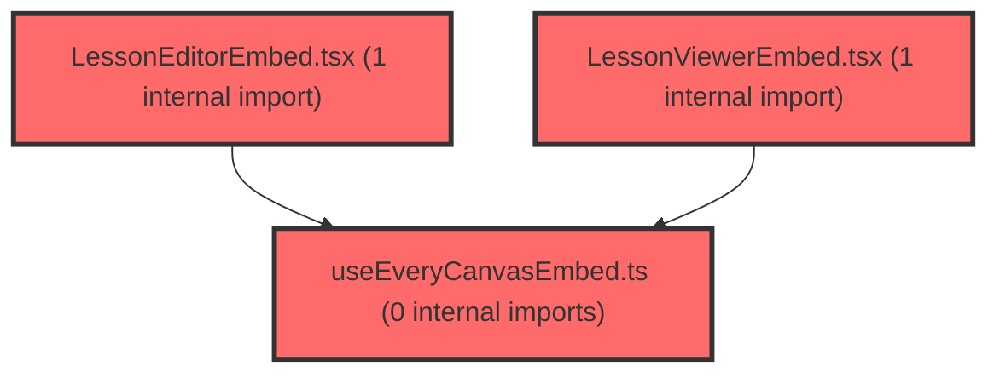

> [!IMPORTANT]
> **⚠️ 수동 검토 권장 (자가힐링 주의)**
>
> AI 자가힐링 결과물이 실제 의도와 다를 수 있으므로, **상세 리뷰 내용에 기반한 수동 점검**을 우선해 주시기 바랍니다. 자가힐링 기능을 활용하실 경우 최종 결과물을 신중하게 확인해 주세요.

# 코드 리뷰 - 12ee390d

## 코드 복잡도 분석

**분석된 파일**: 8개 / 변경된 파일: 9개


### Import 의존관계 다이어그램



**범례**: 중심 파일 (변경됨) | 많은 import (10개 이상)


### 정상 범위 (NONE)


**`routes.tsx`** (other)

- 평균 복잡도: **0.057**

- 최대 복잡도: 0.463

- 청크 수: 22개

- 평균 사용처: 2.5곳


**권장사항:**

- 파일 크기가 큼 (22개 청크) - 파일 분리 검토


**`lessonviewerembed.tsx`** (component)

- 평균 복잡도: **0.003**

- 최대 복잡도: 0.015

- 청크 수: 12개


**권장사항:**

- 복잡도 정상 범위


**`lessonviewerpage.tsx`** (component)

- 평균 복잡도: **0.003**

- 최대 복잡도: 0.010

- 청크 수: 8개


**권장사항:**

- 복잡도 정상 범위


**`lessoneditorpage.tsx`** (component)

- 평균 복잡도: **0.002**

- 최대 복잡도: 0.007

- 청크 수: 7개


**권장사항:**

- 복잡도 정상 범위


**`useeverycanvasembed.ts`** (utility)

- 평균 복잡도: **0.001**

- 최대 복잡도: 0.003

- 청크 수: 11개


**권장사항:**

- 복잡도 정상 범위


**`lessoneditorembed.tsx`** (other)

- 평균 복잡도: **0.001**

- 최대 복잡도: 0.005

- 청크 수: 11개


**권장사항:**

- 복잡도 정상 범위


**`deploypage.tsx`** (component)

- 평균 복잡도: **0.000**

- 최대 복잡도: 0.005

- 청크 수: 167개


**권장사항:**

- 파일 크기가 큼 (167개 청크) - 파일 분리 검토


**`lessonmypage.tsx`** (component)

- 평균 복잡도: **0.000**

- 최대 복잡도: 0.007

- 청크 수: 20개


**권장사항:**

- 복잡도 정상 범위


---


## 변경 배경

이 커밋은 lesson 기능에서 사용되던 파라미터 명칭을 `itemId`/`slideId`에서 `setId`/`refSetId`로 통일하는 리팩토링입니다. CMS 세트 ID(`setId`)와 LMS 보관함 참조 ID(`refSetId`)를 명확히 구분하고, 라우트 경로와 컴포넌트 props의 명칭을 일관성 있게 정리했습니다. 또한 `lesson-library.plan.md` 문서에 추가계획 9~12의 상세 스펙을 정리했습니다.

- **목적**: lesson 도메인의 파라미터 명칭 통일 및 향후 URL 직접 진입 시 item 재조회(추가계획9 2차)를 위한 스펙 문서화
- **도메인**: 프론트엔드 라우팅/컴포넌트 리팩토링 (UI)
- **변경 방향**: `itemId`/`slideId`라는 모호한 명칭을 실제 데이터 모델(CMS `setId`, LMS `refSetId`)에 맞춰 명확화

## [GOOD] 잘된 점

- 파라미터 명칭을 실제 데이터 모델(`setId`, `refSetId`)에 맞춰 통일하여 의미가 명확해졌습니다. `itemId`/`slideId`는 같은 개념을 혼용하던 모호함을 제거했습니다.
- `routes.tsx`에 `/lesson/deploy/:setId/:refSetId` 라우트를 추가하여 나의 자료(보관함) 진입 경로를 미리 확보했습니다.
- `lesson-library.plan.md`에 추가계획 9~12의 상세 스펙(API 스펙, 매퍼 비교, 우선순위, 완료 기준)을 체계적으로 문서화하여 후속 구현의 기준을 명확히 했습니다.

## 변경사항 요약

파라미터 명칭 통일(`itemId`/`slideId` → `setId`/`refSetId`)을 라우트, 컴포넌트 props, 훅 파라미터에 일괄 적용했습니다. 동시에 `useEveryCanvasEmbed.ts`에 디버깅용 `console.log`가 추가되고, `LessonEditorPage`/`LessonViewerPage`의 에러 로그 가드(`import.meta.env.DEV`)가 주석 처리되어 프로덕션에서도 로그가 출력되도록 변경되었습니다.

---

## [ISSUE] 개선이 필요한 부분

### Critical (즉시 수정 필요)

없음

### High (우선 수정 권장)

- **프로덕션에 디버깅 로그가 남음**: `useEveryCanvasEmbed.ts`의 `console.log('[useEveryCanvasEmbed] onReady] ', setId, handle?.openSet)`가 추가되었고, `LessonEditorPage.tsx`와 `LessonViewerPage.tsx`의 `console.warn`에서 `import.meta.env.DEV` 가드가 주석 처리되어 프로덕션 빌드에서도 콘솔 로그가 출력됩니다. 이는 디버깅 목적의 임시 코드로 보이며, 프로덕션 로그 오염과 성능(특히 `onReady` 콜백에서 매번 실행) 문제를 유발할 수 있습니다.

### Medium (개선 권장)

- `LessonViewerPage.tsx`의 `handleError`가 컴포넌트 본문에서 매 렌더마다 새로 생성됩니다. `LessonViewerEmbed`에 `onError`로 전달되지만, `useEveryCanvasEmbed`가 `onErrorRef`를 통해 최신 콜백을 참조하므로 기능상 문제는 없습니다. 다만 `useCallback`으로 감싸면 불필요한 재생성 방지에 도움이 됩니다.

---

## 주요 파일 분석

### frontend/src/features/lesson/lib/useEveryCanvasEmbed.ts

**변경 내용:**
`openSetId` 파라미터를 `setId`로 명칭 변경하고, `onReady` 콜백에 디버깅용 `console.log`를 추가했습니다.

**개선 제안:**

1. 디버깅용 `console.log` 제거
   - **위치 (라인 98)**: `console.log('[useEveryCanvasEmbed] onReady] ', setId, handle?.openSet);`
   - **기존 코드**:
```
          onReadyRef.current?.();
          const setId = openSetIdRef.current;
          console.log('[useEveryCanvasEmbed] onReady] ', setId, handle?.openSet);
          if (setId && typeof handle?.openSet === 'function') {
```
   - **해결 방안 (수정 코드)**:
```
          onReadyRef.current?.();
          const setId = openSetIdRef.current;
          if (setId && typeof handle?.openSet === 'function') {
```
     > `read_file`로 해당 함수 전체를 확인했습니다. `console.log`는 `onReady` 콜백 내부에서 `openSet` 호출 직전에 위치하며, 제거해도 로직에 영향이 없습니다. `setId` 변수는 다음 줄의 `if` 조건에서 여전히 사용되므로 유지됩니다.

### frontend/src/pages/lesson/LessonEditorPage.tsx

**변경 내용:**
`openSet` props를 `setId`로 명칭 변경하고, `handleError`의 `import.meta.env.DEV` 가드를 주석 처리했습니다.

**개선 제안:**

1. `console.warn`의 DEV 가드 복원
   - **위치 (라인 40-43)**: `handleError` 함수 내부
   - **기존 코드**:
```
  const handleError = (error: EmbedError) => {
    // if (import.meta.env.DEV) {
    console.warn('[LessonEditorPage] embed error', error.code, error.message);
    // }
  };
```
   - **해결 방안 (수정 코드)**:
```
  const handleError = (error: EmbedError) => {
    if (import.meta.env.DEV) {
      console.warn('[LessonEditorPage] embed error', error.code, error.message);
    }
  };
```
     > `read_file`로 해당 함수 전체를 확인했습니다. 주석 처리된 가드를 복원하면 프로덕션에서 에러 로그가 출력되지 않습니다. 에러 처리는 `onError` 콜백으로 이미 전달되므로 로그 제거가 기능에 영향을 주지 않습니다.

### frontend/src/pages/lesson/LessonViewerPage.tsx

**변경 내용:**
`slideId`를 `setId`로 명칭 변경하고, `onError` 핸들러를 추가했습니다.

**개선 제안:**

1. `console.warn`의 DEV 가드 복원 (LessonEditorPage와 동일한 패턴)
   - **위치 (라인 20-23)**: `handleError` 함수 내부
   - **기존 코드**:
```
  const handleError = (error: EmbedError) => {
    // if (import.meta.env.DEV) {
    console.warn('[LessonViewerPage] embed error', error.code, error.message);
    // }
  };
```
   - **해결 방안 (수정 코드)**:
```
  const handleError = (error: EmbedError) => {
    if (import.meta.env.DEV) {
      console.warn('[LessonViewerPage] embed error', error.code, error.message);
    }
  };
```
     > `read_file`로 해당 함수 전체를 확인했습니다. LessonEditorPage와 동일한 패턴으로 가드를 복원합니다.

---

## 최종 평가

**결론**: 
- [ ] [OK] **승인 (Approved)** - Critical/High 이슈 없음
- [ ] [WARN] **조건부 승인 (Approved with Comments)** - Medium 이하 이슈만 존재
- [x] [FIX] **수정 필요 (Changes Requested)** - Critical/High 이슈 존재

**종합 의견:**

파라미터 명칭 통일(`setId`/`refSetId`)은 데이터 모델과 일치하는 명확한 개선이며, 문서화도 체계적입니다. 다만 프로덕션에 남겨진 디버깅용 `console.log`/`console.warn`(DEV 가드 주석 처리)은 반드시 정리해야 합니다. 이는 임시 디버깅 코드로 보이며, 프로덕션 로그 오염과 불필요한 콘솔 출력을 유발합니다. 해당 로그를 제거하거나 DEV 가드를 복원하면 승인 가능한 수준입니다.