> [!IMPORTANT]
> **⚠️ 수동 검토 권장 (자가힐링 주의)**
>
> AI 자가힐링 결과물이 실제 의도와 다를 수 있으므로, **상세 리뷰 내용에 기반한 수동 점검**을 우선해 주시기 바랍니다. 자가힐링 기능을 활용하실 경우 최종 결과물을 신중하게 확인해 주세요.

# 코드 리뷰 - 1816e34e

## 코드 복잡도 분석

**분석된 파일**: 41개 / 변경된 파일: 43개


### Import 의존관계 다이어그램

```mermaid
flowchart TD
    F0["StudentReportDashboard.tsx (1 internal import)"]:::center
    F1["ReportCardList.tsx (3 internal imports)"]:::center
    F2["ReportCard.tsx (0 internal imports)"]:::center
    F3["StudentTab.tsx (2 internal imports)"]:::center
    F4["reportDetailTypes.ts (0 internal imports)"]:::center
    F5["lmsActivityService.ts (0 internal imports)"]:::center
    F6["ReportSummary.tsx (1 internal import)"]:::center
    F7["SummaryStrip.tsx (0 internal imports)"]:::center
    F8["StudentDetailReport.tsx (1 internal import)"]:::center
    F9["types.ts (0 internal imports)"]:::center
    F10["queries.ts (2 internal imports)"]:::center
    F11["studentReportTypes.ts (1 internal import)"]:::center
    F12["studentResultBadges.tsx (0 internal imports)"]:::center
    F13["reportDetailMock.ts (1 internal import)"]:::center
    F14["reportBadges.tsx (0 internal imports)"]:::center
    F15["PageTab.tsx (2 internal imports)"]:::center
    F16["queryKeys.ts (0 internal imports)"]:::center
    F17["ReportFilterChips.tsx (1 internal import)"]:::center
    F18["PageContent.tsx (3 internal imports)"]:::center
    F19["ReportDetail.tsx (4 internal imports)"]:::center
    F20["ReportDetailTabBar.tsx (0 internal imports)"]:::center
    F21["ResponseGrid.tsx (1 internal import)"]:::center
    F22["PageList.tsx (1 internal import)"]:::center
    F10 --> F5
    F10 --> F16
    F13 --> F4
    F11 --> F4
    F18 --> F7
    F18 --> F14
    F18 --> F21
    F22 --> F14
    F15 --> F22
    F15 --> F18
    F1 --> F9
    F1 --> F1
    F1 --> F2
    F19 --> F15
    F19 --> F6
    F19 --> F20
    F19 --> F3
    F17 --> F9
    F6 --> F14
    F21 --> F14
    F3 --> F14
    F3 --> F21
    F8 --> F14
    F0 --> F12
    classDef center fill:#ff6b6b,stroke:#333,stroke-width:3px
    classDef high fill:#ffd93d,stroke:#333,stroke-width:2px
```



**범례**: 중심 파일 (변경됨) | 많은 import (10개 이상)


### 정상 범위 (NONE)


**`routes.tsx`** (other)

- 평균 복잡도: **0.052**

- 최대 복잡도: 0.463

- 청크 수: 24개

- 평균 사용처: 2.3곳


**권장사항:**

- 파일 크기가 큼 (24개 청크) - 파일 분리 검토


**`index.ts`** (component)

- 평균 복잡도: **0.026**

- 최대 복잡도: 0.461

- 청크 수: 36개

- 평균 사용처: 1.7곳


**권장사항:**

- 파일 크기가 큼 (36개 청크) - 파일 분리 검토


**`lmsactivityservice.ts`** (other)

- 평균 복잡도: **0.003**

- 최대 복잡도: 0.007

- 청크 수: 38개


**권장사항:**

- 파일 크기가 큼 (38개 청크) - 파일 분리 검토


**`queries.ts`** (other)

- 평균 복잡도: **0.003**

- 최대 복잡도: 0.012

- 청크 수: 62개


**권장사항:**

- 파일 크기가 큼 (62개 청크) - 파일 분리 검토


**`studentlessonresultpage.tsx`** (component)

- 평균 복잡도: **0.003**

- 최대 복잡도: 0.003

- 청크 수: 2개


**권장사항:**

- 복잡도 정상 범위


**`index.ts`** (other)

- 평균 복잡도: **0.002**

- 최대 복잡도: 0.006

- 청크 수: 32개


**권장사항:**

- 파일 크기가 큼 (32개 청크) - 파일 분리 검토


**`reportdetailmock.ts`** (other)

- 평균 복잡도: **0.002**

- 최대 복잡도: 0.004

- 청크 수: 6개


**권장사항:**

- 복잡도 정상 범위


**`reportdetailtypes.ts`** (other)

- 평균 복잡도: **0.002**

- 최대 복잡도: 0.005

- 청크 수: 10개


**권장사항:**

- 복잡도 정상 범위


**`reportdetailutils.ts`** (utility)

- 평균 복잡도: **0.002**

- 최대 복잡도: 0.010

- 청크 수: 29개


**권장사항:**

- 파일 크기가 큼 (29개 청크) - 파일 분리 검토


**`studentreporttypes.ts`** (other)

- 평균 복잡도: **0.002**

- 최대 복잡도: 0.006

- 청크 수: 6개


**권장사항:**

- 복잡도 정상 범위


**`studentlessonresultdetailpage.tsx`** (component)

- 평균 복잡도: **0.002**

- 최대 복잡도: 0.004

- 청크 수: 5개


**권장사항:**

- 복잡도 정상 범위


**`index.ts`** (other)

- 평균 복잡도: **0.002**

- 최대 복잡도: 0.003

- 청크 수: 4개


**권장사항:**

- 복잡도 정상 범위


**`studentreportmock.ts`** (other)

- 평균 복잡도: **0.001**

- 최대 복잡도: 0.002

- 청크 수: 7개


**권장사항:**

- 복잡도 정상 범위


**`lessonreportdetailpage.tsx`** (component)

- 평균 복잡도: **0.001**

- 최대 복잡도: 0.004

- 청크 수: 6개


**권장사항:**

- 복잡도 정상 범위


**`lessonresultpage.tsx`** (component)

- 평균 복잡도: **0.001**

- 최대 복잡도: 0.010

- 청크 수: 17개


**권장사항:**

- 복잡도 정상 범위


**`lessonlibrarycontents.tsx`** (utility)

- 평균 복잡도: **0.001**

- 최대 복잡도: 0.004

- 청크 수: 12개


**권장사항:**

- 복잡도 정상 범위


**`pagelist.tsx`** (component)

- 평균 복잡도: **0.001**

- 최대 복잡도: 0.012

- 청크 수: 33개


**권장사항:**

- 파일 크기가 큼 (33개 청크) - 파일 분리 검토


**`pagetab.tsx`** (component)

- 평균 복잡도: **0.001**

- 최대 복잡도: 0.008

- 청크 수: 18개


**권장사항:**

- 복잡도 정상 범위


**`reportdetail.tsx`** (other)

- 평균 복잡도: **0.001**

- 최대 복잡도: 0.010

- 청크 수: 19개


**권장사항:**

- 복잡도 정상 범위


**`reportdetailtabbar.tsx`** (other)

- 평균 복잡도: **0.001**

- 최대 복잡도: 0.005

- 청크 수: 15개


**권장사항:**

- 복잡도 정상 범위


**`reportfilterchips.tsx`** (other)

- 평균 복잡도: **0.001**

- 최대 복잡도: 0.004

- 청크 수: 14개


**권장사항:**

- 복잡도 정상 범위


**`reportbadges.tsx`** (other)

- 평균 복잡도: **0.001**

- 최대 복잡도: 0.003

- 청크 수: 31개


**권장사항:**

- 파일 크기가 큼 (31개 청크) - 파일 분리 검토


**`studentlessonbanner.tsx`** (other)

- 평균 복잡도: **0.001**

- 최대 복잡도: 0.007

- 청크 수: 25개


**권장사항:**

- 파일 크기가 큼 (25개 청크) - 파일 분리 검토


**`studentlessonresultshell.tsx`** (other)

- 평균 복잡도: **0.001**

- 최대 복잡도: 0.002

- 청크 수: 6개


**권장사항:**

- 복잡도 정상 범위


**`studentresultbadges.tsx`** (other)

- 평균 복잡도: **0.001**

- 최대 복잡도: 0.002

- 청크 수: 9개


**권장사항:**

- 복잡도 정상 범위


**`querykeys.ts`** (other)

- 평균 복잡도: **0.000**

- 최대 복잡도: 0.005

- 청크 수: 11개


**권장사항:**

- 복잡도 정상 범위


**`studentlayout.tsx`** (other)

- 평균 복잡도: **0.000**

- 최대 복잡도: 0.008

- 청크 수: 96개


**권장사항:**

- 파일 크기가 큼 (96개 청크) - 파일 분리 검토


**`index.ts`** (utility)

- 평균 복잡도: **0.000**

- 최대 복잡도: 0.000

- 청크 수: 1개


**권장사항:**

- 복잡도 정상 범위


**`pagecontent.tsx`** (component)

- 평균 복잡도: **0.000**

- 최대 복잡도: 0.005

- 청크 수: 32개


**권장사항:**

- 파일 크기가 큼 (32개 청크) - 파일 분리 검토


**`reportcard.tsx`** (other)

- 평균 복잡도: **0.000**

- 최대 복잡도: 0.002

- 청크 수: 35개


**권장사항:**

- 파일 크기가 큼 (35개 청크) - 파일 분리 검토


**`reportcardlist.tsx`** (other)

- 평균 복잡도: **0.000**

- 최대 복잡도: 0.006

- 청크 수: 32개


**권장사항:**

- 파일 크기가 큼 (32개 청크) - 파일 분리 검토


**`reportsummary.tsx`** (other)

- 평균 복잡도: **0.000**

- 최대 복잡도: 0.009

- 청크 수: 46개


**권장사항:**

- 파일 크기가 큼 (46개 청크) - 파일 분리 검토


**`responsegrid.tsx`** (other)

- 평균 복잡도: **0.000**

- 최대 복잡도: 0.004

- 청크 수: 40개


**권장사항:**

- 파일 크기가 큼 (40개 청크) - 파일 분리 검토


**`statuspanel.tsx`** (other)

- 평균 복잡도: **0.000**

- 최대 복잡도: 0.001

- 청크 수: 52개


**권장사항:**

- 파일 크기가 큼 (52개 청크) - 파일 분리 검토


**`studenttab.tsx`** (other)

- 평균 복잡도: **0.000**

- 최대 복잡도: 0.005

- 청크 수: 72개


**권장사항:**

- 파일 크기가 큼 (72개 청크) - 파일 분리 검토


**`summarystrip.tsx`** (other)

- 평균 복잡도: **0.000**

- 최대 복잡도: 0.004

- 청크 수: 16개


**권장사항:**

- 복잡도 정상 범위


**`index.ts`** (other)

- 평균 복잡도: **0.000**

- 최대 복잡도: 0.000

- 청크 수: 6개


**권장사항:**

- 복잡도 정상 범위


**`types.ts`** (other)

- 평균 복잡도: **0.000**

- 최대 복잡도: 0.000

- 청크 수: 1개


**권장사항:**

- 복잡도 정상 범위


**`studentdetailreport.tsx`** (other)

- 평균 복잡도: **0.000**

- 최대 복잡도: 0.008

- 청크 수: 71개


**권장사항:**

- 파일 크기가 큼 (71개 청크) - 파일 분리 검토


**`studentreportdashboard.tsx`** (other)

- 평균 복잡도: **0.000**

- 최대 복잡도: 0.003

- 청크 수: 32개


**권장사항:**

- 파일 크기가 큼 (32개 청크) - 파일 분리 검토


**`index.ts`** (other)

- 평균 복잡도: **0.000**

- 최대 복잡도: 0.000

- 청크 수: 5개


**권장사항:**

- 복잡도 정상 범위


---


## 변경 배경

이 커밋은 학생용 수업 결과보기 화면(추가계획19)을 구현한 것입니다. prototype `StudentResourcePage`의 UI/UX를 frontend에 FSD Lite + Emotion으로 동등하게 구현하며, 목록(`/student/lesson/result`)과 상세(`/student/lesson/result/:activityId`)를 독립 라우트로 분리했습니다.

- **목적**: 학생이 자신의 수업 결과(진행 중 배너, 나의 수업 결과 리스트, 상세 리포트)를 볼 수 있는 화면 제공
- **도메인**: UI (프론트엔드, 학생 대시보드)
- **변경 방향**: prototype의 Context/Tailwind 구조를 배제하고, FSD Lite + Emotion + 로컬 목업으로 재구성. API 연동은 후속으로 보류

## [GOOD] 잘된 점

- **FSD 아키텍처 준수**: `pages`는 얇게 조합만 담당하고, 복잡한 UI는 `widgets/lesson/student-result/`에, 타입·목업은 `features/lesson/model/`에 분리하여 단방향 의존성을 잘 지켰습니다.
- **프로토타입 구조 미복제**: `useResources()` Context, Tailwind, `mock-data.ts` 복사를 피하고 Emotion `styled` + `theme.*` 토큰으로 재구성했습니다.
- **빈 상태/에지 케이스 처리**: 상세가 없는 행은 toast(`아직 제출하지 않은 활동이에요.`), 없는 activityId 직접 진입 시 돌아가기만 표시하는 등 UX 분기를 명확히 처리했습니다.
- **`navigate(-1)` 미사용**: 직접 URL 진입 시 앱 밖으로 나가는 문제를 방지하기 위해 명시적 경로로 이동하는 패턴을 일관되게 적용했습니다.

## 변경사항 요약

학생 수업 결과보기 목록/상세 페이지를 신규 구현했습니다. `StudentLessonResultShell`(896px + breadcrumb), `StudentLessonBanner`(진행 중 배너), `StudentReportDashboard`(리스트), `StudentDetailReport`(상세) 위젯과 `studentReportTypes/Mock` 모델, 라우트(`/student/lesson/result/:activityId`)를 추가했습니다. 목업 데이터(`sr-1`, `sr-4`)만 상세를 보유하며 API 연동은 후속으로 남겼습니다.

---

## [ISSUE] 개선이 필요한 부분

### Critical (즉시 수정 필요)

없음

### High (우선 수정 권장)

1. **`reportDetailMock.ts`의 `getReportDetailView`가 파라미터를 무시하고 항상 목업을 반환** — 이 커밋에서 `activityId` 파라미터를 `_activityId`로 변경하고 실제 분기 로직을 주석 처리했습니다. 이는 추가계획17(교사 리포트 상세)에서 의도된 임시 동작일 수 있으나, 실제 activityId로 진입 시 항상 `MOCK_REPORT_DETAIL`이 렌더되어 **잘못된 데이터가 노출**될 위험이 있습니다. 목업 단계라도 최소한 특정 id에서만 목업을 반환하도록 제한하는 것이 안전합니다.

### Medium (개선 권장)

1. **`StudentDetailReport`의 `answerText` 로직과 렌더링 분기 중복** — `answerText` 함수가 '개념'이면 '조회함', 아니면 `submitAnswer || '제출함'`을 반환하는데, 실제 렌더링에서는 `isQuestion && resp`일 때 별도 분기로 처리합니다. `answerText`는 `isQuestion`이 아닌 경우(활동/개념)에만 사용되는데, '개념'과 '활동'의 처리(조회함 vs 제출함)가 함수 내부에서 자연스럽게 분기되어 다소 혼란스러울 수 있습니다. 함수명과 실제 사용 범위의 일관성을 검토하면 좋습니다.

2. **`StudentReportDashboard`의 `handleRow`가 모듈 레벨 함수로 분리** — `handleRow`가 컴포넌트 외부에 정의되어 `open` 콜백을 인자로 받는 구조입니다. 컴포넌트 내부에서 `useCallback`으로 정의하거나 인라인 처리하는 편이 가독성과 클로저 관리에 더 명확할 수 있습니다. (다만 현재 구조도 동작에는 문제가 없어 선택적 개선입니다.)

---

## 주요 파일 분석

### `frontend/src/features/lesson/model/studentReportMock.ts`

**변경 내용:** 학생 목록/상세 목업 데이터와 getter 함수(`getStudentReportList`, `getStudentReportDetail`, `hasStudentReportDetail`) 정의.

**개선 제안:**

1. `hasStudentReportDetail`이 `getStudentReportDetail(id) != null`로 구현되어 있어, 상세 데이터가 큰 경우 매번 전체 객체를 조회합니다. 목업 단계라 성능 이슈는 없지만, `DETAILS` 객체의 키 존재 여부만 확인하는 방식(`id in DETAILS`)이 더 명확합니다.
   - **위치**: `studentReportMock.ts` 마지막 줄
   - **기존 코드**:
   ```
   export const hasStudentReportDetail = (id: string): boolean => getStudentReportDetail(id) != null;
   ```
   - **해결 방안 (수정 코드)**:
   ```
   export const hasStudentReportDetail = (id: string): boolean => id in DETAILS;
   ```

### `frontend/src/widgets/lesson/student-result/StudentDetailReport.tsx`

**변경 내용:** 돌아가기 + 요약 타일 + 페이지별 내 활동을 렌더링하는 상세 화면.

**개선 제안:**

1. `buildTiles`에서 `gradedN > 0`일 때만 '정답률' 타일을 추가하는데, `sr-4`처럼 `gradedN: 0`이면 타일이 2개만 렌더됩니다. `TileGrid`가 `$cols={tiles.length}`로 동적 그리드를 구성하므로 정상 동작하지만, 타일 수가 1개일 때(예: gradedN=0이고 durationSec만 있는 극단 케이스) 레이아웃이 좁아질 수 있습니다. 최소 타일 수 보장(예: `Math.max(tiles.length, 2)`)을 고려할 수 있습니다. 다만 현재 목업 데이터로는 항상 2~3개라 실질 문제는 없습니다.

### `frontend/src/features/lesson/model/reportDetailMock.ts`

**변경 내용:** `getReportDetailView`의 파라미터를 `_activityId`로 변경하고 분기 로직을 주석 처리.

**개선 제안:**

1. (High 이슈와 동일) 실제 activityId로 진입 시 항상 `MOCK_REPORT_DETAIL`이 반환되는 임시 상태입니다. 목업 단계라도 특정 id에서만 목업을 반환하도록 제한하는 것이 안전합니다.
   - **위치**: `reportDetailMock.ts` 48-51행
   - **기존 코드**:
   ```
   export const getReportDetailView = (_activityId: string): ReportDetailView => {
     return MOCK_REPORT_DETAIL;
     // if (activityId === MOCK_REPORT_DETAIL.activityId) return MOCK_REPORT_DETAIL;
     // return emptyReportDetail(activityId);
   };
   ```
   - **해결 방안 (수정 코드)**:
   ```
   export const getReportDetailView = (activityId: string): ReportDetailView => {
     if (activityId === MOCK_REPORT_DETAIL.activityId) return MOCK_REPORT_DETAIL;
     return emptyReportDetail(activityId);
   };
   ```

---

## 최종 평가

**결론**:
- [ ] [OK] **승인 (Approved)** - Critical/High 이슈 없음
- [x] [WARN] **조건부 승인 (Approved with Comments)** - Medium 이하 이슈만 존재
- [ ] [FIX] **수정 필요 (Changes Requested)** - Critical/High 이슈 존재

**종합 의견:**

FSD 아키텍처와 Emotion/theme 토큰 규칙을 잘 준수하며, prototype의 구조 복제를 피하고 빈 상태·에지 케이스를 꼼꼼히 처리한 견고한 구현입니다. `reportDetailMock.ts`의 임시 목업 반환 로직은 후속 API 연동(추가계획18) 시 반드시 정리되어야 할 부분으로, 목업 단계임을 감안하면 승인 가능한 수준입니다. 목업 데이터가 실제 화면 확인에 충분히 활용되고 있어 전반적으로 잘 작성된 커밋입니다.