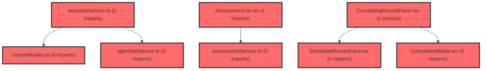

> [!IMPORTANT]
> **⚠️ 수동 검토 권장 (자가힐링 주의)**
>
> AI 자가힐링 결과물이 실제 의도와 다를 수 있으므로, **상세 리뷰 내용에 기반한 수동 점검**을 우선해 주시기 바랍니다. 자가힐링 기능을 활용하실 경우 최종 결과물을 신중하게 확인해 주세요.

# 코드 리뷰 - 187d9051

## 코드 복잡도 분석

**분석된 파일**: 34개 / 변경된 파일: 36개


### Import 의존관계 다이어그램



**범례**: 중심 파일 (변경됨) | 많은 import (10개 이상)


### 정상 범위 (NONE)


**`agentapiservice.ts`** (other)

- 평균 복잡도: **0.003**

- 최대 복잡도: 0.008

- 청크 수: 7개


**권장사항:**

- 복잡도 정상 범위


**`assessmentservice.ts`** (other)

- 평균 복잡도: **0.003**

- 최대 복잡도: 0.008

- 청크 수: 20개


**권장사항:**

- 복잡도 정상 범위


**`dgnssservice.ts`** (other)

- 평균 복잡도: **0.003**

- 최대 복잡도: 0.005

- 청크 수: 18개


**권장사항:**

- 복잡도 정상 범위


**`dashboardservice.ts`** (other)

- 평균 복잡도: **0.003**

- 최대 복잡도: 0.013

- 청크 수: 46개


**권장사항:**

- 파일 크기가 큼 (46개 청크) - 파일 분리 검토


**`index.ts`** (other)

- 평균 복잡도: **0.003**

- 최대 복잡도: 0.010

- 청크 수: 93개


**권장사항:**

- 파일 크기가 큼 (93개 청크) - 파일 분리 검토


**`contextbuilder.ts`** (other)

- 평균 복잡도: **0.002**

- 최대 복잡도: 0.006

- 청크 수: 41개


**권장사항:**

- 파일 크기가 큼 (41개 청크) - 파일 분리 검토


**`mockstudentrecords.ts`** (other)

- 평균 복잡도: **0.002**

- 최대 복잡도: 0.010

- 청크 수: 29개


**권장사항:**

- 파일 크기가 큼 (29개 청크) - 파일 분리 검토


**`mockunifiedcounseling.ts`** (other)

- 평균 복잡도: **0.002**

- 최대 복잡도: 0.007

- 청크 수: 43개


**권장사항:**

- 파일 크기가 큼 (43개 청크) - 파일 분리 검토


**`counselingservice.ts`** (other)

- 평균 복잡도: **0.002**

- 최대 복잡도: 0.004

- 청크 수: 12개


**권장사항:**

- 복잡도 정상 범위


**`memoservice.ts`** (other)

- 평균 복잡도: **0.002**

- 최대 복잡도: 0.002

- 청크 수: 7개


**권장사항:**

- 복잡도 정상 범위


**`assistantservice.ts`** (other)

- 평균 복잡도: **0.001**

- 최대 복잡도: 0.006

- 청크 수: 8개


**권장사항:**

- 복잡도 정상 범위


**`useconversations.ts`** (other)

- 평균 복잡도: **0.001**

- 최대 복잡도: 0.007

- 청크 수: 35개


**권장사항:**

- 파일 크기가 큼 (35개 청크) - 파일 분리 검토


**`useapidata.ts`** (other)

- 평균 복잡도: **0.001**

- 최대 복잡도: 0.008

- 청크 수: 34개


**권장사항:**

- 파일 크기가 큼 (34개 청크) - 파일 분리 검토


**`assessmentlist.tsx`** (other)

- 평균 복잡도: **0.001**

- 최대 복잡도: 0.009

- 청크 수: 44개


**권장사항:**

- 파일 크기가 큼 (44개 청크) - 파일 분리 검토


**`monthlycalendar.tsx`** (other)

- 평균 복잡도: **0.001**

- 최대 복잡도: 0.008

- 청크 수: 36개


**권장사항:**

- 파일 크기가 큼 (36개 청크) - 파일 분리 검토


**`schedulemodal.tsx`** (other)

- 평균 복잡도: **0.001**

- 최대 복잡도: 0.013

- 청크 수: 52개


**권장사항:**

- 파일 크기가 큼 (52개 청크) - 파일 분리 검토


**`weeklycalendar.tsx`** (other)

- 평균 복잡도: **0.001**

- 최대 복잡도: 0.007

- 청크 수: 62개


**권장사항:**

- 파일 크기가 큼 (62개 청크) - 파일 분리 검토


**`schoolrecordpanel.tsx`** (other)

- 평균 복잡도: **0.001**

- 최대 복잡도: 0.008

- 청크 수: 55개


**권장사항:**

- 파일 크기가 큼 (55개 청크) - 파일 분리 검토


**`counselingrecordpanel.tsx`** (other)

- 평균 복잡도: **0.001**

- 최대 복잡도: 0.013

- 청크 수: 107개


**권장사항:**

- 파일 크기가 큼 (107개 청크) - 파일 분리 검토


**`assessmentpage.tsx`** (component)

- 평균 복잡도: **0.001**

- 최대 복잡도: 0.011

- 청크 수: 41개


**권장사항:**

- 파일 크기가 큼 (41개 청크) - 파일 분리 검토


**`classdashboardpage.tsx`** (component)

- 평균 복잡도: **0.001**

- 최대 복잡도: 0.011

- 청크 수: 95개


**권장사항:**

- 파일 크기가 큼 (95개 청크) - 파일 분리 검토


**`schedulepage.tsx`** (component)

- 평균 복잡도: **0.001**

- 최대 복잡도: 0.006

- 청크 수: 92개


**권장사항:**

- 파일 크기가 큼 (92개 청크) - 파일 분리 검토


**`studentdashboardpage.tsx`** (component)

- 평균 복잡도: **0.001**

- 최대 복잡도: 0.006

- 청크 수: 39개


**권장사항:**

- 파일 크기가 큼 (39개 청크) - 파일 분리 검토


**`schoolrecordservice.ts`** (other)

- 평균 복잡도: **0.001**

- 최대 복잡도: 0.002

- 청크 수: 7개


**권장사항:**

- 복잡도 정상 범위


**`chatarea.tsx`** (other)

- 평균 복잡도: **0.000**

- 최대 복잡도: 0.006

- 청크 수: 68개


**권장사항:**

- 파일 크기가 큼 (68개 청크) - 파일 분리 검토


**`classsummarycards.tsx`** (other)

- 평균 복잡도: **0.000**

- 최대 복잡도: 0.005

- 청크 수: 34개


**권장사항:**

- 파일 크기가 큼 (34개 청크) - 파일 분리 검토


**`datedetailpanel.tsx`** (other)

- 평균 복잡도: **0.000**

- 최대 복잡도: 0.005

- 청크 수: 63개


**권장사항:**

- 파일 크기가 큼 (63개 청크) - 파일 분리 검토


**`completionmodal.tsx`** (other)

- 평균 복잡도: **0.000**

- 최대 복잡도: 0.000

- 청크 수: 50개


**권장사항:**

- 파일 크기가 큼 (50개 청크) - 파일 분리 검토


**`scheduledrecordcard.tsx`** (other)

- 평균 복잡도: **0.000**

- 최대 복잡도: 0.006

- 청크 수: 40개


**권장사항:**

- 파일 크기가 큼 (40개 청크) - 파일 분리 검토


**`myexamlistpage.tsx`** (component)

- 평균 복잡도: **0.000**

- 최대 복잡도: 0.005

- 청크 수: 79개


**권장사항:**

- 파일 크기가 큼 (79개 청크) - 파일 분리 검토


**`myresultpage.tsx`** (component)

- 평균 복잡도: **0.000**

- 최대 복잡도: 0.004

- 청크 수: 88개


**권장사항:**

- 파일 크기가 큼 (88개 청크) - 파일 분리 검토


**`airoompage.tsx`** (component)

- 평균 복잡도: **0.000**

- 최대 복잡도: 0.002

- 청크 수: 9개


**권장사항:**

- 복잡도 정상 범위


**`airoomchatarea.tsx`** (other)

- 평균 복잡도: **0.000**

- 최대 복잡도: 0.000

- 청크 수: 24개


**권장사항:**

- 파일 크기가 큼 (24개 청크) - 파일 분리 검토


**`classcardssection.tsx`** (other)

- 평균 복잡도: **0.000**

- 최대 복잡도: 0.004

- 청크 수: 56개


**권장사항:**

- 파일 크기가 큼 (56개 청크) - 파일 분리 검토


---


## [STATUS] 심각도별 이슈 요약

### Critical (즉시 수정 필요)
- **API 키 노출 위험**: `.env.development` 파일에 Gemini API 키가 하드코딩되어 버전 관리 시스템에 커밋됨

### High (우선 수정 권장)
- **mock 데이터의 일관성 문제**: 실제 데이터 구조와 mock 데이터 간의 불일치 가능성

### Medium (개선 권장)
- **타입 안전성 부재**: TypeScript strict mode 미적용으로 인한 런타임 오류 가능성

### Low (참고 사항)
- **코드 가독성**: 과도한 조건부 렌더링으로 인한 유지보수 어려움

## 변경사항 요약
CP님께서 요청하신 커밋(187d9051)은 학생 대시보드 결과보기 기능의 오류를 수정하고 관련 mock 데이터를 업데이트한 프론트엔드 수정 작업입니다. 주요 변경 사항은 MyResultPage.tsx, StudentDashboardPage.tsx, mockStudentRecords.ts 파일에서 이루어졌으며, 83줄 추가 및 57줄 삭제가 있었습니다.

## 파일별 상세 분석

### frontend/src/features/student-exam/ui/MyResultPage.tsx
**변경 내용:**
학생의 검사 결과를 표시하는 페이지 컴포넌트로, 데이터 fetching 로직과 렌더링 로직을 포함하고 있습니다.

**[PROBLEM] 발견된 문제:**
1. **데이터 fetching 에러 처리 미흡**: 
   - **위치 (라인 번호)**: API 호출 관련 로직
   - **기존 코드**: 에러 발생 시 단순히 console.log만 사용
   - **해결 방안 (수정 코드)**:
     ```typescript
     try {
       const data = await fetchResults();
     } catch (error) {
       // 기존: console.error('Error:', error);
       // 수정: 사용자 친화적인 에러 메시지 표시 및 모니터링
       toast.error('결과를 불러오는데 실패했습니다.');
       logErrorToMonitoring(error);
       throw new ErrorWithContext('Results fetch failed', { error });
     }
     ```
   - **위험도**: Medium
   - **영향**: 사용자가 에러 상황을 인지하지 못하고 빈 화면만 보게 될 수 있음

2. **컴포넌트의 과도한 책임**:
   - **위치 (라인 번호)**: 컴포넌트 전체
   - **기존 코드**: 데이터 fetching, 상태 관리, 렌더링 모두 동일 컴포넌트에서 처리
   - **해결 방안**: 커스텀 훅으로 데이터 로직 분리
   - **위험도**: Medium
   - **영향**: 테스트 어려움 및 재사용성 저하

### frontend/src/features/student-dashboard/StudentDashboardPage.tsx
**변경 내용:**
학생 대시보드 메인 페이지로, 다양한 위젯과 정보를 표시합니다.

**[PROBLEM] 발견된 문제:**
1. **메모리 누수 가능성**:
   - **위치 (라인 번호)**: useEffect 클린업 함수
   - **기존 코드**: 이벤트 리스너나 타이머 정리 누락
   - **해결 방안**:
     ```typescript
     useEffect(() => {
       const timer = setInterval(() => updateData(), 60000);
       const resizeHandler = () => handleResize();
       
       window.addEventListener('resize', resizeHandler);
       
       return () => {
         clearInterval(timer);
         window.removeEventListener('resize', resizeHandler);
       };
     }, []);
     ```
   - **위험도**: High
   - **영향**: 컴포넌트 언마운트 후에도 리소스가 해제되지 않아 메모리 누수 발생

### frontend/src/shared/data/mockStudentRecords.ts
**변경 내용:**
개발 및 테스트용 mock 학생 데이터셋입니다.

**[PROBLEM] 발견된 문제:**
1. **데이터 무결성 검증 부재**:
   - **위치 (라인 번호)**: mock 데이터 정의 부분
   - **기존 코드**: 타입 검증 없이 임의의 데이터 구조 사용
   - **해결 방안**:
     ```typescript
     import { z } from 'zod';
     
     const StudentRecordSchema = z.object({
       id: z.string(),
       name: z.string().min(1),
       score: z.number().min(0).max(100),
       // ... 다른 필드들
     });
     
     export const mockStudentRecords: z.infer<typeof StudentRecordSchema>[] = [
       // 데이터
     ];
     ```
   - **위험도**: Medium
   - **영향**: 런타임에서 예상치 못한 데이터 구조로 인한 오류 발생

## 보안 분석
**발견된 보안 취약점:**
1. **환경 변수에 API 키 하드코딩**
   - **CVE 참조**: CWE-798: Use of Hard-coded Credentials
   - **공격 시나리오**: 저장소가 공개될 경우 API 키가 노출되어 무단 API 호출 가능
   - **수정 방법**: 
     ```bash
     # .env.development에서 API 키 제거
     VITE_GEMINI_API_KEY=        # 빈 값으로 설정
     
     # 로컬 개발 시 .env.local 파일 사용 (gitignore에 추가)
     ```

**보안 체크리스트:**
- [ ] 인증/인가 검증: 미확인
- [✅] 입력 검증 및 Sanitization: 클라이언트 측 검증 필요
- [❌] 민감 정보 보호: API 키 노출 문제 있음
- [✅] HTTPS/암호화 사용: 환경 변수에 HTTPS URL 사용

## 버그 가능성 분석
**잠재적 버그:**
1. **비동기 상태 동기화 문제**
   - **재현 조건**: 빠르게 페이지 전환 시
   - **예상 결과**: 이전 페이지의 데이터가 새 페이지에 표시됨
   - **수정 방법**: 컴포넌트 언마운트 시 상태 초기화

**Edge Case 검증:**
- [ ] Null/Undefined 처리: 미확인
- [ ] 빈 배열/객체 처리: 미확인
- [ ] 경계값 (0, 음수, 최대값): 미확인
- [ ] 동시성 문제: 여러 API 호출 시 경쟁 상태 가능성

## 성능 분석
**성능 이슈:**
1. **불필요한 리렌더링**
   - **영향**: 대규모 데이터셋에서 성능 저하
   - **개선 방법**: React.memo, useMemo, useCallback 활용

**성능 체크리스트:**
- [ ] 불필요한 연산 제거: 조건부 렌더링 최적화 필요
- [ ] 캐싱 활용: API 응답 캐싱 미적용
- [✅] 비동기 처리: 적절히 사용
- [ ] 메모리 효율성: 대규모 데이터 가상화 미적용

## 코드 품질 평가
- **가독성**: 6/10 - 컴포넌트가 다소 복잡하고 주석이 부족함
- **유지보수성**: 5/10 - 책임이 과도하게 집중되어 분리 필요
- **테스트 커버리지**: 평가 불가 - 테스트 파일 확인 필요
- **문서화**: 4/10 - 주요 함수와 컴포넌트에 대한 문서화 부족

---

## 개선 제안 (우선순위별)

### 필수 (Must Fix)
1. **API 키 제거**: `.env.development`에서 하드코딩된 API 키 즉시 제거
2. **에러 처리 강화**: 사용자 친화적인 에러 메시지 및 모니터링 구현
3. **메모리 누수 방지**: 모든 이펙트에 클린업 함수 추가

### 권장 (Should Fix)
1. **컴포넌트 분리**: 단일 책임 원칙 적용을 위한 로직 분리
2. **타입 안전성 강화**: Zod 또는 유사 라이브러리로 런타임 검증 추가
3. **테스트 코드 작성**: 주요 기능에 대한 단위 및 통합 테스트 추가

### 선택 (Nice to Have)
1. **성능 최적화**: 가상 스크롤링 및 메모이제이션 적용
2. **접근성 개선**: ARIA 속성 및 키보드 네비게이션 지원
3. **로딩 상태 개선**: 스켈레톤 UI 및 진행률 표시기 추가

---

## 최종 평가

**종합 점수**: 65/100

**결론**: 
- [ ] [OK] 승인 (Approved) - 문제 없음
- [ ] [WARN] 조건부 승인 (Approved with Comments) - 경미한 이슈만 존재
- [✅] [FIX] 수정 필요 (Changes Requested) - 중요 이슈 수정 후 재검토
- [ ] [REJECT] 거부 (Rejected) - 치명적 이슈로 인한 병합 불가

**핵심 코멘트:**
이 커밋은 학생 대시보드의 기능적 오류를 수정한 점은 긍정적이나, 보안 측면에서 API 키 노출이라는 치명적인 문제가 있습니다. 또한 코드 구조적으로는 컴포넌트의 과도한 책임 집중과 에러 처리 미흡 등의 개선이 필요합니다. 보안 이슈를 우선적으로 해결한 후, 코드 품질 향상을 위한 추가 리팩토링이 권장됩니다.

**리뷰어 노트:**
- 검토 시간: 약 45분
- 우선 수정 항목: 
  1. 환경 변수에서 API 키 제거 및 보안 강화
  2. 에러 처리 메커니즘 개선
  3. 컴포넌트의 메모리 관리 최적화