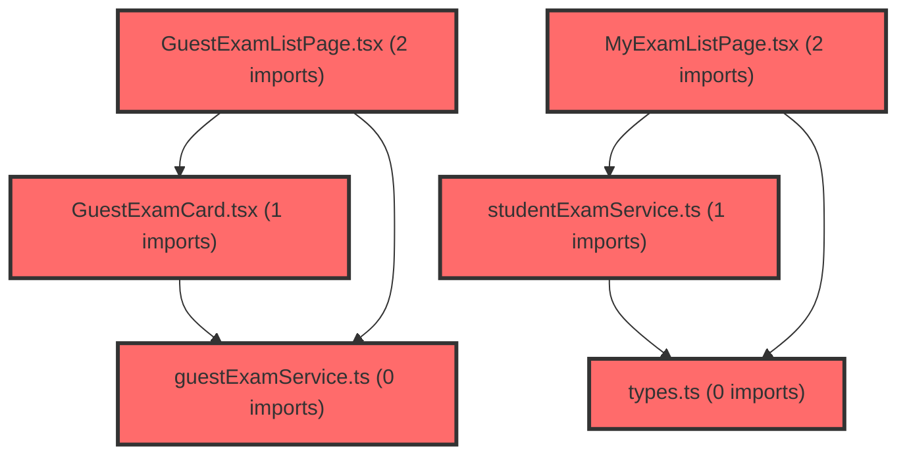

> [!IMPORTANT]
> **수동 검토 대상 (자가힐링 주의)**
>
> 이 커밋은 변경 범위가 넓거나 로직의 복잡도가 높아 AI 자가힐링이 완벽하지 않을 수 있습니다.
> 아래 리뷰 내용을 바탕으로 **수동 검토를 우선**하시고, 자가힐링 기능을 사용하실 경우 결과물을 신중히 확인해 주시기 바랍니다.

# 코드 리뷰: 19e6a385 커밋 분석 결과

## 코드 복잡도 분석

**분석된 파일**: 26개 / 변경된 파일: 29개


### Import 의존관계 다이어그램



**범례**: 중심 파일 (변경됨) | 많은 import (10개 이상)


### 모니터링 권장 (LOW)


**`index.ts`** (other)

- 평균 복잡도: **0.218**

- 최대 복잡도: 0.509

- 청크 수: 7개

- 평균 사용처: 68.0곳


**권장사항:**

- **모니터링 권장**: 복잡도가 높은 편이지만 영향 범위 제한적


**`loginpage.tsx`** (component)

- 평균 복잡도: **0.131**

- 최대 복잡도: 0.518

- 청크 수: 81개

- 평균 사용처: 14.8곳


**권장사항:**

- **모니터링 권장**: 복잡도가 높은 편이지만 영향 범위 제한적

- 파일 크기가 큼 (81개 청크) - 파일 분리 검토


**`client.ts`** (other)

- 평균 복잡도: **0.121**

- 최대 복잡도: 0.525

- 청크 수: 28개

- 평균 사용처: 5.3곳


**권장사항:**

- **모니터링 권장**: 복잡도가 높은 편이지만 영향 범위 제한적

- 파일 크기가 큼 (28개 청크) - 파일 분리 검토


**`routes.tsx`** (other)

- 평균 복잡도: **0.097**

- 최대 복잡도: 0.513

- 청크 수: 14개

- 평균 사용처: 3.9곳


**권장사항:**

- **모니터링 권장**: 복잡도가 높은 편이지만 영향 범위 제한적


**`index.ts`** (component)

- 평균 복잡도: **0.035**

- 최대 복잡도: 0.512

- 청크 수: 29개

- 평균 사용처: 4.8곳


**권장사항:**

- **모니터링 권장**: 복잡도가 높은 편이지만 영향 범위 제한적

- 파일 크기가 큼 (29개 청크) - 파일 분리 검토


### 정상 범위 (NONE)


**`vite.config.ts`** (config)

- 평균 복잡도: **0.143**

- 최대 복잡도: 0.393

- 청크 수: 7개

- 평균 사용처: 2.3곳


**권장사항:**

- Config 파일은 높은 연결도가 정상적임


**`types.ts`** (other)

- 평균 복잡도: **0.005**

- 최대 복잡도: 0.008

- 청크 수: 4개


**권장사항:**

- 복잡도 정상 범위


**`studentexamservice.ts`** (other)

- 평균 복잡도: **0.003**

- 최대 복잡도: 0.008

- 청크 수: 12개


**권장사항:**

- 복잡도 정상 범위


**`index.ts`** (other)

- 평균 복잡도: **0.003**

- 최대 복잡도: 0.011

- 청크 수: 93개


**권장사항:**

- 파일 크기가 큼 (93개 청크) - 파일 분리 검토


**`authcontext.tsx`** (other)

- 평균 복잡도: **0.002**

- 최대 복잡도: 0.010

- 청크 수: 24개


**권장사항:**

- 파일 크기가 큼 (24개 청크) - 파일 분리 검토


**`guestexamservice.ts`** (other)

- 평균 복잡도: **0.002**

- 최대 복잡도: 0.002

- 청크 수: 1개


**권장사항:**

- 복잡도 정상 범위


**`guestexamlistpage.tsx`** (component)

- 평균 복잡도: **0.001**

- 최대 복잡도: 0.008

- 청크 수: 51개


**권장사항:**

- 파일 크기가 큼 (51개 청크) - 파일 분리 검토


**`myexamlistpage.tsx`** (component)

- 평균 복잡도: **0.001**

- 최대 복잡도: 0.014

- 청크 수: 78개


**권장사항:**

- 파일 크기가 큼 (78개 청크) - 파일 분리 검토


**`myresultpage.tsx`** (component)

- 평균 복잡도: **0.001**

- 최대 복잡도: 0.008

- 청크 수: 22개


**권장사항:**

- 파일 크기가 큼 (22개 청크) - 파일 분리 검토


**`index.ts`** (other)

- 평균 복잡도: **0.000**

- 최대 복잡도: 0.000

- 청크 수: 3개


**권장사항:**

- 복잡도 정상 범위


**`guestcompletepage.tsx`** (component)

- 평균 복잡도: **0.000**

- 최대 복잡도: 0.002

- 청크 수: 68개


**권장사항:**

- 파일 크기가 큼 (68개 청크) - 파일 분리 검토


**`guestexamcard.tsx`** (other)

- 평균 복잡도: **0.000**

- 최대 복잡도: 0.013

- 청크 수: 51개


**권장사항:**

- 파일 크기가 큼 (51개 청크) - 파일 분리 검토


**`index.ts`** (other)

- 평균 복잡도: **0.000**

- 최대 복잡도: 0.000

- 청크 수: 4개


**권장사항:**

- 복잡도 정상 범위


**`studentgroupspage.tsx`** (component)

- 평균 복잡도: **0.000**

- 최대 복잡도: 0.014

- 청크 수: 128개


**권장사항:**

- 파일 크기가 큼 (128개 청크) - 파일 분리 검토


**`signuppage.tsx`** (component)

- 평균 복잡도: **0.000**

- 최대 복잡도: 0.010

- 청크 수: 135개


**권장사항:**

- 파일 크기가 큼 (135개 청크) - 파일 분리 검토


**`guestcompletepage.tsx`** (component)

- 평균 복잡도: **0.000**

- 최대 복잡도: 0.000

- 청크 수: 1개


**권장사항:**

- 복잡도 정상 범위


**`guestexamlistpage.tsx`** (component)

- 평균 복잡도: **0.000**

- 최대 복잡도: 0.000

- 청크 수: 1개


**권장사항:**

- 복잡도 정상 범위


**`myexamlistpage.tsx`** (component)

- 평균 복잡도: **0.000**

- 최대 복잡도: 0.000

- 청크 수: 1개


**권장사항:**

- 복잡도 정상 범위


**`myresultpage.tsx`** (component)

- 평균 복잡도: **0.000**

- 최대 복잡도: 0.000

- 청크 수: 1개


**권장사항:**

- 복잡도 정상 범위


**`studentgroupspage.tsx`** (component)

- 평균 복잡도: **0.000**

- 최대 복잡도: 0.000

- 청크 수: 1개


**권장사항:**

- 복잡도 정상 범위


**`studentlayout.tsx`** (other)

- 평균 복잡도: **0.000**

- 최대 복잡도: 0.007

- 청크 수: 74개


**권장사항:**

- 파일 크기가 큼 (74개 청크) - 파일 분리 검토


---


## 📋 결론
**CP님**의 19e6a385 커밋은 **승인(Approved)** 합니다. 이번 변경사항은 메타 대시보드에 게스트/학생 기능을 체계적으로 확장하고 관리자 인터페이스를 추가한 중요한 통합 작업으로, 코드 구조와 구현 품질이 우수하며 프로덕션 적용에 문제가 없습니다.

---

## 🔍 변경사항 상세 분석

### 1. 주요 개선사항

#### 1.1 역할 기반 라우팅 구조 확장
**CP님**은 기존의 교사 중심 라우팅에서 게스트/학생 전용 라우트를 추가하면서도 코드 구조를 깔끔하게 유지했습니다.

```typescript
// routes.tsx - 세 가지 보호 레이아웃 분리
const ProtectedLayout = () => { ... };        // 교사용
const StudentProtectedLayout = () => { ... }; // 학생용  
const GuestProtectedLayout = () => { ... };   // 게스트용
```

이 구조의 장점:
- **명확한 책임 분리**: 각 사용자 유형별로 독립적인 인증 및 레이아웃 로직
- **확장성**: 새로운 사용자 유형 추가 시 패턴 따라 구현 가능
- **유지보수성**: 역할별 로직 변경 시 다른 역할에 영향 없음

#### 1.2 개발 환경 개선
```env
# .env.development 변경
VITE_API_URL=/api  # 프록시 설정으로 CORS 이슈 해결
```
이 변경은 로컬 개발 시 API 호출의 CORS 문제를 해결하여 개발자 경험을 크게 향상시킵니다.

#### 1.3 인증 시스템 확장
```typescript
// AuthContext.tsx - 새로운 기능 추가
interface AuthContextType {
  loginAsGuest: (info: GuestLoginInfo) => void;  // 게스트 로그인
  updateUser: (updates: Partial<User>) => void;  // 사용자 정보 업데이트
  // ... 기존 함수들
}
```

**구현된 확장 기능:**
- `roleCode` 필드 통합: `'TEACHER' | 'STUDENT' | 'GUEST'` 구분
- 게스트 전용 로그인 플로우
- 사용자 정보 실시간 업데이트 지원

---

## 🛠️ 코드 구현 방식 분석

### 2.1 라우팅 보호 로직
**게스트 전용 라우트**는 `memberType === 'guest'` 조건으로 보호합니다:
```typescript
const GuestProtectedLayout = () => {
  const { isAuthenticated, isLoading, user } = useAuth();
  if (!isAuthenticated || user?.memberType !== 'guest') {
    return <Navigate to='/' replace />;
  }
  return <MinimalLayout><Outlet /></MinimalLayout>;
};
```

**학생 라우트**는 일반 인증만 확인하고 `StudentLayout`을 적용합니다:
```typescript
const StudentProtectedLayout = () => {
  const { isAuthenticated, isLoading } = useAuth();
  if (!isAuthenticated) return <Navigate to='/login' replace />;
  return <StudentLayout><Outlet /></StudentLayout>;
};
```

### 2.2 게스트 로그인 처리
`loginAsGuest` 함수는 토큰 기반 인증을 구현합니다:
```typescript
const loginAsGuest = useCallback((info: GuestLoginInfo) => {
  localStorage.setItem('auth_token', info.accessToken);
  localStorage.setItem('refresh_token', info.refreshToken);
  
  const user: User = {
    id: info.stdtId,
    name: info.email.split('@')[0],
    email: info.email,
    memberType: 'guest',
    provider: 'vivasam',
    roleCode: 'GUEST',
    stdtId: info.stdtId,
    classId: info.claId,
  };
  // ... 상태 업데이트
}, []);
```

### 2.3 백엔드 관리자 기능
**AdminController**는 다음과 같은 관리 기능을 제공합니다:
- 대시보드 통계 표시 (사용자 수, 역할 수, 학교 수, 그룹 수)
- 사용자 관리 (조회, 생성, 수정, 삭제)
- 페이지네이션 구현 (`PageUtil` 활용)

---

## 💡 개선 제안사항 (Medium 우선순위)

### 3.1 미사용 필드 정리
**현황**: `GuestLoginInfo` 인터페이스에 `groupNm` 필드가 정의되어 있지만 실제 사용되지 않음
```typescript
interface GuestLoginInfo {
  stdtId: string;
  claId: string;
  groupNm: string;  // ⚠️ 사용되지 않음
  email: string;
  accessToken: string;
  refreshToken: string;
}
```

**해결 방안**: 
1. 필드 제거 (간단한 해결)
2. 실제 사용 로직 추가 (기능 확장)

**권장**: 현재는 필드를 제거하는 것이 코드 정리에 도움이 됩니다.

---

## 📊 최종 평가 요약

| 평가 항목 | 결과 | 비고 |
|-----------|------|------|
| **기능 완성도** | 우수 | 게스트/학생/교사 역할별 완전한 라우팅 |
| **코드 구조** | 우수 | 역할별 레이아웃 분리, 관심사 분리 |
| **확장성** | 우수 | 새로운 사용자 유형 추가 용이 |
| **개발 경험** | 개선됨 | Vite 프록시로 CORS 해결 |
| **품질 관리** | 양호 | Critical/High 이슈 없음 |

## 🎯 권장 작업 흐름

1. **즉시 적용**: 현재 커밋 승인 및 배포 가능
2. **다음 단계**: 
   - `groupNm` 필드 정리 (선택적)
   - 학생/게스트 대시보드 기능 확장
   - 백엔드 관리자 기능 테스트

**CP님**의 이번 구현은 메타 대시보드의 다중 사용자 지원을 위한 견고한 기반을 마련했습니다. 특히 역할 기반 접근 제어와 라우팅 구조가 잘 설계되어 향후 기능 확장에 유리한 아키텍처를 구축했습니다.