> [!IMPORTANT]
> **수동 검토 대상 (자가힐링 주의)**
>
> 이 커밋은 변경 범위가 넓거나 로직의 복잡도가 높아 AI 자가힐링이 완벽하지 않을 수 있습니다.
> 아래 리뷰 내용을 바탕으로 **수동 검토를 우선**하시고, 자가힐링 기능을 사용하실 경우 결과물을 신중히 확인해 주시기 바랍니다.

# 코드 리뷰 결과 - 19e6a385 (Admin 그룹 관리 기능 병합)

## 코드 복잡도 분석

**분석된 파일**: 3개 / 변경된 파일: 9개


### Import 의존관계 다이어그램

```mermaid
flowchart TD
    F0["User.java (0 imports)"]
    F1["RoleGroup.java (0 imports)"]
    F2["SchoolInfoMapper.java (0 imports)"]
    F3["AdminUserService.java (0 imports)"]
    F4["AuthSchoolMap.java (0 imports)"]
    F5["GroupInfoMapper.java (0 imports)"]
    F6["SchoolSyncService.java (0 imports)"]
    F7["IdGenerator.java (0 imports)"]
    F8["JwtUtil.java (0 imports)"]
    F9["GroupQueryMapper.java (0 imports)"]:::center
    F10["AdminController.java (11 imports)"]:::center
    F11["PageUtil.java (0 imports)"]
    F10 --> F0
    F10 --> F1
    F10 --> F2
    F10 --> F3
    F10 --> F4
    F10 --> F5
    F10 --> F6
    F10 --> F7
    F10 --> F8
    F10 --> F9
    F10 --> F11
    classDef center fill:#ff6b6b,stroke:#333,stroke-width:3px
    classDef high fill:#ffd93d,stroke:#333,stroke-width:2px
```



**범례**: 중심 파일 (변경됨) | 많은 import (10개 이상)


### 모니터링 권장 (LOW)


**`groupquerymapper.java`** (other)

- 평균 복잡도: **0.265**

- 최대 복잡도: 0.518

- 청크 수: 2개

- 평균 사용처: 35.0곳


**권장사항:**

- **모니터링 권장**: 복잡도가 높은 편이지만 영향 범위 제한적


**`admincontroller.java`** (other)

- 평균 복잡도: **0.264**

- 최대 복잡도: 0.519

- 청크 수: 2개

- 평균 사용처: 17.0곳


**권장사항:**

- **모니터링 권장**: 복잡도가 높은 편이지만 영향 범위 제한적


**`groupquerymapper.xml`** (other)

- 평균 복잡도: **0.263**

- 최대 복잡도: 0.517

- 청크 수: 2개

- 평균 사용처: 7.0곳


**권장사항:**

- **모니터링 권장**: 복잡도가 높은 편이지만 영향 범위 제한적


---


## 최종 결론
CP님이 리뷰를 요청하신 커밋 **19e6a385**는 **승인 가능한(Approved) 수준**입니다. Critical 또는 High 우선순위의 이슈는 발견되지 않았으며, 기존 아키텍처 패턴을 잘 따르고 기능 구현이 정상적으로 이루어졌습니다.

## 변경 사항 요약
이 커밋은 `vs-develop` 브랜치의 Admin 그룹 관리 기능을 `feature/frontend` 브랜치로 병합한 머지 커밋입니다. 구체적으로 다음과 같은 변경이 이루어졌습니다:

1. **AdminController 확장**: 그룹 목록 조회(`/admin/groups`)와 상세 조회(`/admin/groups/{groupId}`) 엔드포인트 추가
2. **GroupQueryMapper 확장**: Admin 전용 그룹 조회 메서드 5개와 해당 SQL 쿼리 추가
3. **템플릿 파일 추가**: `groups.html`(그룹 목록)과 `group-detail.html`(그룹 상세) 관리자 화면 추가

## 상세 분석

### 1. 아키텍처 일관성 유지
기존 AdminController의 패턴을 그대로 따르고 있어 프로젝트의 일관성이 잘 유지되었습니다:

```java
// 기존 사용자 관리 패턴과 동일한 구조
@GetMapping("/groups")
public String groups(@RequestParam(defaultValue = "1") int page,
                     @RequestParam(required = false) String keyword,
                     @RequestParam(required = false) String schoolLevel,
                     @RequestParam(required = false) String useYn,
                     Model model) {
    long total = groupQueryMapper.countAdminGroupList(keyword, schoolLevel, useYn);
    int totalPages = PageUtil.totalPages(total, PAGE_SIZE);
    page = PageUtil.clampPage(page, totalPages);
    
    model.addAttribute("groups", groupQueryMapper.findAdminGroupList(keyword, schoolLevel, useYn, PAGE_SIZE, PageUtil.offsetOneIndexed(page, PAGE_SIZE)));
    // ... 페이징 관련 속성 추가
    return "admin/groups";
}
```

### 2. SQL 쿼리 품질
모든 SQL 쿼리에는 명시적인 주석이 포함되어 가독성이 좋으며, 필요한 조인과 조건이 적절히 구현되었습니다:

```xml
<!-- 주석으로 메서드명 명시 -->
<select id="findAdminGroupList" resultType="java.util.LinkedHashMap">
    /* GroupQueryMapper.findAdminGroupList */
    SELECT
        gi.group_id         AS groupId,
        gi.cla_id           AS claId,
        gi.group_nm         AS groupNm,
        gi.school_name      AS schoolName,
        CASE
            WHEN gi.school_level = 'elementary' THEN '초등'
            WHEN gi.school_level = 'middle' THEN '중등'
            WHEN gi.school_level = 'high' THEN '고등'
            ELSE ''
        END AS schoolLevelNm,
        -- ... 기타 필드
    FROM group_info gi
    JOIN `user` u ON u.user_no = gi.host_user_no
    <where>
        <if test="keyword != null and keyword != ''">
            AND (gi.group_nm LIKE CONCAT('%', #{keyword}, '%')
                 OR gi.school_name LIKE CONCAT('%', #{keyword}, '%')
                 OR u.nickname LIKE CONCAT('%', #{keyword}, '%')
                 OR u.email LIKE CONCAT('%', #{keyword}, '%'))
        </if>
        <!-- 동적 조건 처리 -->
    </where>
    ORDER BY gi.created_at DESC
    LIMIT #{limit} OFFSET #{offset}
</select>
```

### 3. 템플릿의 재사용성
HTML 템플릿은 기존 Admin 템플릿의 레이아웃과 스타일을 재사용하여 통일된 UI를 제공합니다:

```html
<!-- 기존 admin/fragments 템플릿 재사용 -->
<th:block th:replace="admin/fragments :: css" />
<nav th:replace="admin/fragments :: navbar"></nav>
<aside th:replace="admin/fragments :: sidebar(menu='groups')"></aside>
```

## 개선 권장 사항 (Medium 우선순위)

### 1. 컨트롤러 매개변수 검증 보강
현재 `groupDetail` 메서드는 `groupId`에 대한 기본 검증만 수행합니다:

```java
@GetMapping("/groups/{groupId}")
public String groupDetail(@PathVariable Long groupId,  // @Min(1) 등의 검증 어노테이션 추가 고려
                           @RequestParam(defaultValue = "1") int page,
                           Model model) {
    Map<String, Object> groupInfo = groupQueryMapper.findAdminGroupDetail(groupId);
    if (groupInfo == null) {  // null 체크만 수행
        return "redirect:/admin/groups";
    }
    // ...
}
```

**개선 방안**: `@Min(1)`이나 `@NotNull` 같은 검증 어노테이션을 추가하거나, 글로벌 예외 핸들러에서 `NumberFormatException`을 처리할 수 있습니다.

### 2. SQL 중복 코드 관리
학교급(school_level) 변환 로직이 여러 쿼리에 중복되어 있습니다:

```xml
<!-- findAdminGroupList와 findAdminGroupDetail에 동일한 CASE 문 중복 -->
CASE
    WHEN gi.school_level = 'elementary' THEN '초등'
    WHEN gi.school_level = 'middle' THEN '중등'
    WHEN gi.school_level = 'high' THEN '고등'
    ELSE ''
END AS schoolLevelNm
```

**개선 방안**: MyBatis의 `<sql>` 태그를 이용해 재사용하거나, 데이터베이스 코드 테이블을 도입하는 방안을 고려할 수 있습니다.

### 3. 타입 안정성 향상
현재 `LinkedHashMap`을 반환하는 방식은 런타임에 의존하므로 컴파일 타임 타입 안정성이 낮습니다:

```java
// 현재 방식
Map<String, Object> groupInfo = groupQueryMapper.findAdminGroupDetail(groupId);

// 개선 방안 (장기적)
GroupDetailDTO groupInfo = groupQueryMapper.findAdminGroupDetail(groupId);
```

## 종합 평가

### 기술적 평가
1. **기능 완성도**: 그룹 목록 조회, 검색, 필터링, 상세 조회, 멤버 목록 조회 등 기본적인 CRUD 기능이 완벽히 구현되었습니다.
2. **성능 고려사항**: 페이징 처리와 적절한 인덱싱을 통해 대용량 데이터 처리에 문제가 없도록 설계되었습니다.
3. **보안 측면**: 관리자 전용 기능으로 적절한 권한 체계 하에 운영됩니다.

### 프로젝트 적합성
이 구현은 meta-dashboard 프로젝트의 기존 패턴과 완벽히 일치합니다:
- 동일한 컨트롤러 구조(`AdminController`)
- 동일한 Mapper 인터페이스 패턴(`GroupQueryMapper`)
- 동일한 템플릿 엔진 사용(Thymeleaf)
- 동일한 페이징 유틸리티(`PageUtil`)

## 최종 권장사항
CP님, 이 커밋은 **즉시 병합 가능한 수준**입니다. 발견된 Medium 수준의 이슈들은 향후 리팩토링 주기에서 점진적으로 개선할 수 있는 사항들이며, 현재 상태로도 기능적 결함이나 성능 문제는 없습니다.

병합 후에도 기존 Admin 기능들과의 통합 테스트를 권장하며, 특히 그룹 관리 메뉴가 사이드바에서 정상적으로 노출되는지 확인하시기 바랍니다.