> [!IMPORTANT]
> **⚠️ 수동 검토 권장 (자가힐링 주의)**
>
> AI 자가힐링 결과물이 실제 의도와 다를 수 있으므로, **상세 리뷰 내용에 기반한 수동 점검**을 우선해 주시기 바랍니다. 자가힐링 기능을 활용하실 경우 최종 결과물을 신중하게 확인해 주세요.

# 코드 리뷰 - 1b10569e

## 코드 복잡도 분석

**분석된 파일**: 47개 / 변경된 파일: 57개


### Import 의존관계 다이어그램

```mermaid
flowchart TD
    F0["PageContent.tsx (3 internal imports)"]:::center
    F1["StudentTab.tsx (2 internal imports)"]:::center
    F2["ReportCardList.tsx (3 internal imports)"]:::center
    F3["LessonActivityJoinEmbed.tsx (2 internal imports)"]:::center
    F4["StudentDetailReport.tsx (1 internal import)"]:::center
    F5["everyCanvasEmbedSdk.ts (0 internal imports)"]:::center
    F6["PageTab.tsx (2 internal imports)"]:::center
    F7["reportDetailTypes.ts (0 internal imports)"]:::center
    F8["constants.ts (0 internal imports)"]:::center
    F9["ResponseGrid.tsx (1 internal import)"]:::center
    F10["PageList.tsx (1 internal import)"]:::center
    F11["queryKeys.ts (0 internal imports)"]:::center
    F12["useEveryCanvasEmbed.ts (2 internal imports)"]:::center
    F13["reportBadges.tsx (0 internal imports)"]:::center
    F14["lmsActivityService.ts (0 internal imports)"]:::center
    F15["LessonEditorEmbed.tsx (1 internal import)"]:::center
    F16["reportDetailMock.ts (1 internal import)"]:::center
    F17["LessonViewerEmbed.tsx (1 internal import)"]:::center
    F18["StudentReportDashboard.tsx (1 internal import)"]:::center
    F19["ReportFilterChips.tsx (1 internal import)"]:::center
    F20["queries.ts (2 internal imports)"]:::center
    F21["SummaryStrip.tsx (0 internal imports)"]:::center
    F22["ReportSummary.tsx (1 internal import)"]:::center
    F23["studentResultBadges.tsx (0 internal imports)"]:::center
    F24["ReportDetailTabBar.tsx (0 internal imports)"]:::center
    F25["types.ts (0 internal imports)"]:::center
    F26["studentReportTypes.ts (1 internal import)"]:::center
    F27["ReportCard.tsx (0 internal imports)"]:::center
    F28["ReportDetail.tsx (4 internal imports)"]:::center
    F20 --> F14
    F20 --> F11
    F12 --> F8
    F12 --> F5
    F16 --> F7
    F26 --> F7
    F3 --> F12
    F3 --> F5
    F15 --> F12
    F17 --> F12
    F0 --> F13
    F0 --> F21
    F0 --> F9
    F10 --> F13
    F6 --> F0
    F6 --> F10
    F2 --> F27
    F2 --> F2
    F2 --> F25
    F28 --> F6
    F28 --> F22
    F28 --> F1
    F28 --> F24
    F19 --> F25
    F22 --> F13
    F9 --> F13
    F1 --> F13
    F1 --> F9
    F4 --> F13
    F18 --> F23
    classDef center fill:#ff6b6b,stroke:#333,stroke-width:3px
    classDef high fill:#ffd93d,stroke:#333,stroke-width:2px
```



**범례**: 중심 파일 (변경됨) | 많은 import (10개 이상)


### 정상 범위 (NONE)


**`routes.tsx`** (other)

- 평균 복잡도: **0.052**

- 최대 복잡도: 0.463

- 청크 수: 24개

- 평균 사용처: 2.3곳


**권장사항:**

- 파일 크기가 큼 (24개 청크) - 파일 분리 검토


**`index.ts`** (component)

- 평균 복잡도: **0.026**

- 최대 복잡도: 0.461

- 청크 수: 36개

- 평균 사용처: 1.7곳


**권장사항:**

- 파일 크기가 큼 (36개 청크) - 파일 분리 검토


**`lmsactivityservice.ts`** (other)

- 평균 복잡도: **0.003**

- 최대 복잡도: 0.007

- 청크 수: 38개


**권장사항:**

- 파일 크기가 큼 (38개 청크) - 파일 분리 검토


**`queries.ts`** (other)

- 평균 복잡도: **0.003**

- 최대 복잡도: 0.012

- 청크 수: 62개


**권장사항:**

- 파일 크기가 큼 (62개 청크) - 파일 분리 검토


**`studentlessonresultpage.tsx`** (component)

- 평균 복잡도: **0.003**

- 최대 복잡도: 0.003

- 청크 수: 2개


**권장사항:**

- 복잡도 정상 범위


**`index.ts`** (other)

- 평균 복잡도: **0.002**

- 최대 복잡도: 0.006

- 청크 수: 32개


**권장사항:**

- 파일 크기가 큼 (32개 청크) - 파일 분리 검토


**`everycanvasembedsdk.ts`** (utility)

- 평균 복잡도: **0.002**

- 최대 복잡도: 0.006

- 청크 수: 13개


**권장사항:**

- 복잡도 정상 범위


**`reportdetailmock.ts`** (other)

- 평균 복잡도: **0.002**

- 최대 복잡도: 0.004

- 청크 수: 6개


**권장사항:**

- 복잡도 정상 범위


**`reportdetailtypes.ts`** (other)

- 평균 복잡도: **0.002**

- 최대 복잡도: 0.005

- 청크 수: 10개


**권장사항:**

- 복잡도 정상 범위


**`reportdetailutils.ts`** (utility)

- 평균 복잡도: **0.002**

- 최대 복잡도: 0.010

- 청크 수: 29개


**권장사항:**

- 파일 크기가 큼 (29개 청크) - 파일 분리 검토


**`studentreporttypes.ts`** (other)

- 평균 복잡도: **0.002**

- 최대 복잡도: 0.006

- 청크 수: 6개


**권장사항:**

- 복잡도 정상 범위


**`studentlessonresultdetailpage.tsx`** (component)

- 평균 복잡도: **0.002**

- 최대 복잡도: 0.004

- 청크 수: 5개


**권장사항:**

- 복잡도 정상 범위


**`index.ts`** (other)

- 평균 복잡도: **0.002**

- 최대 복잡도: 0.003

- 청크 수: 4개


**권장사항:**

- 복잡도 정상 범위


**`useeverycanvasembed.ts`** (utility)

- 평균 복잡도: **0.001**

- 최대 복잡도: 0.004

- 청크 수: 11개


**권장사항:**

- 복잡도 정상 범위


**`studentreportmock.ts`** (other)

- 평균 복잡도: **0.001**

- 최대 복잡도: 0.002

- 청크 수: 7개


**권장사항:**

- 복잡도 정상 범위


**`lessoneditorembed.tsx`** (other)

- 평균 복잡도: **0.001**

- 최대 복잡도: 0.007

- 청크 수: 11개


**권장사항:**

- 복잡도 정상 범위


**`lessonviewerembed.tsx`** (component)

- 평균 복잡도: **0.001**

- 최대 복잡도: 0.003

- 청크 수: 10개


**권장사항:**

- 복잡도 정상 범위


**`lessonreportdetailpage.tsx`** (component)

- 평균 복잡도: **0.001**

- 최대 복잡도: 0.004

- 청크 수: 6개


**권장사항:**

- 복잡도 정상 범위


**`lessonresultpage.tsx`** (component)

- 평균 복잡도: **0.001**

- 최대 복잡도: 0.010

- 청크 수: 17개


**권장사항:**

- 복잡도 정상 범위


**`lessonlibrarycontents.tsx`** (utility)

- 평균 복잡도: **0.001**

- 최대 복잡도: 0.004

- 청크 수: 12개


**권장사항:**

- 복잡도 정상 범위


**`pagelist.tsx`** (component)

- 평균 복잡도: **0.001**

- 최대 복잡도: 0.012

- 청크 수: 33개


**권장사항:**

- 파일 크기가 큼 (33개 청크) - 파일 분리 검토


**`pagetab.tsx`** (component)

- 평균 복잡도: **0.001**

- 최대 복잡도: 0.008

- 청크 수: 18개


**권장사항:**

- 복잡도 정상 범위


**`reportdetail.tsx`** (other)

- 평균 복잡도: **0.001**

- 최대 복잡도: 0.010

- 청크 수: 19개


**권장사항:**

- 복잡도 정상 범위


**`reportdetailtabbar.tsx`** (other)

- 평균 복잡도: **0.001**

- 최대 복잡도: 0.005

- 청크 수: 15개


**권장사항:**

- 복잡도 정상 범위


**`reportfilterchips.tsx`** (other)

- 평균 복잡도: **0.001**

- 최대 복잡도: 0.004

- 청크 수: 14개


**권장사항:**

- 복잡도 정상 범위


**`reportbadges.tsx`** (other)

- 평균 복잡도: **0.001**

- 최대 복잡도: 0.003

- 청크 수: 31개


**권장사항:**

- 파일 크기가 큼 (31개 청크) - 파일 분리 검토


**`studentlessonbanner.tsx`** (other)

- 평균 복잡도: **0.001**

- 최대 복잡도: 0.007

- 청크 수: 25개


**권장사항:**

- 파일 크기가 큼 (25개 청크) - 파일 분리 검토


**`studentlessonresultshell.tsx`** (other)

- 평균 복잡도: **0.001**

- 최대 복잡도: 0.002

- 청크 수: 6개


**권장사항:**

- 복잡도 정상 범위


**`studentresultbadges.tsx`** (other)

- 평균 복잡도: **0.001**

- 최대 복잡도: 0.002

- 청크 수: 9개


**권장사항:**

- 복잡도 정상 범위


**`querykeys.ts`** (other)

- 평균 복잡도: **0.000**

- 최대 복잡도: 0.005

- 청크 수: 11개


**권장사항:**

- 복잡도 정상 범위


**`constants.ts`** (other)

- 평균 복잡도: **0.000**

- 최대 복잡도: 0.000

- 청크 수: 1개


**권장사항:**

- 복잡도 정상 범위


**`lessonactivityjoinembed.tsx`** (other)

- 평균 복잡도: **0.000**

- 최대 복잡도: 0.004

- 청크 수: 13개


**권장사항:**

- 복잡도 정상 범위


**`studentlayout.tsx`** (other)

- 평균 복잡도: **0.000**

- 최대 복잡도: 0.008

- 청크 수: 96개


**권장사항:**

- 파일 크기가 큼 (96개 청크) - 파일 분리 검토


**`index.ts`** (utility)

- 평균 복잡도: **0.000**

- 최대 복잡도: 0.000

- 청크 수: 1개


**권장사항:**

- 복잡도 정상 범위


**`pagecontent.tsx`** (component)

- 평균 복잡도: **0.000**

- 최대 복잡도: 0.005

- 청크 수: 32개


**권장사항:**

- 파일 크기가 큼 (32개 청크) - 파일 분리 검토


**`reportcard.tsx`** (other)

- 평균 복잡도: **0.000**

- 최대 복잡도: 0.002

- 청크 수: 35개


**권장사항:**

- 파일 크기가 큼 (35개 청크) - 파일 분리 검토


**`reportcardlist.tsx`** (other)

- 평균 복잡도: **0.000**

- 최대 복잡도: 0.006

- 청크 수: 32개


**권장사항:**

- 파일 크기가 큼 (32개 청크) - 파일 분리 검토


**`reportsummary.tsx`** (other)

- 평균 복잡도: **0.000**

- 최대 복잡도: 0.009

- 청크 수: 46개


**권장사항:**

- 파일 크기가 큼 (46개 청크) - 파일 분리 검토


**`responsegrid.tsx`** (other)

- 평균 복잡도: **0.000**

- 최대 복잡도: 0.004

- 청크 수: 40개


**권장사항:**

- 파일 크기가 큼 (40개 청크) - 파일 분리 검토


**`statuspanel.tsx`** (other)

- 평균 복잡도: **0.000**

- 최대 복잡도: 0.001

- 청크 수: 52개


**권장사항:**

- 파일 크기가 큼 (52개 청크) - 파일 분리 검토


**`studenttab.tsx`** (other)

- 평균 복잡도: **0.000**

- 최대 복잡도: 0.005

- 청크 수: 72개


**권장사항:**

- 파일 크기가 큼 (72개 청크) - 파일 분리 검토


**`summarystrip.tsx`** (other)

- 평균 복잡도: **0.000**

- 최대 복잡도: 0.004

- 청크 수: 16개


**권장사항:**

- 복잡도 정상 범위


**`index.ts`** (other)

- 평균 복잡도: **0.000**

- 최대 복잡도: 0.000

- 청크 수: 6개


**권장사항:**

- 복잡도 정상 범위


**`types.ts`** (other)

- 평균 복잡도: **0.000**

- 최대 복잡도: 0.000

- 청크 수: 1개


**권장사항:**

- 복잡도 정상 범위


**`studentdetailreport.tsx`** (other)

- 평균 복잡도: **0.000**

- 최대 복잡도: 0.008

- 청크 수: 71개


**권장사항:**

- 파일 크기가 큼 (71개 청크) - 파일 분리 검토


**`studentreportdashboard.tsx`** (other)

- 평균 복잡도: **0.000**

- 최대 복잡도: 0.003

- 청크 수: 32개


**권장사항:**

- 파일 크기가 큼 (32개 청크) - 파일 분리 검토


**`index.ts`** (other)

- 평균 복잡도: **0.000**

- 최대 복잡도: 0.000

- 청크 수: 5개


**권장사항:**

- 복잡도 정상 범위


---


## 변경 배경

이 커밋은 `vs-develop` 브랜치를 `feature/frontend-architecture`로 병합한 **merge 커밋**입니다. 주요 변경 내용은 두 가지 축으로 나뉩니다.

- **목적**: (1) 인프라 도메인 이전(`vschool.at` → `allvia.org`)에 따른 환경설정 URL 일괄 변경, (2) everyCanvas SDK와의 activity-join 답안 저장/제출 API 호출 주체 이관(Frame → Host)을 위한 요청 문서 작성, (3) 수업 결과보기(리포트) 기능 구현 계획 문서화
- **도메인**: 인프라(환경설정), 프론트엔드 아키텍처(FSD Lite), API 연동 설계
- **변경 방향**: 도메인 이전으로 인한 URL 하드코딩 값 갱신, everyCanvas Frame의 LMS API 직접 호출 구조를 Host(meta-dashboard)가 대신 호출하는 구조로 전환하기 위한 설계 문서화, 수업 결과보기 UI/API 연동 계획 수립

---

## [GOOD] 잘된 점

1. **도메인 이전 변경이 일관되게 적용됨**: `application-local.yml`, `application-vs-prod.yml`, `.env.production` 3개 파일 모두에서 `vschool.at` → `allvia.org` 도메인 교체가 일관되게 이루어졌습니다. 백엔드(로컬/프로덕션)와 프론트엔드(프로덕션)가 모두 포함되어 있어, 도메인 이전 시 누락으로 인한 장애 가능성을 사전에 차단했습니다.

2. **문서화를 통한 아키텍처 변경의 명확한 전달**: activity-join 답안 저장/제출 API 호출 주체 이관 요청이 2건의 문서(`answerSaved` 요청, Host 이관 요청)로 상세히 작성되었습니다. AS-IS → TO-BE 표, API 계약, 발화 조건, 순서 보장 요청 등이 구체적으로 명시되어 있어 SDK 개발 담당자와의 협업 효율이 높습니다.

3. **계획 문서의 체계적 관리**: `lesson-library.plan.md`에 추가계획 15~19가 추가되었고, 각 계획마다 목표, API 분석, FSD 배치, UI 스펙, 구현 체크리스트, 완료 기준, 구현 결과가 포함되어 있습니다. 특히 "하지 말 것" 섹션을 두어 prototype 코드 복사, Tailwind 사용, `any` 타입 사용 등의 금지 사항을 명확히 했습니다.

---

## 변경사항 요약

- 백엔드/프론트엔드 환경설정의 도메인을 `vschool.at` → `allvia.org`로 일괄 교체
- everyCanvas SDK에 `answerSaved` 이벤트 추가 및 LMS API 호출 주체 이관 요청 문서 2건 신규 작성
- 수업 결과보기(리포트) 기능의 계획 문서(추가계획 15~19)를 `lesson-library.plan.md`에 추가

---

## [ISSUE] 개선이 필요한 부분

### Critical (즉시 수정 필요)

없음

### High (우선 수정 권장)

1. **`.env.production`의 일부 URL이 여전히 구도메인(`vsaidt.com`)을 사용 중**
   - `VITE_AGENT_API_URL=https://meta-agent-api.vsaidt.com`, `VITE_CHAT_API_URL=https://dj.vsaidt.com`, `VITE_EVERYCLASS_EMBED_BASE_URL=https://everyclass.vsaidt.com`, `VITE_CMS_API_URL=https://public-cmsapi.vsaidt.com`, `VITE_CMS_FILE_URL=https://cbs.vsaidt.com` 등이 변경되지 않았습니다.
   - 이 값들이 의도적으로 유지된 것인지(별도 서비스라서), 아니면 도메인 이전 대상에서 누락된 것인지 확인이 필요합니다. 만약 `allvia.org`로 이전되어야 하는 서비스라면 누락으로 인해 프로덕션에서 해당 기능이 장애를 일으킬 수 있습니다.

2. **`application-local.yml`의 `issuer-uri: superplatform` 값이 실제 issuer와 불일치 가능성**
   - `jwk-set-uri`는 `https://t-auth-api.allvia.org/.well-known/jwks.json`으로 변경되었지만, `issuer-uri`는 여전히 `superplatform`이라는 상수값입니다. Spring Security OAuth2 리소스 서버에서 `issuer-uri`는 JWT 토큰의 `iss` 클레임 검증에 사용되는데, 실제 인증 서버의 issuer 값이 `superplatform`인지 확인이 필요합니다. 만약 실제 issuer가 URL 형태라면 토큰 검증이 실패할 수 있습니다.

### Medium (개선 권장)

1. **문서의 중복 내용 통합 가능**
   - `2026-08-25-activity-join-answerSaved-요청.md`와 `2026-08-25-activity-join-답안저장-host-이관-요청.md` 두 문서가 상당 부분 중복됩니다. `answerSaved` 이벤트의 payload 정의, 발화 조건, `timeSpentMs` 누적 정책, `evaluation` 계산 정책 등이 두 문서에 동일하게 반복되어 있습니다. 한 문서로 통합하거나, 한 문서를 정본으로 두고 다른 문서는 참조 링크로 대체하는 것이 유지보수에 유리합니다.

2. **`lesson-library.plan.md`의 추가계획 18 상태 표기**
   - 추가계획 18은 "계획 수립 (상세 스펙 보류)"로 표기되어 있지만, 추가계획 17의 구현 결과 섹션에서 이미 `LessonReportDetailPage` 관련 파일들이 구현 완료된 것으로 표시되어 있습니다. 계획 문서의 상태 표기가 실제 구현 상태와 일치하는지 확인이 필요합니다.

---

## 주요 파일 분석

### 1. `backend/src/main/resources/application-local.yml`

**변경 내용:**
로컬 개발 환경의 SSO 인증 서버 URL을 `t-auth-superplatform-api.vsaidt.com` → `t-auth-api.allvia.org`로 변경.

**개선 제안:**
1. `issuer-uri` 값 검증 필요
   - **위치**: `spring.security.oauth2.resourceserver.jwt.issuer-uri` 라인
   - **기존 코드**:
     ```
     issuer-uri: superplatform
     ```
   - **해결 방안**: 실제 인증 서버의 issuer 값이 `superplatform`인지 확인하고, 아니라면 실제 issuer URL로 변경 필요. Spring Security는 `issuer-uri`를 기반으로 JWT의 `iss` 클레임을 검증하므로, 불일치 시 모든 토큰 검증이 실패합니다.

### 2. `backend/src/main/resources/application-vs-prod.yml`

**변경 내용:**
프로덕션 SSO 인증 서버 URL을 `auth-api.vschool.at` → `auth-api.allvia.org`로 변경.

**개선 제안:**
1. `client-secret` 환경변수 주입 방식은 잘 유지되고 있습니다. `client-id`에 기본값(`meta`)이 설정되어 있어 env 누락 시에도 기동이 가능한 점은 좋습니다. 다만 `client-secret`은 기본값이 없어 미주입 시 기동 실패로 조기 발견되는 설계가 적절합니다.

### 3. `frontend/.env.production`

**변경 내용:**
프론트엔드 프로덕션 환경의 API URL을 `vschool.at` → `allvia.org`로 변경. `VITE_API_URL`, `VITE_SP_AUTH_URL`, `VITE_SP_SDK_URL`, `VITE_SP_MYPAGE_URL`, `VITE_MANUAL_URL_*`, `VITE_SP_LMS_API_URL`이 변경됨.

**개선 제안:**
1. 미변경 URL 확인 필요
   - **위치**: `VITE_AGENT_API_URL`, `VITE_CHAT_API_URL`, `VITE_EVERYCLASS_EMBED_BASE_URL`, `VITE_CMS_API_URL`, `VITE_CMS_FILE_URL` 라인
   - **기존 코드**:
     ```
     VITE_AGENT_API_URL=https://meta-agent-api.vsaidt.com
     VITE_CHAT_API_URL=https://dj.vsaidt.com
     VITE_EVERYCLASS_EMBED_BASE_URL=https://everyclass.vsaidt.com
     VITE_CMS_API_URL=https://public-cmsapi.vsaidt.com
     VITE_CMS_FILE_URL=https://cbs.vsaidt.com
     ```
   - **해결 방안**: 이 URL들이 `allvia.org`로 이전 대상인지 확인 필요. 이전 대상이라면 함께 변경해야 하며, 별도 서비스라면 주석으로 의도를 명시하는 것이 좋습니다.

### 4. `frontend/docs/lesson/2026-08-25-activity-join-answerSaved-요청.md` (신규)

**변경 내용:**
everyCanvas SDK에 `answerSaved` 이벤트 추가를 요청하는 문서. `AnswerSavedPayload` 인터페이스, 발화 조건, `evaluation` 계산 정책, `timeSpentMs` 누적 정책을 정의.

**개선 제안:**
1. `answer` 필드의 타입을 `unknown`으로 정의한 것은 자유 JSON 형태를 지원하기 위한 의도로 이해됩니다. 다만 Host 측에서 이 값을 그대로 LMS API에 전달할 때 타입 안전성이 없으므로, 실제 구현 시 런타임 검증(validation)이 필요할 수 있습니다.

### 5. `frontend/docs/lesson/2026-08-25-activity-join-답안저장-host-이관-요청.md` (신규)

**변경 내용:**
activity-join의 LMS API 호출 주체를 Frame → Host로 이관하는 요청 문서. AS-IS → TO-BE 표, `submission` prop 추가, `answerSaved`/`submitted` 이벤트 정의, 순서 보장 요청 포함.

**개선 제안:**
1. `submitted` 이벤트의 순서 보장 요청이 중요합니다. "`submitted`를 보내기 전에 `answerSaved`를 먼저 보내라"는 요청은 postMessage의 비동기 특성상 순서가 보장되지 않을 수 있습니다. Host 측에서 `submitted` 수신 시 아직 처리되지 않은 `answerSaved`가 있는지 확인하는 로직이 필요할 수 있습니다.

### 6. `frontend/docs/lesson/lesson-library.plan.md`

**변경 내용:**
추가계획 15~19 문서 추가. 수업 결과보기 UI 구현, API 연동, 리포트 상세 페이지, 학생 결과 페이지 등의 계획과 구현 결과를 기록.

**개선 제안:**
1. 추가계획 15~17은 "구현 완료"로 표기되어 있지만, 추가계획 18은 "계획 수립 (상세 스펙 보류)"로 표기되어 있습니다. 계획 문서의 상태 표기가 실제 코드 구현 상태와 일치하는지 확인이 필요합니다.

---

## 최종 평가

**결론**:
- [ ] [OK] **승인 (Approved)** - Critical/High 이슈 없음
- [x] [WARN] **조건부 승인 (Approved with Comments)** - Medium 이하 이슈만 존재
- [ ] [FIX] **수정 필요 (Changes Requested)** - Critical/High 이슈 존재

**종합 의견:**

이 커밋은 도메인 이전에 따른 환경설정 변경과 아키텍처 개선을 위한 설계 문서화가 주를 이루는 merge 커밋입니다. 환경설정 변경은 3개 파일 모두 일관되게 적용되었고, 문서화는 상세하고 체계적으로 잘 작성되었습니다. 다만 `.env.production`에서 일부 URL이 여전히 구도메인(`vsaidt.com`)을 사용하고 있어, 이 값들이 의도적으로 유지된 것인지 확인이 필요합니다. 또한 `issuer-uri` 값이 실제 인증 서버의 issuer와 일치하는지 검증이 필요합니다. 이 두 가지 확인 사항이 해결되면 승인 가능한 수준의 커밋입니다.