> [!IMPORTANT]
> **⚠️ 수동 검토 권장 (자가힐링 주의)**
>
> AI 자가힐링 결과물이 실제 의도와 다를 수 있으므로, **상세 리뷰 내용에 기반한 수동 점검**을 우선해 주시기 바랍니다. 자가힐링 기능을 활용하실 경우 최종 결과물을 신중하게 확인해 주세요.

# 코드 리뷰 - 1ed29dde

## 코드 복잡도 분석

**분석된 파일**: 109개 / 변경된 파일: 178개


### Import 의존관계 다이어그램

```mermaid
flowchart TD
    F0["format.ts (2 internal imports)"]:::center
    F1["matchLibraryFilters.ts (1 internal import)"]:::center
    F2["annotationTypes.ts (0 internal imports)"]:::center
    F3["ResourceCardList.tsx (3 internal imports)"]:::center
    F4["MyDataView.tsx (2 internal imports)"]:::center
    F5["StudentTab.tsx (6 internal imports)"]:::center
    F6["LiveWidget.tsx (2 internal imports)"]:::center
    F7["mock-data.ts (0 internal imports)"]:::center
    F8["ResourceGrid.tsx (2 internal imports)"]:::center
    F9["ReportSummary.tsx (4 internal imports)"]:::center
    F10["RecommendCarousel.tsx (2 internal imports)"]:::center
    F11["StrategyCard.tsx (3 internal imports)"]:::center
    F12["apiMapper.ts (1 internal import)"]:::center
    F13["PageContent.tsx (6 internal imports)"]:::center
    F14["LessonViewerEmbed.tsx (2 internal imports)"]:::center
    F15["SelfregStudentResultView.tsx (1 internal import)"]:::center
    F16["ClassCurationView.tsx (1 internal import)"]:::center
    F17["useMonitorWindow.ts (0 internal imports)"]:::center
    F18["PageTab.tsx (3 internal imports)"]:::center
    F19["AssessmentPage.tsx (1 internal import)"]:::center
    F20["DonutGauge.tsx (3 internal imports)"]:::center
    F21["IndividualCoachingPage.tsx (1 internal import)"]:::center
    F22["DeployOverlay.tsx (3 internal imports)"]:::center
    F23["ui/ResourceCard.tsx (1 internal import)"]:::center
    F24["AnnotationCanvas.tsx (2 internal imports)"]:::center
    F25["StrategyRadarChart.tsx (2 internal imports)"]:::center
    F26["strategy.ts (1 internal import)"]:::center
    F27["SlideCanvas.tsx (1 internal import)"]:::center
    F28["PenToolbar.tsx (1 internal import)"]:::center
    F29["useDraggable.ts (0 internal imports)"]:::center
    F30["library/ResourceCard.tsx (4 internal imports)"]:::center
    F31["EditorOverlay.tsx (6 internal imports)"]:::center
    F32["annotationDraw.ts (1 internal import)"]:::center
    F33["ResourcesContext.tsx (3 internal imports)"]:::center
    F34["mockLibraryItems.ts (1 internal import)"]:::center
    F35["SlideStrip.tsx (1 internal import)"]:::center
    F36["useEveryCanvasEmbed.ts (1 internal import)"]:::center
    F37["ClassLiveOverlay.tsx (12 internal imports)"]:::center
    F38["SelfregOverviewChart.tsx (0 internal imports)"]:::center
    F39["ResultsView.tsx (4 internal imports)"]:::center
    F40["shared.tsx (1 internal import)"]:::center
    F41["RecommendTop3.tsx (3 internal imports)"]:::center
    F42["embedTokenService.ts (0 internal imports)"]:::center
    F43["aggregation.ts (1 internal import)"]:::center
    F44["level.ts (1 internal import)"]:::center
    F45["model/types.ts (0 internal imports)"]:::center
    F46["ResponseGrid.tsx (3 internal imports)"]:::center
    F47["CardThumb.tsx (2 internal imports)"]:::center
    F48["components/index.ts (0 internal imports)"]:::center
    F49["StrategyReport.tsx (3 internal imports)"]:::center
    F50["StrategyReportDemo.tsx (3 internal imports)"]:::center
    F51["ReportCard.tsx (6 internal imports)"]:::center
    F52["useSlideAnnotations.ts (1 internal import)"]:::center
    F53["cardStyles.ts (0 internal imports)"]:::center
    F54["StatusPanel.tsx (3 internal imports)"]:::center
    F55["ResourceListPage.tsx (7 internal imports)"]:::center
    F56["LessonEditorEmbed.tsx (4 internal imports)"]:::center
    F57["MyLessonCard.tsx (4 internal imports)"]:::center
    F58["useLibraryFilters.ts (1 internal import)"]:::center
    F59["resources/types.ts (0 internal imports)"]:::center
    F60["LibraryView.tsx (3 internal imports)"]:::center
    F61["getSsoAccessToken.ts (0 internal imports)"]:::center
    F62["SummaryStrip.tsx (3 internal imports)"]:::center
    F63["ReportFilterChips.tsx (2 internal imports)"]:::center
    F64["MonitorPanel.tsx (1 internal import)"]:::center
    F65["ReportCardGrid.tsx (6 internal imports)"]:::center
    F66["StrategyReport/types.ts (0 internal imports)"]:::center
    F67["FilterPanel.tsx (1 internal import)"]:::center
    F68["MonitorContent.tsx (1 internal import)"]:::center
    F69["everyCanvasEmbedSdk.ts (0 internal imports)"]:::center
    F70["CaptureOverlay.tsx (5 internal imports)"]:::center
    F71["library/index.ts (0 internal imports)"]:::center
    F72["PopoutWindow.tsx (0 internal imports)"]:::center
    F73["filterTaxonomy.ts (1 internal import)"]:::center
    F55 --> F22
    F55 --> F62
    F55 --> F29
    F55 --> F71
    F55 --> F33
    F55 --> F57
    F55 --> F35
    F36 --> F69
    F73 --> F45
    F1 --> F45
    F34 --> F45
    F58 --> F45
    F67 --> F45
    F56 --> F36
    F56 --> F69
    F56 --> F42
    F56 --> F61
    F14 --> F36
    F14 --> F42
    F23 --> F45
    F3 --> F3
    F3 --> F45
    F3 --> F23
    F15 --> F38
    F20 --> F66
    F20 --> F26
    F20 --> F44
    F11 --> F66
    F11 --> F26
    F11 --> F20
    F25 --> F66
    F25 --> F26
    F49 --> F66
    F49 --> F25
    F49 --> F11
    F50 --> F66
    F50 --> F49
    F50 --> F50
    F26 --> F66
    F12 --> F66
    F44 --> F66
    F21 --> F48
    F47 --> F7
    F47 --> F59
    F22 --> F7
    F22 --> F0
    F22 --> F33
    F31 --> F0
    F31 --> F59
    F31 --> F27
    F31 --> F7
    F31 --> F33
    F31 --> F35
    F27 --> F31
    F35 --> F31
    F16 --> F41
    F60 --> F7
    F60 --> F8
    F60 --> F59
    F10 --> F30
    F10 --> F59
    F41 --> F7
    F41 --> F33
    F41 --> F10
    F30 --> F47
    F30 --> F59
    F30 --> F33
    F30 --> F53
    F8 --> F30
    F8 --> F59
    F24 --> F32
    F24 --> F2
    F37 --> F0
    F37 --> F28
    F37 --> F24
    F37 --> F2
    F37 --> F17
    F37 --> F64
    F37 --> F6
    F37 --> F7
    F37 --> F68
    F37 --> F52
    F37 --> F72
    F37 --> F33
    F6 --> F33
    F6 --> F29
    F68 --> F7
    F64 --> F68
    F28 --> F2
    F32 --> F2
    F52 --> F2
    F4 --> F33
    F4 --> F57
    F57 --> F47
    F57 --> F59
    F57 --> F33
    F57 --> F53
    F70 --> F0
    F70 --> F59
    F70 --> F43
    F70 --> F7
    F70 --> F33
    F13 --> F59
    F13 --> F40
    F13 --> F43
    F13 --> F62
    F13 --> F46
    F13 --> F33
    F18 --> F59
    F18 --> F43
    F18 --> F13
    F51 --> F0
    F51 --> F59
    F51 --> F43
    F51 --> F47
    F51 --> F53
    F51 --> F33
    F65 --> F0
    F65 --> F59
    F65 --> F43
    F65 --> F65
    F65 --> F51
    F65 --> F33
    F63 --> F0
    F63 --> F33
    F9 --> F7
    F9 --> F0
    F9 --> F43
    F9 --> F59
    F39 --> F54
    F39 --> F33
    F39 --> F63
    F39 --> F65
    F54 --> F0
    F54 --> F33
    F54 --> F43
    F5 --> F0
    F5 --> F59
    F5 --> F40
    F5 --> F43
    F5 --> F46
    F5 --> F33
    F46 --> F0
    F46 --> F40
    F46 --> F59
    F62 --> F59
    F62 --> F33
    F62 --> F43
    F40 --> F59
    F33 --> F7
    F33 --> F0
    F33 --> F59
    F43 --> F59
    F0 --> F7
    F0 --> F59
    classDef center fill:#ff6b6b,stroke:#333,stroke-width:3px
    classDef high fill:#ffd93d,stroke:#333,stroke-width:2px
```



**범례**: 중심 파일 (변경됨) | 많은 import (10개 이상)


### 모니터링 권장 (LOW)


**`assessmentpage.tsx`** (component)

- 평균 복잡도: **0.236**

- 최대 복잡도: 0.526

- 청크 수: 64개

- 평균 사용처: 30.8곳


**권장사항:**

- **모니터링 권장**: 복잡도가 높은 편이지만 영향 범위 제한적

- 파일 크기가 큼 (64개 청크) - 파일 분리 검토


### 정상 범위 (NONE)


**`dgnssmapper.xml`** (other)

- 평균 복잡도: **0.243**

- 최대 복잡도: 0.474

- 청크 수: 2개

- 평균 사용처: 7.0곳


**권장사항:**

- 복잡도 정상 범위


**`dgnsscontroller.java`** (other)

- 평균 복잡도: **0.209**

- 최대 복잡도: 0.470

- 청크 수: 25개

- 평균 사용처: 25.8곳


**권장사항:**

- 파일 크기가 큼 (25개 청크) - 파일 분리 검토


**`dgnssmapper.java`** (other)

- 평균 복잡도: **0.187**

- 최대 복잡도: 0.466

- 청크 수: 199개

- 평균 사용처: 27.9곳


**권장사항:**

- 파일 크기가 큼 (199개 청크) - 파일 분리 검토


**`resourcelistpage.tsx`** (component)

- 평균 복잡도: **0.166**

- 최대 복잡도: 0.469

- 청크 수: 17개

- 평균 사용처: 22.2곳


**권장사항:**

- 복잡도 정상 범위


**`globalexceptionhandler.java`** (config)

- 평균 복잡도: **0.114**

- 최대 복잡도: 0.466

- 청크 수: 21개

- 평균 사용처: 12.0곳


**권장사항:**

- 파일 크기가 큼 (21개 청크) - 파일 분리 검토

- Config 파일은 높은 연결도가 정상적임


**`theme.ts`** (other)

- 평균 복잡도: **0.111**

- 최대 복잡도: 0.221

- 청크 수: 2개

- 평균 사용처: 2.0곳


**권장사항:**

- 복잡도 정상 범위


**`dgnssservice.java`** (other)

- 평균 복잡도: **0.110**

- 최대 복잡도: 0.473

- 청크 수: 70개

- 평균 사용처: 12.6곳


**권장사항:**

- 파일 크기가 큼 (70개 청크) - 파일 분리 검토


**`index.ts`** (component)

- 평균 복잡도: **0.110**

- 최대 복잡도: 0.463

- 청크 수: 21개

- 평균 사용처: 7.8곳


**권장사항:**

- 파일 크기가 큼 (21개 청크) - 파일 분리 검토


**`index.ts`** (component)

- 평균 복잡도: **0.092**

- 최대 복잡도: 0.461

- 청크 수: 10개

- 평균 사용처: 3.0곳


**권장사항:**

- 복잡도 정상 범위


**`routes.tsx`** (other)

- 평균 복잡도: **0.054**

- 최대 복잡도: 0.463

- 청크 수: 23개

- 평균 사용처: 2.4곳


**권장사항:**

- 파일 크기가 큼 (23개 청크) - 파일 분리 검토


**`index.ts`** (component)

- 평균 복잡도: **0.034**

- 최대 복잡도: 0.461

- 청크 수: 27개

- 평균 사용처: 2.3곳


**권장사항:**

- 파일 크기가 큼 (27개 청크) - 파일 분리 검토


**`paperpermissionadminmapper.xml`** (other)

- 평균 복잡도: **0.009**

- 최대 복잡도: 0.009

- 청크 수: 1개


**권장사항:**

- 복잡도 정상 범위


**`paperpermissioncontroller.java`** (other)

- 평균 복잡도: **0.006**

- 최대 복잡도: 0.008

- 청크 수: 2개


**권장사항:**

- 복잡도 정상 범위


**`paperpermissionmapper.xml`** (other)

- 평균 복잡도: **0.006**

- 최대 복잡도: 0.006

- 청크 수: 1개


**권장사항:**

- 복잡도 정상 범위


**`env.ts`** (config)

- 평균 복잡도: **0.006**

- 최대 복잡도: 0.006

- 청크 수: 1개


**권장사항:**

- Config 파일은 높은 연결도가 정상적임


**`paperpermissionadmincontroller.java`** (other)

- 평균 복잡도: **0.005**

- 최대 복잡도: 0.010

- 청크 수: 4개


**권장사항:**

- 복잡도 정상 범위


**`paperpermissionadminservice.java`** (other)

- 평균 복잡도: **0.005**

- 최대 복잡도: 0.008

- 청크 수: 2개


**권장사항:**

- 복잡도 정상 범위


**`paperpermissionservice.java`** (other)

- 평균 복잡도: **0.005**

- 최대 복잡도: 0.005

- 청크 수: 2개


**권장사항:**

- 복잡도 정상 범위


**`strategy.ts`** (component)

- 평균 복잡도: **0.005**

- 최대 복잡도: 0.012

- 청크 수: 5개


**권장사항:**

- 복잡도 정상 범위


**`individualcoachingpage.tsx`** (component)

- 평균 복잡도: **0.005**

- 최대 복잡도: 0.015

- 청크 수: 6개


**권장사항:**

- 복잡도 정상 범위


**`shared.tsx`** (component)

- 평균 복잡도: **0.005**

- 최대 복잡도: 0.009

- 청크 수: 7개


**권장사항:**

- 복잡도 정상 범위


**`uselibraryfilters.ts`** (utility)

- 평균 복잡도: **0.004**

- 최대 복잡도: 0.010

- 청크 수: 8개


**권장사항:**

- 복잡도 정상 범위


**`strategyreport.tsx`** (component)

- 평균 복잡도: **0.004**

- 최대 복잡도: 0.013

- 청크 수: 7개


**권장사항:**

- 복잡도 정상 범위


**`apimapper.ts`** (component)

- 평균 복잡도: **0.004**

- 최대 복잡도: 0.007

- 청크 수: 6개


**권장사항:**

- 복잡도 정상 범위


**`resourcegrid.tsx`** (utility)

- 평균 복잡도: **0.004**

- 최대 복잡도: 0.007

- 청크 수: 4개


**권장사항:**

- 복잡도 정상 범위


**`monitorpanel.tsx`** (component)

- 평균 복잡도: **0.004**

- 최대 복잡도: 0.006

- 청크 수: 3개


**권장사항:**

- 복잡도 정상 범위


**`personinfoclientimpl.java`** (other)

- 평균 복잡도: **0.003**

- 최대 복잡도: 0.006

- 청크 수: 5개


**권장사항:**

- 복잡도 정상 범위


**`embedtokenservice.ts`** (other)

- 평균 복잡도: **0.003**

- 최대 복잡도: 0.007

- 청크 수: 5개


**권장사항:**

- 복잡도 정상 범위


**`getssoaccesstoken.ts`** (utility)

- 평균 복잡도: **0.003**

- 최대 복잡도: 0.004

- 청크 수: 3개


**권장사항:**

- 복잡도 정상 범위


**`selfregoverviewchart.tsx`** (component)

- 평균 복잡도: **0.003**

- 최대 복잡도: 0.012

- 청크 수: 16개


**권장사항:**

- 복잡도 정상 범위


**`strategyreportdemo.tsx`** (component)

- 평균 복잡도: **0.003**

- 최대 복잡도: 0.007

- 청크 수: 5개


**권장사항:**

- 복잡도 정상 범위


**`level.ts`** (utility)

- 평균 복잡도: **0.003**

- 최대 복잡도: 0.004

- 청크 수: 4개


**권장사항:**

- 복잡도 정상 범위


**`recommendtop3.tsx`** (utility)

- 평균 복잡도: **0.003**

- 최대 복잡도: 0.008

- 청크 수: 6개


**권장사항:**

- 복잡도 정상 범위


**`resourcecard.tsx`** (utility)

- 평균 복잡도: **0.003**

- 최대 복잡도: 0.011

- 청크 수: 7개


**권장사항:**

- 복잡도 정상 범위


**`annotationcanvas.tsx`** (component)

- 평균 복잡도: **0.003**

- 최대 복잡도: 0.011

- 청크 수: 18개


**권장사항:**

- 복잡도 정상 범위


**`popoutwindow.tsx`** (component)

- 평균 복잡도: **0.003**

- 최대 복잡도: 0.008

- 청크 수: 6개


**권장사항:**

- 복잡도 정상 범위


**`paperpermissiondeniedexception.java`** (other)

- 평균 복잡도: **0.002**

- 최대 복잡도: 0.002

- 청크 수: 2개


**권장사항:**

- 복잡도 정상 범위


**`everycanvasembedsdk.ts`** (utility)

- 평균 복잡도: **0.002**

- 최대 복잡도: 0.005

- 청크 수: 11개


**권장사항:**

- 복잡도 정상 범위


**`matchlibraryfilters.ts`** (utility)

- 평균 복잡도: **0.002**

- 최대 복잡도: 0.006

- 청크 수: 9개


**권장사항:**

- 복잡도 정상 범위


**`types.ts`** (other)

- 평균 복잡도: **0.002**

- 최대 복잡도: 0.007

- 청크 수: 10개


**권장사항:**

- 복잡도 정상 범위


**`lessoneditorembed.tsx`** (other)

- 평균 복잡도: **0.002**

- 최대 복잡도: 0.014

- 청크 수: 15개


**권장사항:**

- 복잡도 정상 범위


**`lessonviewerembed.tsx`** (component)

- 평균 복잡도: **0.002**

- 최대 복잡도: 0.014

- 청크 수: 14개


**권장사항:**

- 복잡도 정상 범위


**`lessonlibrarypage.tsx`** (utility)

- 평균 복잡도: **0.002**

- 최대 복잡도: 0.006

- 청크 수: 6개


**권장사항:**

- 복잡도 정상 범위


**`layoutv2.tsx`** (other)

- 평균 복잡도: **0.002**

- 최대 복잡도: 0.009

- 청크 수: 45개


**권장사항:**

- 파일 크기가 큼 (45개 청크) - 파일 분리 검토


**`selfregstudentresultview.tsx`** (component)

- 평균 복잡도: **0.002**

- 최대 복잡도: 0.008

- 청크 수: 33개


**권장사항:**

- 파일 크기가 큼 (33개 청크) - 파일 분리 검토


**`strategyradarchart.tsx`** (component)

- 평균 복잡도: **0.002**

- 최대 복잡도: 0.006

- 청크 수: 9개


**권장사항:**

- 복잡도 정상 범위


**`types.ts`** (component)

- 평균 복잡도: **0.002**

- 최대 복잡도: 0.007

- 청크 수: 6개


**권장사항:**

- 복잡도 정상 범위


**`libraryview.tsx`** (utility)

- 평균 복잡도: **0.002**

- 최대 복잡도: 0.010

- 청크 수: 19개


**권장사항:**

- 복잡도 정상 범위


**`livewidget.tsx`** (component)

- 평균 복잡도: **0.002**

- 최대 복잡도: 0.007

- 청크 수: 15개


**권장사항:**

- 복잡도 정상 범위


**`pentoolbar.tsx`** (component)

- 평균 복잡도: **0.002**

- 최대 복잡도: 0.004

- 청크 수: 4개


**권장사항:**

- 복잡도 정상 범위


**`annotationdraw.ts`** (component)

- 평균 복잡도: **0.002**

- 최대 복잡도: 0.004

- 청크 수: 8개


**권장사항:**

- 복잡도 정상 범위


**`usemonitorwindow.ts`** (component)

- 평균 복잡도: **0.002**

- 최대 복잡도: 0.009

- 청크 수: 11개


**권장사항:**

- 복잡도 정상 범위


**`useslideannotations.ts`** (component)

- 평균 복잡도: **0.002**

- 최대 복잡도: 0.009

- 청크 수: 11개


**권장사항:**

- 복잡도 정상 범위


**`pagetab.tsx`** (component)

- 평균 복잡도: **0.002**

- 최대 복잡도: 0.007

- 청크 수: 7개


**권장사항:**

- 복잡도 정상 범위


**`reportcardgrid.tsx`** (component)

- 평균 복잡도: **0.002**

- 최대 복잡도: 0.009

- 청크 수: 10개


**권장사항:**

- 복잡도 정상 범위


**`reportfilterchips.tsx`** (component)

- 평균 복잡도: **0.002**

- 최대 복잡도: 0.010

- 청크 수: 5개


**권장사항:**

- 복잡도 정상 범위


**`resultsview.tsx`** (component)

- 평균 복잡도: **0.002**

- 최대 복잡도: 0.008

- 청크 수: 9개


**권장사항:**

- 복잡도 정상 범위


**`mock-data.ts`** (other)

- 평균 복잡도: **0.002**

- 최대 복잡도: 0.008

- 청크 수: 44개


**권장사항:**

- 파일 크기가 큼 (44개 청크) - 파일 분리 검토


**`types.ts`** (other)

- 평균 복잡도: **0.002**

- 최대 복잡도: 0.007

- 청크 수: 16개


**권장사항:**

- 복잡도 정상 범위


**`selfregfactors.ts`** (other)

- 평균 복잡도: **0.002**

- 최대 복잡도: 0.007

- 청크 수: 19개


**권장사항:**

- 복잡도 정상 범위


**`paperpermissionadminmapper.java`** (other)

- 평균 복잡도: **0.001**

- 최대 복잡도: 0.002

- 청크 수: 3개


**권장사항:**

- 복잡도 정상 범위


**`usersearchresult.java`** (other)

- 평균 복잡도: **0.001**

- 최대 복잡도: 0.001

- 청크 수: 1개


**권장사항:**

- 복잡도 정상 범위


**`index.ts`** (other)

- 평균 복잡도: **0.001**

- 최대 복잡도: 0.005

- 청크 수: 15개


**권장사항:**

- 복잡도 정상 범위


**`useeverycanvasembed.ts`** (utility)

- 평균 복잡도: **0.001**

- 최대 복잡도: 0.009

- 청크 수: 11개


**권장사항:**

- 복잡도 정상 범위


**`filtertaxonomy.ts`** (other)

- 평균 복잡도: **0.001**

- 최대 복잡도: 0.005

- 청크 수: 12개


**권장사항:**

- 복잡도 정상 범위


**`lessonlibrarycontents.tsx`** (utility)

- 평균 복잡도: **0.001**

- 최대 복잡도: 0.008

- 청크 수: 18개


**권장사항:**

- 복잡도 정상 범위


**`index.ts`** (component)

- 평균 복잡도: **0.001**

- 최대 복잡도: 0.003

- 청크 수: 8개


**권장사항:**

- 복잡도 정상 범위


**`cardthumb.tsx`** (component)

- 평균 복잡도: **0.001**

- 최대 복잡도: 0.002

- 청크 수: 5개


**권장사항:**

- 복잡도 정상 범위


**`cardstyles.ts`** (component)

- 평균 복잡도: **0.001**

- 최대 복잡도: 0.001

- 청크 수: 3개


**권장사항:**

- 복잡도 정상 범위


**`deployoverlay.tsx`** (component)

- 평균 복잡도: **0.001**

- 최대 복잡도: 0.005

- 청크 수: 15개


**권장사항:**

- 복잡도 정상 범위


**`editoroverlay.tsx`** (component)

- 평균 복잡도: **0.001**

- 최대 복잡도: 0.006

- 청크 수: 30개


**권장사항:**

- 파일 크기가 큼 (30개 청크) - 파일 분리 검토


**`classcurationview.tsx`** (utility)

- 평균 복잡도: **0.001**

- 최대 복잡도: 0.002

- 청크 수: 3개


**권장사항:**

- 복잡도 정상 범위


**`classliveoverlay.tsx`** (component)

- 평균 복잡도: **0.001**

- 최대 복잡도: 0.005

- 청크 수: 34개


**권장사항:**

- 파일 크기가 큼 (34개 청크) - 파일 분리 검토


**`monitorcontent.tsx`** (component)

- 평균 복잡도: **0.001**

- 최대 복잡도: 0.002

- 청크 수: 3개


**권장사항:**

- 복잡도 정상 범위


**`annotationtypes.ts`** (component)

- 평균 복잡도: **0.001**

- 최대 복잡도: 0.003

- 청크 수: 11개


**권장사항:**

- 복잡도 정상 범위


**`usedraggable.ts`** (component)

- 평균 복잡도: **0.001**

- 최대 복잡도: 0.004

- 청크 수: 13개


**권장사항:**

- 복잡도 정상 범위


**`captureoverlay.tsx`** (component)

- 평균 복잡도: **0.001**

- 최대 복잡도: 0.005

- 청크 수: 23개


**권장사항:**

- 파일 크기가 큼 (23개 청크) - 파일 분리 검토


**`pagecontent.tsx`** (component)

- 평균 복잡도: **0.001**

- 최대 복잡도: 0.005

- 청크 수: 9개


**권장사항:**

- 복잡도 정상 범위


**`studenttab.tsx`** (component)

- 평균 복잡도: **0.001**

- 최대 복잡도: 0.008

- 청크 수: 16개


**권장사항:**

- 복잡도 정상 범위


**`responsegrid.tsx`** (component)

- 평균 복잡도: **0.001**

- 최대 복잡도: 0.006

- 청크 수: 7개


**권장사항:**

- 복잡도 정상 범위


**`resourcescontext.tsx`** (store)

- 평균 복잡도: **0.001**

- 최대 복잡도: 0.007

- 청크 수: 35개


**권장사항:**

- 파일 크기가 큼 (35개 청크) - 파일 분리 검토

- Store 파일은 높은 연결도가 정상적임


**`aggregation.ts`** (utility)

- 평균 복잡도: **0.001**

- 최대 복잡도: 0.006

- 청크 수: 42개


**권장사항:**

- 파일 크기가 큼 (42개 청크) - 파일 분리 검토


**`format.ts`** (utility)

- 평균 복잡도: **0.001**

- 최대 복잡도: 0.002

- 청크 수: 23개


**권장사항:**

- 파일 크기가 큼 (23개 청크) - 파일 분리 검토


**`paperpermissionmapper.java`** (other)

- 평균 복잡도: **0.000**

- 최대 복잡도: 0.000

- 청크 수: 1개


**권장사항:**

- 복잡도 정상 범위


**`personinfoclient.java`** (other)

- 평균 복잡도: **0.000**

- 최대 복잡도: 0.000

- 청크 수: 4개


**권장사항:**

- 복잡도 정상 범위


**`mocklibraryitems.ts`** (utility)

- 평균 복잡도: **0.000**

- 최대 복잡도: 0.000

- 청크 수: 1개


**권장사항:**

- 복잡도 정상 범위


**`filterpanel.tsx`** (other)

- 평균 복잡도: **0.000**

- 최대 복잡도: 0.006

- 청크 수: 47개


**권장사항:**

- 파일 크기가 큼 (47개 청크) - 파일 분리 검토


**`resourcecard.tsx`** (other)

- 평균 복잡도: **0.000**

- 최대 복잡도: 0.010

- 청크 수: 46개


**권장사항:**

- 파일 크기가 큼 (46개 청크) - 파일 분리 검토


**`resourcecardlist.tsx`** (other)

- 평균 복잡도: **0.000**

- 최대 복잡도: 0.000

- 청크 수: 18개


**권장사항:**

- 복잡도 정상 범위


**`lessonmypage.tsx`** (component)

- 평균 복잡도: **0.000**

- 최대 복잡도: 0.007

- 청크 수: 21개


**권장사항:**

- 파일 크기가 큼 (21개 청크) - 파일 분리 검토


**`lessonresultpage.tsx`** (component)

- 평균 복잡도: **0.000**

- 최대 복잡도: 0.001

- 청크 수: 5개


**권장사항:**

- 복잡도 정상 범위


**`index.ts`** (other)

- 평균 복잡도: **0.000**

- 최대 복잡도: 0.000

- 청크 수: 1개


**권장사항:**

- 복잡도 정상 범위


**`index-dtdso09s.js`** (other)

- 평균 복잡도: **0.000**

- 최대 복잡도: 0.000

- 청크 수: 15개


**권장사항:**

- 복잡도 정상 범위


**`donutgauge.tsx`** (component)

- 평균 복잡도: **0.000**

- 최대 복잡도: 0.000

- 청크 수: 3개


**권장사항:**

- 복잡도 정상 범위


**`strategycard.tsx`** (component)

- 평균 복잡도: **0.000**

- 최대 복잡도: 0.000

- 청크 수: 3개


**권장사항:**

- 복잡도 정상 범위


**`noexamresultcta.tsx`** (component)

- 평균 복잡도: **0.000**

- 최대 복잡도: 0.001

- 청크 수: 4개


**권장사항:**

- 복잡도 정상 범위


**`slidecanvas.tsx`** (component)

- 평균 복잡도: **0.000**

- 최대 복잡도: 0.001

- 청크 수: 3개


**권장사항:**

- 복잡도 정상 범위


**`slidestrip.tsx`** (component)

- 평균 복잡도: **0.000**

- 최대 복잡도: 0.000

- 청크 수: 1개


**권장사항:**

- 복잡도 정상 범위


**`recommendcarousel.tsx`** (utility)

- 평균 복잡도: **0.000**

- 최대 복잡도: 0.002

- 청크 수: 5개


**권장사항:**

- 복잡도 정상 범위


**`index.ts`** (utility)

- 평균 복잡도: **0.000**

- 최대 복잡도: 0.000

- 청크 수: 8개


**권장사항:**

- 복잡도 정상 범위


**`index.ts`** (component)

- 평균 복잡도: **0.000**

- 최대 복잡도: 0.000

- 청크 수: 12개


**권장사항:**

- 복잡도 정상 범위


**`mydataview.tsx`** (component)

- 평균 복잡도: **0.000**

- 최대 복잡도: 0.000

- 청크 수: 2개


**권장사항:**

- 복잡도 정상 범위


**`mylessoncard.tsx`** (component)

- 평균 복잡도: **0.000**

- 최대 복잡도: 0.000

- 청크 수: 6개


**권장사항:**

- 복잡도 정상 범위


**`reportcard.tsx`** (component)

- 평균 복잡도: **0.000**

- 최대 복잡도: 0.002

- 청크 수: 10개


**권장사항:**

- 복잡도 정상 범위


**`reportsummary.tsx`** (component)

- 평균 복잡도: **0.000**

- 최대 복잡도: 0.002

- 청크 수: 7개


**권장사항:**

- 복잡도 정상 범위


**`statuspanel.tsx`** (component)

- 평균 복잡도: **0.000**

- 최대 복잡도: 0.004

- 청크 수: 13개


**권장사항:**

- 복잡도 정상 범위


**`summarystrip.tsx`** (component)

- 평균 복잡도: **0.000**

- 최대 복잡도: 0.004

- 청크 수: 9개


**권장사항:**

- 복잡도 정상 범위


**`index.ts`** (component)

- 평균 복잡도: **0.000**

- 최대 복잡도: 0.000

- 청크 수: 12개


**권장사항:**

- 복잡도 정상 범위


---


## 변경 배경

이 커밋은 **검사 유형(paperIdx)별 권한 관리 기능**을 추가한 백엔드 변경입니다. 기존에는 모든 교사 계정이 종합학습검사(paperIdx=1)와 자기조절(paperIdx=2) 검사를 모두 이용할 수 있었으나, 이제 계정별로 검사 유형 권한을 부여/회수할 수 있게 되었습니다.

- **목적**: 계정(교사)별 수행 가능한 검사 유형을 권한으로 관리하여, 미허용 유형의 검사 생성/진행을 차단하고 FE가 메뉴/토글 노출을 결정할 수 있도록 지원
- **도메인**: 비즈니스 로직 (권한 관리), API (권한 조회/검사 조회 필터), 관리자 UI (admin 페이지)
- **변경 방향**: 
  - 신규 API `GET /api/dgnss/paper-permission/me` — 내 권한 조회
  - `tc/info`, `tc/overview`에 `paperIdx` 필터 파라미터 추가 (하위호환: 미전송/0이면 전체)
  - `tc/start`에 권한 검증 추가 — 미허용 시 403 `PAPER_NOT_ALLOWED`
  - 관리자 전용 admin 페이지 (교사 목록 + 권한 체크박스 즉시 UPSERT)
  - Auth API 연동 (이름/이메일 검색, batch 조회) — `PersonInfoClient.search` 추가

## [GOOD] 잘된 점

1. **하위호환 설계가 명확함**: `tc/info`, `tc/overview`의 `paperIdx` 파라미터가 미전송/빈값/0이면 기존과 동일하게 전체 조회하도록 설계되어, 기존 FE 호출을 깨지 않습니다. Swagger `@ExampleObject`로 "전체/종합/자기조절" 3가지 예시를 명시한 것도 좋습니다.
2. **보안 의식이 뛰어남**: 
   - `PersonInfoClientImpl.search`에서 빈 keyword를 차단(전체 목록 우회 방지)하고, PII(이름)를 로그에 남기지 않는 주석 처리
   - `tc/start` 권한 검증을 서버에서 수행하여 FE 숨김 + 서버 차단의 이중 방어
   - `resolveAdminId`에서 관리자 계정 미존재 시 예외 처리
3. **문서화가 충실함**: FE 전달 문서(`paper-permission-fe-guide.md`)와 Auth 연동 가이드(`user-search-api-integration-guide.md`)가 상세하게 작성되어 있어, FE 개발자와 RP 팀이 별도 문의 없이 연동 가능합니다. 특히 `maskedReason` 처리, `notFound` 구분 불가 안내 등 실무에서 놓치기 쉬운 부분을 명시했습니다.

## 변경사항 요약

- 신규: `PaperPermissionService`/`PaperPermissionMapper`/`PaperPermissionController` (권한 조회 API), `PaperPermissionAdminController`/`Service`/`Mapper` (admin 관리), `UserSearchResult` (Auth 검색 응답 모델), `PaperPermissionDeniedException` (403 예외)
- 수정: `DgnssController`/`DgnssService`/`DgnssMapper` (paperIdx 필터 + tc/start 권한 검증), `PersonInfoClient`/`Impl` (search 메서드 추가), `GlobalExceptionHandler` (PAPER_NOT_ALLOWED 핸들러), `.gitignore` (prototype 자료 제외), FE 전달 문서 2종 추가

---

## [ISSUE] 개선이 필요한 부분

### Critical (즉시 수정 필요)

없음

### High (우선 수정 권장)

1. **`tc/start`의 paperIdx 기본값(0)으로 인한 하위호환 차단 위험**
   - **위치**: `DgnssService.java` — `insertTcDgnssStart` 메서드 (약 281~288행)
   - **기존 코드**:
     ```java
     int paperIdx = MapUtils.getInteger(paramMap, "paperIdx", 0);
     ...
     if (!paperPermissionService.isAllowed(userNo, String.valueOf(paperIdx))) {
         throw new PaperPermissionDeniedException("해당 검사 유형에 대한 권한이 없습니다. paperIdx=" + paperIdx);
     }
     ```
   - **문제 분석**: `MapUtils.getInteger(paramMap, "paperIdx", 0)`는 paperIdx가 전달되지 않으면 **0**을 반환합니다. 이후 `isAllowed(userNo, "0")`가 호출되는데, `PaperPermissionService.isAllowed`는 `PAPER_COMPREHENSIVE("1")`/`PAPER_SELFREG("2")`만 처리하고 그 외 값은 **항상 false**를 반환합니다. 따라서 paperIdx를 전달하지 않는 기존 클라이언트(하위호환)는 모든 요청이 403 `PAPER_NOT_ALLOWED`로 차단됩니다. 이는 문서에서 명시한 "하위호환: 파라미터를 안 보내면 종전 동작 그대로"라는 설계 의도와 모순됩니다.
   - **해결 방안**: paperIdx가 0(또는 빈값)이면 권한 검증을 건너뛰거나, `isAllowed`에서 0을 "전체 허용"으로 처리해야 합니다. `tc/info`/`tc/overview`의 필터 로직(0이면 전체)과 일관성을 유지하는 것이 바람직합니다.
     ```java
     // DgnssService.insertTcDgnssStart 내부
     int paperIdx = MapUtils.getInteger(paramMap, "paperIdx", 0);
     ...
     // paperIdx가 0(미전송)이면 기존 동작 유지 — 권한 검증 생략
     if (paperIdx > 0 && !paperPermissionService.isAllowed(userNo, String.valueOf(paperIdx))) {
         throw new PaperPermissionDeniedException("해당 검사 유형에 대한 권한이 없습니다. paperIdx=" + paperIdx);
     }
     ```
     또는 `PaperPermissionService.isAllowed`에서 0을 허용 처리:
     ```java
     public boolean isAllowed(long userNo, String paperIdx) {
         if (paperIdx == null || paperIdx.isBlank() || "0".equals(paperIdx)) {
             return true; // 전체 허용 (하위호환)
         }
         ...
     }
     ```
   - **영향 범위**: paperIdx를 전달하지 않는 기존 FE/클라이언트의 `tc/start` 호출이 모두 차단될 수 있습니다. 배포 전 반드시 확인이 필요합니다.

### Medium (개선 권장)

1. **`getPermissions`의 기본값 로직이 `isAllowed`와 이중으로 관리됨**
   - `getPermissions`에서 행 없음 시 `comprehensiveYn` 기본 "Y", `selfregYn` 기본 "N"으로 처리하고, `isAllowed`는 이를 다시 boolean으로 변환합니다. 기본값 정책(종합 허용/자기조절 비허용)이 두 곳에 분산되어 있어, 향후 기본값이 변경되면 두 곳을 모두 수정해야 합니다. 상수로 추출하거나 `getPermissions`만 수정하도록 단일화하는 것이 좋습니다.

2. **`PaperPermissionAdminService.listSearch`의 페이징/총계가 Auth 기준이라 교집합 후 건수가 맞지 않을 수 있음**
   - 검색 모드에서 `totalPages`/`totalElements`를 Auth 검색 결과 기준으로 반환하지만, 실제 rows는 로컬 교사와의 교집합으로 필터링됩니다. 페이지 내 건수가 `size`보다 적게 표시될 수 있고, 마지막 페이지에서 빈 페이지가 노출될 가능성이 있습니다. 주석으로 명시되어 있긴 하나, FE에서 "검색 결과 N건" 표시 시 혼란을 줄 수 있습니다.

3. **`PaperPermissionAdminController.update`의 예외 처리 — HTTP 200 + body 실패**
   - `update` 메서드에서 예외 발생 시 `res.put("success", false)`만 반환하고 HTTP 상태는 200입니다. 이는 프로젝트의 기존 `ResponseDTO` 래핑 패턴과 다르며, FE가 `success` 필드로 분기해야 하는 추가 부담이 있습니다. `GlobalExceptionHandler`를 활용하거나 `ResponseDTO`로 통일하는 것이 좋습니다.

4. **`PersonInfoClientImpl.search`의 `@SuppressWarnings("unchecked")` — 타입 안전성**
   - `Map.class`로 응답을 받아 `(Map<String, Object>)`로 캐스팅하는 방식은 타입 안전하지 않습니다. 기존 `toUserInfo` 메서드와 동일한 패턴이므로 일관성은 있으나, `ParameterizedTypeReference`를 사용하면 더 안전합니다. 다만 기존 코드베이스 패턴을 따르는 것이므로 Medium 수준으로만 제안합니다.

---

## 주요 파일 분석

### `PaperPermissionService.java` (신규)
**변경 내용:** 계정별 검사 유형 권한 조회/판정 서비스. 기본값(종합 허용, 자기조절 비허용) 처리.

**개선 제안:**
1. `isAllowed`에서 paperIdx 0/빈값 처리 추가 (High 이슈 1 참조)
   - **위치**: 45~56행
   - **기존 코드**:
     ```java
     public boolean isAllowed(long userNo, String paperIdx) {
         Map<String, Object> perm = getPermissions(userNo);
         if (PAPER_COMPREHENSIVE.equals(paperIdx)) {
             return Boolean.TRUE.equals(perm.get("comprehensive"));
         }
         if (PAPER_SELFREG.equals(paperIdx)) {
             return Boolean.TRUE.equals(perm.get("selfreg"));
         }
         return false;
     }
     ```
   - **해결 방안**:
     ```java
     public boolean isAllowed(long userNo, String paperIdx) {
         // 미전송/0 → 전체 허용 (하위호환)
         if (paperIdx == null || paperIdx.isBlank() || "0".equals(paperIdx)) {
             return true;
         }
         Map<String, Object> perm = getPermissions(userNo);
         if (PAPER_COMPREHENSIVE.equals(paperIdx)) {
             return Boolean.TRUE.equals(perm.get("comprehensive"));
         }
         if (PAPER_SELFREG.equals(paperIdx)) {
             return Boolean.TRUE.equals(perm.get("selfreg"));
         }
         return false;
     }
     ```

### `DgnssService.java` (수정)
**변경 내용:** `selectTcDgnssOverview`에 paperIdx 필터 추가, `insertTcDgnssStart`에 권한 검증 추가.

**개선 제안:**
1. `insertTcDgnssStart`의 paperIdx 기본값 처리 (High 이슈 1 참조)
   - **위치**: 281~288행
   - **기존 코드**:
     ```java
     int paperIdx = MapUtils.getInteger(paramMap, "paperIdx", 0);
     ...
     if (!paperPermissionService.isAllowed(userNo, String.valueOf(paperIdx))) {
         throw new PaperPermissionDeniedException("해당 검사 유형에 대한 권한이 없습니다. paperIdx=" + paperIdx);
     }
     ```
   - **해결 방안**:
     ```java
     int paperIdx = MapUtils.getInteger(paramMap, "paperIdx", 0);
     ...
     // paperIdx 미전송(0)이면 기존 동작 유지 — 권한 검증 생략
     if (paperIdx > 0 && !paperPermissionService.isAllowed(userNo, String.valueOf(paperIdx))) {
         throw new PaperPermissionDeniedException("해당 검사 유형에 대한 권한이 없습니다. paperIdx=" + paperIdx);
     }
     ```

### `PaperPermissionAdminService.java` (신규)
**변경 내용:** 교사 목록 조회 (로컬 페이징 + Auth 검색 교집합), PII 마스킹 사유별 라벨/뱃지 처리.

**개선 제안:**
1. `listSearch`의 페이징/총계를 교집합 기준으로 재계산 (Medium 이슈 2 참조)
   - **위치**: 66~88행
   - **기존 코드**:
     ```java
     return new PageView(rows, page, Math.max(sr.totalPages(), 1), sr.totalElements());
     ```
   - **해결 방안**: 교집합 후 실제 건수로 `totalPages`를 재계산하거나, 최소한 주석에 "페이지 내 건수가 size보다 적을 수 있음"을 명시하는 것이 좋습니다. 다만 Auth 검색의 페이지네이션 특성상 정확한 교집합 총계를 얻으려면 추가 호출이 필요하므로, 현재 방식이 실용적일 수 있습니다.

### `PersonInfoClientImpl.java` (수정)
**변경 내용:** `search` 메서드 추가 — Auth `GET /api/v1/users/search` 호출.

**개선 제안:**
1. 빈 keyword 차단과 PII 로그 미기록 처리가 잘 되어 있습니다. 다만 `catch (Exception e)`에서 `log.warn("Auth users/search 실패: {}", e.getMessage())`로 keyword를 로그에 남기지 않는 점이 좋습니다. 실패 시 빈 결과를 반환하는 폴백 정책도 적절합니다.

### `GlobalExceptionHandler.java` (수정)
**변경 내용:** `PaperPermissionDeniedException` 핸들러 추가 — 403 `PAPER_NOT_ALLOWED` 응답.

**개선 제안:**
1. `errorData`에 `code`를 `HttpStatus.FORBIDDEN.value()`(403)로 설정하고 `name`을 `"PAPER_NOT_ALLOWED"`로 고정한 것은 FE 문서와 일치합니다. 다만 `makeResultFail`의 `resultCode`가 HTTP 상태와 별개로 body에 담기는 구조이므로, FE 문서에 "HTTP는 200, body에서 판별"이라고 명시한 것과 일관성이 있습니다. 이 부분은 잘 처리되었습니다.

---

## 최종 평가

**결론**: 
- [ ] [OK] **승인 (Approved)** - Critical/High 이슈 없음
- [ ] [WARN] **조건부 승인 (Approved with Comments)** - Medium 이하 이슈만 존재
- [x] [FIX] **수정 필요 (Changes Requested)** - Critical/High 이슈 존재

**종합 의견:**
전반적으로 권한 관리 기능의 구조가 명확하고, 하위호환 설계와 보안 처리(빈 keyword 차단, PII 로그 미기록, 이중 방어)가 잘 되어 있어 좋은 커밋입니다. 다만 **`tc/start`의 paperIdx 기본값(0) 처리에서 하위호환 차단 위험**이 확인되었습니다. paperIdx를 전달하지 않는 기존 클라이언트가 403으로 차단될 수 있으므로, 배포 전에 반드시 수정하거나 최소한 영향 범위를 확인해야 합니다. 이 한 가지만 해결되면 승인 가능한 수준입니다.