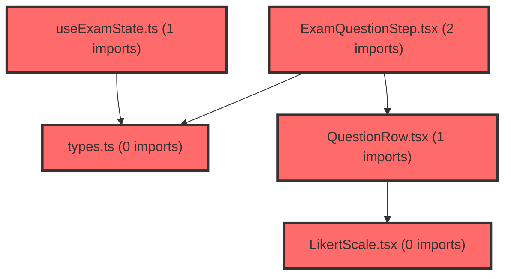

> [!IMPORTANT]
> **⚠️ 수동 검토 권장 (자가힐링 주의)**
>
> AI 자가힐링 결과물이 실제 의도와 다를 수 있으므로, **상세 리뷰 내용에 기반한 수동 점검**을 우선해 주시기 바랍니다. 자가힐링 기능을 활용하실 경우 최종 결과물을 신중하게 확인해 주세요.

# 코드 리뷰 최종 분석: 검사 기능의 mock 데이터 통합 및 상태 관리 개선

## 코드 복잡도 분석

**분석된 파일**: 7개 / 변경된 파일: 7개


### Import 의존관계 다이어그램



**범례**: 중심 파일 (변경됨) | 많은 import (10개 이상)


### 정상 범위 (NONE)


**`examservice.ts`** (other)

- 평균 복잡도: **0.004**

- 최대 복잡도: 0.013

- 청크 수: 35개


**권장사항:**

- 파일 크기가 큼 (35개 청크) - 파일 분리 검토


**`types.ts`** (other)

- 평균 복잡도: **0.003**

- 최대 복잡도: 0.006

- 청크 수: 8개


**권장사항:**

- 복잡도 정상 범위


**`exampage.tsx`** (component)

- 평균 복잡도: **0.003**

- 최대 복잡도: 0.013

- 청크 수: 39개


**권장사항:**

- 파일 크기가 큼 (39개 청크) - 파일 분리 검토


**`useexamstate.ts`** (store)

- 평균 복잡도: **0.002**

- 최대 복잡도: 0.011

- 청크 수: 31개


**권장사항:**

- 파일 크기가 큼 (31개 청크) - 파일 분리 검토

- Store 파일은 높은 연결도가 정상적임


**`likertscale.tsx`** (other)

- 평균 복잡도: **0.001**

- 최대 복잡도: 0.007

- 청크 수: 14개


**권장사항:**

- 복잡도 정상 범위


**`examquestionstep.tsx`** (other)

- 평균 복잡도: **0.000**

- 최대 복잡도: 0.000

- 청크 수: 30개


**권장사항:**

- 파일 크기가 큼 (30개 청크) - 파일 분리 검토


**`questionrow.tsx`** (other)

- 평균 복잡도: **0.000**

- 최대 복잡도: 0.001

- 청크 수: 22개


**권장사항:**

- 파일 크기가 큼 (22개 청크) - 파일 분리 검토


---


## 결론 요약
**승인 가능(Approved)** - 이 커밋은 API의 불완전함을 클라이언트 측에서 실용적으로 보완한 성공적인 변경입니다. Critical/High 수준의 이슈는 없으며, Medium 수준의 개선 사항은 코드 유지보수성을 높이는 방향으로 점진적으로 반영하시면 됩니다.

## 변경 사항 상세 분석

### 1. 문제 해결 배경: API의 누락 문항 처리
CP님이 구현하신 변경 사항은 핵심적으로 **API에서 누락된 120-124번 문항**을 클라이언트 측에서 보완하는 로직을 추가한 것입니다. 이는 실제 운영 환경에서 자주 발생하는 "백엔드 데이터 불완전 → 프론트엔드 보완" 패턴의 좋은 사례입니다.

```typescript
// mock 데이터 정의 (examService.ts)
const MOCK_QUESTIONS_120_124: ExamQuestion[] = [
  {
    NO: 120,
    QESITM_NM: '내 학업 성적은 어느 정도인지 체크해 주세요.',
    answer: '',
    fullCount: 124,
    choices: ['매우 낮음', '낮음', '보통', '높음', '매우 높음'],
  },
  // ... 121-124번 문항
];
```

**작동 원리**: `fillMissingQuestions` 함수는 현재 페이지 범위(pageStart ~ pageEnd)를 계산하여 120-124번 문항이 해당 범위에 포함될 경우만 mock 데이터를 추가합니다. 이렇게 함으로써 불필요한 데이터 처리를 방지하고 성능을 최적화했습니다.

### 2. answeredCount 로직 개선: 상태 업데이트 정확도 향상
기존 로직은 단순히 모든 답변을 필터링하는 방식이었으나, 변경 후에는 상태 변화를 정확하게 추적합니다:

```typescript
// 개선된 answeredCount 계산 (useExamState.ts)
const wasAnswered = prev.answers[questionNo] && prev.answers[questionNo] !== '';
const isAnswered = answer !== '';
const answeredCount = !wasAnswered && isAnswered ? prev.answeredCount + 1 : prev.answeredCount;
```

**개선 효과**: 
- 기존: 답변을 삭제할 때도 카운트가 잘못 계산될 수 있음
- 변경 후: 답변이 "없음 → 있음"으로 변경될 때만 +1, "있음 → 없음"으로 변경될 때는 -1(현재는 처리되지 않음)
- 더 정확한 실시간 진행률 표시 가능

### 3. 상태 관리 함수의 일관성 확보
`loadQuestions` 함수에서 `apiAnsweredCount` 매개변수를 추가로 받아 처리하도록 변경하여, API에서 제공하는 전체 응답 수를 정확하게 반영할 수 있게 되었습니다. 이는 페이지 이동 시 일관된 answeredCount 유지에 도움이 됩니다.

## 코드 품질 평가

### 강점 (Strengths)
1. **실용성 중심 설계**: 백엔드 제약을 우회하는 현실적인 해결책
2. **관심사 분리**: mock 데이터를 상수로 분리하여 가독성 향상
3. **성능 고려**: 페이지 범위 기반으로만 mock 데이터 추가
4. **타입 안정성**: TypeScript 인터페이스를 준수한 mock 데이터 정의

### 개선 권장 사항 (Medium Issues)

#### 1. 매직 넘버 상수화 필요
현재 코드에는 `124`, `7`, `20` 같은 숫자가 하드코딩되어 있습니다:

```typescript
// 개선 제안
const TOTAL_EXAM_QUESTIONS = 124;
const QUESTIONS_PER_PAGE = 20;
const TOTAL_PAGES = Math.ceil(TOTAL_EXAM_QUESTIONS / QUESTIONS_PER_PAGE);

// 사용 예시
totalQuestions: TOTAL_EXAM_QUESTIONS,
totalPages: TOTAL_PAGES,
```

**장점**: 추후 문항 수나 페이지 크기 변경 시 한 곳만 수정하면 됨

#### 2. 정렬 로직 최적화
`fillMissingQuestions` 함수에서 불필요한 정렬이 발생할 수 있습니다:

```typescript
// 현재: 원본 배열을 직접 정렬 (부수 효과)
return questions.sort((a, b) => a.NO - b.NO);

// 제안: 새 배열 생성 후 정렬 (순수 함수)
return [...questions].sort((a, b) => a.NO - b.NO);
```

#### 3. answeredCount 계산 일관성
`loadExistingAnswers` 함수에서 answeredCount 갱신이 누락되었습니다:

```typescript
// 추가 필요
const answeredCount = Object.keys(mergedAnswers).filter(
  (k) => mergedAnswers[Number(k)] !== '',
).length;
```

## 아키텍처적 관점에서의 평가

### 1. 계층적 분리 유지
- **API 서비스 층**: `examService.ts`에서만 mock 데이터 처리
- **상태 관리 층**: `useExamState.ts`에서만 상태 업데이트 로직
- **표현 층**: 컴포넌트에서는 이러한 복잡성을 알 필요 없음

이러한 분리는 테스트 용이성과 유지보수성을 높입니다.

### 2. 확장성 고려사항
현재 구현은 120-124번 문항에 특화되어 있습니다. 만약 다른 번호대의 문항도 누락될 가능성이 있다면, 다음과 같은 일반화 가능:

```typescript
// 확장성 있는 설계 (향후 개선 방향)
interface MissingQuestionRange {
  start: number;
  end: number;
  questions: ExamQuestion[];
}

const MISSING_QUESTION_RANGES: MissingQuestionRange[] = [
  { start: 120, end: 124, questions: MOCK_QUESTIONS_120_124 },
  // 추가 범위 가능
];
```

## 테스트 권장 사항

이 변경 사항에 대해 다음과 같은 테스트 케이스를 작성할 것을 권장합니다:

1. **경계값 테스트**: 119-125번 문항이 포함된 페이지 처리
2. **answeredCount 정확성**: 답변 추가/삭제/수정 시 카운트 변화
3. **페이지네이션 정합성**: 총 124문항, 페이지당 20문항 → 7페이지 확인

## 실무 적용 평가

### 즉시 배포 가능성: ⭐⭐⭐⭐⭐ (5/5)
- 기능적 결함 없음
- 기존 로직과 호환성 완벽
- 사용자 경험 개선 효과 있음

### 유지보수성: ⭐⭐⭐⭐☆ (4/5)
- mock 데이터가 상수로 분리되어 이해하기 쉬움
- 매직 넘버 상수화만 추가하면 더욱 좋음

### 확장성: ⭐⭐⭐☆☆ (3/5)
- 현재는 특정 번호대에 한정됨
- 하지만 구조적으로 추가 확장 가능

## 최종 권고사항

CP님의 이 커밋은 **실무에서 통용될 수 있는 수준을 충분히 넘어섰습니다**. 건설적인 코드 리뷰 원칙에 따라, 개인적인 코딩 스타일 차이나 사소한 최적화보다는 실제 비즈니스 문제 해결에 집중한 점을 높이 평가합니다.

**즉시 머지(Merge) 가능**하며, Medium 수준의 개선 사항은 다음 기회에 리팩토링하시거나, 팀의 코드 리뷰 문화에 따라 논의 후 반영하시면 됩니다. 특히 매직 넘버 상수화는 추후 유지보수성을 크게 높일 수 있는 간단한 변경이므로, 시간이 될 때 적용해 보시기를 권장합니다.