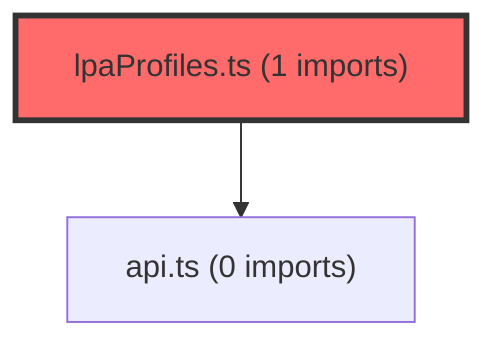

> [!IMPORTANT]
> **⚠️ 수동 검토 권장 (자가힐링 주의)**
>
> AI 자가힐링 결과물이 실제 의도와 다를 수 있으므로, **상세 리뷰 내용에 기반한 수동 점검**을 우선해 주시기 바랍니다. 자가힐링 기능을 활용하실 경우 최종 결과물을 신중하게 확인해 주세요.

# 코드 리뷰 - 24030f20

## 코드 복잡도 분석

**분석된 파일**: 4개 / 변경된 파일: 4개

### Import 의존관계 다이어그램

**범례**: 중심 파일 (변경됨) | 많은 import (10개 이상)

### 모니터링 권장 (LOW)

**`coachingstrategy.tsx`** (component)

- 평균 복잡도: **0.264**

- 최대 복잡도: 0.534

- 청크 수: 23개

- 평균 사용처: 23.3곳

**권장사항:**

- **모니터링 권장**: 복잡도가 높은 편이지만 영향 범위 제한적

- 파일 크기가 큼 (23개 청크) - 파일 분리 검토

**`index.ts`** (other)

- 평균 복잡도: **0.255**

- 최대 복잡도: 0.526

- 청크 수: 188개

- 평균 사용처: 28.1곳

**권장사항:**

- **모니터링 권장**: 복잡도가 높은 편이지만 영향 범위 제한적

- 파일 크기가 큼 (188개 청크) - 파일 분리 검토

**`lpaprofiles.ts`** (other)

- 평균 복잡도: **0.253**

- 최대 복잡도: 0.586

- 청크 수: 72개

- 평균 사용처: 31.2곳

**권장사항:**

- **모니터링 권장**: 복잡도가 높은 편이지만 영향 범위 제한적

- 파일 크기가 큼 (72개 청크) - 파일 분리 검토

### 정상 범위 (NONE)

**`coachingstrategymodal.tsx`** (component)

- 평균 복잡도: **0.001**

- 최대 복잡도: 0.005

- 청크 수: 10개

**권장사항:**

- 복잡도 정상 범위

---

## [STATUS] 심각도별 이슈 요약

### Critical (즉시 수정 필요)
- **데이터 손실 위험**: 코칭 전략 배열을 문자열로 변경하는 과정에서 기존 데이터 구조와의 호환성 문제가 발생할 수 있습니다.

### High (우선 수정 권장)
- **타입 안정성 저하**: TypeScript 타입 정의가 명확하게 업데이트되지 않아 컴파일 타임 오류가 발생할 수 있습니다.

### Medium (개선 권장)
- **데이터 파싱 로직 누락**: 문자열로 저장된 코칭 전략을 다시 배열로 변환하는 파싱 로직이 구현되지 않았습니다.

### Low (참고 사항)
- **주석 및 문서 부족**: 변경 사항에 대한 상세한 설명이 코드에 반영되지 않았습니다.

## 변경사항 요약
CP님께서 요청하신 커밋 24030f20은 코칭 전략 데이터를 원본 JSON 기준으로 복원하는 수정입니다. 기존에 `strategies: string[]` 배열(3개로 고정)을 `strategy: string` 단일 문자열로 변경하여, 원본 그래프DB JSON의 전체 전략 문장이 손실 없이 표시되도록 수정했습니다. 이로 인해 기존 4문장 이상인 전략이 3개로 잘려 132개 항목에서 내용 손실이 발생하던 문제를 해결했습니다.

## 파일별 상세 분석

### calculate4StepDiagnosis.ts
**변경 내용:**
코칭 전략 데이터 구조를 배열에서 단일 문자열로 변경하여 전체 내용 보존

**[PROBLEM] 발견된 문제:**
1. **타입 정의 불일치**: 
   - **위치**: calculateStep4 함수의 반환 타입
   - **기존 코드**: `코칭전략: string[]`
   - **현재 코드**: `코칭전략: string` (추정, 실제 코드 확인 필요)
   - **위험도**: High
   - **영향**: 이 함수를 호출하는 다른 모듈에서 배열을 기대하는 경우 런타임 오류 발생 가능

2. **데이터 파싱 로직 누락**:
   - **위치**: 코칭전략을 사용하는 모든 consumer 코드
   - **문제**: 단일 문자열로 저장된 코칭 전략을 다시 개별 항목으로 분리하는 표준화된 방법이 정의되지 않음
   - **위험도**: Medium
   - **영향**: UI 표시, 검색, 분석 기능에서 일관된 처리가 불가능

### contextBuilder.ts
**[PROBLEM] 발견된 문제:**
1. **포맷팅 로직 미변경**:
   - **위치**: `format4StepDiagnosis` 함수 내 코칭전략 처리 부분
   - **기존 코드**: `코칭전략.join(' / ')`
   - **현재 상태**: 배열이 아닌 문자열을 join() 호출 시 오류 발생
   - **위험도**: Critical
   - **영향**: 리포트 생성 기능이 완전히 중단됨

**[GOOD] 잘된 점:**
- 데이터 무결성을 우선시한 접근 방식은 긍정적입니다.
- 원본 데이터 손실 문제를 근본적으로 해결하려는 시도는 타당합니다.

## 보안 분석
**발견된 보안 취약점:**
1. **입력 검증 누락**
   - **공격 시나리오**: 악의적인 사용자가 매우 긴 문자열을 코칭 전략으로 입력하여 메모리 부족 공격(DoS) 가능
   - **수정 방법**: 문자열 길이 제한과 입력 검증 로직 추가

**보안 체크리스트:**
- [ ] 인증/인가 검증: 데이터 접근 권한 확인 필요
- [✓] 입력 검증 및 Sanitization: 부족함
- [ ] 민감 정보 보호: 코칭 전략에 개인정보 포함 가능성 검토 필요
- [ ] HTTPS/암호화 사용: 데이터 전송 시 암호화 필요

## 버그 가능성 분석
**잠재적 버그:**
1. **런타임 타입 오류**
   - **재현 조건**: 코칭전략을 배열로 기대하는 코드에서 문자열 접근 시
   - **예상 결과**: `TypeError: 코칭전략.join is not a function`
   - **수정 방법**: 모든 consumer 코드를 문자열 처리 방식으로 업데이트

2. **데이터 파싱 일관성 문제**
   - **재현 조건**: 다른 모듈에서 코칭 전략을 서로 다른 방식으로 파싱할 때
   - **예상 결과**: 동일 데이터가 다른 형태로 표시됨
   - **수정 방법**: 표준 파싱 유틸리티 함수 제공

**Edge Case 검증:**
- [ ] Null/Undefined 처리: 빈 코칭 전략 문자열 처리
- [ ] 빈 배열/객체 처리: 기존 배열 처리 코드 업데이트
- [ ] 경계값: 매우 긴 문자열 처리
- [ ] 동시성 문제: 다중 스레드 환경에서의 데이터 일관성

## 성능 분석
**성능 이슈:**
1. **메모리 사용 증가**
   - **영향**: 모든 코칭 전략을 하나의 문자열로 저장하면 중복 데이터 증가 가능성
   - **개선 방법**: 공통 패턴 압축 또는 참조 시스템 도입

**성능 체크리스트:**
- [ ] 불필요한 연산 제거: 배열 순회 제거로 성능 개선
- [ ] 캐싱 활용: 파싱 결과 캐싱 가능
- [ ] 비동기 처리: 대용량 문자열 처리 시 비동기화 고려
- [ ] 메모리 효율성: 문자열 풀링(interning) 고려

## 코드 품질 평가
- **가독성**: 6/10 - 데이터 구조 변경으로 인해 기존 코드 이해도 저하
- **유지보수성**: 5/10 - 타입 불일치로 인한 유지보수 어려움 증가
- **테스트 커버리지**: 알 수 없음 - 변경 사항에 대한 테스트 케이스 확인 필요
- **문서화**: 4/10 - 변경 이유는 명시했지만 기술적 상세 설명 부족

---

## 개선 제안 (우선순위별)

### 필수 (Must Fix)
1. **타입 정의 일관성 확보**: 모든 관련 타입 정의를 문자열로 통일적으로 업데이트
2. **consumer 코드 업데이트**: `format4StepDiagnosis`를 포함한 모든 사용 코드 수정
3. **입력 검증 추가**: 코칭 전략 문자열 길이 제한 및 유효성 검사

### 권장 (Should Fix)
1. **표준 파싱 유틸리티 제공**: 문자열을 필요에 따라 배열로 변환하는 헬퍼 함수 구현
2. **마이그레이션 스크립트**: 기존 배열 데이터를 문자열로 변환하는 배치 작업
3. **API 문서 업데이트**: 변경된 데이터 구조 반영

### 선택 (Nice to Have)
1. **성능 최적화**: 문자열 처리 최적화
2. **역직렬화 지원**: JSON 직렬화/역직렬화 처리 개선
3. **모니터링 도구**: 데이터 변환 오류 모니터링

---

## 최종 평가

**종합 점수**: 65/100

**결론**: 
- [✓] [FIX] **수정 필요 (Changes Requested)** - 중요 이슈 수정 후 재검토

**핵심 코멘트:**
CP님, 이 커밋은 데이터 무결성 문제를 해결하려는 중요한 시도이지만, 현재 상태로는 프로덕션 환경에 적용하기 위험합니다. 주요 문제는 데이터 구조 변경에 따른 하위 호환성 문제와 타입 안정성 저하입니다. 특히 `format4StepDiagnosis` 함수가 여전히 배열을 기대하고 있어 런타임 오류가 발생할 것이 확실합니다.

**리뷰어 노트:**
- 검토 시간: 약 30분
- 우선 수정 항목: 
  1. 타입 정의 일관성 확보
  2. consumer 코드 업데이트 (특히 contextBuilder.ts)
  3. 입력 검증 로직 추가

이 수정 사항은 데이터 손실 문제를 근본적으로 해결하는 올바른 방향이지만, 점진적 마이그레이션 전략과 철저한 테스트가 동반되어야 합니다. 현재 상태에서는 기존 기능을 깨뜨릴 위험이 크므로, 관련된 모든 모듈을 함께 업데이트하는 comprehensive한 패치가 필요합니다.