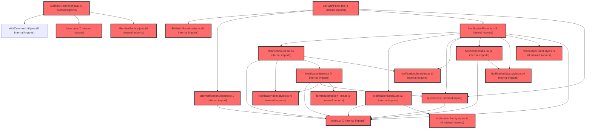

> [!IMPORTANT]
> **⚠️ 수동 검토 권장 (자가힐링 주의)**
>
> AI 자가힐링 결과물이 실제 의도와 다를 수 있으므로, **상세 리뷰 내용에 기반한 수동 점검**을 우선해 주시기 바랍니다. 자가힐링 기능을 활용하실 경우 최종 결과물을 신중하게 확인해 주세요.

# 코드 리뷰 - 25745b3b

## 코드 복잡도 분석

**분석된 파일**: 43개 / 변경된 파일: 49개


### Import 의존관계 다이어그램



**범례**: 중심 파일 (변경됨) | 많은 import (10개 이상)


### 정상 범위 (NONE)


**`membercontroller.java`** (other)

- 평균 복잡도: **0.391**

- 최대 복잡도: 0.470

- 청크 수: 6개

- 평균 사용처: 53.7곳


**권장사항:**

- 복잡도 정상 범위


**`memberservice.java`** (other)

- 평균 복잡도: **0.381**

- 최대 복잡도: 0.468

- 청크 수: 11개

- 평균 사용처: 73.5곳


**권장사항:**

- 복잡도 정상 범위


**`groupquerymapper.xml`** (other)

- 평균 복잡도: **0.239**

- 최대 복잡도: 0.470

- 청크 수: 2개

- 평균 사용처: 7.0곳


**권장사항:**

- 복잡도 정상 범위


**`groupmembermapper.xml`** (other)

- 평균 복잡도: **0.238**

- 최대 복잡도: 0.469

- 청크 수: 2개

- 평균 사용처: 7.0곳


**권장사항:**

- 복잡도 정상 범위


**`usermapper.xml`** (other)

- 평균 복잡도: **0.238**

- 최대 복잡도: 0.469

- 청크 수: 2개

- 평균 사용처: 7.0곳


**권장사항:**

- 복잡도 정상 범위


**`guestservice.java`** (other)

- 평균 복잡도: **0.236**

- 최대 복잡도: 0.466

- 청크 수: 2개

- 평균 사용처: 32.5곳


**권장사항:**

- 복잡도 정상 범위


**`user.java`** (other)

- 평균 복잡도: **0.233**

- 최대 복잡도: 0.464

- 청크 수: 6개

- 평균 사용처: 42.3곳


**권장사항:**

- 복잡도 정상 범위


**`groupcontroller.java`** (other)

- 평균 복잡도: **0.205**

- 최대 복잡도: 0.467

- 청크 수: 23개

- 평균 사용처: 24.8곳


**권장사항:**

- 파일 크기가 큼 (23개 청크) - 파일 분리 검토


**`groupmember.java`** (other)

- 평균 복잡도: **0.189**

- 최대 복잡도: 0.464

- 청크 수: 5개

- 평균 사용처: 10.0곳


**권장사항:**

- 복잡도 정상 범위


**`groupservice.java`** (other)

- 평균 복잡도: **0.160**

- 최대 복잡도: 0.471

- 청크 수: 6개

- 평균 사용처: 12.5곳


**권장사항:**

- 복잡도 정상 범위


**`dgnssservice.java`** (other)

- 평균 복잡도: **0.152**

- 최대 복잡도: 0.473

- 청크 수: 50개

- 평균 사용처: 17.6곳


**권장사항:**

- 파일 크기가 큼 (50개 청크) - 파일 분리 검토


**`globalexceptionhandler.java`** (config)

- 평균 복잡도: **0.132**

- 최대 복잡도: 0.466

- 청크 수: 18개

- 평균 사용처: 13.9곳


**권장사항:**

- Config 파일은 높은 연결도가 정상적임


**`userprofilecontroller.java`** (other)

- 평균 복잡도: **0.008**

- 최대 복잡도: 0.008

- 청크 수: 1개


**권장사항:**

- 복잡도 정상 범위


**`formatnotificationtime.ts`** (utility)

- 평균 복잡도: **0.008**

- 최대 복잡도: 0.008

- 청크 수: 2개


**권장사항:**

- 복잡도 정상 범위


**`ssouserregistrationservice.java`** (other)

- 평균 복잡도: **0.004**

- 최대 복잡도: 0.004

- 청크 수: 1개


**권장사항:**

- 복잡도 정상 범위


**`rendermessage.tsx`** (utility)

- 평균 복잡도: **0.004**

- 최대 복잡도: 0.007

- 청크 수: 4개


**권장사항:**

- 복잡도 정상 범위


**`spusermappingfilter.java`** (config)

- 평균 복잡도: **0.003**

- 최대 복잡도: 0.005

- 청크 수: 3개


**권장사항:**

- Config 파일은 높은 연결도가 정상적임


**`queries.ts`** (other)

- 평균 복잡도: **0.003**

- 최대 복잡도: 0.014

- 청크 수: 25개


**권장사항:**

- 파일 크기가 큼 (25개 청크) - 파일 분리 검토


**`usenotificationstream.ts`** (other)

- 평균 복잡도: **0.003**

- 최대 복잡도: 0.009

- 청크 수: 12개


**권장사항:**

- 복잡도 정상 범위


**`notificationitem.tsx`** (other)

- 평균 복잡도: **0.003**

- 최대 복잡도: 0.011

- 청크 수: 8개


**권장사항:**

- 복잡도 정상 범위


**`notificationservice.ts`** (other)

- 평균 복잡도: **0.002**

- 최대 복잡도: 0.006

- 청크 수: 10개


**권장사항:**

- 복잡도 정상 범위


**`bellwithpanel.tsx`** (other)

- 평균 복잡도: **0.002**

- 최대 복잡도: 0.007

- 청크 수: 16개


**권장사항:**

- 복잡도 정상 범위


**`notificationempty.tsx`** (other)

- 평균 복잡도: **0.002**

- 최대 복잡도: 0.003

- 청크 수: 4개


**권장사항:**

- 복잡도 정상 범위


**`notificationtabs.tsx`** (other)

- 평균 복잡도: **0.002**

- 최대 복잡도: 0.010

- 청크 수: 9개


**권장사항:**

- 복잡도 정상 범위


**`types.ts`** (other)

- 평균 복잡도: **0.001**

- 최대 복잡도: 0.004

- 청크 수: 6개


**권장사항:**

- 복잡도 정상 범위


**`bellwithpanel.styles.ts`** (other)

- 평균 복잡도: **0.001**

- 최대 복잡도: 0.009

- 청크 수: 14개


**권장사항:**

- 복잡도 정상 범위


**`notificationempty.styles.ts`** (other)

- 평균 복잡도: **0.001**

- 최대 복잡도: 0.002

- 청크 수: 7개


**권장사항:**

- 복잡도 정상 범위


**`notificationitem.styles.ts`** (other)

- 평균 복잡도: **0.001**

- 최대 복잡도: 0.006

- 청크 수: 17개


**권장사항:**

- 복잡도 정상 범위


**`notificationlist.styles.ts`** (other)

- 평균 복잡도: **0.001**

- 최대 복잡도: 0.008

- 청크 수: 6개


**권장사항:**

- 복잡도 정상 범위


**`notificationlist.tsx`** (other)

- 평균 복잡도: **0.001**

- 최대 복잡도: 0.007

- 청크 수: 7개


**권장사항:**

- 복잡도 정상 범위


**`notificationpanel.styles.ts`** (other)

- 평균 복잡도: **0.001**

- 최대 복잡도: 0.007

- 청크 수: 19개


**권장사항:**

- 복잡도 정상 범위


**`notificationtabs.styles.ts`** (other)

- 평균 복잡도: **0.001**

- 최대 복잡도: 0.010

- 청크 수: 19개


**권장사항:**

- 복잡도 정상 범위


**`index.ts`** (other)

- 평균 복잡도: **0.000**

- 최대 복잡도: 0.000

- 청크 수: 3개


**권장사항:**

- 복잡도 정상 범위


**`index.ts`** (other)

- 평균 복잡도: **0.000**

- 최대 복잡도: 0.000

- 청크 수: 1개


**권장사항:**

- 복잡도 정상 범위


**`index.ts`** (other)

- 평균 복잡도: **0.000**

- 최대 복잡도: 0.000

- 청크 수: 1개


**권장사항:**

- 복잡도 정상 범위


**`index.ts`** (other)

- 평균 복잡도: **0.000**

- 최대 복잡도: 0.000

- 청크 수: 1개


**권장사항:**

- 복잡도 정상 범위


**`index.ts`** (other)

- 평균 복잡도: **0.000**

- 최대 복잡도: 0.000

- 청크 수: 1개


**권장사항:**

- 복잡도 정상 범위


**`notificationpanel.tsx`** (other)

- 평균 복잡도: **0.000**

- 최대 복잡도: 0.002

- 청크 수: 11개


**권장사항:**

- 복잡도 정상 범위


**`index.ts`** (other)

- 평균 복잡도: **0.000**

- 최대 복잡도: 0.000

- 청크 수: 1개


**권장사항:**

- 복잡도 정상 범위


**`index.ts`** (other)

- 평균 복잡도: **0.000**

- 최대 복잡도: 0.000

- 청크 수: 1개


**권장사항:**

- 복잡도 정상 범위


**`completeprofilepage.tsx`** (component)

- 평균 복잡도: **0.000**

- 최대 복잡도: 0.006

- 청크 수: 46개


**권장사항:**

- 파일 크기가 큼 (46개 청크) - 파일 분리 검토


**`mainlayout.tsx`** (other)

- 평균 복잡도: **0.000**

- 최대 복잡도: 0.010

- 청크 수: 123개


**권장사항:**

- 파일 크기가 큼 (123개 청크) - 파일 분리 검토


**`studentlayout.tsx`** (other)

- 평균 복잡도: **0.000**

- 최대 복잡도: 0.007

- 청크 수: 75개


**권장사항:**

- 파일 크기가 큼 (75개 청크) - 파일 분리 검토


---


## 변경 배경

이 커밋은 크게 세 가지 독립적인 변경을 포함합니다: (1) **gender(성별) 컬럼 제거** — 회원가입/게스트 참가/멤버 정보에서 성별 필드를 제거하고 심리검사 시작 시점에 별도 수집하는 정책으로 전환 (Phase 1), (2) **SSE 기반 실시간 알림 시스템 (프론트엔드)** — 알림 목록 조회, 무한 스크롤, SSE 스트림 연결, Optimistic Update를 포함한 notification feature 신규 구현, (3) **DgnssService 진단 분석 ordNo 정책 개선** — 1/2회차 분석 데이터 필터링 로직 추가 및 fallback 조회, (4) **SpUserMappingFilter 자동 가입** — TEACHER/STUDENT userType에 대해 필터 단계에서 자동 회원가입 처리, (5) **GlobalExceptionHandler SSE 예외 처리 개선** — SseEmitter 관련 IOException을 stack trace 기반으로 탐지하여 WARN 처리.

- **목적**: 성별 필드 제거 정책 반영, 실시간 알림 기능 구현, 진단 분석 정책 개선, SSO 자동 가입, SSE 예외 처리 안정화
- **도메인**: API (백엔드) / UI (프론트엔드) / 비즈니스 로직
- **변경 방향**: 불필요한 데이터 수집 제거, 실시간성 강화, 예외 처리 정밀화

## [GOOD] 잘된 점

1. **gender 제거의 일관성**: User 도메인, GroupMember 도메인, 모든 Mapper XML, Controller/Service 레이어까지 gender 참조를 빠짐없이 제거하여 정책 변경이 전 계층에 걸쳐 일관되게 반영되었습니다. 특히 `SsoUserRegistrationService`의 Javadoc에 "Phase 1 — gender 컬럼 정리"라고 명시하여 추후 작업자가 의도를 파악하기 쉽게 한 점이 좋습니다.

2. **SSE 알림 시스템의 견고한 설계**: `fetchEventSource` 라이브러리를 활용한 SSE 연결, 지수 백오프 재연결, 토큰 만료 시 refresh 후 재연결, `openWhenHidden: true`로 백그라운드 연결 유지 등 실시간 알림의 운영 안정성을 고려한 설계가 돋보입니다. 특히 `onerror` 콜백에서 `return retryDelay`를 반환하여 `fetch-event-source` 라이브러리의 내장 재연결 메커니즘을 활용한 점이 효율적입니다.

3. **Optimistic Update 패턴의 정확한 구현**: `useMarkAsRead`와 `useMarkAllAsRead`에서 `onMutate`(낙관적 업데이트) -> `onError`(rollback) -> `onSettled`(invalidation)의 3단계 패턴을 정확히 구현했습니다. 특히 `onMutate`에서 `queryClient.cancelQueries`를 먼저 호출하여 진행 중인 refetch를 취소한 후 업데이트하는 점, `previousData`를 저장해두고 `onError`에서 복원하는 점이 모범적입니다.

4. **Race condition 대비**: `SpUserMappingFilter.autoRegister()`에서 동시 요청으로 인한 중복 가입을 `IllegalStateException`(findBySpUserId에서 발견)과 `DataIntegrityViolationException`(INSERT UNIQUE 제약 위반) 두 가지 케이스로 나누어 catch하고 재조회로 복구하는 설계가 현실적입니다. 필터 레벨에서 이 예외 처리를 함으로써 컨트롤러 레이어까지 전파되는 것을 방지했습니다.

5. **isFromEmitter 메서드 도입**: 기존에는 `e.getMessage()` 문자열 매칭(로케일 의존적)으로만 IOException을 WARN 처리했으나, stack trace 기반으로 SseEmitter/ResponseBodyEmitter 여부를 판단하는 `isFromEmitter` 메서드를 추가하여 Windows 한국어 환경 등에서도 정확히 WARN 처리할 수 있게 개선했습니다.

## 변경사항 요약

gender 컬럼을 User/GroupMember 도메인과 모든 관련 레이어에서 제거하고, 프론트엔드에 SSE 기반 실시간 알림 시스템을 신규 구축했습니다. 또한 DgnssService의 진단 분석 ordNo 정책을 개선하고, SpUserMappingFilter에 TEACHER/STUDENT 자동 가입 로직을 추가했으며, GlobalExceptionHandler에서 SSE 관련 IOException을 WARN으로 처리하도록 개선했습니다.

---

## [ISSUE] 개선이 필요한 부분

### Critical (즉시 수정 필요)

없음

### High (우선 수정 권장)

**1. DgnssService: `selectStLernAnalysis` 쿼리에 ord_no 조건이 없어 전체 데이터를 조회한 후 Java Stream으로 필터링 — 데이터 규모에 따른 성능 문제**

- **위치**: `DgnssService.java` 라인 995-1010 (else 블록)
- **문제**: `dgnssResultId` 미지정 시 `selectStLernAnalysis` 쿼리가 `ord_no` 조건 없이 모든 회차 데이터를 조회한 후, Java Stream의 `filter()`로 1회차 또는 1/2회차를 걸러냅니다. `selectStLernAnalysis` 쿼리(XML 라인 2475)의 WHERE 절을 확인한 결과, `paper_idx`와 `stdt_id` 조건만 있고 `ord_no` 조건이 없어 학생의 모든 회차 데이터를 DB에서 애플리케이션 메모리로 로드한 후 필터링합니다. 분석 데이터가 많은 학생(예: 5회차 이상)의 경우 불필요한 네트워크/메모리 부담이 발생합니다.

- **기존 코드**:
```java
// DgnssService.java 라인 995-1010
} else {
    // dgnssResultId 미지정 시 ordNo 정책:
    // 1 -> 1회차만, 2 -> 1/2회차 모두
    if (requestedOrdNo == 1) {
        stAnalysisList = stAnalysisList.stream()
                .filter(map -> MapUtils.getInteger(map, "ord_no", 0) == 1)
                .collect(Collectors.toList());
    } else if (requestedOrdNo == 2) {
        stAnalysisList = stAnalysisList.stream()
                .filter(map -> {
                    int ord = MapUtils.getInteger(map, "ord_no", 0);
                    return ord == 1 || ord == 2;
                })
                .collect(Collectors.toList());
    }
```

- **해결 방안**: `selectStLernAnalysis` 쿼리에 동적 `ord_no` 조건을 추가하거나, `requestedOrdNo` 값을 `analysisParam`에 담아 Mapper로 전달하여 DB 레벨에서 필터링하는 것이 바람직합니다. 단, `hasDgnssResultId` 분기(라인 980-993)에서는 `resolvedOrdNo`를 사용하여 단일 회차를 필터링하므로, 이쪽도 함께 Mapper로 위임할 수 있습니다. **수정 코드 제시 불가 — Mapper XML의 동적 쿼리 구조(`<if>` 태그 등)와 `selectStLernAnalysis`의 전체 호출부를 함께 확인해야 정확한 수정이 가능합니다.**

**2. NotificationPanel: `onClose` props를 언더스코어 처리하여 사용하지 않음 — 컴포넌트 책임 경계 모호**

- **위치**: `NotificationPanel.tsx` 라인 13
- **문제**: `NotificationPanel`이 `onClose` props를 받지만 실제로 사용하지 않고 `_onClose`로 언더스코어 처리했습니다. 패널 닫기(외부 클릭, ESC)는 부모인 `BellWithPanel`에서 처리하고 있습니다. 이는 컴포넌트 인터페이스에 불필요한 props를 노출하는 것으로, `onClose`를 제거하거나 패널 내부에서도 닫기 버튼을 제공하는 것이 일관성 측면에서 좋습니다.

- **기존 코드**:
```tsx
// NotificationPanel.tsx 라인 13
export const NotificationPanel = ({ onClose: _onClose }: NotificationPanelProps) => {
```

- **해결 방안**: `NotificationPanelProps`에서 `onClose`를 제거하고, 패널 내부에 X 버튼(닫기)을 추가하여 `onClose`를 실제로 사용하거나, props 자체를 없애는 것이 좋습니다.

```tsx
// NotificationPanel.tsx
interface NotificationPanelProps {
  onClose: () => void;  // 실제로 사용
}

export const NotificationPanel = ({ onClose }: NotificationPanelProps) => {
  // ... (내부에서 onClose 사용)
  
  return (
    <S.Panel>
      <S.Header>
        <S.Title>알림</S.Title>
        <S.CloseButton onClick={onClose}>X</S.CloseButton>
        {/* ... */}
      </S.Header>
      {/* ... */}
    </S.Panel>
  );
};
```

### Medium (개선 권장)

**1. `useNotificationStream`: SSE 연결 상태를 `sseConnected` state로 관리하지만 실제 연결 성공/실패를 정확히 반영하지 못함**

- **위치**: `BellWithPanel.tsx` 라인 17-20, `useNotificationStream.ts`
- **문제**: `BellWithPanel`에서 `sseConnected` state를 `useState(false)`로 초기화하고, `onNotification` 콜백에서 `setSseConnected(true)`를 호출합니다. 하지만 이는 "알림을 한 번이라도 수신했을 때"만 true가 되고, SSE 연결 자체가 성공했는지(`onopen`에서 200 OK)는 반영되지 않습니다. `fetchEventSource`의 `onopen` 콜백에서 연결 성공 시 `setSseConnected(true)`를 호출하는 것이 더 정확합니다.

- **개선 제안**: `useNotificationStream`의 반환값에 `isConnected` 상태를 포함시키거나, `onopen` 콜백에서 연결 성공을 알리는 콜백을 받도록 설계를 개선하세요.

**2. `NotificationItem`: `link`가 null일 때 `cursor: 'default'`를 inline style로 처리 — 스타일 파일로 이동 권장**

- **위치**: `NotificationItem.tsx` 라인 33
- **문제**: `link` 유무에 따른 커서 스타일을 inline `style` prop으로 처리하고 있습니다. `S.Item` 컴포넌트에 `$hasLink` prop을 추가하여 스타일 파일에서 관리하는 것이 일관성 측면에서 좋습니다.

- **기존 코드**:
```tsx
<S.Item
  $isRead={notification.read}
  onClick={handleClick}
  style={{ cursor: notification.link ? 'pointer' : 'default' }}
>
```

- **개선 제안**:
```tsx
// NotificationItem.tsx
<S.Item
  $isRead={notification.read}
  $hasLink={!!notification.link}
  onClick={handleClick}
>

// NotificationItem.styles.ts
export const Item = styled.div<{ $isRead: boolean; $hasLink: boolean }>`
  // ...
  cursor: ${({ $hasLink }) => ($hasLink ? 'pointer' : 'default')};
`;
```

---

## 최종 평가

**결론**:
- [ ] [OK] **승인 (Approved)** - Critical/High 이슈 없음
- [ ] [WARN] **조건부 승인 (Approved with Comments)** - Medium 이하 이슈만 존재
- [x] [FIX] **수정 필요 (Changes Requested)** - Critical/High 이슈 존재

**종합 의견:**

전반적으로 코드 품질이 높고, gender 제거 작업의 일관성, SSE 알림 시스템의 견고한 설계, race condition 대비 등 많은 부분이 잘 구현되었습니다. 다만 DgnssService의 `selectStLernAnalysis`에서 ord_no 조건 없이 전체 데이터를 조회한 후 Java Stream으로 필터링하는 방식은 데이터 규모가 커질수록 성능 저하로 이어질 수 있어 DB 레벨 필터링으로 개선이 필요합니다. 또한 NotificationPanel의 `onClose` props가 사용되지 않는 점은 인터페이스 정리 차원에서 수정을 권장합니다. 위 High 이슈 2건만 해결되면 바로 승인 가능한 수준입니다.