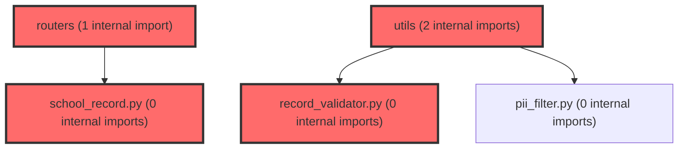

> [!IMPORTANT]
> **⚠️ 수동 검토 권장 (자가힐링 주의)**
>
> AI 자가힐링 결과물이 실제 의도와 다를 수 있으므로, **상세 리뷰 내용에 기반한 수동 점검**을 우선해 주시기 바랍니다. 자가힐링 기능을 활용하실 경우 최종 결과물을 신중하게 확인해 주세요.

# 코드 리뷰 - 2786422c

## 코드 복잡도 분석

**분석된 파일**: 9개 / 변경된 파일: 14개


### Import 의존관계 다이어그램



**범례**: 중심 파일 (변경됨) | 많은 import (10개 이상)


### 정상 범위 (NONE)


**`main.py`** (other)

- 평균 복잡도: **0.204**

- 최대 복잡도: 0.471

- 청크 수: 7개

- 평균 사용처: 6.9곳


**권장사항:**

- 복잡도 정상 범위


**`__init__.py`** (utility)

- 평균 복잡도: **0.157**

- 최대 복잡도: 0.304

- 청크 수: 2개

- 평균 사용처: 3.0곳


**권장사항:**

- 복잡도 정상 범위


**`school_record.py`** (other)

- 평균 복잡도: **0.005**

- 최대 복잡도: 0.009

- 청크 수: 3개


**권장사항:**

- 복잡도 정상 범위


**`__init__.py`** (other)

- 평균 복잡도: **0.004**

- 최대 복잡도: 0.004

- 청크 수: 1개


**권장사항:**

- 복잡도 정상 범위


**`school_record_service.py`** (other)

- 평균 복잡도: **0.004**

- 최대 복잡도: 0.010

- 청크 수: 10개


**권장사항:**

- 복잡도 정상 범위


**`test_school_record.py`** (other)

- 평균 복잡도: **0.004**

- 최대 복잡도: 0.010

- 청크 수: 32개


**권장사항:**

- 파일 크기가 큼 (32개 청크) - 파일 분리 검토


**`school_record_policy.py`** (other)

- 평균 복잡도: **0.003**

- 최대 복잡도: 0.005

- 청크 수: 5개


**권장사항:**

- 복잡도 정상 범위


**`school_record.py`** (other)

- 평균 복잡도: **0.003**

- 최대 복잡도: 0.006

- 청크 수: 10개


**권장사항:**

- 복잡도 정상 범위


**`record_validator.py`** (utility)

- 평균 복잡도: **0.002**

- 최대 복잡도: 0.006

- 청크 수: 5개


**권장사항:**

- 복잡도 정상 범위


---


## 변경 배경

이 커밋은 **생활기록부(행동특성 및 종합의견) AI 문구 생성 기능**을 에이전트(`agent/`)에 신규 추가한 것입니다. 기존 `/chat` 계열 대화 엔드포인트와 별개로, 프론트엔드가 전달한 학생 검사 결과(T점수, LPA 유형)와 교사 관찰 입력을 바탕으로 나이스(NEIS)에 붙여넣을 수 있는 문구를 생성하는 API 2종(단발/SSE 스트림)을 제공합니다.

- **목적**: 학교생활기록부 기재 업무 자동화. 정책(2025학년도 기재요령)을 코드와 프롬프트로 분리하여 기획자가 직접 수정 가능하게 함
- **도메인**: 비즈니스 로직 (AI 문구 생성 API), FastAPI 백엔드
- **변경 방향**: 기존 `/chat` 계약을 건드리지 않고 신규 도메인 라우터를 `app/routers/`로 분리. Tool 호출 없이 LiteLLM Router를 직접 단발 호출하는 단순 구조 채택

---

## [GOOD] 잘된 점

1. **정책과 코드의 분리가 탁월함**: `school_record_rules.md`와 학교급별 프롬프트(`school_record_level_*.md`)를 별도 파일로 분리하여 기획자가 Python 코드를 몰라도 문구를 수정할 수 있게 했습니다. `load_prompt()`가 캐싱 없이 매 호출 파일을 읽으므로 서버 재시작 없이 즉시 반영됩니다.
2. **PII 원칙을 설계 단계에서 반영**: 학생 이름·학번을 요청 스키마에 아예 포함하지 않아 "마스킹이 아니라 미전송"이라는 원칙을 지켰습니다. 이는 개인정보보호 측면에서 가장 안전한 접근입니다.
3. **오류 격리(Isolation) 설계가 견고함**: `_guarded()`로 학생 1명의 실패를 개별 처리하고, `_stream_with_heartbeat()`로 중간 프록시의 idle timeout을 방지하는 등 운영 환경을 고려한 설계가 돋보입니다. 특히 `_stream_prefetched()`의 `finally` 블록에서 클라이언트 연결 종료 시 남은 생성 작업을 취소해 LLM 호출 비용 누수를 막은 점이 좋습니다.
4. **금지어 검증을 2단(차단/경고)으로 분리**: `record_validator.py`에서 오탐이 확실한 원본 키워드(`점수`, `못함`, `부족함`, `고등학교` 등)를 `_DROPPED_KEYWORDS`로 명시적으로 제외하고, 차단은 정규식 5종으로 한정한 판단이 합리적입니다.

---

## 변경사항 요약

- 신규: `app/routers/school_record.py` (엔드포인트 2개), `app/services/school_record_service.py` (생성 오케스트레이션), `app/models/school_record.py` (스키마), `app/core/school_record_policy.py` (정책 상수), `app/utils/record_validator.py` (검증), `app/core/prompts/school_record_*.md` (프롬프트)
- 수정: `app/utils/__init__.py` (신규 함수 export), `app/routers/__init__.py` (라우터 등록)
- 기존 `/chat` 계약 및 `llm_router.py`, `pii_filter.py`, `agent_graph.py`는 변경 없음

---

## [ISSUE] 개선이 필요한 부분

### Critical (즉시 수정 필요)

없음

### High (우선 수정 권장)

**1. `_stream_sequential`의 재생성 경로에서 `avoid_openings` 중복 회피가 깨질 수 있음**

`agent/app/services/school_record_service.py`의 `_stream_sequential` 메서드에서, 첫 시도 결과가 정책 위반(`needs_retry=True`)일 때 `_guarded()`를 재호출합니다. 그런데 이 시점에 현재 학생의 첫 시도 opening이 `avoid_openings`에 아직 추가되지 않은 상태입니다. `_guarded()` 내부에서 재생성 결과의 opening을 `avoid_openings`에 추가하지만, 이는 "이미 실패한 첫 시도"의 opening이 아니라 "재생성 결과"의 opening만 반영합니다.

문제 시나리오:
- 학생 A의 첫 시도가 "수업시간에..."로 시작했고 정책 위반으로 재생성됨
- 재생성 결과가 "친구들과..."로 시작하면 `avoid_openings`에는 "친구들과"만 추가됨
- 학생 B가 "수업시간에..."로 시작해도 중복 회피 목록에 없으므로 동일 어절로 생성될 수 있음

**해결 방안**: 재생성 경로에서도 첫 시도의 opening을 `avoid_openings`에 추가한 후 `_guarded()`를 호출해야 합니다.

```python
# _stream_sequential 내부, needs_retry 분기에서
if needs_retry:
    # 첫 시도의 opening도 중복 회피 목록에 반영한다
    first_opening = buffer.split(" ", 1)[0] if buffer else ""
    if first_opening and first_opening not in avoid_openings:
        avoid_openings.append(first_opening)
    retry = asyncio.create_task(
        self._guarded(req, student, index, avoid_openings)
    )
    ...
```

**2. `_generate_one`의 재생성 루프에서 `warnings` 중복 누적 가능성**

`_generate_one`에서 재생성 후에도 `needs_retry`가 True로 남으면 `check_blocking(text)` 결과를 `warnings`에 추가합니다. 그런데 `_finalize()`가 이미 `check_warnings(text)` 결과를 `warnings`에 담아 반환하므로, 재생성 후에도 차단 패턴이 남은 경우 `check_blocking` 결과가 `warnings`에 추가됩니다. 이때 `check_blocking`의 결과는 `ForbiddenHit`로 변환되지만, `check_warnings`의 결과와 별개로 추가되므로 동일한 위반이 두 번 노출될 수 있습니다.

```python
# _generate_one, 재생성 루프 종료 후
if needs_retry:
    warnings = warnings + [ForbiddenHit(**hit) for hit in check_blocking(text)]
```

`check_blocking`의 결과가 `check_warnings`의 결과와 중복될 가능성은 낮지만(차단 패턴과 경고 패턴이 겹치지 않음), `needs_retry`가 True인 상태에서 `warnings`에 차단 패턴을 추가하는 것은 "경고"의 의미를 흐립니다. 차단 패턴은 재생성 후에도 남으면 별도 필드로 노출하거나, `warnings`가 아닌 별도 `blocking_remaining` 필드를 두는 것이 명확합니다.

### Medium (개선 권장)

**1. `_system_prompt`의 `school_level_code` fallback이 조용히 초등 문체를 적용함**

`_system_prompt`에서 `SCHOOL_LEVEL_GUIDELINES.get(req.school_level_code, SCHOOL_LEVEL_GUIDELINES["elementary"])`로 fallback합니다. 그런데 `RecordGenerateRequest._resolve_and_validate`에서 `school_level_code`가 None이면 `school_level`에서 유도하므로, 이 fallback이 실제로 발동하는 경우는 `school_level_code`가 유효하지 않은 값(예: "elementary2")일 때뿐입니다. 이 경우 조용히 초등 문체로 생성되어 중등·고등 요청에서 잘못된 문체가 나갈 수 있습니다. `school_level_code`가 유효하지 않으면 422로 거르는 것이 안전합니다.

**2. `_stream_sequential`의 `_guarded` 재호출 시 이중 타임아웃**

`_stream_sequential`에서 재생성 경로로 `_guarded`를 호출하면, `_guarded` 내부에서 `asyncio.wait_for(..., timeout=STUDENT_TIMEOUT_SECONDS)`로 30초 타임아웃이 적용됩니다. 그런데 `_stream_with_heartbeat`에서 이미 첫 시도에 30초 타임아웃이 적용되었고, 재생성에도 30초가 적용되므로 한 학생당 최대 60초가 소요될 수 있습니다. `STUDENT_TIMEOUT_SECONDS`를 재생성 경로에서는 더 짧게(예: 15초) 설정하거나, 학생당 총 타임아웃을 별도로 관리하는 것이 좋습니다.

**3. `_create_tasks`의 `avoid_openings` 공유가 비결정적임**

`_create_tasks`에서 `avoid_openings` 리스트를 모든 태스크가 공유하지만, `PREFETCH_CONCURRENCY=3`으로 동시 실행되므로 어떤 학생이 먼저 완료되어 opening을 추가하는지가 비결정적입니다. 이는 "결정론적 배정"이라는 `pick_sentence_pattern`의 설계 의도와는 다르지만, `avoid_openings`는 best-effort로 명시되어 있으므로 의도된 동작입니다. 다만 `generate_all`(단발) 경로에서도 동일한 비결정성이 발생하므로, 결과가 요청 순서에 따라 달라질 수 있다는 점을 문서화하거나, `avoid_openings`를 순차적으로만 업데이트하도록 제한하는 것을 고려할 수 있습니다.

---

## 주요 파일 분석

### `agent/app/services/school_record_service.py` (598줄, 핵심 파일)

**변경 내용:**
생활기록부 문구 생성 오케스트레이션. 프롬프트 조립, LLM 호출, 후처리(검증·재생성), 단발/스트리밍 실행 경로를 모두 담당합니다.

**개선 제안:**

1. **`_stream_sequential`의 재생성 경로에서 첫 시도 opening 미반영** (High)
   - **위치**: `_stream_sequential` 메서드, `needs_retry` 분기 (약 480-500줄)
   - **기존 코드**:
   ```python
   if needs_retry:
       retry = asyncio.create_task(
           self._guarded(req, student, index, avoid_openings)
       )
   ```
   - **해결 방안**:
   ```python
   if needs_retry:
       # 첫 시도의 opening도 중복 회피 목록에 반영한다
       first_opening = buffer.split(" ", 1)[0] if buffer else ""
       if first_opening and first_opening not in avoid_openings:
           avoid_openings.append(first_opening)
       retry = asyncio.create_task(
           self._guarded(req, student, index, avoid_openings)
       )
   ```

2. **`_generate_one`의 재생성 후 `warnings` 의미 혼재** (Medium)
   - **위치**: `_generate_one` 메서드, 재생성 루프 종료 후 (약 300-310줄)
   - **기존 코드**:
   ```python
   if needs_retry:
       warnings = warnings + [ForbiddenHit(**hit) for hit in check_blocking(text)]
   ```
   - **해결 방안**: 차단 패턴 잔존을 `warnings`가 아닌 별도 필드로 노출하거나, `RecordResult`에 `blocking_remaining: list[ForbiddenHit]` 필드를 추가하는 것이 명확합니다.

### `agent/app/models/school_record.py` (152줄)

**변경 내용:**
요청/응답 스키마. `school_level_code`를 별도로 받아 `school_level`(고등을 '중등'으로 뭉갬)의 한계를 보완합니다.

**개선 제안:**

1. **`school_level_code` 유효성 검증 강화** (Medium)
   - `_resolve_and_validate`에서 `school_level_code`가 `Literal["elementary", "middle", "high"]`에 속하는지 검증하지 않습니다. Pydantic이 Literal 타입으로 자동 검증하지만, `school_level_code`가 None이 아닌데 유효하지 않은 값이면 422가 반환되므로 실제로는 문제가 없습니다. 다만 `_system_prompt`의 fallback(`SCHOOL_LEVEL_GUIDELINES["elementary"]`)이 불필요하게 존재하므로, 제거하거나 명시적으로 오류를 던지는 것이 안전합니다.

### `agent/app/utils/record_validator.py` (107줄)

**변경 내용:**
금지어 2단 검증(차단/경고), 마크다운 제거, 글자 수 계산.

**개선 제안:**

1. **`_scan`의 중복 히트 가능성** (Medium)
   - `_BLOCKING_PATTERNS`의 "대회·수상 표현" 정규식(`상장|입상|경시대회|수상함|수상하[여였고]|수상했|수상 ?실적|금상|은상|동상`)과 `_WARNING_PATTERNS`의 "외부 실적" 정규식(`자격증|영재교육원|경시대회`)이 `경시대회`에 대해 중복으로 히트할 수 있습니다. 차단과 경고가 동시에 발생하면 `warnings`에 중복 항목이 생깁니다. `_WARNING_PATTERNS`에서 `경시대회`를 제외하거나, `_scan`에서 이미 차단된 매치를 경고에서 제외하는 로직이 필요합니다.

### `agent/app/core/school_record_policy.py` (141줄)

**변경 내용:**
학교급·LPA 유형 가이드, T점수 레벨 변환, 문장 구조 패턴.

**개선 제안:**

1. **`pick_sentence_pattern`의 결정론적 배정이 `avoid_openings`와 충돌 가능** (Medium)
   - `pick_sentence_pattern(index, round2_available)`은 index 기반 결정론적 배정이지만, `avoid_openings`는 실행 순서에 따라 달라집니다. `_stream_prefetched` 경로에서 `PREFETCH_CONCURRENCY=3`으로 동시 실행되면, 학생 1의 opening이 학생 2의 프롬프트에 반영될 수도 있고 아닐 수도 있습니다. 이는 "결정론적"이라는 설계 의도와 다소 상충되지만, `avoid_openings`가 best-effort로 명시되어 있으므로 의도된 동작입니다. 다만 이 비결정성이 결과 품질에 영향을 줄 수 있으므로, `avoid_openings`를 순차적으로만 업데이트하도록 제한하는 것을 고려할 수 있습니다.

---

## 최종 평가

**결론**: 
- [ ] [OK] **승인 (Approved)** - Critical/High 이슈 없음
- [x] [WARN] **조건부 승인 (Approved with Comments)** - Medium 이하 이슈만 존재
- [ ] [FIX] **수정 필요 (Changes Requested)** - Critical/High 이슈 존재

**종합 의견:**
이 커밋은 생활기록부 생성이라는 민감한 도메인을 정책-코드 분리, PII 미전송, 오류 격리, 2단 검증 등 운영 품질을 고려한 설계로 잘 구현했습니다. 특히 `_DROPPED_KEYWORDS`로 오탐을 명시적으로 제외한 판단과, `_stream_prefetched`의 `finally`에서 생성 작업을 취소하는 비용 누수 방지가 돋보입니다. High 이슈로 지적한 `_stream_sequential`의 재생성 경로 opening 미반영은 실제 운영에서 중복 문구가 발생할 수 있는 잠재적 문제이므로, 다음 커밋에서 보완을 권장합니다. 전반적으로 실무에서 통용될 수 있는 높은 품질의 구현입니다.