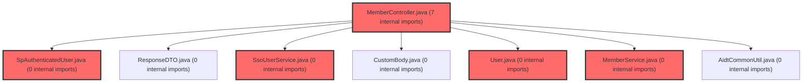

> [!IMPORTANT]
> **⚠️ 수동 검토 권장 (자가힐링 주의)**
>
> AI 자가힐링 결과물이 실제 의도와 다를 수 있으므로, **상세 리뷰 내용에 기반한 수동 점검**을 우선해 주시기 바랍니다. 자가힐링 기능을 활용하실 경우 최종 결과물을 신중하게 확인해 주세요.

# 코드 리뷰 - 27a23382

## 코드 복잡도 분석

**분석된 파일**: 36개 / 변경된 파일: 45개


### Import 의존관계 다이어그램



**범례**: 중심 파일 (변경됨) | 많은 import (10개 이상)


### 정상 범위 (NONE)


**`jwtauthenticationfilter.java`** (config)

- 평균 복잡도: **0.467**

- 최대 복잡도: 0.467

- 청크 수: 1개

- 평균 사용처: 55.0곳


**권장사항:**

- Config 파일은 높은 연결도가 정상적임


**`jwtutil.java`** (utility)

- 평균 복잡도: **0.465**

- 최대 복잡도: 0.468

- 청크 수: 5개

- 평균 사용처: 67.4곳


**권장사항:**

- 복잡도 정상 범위


**`membercontroller.java`** (other)

- 평균 복잡도: **0.391**

- 최대 복잡도: 0.470

- 청크 수: 6개

- 평균 사용처: 53.7곳


**권장사항:**

- 복잡도 정상 범위


**`memberservice.java`** (other)

- 평균 복잡도: **0.381**

- 최대 복잡도: 0.468

- 청크 수: 11개

- 평균 사용처: 73.5곳


**권장사항:**

- 복잡도 정상 범위


**`usermapper.xml`** (other)

- 평균 복잡도: **0.238**

- 최대 복잡도: 0.469

- 청크 수: 2개

- 평균 사용처: 7.0곳


**권장사항:**

- 복잡도 정상 범위


**`groupservice.java`** (other)

- 평균 복잡도: **0.237**

- 최대 복잡도: 0.471

- 청크 수: 4개

- 평균 사용처: 18.8곳


**권장사항:**

- 복잡도 정상 범위


**`user.java`** (other)

- 평균 복잡도: **0.233**

- 최대 복잡도: 0.464

- 청크 수: 6개

- 평균 사용처: 42.3곳


**권장사항:**

- 복잡도 정상 범위


**`securityconfig.java`** (config)

- 평균 복잡도: **0.215**

- 최대 복잡도: 0.464

- 청크 수: 13개

- 평균 사용처: 24.2곳


**권장사항:**

- Config 파일은 높은 연결도가 정상적임


**`admincontroller.java`** (other)

- 평균 복잡도: **0.205**

- 최대 복잡도: 0.470

- 청크 수: 30개

- 평균 사용처: 13.4곳


**권장사항:**

- 파일 크기가 큼 (30개 청크) - 파일 분리 검토


**`adminuserservice.java`** (other)

- 평균 복잡도: **0.203**

- 최대 복잡도: 0.472

- 청크 수: 37개

- 평균 사용처: 17.3곳


**권장사항:**

- 파일 크기가 큼 (37개 청크) - 파일 분리 검토


**`usermapper.java`** (other)

- 평균 복잡도: **0.193**

- 최대 복잡도: 0.463

- 청크 수: 12개

- 평균 사용처: 16.4곳


**권장사항:**

- 복잡도 정상 범위


**`loginpage.tsx`** (component)

- 평균 복잡도: **0.176**

- 최대 복잡도: 0.465

- 청크 수: 55개

- 평균 사용처: 13.9곳


**권장사항:**

- 파일 크기가 큼 (55개 청크) - 파일 분리 검토


**`main.tsx`** (other)

- 평균 복잡도: **0.173**

- 최대 복잡도: 0.461

- 청크 수: 8개

- 평균 사용처: 14.4곳


**권장사항:**

- 복잡도 정상 범위


**`fileservice.java`** (other)

- 평균 복잡도: **0.172**

- 최대 복잡도: 0.468

- 청크 수: 11개

- 평균 사용처: 31.9곳


**권장사항:**

- 복잡도 정상 범위


**`adminuserdetailsservice.java`** (other)

- 평균 복잡도: **0.161**

- 최대 복잡도: 0.471

- 청크 수: 3개

- 평균 사용처: 15.3곳


**권장사항:**

- 복잡도 정상 범위


**`securityutil.java`** (utility)

- 평균 복잡도: **0.159**

- 최대 복잡도: 0.475

- 청크 수: 9개

- 평균 사용처: 17.3곳


**권장사항:**

- 복잡도 정상 범위


**`client.ts`** (other)

- 평균 복잡도: **0.093**

- 최대 복잡도: 0.473

- 청크 수: 29개

- 평균 사용처: 3.2곳


**권장사항:**

- 파일 크기가 큼 (29개 청크) - 파일 분리 검토


**`routes.tsx`** (other)

- 평균 복잡도: **0.089**

- 최대 복잡도: 0.463

- 청크 수: 14개

- 평균 사용처: 4.0곳


**권장사항:**

- 복잡도 정상 범위


**`index.ts`** (component)

- 평균 복잡도: **0.034**

- 최대 복잡도: 0.461

- 청크 수: 27개

- 평균 사용처: 2.3곳


**권장사항:**

- 파일 크기가 큼 (27개 청크) - 파일 분리 검토


**`userprofilecontroller.java`** (other)

- 평균 복잡도: **0.009**

- 최대 복잡도: 0.009

- 청크 수: 1개


**권장사항:**

- 복잡도 정상 범위


**`adminaccountmapper.xml`** (other)

- 평균 복잡도: **0.008**

- 최대 복잡도: 0.008

- 청크 수: 1개


**권장사항:**

- 복잡도 정상 범위


**`spauthenticateduser.java`** (other)

- 평균 복잡도: **0.007**

- 최대 복잡도: 0.007

- 청크 수: 1개


**권장사항:**

- 복잡도 정상 범위


**`guestauthservice.java`** (other)

- 평균 복잡도: **0.006**

- 최대 복잡도: 0.006

- 청크 수: 1개


**권장사항:**

- 복잡도 정상 범위


**`spauthproperties.java`** (config)

- 평균 복잡도: **0.006**

- 최대 복잡도: 0.006

- 청크 수: 1개


**권장사항:**

- Config 파일은 높은 연결도가 정상적임


**`adminaccount.java`** (other)

- 평균 복잡도: **0.006**

- 최대 복잡도: 0.006

- 청크 수: 1개


**권장사항:**

- 복잡도 정상 범위


**`groupservice.ts`** (other)

- 평균 복잡도: **0.005**

- 최대 복잡도: 0.013

- 청크 수: 49개


**권장사항:**

- 파일 크기가 큼 (49개 청크) - 파일 분리 검토


**`ssouserservice.java`** (other)

- 평균 복잡도: **0.004**

- 최대 복잡도: 0.004

- 청크 수: 1개


**권장사항:**

- 복잡도 정상 범위


**`authclient.ts`** (utility)

- 평균 복잡도: **0.004**

- 최대 복잡도: 0.006

- 청크 수: 9개


**권장사항:**

- 복잡도 정상 범위


**`authproxycontroller.java`** (other)

- 평균 복잡도: **0.003**

- 최대 복잡도: 0.005

- 청크 수: 4개


**권장사항:**

- 복잡도 정상 범위


**`index.ts`** (other)

- 평균 복잡도: **0.003**

- 최대 복잡도: 0.010

- 청크 수: 93개


**권장사항:**

- 파일 크기가 큼 (93개 청크) - 파일 분리 검토


**`authcontext.tsx`** (other)

- 평균 복잡도: **0.002**

- 최대 복잡도: 0.008

- 청크 수: 14개


**권장사항:**

- 복잡도 정상 범위


**`usespauth.ts`** (other)

- 평균 복잡도: **0.002**

- 최대 복잡도: 0.008

- 청크 수: 10개


**권장사항:**

- 복잡도 정상 범위


**`useapidata.ts`** (other)

- 평균 복잡도: **0.001**

- 최대 복잡도: 0.008

- 청크 수: 35개


**권장사항:**

- 파일 크기가 큼 (35개 청크) - 파일 분리 검토


**`examauthstep.tsx`** (other)

- 평균 복잡도: **0.001**

- 최대 복잡도: 0.013

- 청크 수: 25개


**권장사항:**

- 파일 크기가 큼 (25개 청크) - 파일 분리 검토


**`joingrouppage.tsx`** (component)

- 평균 복잡도: **0.001**

- 최대 복잡도: 0.016

- 청크 수: 77개


**권장사항:**

- 파일 크기가 큼 (77개 청크) - 파일 분리 검토


**`adminaccountmapper.java`** (other)

- 평균 복잡도: **0.000**

- 최대 복잡도: 0.001

- 청크 수: 4개


**권장사항:**

- 복잡도 정상 범위


---


## [GOOD] 잘된 점
**CP님**께서 진행하신 SSO 통합 인증 전환 작업의 프론트엔드 구현이 매우 체계적으로 진행되었습니다.
1. **아키텍처 설계가 명확함**: Auth SDK 싱글턴 패턴, React 훅 계층 분리, 기존 코드 체계적인 대체 등 전환 과정이 논리적으로 구성되었습니다.
2. **코드 간소화 효과 탁월**: 자체 인증 로직 170줄을 SDK 연동 20줄로 축소하여 유지보수성을 크게 향상시켰습니다.
3. **점진적 전환 전략**: AuthContext와 useSpAuth를 병행 유지하며 기존 컴포넌트와의 호환성을 보장한 접근 방식이 실무적입니다.

## 변경사항 요약
슈퍼플랫폼 SSO 통합 인증을 위한 프론트엔드 전면 개편으로, Auth Client SDK 연동을 통해 기존 자체 인증 시스템을 완전히 대체하였습니다. 로그인/회원가입/비밀번호 찾기 페이지를 SSO 리다이렉트 방식으로 전환하고 API 클라이언트의 토큰 관리 로직을 SDK에 위임하였습니다.

---

## [ISSUE] 개선이 필요한 부분

### Critical (즉시 수정 필요)
**없음**

### High (우선 수정 권장)
**없음**

### Medium (개선 권장)
1. **게스트 로그인 상태 동기화**: AuthContext의 `loginAsGuest` 함수가 SDK의 `setGuestToken`을 호출하지만, SDK의 인증 상태 변경 리스너와의 정확한 연동이 명확하지 않습니다.
2. **타입 정의 일관성**: `AuthUser`와 `User` 타입 간 매핑에서 `roleCode` 필드가 설정되지 않고 있으며, `userType` 값의 변환 로직이 명시적이지 않습니다.
3. **에러 처리 보완**: API 클라이언트의 401 에러 처리 시 SDK의 `refreshAccessToken` 실패에 대한 폴백 처리가 최소화되어 있습니다.

---

## 주요 파일 분석

### frontend/src/shared/lib/authClient.ts
**변경 내용:**
슈퍼플랫폼 Auth Client SDK의 타입 선언과 싱글턴 초기화 관리

**개선 제안:**
1. **타입 선언의 모듈화 강화**
   - **위치 (라인 70-75)**: `declare global` 블록
   - **기존 코드**: 
   ```typescript
   declare global {
     const AuthClient: {
       init(options: AuthClientOptions): Promise<AuthClientInstance>;
     };
   }
   ```
   - **해결 방안 (수정 코드)**: 
   ```typescript
   // SDK가 로드되었는지 확인하는 헬퍼 추가
   export function isSdkLoaded(): boolean {
     return typeof window !== 'undefined' && 'AuthClient' in window;
   }
   
   // 초기화 시 SDK 존재 여부 확인
   export async function initAuth(): Promise<AuthClientInstance> {
     if (authInstance) return authInstance;
     
     if (!isSdkLoaded()) {
       throw new Error('Auth SDK not loaded. Check if CDN script is included in index.html');
     }
     
     // ... 기존 코드 유지
   }
   ```

### frontend/src/features/auth/model/AuthContext.tsx
**변경 내용:**
Auth SDK 기반으로 전환된 인증 컨텍스트, 기존 로컬 인증 함수 제거

**개선 제안:**
1. **게스트 로그인 후 SDK 상태 동기화 보장**
   - **위치 (라인 100-124)**: `loginAsGuest` 함수 내부
   - **기존 코드**:
   ```typescript
   const loginAsGuest = useCallback((info: GuestLoginInfo) => {
     const auth = getAuth();
     auth.setGuestToken(info.accessToken);
     
     const user: User = {
       id: info.stdtId,
       spUserId: info.guestId || info.stdtId,
       // ... 나머지 필드
     };
     
     localStorage.setItem(AUTH_STORAGE_KEY, JSON.stringify(user));
     setState({ user, isAuthenticated: true, isLoading: false });
   }, []);
   ```
   - **해결 방안 (수정 코드)**:
   ```typescript
   const loginAsGuest = useCallback((info: GuestLoginInfo) => {
     const auth = getAuth();
     auth.setGuestToken(info.accessToken);
     
     // SDK 상태 업데이트를 기다린 후 로컬 상태 동기화
     setTimeout(() => {
       const sdkUser = auth.getUser();
       const user: User = {
         id: info.stdtId,
         spUserId: info.guestId || info.stdtId,
         name: info.email.split('@')[0],
         email: info.email,
         memberType: 'guest',
         provider: 'sso',
         roleCode: 'GUEST',
         stdtId: info.stdtId,
         classId: info.claId,
         userType: 'GUEST',
         // SDK 사용자 정보가 있으면 병합
         ...(sdkUser && mapSdkUserToUser(sdkUser))
       };
       
       localStorage.setItem(AUTH_STORAGE_KEY, JSON.stringify(user));
       setState({ user, isAuthenticated: true, isLoading: false });
     }, 100); // SDK 내부 처리 시간 고려
   }, []);
   ```

2. **타입 매핑 로직 보완**
   - **위치 (라인 155-165)**: `mapSdkUserToUser` 함수
   - **기존 코드**:
   ```typescript
   function mapSdkUserToUser(sdkUser: AuthUser): User {
     return {
       id: sdkUser.publicUserId,
       spUserId: sdkUser.publicUserId,
       name: sdkUser.name,
       email: sdkUser.email,
       memberType: sdkUser.userType === 'GUEST' ? 'guest' : 'general',
       provider: 'sso',
       userType: sdkUser.userType,
     };
   }
   ```
   - **해결 방안 (수정 코드)**:
   ```typescript
   function mapSdkUserToUser(sdkUser: AuthUser): User {
     // userType을 기반으로 roleCode 추론 (명시적 매핑)
     const roleCode = sdkUser.userType === 'GUEST' ? 'GUEST' : 
                     sdkUser.userType === 'STUDENT' ? 'STUDENT' :
                     sdkUser.userType === 'TEACHER' ? 'TEACHER' :
                     sdkUser.userType === 'ADMIN' ? 'ADMIN' : 'USER';
     
     return {
       id: sdkUser.publicUserId,
       spUserId: sdkUser.publicUserId,
       name: sdkUser.name,
       email: sdkUser.email,
       memberType: sdkUser.userType === 'GUEST' ? 'guest' : 'general',
       provider: 'sso',
       userType: sdkUser.userType,
       roleCode, // 명시적 매핑 추가
     };
   }
   ```

### frontend/src/shared/api/client.ts
**변경 내용:**
API 클라이언트의 인증 인터셉터를 SDK 기반으로 전환

**개선 제안:**
1. **토큰 리프레시 실패 시 사용자 피드백 강화**
   - **위치 (라인 100-120)**: 응답 인터셉터의 에러 처리 부분
   - **기존 코드**:
   ```typescript
   if (status === 401 && !originalRequest._retry) {
     originalRequest._retry = true;
     
     try {
       const auth = getAuth();
       const newToken = await auth.refreshAccessToken();
       if (newToken) {
         originalRequest.headers.Authorization = `Bearer ${newToken}`;
         return axiosInstance(originalRequest);
       }
     } catch {
       // refresh 실패 → SDK가 자동으로 clearTokens + 로그아웃 처리
     }
   }
   ```
   - **해결 방안 (수정 코드)**:
   ```typescript
   if (status === 401 && !originalRequest._retry) {
     originalRequest._retry = true;
     
     try {
       const auth = getAuth();
       const newToken = await auth.refreshAccessToken();
       if (newToken) {
         originalRequest.headers.Authorization = `Bearer ${newToken}`;
         return axiosInstance(originalRequest);
       } else {
         // 리프레시 실패 시 명시적 로그아웃 유도
         console.warn('Token refresh failed, redirecting to login');
         auth.logout();
       }
     } catch (error) {
       console.error('Token refresh error:', error);
       // 에러 로깅 추가 (모니터링 용이)
       const auth = getAuth();
       auth.logout();
     }
   }
   ```

---

## 최종 평가

**결론**: 
- [x] [OK] **승인 (Approved)** - Critical/High 이슈 없음

**종합 의견:**
**CP님**의 SSO 통합 인증 전환 작업은 대규모 아키텍처 변경에도 불구하고 코드 품질과 시스템 안정성을 잘 유지하며 진행되었습니다. 제시된 Medium 수준의 개선 사항들은 향후 유지보수성과 디버깅 편의성을 높이는 보완 조치로, 현재 커밋의 승인을 저지하지 않는 수준입니다. SDK 기반의 인증 전환으로 인한 코드 간소화 효과가 매우 인상적이며, 프로덕션 적용을 위한 견고한 기반을 마련하셨습니다.