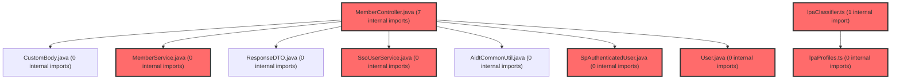

> [!IMPORTANT]
> **⚠️ 수동 검토 권장 (자가힐링 주의)**
>
> AI 자가힐링 결과물이 실제 의도와 다를 수 있으므로, **상세 리뷰 내용에 기반한 수동 점검**을 우선해 주시기 바랍니다. 자가힐링 기능을 활용하실 경우 최종 결과물을 신중하게 확인해 주세요.

# 코드 리뷰 - 2905dfa3

## 코드 복잡도 분석

**분석된 파일**: 49개 / 변경된 파일: 96개

### Import 의존관계 다이어그램

**범례**: 중심 파일 (변경됨) | 많은 import (10개 이상)

### 정상 범위 (NONE)

**`refreshtokenmapper.xml`** (other)

- 평균 복잡도: **0.469**

- 최대 복잡도: 0.469

- 청크 수: 1개

- 평균 사용처: 14.0곳

**권장사항:**

- 복잡도 정상 범위

**`jwtauthenticationfilter.java`** (config)

- 평균 복잡도: **0.467**

- 최대 복잡도: 0.467

- 청크 수: 1개

- 평균 사용처: 55.0곳

**권장사항:**

- Config 파일은 높은 연결도가 정상적임

**`refreshtoken.java`** (other)

- 평균 복잡도: **0.467**

- 최대 복잡도: 0.467

- 청크 수: 1개

- 평균 사용처: 13.0곳

**권장사항:**

- 복잡도 정상 범위

**`jwtutil.java`** (utility)

- 평균 복잡도: **0.465**

- 최대 복잡도: 0.468

- 청크 수: 5개

- 평균 사용처: 67.4곳

**권장사항:**

- 복잡도 정상 범위

**`refreshtokenmapper.java`** (other)

- 평균 복잡도: **0.462**

- 최대 복잡도: 0.463

- 청크 수: 4개

- 평균 사용처: 46.5곳

**권장사항:**

- 복잡도 정상 범위

**`membercontroller.java`** (other)

- 평균 복잡도: **0.391**

- 최대 복잡도: 0.470

- 청크 수: 6개

- 평균 사용처: 53.7곳

**권장사항:**

- 복잡도 정상 범위

**`memberservice.java`** (other)

- 평균 복잡도: **0.381**

- 최대 복잡도: 0.468

- 청크 수: 11개

- 평균 사용처: 73.5곳

**권장사항:**

- 복잡도 정상 범위

**`dgnssmapper.xml`** (other)

- 평균 복잡도: **0.243**

- 최대 복잡도: 0.474

- 청크 수: 2개

- 평균 사용처: 7.0곳

**권장사항:**

- 복잡도 정상 범위

**`groupquerymapper.xml`** (other)

- 평균 복잡도: **0.239**

- 최대 복잡도: 0.471

- 청크 수: 2개

- 평균 사용처: 7.0곳

**권장사항:**

- 복잡도 정상 범위

**`usermapper.xml`** (other)

- 평균 복잡도: **0.238**

- 최대 복잡도: 0.469

- 청크 수: 2개

- 평균 사용처: 7.0곳

**권장사항:**

- 복잡도 정상 범위

**`user.java`** (other)

- 평균 복잡도: **0.233**

- 최대 복잡도: 0.464

- 청크 수: 6개

- 평균 사용처: 42.3곳

**권장사항:**

- 복잡도 정상 범위

**`dgnssmapper.java`** (other)

- 평균 복잡도: **0.223**

- 최대 복잡도: 0.466

- 청크 수: 167개

- 평균 사용처: 33.2곳

**권장사항:**

- 파일 크기가 큼 (167개 청크) - 파일 분리 검토

**`securityconfig.java`** (config)

- 평균 복잡도: **0.215**

- 최대 복잡도: 0.464

- 청크 수: 13개

- 평균 사용처: 24.2곳

**권장사항:**

- Config 파일은 높은 연결도가 정상적임

**`usermapper.java`** (other)

- 평균 복잡도: **0.210**

- 최대 복잡도: 0.463

- 청크 수: 11개

- 평균 사용처: 17.9곳

**권장사항:**

- 복잡도 정상 범위

**`admincontroller.java`** (other)

- 평균 복잡도: **0.205**

- 최대 복잡도: 0.470

- 청크 수: 30개

- 평균 사용처: 13.4곳

**권장사항:**

- 파일 크기가 큼 (30개 청크) - 파일 분리 검토

**`adminuserservice.java`** (other)

- 평균 복잡도: **0.203**

- 최대 복잡도: 0.472

- 청크 수: 37개

- 평균 사용처: 17.3곳

**권장사항:**

- 파일 크기가 큼 (37개 청크) - 파일 분리 검토

**`loginpage.tsx`** (component)

- 평균 복잡도: **0.198**

- 최대 복잡도: 0.465

- 청크 수: 49개

- 평균 사용처: 15.6곳

**권장사항:**

- 파일 크기가 큼 (49개 청크) - 파일 분리 검토

**`groupservice.java`** (other)

- 평균 복잡도: **0.191**

- 최대 복잡도: 0.471

- 청크 수: 5개

- 평균 사용처: 15.0곳

**권장사항:**

- 복잡도 정상 범위

**`main.tsx`** (other)

- 평균 복잡도: **0.173**

- 최대 복잡도: 0.461

- 청크 수: 8개

- 평균 사용처: 14.4곳

**권장사항:**

- 복잡도 정상 범위

**`fileservice.java`** (other)

- 평균 복잡도: **0.172**

- 최대 복잡도: 0.468

- 청크 수: 11개

- 평균 사용처: 31.9곳

**권장사항:**

- 복잡도 정상 범위

**`adminuserdetailsservice.java`** (other)

- 평균 복잡도: **0.161**

- 최대 복잡도: 0.471

- 청크 수: 3개

- 평균 사용처: 15.3곳

**권장사항:**

- 복잡도 정상 범위

**`securityutil.java`** (utility)

- 평균 복잡도: **0.158**

- 최대 복잡도: 0.476

- 청크 수: 9개

- 평균 사용처: 17.3곳

**권장사항:**

- 복잡도 정상 범위

**`dgnssservice.java`** (other)

- 평균 복잡도: **0.152**

- 최대 복잡도: 0.473

- 청크 수: 50개

- 평균 사용처: 17.6곳

**권장사항:**

- 파일 크기가 큼 (50개 청크) - 파일 분리 검토

**`groupquerymapper.java`** (other)

- 평균 복잡도: **0.144**

- 최대 복잡도: 0.461

- 청크 수: 16개

- 평균 사용처: 11.2곳

**권장사항:**

- 복잡도 정상 범위

**`client.ts`** (other)

- 평균 복잡도: **0.087**

- 최대 복잡도: 0.473

- 청크 수: 31개

- 평균 사용처: 3.0곳

**권장사항:**

- 파일 크기가 큼 (31개 청크) - 파일 분리 검토

**`routes.tsx`** (other)

- 평균 복잡도: **0.083**

- 최대 복잡도: 0.463

- 청크 수: 15개

- 평균 사용처: 3.7곳

**권장사항:**

- 복잡도 정상 범위

**`userprofilecontroller.java`** (other)

- 평균 복잡도: **0.009**

- 최대 복잡도: 0.009

- 청크 수: 1개

**권장사항:**

- 복잡도 정상 범위

**`adminaccountmapper.xml`** (other)

- 평균 복잡도: **0.008**

- 최대 복잡도: 0.008

- 청크 수: 1개

**권장사항:**

- 복잡도 정상 범위

**`spauthenticateduser.java`** (other)

- 평균 복잡도: **0.007**

- 최대 복잡도: 0.007

- 청크 수: 1개

**권장사항:**

- 복잡도 정상 범위

**`guestauthservice.java`** (other)

- 평균 복잡도: **0.006**

- 최대 복잡도: 0.006

- 청크 수: 1개

**권장사항:**

- 복잡도 정상 범위

**`spauthproperties.java`** (config)

- 평균 복잡도: **0.006**

- 최대 복잡도: 0.006

- 청크 수: 1개

**권장사항:**

- Config 파일은 높은 연결도가 정상적임

**`adminaccount.java`** (other)

- 평균 복잡도: **0.006**

- 최대 복잡도: 0.006

- 청크 수: 1개

**권장사항:**

- 복잡도 정상 범위

**`ssouserservice.java`** (other)

- 평균 복잡도: **0.004**

- 최대 복잡도: 0.004

- 청크 수: 1개

**권장사항:**

- 복잡도 정상 범위

**`spusermappingfilter.java`** (config)

- 평균 복잡도: **0.004**

- 최대 복잡도: 0.004

- 청크 수: 1개

**권장사항:**

- Config 파일은 높은 연결도가 정상적임

**`examservice.ts`** (other)

- 평균 복잡도: **0.004**

- 최대 복잡도: 0.012

- 청크 수: 39개

**권장사항:**

- 파일 크기가 큼 (39개 청크) - 파일 분리 검토

**`authclient.ts`** (utility)

- 평균 복잡도: **0.004**

- 최대 복잡도: 0.008

- 청크 수: 10개

**권장사항:**

- 복잡도 정상 범위

**`authproxycontroller.java`** (other)

- 평균 복잡도: **0.003**

- 최대 복잡도: 0.005

- 청크 수: 4개

**권장사항:**

- 복잡도 정상 범위

**`authcontext.tsx`** (other)

- 평균 복잡도: **0.003**

- 최대 복잡도: 0.012

- 청크 수: 15개

**권장사항:**

- 복잡도 정상 범위

**`dashboardservice.ts`** (other)

- 평균 복잡도: **0.003**

- 최대 복잡도: 0.011

- 청크 수: 46개

**권장사항:**

- 파일 크기가 큼 (46개 청크) - 파일 분리 검토

**`examauthstep.tsx`** (other)

- 평균 복잡도: **0.002**

- 최대 복잡도: 0.010

- 청크 수: 14개

**권장사항:**

- 복잡도 정상 범위

**`exampage.tsx`** (component)

- 평균 복잡도: **0.002**

- 최대 복잡도: 0.013

- 청크 수: 38개

**권장사항:**

- 파일 크기가 큼 (38개 청크) - 파일 분리 검토

**`lpaprofiles.ts`** (other)

- 평균 복잡도: **0.002**

- 최대 복잡도: 0.016

- 청크 수: 35개

**권장사항:**

- 파일 크기가 큼 (35개 청크) - 파일 분리 검토

**`useprofilecheck.ts`** (other)

- 평균 복잡도: **0.002**

- 최대 복잡도: 0.008

- 청크 수: 6개

**권장사항:**

- 복잡도 정상 범위

**`assessmentcodemodal.tsx`** (other)

- 평균 복잡도: **0.001**

- 최대 복잡도: 0.011

- 청크 수: 43개

**권장사항:**

- 파일 크기가 큼 (43개 청크) - 파일 분리 검토

**`joingrouppage.tsx`** (component)

- 평균 복잡도: **0.001**

- 최대 복잡도: 0.016

- 청크 수: 76개

**권장사항:**

- 파일 크기가 큼 (76개 청크) - 파일 분리 검토

**`lpaclassifier.ts`** (utility)

- 평균 복잡도: **0.001**

- 최대 복잡도: 0.006

- 청크 수: 18개

**권장사항:**

- 복잡도 정상 범위

**`adminaccountmapper.java`** (other)

- 평균 복잡도: **0.000**

- 최대 복잡도: 0.001

- 청크 수: 4개

**권장사항:**

- 복잡도 정상 범위

**`joincodemodal.tsx`** (other)

- 평균 복잡도: **0.000**

- 최대 복잡도: 0.014

- 청크 수: 70개

**권장사항:**

- 파일 크기가 큼 (70개 청크) - 파일 분리 검토

**`landingpage.tsx`** (component)

- 평균 복잡도: **0.000**

- 최대 복잡도: 0.002

- 청크 수: 14개

**권장사항:**

- 복잡도 정상 범위

---

## [GOOD] 잘된 점
1. **아키텍처 전환의 체계적 접근**: 기존 자체 인증 시스템에서 SuperPlatform SSO로의 전환을 단계적으로 설계하고 구현했습니다. 문서화가 매우 상세하게 이루어져 팀원들의 이해를 돕습니다.
2. **관심사 분리**: 새로운 `AuthProxyController`를 도입하여 인증 프록시 계층을 분리함으로써, 기존 비즈니스 로직을 최소한으로 변경하면서 SSO 통합을 달성했습니다.
3. **보안 강화**: OAuth2 리소스 서버를 통한 JWT 검증으로 전환하여, 토큰 검증 로직을 전문 인증 서버에 위임하고 보안 표준을 준수했습니다.

## 변경사항 요약
SuperPlatform Auth로의 SSO 인증 전환을 위한 대규모 아키텍처 변경입니다. 주요 변경사항으로는 백엔드 의존성에서 jjwt 제거 및 OAuth2 리소스 서버 추가, 새로운 AuthProxyController 구현, SecurityConfig의 JWT 인증 필터 개편, MemberService의 자체 인증 로직 제거 등이 포함됩니다.

---

## [ISSUE] 개선이 필요한 부분

### Critical (즉시 수정 필요)
없음

### High (우선 수정 권장)
없음

### Medium (개선 권장)
1. **AuthProxyController의 동기적 블로킹 호출**
   - **위치**: `AuthProxyController.java`의 `token()`, `refresh()`, `logout()` 메서드
   - **기존 코드**: `WebClient` 호출 후 `.block()`을 사용하여 동기적으로 결과를 대기
   - **해결 방안**: 비동기적인 `WebClient` 호출을 유지하면서 `Mono`/`Flux`를 반환하거나, `@Async`를 활용하여 성능 저하를 방지

2. **예외 처리의 일관성 부족**
   - **위치**: `AuthProxyController.java`의 `token()` 메서드 (라인 53-60)
   - **기존 코드**: `WebClientResponseException`만 캐치하고 다른 예외는 처리되지 않음
   - **해결 방안**: 더 포괄적인 예외 처리 추가 및 일관된 에러 응답 형식 적용

3. **문서 파일명의 오타**
   - **위치**: `backend/docs/dgnss-migration-progress-note-2026-03-19.md` 첫 번째 라인
   - **기존 코드**: `ㅕㄴ되냐# DGNSS 마이그레이션 진행 메모`
   - **해결 방안**: `# DGNSS 마이그레이션 진행 메모`로 수정

---

## 주요 파일 분석

### backend/build.gradle
**변경 내용:**
jjwt 의존성 제거 및 OAuth2 리소스 서버 의존성 추가로 JWT 검증 방식을 전환

**개선 제안:**
1. **의존성 버전 명시성 강화**
   - **위치**: OAuth2 리소스 서버 의존성 주변
   - **기존 코드**: `implementation 'org.springframework.boot:spring-boot-starter-oauth2-resource-server'`
   - **해결 방안**: 버전을 명시하거나 Spring Boot BOM을 활용하여 버전 일관성 유지

### backend/src/main/java/com/vs/meta/api/sso/controller/AuthProxyController.java
**변경 내용:**
SuperPlatform Auth 서버와의 통신을 중계하는 프록시 컨트롤러 신규 구현

**개선 제안:**
1. **상수화된 문자열 리터럴**
   - **위치**: `RT_COOKIE_MAX_AGE_FALLBACK` 상수 선언 아래
   - **기존 코드**: 하드코딩된 문자열 값들 (예: "grant_type", "code", "client_id")
   - **해결 방안**: 상수 클래스 또는 `SpAuthProperties`에 정의하여 중복 방지 및 유지보수성 향상

2. **로그 상세화**
   - **위치**: 예외 처리 블록 내의 로그 구문
   - **기존 코드**: `log.warn("토큰 교환 실패: {}", e.getStatusCode());`
   - **해결 방안**: 실패 원인을 포함한 상세 로그 추가: `log.warn("토큰 교환 실패: status={}, body={}", e.getStatusCode(), e.getResponseBodyAsString());`

### backend/src/main/java/com/vs/meta/common/config/SecurityConfig.java
**변경 내용:**
기존 `JwtAuthenticationFilter` 제거 및 OAuth2 리소스 서버 구성으로 교체

**개선 제안:**
1. **설정 속성 외부화**
   - **위치**: `JwtAuthenticationConverter` 내의 하드코딩된 클레임 매핑
   - **기존 코드**: `"publicUserId"`와 같은 문자열 리터럴 직접 사용
   - **해결 방안**: `application.yml` 또는 별도 설정 클래스에서 관리 가능하도록 외부화

---

## 최종 평가

**결론**: 
- [x] [OK] **승인 (Approved)** - Critical/High 이슈 없음

**종합 의견:**
이 커밋은 기존 인증 시스템을 SuperPlatform SSO로 전환하는 대규모 아키텍처 변경을 잘 수행했습니다. 문서화가 매우 상세하게 이루어져 팀원들의 이해를 돕고, 프록시 계층을 도입하여 기존 비즈니스 로직과의 결합도를 낮춘 점이 우수합니다. 몇 가지 코드 품질 향상을 위한 사소한 제안이 있으나, 전체적으로 안정적이고 실무에 바로 적용 가능한 수준입니다.