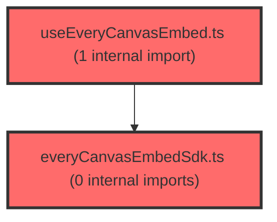

> [!IMPORTANT]
> **⚠️ 수동 검토 권장 (자가힐링 주의)**
>
> AI 자가힐링 결과물이 실제 의도와 다를 수 있으므로, **상세 리뷰 내용에 기반한 수동 점검**을 우선해 주시기 바랍니다. 자가힐링 기능을 활용하실 경우 최종 결과물을 신중하게 확인해 주세요.

# 코드 리뷰 - 2d281d4f

## 코드 복잡도 분석

**분석된 파일**: 3개 / 변경된 파일: 6개


### Import 의존관계 다이어그램



**범례**: 중심 파일 (변경됨) | 많은 import (10개 이상)


### 정상 범위 (NONE)


**`env.ts`** (config)

- 평균 복잡도: **0.006**

- 최대 복잡도: 0.006

- 청크 수: 1개


**권장사항:**

- Config 파일은 높은 연결도가 정상적임


**`everycanvasembedsdk.ts`** (utility)

- 평균 복잡도: **0.002**

- 최대 복잡도: 0.006

- 청크 수: 13개


**권장사항:**

- 복잡도 정상 범위


**`useeverycanvasembed.ts`** (utility)

- 평균 복잡도: **0.001**

- 최대 복잡도: 0.004

- 청크 수: 10개


**권장사항:**

- 복잡도 정상 범위


---


## 변경 배경

이 커밋은 테스트 환경의 도메인을 `vschool.at`에서 `allvia.org`로 전환하고, EveryCanvas Embed SDK 통합 시 `brandId` 파라미터를 추가하는 변경입니다.

- **목적**: 테스트 환경 도메인 일원화(`vschool.at` → `allvia.org`) 및 EveryCanvas SDK에 브랜드 식별자(`brandId`) 전달
- **도메인**: 인프라(환경 설정) + 프론트엔드 UI (EveryCanvas LMS embed 통합)
- **변경 방향**: 환경별 도메인 설정을 최신 인프라에 맞게 갱신하고, SDK 계약에 필요한 `brandId`를 명시적으로 전달

## [GOOD] 잘된 점

1. **환경 설정 변경의 일관성**: `application-vs-dev.yml`, `.env.development`, `env.ts` 세 파일 모두에서 `vschool.at` → `allvia.org` 도메인 전환이 일관되게 적용되었습니다. 백엔드와 프론트엔드가 동일한 도메인 정책을 따르도록 한 점이 좋습니다.

2. **`brandId`의 명시적 전달**: `CreateEmbedOptions`에 `brandId: number`를 필수 필드로 추가하고, `useEveryCanvasEmbed` 훅에서 기본값(`21`)을 제공하면서도 호출부에서 오버라이드할 수 있도록 설계했습니다. `brandIdRef`를 사용하여 최신 값을 유지하는 패턴은 기존 `optionsRef`, `handlersRef` 패턴과 일관됩니다.

3. **기존 패턴 준수**: `brandId`를 `useRef`로 관리하고 `useEffect`에서 최신 값을 동기화하는 방식은 이미 `options`, `handlers`, `setId` 등에서 사용하던 기존 패턴을 그대로 따르고 있어 일관성이 유지됩니다.

## 변경사항 요약

- 백엔드(`application-vs-dev.yml`)와 프론트엔드(`.env.development`, `env.ts`)의 테스트 환경 도메인을 `vschool.at` → `allvia.org`로 전환
- `everyCanvasEmbedSdk.ts`의 `CreateEmbedOptions`에 `brandId: number` 필수 필드 추가
- `useEveryCanvasEmbed.ts`에 `brandId` 파라미터(기본값 `21`) 및 `brandIdRef` 추가, `createEmbed` 호출 시 `brandId` 전달
- 이전 커밋(b57ce04c)에 대한 리뷰 파일(`reviews/REVIEW_b57ce04c.md`) 추가

---

## [ISSUE] 개선이 필요한 부분

### Critical (즉시 수정 필요)

없음

### High (우선 수정 권장)

없음

### Medium (개선 권장)

1. **`brandId` 기본값의 하드코딩** (`useEveryCanvasEmbed.ts` 라인 50)

   `brandId = 21`이 훅 내부에 하드코딩된 기본값으로 설정되어 있습니다. 이 값이 특정 브랜드를 의미한다면, 환경 변수(`import.meta.env`)나 상수 파일로 분리하는 것이 좋습니다. 특히 `everyCanvasEmbedSdk.ts`의 `CreateEmbedOptions`에서 `brandId`가 **필수 필드**로 선언되어 있음에도 훅에서 기본값을 제공하는 것은, 호출부에서 `brandId`를 누락해도 컴파일 에러가 발생하지 않아 필수 값임이 희석될 수 있습니다.

   **제안**: `brandId`를 `CreateEmbedOptions`에서 선택적(`brandId?: number`)으로 변경하거나, 훅의 기본값을 환경 변수 기반으로 변경하는 것을 고려하세요.

2. **`brandId`가 `options`에 포함된 경우의 동작** (`useEveryCanvasEmbed.ts` 라인 90-93)

   `createEmbed` 호출 시 `...optionsRef.current` 뒤에 `brandId: brandIdRef.current`를 스프레드하여, `options`에 `brandId`가 포함되어 있어도 항상 훅의 `brandId` 값으로 덮어씁니다. 이는 의도된 동작일 수 있지만, `options`에 `brandId`를 전달하는 호출부가 있다면 혼란을 줄 수 있습니다. `options`에서 `brandId`를 제거하고 훅 파라미터로만 받도록 명확히 하는 것이 좋습니다.

   ```typescript
   // 현재: options에 brandId가 있어도 무시됨
   handle = createEmbed(containerRef.current, {
     ...optionsRef.current,  // brandId가 여기 포함되어 있어도
     brandId: brandIdRef.current,  // 이 값으로 덮어씀
     getSsoToken: () => optionsRef.current.getSsoToken?.() ?? Promise.resolve(''),
   });
   ```

   **제안**: `CreateEmbedOptions`에서 `brandId`를 제거하고, `createEmbed` 호출 시 별도 파라미터로 전달하거나, 훅에서 `options`에서 `brandId`를 제거한 후 전달하는 방식으로 명확히 분리하세요.

---

## 주요 파일 분석

### frontend/src/features/lesson/lib/everyCanvasEmbedSdk.ts

**변경 내용:**
`CreateEmbedOptions` 타입에 `brandId: number` 필수 필드를 추가했습니다.

**분석:**
`brandId`가 필수 필드로 선언되어 있어, 이 타입을 사용하는 모든 호출부에서 `brandId`를 전달해야 합니다. 현재 `useEveryCanvasEmbed` 훅에서 기본값 `21`을 제공하므로 호출부에서 누락해도 컴파일 에러는 발생하지 않지만, 타입상으로는 필수이므로 일관성이 다소 어긋납니다.

### frontend/src/features/lesson/lib/useEveryCanvasEmbed.ts

**변경 내용:**
`brandId` 파라미터(기본값 `21`)와 `brandIdRef`를 추가하고, `createEmbed` 호출 시 `brandId`를 전달하도록 변경했습니다.

**분석:**
`brandIdRef`를 사용하여 최신 값을 유지하는 패턴은 기존 `optionsRef`, `handlersRef`와 동일합니다. `useEffect`에서 매 렌더링마다 `brandIdRef.current`를 갱신하므로, `brandId`가 변경되어도 ref가 최신 값을 유지합니다. 다만 `identity` 배열에 `brandId`가 포함되어 있지 않으므로, `brandId`가 변경되어도 embed가 재생성되지 않습니다. 이는 의도된 동작일 수 있지만, `brandId`가 변경되어야 하는 상황이 있다면 `identity`에 포함하는 것을 고려해야 합니다.

### backend/src/main/resources/application-vs-dev.yml, frontend/.env.development, frontend/src/shared/config/env.ts

**변경 내용:**
테스트 환경 도메인을 `vschool.at` → `allvia.org`로 일괄 전환했습니다.

**분석:**
도메인 전환은 환경 설정 변경으로, 코드 로직에는 영향이 없습니다. 다만 `frontend/.env.development`에서 `VITE_AGENT_API_URL=https://t-meta-agent-api.vsaidt.com`과 `VITE_CHAT_API_URL=https://t-dj.vsaidt.com`은 여전히 `vschool.at`이 아닌 `vsidt.com` 도메인을 사용하고 있습니다. 이는 의도된 것인지 확인이 필요합니다. `vschool.at` → `allvia.org` 전환 대상에서 `vsidt.com` 도메인이 제외된 것인지, 아니면 누락된 것인지 검토가 필요합니다.

---

## 최종 평가

**결론**: 
- [ ] [OK] **승인 (Approved)** - Critical/High 이슈 없음
- [x] [WARN] **조건부 승인 (Approved with Comments)** - Medium 이하 이슈만 존재
- [ ] [FIX] **수정 필요 (Changes Requested)** - Critical/High 이슈 존재

**종합 의견:**

도메인 전환과 `brandId` 추가가 기존 패턴을 잘 따르며 안정적으로 구현되었습니다. `brandId`의 기본값 하드코딩과 `options` 내 `brandId` 중복 가능성은 개선 여지가 있지만, 현재 동작에는 문제가 없습니다. `vsidt.com` 도메인이 전환 대상에서 제외된 것이 의도된 것인지 확인 후, `brandId`의 기본값을 환경 변수로 분리하는 것을 권장합니다. 전반적으로 승인 가능한 수준의 변경입니다.