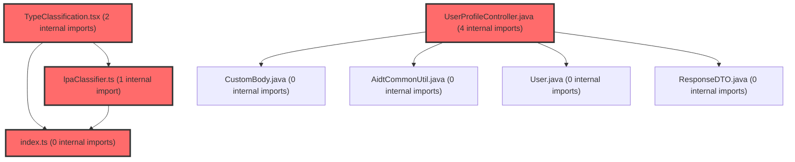

> [!IMPORTANT]
> **⚠️ 수동 검토 권장 (자가힐링 주의)**
>
> AI 자가힐링 결과물이 실제 의도와 다를 수 있으므로, **상세 리뷰 내용에 기반한 수동 점검**을 우선해 주시기 바랍니다. 자가힐링 기능을 활용하실 경우 최종 결과물을 신중하게 확인해 주세요.

# 코드 리뷰 - 2da4e120

## 코드 복잡도 분석

**분석된 파일**: 29개 / 변경된 파일: 40개


### Import 의존관계 다이어그램



**범례**: 중심 파일 (변경됨) | 많은 import (10개 이상)


### 정상 범위 (NONE)


**`corsconfig.java`** (config)

- 평균 복잡도: **0.268**

- 최대 복잡도: 0.471

- 청크 수: 7개

- 평균 사용처: 13.4곳


**권장사항:**

- Config 파일은 높은 연결도가 정상적임


**`dgnssmapper.xml`** (other)

- 평균 복잡도: **0.243**

- 최대 복잡도: 0.474

- 청크 수: 2개

- 평균 사용처: 7.0곳


**권장사항:**

- 복잡도 정상 범위


**`securityconfig.java`** (config)

- 평균 복잡도: **0.215**

- 최대 복잡도: 0.464

- 청크 수: 13개

- 평균 사용처: 24.2곳


**권장사항:**

- Config 파일은 높은 연결도가 정상적임


**`pdfservice.java`** (other)

- 평균 복잡도: **0.213**

- 최대 복잡도: 0.468

- 청크 수: 11개

- 평균 사용처: 33.8곳


**권장사항:**

- 복잡도 정상 범위


**`main.tsx`** (other)

- 평균 복잡도: **0.173**

- 최대 복잡도: 0.461

- 청크 수: 8개

- 평균 사용처: 14.4곳


**권장사항:**

- 복잡도 정상 범위


**`dgnssservice.java`** (other)

- 평균 복잡도: **0.111**

- 최대 복잡도: 0.473

- 청크 수: 69개

- 평균 사용처: 12.8곳


**권장사항:**

- 파일 크기가 큼 (69개 청크) - 파일 분리 검토


**`fileservice.java`** (other)

- 평균 복잡도: **0.107**

- 최대 복잡도: 0.468

- 청크 수: 18개

- 평균 사용처: 19.5곳


**권장사항:**

- 복잡도 정상 범위


**`apiresponseaspect.java`** (other)

- 평균 복잡도: **0.097**

- 최대 복잡도: 0.467

- 청크 수: 5개

- 평균 사용처: 11.8곳


**권장사항:**

- 복잡도 정상 범위


**`routes.tsx`** (other)

- 평균 복잡도: **0.078**

- 최대 복잡도: 0.463

- 청크 수: 16개

- 평균 사용처: 3.5곳


**권장사항:**

- 복잡도 정상 범위


**`index.ts`** (component)

- 평균 복잡도: **0.034**

- 최대 복잡도: 0.461

- 청크 수: 27개

- 평균 사용처: 2.3곳


**권장사항:**

- 파일 크기가 큼 (27개 청크) - 파일 분리 검토


**`userprofilecontroller.java`** (other)

- 평균 복잡도: **0.011**

- 최대 복잡도: 0.011

- 청크 수: 1개


**권장사항:**

- 복잡도 정상 범위


**`authproxycontrollerdpoptest.java`** (other)

- 평균 복잡도: **0.007**

- 최대 복잡도: 0.009

- 청크 수: 6개


**권장사항:**

- 복잡도 정상 범위


**`useprofilecheck.ts`** (other)

- 평균 복잡도: **0.004**

- 최대 복잡도: 0.012

- 청크 수: 8개


**권장사항:**

- 복잡도 정상 범위


**`authclient.ts`** (utility)

- 평균 복잡도: **0.004**

- 최대 복잡도: 0.009

- 청크 수: 10개


**권장사항:**

- 복잡도 정상 범위


**`authproxycontroller.java`** (other)

- 평균 복잡도: **0.003**

- 최대 복잡도: 0.005

- 청크 수: 4개


**권장사항:**

- 복잡도 정상 범위


**`dashboardservice.ts`** (other)

- 평균 복잡도: **0.003**

- 최대 복잡도: 0.009

- 청크 수: 60개


**권장사항:**

- 파일 크기가 큼 (60개 청크) - 파일 분리 검토


**`pdfdownloadservice.ts`** (other)

- 평균 복잡도: **0.003**

- 최대 복잡도: 0.009

- 청크 수: 18개


**권장사항:**

- 복잡도 정상 범위


**`index.ts`** (other)

- 평균 복잡도: **0.003**

- 최대 복잡도: 0.011

- 청크 수: 94개


**권장사항:**

- 파일 크기가 큼 (94개 청크) - 파일 분리 검토


**`useapidata.ts`** (other)

- 평균 복잡도: **0.002**

- 최대 복잡도: 0.010

- 청크 수: 58개


**권장사항:**

- 파일 크기가 큼 (58개 청크) - 파일 분리 검토


**`lpaclassifier.ts`** (utility)

- 평균 복잡도: **0.002**

- 최대 복잡도: 0.006

- 청크 수: 18개


**권장사항:**

- 복잡도 정상 범위


**`typeclassification.tsx`** (other)

- 평균 복잡도: **0.001**

- 최대 복잡도: 0.006

- 청크 수: 47개


**권장사항:**

- 파일 크기가 큼 (47개 청크) - 파일 분리 검토


**`selfregcomparisonsection.tsx`** (other)

- 평균 복잡도: **0.001**

- 최대 복잡도: 0.007

- 청크 수: 93개


**권장사항:**

- 파일 크기가 큼 (93개 청크) - 파일 분리 검토


**`selfregstudentdashboardpage.tsx`** (component)

- 평균 복잡도: **0.001**

- 최대 복잡도: 0.011

- 청크 수: 90개


**권장사항:**

- 파일 크기가 큼 (90개 청크) - 파일 분리 검토


**`studentdashboardpage.tsx`** (component)

- 평균 복잡도: **0.001**

- 최대 복잡도: 0.008

- 청크 수: 50개


**권장사항:**

- 파일 크기가 큼 (50개 청크) - 파일 분리 검토


**`classdashboardv2widget.tsx`** (other)

- 평균 복잡도: **0.001**

- 최대 복잡도: 0.006

- 청크 수: 162개


**권장사항:**

- 파일 크기가 큼 (162개 청크) - 파일 분리 검토


**`classdashboardwidget.tsx`** (other)

- 평균 복잡도: **0.001**

- 최대 복잡도: 0.009

- 청크 수: 131개


**권장사항:**

- 파일 크기가 큼 (131개 청크) - 파일 분리 검토


**`comparisonsection.tsx`** (other)

- 평균 복잡도: **0.001**

- 최대 복잡도: 0.012

- 청크 수: 99개


**권장사항:**

- 파일 크기가 큼 (99개 청크) - 파일 분리 검토


**`coachingstrategy.tsx`** (other)

- 평균 복잡도: **0.000**

- 최대 복잡도: 0.008

- 청크 수: 73개


**권장사항:**

- 파일 크기가 큼 (73개 청크) - 파일 분리 검토


**`selfregclassdashboardwidget.tsx`** (other)

- 평균 복잡도: **0.000**

- 최대 복잡도: 0.007

- 청크 수: 111개


**권장사항:**

- 파일 크기가 큼 (111개 청크) - 파일 분리 검토


---


## 변경 배경

이 커밋은 4가지 독립적인 작업을 포함합니다:

1. **PDF file_url 데이터 정합성 확보**: 업로드 실패 시 잘못된 URL이 DB에 영구 저장되는 문제 방어
2. **쿠키리스 + DPoP 인증 전환**: SameSite 쿠키 문제 회피를 위한 BFF 헤더 패스스루
3. **complete-profile API 폐기**: 레거시 API 및 관련 FE 라우트/보안 설정 일괄 제거
4. **CI/CD 파이프라인 개선**: dev/prod Dockerfile 분리, .env.development 커밋 허용, SSO endpoint vschool.at 이전

- **도메인**: 비즈니스 로직(PDF), 인증/보안(SSO/DPoP), 인프라(CI/CD, CORS), UI(FE 라우팅)
- **변경 방향**: 방어적 코딩 도입, BFF의 헤더 투명 전달, 레거시 제거, 환경 분리

---

## [GOOD] 잘된 점

### 1. PDF file_url 방어 로직(isStorableFileUrl) — 구체적인 실패 케이스 커버

`DgnssService.java`에 추가된 `isStorableFileUrl` 메서드는 업로드 실패 시 비정상 URL이 DB에 영구 저장되는 것을 방지합니다. 특히 다음과 같은 실제 운영 케이스를 구체적으로 커버하고 있습니다:

- **컬럼 길이 초과**(varchar 200): 잘린 값이 저장되는 것을 방지
- **쿼리스트링 포함**(`?`): 토큰/파라미터가 포함된 URL 차단
- **pfile-download 포함**: 다운로드 API URL이 file_url 컬럼에 오저장되는 것 방지
- **공백/개행 문자 포함**: 비정상 URL 차단
- **`.pdf` 확장자 검증**: PDF가 아닌 파일 경로 저장 방지

```java
private boolean isStorableFileUrl(String url) {
    if (StringUtils.isBlank(url)) return false;
    if (url.length() > 200) return false;
    if (StringUtils.containsAny(url, "?", " ", "\n", "\r", "\t")) return false;
    if (StringUtils.contains(url, "pfile-download")) return false;
    return StringUtils.endsWithIgnoreCase(url, ".pdf");
}
```

### 2. fetchClassTotalReportCached 캐싱 도입 — DB 부하 50% 감소

기존 코드는 `selectClassTotalReport(dgnssId)`를 평균 루프와 LPA 루프에서 각각 호출하여 동일 dgnssId에 대해 2회씩 중복 조회했습니다. 캐시 도입으로 이 중복이 제거되었습니다.

```java
// 캐시 선언 (루프 진입 전 1회)
Map<Integer, List<Map<String, Object>>> classTotalReportCache = new HashMap<>();
Map<Integer, String> classTotalReportNotExistsUsed = new HashMap<>();

// 평균 루프 — 캐시 사용
List<Map<String, Object>> claInfoList =
    fetchClassTotalReportCached(dgnssId, classTotalReportCache, classTotalReportNotExistsUsed);

// LPA 루프 — 동일 캐시 사용 (복사본으로 변형)
List<Map<String, Object>> cachedRows =
    fetchClassTotalReportCached(dgnssId, classTotalReportCache, classTotalReportNotExistsUsed);
List<Map<String, Object>> lpaRows = new ArrayList<>(cachedRows); // 원본 오염 방지
```

호출 측에서 `new ArrayList<>(cachedRows)`로 복사본을 만들어 변형하는 설계도 적절합니다. 캐시 원본이 오염되지 않아 평균 루프의 읽기 전용 동작이 안전하게 보호됩니다.

### 3. DPoP 헤더 패스스루 — 조건부 처리로 하위 호환성 유지

`AuthProxyController.java`의 `token()`과 `refresh()` 메서드에서 인바운드 DPoP 헤더를 Auth 서버 호출에 전달하도록 변경되었습니다. `if (dpop != null && !dpop.isBlank())` 조건으로 null-safe하게 처리하고, 헤더가 없을 때는 추가하지 않아 기존 클라이언트와의 하위 호환성이 유지됩니다.

```java
var dpop = request.getHeader("DPoP");
// ...
.headers(h -> { if (dpop != null && !dpop.isBlank()) h.set("DPoP", dpop); })
```

### 4. Content-Disposition CORS 노출 — FE 파일명 읽기 문제 해결

`CorsConfig.java`와 `ApiResponseAspect.java` 양쪽에서 `Content-Disposition`을 exposedHeaders에 추가하여, 크로스 오리진 환경에서 FE가 `Content-Disposition` 헤더를 읽을 수 있도록 했습니다. 이로 인해 파일 다운로드 시 FE가 서버에서 지정한 파일명을 정확히 사용할 수 있게 되었습니다.

```java
// CorsConfig.java
config.setExposedHeaders(List.of("Content-Disposition", "X-Response-Hash", "X-Response-Time"));

// ApiResponseAspect.java
response.setHeader("Access-Control-Expose-Headers",
    "X-Response-Hash, X-Response-Time, Content-Disposition");
```

### 5. stripUploadUuidSuffix — 저장소와 사용자 노출 파일명 분리

`FileService.java`에 추가된 `stripUploadUuidSuffix` 메서드는 저장소에서는 UUID 접미사로 중복을 방지하면서, 다운로드 시 사용자에게는 깔끔한 파일명을 노출하는 이중 전략을 구현합니다.

```java
// 저장 파일명: [반]종합학습검사_1차(23d4...defb).zip
// 다운로드 파일명: [반]종합학습검사_1차.zip
private String stripUploadUuidSuffix(String fileName) {
    return fileName.replaceFirst("\\([0-9a-fA-F]{32}\\)(\\.[^.]+)$", "$1");
}
```

정규표현식이 정확히 32자리 hex UUID만 매칭하므로, 우연히 괄호가 포함된 파일명을 잘못 변형할 위험이 없습니다.

---

## 변경사항 요약

| 영역 | 변경 내용 | 영향 |
|------|----------|------|
| PDF file_url | isStorableFileUrl 검증 + uploadPdfToNas 예외 throw | 잘못된 URL DB 저장 방지 |
| DB 캐싱 | fetchClassTotalReportCached 도입 | selectClassTotalReport 중복 호출 제거 |
| DPoP 인증 | AuthProxyController 헤더 패스스루 | SameSite 문제 회피 |
| complete-profile | API/라우트/보안 설정 일괄 제거 | 레거시 코드 정리 |
| CI/CD | Dockerfile.dev 분리, .env.development 커밋 | dev/prod 환경 분리 |
| CORS | Content-Disposition exposedHeaders 추가 | FE 파일명 읽기 가능 |
| 파일명 | stripUploadUuidSuffix, '/' 전각 치환 | 사용자 경험 개선 |
| SSO endpoint | vsaidt.com → vschool.at | 인프라 이전 |

---

## [ISSUE] 개선이 필요한 부분

### Critical (즉시 수정 필요)

**없음**

### High (우선 수정 권장)

#### 1. `isStorableFileUrl`의 공백 문자 차단이 정상 URL까지 차단할 가능성

**파일**: `backend/src/main/java/com/vs/meta/api/dgnss/service/DgnssService.java`
**위치 (라인 번호)**: ~890

**분석**:
```java
if (StringUtils.containsAny(url, "?", " ", "\n", "\r", "\t")) {
    return false;
}
```

`StringUtils.containsAny(CharSequence, char...)` 시그니처로 호출되어, URL에 공백 문자(`" "`)가 포함되면 모두 차단됩니다. NAS 저장 경로나 파일명에 공백이 포함될 가능성이 있습니다. 예를 들어 반 이름에 공백이 포함된 경우 생성되는 PDF 경로에도 공백이 포함될 수 있습니다.

`FileService.createDgnssDownloadAllZip`에서 생성되는 zip 파일명은 `"[" + clsName + "]" + dgnssName + "_" + ordNo + ".zip"` 형태로 공백을 포함하지 않지만, PDF 업로드 경로가 NAS 경로와 파일명 조합으로 생성되므로 공백 가능성을 완전히 배제할 수 없습니다.

**제안**: 운영 환경에서 실제 PDF URL에 공백이 포함된 사례가 있는지 로그를 통해 확인하세요. 만약 공백이 포함된 정상 URL이 존재한다면, 공백 차단 조건을 제거하거나 화이트리스트 방식으로 전환해야 합니다. 현재로서는 **수정 코드 제시 불가 — 문맥 파악 불충분** (실제 NAS 경로 생성 규칙과 URL 패턴을 정확히 파악해야 함).

#### 2. `PdfService.uploadPdfToNas`의 예외 throw로 인해 `isStorableFileUrl`의 null 체크가 중복 방어가 됨

**파일**: `backend/src/main/java/com/vs/meta/api/dgnss/service/PdfService.java` (라인 ~430), `DgnssService.java` (라인 ~810, ~870)

**분석**:
`uploadPdfToNas`에서 업로드 실패 시 `IllegalStateException`을 throw하도록 변경되었습니다.

```java
// PdfService.java
if (url == null || url.isEmpty() || url.get(0) == null || url.get(0).get("url") == null) {
    throw new IllegalStateException("PDF 업로드 실패: 업로드 결과 없음 ...");
}
```

이 예외는 `makeTcPdf`/`makeStPdf`로 전파되어 `isStorableFileUrl` 검증에 도달하기 전에 메서드가 중단됩니다. 따라서 `isStorableFileUrl`의 null/blank 체크(`StringUtils.isBlank(url)`)는 `makeTcPdf`/`makeStPdf` 경로에서는 unreachable 코드가 되었습니다.

다만 `isStorableFileUrl`은 `summaryPdfUpload` 경로에서도 사용됩니다(`createDgnssSummaryByTemplate`는 예외를 throw하지 않을 수 있음). 따라서 완전히 불필요한 것은 아닙니다.

**제안**: `isStorableFileUrl` 메서드 상단에 주석을 추가하여 의도를 명시하세요.

```java
/**
 * 업로드된 PDF 경로(file_url/summary_file_url)로 저장해도 되는 값인지 검증한다.
 * NOTE: makeTcPdf/makeStPdf 경로에서는 PdfService.uploadPdfToNas가 이미
 *       null/empty에 대해 IllegalStateException을 throw하므로 이 메서드의
 *       null/blank 체크는 summaryPdfUpload 경로 방어용이다.
 * ...
 */
```

### Medium (개선 권장)

#### 3. `fetchClassTotalReportCached`의 `notExistsUsedCache` 타입

**파일**: `backend/src/main/java/com/vs/meta/api/dgnss/service/DgnssService.java`
**위치 (라인 번호)**: ~1650, ~1870-1900

**분석**:
```java
Map<Integer, String> classTotalReportNotExistsUsed = new HashMap<>();
```

값이 `"N"`/`"Y"` 문자열인데, 이는 MyBatis 매퍼 파라미터(`notExistsYn`)와의 호환성을 위한 것입니다. `Map<Integer, Boolean>`으로 관리하고 매퍼 호출 시점에만 `"Y"`/`"N"`으로 변환하는 편이 타입 안전성 측면에서 낫습니다.

다만 이는 코드 스타일 선호도에 가깝고 현재 방식도 실용적으로 동작하므로, **수정 불필요 — 현재 방식 유지 권장.**

#### 4. `DgnssMapper.xml` LPA 컬럼 제거와 `enrichLpaTop3` 의존성 확인 완료

**파일**: `backend/src/main/resources/mapper/dgnss/DgnssMapper.xml` (라인 ~2132-2142, ~2509-2519), `DgnssService.java` (라인 ~2531-2540)

**분석**:
`selectClassTotalReport` 쿼리에서 `lpa.probabilities_json` 컬럼이 제거되었습니다. `enrichLpaTop3` 메서드는 `MapUtils.getString(row, "lpaProbabilitiesJson", "")`로 이 값을 읽는데, 쿼리에서 제거되었으므로 항상 빈 문자열(`""`)이 반환됩니다. 이 경우 `putEmptyLpaTop3(row)`를 호출하여 graceful하게 처리되므로 NPE는 발생하지 않습니다.

또한 LPA 루프에서 `row.get("lpaTypeName")`을 직접 읽는 코드가 남아있는데, 이 컬럼도 쿼리에서 제거되어 `null`이 됩니다. 주석에 "FE 미사용이라 응답에서 제외"라고 명시되어 있고, `enrichLpaTop3`가 `lpaTop1TypeName`/`lpaTop2TypeName`/`lpaTop3TypeName`을 채워주므로 FE에 영향은 없습니다. **의도된 변경이며 문제없음.**

---

## 최종 평가

**결론**:
- [ ] [OK] **승인 (Approved)** - Critical/High 이슈 없음
- [x] [WARN] **조건부 승인 (Approved with Comments)** - Medium 이하 이슈만 존재
- [ ] [FIX] **수정 필요 (Changes Requested)** - Critical/High 이슈 존재

**종합 의견:**

전반적으로 방어적 코딩과 아키텍처 개선이 잘 이루어진 커밋입니다. 특히 PDF file_url 데이터 정합성 문제를 다각도로 방어한 점(isStorableFileUrl + uploadPdfToNas 예외 throw + FileService 로그 보강)과, selectClassTotalReport 캐싱으로 DB 부하를 절반으로 줄인 점이 인상적입니다.

High 이슈 2건은 운영 환경 확인 후 결정해도 되는 수준이며, 현재 코드로도 서비스에 치명적인 문제는 없습니다. DPoP 헤더 패스스루와 complete-profile API 제거는 깔끔하게 처리되었고, CORS Content-Disposition 노출과 stripUploadUuidSuffix는 사용자 경험을 개선하는 실용적인 변경입니다.

**핵심 권장사항**: (1) 운영 환경에서 PDF URL에 공백이 포함된 사례가 있는지 로그로 확인 후 `isStorableFileUrl`의 공백 차단 조건을 재검토하세요. (2) `isStorableFileUrl` 메서드에 주석을 추가하여 `uploadPdfToNas`와의 중복 방어 관계를 명시하세요.