> [!IMPORTANT]
> **수동 검토 대상 (자가힐링 주의)**
>
> 이 커밋은 변경 범위가 넓거나 로직의 복잡도가 높아 AI 자가힐링이 완벽하지 않을 수 있습니다.
> 아래 리뷰 내용을 바탕으로 **수동 검토를 우선**하시고, 자가힐링 기능을 사용하실 경우 결과물을 신중히 확인해 주시기 바랍니다.

# 코드 리뷰 결과: 커밋 2f1cc8df

## 코드 복잡도 분석

**분석된 파일**: 24개 / 변경된 파일: 30개


### Import 의존관계 다이어그램

```mermaid
flowchart TD
    F0["SchoolSyncService.java (0 imports)"]
    F1["User.java (0 imports)"]
    F2["AuthSchoolMap.java (0 imports)"]
    F3["GuestExamCard.tsx (1 imports)"]:::center
    F4["GroupInfoMapper.java (0 imports)"]
    F5["GuestExamListPage.tsx (2 imports)"]:::center
    F6["IdGenerator.java (0 imports)"]
    F7["SchoolInfoMapper.java (0 imports)"]
    F8["PageUtil.java (0 imports)"]
    F9["AdminController.java (11 imports)"]:::center
    F10["types.ts (0 imports)"]:::center
    F11["GroupQueryMapper.java (0 imports)"]:::center
    F12["MyExamListPage.tsx (2 imports)"]:::center
    F13["JwtUtil.java (0 imports)"]
    F14["AdminUserService.java (0 imports)"]
    F15["studentExamService.ts (1 imports)"]:::center
    F16["RoleGroup.java (0 imports)"]
    F17["guestExamService.ts (0 imports)"]:::center
    F9 --> F0
    F9 --> F1
    F9 --> F2
    F9 --> F4
    F9 --> F6
    F9 --> F7
    F9 --> F11
    F9 --> F13
    F9 --> F14
    F9 --> F16
    F9 --> F8
    F3 --> F17
    F5 --> F3
    F5 --> F17
    F15 --> F10
    F12 --> F15
    F12 --> F10
    classDef center fill:#ff6b6b,stroke:#333,stroke-width:3px
    classDef high fill:#ffd93d,stroke:#333,stroke-width:2px
```



**범례**: 중심 파일 (변경됨) | 많은 import (10개 이상)


### 모니터링 권장 (LOW)


**`groupquerymapper.java`** (other)

- 평균 복잡도: **0.265**

- 최대 복잡도: 0.518

- 청크 수: 2개

- 평균 사용처: 35.0곳


**권장사항:**

- **모니터링 권장**: 복잡도가 높은 편이지만 영향 범위 제한적


**`admincontroller.java`** (other)

- 평균 복잡도: **0.264**

- 최대 복잡도: 0.519

- 청크 수: 2개

- 평균 사용처: 17.0곳


**권장사항:**

- **모니터링 권장**: 복잡도가 높은 편이지만 영향 범위 제한적


**`groupquerymapper.xml`** (other)

- 평균 복잡도: **0.263**

- 최대 복잡도: 0.517

- 청크 수: 2개

- 평균 사용처: 7.0곳


**권장사항:**

- **모니터링 권장**: 복잡도가 높은 편이지만 영향 범위 제한적


**`loginpage.tsx`** (component)

- 평균 복잡도: **0.131**

- 최대 복잡도: 0.518

- 청크 수: 81개

- 평균 사용처: 14.8곳


**권장사항:**

- **모니터링 권장**: 복잡도가 높은 편이지만 영향 범위 제한적

- 파일 크기가 큼 (81개 청크) - 파일 분리 검토


**`client.ts`** (other)

- 평균 복잡도: **0.121**

- 최대 복잡도: 0.525

- 청크 수: 28개

- 평균 사용처: 5.3곳


**권장사항:**

- **모니터링 권장**: 복잡도가 높은 편이지만 영향 범위 제한적

- 파일 크기가 큼 (28개 청크) - 파일 분리 검토


**`index.ts`** (component)

- 평균 복잡도: **0.035**

- 최대 복잡도: 0.512

- 청크 수: 29개

- 평균 사용처: 4.8곳


**권장사항:**

- **모니터링 권장**: 복잡도가 높은 편이지만 영향 범위 제한적

- 파일 크기가 큼 (29개 청크) - 파일 분리 검토


### 정상 범위 (NONE)


**`vite.config.ts`** (config)

- 평균 복잡도: **0.143**

- 최대 복잡도: 0.393

- 청크 수: 7개

- 평균 사용처: 2.3곳


**권장사항:**

- Config 파일은 높은 연결도가 정상적임


**`types.ts`** (other)

- 평균 복잡도: **0.005**

- 최대 복잡도: 0.008

- 청크 수: 4개


**권장사항:**

- 복잡도 정상 범위


**`studentexamservice.ts`** (other)

- 평균 복잡도: **0.003**

- 최대 복잡도: 0.008

- 청크 수: 12개


**권장사항:**

- 복잡도 정상 범위


**`guestexamservice.ts`** (other)

- 평균 복잡도: **0.002**

- 최대 복잡도: 0.002

- 청크 수: 1개


**권장사항:**

- 복잡도 정상 범위


**`guestexamlistpage.tsx`** (component)

- 평균 복잡도: **0.001**

- 최대 복잡도: 0.008

- 청크 수: 51개


**권장사항:**

- 파일 크기가 큼 (51개 청크) - 파일 분리 검토


**`myexamlistpage.tsx`** (component)

- 평균 복잡도: **0.001**

- 최대 복잡도: 0.014

- 청크 수: 78개


**권장사항:**

- 파일 크기가 큼 (78개 청크) - 파일 분리 검토


**`myresultpage.tsx`** (component)

- 평균 복잡도: **0.001**

- 최대 복잡도: 0.008

- 청크 수: 22개


**권장사항:**

- 파일 크기가 큼 (22개 청크) - 파일 분리 검토


**`index.ts`** (other)

- 평균 복잡도: **0.000**

- 최대 복잡도: 0.000

- 청크 수: 3개


**권장사항:**

- 복잡도 정상 범위


**`guestcompletepage.tsx`** (component)

- 평균 복잡도: **0.000**

- 최대 복잡도: 0.002

- 청크 수: 68개


**권장사항:**

- 파일 크기가 큼 (68개 청크) - 파일 분리 검토


**`guestexamcard.tsx`** (other)

- 평균 복잡도: **0.000**

- 최대 복잡도: 0.013

- 청크 수: 51개


**권장사항:**

- 파일 크기가 큼 (51개 청크) - 파일 분리 검토


**`index.ts`** (other)

- 평균 복잡도: **0.000**

- 최대 복잡도: 0.000

- 청크 수: 4개


**권장사항:**

- 복잡도 정상 범위


**`studentgroupspage.tsx`** (component)

- 평균 복잡도: **0.000**

- 최대 복잡도: 0.014

- 청크 수: 128개


**권장사항:**

- 파일 크기가 큼 (128개 청크) - 파일 분리 검토


**`signuppage.tsx`** (component)

- 평균 복잡도: **0.000**

- 최대 복잡도: 0.010

- 청크 수: 135개


**권장사항:**

- 파일 크기가 큼 (135개 청크) - 파일 분리 검토


**`guestcompletepage.tsx`** (component)

- 평균 복잡도: **0.000**

- 최대 복잡도: 0.000

- 청크 수: 1개


**권장사항:**

- 복잡도 정상 범위


**`guestexamlistpage.tsx`** (component)

- 평균 복잡도: **0.000**

- 최대 복잡도: 0.000

- 청크 수: 1개


**권장사항:**

- 복잡도 정상 범위


**`myexamlistpage.tsx`** (component)

- 평균 복잡도: **0.000**

- 최대 복잡도: 0.000

- 청크 수: 1개


**권장사항:**

- 복잡도 정상 범위


**`myresultpage.tsx`** (component)

- 평균 복잡도: **0.000**

- 최대 복잡도: 0.000

- 청크 수: 1개


**권장사항:**

- 복잡도 정상 범위


**`studentgroupspage.tsx`** (component)

- 평균 복잡도: **0.000**

- 최대 복잡도: 0.000

- 청크 수: 1개


**권장사항:**

- 복잡도 정상 범위


---


## ✅ 최종 결론: 승인 (Approved)

CP님이 요청하신 커밋 `2f1cc8dffa3566d7af46a284c092d162da6162f5`에 대한 코드 리뷰를 완료했습니다. **이 커밋은 승인합니다.** 변경 사항은 로컬 개발환경의 CORS 문제를 효과적으로 해결하며, 코드 품질과 개발자 경험을 향상시킵니다.

---

## 🔍 상세 분석

이 커밋은 로컬 개발 시 발생하는 CORS(Cross-Origin Resource Sharing) 문제를 해결하기 위한 프론트엔드 환경 개선 작업입니다. 세 가지 주요 변경 사항으로 구성되어 있습니다:

### 1. 환경 변수 변경 (.env.development)
```diff
- VITE_API_URL=https://t-meta-api.vsaidt.com
+ VITE_API_URL=/api
```
**변경 목적**: 개발 환경에서 API 요청을 동일 출처(同一起源)로 전환하여 브라우저의 CORS 정책 제한을 회피합니다. 이제 모든 API 호출은 로컬 개발 서버를 통해 프록시 처리됩니다.

### 2. Axios 인터셉터 개선 (client.ts)
```typescript
// 인증 불필요 엔드포인트 (토큰 전송 제외)
const PUBLIC_ENDPOINTS = ['/member/login', '/member/signup', '/member/send-code', '/member/verify-code'];

// 요청 인터셉터 — JWT 자동 주입
axiosInstance.interceptors.request.use((config: InternalAxiosRequestConfig) => {
  const isPublic = PUBLIC_ENDPOINTS.some((ep) => config.url?.includes(ep));
  if (!isPublic) {
    const token = localStorage.getItem('auth_token');
    if (token) {
      config.headers.Authorization = `Bearer ${token}`;
    }
  }
  return config;
});
```
**기능 설명**: 
- `PUBLIC_ENDPOINTS` 배열을 도입하여 인증이 필요 없는 엔드포인트를 명시적으로 관리합니다.
- 로그인, 회원가입 등 인증 전 단계에서는 토큰을 전송하지 않도록 조건부 로직을 추가했습니다.
- 이로써 불필요한 인증 헤더 전송을 방지하고, 초기 인증 플로우의 안정성을 높였습니다.

### 3. Vite 프록시 설정 (vite.config.ts)
```typescript
server: {
  proxy: {
    '/api': {
      target: 'https://t-meta-api.vsaidt.com',
      changeOrigin: true,
      rewrite: (path) => path.replace(/^\/api/, ''),
    },
  },
},
```
**작동 원리**:
1. 개발 서버가 `/api`로 시작하는 모든 요청을 감지합니다.
2. `target`에 지정된 실제 API 서버(`https://t-meta-api.vsaidt.com`)로 요청을 전달합니다.
3. `changeOrigin: true` 옵션으로 호스트 헤더를 변경하여 CORS 문제를 해결합니다.
4. `rewrite` 함수를 통해 요청 경로에서 `/api` 프리픽스를 제거합니다.

---

## 📊 코드 품질 평가

### 발견된 이슈
- **명백한 오류**: 없음
- **베스트 프랙티스 위반**: 없음
- **문법 오류**: 없음

### 기술적 장점
1. **CORS 문제의 근본적 해결**: 프록시 방식을 채택하여 브라우저 보안 정책과의 충돌을 회피했습니다.
2. **개발/운영 환경 분리**: `.env.development` 파일만 수정하여 운영 환경에는 영향을 주지 않습니다.
3. **인증 로직 개선**: 공개 엔드포인트를 명시적으로 관리함으로써 인증 흐름이 더욱 명확해졌습니다.
4. **유지보수성**: 프록시 설정이 중앙 집중화되어 향후 API 서버 변경 시 쉽게 대응할 수 있습니다.

---

## 💡 개선 효과

CP님의 이 커밋을 통해 다음과 같은 개발자 경험 향상을 기대할 수 있습니다:

1. **로컬 개발 효율성 향상**: CORS 관련 설정 없이 즉시 개발을 시작할 수 있습니다.
2. **디버깅 용이성**: 네트워크 탭에서의 요청 추적이 단순화됩니다.
3. **환경 일관성**: 모든 개발자가 동일한 로컬 환경 설정을 사용할 수 있습니다.
4. **보안성 유지**: 실제 API 키나 인증 정보가 프론트엔드 코드에 노출되지 않습니다.

---

## 🎯 정리

이 커밋은 메타 대시보드 프로젝트의 프론트엔드 개발 환경을 현대화하고 실용적으로 개선한 우수한 작업입니다. Vite의 프록시 기능을 적절히 활용하여 CORS 문제를 우아하게 해결했으며, 추가적으로 인증 인터셉터 로직을 보완하여 코드 품질을 한층 높였습니다. 별도의 수정 요청 없이 바로 통합 가능한 수준의 완성도를 보여주고 있습니다.