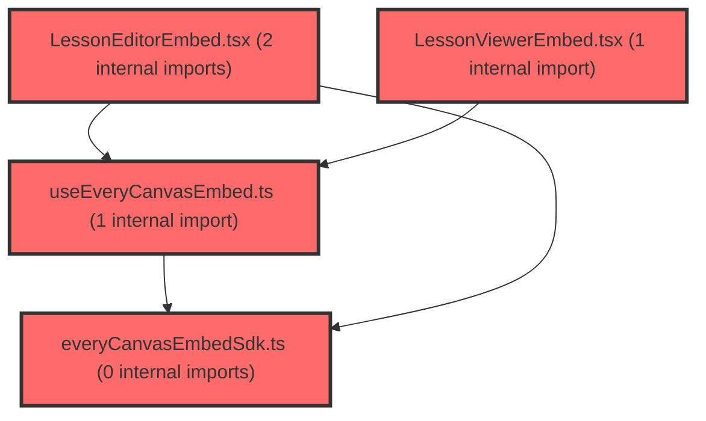

> [!IMPORTANT]
> **⚠️ 수동 검토 권장 (자가힐링 주의)**
>
> AI 자가힐링 결과물이 실제 의도와 다를 수 있으므로, **상세 리뷰 내용에 기반한 수동 점검**을 우선해 주시기 바랍니다. 자가힐링 기능을 활용하실 경우 최종 결과물을 신중하게 확인해 주세요.

# 코드 리뷰 - 3316a53f

## 코드 복잡도 분석

**분석된 파일**: 6개 / 변경된 파일: 6개


### Import 의존관계 다이어그램



**범례**: 중심 파일 (변경됨) | 많은 import (10개 이상)


### 정상 범위 (NONE)


**`routes.tsx`** (other)

- 평균 복잡도: **0.052**

- 최대 복잡도: 0.463

- 청크 수: 24개

- 평균 사용처: 2.3곳


**권장사항:**

- 파일 크기가 큼 (24개 청크) - 파일 분리 검토


**`everycanvasembedsdk.ts`** (utility)

- 평균 복잡도: **0.002**

- 최대 복잡도: 0.005

- 청크 수: 11개


**권장사항:**

- 복잡도 정상 범위


**`lessoneditorembed.tsx`** (other)

- 평균 복잡도: **0.002**

- 최대 복잡도: 0.014

- 청크 수: 13개


**권장사항:**

- 복잡도 정상 범위


**`lessonviewerembed.tsx`** (component)

- 평균 복잡도: **0.002**

- 최대 복잡도: 0.014

- 청크 수: 13개


**권장사항:**

- 복잡도 정상 범위


**`useeverycanvasembed.ts`** (utility)

- 평균 복잡도: **0.001**

- 최대 복잡도: 0.009

- 청크 수: 12개


**권장사항:**

- 복잡도 정상 범위


**`deploypage.tsx`** (component)

- 평균 복잡도: **0.000**

- 최대 복잡도: 0.005

- 청크 수: 178개


**권장사항:**

- 파일 크기가 큼 (178개 청크) - 파일 분리 검토


---


## 변경 배경

이 커밋은 두 가지 작업을 포함합니다. 첫째, **수업 배포(Deploy) 화면의 레이아웃 개편**으로, 배포하기 버튼을 본문 스크롤 영역에서 분리하여 하단 고정 footer로 이동시키고 전반적인 스타일 토큰을 정리했습니다. 둘째, **EveryCanvas Embed 인증 방식 전환**으로, 기존 `fetchEmbedToken`(자사 BE가 발급한 embed token) 기반 인증을 주석 처리하고 `getSsoAccessToken`(v-school SSO AT) 기반으로 통일했습니다. 또한 `/lesson/deploy/:itemId` 라우트를 `TeacherFullscreenLayout`로 감싸 집중형 교사 화면 레이아웃을 적용했습니다.

- **목적**: 배포 화면 UX 개선(하단 고정 배포 버튼) 및 Embed 인증 방식을 SSO 토큰으로 통일
- **도메인**: UI(프론트엔드 레이아웃) + Embed SDK 연동(인증)
- **변경 방향**: 배포 버튼을 footer로 분리해 항상 접근 가능하게 하고, Embed 인증을 `getToken` → `getSsoToken` 중심으로 전환

## [GOOD] 잘된 점

- `useEveryCanvasEmbed`에서 `getToken`/`getSsoToken`을 optional 처리하고 `?? Promise.resolve('')`로 안전하게 기본값을 제공하여, 콜백이 없어도 `createEmbed` 호출이 깨지지 않도록 방어한 점이 견고합니다.
- 배포 버튼을 `DeployFooter`로 분리하고 `flex-shrink: 0`을 적용해, 본문이 길어져도 배포 버튼이 항상 하단에 고정되도록 한 레이아웃 구조가 명확합니다.
- `Page`에 `min-height: calc(100vh)`와 배경색을 지정하고 `Body`에 `overflow: auto`를 적용해 스크롤 영역을 명확히 분리한 점이 좋습니다.

## 변경사항 요약

- `/lesson/deploy/:itemId` 라우트를 `TeacherFullscreenLayout` 하위로 이동
- Embed 인증을 `getToken`(embed token)에서 `getSsoToken`(SSO AT) 중심으로 전환하고, `getToken`/`getSsoToken`을 optional 처리
- DeployPage 레이아웃 개편(배포 버튼 footer 분리, 스타일 토큰 정리)

---

## [ISSUE] 개선이 필요한 부분

### Critical (즉시 수정 필요)

없음

### High (우선 수정 권장)

- **`getToken`을 주석 처리한 채로 남겨둔 것**: `LessonEditorEmbed.tsx`와 `LessonViewerEmbed.tsx`에서 `fetchEmbedToken` import와 `getToken` 콜백을 주석 처리했습니다. 이는 인증 방식 전환의 중간 상태로 보이는데, 주석 처리된 코드가 커밋에 남아 있으면 이후 유지보수 시 혼란을 줍니다. 또한 `getSsoAccessToken`의 주석에 "Viewer에는 전달하지 않는다"고 명시되어 있는데, 이번 변경에서 **Viewer에도 `getSsoToken`을 전달**하도록 바꾼 점이 해당 주석과 모순됩니다. 인증 방식 전환이 의도된 것인지, 임시 디버깅용인지 명확히 해야 합니다.

### Medium (개선 권장)

- **`getToken`/`getSsoToken`의 `Promise.resolve('')` 기본값**: `useEveryCanvasEmbed`에서 콜백이 없을 때 빈 문자열 토큰을 반환하도록 했습니다. 만약 Embed SDK가 빈 토큰으로 인증을 시도하면 불필요한 인증 실패 요청이 발생할 수 있습니다. 콜백이 없을 때는 해당 옵션 자체를 전달하지 않는 편이 더 안전할 수 있습니다.
- **DeployPage의 스타일 토큰 하드코딩**: `gap: 12px`, `padding: 12px 40px`, `margin-bottom: 20px` 등 기존 `theme.spacing` 토큰을 하드코딩된 픽셀 값으로 대체했습니다. 디자인 토큰 시스템을 사용하는 프로젝트에서 일관성을 위해 토큰 사용을 유지하는 편이 좋습니다.

---

## 주요 파일 분석

### frontend/src/features/lesson/ui/LessonViewerEmbed.tsx

**변경 내용:**
`getToken`(fetchEmbedToken)을 주석 처리하고 `getSsoToken: getSsoAccessToken`을 추가했습니다.

**개선 제안:**

1. 주석 처리된 코드를 제거하고 인증 방식을 명확히 하세요.
   - **위치 (라인 번호)**: 4, 51
   - **기존 코드**:
```tsx
// import { fetchEmbedToken } from '../api/embedTokenService';
...
// getToken: () => fetchEmbedToken({ scope: 'viewer', slideId }),
```
   - **해결 방안 (수정 코드)**: 인증 방식 전환이 확정된 경우 주석을 제거하고 `getSsoToken`만 남기세요. 전환이 임시인 경우에는 이 커밋에 포함하지 않는 것이 좋습니다.
   - **참고**: `getSsoAccessToken.ts`의 주석 "Viewer에는 전달하지 않는다"와 현재 Viewer에 `getSsoToken`을 전달하는 코드가 모순되므로, 주석을 함께 갱신해야 합니다.

### frontend/src/features/lesson/lib/useEveryCanvasEmbed.ts

**변경 내용:**
`getToken`/`getSsoToken`을 optional 처리하고 `?? Promise.resolve('')` 기본값을 추가했습니다.

**개선 제안:**

1. 콜백이 없을 때 빈 문자열 대신 옵션 자체를 생략하는 방식을 고려하세요.
   - **위치 (라인 번호)**: 79-80
   - **기존 코드**:
```ts
getToken: () => optionsRef.current.getToken?.() ?? Promise.resolve(''),
getSsoToken: () => optionsRef.current.getSsoToken?.() ?? Promise.resolve(''),
```
   - **해결 방안 (수정 코드)**: 빈 토큰으로 인증 시도가 발생하지 않도록, 콜백 존재 여부에 따라 옵션을 조건부로 구성하는 것이 더 안전합니다. 다만 SDK가 `getToken`/`getSsoToken`을 필수로 요구하는지에 따라 달라질 수 있어, SDK 계약 확인이 필요합니다.

### frontend/src/features/lesson/ui/DeployPage.tsx

**변경 내용:**
배포 버튼을 `DeployFooter`로 분리하고, 전반적인 스타일 토큰을 하드코딩 값으로 정리했습니다.

**개선 제안:**

1. 하드코딩된 픽셀 값을 디자인 토큰으로 복원하는 것을 고려하세요.
   - **위치 (라인 번호)**: SubHeader, Body, Inner 등 다수
   - **기존 코드**:
```ts
gap: 12px;
padding: 12px 40px;
```
   - **해결 방안 (수정 코드)**: `theme.spacing` 토큰을 사용해 디자인 시스템 일관성을 유지하세요. 다만 이는 프로젝트 컨벤션에 따라 선택적입니다.

---

## 최종 평가

**결론**:
- [ ] [OK] **승인 (Approved)** - Critical/High 이슈 없음
- [x] [WARN] **조건부 승인 (Approved with Comments)** - Medium 이하 이슈만 존재
- [ ] [FIX] **수정 필요 (Changes Requested)** - Critical/High 이슈 존재

**종합 의견:**
레이아웃 개편과 Embed 인증 방식 전환이 전반적으로 잘 정리되었습니다. 다만 `getToken`을 주석 처리한 채로 남겨둔 점과 `getSsoAccessToken` 주석과의 모순은 인증 방식 전환의 의도를 명확히 하고 정리할 필요가 있습니다. 배포 버튼을 하단 footer로 분리한 UX 개선은 좋은 방향입니다.