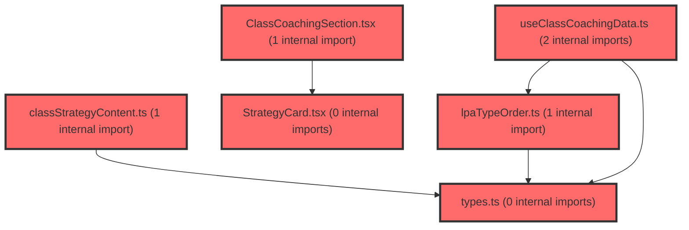

# 코드 리뷰 - 3511be4d

## 코드 복잡도 분석

**분석된 파일**: 14개 / 변경된 파일: 14개


### Import 의존관계 다이어그램



**범례**: 중심 파일 (변경됨) | 많은 import (10개 이상)


### 정상 범위 (NONE)


**`routes.tsx`** (other)

- 평균 복잡도: **0.054**

- 최대 복잡도: 0.463

- 청크 수: 23개

- 평균 사용처: 2.4곳


**권장사항:**

- 파일 크기가 큼 (23개 청크) - 파일 분리 검토


**`types.ts`** (other)

- 평균 복잡도: **0.003**

- 최대 복잡도: 0.006

- 청크 수: 4개


**권장사항:**

- 복잡도 정상 범위


**`scopeconfig.ts`** (config)

- 평균 복잡도: **0.003**

- 최대 복잡도: 0.009

- 청크 수: 13개


**권장사항:**

- Config 파일은 높은 연결도가 정상적임


**`lpatypeorder.ts`** (other)

- 평균 복잡도: **0.002**

- 최대 복잡도: 0.006

- 청크 수: 7개


**권장사항:**

- 복잡도 정상 범위


**`categorychangelist.tsx`** (other)

- 평균 복잡도: **0.002**

- 최대 복잡도: 0.010

- 청크 수: 27개


**권장사항:**

- 파일 크기가 큼 (27개 청크) - 파일 분리 검토


**`useclasscoachingdata.ts`** (other)

- 평균 복잡도: **0.001**

- 최대 복잡도: 0.005

- 청크 수: 10개


**권장사항:**

- 복잡도 정상 범위


**`timeline.tsx`** (other)

- 평균 복잡도: **0.001**

- 최대 복잡도: 0.005

- 청크 수: 19개


**권장사항:**

- 복잡도 정상 범위


**`classstrategycontent.ts`** (other)

- 평균 복잡도: **0.000**

- 최대 복잡도: 0.000

- 청크 수: 2개


**권장사항:**

- 복잡도 정상 범위


**`coachingclasspage.tsx`** (component)

- 평균 복잡도: **0.000**

- 최대 복잡도: 0.000

- 청크 수: 4개


**권장사항:**

- 복잡도 정상 범위


**`classcoachingsection.tsx`** (other)

- 평균 복잡도: **0.000**

- 최대 복잡도: 0.008

- 청크 수: 91개


**권장사항:**

- 파일 크기가 큼 (91개 청크) - 파일 분리 검토


**`coachingoverviewsection.tsx`** (component)

- 평균 복잡도: **0.000**

- 최대 복잡도: 0.001

- 청크 수: 54개


**권장사항:**

- 파일 크기가 큼 (54개 청크) - 파일 분리 검토


**`strategycard.tsx`** (other)

- 평균 복잡도: **0.000**

- 최대 복잡도: 0.004

- 청크 수: 61개


**권장사항:**

- 파일 크기가 큼 (61개 청크) - 파일 분리 검토


**`index.ts`** (other)

- 평균 복잡도: **0.000**

- 최대 복잡도: 0.000

- 청크 수: 2개


**권장사항:**

- 복잡도 정상 범위


**`scopetree.tsx`** (other)

- 평균 복잡도: **0.000**

- 최대 복잡도: 0.006

- 청크 수: 64개


**권장사항:**

- 파일 크기가 큼 (64개 청크) - 파일 분리 검토


---


## 변경 배경

이 커밋은 기존에 `V2Placeholder`로 대체되어 있던 `/coaching/class` 라우트를 실제 **학급 코칭(Class Coaching)** 기능으로 구현한 것입니다. LPA(잠재프로파일분석) 학습유형 기반으로 반 단위 코칭 전략을 제공하는 UI를 신규 구축했습니다.

- **목적**: 학급 단위 LPA 유형 분포를 시각화하고, 우세 유형별 코칭 전략(STEP 1~3)을 교사에게 제공
- **도메인**: 프론트엔드 UI / 비즈니스 로직 (코칭 기능)
- **변경 방향**: 정적 Placeholder → 데이터 기반의 실제 기능 페이지로 전환. 데이터 계층(`data/`), 모델 계층(`model/`), 위젯 계층(`widgets/`)으로 명확히 분리한 계층 구조를 도입

---

## [GOOD] 잘된 점

1. **계층 구조가 명확함**: `data/`(정적 콘텐츠·정렬 로직), `model/`(데이터 훅), `widgets/`(UI 컴포넌트)로 책임을 분리하여 재사용성과 유지보수성이 좋습니다.
2. **타입 안전성 확보**: `LPATypeStrategy`, `RankedType`, `AdvancedStrategy` 등 도메인 타입을 별도 `types.ts`로 분리하고, `StudentType`과의 매핑을 명시적으로 관리했습니다.
3. **엣지 케이스 처리**: 고등학교 미지원, 0명 유형 제외, 2차 검사 미실시, 콘텐츠 미준비 유형 등 다양한 예외 상황을 `NoticeBox`/`EmptyBox`로 우아하게 처리했습니다.
4. **데이터 출처 명시**: `classStrategyContent.ts`에 PDF 출처와 유형명 매핑 근거를 주석으로 상세히 남겨, 추후 데이터 검증 시 추적이 용이합니다.

---

## 변경사항 요약

학급 코칭 페이지를 신규 구현했습니다. 라우트 등록, LPA 유형별 코칭 콘텐츠 데이터, 유형 순위 정렬 로직, 데이터 훅, 그리고 분포 도넛차트·STEP 타임라인·전략 카드 UI를 포함합니다. `scopeConfig`의 `coaching/class` 스코프도 확정 IA 기준으로 정리했습니다.

---

## [ISSUE] 개선이 필요한 부분

### Critical (즉시 수정 필요)

없음

### High (우선 수정 권장)

없음

### Medium (개선 권장)

**1. `rankTypes`의 `'미지원'` 유형 처리 — 우선순위 매핑 누락**

`lpaTypeOrder.ts`의 `ELEMENTARY_PRIORITY`/`MIDDLE_PRIORITY`에는 초등·중등 3종만 정의되어 있습니다. `StudentType`에는 `'미지원'`이 포함되어 있어, 만약 `rankTypes`에 `'미지원'`이 전달되면 `priority[a.type] ?? 99`로 처리되어 항상 최하위로 밀립니다.

현재는 `aggregateTypeDistributionByRound`가 `predictedType === '미지원'`을 이미 걸러내므로 실제로는 문제가 발생하지 않습니다. 하지만 `rankTypes`가 다른 호출부에서 재사용될 경우 방어 로직이 부족합니다.

**2. `StrategyCard`의 `NoteBox`에 이모지 사용**

`StrategyCard.tsx`의 `NoteBox`에 `👥` 이모지가 하드코딩되어 있습니다. 프로젝트 전반의 아이콘 사용 패턴(lucide-react)과 일관성을 위해 이모지 대신 `Users` 아이콘을 사용하는 것이 좋습니다.

**3. `useClassCoachingData`의 `aggregateTypeDistributionByRound` 재계산**

`useClassCoachingData`는 `round`가 변경될 때마다 `aggregateTypeDistributionByRound([classData])`를 재호출합니다. 이 함수는 `classData`가 동일하면 결과가 동일하므로, `useMemo`로 캐싱하면 불필요한 재계산을 줄일 수 있습니다. 다만 현재 데이터 규모(단일 학급)에서는 성능 영향이 미미하여 선택적 개선 사항입니다.

**4. `DonutChart`의 `strokeDasharray` 계산 — 소수점 오차 가능성**

`DonutChart`에서 각 세그먼트의 `dash`를 `fraction * circumference`로 계산하고 `strokeDasharray={`${segment.dash} ${circumference - segment.dash}`}`로 설정합니다. 여러 세그먼트의 dash 합이 부동소수점 오차로 인해 circumference를 정확히 채우지 못해 미세한 틈이 생길 수 있습니다. 시각적으로 거의 무시할 수준이지만, 마지막 세그먼트의 dash를 `circumference - 누적 offset`으로 보정하면 완벽한 원을 그릴 수 있습니다.

---

## 주요 파일 분석

### frontend/src/features/coaching/data/lpaTypeOrder.ts

**변경 내용:**
LPA 유형 인원 동점 시 우선순위(지원 필요도 순)로 tie-break하는 `rankTypes` 함수 신규 추가.

**개선 제안:**

1. `'미지원'` 유형 방어 처리
   - **위치 (라인 번호)**: 34-36 (`rankTypes` 함수 내 `filter`)
   - **기존 코드**:
```ts
return counts
  .filter((item) => item.count > 0)
  .map((item) => ({ type: item.name, count: item.count }))
```
   - **해결 방안 (수정 코드)**:
```ts
return counts
  .filter((item) => item.count > 0 && item.name !== '미지원')
  .map((item) => ({ type: item.name, count: item.count }))
```
   - `aggregateTypeDistributionByRound`가 이미 '미지원'을 걸러내지만, `rankTypes`가 다른 곳에서 재사용될 때를 대비한 방어 코드입니다.

### frontend/src/widgets/coaching/StrategyCard.tsx

**변경 내용:**
LPA 유형별 코칭 전략을 STEP별로 렌더링하는 카드 컴포넌트. STEP1은 대표 전략, STEP2/3은 추가 전략을 표시.

**개선 제안:**

1. 이모지 대신 아이콘 사용
   - **위치 (라인 번호)**: 244 (`NoteBox` 내부)
   - **기존 코드**:
```tsx
<strong>👥 다른 유형에는?</strong> {content.noteForOtherTypes}
```
   - **해결 방안 (수정 코드)**:
```tsx
<strong>다른 유형에는?</strong> {content.noteForOtherTypes}
```
   - 프로젝트 전반의 아이콘 사용 패턴(lucide-react)과 일관성을 유지합니다.

### frontend/src/features/coaching/model/useClassCoachingData.ts

**변경 내용:**
학급 코칭 데이터를 조회하고 LPA 유형 순위를 계산하는 커스텀 훅.

**개선 제안:**

1. `aggregateTypeDistributionByRound` 결과 캐싱
   - **위치 (라인 번호)**: 38-42
   - **기존 코드**:
```ts
if (classData && (schoolLevel === '초등' || schoolLevel === '중등')) {
  const [distribution] = aggregateTypeDistributionByRound([classData]);
  const counts = (round === 1 ? distribution.round1.types : distribution.round2.types) ?? [];
  rankedTypes = rankTypes(counts, schoolLevel);
}
```
   - **해결 방안 (수정 코드)**:
```ts
const distribution = useMemo(
  () =>
    classData && (schoolLevel === '초등' || schoolLevel === '중등')
      ? aggregateTypeDistributionByRound([classData])[0]
      : null,
  [classData, schoolLevel],
);

let rankedTypes: RankedType[] = [];
if (distribution) {
  const counts = (round === 1 ? distribution.round1.types : distribution.round2.types) ?? [];
  rankedTypes = rankTypes(counts, schoolLevel);
}
```
   - `classData`가 동일하면 결과가 동일하므로 `useMemo`로 캐싱하여 `round` 변경 시 불필요한 재계산을 방지합니다.

---

## 최종 평가

**결론**:
- [x] [OK] **승인 (Approved)** - Critical/High 이슈 없음

**종합 의견:**

학급 코칭 기능을 계층 구조로 명확하게 분리하고, 다양한 엣지 케이스를 우아하게 처리한 견고한 구현입니다. 데이터 출처와 유형 매핑 근거를 주석으로 명시한 점이 특히 인상적입니다.

제안된 개선 사항은 모두 선택적(Medium) 수준으로, 현재 기능의 정상 동작에는 영향이 없습니다. 특히 `rankTypes`의 '미지원' 방어 처리만 추후 재사용 시점에 반영하면 충분합니다.