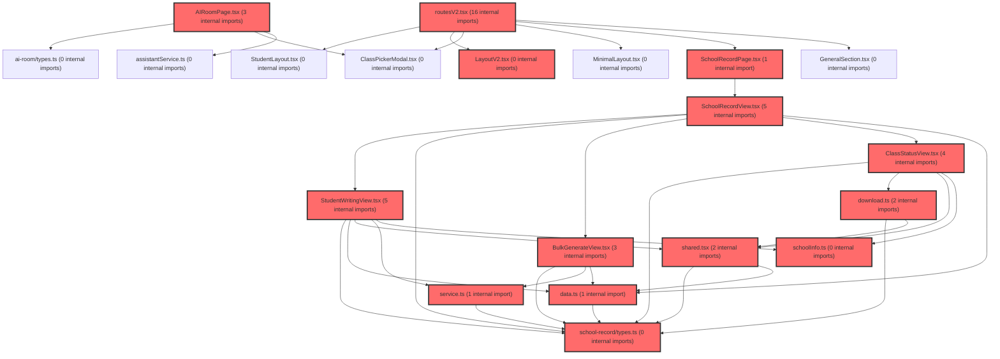

> [!IMPORTANT]
> **⚠️ 수동 검토 권장 (자가힐링 주의)**
>
> AI 자가힐링 결과물이 실제 의도와 다를 수 있으므로, **상세 리뷰 내용에 기반한 수동 점검**을 우선해 주시기 바랍니다. 자가힐링 기능을 활용하실 경우 최종 결과물을 신중하게 확인해 주세요.

# 코드 리뷰 - 38b66796

## 코드 복잡도 분석

**분석된 파일**: 16개 / 변경된 파일: 19개


### Import 의존관계 다이어그램



**범례**: 중심 파일 (변경됨) | 많은 import (10개 이상)


### 정상 범위 (NONE)


**`airoompage.tsx`** (component)

- 평균 복잡도: **0.117**

- 최대 복잡도: 0.471

- 청크 수: 49개

- 평균 사용처: 5.4곳


**권장사항:**

- 파일 크기가 큼 (49개 청크) - 파일 분리 검토


**`scopeconfig.ts`** (config)

- 평균 복잡도: **0.003**

- 최대 복잡도: 0.010

- 청크 수: 12개


**권장사항:**

- Config 파일은 높은 연결도가 정상적임


**`data.ts`** (other)

- 평균 복잡도: **0.003**

- 최대 복잡도: 0.006

- 청크 수: 13개


**권장사항:**

- 복잡도 정상 범위


**`download.ts`** (other)

- 평균 복잡도: **0.003**

- 최대 복잡도: 0.006

- 청크 수: 9개


**권장사항:**

- 복잡도 정상 범위


**`layoutv2.tsx`** (other)

- 평균 복잡도: **0.002**

- 최대 복잡도: 0.009

- 청크 수: 41개


**권장사항:**

- 파일 크기가 큼 (41개 청크) - 파일 분리 검토


**`schoolrecordpage.tsx`** (component)

- 평균 복잡도: **0.002**

- 최대 복잡도: 0.005

- 청크 수: 6개


**권장사항:**

- 복잡도 정상 범위


**`schoolinfo.ts`** (other)

- 평균 복잡도: **0.002**

- 최대 복잡도: 0.002

- 청크 수: 3개


**권장사항:**

- 복잡도 정상 범위


**`shared.tsx`** (other)

- 평균 복잡도: **0.002**

- 최대 복잡도: 0.005

- 청크 수: 11개


**권장사항:**

- 복잡도 정상 범위


**`types.ts`** (other)

- 평균 복잡도: **0.002**

- 최대 복잡도: 0.008

- 청크 수: 9개


**권장사항:**

- 복잡도 정상 범위


**`bulkgenerateview.tsx`** (component)

- 평균 복잡도: **0.001**

- 최대 복잡도: 0.004

- 청크 수: 17개


**권장사항:**

- 복잡도 정상 범위


**`schoolrecordview.tsx`** (component)

- 평균 복잡도: **0.001**

- 최대 복잡도: 0.006

- 청크 수: 22개


**권장사항:**

- 파일 크기가 큼 (22개 청크) - 파일 분리 검토


**`studentwritingview.tsx`** (component)

- 평균 복잡도: **0.001**

- 최대 복잡도: 0.005

- 청크 수: 30개


**권장사항:**

- 파일 크기가 큼 (30개 청크) - 파일 분리 검토


**`service.ts`** (other)

- 평균 복잡도: **0.001**

- 최대 복잡도: 0.005

- 청크 수: 15개


**권장사항:**

- 복잡도 정상 범위


**`routesv2.tsx`** (other)

- 평균 복잡도: **0.000**

- 최대 복잡도: 0.003

- 청크 수: 22개


**권장사항:**

- 파일 크기가 큼 (22개 청크) - 파일 분리 검토


**`classstatusview.tsx`** (component)

- 평균 복잡도: **0.000**

- 최대 복잡도: 0.004

- 청크 수: 34개


**권장사항:**

- 파일 크기가 큼 (34개 청크) - 파일 분리 검토


**`index.ts`** (other)

- 평균 복잡도: **0.000**

- 최대 복잡도: 0.000

- 청크 수: 2개


**권장사항:**

- 복잡도 정상 범위


---


## 변경 배경

이 커밋은 '생활기록부 작성' 기능을 AI 어시스턴트 페이지(AIRoomPage)의 내부 탭에서 독립적인 GNB 메뉴 항목으로 분리하는 아키텍처 변경입니다. 기존에는 AIRoomPage 내부에서 `mode` 상태('chat' / 'record')로 전환하는 방식이었으나, 이 기능은 AI 대화와는 완전히 다른 워크플로우(학급 현황 조회 -> 다중 생성 -> 학생별 작성)를 가지므로 별도 feature로 분리하는 것이 유지보수와 확장성 측면에서 적절한 결정입니다.

- **목적**: '생활기록부 작성' 기능을 독립 GNB 메뉴로 분리하고 `/exam/record` 경로로 라우팅
- **도메인**: UI / 라우팅 / 네비게이션 아키텍처
- **변경 방향**: AIRoomPage 내부 탭 방식에서 독립 feature + 전용 라우트 방식으로 전환

---

## [GOOD] 잘된 점

1. **기능 분리의 명확성**: '생활기록부 작성'을 AI 어시스턴트 페이지의 내부 탭에서 독립적인 GNB 메뉴로 분리한 결정은 적절합니다. 이 기능은 AI 대화와는 성격이 완전히 다른 독립적인 워크플로우를 가지므로, 별도 feature로 분리하는 것이 유지보수에 유리합니다. 특히 `FEATURES_proto 260724.md` 문서(1,670라인)에서 정의된 복잡한 UX 흐름(3개 화면, 3가지 생성 방식, 학교급별 분기 등)을 고려하면, 이 기능이 단순한 탭 하나로 처리되기에는 규모가 큽니다.

2. **일관된 패턴 준수**: 기존 `exam/management`, `exam/result`, `exam/tracking`과 동일한 `/exam/*` 경로 체계를 따르고, `MENU_SCOPE_MATRIX`에도 동일한 패턴(all/class/student 모두 true)으로 추가하여 기존 아키텍처와의 일관성을 유지했습니다.

3. **불필요한 코드 제거**: AIRoomPage에서 `mode` 상태 관리, `ModeButton` 컴포넌트, `SchoolRecordTab` 임포트, `Wrench` 아이콘 등 생활기록부와 관련된 모든 코드를 깔끔하게 제거하여 AI 어시스턴트 페이지의 단일 책임을 회복했습니다. 특히 `setMode('chat')` 호출이 4곳에서 제거되어 상태 관리가 단순해졌습니다.

---

## 변경사항 요약

| 파일 | 변경 유형 | 내용 |
|------|----------|------|
| `LayoutV2.tsx` | 수정 | GNB에 '생활기록부 작성' 메뉴 항목 추가 (`/exam/record`) |
| `routesV2.tsx` | 수정 | `/exam/record` 경로에 `SchoolRecordPage` 연결 |
| `scopeConfig.ts` | 수정 | `exam/record` 메뉴에 대한 스코프 설정 추가 |
| `AIRoomPage.tsx` | 수정 | mode 상태, ModeButton, SchoolRecordTab 관련 코드 제거 |
| `SchoolRecordTab.tsx` | 삭제 | AI 어시스턴트 내부 탭 제거 (독립 feature로 이전) |
| `FEATURES_proto 260720.md` | 이동 | `docs/` 디렉토리로 이동 |
| `FEATURES_proto 260724.md` | 추가 | 생활기록부 작성 지원 통합 명세 (1,670라인) |

---

## [ISSUE] 개선이 필요한 부분

### Critical (즉시 수정 필요)

없음

### High (우선 수정 권장)

**1. SchoolRecordPage 컴포넌트가 존재하지 않아 빌드 실패 가능성**

`routesV2.tsx` 26번째 줄에서 `import { SchoolRecordPage } from '../features/school-record'`를 수행하고 있으나, `prototype/src/features/school-record/` 디렉토리 자체가 존재하지 않습니다. `find_files`로 확인한 결과 `school-record/**/*` 패턴에 일치하는 파일이 전혀 없습니다.

```typescript
// prototype/src/app/routesV2.tsx, 26번째 줄
import { SchoolRecordPage } from '../features/school-record';
```

이 상태로 빌드하면 모듈을 찾을 수 없는 오류가 발생합니다. 다음 두 가지 중 하나를 선택해야 합니다:

**방안 A**: `SchoolRecordPage` 컴포넌트를 먼저 구현한 후 이 커밋을 진행
**방안 B**: 임포트와 라우트 추가를 제외하고 GNB 메뉴와 스코프 설정만 먼저 추가 (라우트는 컴포넌트 구현 완료 후 별도 커밋으로 추가)

방안 B를 선택한다면 다음과 같이 수정합니다:

```typescript
// prototype/src/app/routesV2.tsx
// 26번째 줄: 임포트 제거
// 127번째 줄: 라우트 제거
// <Route path="/exam/record" element={<SchoolRecordPage />} />  ← 이 줄 제거
```

그리고 `LayoutV2.tsx`의 GNB 메뉴와 `scopeConfig.ts`의 스코프 설정은 유지합니다. 이렇게 하면 GNB 메뉴는 보이지만 아직 라우트가 연결되지 않은 상태가 되어, 사용자가 클릭하면 404 또는 fallback 페이지로 이동하게 됩니다. 이는 '준비 중' 상태를 표현하는 방법으로도 활용할 수 있습니다.

### Medium (개선 권장)

**1. SchoolRecordTab.tsx 삭제 시 참조 정리 확인 완료**

`grep_search`로 확인한 결과, `SchoolRecordTab`은 `docs/` 디렉토리의 마크다운 문서(`기능정의서.md`, `기능정의서.html`)와 이전 리뷰 파일(`REVIEW_5122c443.md`)에서만 참조되고 있으며, 실제 TypeScript 코드에서는 더 이상 참조되지 않습니다. 따라서 삭제는 안전하게 이루어졌습니다.

---

## 주요 파일 분석

### prototype/src/app/routesV2.tsx

**변경 내용**: `/exam/record` 경로에 `SchoolRecordPage`를 연결하고, `school-record` feature에서 임포트 구문 추가

**개선 제안**:
1. `SchoolRecordPage` 컴포넌트가 아직 구현되지 않았으므로, 임포트와 라우트 추가를 제외하거나 컴포넌트를 먼저 구현해야 합니다.
   - **위치**: 26번째 줄
   - **기존 코드**:
   ```typescript
   import { SchoolRecordPage } from '../features/school-record';
   ```
   - **해결 방안**: 컴포넌트 구현이 완료될 때까지 이 임포트를 제외하고, GNB 메뉴와 스코프 설정만 먼저 커밋합니다.

### prototype/src/features/ai-room/pages/AIRoomPage.tsx

**변경 내용**: `mode` 상태, `ModeButton` 컴포넌트, `SchoolRecordTab` 임포트, `Wrench` 아이콘 등 생활기록부 관련 코드 제거

**분석**: 이 파일의 변경은 매우 깔끔합니다. `mode` 상태가 제거되면서 `setMode('chat')` 호출 4곳(`handleNewConversation`, `handleSelectConversation`, `handleDeleteConversation`의 분기 내)이 모두 제거되었고, `AssistantMode` 타입 임포트도 제거되었습니다. `SchoolRecordTab`을 블러 처리하던 복잡한 조건부 렌더링 로직이 단순한 `AssistantChatTab` 렌더링으로 대체되어 가독성이 크게 향상되었습니다.

### prototype/src/features/ai-room/docs/FEATURES_proto 260724.md

**변경 내용**: 1,670라인 분량의 생활기록부 작성 지원 통합 명세 문서 추가

**분석**: 이 문서는 매우 상세하게 작성되었습니다. 특히 주목할 점은:
- **법적 근거 명시**: 초중등교육법 제25조, 2026학년도 기재요령 제16조, AI 활용 유의사항까지 명확히 기술
- **핵심 UX 원칙**: "교사에게 긴 관찰 기록 작성을 요구하지 않는다", "검사 결과는 관찰 주제를 추천하는 참고자료로 사용" 등 실용적인 원칙 제시
- **학교급별 차이**: 초등/중등/고등 각각의 우선 상황, 표현 원칙, 행동 예시를 구체적으로 정의
- **AI 생성 규칙**: 프롬프트 구조, 문장 패턴(관찰-해석-발전 / 상황-행동-결과 / 변화 서사), 금지어 검증까지 상세히 명세

다만 1,670라인이라는 방대한 분량은 문서 자체의 유지보수 부담이 될 수 있습니다. Phase별 체크리스트(Phase 1~5)로 나누어 관리하는 현재 구조는 좋지만, 실제 구현이 진행됨에 따라 이 문서를 계속 업데이트할지, 아니면 구현이 완료된 부분은 별도 API 문서로 분리할지 고려해볼 필요가 있습니다.

---

## 최종 평가

**결론**: 
- [ ] [OK] **승인 (Approved)** - Critical/High 이슈 없음
- [ ] [WARN] **조건부 승인 (Approved with Comments)** - Medium 이하 이슈만 존재
- [X] [FIX] **수정 필요 (Changes Requested)** - Critical/High 이슈 존재

**종합 의견**: 전반적인 아키텍처 결정(생활기록부 기능을 독립 GNB 메뉴로 분리)은 적절하며, 기존 패턴을 일관성 있게 따르고 불필요한 코드를 깔끔하게 정리한 점은 긍정적입니다. 다만 `SchoolRecordPage` 컴포넌트가 아직 구현되지 않은 상태에서 라우트에 임포트 구문을 추가한 것은 빌드 실패를 유발할 수 있습니다. 컴포넌트 구현을 먼저 완료하거나, 해당 임포트와 라우트를 제외한 후 GNB 메뉴와 스코프 설정만 먼저 커밋하는 방식으로 수정이 필요합니다. 이 한 가지만 해결되면 나머지 변경사항은 품질 기준을 충분히 충족합니다.