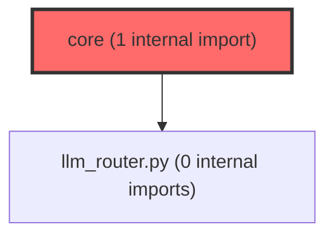

> [!IMPORTANT]
> **⚠️ 수동 검토 권장 (자가힐링 주의)**
>
> AI 자가힐링 결과물이 실제 의도와 다를 수 있으므로, **상세 리뷰 내용에 기반한 수동 점검**을 우선해 주시기 바랍니다. 자가힐링 기능을 활용하실 경우 최종 결과물을 신중하게 확인해 주세요.

# 코드 리뷰 - 3a164b28

## 코드 복잡도 분석

**분석된 파일**: 3개 / 변경된 파일: 6개


### Import 의존관계 다이어그램



**범례**: 중심 파일 (변경됨) | 많은 import (10개 이상)


### 정상 범위 (NONE)


**`main.py`** (other)

- 평균 복잡도: **0.467**

- 최대 복잡도: 0.471

- 청크 수: 3개

- 평균 사용처: 16.0곳


**권장사항:**

- 복잡도 정상 범위


**`agent_service.py`** (other)

- 평균 복잡도: **0.463**

- 최대 복잡도: 0.464

- 청크 수: 3개

- 평균 사용처: 18.7곳


**권장사항:**

- 복잡도 정상 범위


**`__init__.py`** (other)

- 평균 복잡도: **0.304**

- 최대 복잡도: 0.304

- 청크 수: 1개

- 평균 사용처: 6.0곳


**권장사항:**

- 복잡도 정상 범위


---


## 변경 배경

이 커밋은 AI Agent 서비스에 **LangSmith Observability(트레이싱)를 도입**하여 LLM 호출 흐름을 시각화하고 디버깅/모니터링을 가능하게 하기 위한 변경입니다.

- **목적**: LangSmith SDK를 통해 Agent의 LLM 호출(Tool Calling 포함) 전체를 하나의 Trace Run으로 캡처하여, 운영 환경에서 에이전트의 의사결정 과정을 추적 가능하게 함
- **도메인**: 인프라 / Observability (AI Agent 모니터링)
- **변경 방향**: 기존 비즈니스 로직을 최대한 건드리지 않고(`_build_messages` 호출 위치 변경 외에는 로직 변경 없음), `langsmith.trace()` context manager를 try/finally로 감싸는 최소 침습(minimal invasive) 방식으로 트레이싱을 추가

---

## [GOOD] 잘된 점

**1. 단일 책임 분리 (tracing.py)**

LangSmith 초기화 로직을 `app/core/tracing.py`라는 독립 모듈로 분리한 점이 가장 돋보입니다. 환경변수 설정, 프로젝트명 자동 구성, 활성화 여부 판단을 한 곳에서 관리합니다. `main.py`의 lifespan에서 `tracing.initialize()` 한 줄로 초기화가 완료되어 관심사 분리가 명확합니다.

```python
# main.py
@asynccontextmanager
async def lifespan(app: FastAPI):
    try:
        tracing.initialize()
    except Exception as e:
        logger.warning(f"LangSmith 트레이싱 초기화 실패, 비활성화 모드로 계속: {e}")
```

**2. 장애 격리 (fail-safe)**

LangSmith 초기화 실패 시에도 서비스가 중단되지 않도록 이중으로 보호하고 있습니다.

- `main.py`의 lifespan에서 `tracing.initialize()`를 try/except로 감싸 초기화 예외를 격리
- `setup_langsmith()` 내부에서 API 키가 없거나 `LANGSMITH_TRACING != true`이면 조용히 `False` 반환
- `agent_service.py`에서 `langsmith_is_enabled()`로 활성화 여부를 확인한 후에만 trace context 생성

```python
# tracing.py
def setup_langsmith() -> bool:
    tracing_flag = os.getenv("LANGSMITH_TRACING", "false").lower()
    api_key = os.getenv("LANGSMITH_API_KEY", "").strip()
    if tracing_flag != "true" or not api_key:
        logger.info("LangSmith 트레이싱 비활성화 ...")
        return False
```

**3. 예외 전파 정확성**

`run_agent_stream`에서 `BaseException`을 별도로 잡아 `_trace_ctx.__exit__(*sys.exc_info())`로 예외 정보를 LangSmith에 전달한 후 `raise`로 재전파하는 패턴이 정확합니다. GeneratorExit/CancelledError 같은 특수 예외도 Trace에 기록됩니다.

```python
# agent_service.py - run_agent_stream
except BaseException:
    if _trace_ctx is not None:
        _trace_ctx.__exit__(*sys.exc_info())
        _trace_ctx = None
    raise
finally:
    if _trace_ctx is not None:
        _trace_ctx.__exit__(None, None, None)
```

---

## 변경사항 요약

| 파일 | 변경 유형 | 설명 |
|------|-----------|------|
| `app/core/tracing.py` | 신규 생성 | LangSmith 초기화 전담 모듈 (환경변수 기반 프로젝트명 자동 구성, 싱글톤 활성화 플래그) |
| `app/core/__init__.py` | 수정 | `tracing` 모듈을 `__all__`에 추가 |
| `app/services/agent_service.py` | 수정 | `run_agent`/`run_agent_stream`에 `langsmith.trace()` context manager 적용 |
| `main.py` | 수정 | lifespan에 `tracing.initialize()` 최우선 호출 추가 |
| `.env.example` | 수정 | `LANGSMITH_*` 환경변수 4개 추가 |
| `requirements.txt` | 수정 | `langsmith>=0.2.0` 추가 |

---

## [ISSUE] 개선이 필요한 부분

### Critical (즉시 수정 필요)

**없음.** 명백한 버그, 보안 취약점, 데이터 손실 가능성은 발견되지 않았습니다.

### High (우선 수정 권장)

**1. `run_agent`에서 `history` 변수 중복 할당으로 인한 코드 혼선**

- **파일**: `agent/app/services/agent_service.py`
- **위치**: `run_agent` 메서드, 147번 라인 및 155번 라인

**문제 분석**:

`run_agent` 메서드에서 `history` 변수가 두 번 할당되고 있습니다.

```python
# 147번 라인 (try 블록 진입 전)
history = get_session_history(session_id)

# ... LangSmith trace context 생성 ...

try:
    # 155번 라인 (try 블록 내부)
    messages, history = self._build_messages(text, session_id, context_data)
```

첫 번째 `history` 할당(147번 라인)은 try 블록 진입 전에 이루어집니다. 이후 try 블록 내부에서 `self._build_messages()`를 호출하면, 해당 메서드 내부에서도 `get_session_history(session_id)`를 호출하여 동일한 객체를 반환받습니다. 따라서 첫 번째 할당은 결과적으로 불필요합니다.

**왜 문제인가?**:
- 기능상 버그는 아닙니다. `_build_messages` 내부에서도 동일한 `get_session_history(session_id)`를 호출하므로, 두 `history` 변수는 동일한 객체를 참조합니다.
- 하지만 코드 흐름이 명확하지 않습니다. 유지보수자가 "왜 try 블록 밖에서 history를 미리 가져오는가?"라고 의문을 가질 수 있습니다.
- `_build_messages` 호출 전에 예외가 발생하면 `history`는 try 블록 밖의 값을 사용하게 되는데, 이는 정상 동작하지만 의도된 설계인지 명확하지 않습니다.

**해결 방안**:

첫 번째 `history = get_session_history(session_id)`를 제거하고, `_build_messages`의 반환값만 사용하는 것이 더 명확합니다. 단, `finally` 블록에서 `history`를 사용하므로, `_build_messages` 호출 전에 예외가 발생할 경우 `history`가 정의되지 않을 위험이 있습니다. 따라서 try 블록 진입 직후 `history`를 초기화하는 방식으로 리팩토링하는 것이 안전합니다.

```
수정 전:
    history = get_session_history(session_id)
    if langsmith_is_enabled():
        _trace_ctx = ...
    try:
        messages, history = self._build_messages(...)
        ...

수정 후:
    if langsmith_is_enabled():
        _trace_ctx = ...
    try:
        messages, history = self._build_messages(...)
        ...
```

> **수정 코드 제시 불가 -- 문맥 파악 불충분**: `finally` 블록에서 `history.add_user_message(text)`와 `history.add_ai_message(answer)`를 호출합니다. `_build_messages` 호출 전에 예외가 발생하면 `history`가 정의되지 않은 상태에서 `finally` 블록이 실행될 수 있습니다. 따라서 단순히 첫 번째 할당을 제거하는 것은 안전하지 않습니다. 전체 예외 처리 흐름을 재검토한 후 리팩토링해야 합니다.

---

### Medium (개선 권장)

**1. `run_agent_stream`의 중첩 try 구조 복잡성**

- **파일**: `agent/app/services/agent_service.py`
- **위치**: `run_agent_stream` 메서드 전체 (약 260~390번 라인)

**문제 분석**:

`run_agent_stream`은 다음과 같은 2중 try 구조로 되어 있습니다.

```
외부 try:
    내부 try:
        # 비즈니스 로직 (스트리밍, Tool Calling)
    except litellm.exceptions.AuthenticationError:
        yield msg   # 예외 처리 후 yield
    except Exception:
        yield fallback_message
except BaseException:
    _trace_ctx.__exit__(*sys.exc_info())
    raise
finally:
    _trace_ctx.__exit__(None, None, None)
```

이 구조에서 발생하는 미묘한 문제는, 내부 try에서 `litellm.exceptions.AuthenticationError` 등이 발생하면 내부 except 블록에서 `yield`로 메시지를 방출한 후, 외부 try의 `finally` 블록이 실행되어 `_trace_ctx.__exit__(None, None, None)`이 호출된다는 점입니다. 즉, **예외가 발생했음에도 LangSmith에는 정상 종료(no exception)로 기록**됩니다.

이는 의도된 설계일 수 있습니다. "사용자에게는 친절한 오류 메시지를 보여주고, LangSmith에는 정상 종료로 기록하여 노이즈를 줄인다"는 전략이라면 합리적입니다. 하지만 운영 모니터링 관점에서는 예외 상황이 LangSmith에 기록되지 않아 문제를 놓칠 수 있습니다.

**해결 방안**:
- 현재 구조를 유지하되, 내부 except 블록에서 `logger.error()`로 이미 로깅하고 있으므로 운영 모니터링은 로그 기반으로 수행
- 추후 리팩토링 시, 내부 except에서 예외를 재발생시키고 외부 try에서 일괄 처리하는 방식으로 단순화 검토

**2. `_build_project_name()`의 기본값 `"dev"` 하드코딩**

- **파일**: `agent/app/core/tracing.py`
- **위치**: 33번 라인

**문제 분석**:

```python
def _build_project_name() -> str:
    env = os.getenv("LANGSMITH_ENV", "dev").strip().lower()
    return f"{_PROJECT_BASE}-{env}"
```

`LANGSMITH_ENV` 환경변수가 설정되지 않은 경우 기본값이 `"dev"`로 하드코딩되어 있습니다. 프로덕션 환경에서 실수로 환경변수를 누락하면, 프로덕션 트래픽이 `meta-dashboard-agent-dev` 프로젝트로 전송될 수 있습니다.

**해결 방안**:

```python
def _build_project_name() -> str:
    env = os.getenv("LANGSMITH_ENV", "").strip().lower()
    if not env:
        raise ValueError("LANGSMITH_ENV is not set. Cannot build LangSmith project name.")
    return f"{_PROJECT_BASE}-{env}"
```

또는 `setup_langsmith()`에서 빈 문자열을 검사하여 early return 처리:

```python
def setup_langsmith() -> bool:
    ...
    project_name = _build_project_name()
    if not project_name:
        logger.warning("LangSmith 프로젝트명을 생성할 수 없습니다. LANGSMITH_ENV를 설정하세요.")
        return False
    ...
```

---

## 주요 파일 분석

### `agent/app/core/tracing.py` (신규)

**변경 내용**: LangSmith 초기화 전담 모듈. 환경변수 기반 프로젝트명 자동 구성, 싱글톤 활성화 플래그 관리.

**핵심 로직 흐름**:
1. `initialize()` -> `setup_langsmith()` 호출
2. `setup_langsmith()`: `LANGSMITH_TRACING=true` + API 키 존재 확인
3. 조건 충족 시 `os.environ`에 `LANGSMITH_PROJECT`, `LANGSMITH_ENDPOINT` 등 설정
4. `is_enabled()`로 활성화 상태 조회 가능

**개선 제안**:
- `_build_project_name()`의 기본값 `"dev"`를 제거하여 환경변수 누락 시 명시적 실패 유도 (Medium 섹션 참조)

### `agent/app/services/agent_service.py`

**변경 내용**: `run_agent`/`run_agent_stream`에 `langsmith.trace()` context manager 적용.

**변경 전후 비교**:

| 항목 | 변경 전 | 변경 후 |
|------|---------|---------|
| `_build_messages` 호출 위치 | try 블록 진입 전 | try 블록 내부 (첫 번째 실행문) |
| LangSmith trace | 없음 | `langsmith.trace()` context manager로 감싸기 |
| 예외 처리 | except 블록에서만 처리 | `BaseException` 별도 처리 + `finally`에서 trace 종료 |
| `history` 초기화 | try 블록 진입 전 | try 블록 진입 전 + try 블록 내부 (중복) |

**개선 제안**:
- `run_agent`의 `history` 중복 할당 정리 (High 섹션 참조)
- `run_agent_stream`의 중첩 try 구조 단순화 검토 (Medium 섹션 참조)

### `agent/main.py`

**변경 내용**: lifespan에 `tracing.initialize()` 최우선 호출 추가.

**특이사항**: `tracing.initialize()`가 Neo4j 연결 검증보다 먼저 호출됩니다. 이는 LangSmith 초기화가 실패해도 서비스가 계속 기동되도록 설계되었습니다. 적절한 위치에 fail-safe 패턴으로 잘 추가되었습니다.

---

## 최종 평가

**결론**:
- [ ] [OK] **승인 (Approved)** - Critical/High 이슈 없음
- [x] [WARN] **조건부 승인 (Approved with Comments)** - Medium 이하 이슈만 존재
- [ ] [FIX] **수정 필요 (Changes Requested)** - Critical/High 이슈 존재

**종합 의견**:

LangSmith 트레이싱 도입을 위한 전반적인 설계와 구현이 깔끔합니다. 특히 `tracing.py`의 단일 책임 분리, `main.py`의 fail-safe 패턴, `run_agent_stream`의 `BaseException` 처리까지 예외 케이스를 고려한 점이 인상적입니다.

`run_agent`의 `history` 중복 할당은 기능상 버그는 아니지만 코드 명확성을 위해 정리하는 것을 권장합니다. `_build_project_name()`의 기본값 `"dev"` 하드코딩은 프로덕션 환경에서 실수로 환경변수를 누락할 경우 데이터 오염 가능성이 있으므로, 명시적 실패로 변경하는 것이 안전합니다.

전반적으로 프로덕션에 바로 적용 가능한 수준의 품질이며, 위 Medium 수준의 제안사항들은 다음 리팩토링 주기에 반영하셔도 무방합니다.