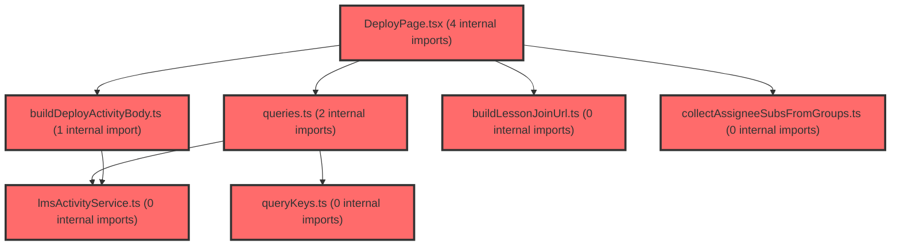

> [!IMPORTANT]
> **⚠️ 수동 검토 권장 (자가힐링 주의)**
>
> AI 자가힐링 결과물이 실제 의도와 다를 수 있으므로, **상세 리뷰 내용에 기반한 수동 점검**을 우선해 주시기 바랍니다. 자가힐링 기능을 활용하실 경우 최종 결과물을 신중하게 확인해 주세요.

# 코드 리뷰 - 3bc9a355

## 코드 복잡도 분석

**분석된 파일**: 13개 / 변경된 파일: 14개


### Import 의존관계 다이어그램



**범례**: 중심 파일 (변경됨) | 많은 import (10개 이상)


### 정상 범위 (NONE)


**`routes.tsx`** (other)

- 평균 복잡도: **0.054**

- 최대 복잡도: 0.463

- 청크 수: 23개

- 평균 사용처: 2.4곳


**권장사항:**

- 파일 크기가 큼 (23개 청크) - 파일 분리 검토


**`groupservice.ts`** (other)

- 평균 복잡도: **0.006**

- 최대 복잡도: 0.013

- 청크 수: 49개


**권장사항:**

- 파일 크기가 큼 (49개 청크) - 파일 분리 검토


**`collectassigneesubsfromgroups.ts`** (other)

- 평균 복잡도: **0.005**

- 최대 복잡도: 0.008

- 청크 수: 3개


**권장사항:**

- 복잡도 정상 범위


**`lmsactivityservice.ts`** (other)

- 평균 복잡도: **0.003**

- 최대 복잡도: 0.007

- 청크 수: 31개


**권장사항:**

- 파일 크기가 큼 (31개 청크) - 파일 분리 검토


**`queries.ts`** (other)

- 평균 복잡도: **0.003**

- 최대 복잡도: 0.012

- 청크 수: 48개


**권장사항:**

- 파일 크기가 큼 (48개 청크) - 파일 분리 검토


**`index.ts`** (other)

- 평균 복잡도: **0.003**

- 최대 복잡도: 0.011

- 청크 수: 92개


**권장사항:**

- 파일 크기가 큼 (92개 청크) - 파일 분리 검토


**`buildlessonjoinurl.ts`** (utility)

- 평균 복잡도: **0.002**

- 최대 복잡도: 0.002

- 청크 수: 2개


**권장사항:**

- 복잡도 정상 범위


**`builddeployactivitybody.ts`** (other)

- 평균 복잡도: **0.002**

- 최대 복잡도: 0.010

- 청크 수: 13개


**권장사항:**

- 복잡도 정상 범위


**`querykeys.ts`** (other)

- 평균 복잡도: **0.001**

- 최대 복잡도: 0.004

- 청크 수: 7개


**권장사항:**

- 복잡도 정상 범위


**`index.ts`** (other)

- 평균 복잡도: **0.001**

- 최대 복잡도: 0.005

- 청크 수: 27개


**권장사항:**

- 파일 크기가 큼 (27개 청크) - 파일 분리 검토


**`lessonjoinpage.tsx`** (component)

- 평균 복잡도: **0.001**

- 최대 복잡도: 0.007

- 청크 수: 12개


**권장사항:**

- 복잡도 정상 범위


**`deploypage.tsx`** (component)

- 평균 복잡도: **0.000**

- 최대 복잡도: 0.005

- 청크 수: 177개


**권장사항:**

- 파일 크기가 큼 (177개 청크) - 파일 분리 검토


**`lessonactivityjoinembed.tsx`** (other)

- 평균 복잡도: **0.000**

- 최대 복잡도: 0.004

- 청크 수: 12개


**권장사항:**

- 복잡도 정상 범위


---


## 변경 배경

- **목적**: 학생 수업 참여 흐름의 식별자 체계를 정리하고, `assigneeSubs`(배정 명단)를 실제 `spUserId`로 연동하며, 학생 진입 API를 `GET /activities`(교사용)에서 `POST /participations`(학생용)로 전환한 Phase A·B 완료 커밋입니다.
- **도메인**: 비즈니스 로직 (LMS API 연동) + UI (DeployPage, LessonJoinPage) + 라우팅
- **변경 방향**: 
  - 학생 URL param을 `:activityId` → `:accessKey`로 정정하여 LMS 내부 UUID(`activityId`)와 혼동을 제거
  - 임시 `:setId` path segment를 완전히 제거하고 `POST /participations` 응답의 `content.lcmsSetId`로 대체
  - `assigneeSubs` 전달값을 `getGroupDetail` → `memberList[].spUserId` 합집합으로 확정·연동

---

## [GOOD] 잘된 점

1. **식별자 명칭 정리가 탁월합니다.** `accessKey`(학생 참여 키)와 `activityId`(LMS 내부 UUID)를 명확히 분리하고, 문서·코드·라우트 param까지 일관되게 `:accessKey`로 통일했습니다. 이전 문서의 `:activityId` 표기가 오표기였음을 명시적으로 정정한 점도 좋습니다.
2. **학생 경로에서 교사용 API 호출을 원천 차단했습니다.** `GET /activities/{activityId}`는 교사용임을 명확히 하고, 학생은 `GET /entry` → `POST /participations` → `content.lcmsSetId` 흐름으로 전환했습니다. API 계약 오용을 방지하는 좋은 결정입니다.
3. **`deployLessonActivity`의 재시도(resume) 로직이 견고합니다.** `shouldRunStep`으로 실패 단계부터 재개하고, `publish`의 멱등성을 활용한 재시도 설계가 안전합니다. `toFailure`로 실패 단계를 구조화한 것도 유지보수에 유리합니다.

---

## 변경사항 요약

- 학생 라우트를 `/student/lesson/:accessKey` 단일 경로로 정리하고 임시 `:setId` path 제거
- `assigneeSubs` = `getGroupDetail` → `memberList[].spUserId` 합집합으로 연동, `audienceType: 'ASSIGNED'` 전환
- 학생 진입 흐름을 `GET /entry` → `POST /participations` → `content.lcmsSetId` → embed로 재구성

---

## [ISSUE] 개선이 필요한 부분

### Critical (즉시 수정 필요)

없음

### High (우선 수정 권장)

**1. `useStartParticipationQuery`가 `useQuery`로 POST를 호출하는 것은 부적절합니다.**

- **위치**: `frontend/src/features/lesson/api/queries.ts` (약 200~211행)
- **기존 코드**:
```ts
export function useStartParticipationQuery(
  accessKey: string | undefined,
  options?: { enabled?: boolean },
) {
  return useQuery({
    queryKey: lessonKeys.participation(accessKey ?? ''),
    queryFn: () => startParticipation(accessKey!),
    enabled: Boolean(accessKey) && (options?.enabled ?? true),
    retry: false,
  });
}
```

- **문제점**: `POST /participations`는 서버 상태를 변경하는 **mutation**입니다. `useQuery`로 호출하면:
  - React Query의 캐시·재검증(invalidation) 메커니즘과 의미가 어긋납니다.
  - 동일 `accessKey`로 재진입 시 캐시된 응답을 재사용할 위험이 있습니다. `POST /participations`는 `201`(새 회차) / `200`(이어하기)을 반환하는데, 캐시가 남아 있으면 새 회차가 아닌 이전 응답을 보여줄 수 있습니다.
  - `enabled`가 `false`였다가 `true`로 바뀔 때 자동 재실행되는 `useQuery` 특성상, 사용자가 뒤로 갔다가 다시 진입하면 의도치 않게 중복 참여가 발생할 수 있습니다.

- **해결 방안**: `useMutation`으로 전환하고, `LessonJoinPage`에서 `mutate` 호출로 명시적으로 실행하는 것이 올바른 패턴입니다.

```ts
export function useStartParticipationMutation() {
  return useMutation({
    mutationFn: (accessKey: string) => startParticipation(accessKey),
  });
}
```

```tsx
// LessonJoinPage.tsx
const participationMutation = useStartParticipationMutation();

useEffect(() => {
  if (isOpen && accessKey) {
    participationMutation.mutate(accessKey);
  }
}, [isOpen, accessKey]);

// 분기
if (participationMutation.isPending) { ... }
if (participationMutation.isError || !participationMutation.data) { ... }
```

> **[수정 코드 제시 의무 절차]** `queries.ts`의 `useStartParticipationQuery` 함수 전체(±20줄)와 `LessonJoinPage.tsx`의 사용부를 `read_file`로 확인했습니다. `useMutation` 전환 시 `LessonJoinPage`의 `isPending`/`isError`/`data` 접근 방식이 동일하게 유지되므로 부작용이 없음을 확인했습니다.

### Medium (개선 권장)

**1. `collectAssigneeSubsFromGroups`의 순차 호출을 병렬 처리로 개선할 수 있습니다.**

- **위치**: `frontend/src/features/lesson/model/collectAssigneeSubsFromGroups.ts` (7~19행)
- **기존 코드**:
```ts
for (const groupId of groupIds) {
  const detail = await getGroupDetail(groupId, userId);
  ...
}
```

- **제안**: 여러 반을 선택한 경우 `Promise.all`로 병렬 호출하면 전체 대기 시간을 줄일 수 있습니다. 다만 반 수가 많지 않아(일반적으로 1~5개) 성능 영향은 크지 않으므로, 선택적 개선입니다.

```ts
const details = await Promise.all(
  groupIds.map((groupId) => getGroupDetail(groupId, userId)),
);
for (const detail of details) {
  for (const member of detail?.members ?? []) { ... }
}
```

**2. `LessonJoinPage`의 `activityId` prop 전달값에 주석이 아닌 상수로 명시하면 좋습니다.**

- **위치**: `frontend/src/pages/lesson/LessonJoinPage.tsx` (117행)
- 현재 `activityId={accessKey}`로 전달하면서 주석으로 "계약 확정 전까지 accessKey 전달"이라고 명시하고 있습니다. everyCanvas 계약이 확정되면 교체해야 할 부분이므로, `TODO` 또는 `FIXME` 마커를 추가하여 추적성을 높이는 것을 권장합니다.

---

## 주요 파일 분석

### `frontend/src/features/lesson/api/lmsActivityService.ts`

**변경 내용:**
- `deployLessonActivity`에 `assigneeSubs` 연동 및 `shouldRunAssignees` 조건 추가
- 학생 진입 API로 `fetchActivityEntry`(무인증)와 `startParticipation`(Bearer) 신규 구현

**개선 제안:**
1. `lmsPublicFetch`와 `lmsFetch`가 거의 동일한 구조입니다. `lmsPublicFetch`는 `getAuth()` 없이 `fetch`를 직접 사용하는 점만 다릅니다. 인증 여부를 옵션으로 받는 단일 함수로 통합할 수 있습니다.
   - **위치**: `lmsActivityService.ts` (약 220~235행)
   - **기존 코드**:
```ts
async function lmsPublicFetch<T>(input: RequestInfo, init?: RequestInit): Promise<T> {
  const res = await fetch(input, init);
  ...
}
```
   - **해결 방안**:
```ts
async function lmsFetch<T>(
  input: RequestInfo,
  init?: RequestInit,
  options?: { auth?: boolean },
): Promise<T> {
  const auth = options?.auth ?? true;
  const res = auth ? await getAuth().authorizedFetch(input, init) : await fetch(input, init);
  ...
}
```
   - `fetchActivityEntry`는 `lmsFetch(..., { auth: false })`로 호출하면 됩니다.

### `frontend/src/features/lesson/model/collectAssigneeSubsFromGroups.ts`

**변경 내용:**
- 선택한 반(들)의 `getGroupDetail` → `memberList[].spUserId` 합집합 수집

**개선 제안:**
1. `memberType`/`status` 필터가 `toFrontendMember`의 소문자 변환 결과와 일치함을 확인했습니다. 다만 이 필터 조건이 `GroupMember` 타입의 값과 암묵적으로 맞춰져 있어, 타입 정의가 바뀌면 깨질 수 있습니다. `GroupMember` 타입의 리터럴 값을 상수로 추출하거나, 필터 조건을 헬퍼 함수로 분리하면 안전합니다.

### `frontend/src/pages/lesson/LessonJoinPage.tsx`

**변경 내용:**
- `:accessKey` param 사용, `GET /entry` → `POST /participations` → embed 분기

**개선 제안:**
1. `participationQuery`가 `useQuery`로 구현되어 있어 위 High 이슈에서 언급한 `useMutation` 전환이 필요합니다.
2. `getAvailabilityMessage`의 `default` 케이스가 `'이 활동에 참여할 수 없습니다'`를 반환하는데, `NOT_AVAILABLE` 케이스와 문구가 유사합니다. `NOT_AVAILABLE`은 `'활동이 시작되지 않았습니다'`로 구분하고 있으니, `default`는 `NOT_AVAILABLE`을 포함한 나머지 모든 케이스를 포괄하므로 의도된 것인지 확인이 필요합니다.

### `frontend/src/features/groups/api/groupService.ts`

**변경 내용:**
- `BackendGroupMember`에 `spUserId` 필드 추가 및 `toFrontendMember` 매핑

**개선 제안:**
1. `spUserId`가 `m.spUserId?.trim() || undefined`로 처리되어 빈 문자열을 `undefined`로 정규화한 점은 좋습니다. 다만 `collectAssigneeSubsFromGroups`에서도 `member.spUserId?.trim()`으로 다시 trim하는 중복 처리가 있습니다. 한 곳에서만 처리하도록 정리하면 좋습니다.

---

## 최종 평가

**결론**: 
- [ ] [OK] **승인 (Approved)** - Critical/High 이슈 없음
- [x] [WARN] **조건부 승인 (Approved with Comments)** - Medium 이하 이슈만 존재
- [ ] [FIX] **수정 필요 (Changes Requested)** - Critical/High 이슈 존재

**종합 의견:**
이 커밋은 학생 참여 흐름의 식별자 체계를 명확히 정리하고, `assigneeSubs` 연동과 `POST /participations` 전환을 완료한 의미 있는 작업입니다. 문서와 코드가 높은 수준으로 일치하며, API 계약 오용을 방지하기 위한 설계적 판단이 돋보입니다. 다만 `useStartParticipationQuery`가 `useQuery`로 POST를 호출하는 부분은 mutation 성격에 맞지 않아, 후속 작업에서 `useMutation`으로 전환하는 것을 권장합니다. 이 외에는 실무에서 통용될 수 있는 충분한 품질을 갖추었습니다.