> [!IMPORTANT]
> **⚠️ 수동 검토 권장 (자가힐링 주의)**
>
> AI 자가힐링 결과물이 실제 의도와 다를 수 있으므로, **상세 리뷰 내용에 기반한 수동 점검**을 우선해 주시기 바랍니다. 자가힐링 기능을 활용하실 경우 최종 결과물을 신중하게 확인해 주세요.

## 코드 복잡도 분석

**분석된 파일**: 1개 / 변경된 파일: 1개

### Import 의존관계 다이어그램

```mermaid
flowchart TD
    F0["GroupMemberMapper.java (0 imports)"]
    F1["GroupInfo.java (0 imports)"]
    F2["GroupMember.java (0 imports)"]
    F3["GroupInfoMapper.java (0 imports)"]
    F4["RefreshToken.java (0 imports)"]
    F5["JwtUtil.java (0 imports)"]
    F6["EmailVerificationService.java (0 imports)"]
    F7["UserMapper.java (0 imports)"]
    F8["RefreshTokenMapper.java (0 imports)"]
    F9["GuestAuthService.java (10 imports)"]:::center
    F10["User.java (0 imports)"]
    F9 --> F0
    F9 --> F1
    F9 --> F2
    F9 --> F3
    F9 --> F4
    F9 --> F5
    F9 --> F6
    F9 --> F7
    F9 --> F8
    F9 --> F10
    classDef center fill:#ff6b6b,stroke:#333,stroke-width:3px
    classDef high fill:#ffd93d,stroke:#333,stroke-width:2px
```

**범례**: 중심 파일 (변경됨) | 많은 import (10개 이상)

### 정상 범위 (NONE)

**`guestauthservice.java`** (other)

- 평균 복잡도: **0.011**

- 최대 복잡도: 0.011

- 청크 수: 1개

**권장사항:**

- 복잡도 정상 범위

---

