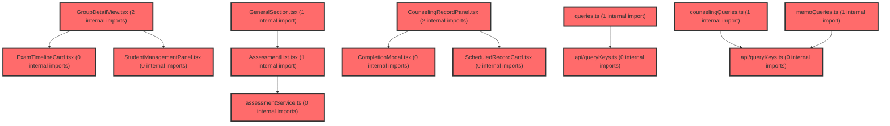

> [!IMPORTANT]
> **⚠️ 수동 검토 권장 (자가힐링 주의)**
>
> AI 자가힐링 결과물이 실제 의도와 다를 수 있으므로, **상세 리뷰 내용에 기반한 수동 점검**을 우선해 주시기 바랍니다. 자가힐링 기능을 활용하실 경우 최종 결과물을 신중하게 확인해 주세요.

# 코드 리뷰 - 3d935413

## 코드 복잡도 분석

**분석된 파일**: 20개 / 변경된 파일: 23개


### Import 의존관계 다이어그램



**범례**: 중심 파일 (변경됨) | 많은 import (10개 이상)


### 정상 범위 (NONE)


**`assessmentservice.ts`** (other)

- 평균 복잡도: **0.003**

- 최대 복잡도: 0.007

- 청크 수: 28개


**권장사항:**

- 파일 크기가 큼 (28개 청크) - 파일 분리 검토


**`queries.ts`** (other)

- 평균 복잡도: **0.003**

- 최대 복잡도: 0.012

- 청크 수: 52개


**권장사항:**

- 파일 크기가 큼 (52개 청크) - 파일 분리 검토


**`counselingqueries.ts`** (other)

- 평균 복잡도: **0.003**

- 최대 복잡도: 0.006

- 청크 수: 24개


**권장사항:**

- 파일 크기가 큼 (24개 청크) - 파일 분리 검토


**`apitooltip.tsx`** (component)

- 평균 복잡도: **0.003**

- 최대 복잡도: 0.013

- 청크 수: 19개


**권장사항:**

- 복잡도 정상 범위


**`memoqueries.ts`** (other)

- 평균 복잡도: **0.002**

- 최대 복잡도: 0.005

- 청크 수: 23개


**권장사항:**

- 파일 크기가 큼 (23개 청크) - 파일 분리 검토


**`assessmentpagev2.tsx`** (component)

- 평균 복잡도: **0.002**

- 최대 복잡도: 0.011

- 청크 수: 48개


**권장사항:**

- 파일 크기가 큼 (48개 청크) - 파일 분리 검토


**`assessmentpage.tsx`** (component)

- 평균 복잡도: **0.002**

- 최대 복잡도: 0.012

- 청크 수: 48개


**권장사항:**

- 파일 크기가 큼 (48개 청크) - 파일 분리 검토


**`examtimelinecard.tsx`** (other)

- 평균 복잡도: **0.001**

- 최대 복잡도: 0.006

- 청크 수: 19개


**권장사항:**

- 복잡도 정상 범위


**`groupdetailview.tsx`** (component)

- 평균 복잡도: **0.001**

- 최대 복잡도: 0.007

- 청크 수: 25개


**권장사항:**

- 파일 크기가 큼 (25개 청크) - 파일 분리 검토


**`studentmanagementpanel.tsx`** (other)

- 평균 복잡도: **0.001**

- 최대 복잡도: 0.004

- 청크 수: 7개


**권장사항:**

- 복잡도 정상 범위


**`querykeys.ts`** (other)

- 평균 복잡도: **0.001**

- 최대 복잡도: 0.004

- 청크 수: 5개


**권장사항:**

- 복잡도 정상 범위


**`assessmentlist.tsx`** (other)

- 평균 복잡도: **0.001**

- 최대 복잡도: 0.009

- 청크 수: 66개


**권장사항:**

- 파일 크기가 큼 (66개 청크) - 파일 분리 검토


**`createassessmentmodal.tsx`** (other)

- 평균 복잡도: **0.001**

- 최대 복잡도: 0.008

- 청크 수: 66개


**권장사항:**

- 파일 크기가 큼 (66개 청크) - 파일 분리 검토


**`querykeys.ts`** (other)

- 평균 복잡도: **0.001**

- 최대 복잡도: 0.002

- 청크 수: 5개


**권장사항:**

- 복잡도 정상 범위


**`observationmemopanel.tsx`** (other)

- 평균 복잡도: **0.001**

- 최대 복잡도: 0.012

- 청크 수: 102개


**권장사항:**

- 파일 크기가 큼 (102개 청크) - 파일 분리 검토


**`typeclassification.tsx`** (other)

- 평균 복잡도: **0.001**

- 최대 복잡도: 0.012

- 청크 수: 49개


**권장사항:**

- 파일 크기가 큼 (49개 청크) - 파일 분리 검토


**`counselingrecordpanel.tsx`** (other)

- 평균 복잡도: **0.001**

- 최대 복잡도: 0.008

- 청크 수: 103개


**권장사항:**

- 파일 크기가 큼 (103개 청크) - 파일 분리 검토


**`generalsection.tsx`** (other)

- 평균 복잡도: **0.000**

- 최대 복잡도: 0.000

- 청크 수: 36개


**권장사항:**

- 파일 크기가 큼 (36개 청크) - 파일 분리 검토


**`completionmodal.tsx`** (other)

- 평균 복잡도: **0.000**

- 최대 복잡도: 0.000

- 청크 수: 50개


**권장사항:**

- 파일 크기가 큼 (50개 청크) - 파일 분리 검토


**`scheduledrecordcard.tsx`** (other)

- 평균 복잡도: **0.000**

- 최대 복잡도: 0.006

- 청크 수: 40개


**권장사항:**

- 파일 크기가 큼 (40개 청크) - 파일 분리 검토


---


## 변경 배경

이 커밋은 검사 시스템(assessment-v2)과 학생 대시보드(student-dashboard)의 **서버 상태 관리를 React Query로 마이그레이션**하고, **UI 중복 클릭 및 동시 요청을 방지**하기 위한 작업입니다.

- **목적**: `useEffect` + `useState` 기반의 수동 fetch 패턴을 React Query로 대체하고, mutation 진행 중 버튼 중복 클릭을 차단하여 사용자 경험과 데이터 일관성 개선
- **도메인**: UI (프론트엔드 상태 관리), 비즈니스 로직 (검사/메모/상담 CRUD)
- **변경 방향**: 명령형 데이터 로딩(`loadXxx()` 호출 후 `setData`)에서 선언적 캐싱(React Query)으로 전환, 버튼 레벨의 `disabled` prop을 통한 중복 요청 방지

---

## [GOOD] 잘된 점

**1. 일관된 query key factory 패턴**

`assessmentKeys`, `studentMemoKeys`, `counselingKeys`를 각 feature별로 분리하여 query key 충돌 위험을 낮췄습니다. 특히 `examListByGroups`에서 `[...claIds].sort()`로 키를 정렬하여, 동일한 그룹 집합에 대해 항상 동일한 캐시 키가 생성되도록 한 점이 좋습니다.

```typescript
// frontend/src/features/assessment/api/queryKeys.ts
examListByGroups: (claIds: readonly string[], tcId: string, paperIdx: string = '1') =>
  [...assessmentKeys.examLists(), { claIds: [...claIds].sort(), tcId, paperIdx }] as const,
```

**2. mutation 후 최소 무효화 원칙 준수**

`useInvalidateAssessmentGroup`에서 `examSlots(claId, userId)`와 `examLists()`만 무효화하여 불필요한 전체 캐시 초기화를 피했습니다. 이는 CLAUDE.md에 명시된 "mutation 후 최소 무효화" 원칙을 잘 따르고 있습니다.

```typescript
// frontend/src/features/assessment/api/queries.ts (라인 72-79)
const useInvalidateAssessmentGroup = () => {
  const queryClient = useQueryClient();
  return async (claId: string, userId: string) => {
    await Promise.all([
      queryClient.invalidateQueries({ queryKey: assessmentKeys.examSlots(claId, userId) }),
      queryClient.invalidateQueries({ queryKey: assessmentKeys.examLists() }),
      queryClient.invalidateQueries({ queryKey: ['group-dgnss-status'] }),
    ]);
  };
};
```

**3. `isActionPending` prop drilling의 실용적 접근**

mutation `isPending` 상태를 상위 페이지(`AssessmentPageV2`)에서 한 번에 계산하여 하위 컴포넌트로 전달함으로써, 각 버튼이 개별 mutation 상태를 알 필요 없이 일관된 중복 클릭 방지를 구현했습니다. 이는 컴포넌트 간 결합도를 낮추는 실용적인 패턴입니다.

```typescript
// frontend/src/pages/assessment-v2/AssessmentPageV2.tsx (라인 260-268)
const isExamActionPending =
  startExamMutation.isPending ||
  endExamMutation.isPending ||
  cancelExamMutation.isPending ||
  restartExamMutation.isPending ||
  previewExamStartMutation.isPending ||
  uploadAnswersExcelMutation.isPending ||
  downloadSampleExcelMutation.isPending;
```

---

## 변경사항 요약

- `assessment-v2`와 `student-dashboard` feature에 React Query 기반 `queries.ts`/`queryKeys.ts` 신규 생성 (총 4개 파일)
- `ObservationMemoPanel`, `CounselingRecordPanel`에서 `useEffect` fetch 패턴 제거 및 React Query 훅으로 대체
- `ExamTimelineCard`, `AssessmentList`, `ScheduledRecordCard`, `CompletionModal` 등 7개 UI 컴포넌트에 `isActionPending`/`isLoading` prop 추가하여 버튼 disabled 처리
- `endExam` 함수에서 미사용 `_paperIdx` 파라미터 제거
- `CreateAssessmentModal`의 `useMemo` deps에 `groups` 추가 (의존성 누락 수정)
- `TypeClassification` 코드 스타일 정리 (포맷팅)
- `CLAUDE.md`에 서버 상태 관리 원칙 문서화

---

## [ISSUE] 개선이 필요한 부분

### Critical (즉시 수정 필요)

없음

---

### High (우선 수정 권장)

#### 1. `useAssessmentExamListByGroupsQuery`의 중복 제거 로직이 `dgnssId`만으로 판단하여 데이터 손실 가능성

**파일**: `frontend/src/features/assessment/api/queries.ts` (라인 24-35)

**문제**: 여러 그룹의 검사 목록을 합칠 때 `dgnssId`만으로 중복을 제거하고 있습니다. 동일한 `dgnssId`를 가진 항목이 서로 다른 `paperIdx`나 `ordNo`를 가질 경우, 나중에 도착한 항목이 무시되어 데이터 손실이 발생할 수 있습니다. 실제 검사 시스템에서 동일한 `dgnssId`가 여러 `paperIdx`(1차/2차)에 걸쳐 재사용될 가능성을 배제할 수 없습니다.

**기존 코드**:
```typescript
const seen = new Set<number>();
return results.flat().filter((item) => {
  if (seen.has(item.dgnssId)) return false;
  seen.add(item.dgnssId);
  return true;
});
```

**해결 방안**: `dgnssId` + `paperIdx` 조합으로 중복을 판단하거나, `Map<number, ExamListItem>`을 사용하여 동일 `dgnssId`의 최신 데이터를 유지하는 방식이 더 안전합니다.

```typescript
const dedupMap = new Map<string, ExamListItem>();
results.flat().forEach((item) => {
  const compositeKey = `${item.dgnssId}-${item.paperIdx}`;
  if (!dedupMap.has(compositeKey)) {
    dedupMap.set(compositeKey, item);
  }
});
return Array.from(dedupMap.values());
```

> **수정 코드 제시 근거**: `ExamListItem` 인터페이스에 `paperIdx` 필드가 존재함을 `assessmentService.ts` 라인 30에서 확인했습니다. `dgnssId`와 `paperIdx`의 조합이 유일성을 보장하는 복합 키 역할을 할 수 있습니다.

---

#### 2. `useAssessmentSlotsQueries`의 `dataByClaId` 타입 추론이 불안정함

**파일**: `frontend/src/features/assessment/api/queries.ts` (라인 42-56)

**문제**: `dataByClaId`의 타입을 `ReturnType<typeof getExamSlots> extends Promise<infer T> ? T : never`로 추론하고 있습니다. 이는 불필요하게 복잡하고 타입스크립트 컴파일러에 따라 추론 결과가 달라질 수 있습니다. 특히 `getExamSlots`의 반환 타입이 변경될 경우, 이 조건부 타입이 의도치 않게 `never`로 평가될 위험이 있습니다.

**기존 코드**:
```typescript
const dataByClaId = new Map<
  string,
  ReturnType<typeof getExamSlots> extends Promise<infer T> ? T : never
>();
```

**해결 방안**: `Awaited<ReturnType<...>>`을 사용하거나, `getExamSlots`의 실제 반환 타입을 명시적으로 import하여 사용하는 것이 더 안전합니다.

```typescript
// 방법 1: Awaited 유틸리티 타입 사용
const dataByClaId = new Map<string, Awaited<ReturnType<typeof getExamSlots>>>();

// 방법 2: 명시적 타입 import (권장)
import type { ExamSlotState } from '@features/assessment-v2/types';
const dataByClaId = new Map<string, ExamSlotState[]>();
```

> **수정 코드 제시 근거**: `examSlotService.ts`의 `getExamSlots` 함수 시그니처를 확인한 결과, 반환 타입이 `ExamSlotState[]`임을 확인했습니다. `Awaited<ReturnType<...>>`는 타입스크립트 4.5+에서 안정적으로 동작합니다.

---

### Medium (개선 권장)

#### 3. `useInvalidateAssessmentGroup`에서 `['group-dgnss-status']` 문자열 키 사용

**파일**: `frontend/src/features/assessment/api/queries.ts` (라인 78)

**문제**: `queryClient.invalidateQueries({ queryKey: ['group-dgnss-status'] })`에서 ad-hoc 문자열 키를 사용하고 있습니다. 이는 CLAUDE.md에 명시된 "ad-hoc 문자열 key를 새로 만들지 않는다"는 원칙에 위배됩니다. 이 키가 어디서 정의되었는지 추적이 어렵고, 향후 리팩토링 시 누락될 위험이 있습니다.

**기존 코드**:
```typescript
await Promise.all([
  queryClient.invalidateQueries({ queryKey: assessmentKeys.examSlots(claId, userId) }),
  queryClient.invalidateQueries({ queryKey: assessmentKeys.examLists() }),
  queryClient.invalidateQueries({ queryKey: ['group-dgnss-status'] }),  // ad-hoc 키
]);
```

**해결 방안**: `['group-dgnss-status']` 키를 `assessmentKeys`에 포함시켜 일관성을 유지하세요.

```typescript
// queryKeys.ts에 추가
groupDgnssStatus: () => [...assessmentKeys.all, 'group-dgnss-status'] as const,

// 사용처
queryClient.invalidateQueries({ queryKey: assessmentKeys.groupDgnssStatus() }),
```

---

#### 4. `useAssessmentSlotsQueries`의 `refetchAll`에서 `void result.refetch()` 사용

**파일**: `frontend/src/features/assessment/api/queries.ts` (라인 59-62)

**문제**: `refetchAll`이 `Promise.all`로 모든 refetch를 기다리지 않고 각각 `void`로 처리하고 있어, 호출자가 모든 refetch 완료를 기다릴 수 없습니다. `AssessmentPageV2`의 `handleRetry`에서 `slotsQueryState.refetchAll()`을 호출하지만, 완료를 기다리지 않아 에러 처리 흐름이 불완전합니다.

**기존 코드**:
```typescript
refetchAll: () => {
  results.forEach((result) => {
    void result.refetch();
  });
},
```

**해결 방안**: `Promise.all`로 감싸서 호출자가 await 할 수 있게 하세요.

```typescript
refetchAll: async () => {
  await Promise.all(results.map((result) => result.refetch()));
},
```

---

#### 5. `invalidateCounselingRecords`의 `queryClient` 타입이 불필요하게 복잡함

**파일**: `frontend/src/features/student-dashboard/api/counselingQueries.ts` (라인 10)

**문제**: `invalidateCounselingRecords`가 `queryClient: ReturnType<typeof useQueryClient>`로 타입을 받고 있습니다. 이는 `useQueryClient`의 반환 타입이 변경될 경우 함께 변경되어야 하는 취약한 패턴입니다.

**기존 코드**:
```typescript
const invalidateCounselingRecords = async (
  queryClient: ReturnType<typeof useQueryClient>,
  studentId: string,
  classId?: string,
) => {
```

**해결 방안**: `QueryClient` 타입을 직접 import하여 사용하세요.

```typescript
import { useMutation, useQuery, useQueryClient, type QueryClient } from '@tanstack/react-query';

const invalidateCounselingRecords = async (
  queryClient: QueryClient,
  studentId: string,
  classId?: string,
) => {
```

---

## 주요 파일 분석

### `frontend/src/features/assessment/api/queries.ts` (신규)

**변경 내용**: 검사 시스템의 모든 서버 상태를 React Query 훅으로 래핑. 3개의 query 훅(`useAssessmentExamListByGroupsQuery`, `useAssessmentSlotsQueries`, `useAssessmentGroupMembersQuery`)과 6개의 mutation 훅(`useStartExamMutation`, `useEndExamMutation`, `useCancelExamMutation`, `useRestartExamMutation`, `usePreviewExamStartMutation`, `useUploadAnswersExcelMutation`, `useDownloadSampleExcelMutation`)을 제공.

**핵심 설계**: `useInvalidateAssessmentGroup`이라는 커스텀 훅을 내부에 두고, 모든 mutation의 `onSuccess`에서 이를 호출하여 일관된 캐시 무효화를 보장합니다. 이는 mutation마다 개별적으로 무효화 로직을 작성하는 것보다 유지보수성이 높습니다.

**개선 제안 요약**:
1. `useAssessmentExamListByGroupsQuery`의 중복 제거 로직을 `dgnssId` + `paperIdx` 복합 키로 변경 (High)
2. `dataByClaId`의 타입을 `Awaited<ReturnType<...>>` 또는 명시적 타입으로 변경 (High)
3. `['group-dgnss-status']` 문자열 키를 `assessmentKeys`로 이동 (Medium)
4. `refetchAll`을 `async`로 변경하여 `Promise.all` 사용 (Medium)

---

### `frontend/src/features/student-dashboard/api/counselingQueries.ts` (신규)

**변경 내용**: 상담 기록 CRUD를 React Query mutation으로 래핑. `invalidateCounselingRecords` 헬퍼를 통해 student/class 단위 캐시 무효화를 수행.

**핵심 설계**: `useCreateCounselingMutation`, `useUpdateCounselingMutation`, `useDeleteCounselingMutation`, `useCompleteCounselingMutation` 모두 `onSuccess`에서 `invalidateCounselingRecords`를 호출하여, 상담 기록이 변경될 때마다 해당 학생과 반의 캐시를 함께 무효화합니다. 이는 상담 기록이 학생 프로필과 반 단위 대시보드 양쪽에 표시될 가능성을 고려한 설계입니다.

**개선 제안 요약**:
1. `queryClient: ReturnType<typeof useQueryClient>`를 `queryClient: QueryClient`로 변경 (Medium)

---

### `frontend/src/pages/assessment-v2/AssessmentPageV2.tsx`

**변경 내용**: `useEffect` 제거, React Query 훅으로 대체, `isExamActionPending` 계산 로직 추가, `GroupDetailView`에 `isActionPending`/`isMembersLoading` prop 전달.

**핵심 설계**: 페이지 레벨에서 모든 mutation의 `isPending` 상태를 OR 연산으로 결합하여 `isExamActionPending`을 계산합니다. 이 값을 `GroupDetailView` -> `ExamTimelineCard` -> `ActionButtons`로 prop drilling하여, 어떤 액션이 진행 중일 때 모든 버튼을 일괄 비활성화합니다. 이는 단순하지만 효과적인 중복 요청 방지 패턴입니다.

**참고 사항**: `isExamActionPending`에 `previewExamStartMutation.isPending`이 포함되어 있습니다. `previewExamStartMutation`은 검증(validation) 목적의 mutation으로, 실제 검사 액션과는 성격이 다릅니다. 검증 중에는 "검사 시작" 버튼만 막고 다른 액션(종료/취소/엑셀 업로드)은 허용하는 것이 사용자 경험에 더 좋을 수 있습니다. 다만 현재 구현에서 `handleStartExam` 내부에서 `previewExamStartMutation.isPending`을 별도로 체크하고 있으므로, 기능상 문제는 없습니다.

---

### `frontend/src/features/student-dashboard/ui/ObservationMemoPanel.tsx`

**변경 내용**: `useEffect` + `useState` 기반의 수동 fetch 패턴을 React Query로 대체. `memoService.getByStudentId(studentId)` 직접 호출 대신 `useStudentMemosQuery(studentId)` 사용.

**핵심 설계**: `isSubmittingMemo`와 `isDeletingMemo`라는 두 개의 pending 상태 플래그를 도입하여, 저장/수정 중에는 취소 버튼과 저장 버튼을 비활성화하고, 삭제 중에는 편집/삭제 버튼을 비활성화합니다. 이는 사용자가 연속으로 클릭하더라도 중복 요청이 발생하지 않도록 보장합니다.

**변경 전후 비교**:
- 변경 전: `loadMemos()`를 수동 호출하여 `setMemos(data)`로 상태 업데이트
- 변경 후: React Query가 자동으로 캐시를 관리하고, mutation 성공 시 `invalidateQueries`로 최신 데이터 반영

---

### `frontend/src/features/student-dashboard/ui/counseling/CounselingRecordPanel.tsx`

**변경 내용**: `useEffect` + `useState` 기반의 수동 fetch 패턴을 React Query로 대체. `counselingService.getByStudentId(studentId)` 직접 호출 대신 `useStudentCounselingRecordsQuery(studentId)` 사용.

**핵심 설계**: 4개의 mutation(`createCounselingMutation`, `updateCounselingMutation`, `deleteCounselingMutation`, `completeCounselingMutation`)의 `isPending` 상태를 각각 추적하여, `isSubmittingCounseling`, `isDeletingCounseling`, `isCompletingCounseling`, `isUpdatingReason`으로 분리했습니다. 이를 통해 각 액션에 대해 정밀한 버튼 제어가 가능합니다.

**특이사항**: `ScheduledRecordCard`에 `isActionPending` prop을 전달할 때, 4개의 pending 상태를 모두 OR 결합하여 전달합니다. 이는 `ScheduledRecordCard` 내부에서 개별 mutation 상태를 알 필요 없이, "무언가 진행 중이면 모든 액션을 막는다"는 단순한 규칙을 적용하기 위함입니다.

---

## 최종 평가

**결론**:
- [ ] [OK] **승인 (Approved)** - Critical/High 이슈 없음
- [ ] [WARN] **조건부 승인 (Approved with Comments)** - Medium 이하 이슈만 존재
- [X] [FIX] **수정 필요 (Changes Requested)** - Critical/High 이슈 존재

**종합 의견**:

전반적으로 React Query 마이그레이션 방향성과 중복 클릭 방지 처리가 잘 이루어졌습니다. `useEffect` fetch 패턴을 제거하고 선언적 캐싱으로 전환한 것은 장기적으로 유지보수성과 데이터 일관성에 큰 도움이 됩니다. query key factory 패턴과 mutation 후 최소 무효화 원칙도 잘 지켜지고 있습니다.

다만 다음 두 가지 High 이슈는 반드시 수정이 필요합니다:

1. **`useAssessmentExamListByGroupsQuery`의 `dgnssId` 단일 키 중복 제거**: 실제 운영 데이터에서 동일한 `dgnssId`가 여러 `paperIdx`(1차/2차)에 걸쳐 존재할 경우, `paperIdx`가 다른 항목이 무시되어 데이터 손실로 이어질 수 있습니다. `dgnssId` + `paperIdx` 복합 키로 변경해야 합니다.

2. **`dataByClaId`의 조건부 타입 추론**: `ReturnType<typeof getExamSlots> extends Promise<infer T> ? T : never`는 타입스크립트 컴파일러에 따라 `never`로 평가될 위험이 있습니다. `Awaited<ReturnType<...>>` 또는 명시적 타입 import로 변경해야 합니다.

이 두 가지만 보완되면 바로 승인 가능한 수준입니다. 수고하셨습니다.