> [!IMPORTANT]
> **⚠️ 수동 검토 권장 (자가힐링 주의)**
>
> AI 자가힐링 결과물이 실제 의도와 다를 수 있으므로, **상세 리뷰 내용에 기반한 수동 점검**을 우선해 주시기 바랍니다. 자가힐링 기능을 활용하실 경우 최종 결과물을 신중하게 확인해 주세요.

# 코드 리뷰 - 3ff32cf4

## 코드 복잡도 분석

**분석된 파일**: 110개 / 변경된 파일: 110개


### Import 의존관계 다이어그램

```mermaid
flowchart TD
    F0["GroupListView.tsx (1 internal import)"]:::center
    F1["ClassSummarySection.tsx (1 internal import)"]:::center
    F2["ErrorReportModal.tsx (0 internal imports)"]:::center
    F3["ExamTimelineCard.tsx (1 internal import)"]:::center
    F4["ExamGuideStep.tsx (2 internal imports)"]:::center
    F5["AssessmentList.tsx (1 internal import)"]:::center
    F6["SchoolSearchModal.tsx (1 internal import)"]:::center
    F7["GroupDetailView.tsx (3 internal imports)"]:::center
    F8["ExamProgress.tsx (0 internal imports)"]:::center
    F9["CoachingStrategy.styles.ts (0 internal imports)"]:::center
    F10["agentApiService.ts (0 internal imports)"]:::center
    F11["ChatArea.tsx (1 internal import)"]:::center
    F12["utils.ts (0 internal imports)"]:::center
    F13["StudentManagementPanel.tsx (0 internal imports)"]:::center
    F14["schoolSearchService.ts (0 internal imports)"]:::center
    F15["QRCodeModal.tsx (0 internal imports)"]:::center
    F16["AiChatPanel.tsx (1 internal import)"]:::center
    F17["dashboardService.ts (0 internal imports)"]:::center
    F18["useClassProfile.ts (0 internal imports)"]:::center
    F19["ScheduleStudentPicker.tsx (0 internal imports)"]:::center
    F20["assessmentService.ts (0 internal imports)"]:::center
    F21["CoachingStrategy.tsx (1 internal import)"]:::center
    F22["ScheduleModal.tsx (1 internal import)"]:::center
    F23["contextBuilder.ts (0 internal imports)"]:::center
    F24["TypeDeviations.tsx (1 internal import)"]:::center
    F25["ProfileCard.tsx (1 internal import)"]:::center
    F26["ClassInsights.tsx (1 internal import)"]:::center
    F27["ExamQuestionStep.tsx (1 internal import)"]:::center
    F28["assistantService.ts (2 internal imports)"]:::center
    F29["ExamStartPreviewModal.tsx (1 internal import)"]:::center
    F30["DataHelperAnswer.tsx (0 internal imports)"]:::center
    F31["StrategySection.tsx (1 internal import)"]:::center
    F32["GroupCard.tsx (1 internal import)"]:::center
    F28 --> F23
    F28 --> F10
    F11 --> F2
    F3 --> F12
    F32 --> F12
    F7 --> F15
    F7 --> F13
    F7 --> F3
    F0 --> F32
    F5 --> F20
    F29 --> F20
    F26 --> F18
    F1 --> F18
    F25 --> F18
    F31 --> F18
    F4 --> F14
    F4 --> F6
    F27 --> F8
    F6 --> F14
    F21 --> F9
    F22 --> F19
    F16 --> F30
    F24 --> F17
    classDef center fill:#ff6b6b,stroke:#333,stroke-width:3px
    classDef high fill:#ffd93d,stroke:#333,stroke-width:2px
```



**범례**: 중심 파일 (변경됨) | 많은 import (10개 이상)


### 정상 범위 (NONE)


**`badge.tsx`** (other)

- 평균 복잡도: **0.248**

- 최대 복잡도: 0.472

- 청크 수: 15개

- 평균 사용처: 22.2곳


**권장사항:**

- 복잡도 정상 범위


**`main.tsx`** (other)

- 평균 복잡도: **0.173**

- 최대 복잡도: 0.461

- 청크 수: 8개

- 평균 사용처: 14.4곳


**권장사항:**

- 복잡도 정상 범위


**`client.ts`** (other)

- 평균 복잡도: **0.082**

- 최대 복잡도: 0.473

- 청크 수: 33개

- 평균 사용처: 2.8곳


**권장사항:**

- 파일 크기가 큼 (33개 청크) - 파일 분리 검토


**`routes.tsx`** (other)

- 평균 복잡도: **0.078**

- 최대 복잡도: 0.463

- 청크 수: 16개

- 평균 사용처: 3.5곳


**권장사항:**

- 복잡도 정상 범위


**`factordefinitions.ts`** (other)

- 평균 복잡도: **0.008**

- 최대 복잡도: 0.008

- 청크 수: 1개


**권장사항:**

- 복잡도 정상 범위


**`env.ts`** (config)

- 평균 복잡도: **0.006**

- 최대 복잡도: 0.006

- 청크 수: 1개


**권장사항:**

- Config 파일은 높은 연결도가 정상적임


**`chatapiservice.ts`** (other)

- 평균 복잡도: **0.004**

- 최대 복잡도: 0.008

- 청크 수: 18개


**권장사항:**

- 복잡도 정상 범위


**`agentapiservice.ts`** (other)

- 평균 복잡도: **0.003**

- 최대 복잡도: 0.010

- 청크 수: 8개


**권장사항:**

- 복잡도 정상 범위


**`examslotservice.ts`** (other)

- 평균 복잡도: **0.003**

- 최대 복잡도: 0.013

- 청크 수: 5개


**권장사항:**

- 복잡도 정상 범위


**`assessmentservice.ts`** (other)

- 평균 복잡도: **0.003**

- 최대 복잡도: 0.007

- 청크 수: 28개


**권장사항:**

- 파일 크기가 큼 (28개 청크) - 파일 분리 검토


**`schoolsearchservice.ts`** (other)

- 평균 복잡도: **0.003**

- 최대 복잡도: 0.006

- 청크 수: 13개


**권장사항:**

- 복잡도 정상 범위


**`apidevmodecontext.tsx`** (other)

- 평균 복잡도: **0.003**

- 최대 복잡도: 0.004

- 청크 수: 8개


**권장사항:**

- 복잡도 정상 범위


**`qchlogger.ts`** (other)

- 평균 복잡도: **0.003**

- 최대 복잡도: 0.006

- 청크 수: 12개


**권장사항:**

- 복잡도 정상 범위


**`ai.ts`** (other)

- 평균 복잡도: **0.003**

- 최대 복잡도: 0.010

- 청크 수: 26개


**권장사항:**

- 파일 크기가 큼 (26개 청크) - 파일 분리 검토


**`apidatatransformer.ts`** (other)

- 평균 복잡도: **0.003**

- 최대 복잡도: 0.008

- 청크 수: 39개


**권장사항:**

- 파일 크기가 큼 (39개 청크) - 파일 분리 검토


**`dashboardservice.ts`** (other)

- 평균 복잡도: **0.003**

- 최대 복잡도: 0.010

- 청크 수: 60개


**권장사항:**

- 파일 크기가 큼 (60개 청크) - 파일 분리 검토


**`pdfdownloadservice.ts`** (other)

- 평균 복잡도: **0.003**

- 최대 복잡도: 0.009

- 청크 수: 18개


**권장사항:**

- 복잡도 정상 범위


**`calculate4stepdiagnosis.ts`** (utility)

- 평균 복잡도: **0.003**

- 최대 복잡도: 0.012

- 청크 수: 18개


**권장사항:**

- 복잡도 정상 범위


**`recordgenerator.ts`** (utility)

- 평균 복잡도: **0.003**

- 최대 복잡도: 0.008

- 청크 수: 33개


**권장사항:**

- 파일 크기가 큼 (33개 청크) - 파일 분리 검토


**`assistantservice.ts`** (other)

- 평균 복잡도: **0.002**

- 최대 복잡도: 0.008

- 청크 수: 11개


**권장사항:**

- 복잡도 정상 범위


**`contextbuilder.ts`** (other)

- 평균 복잡도: **0.002**

- 최대 복잡도: 0.008

- 청크 수: 41개


**권장사항:**

- 파일 크기가 큼 (41개 청크) - 파일 분리 검토


**`useconversations.ts`** (other)

- 평균 복잡도: **0.002**

- 최대 복잡도: 0.010

- 청크 수: 66개


**권장사항:**

- 파일 크기가 큼 (66개 청크) - 파일 분리 검토


**`utils.ts`** (utility)

- 평균 복잡도: **0.002**

- 최대 복잡도: 0.006

- 청크 수: 15개


**권장사항:**

- 복잡도 정상 범위


**`authcontext.tsx`** (other)

- 평균 복잡도: **0.002**

- 최대 복잡도: 0.008

- 청크 수: 15개


**권장사항:**

- 복잡도 정상 범위


**`examauthstep.tsx`** (other)

- 평균 복잡도: **0.002**

- 최대 복잡도: 0.010

- 청크 수: 14개


**권장사항:**

- 복잡도 정상 범위


**`usenotificationstream.ts`** (other)

- 평균 복잡도: **0.002**

- 최대 복잡도: 0.009

- 청크 수: 12개


**권장사항:**

- 복잡도 정상 범위


**`assessmentpage.tsx`** (component)

- 평균 복잡도: **0.002**

- 최대 복잡도: 0.011

- 청크 수: 52개


**권장사항:**

- 파일 크기가 큼 (52개 청크) - 파일 분리 검토


**`datacontext.tsx`** (other)

- 평균 복잡도: **0.002**

- 최대 복잡도: 0.007

- 청크 수: 23개


**권장사항:**

- 파일 크기가 큼 (23개 청크) - 파일 분리 검토


**`selfregfactors.ts`** (other)

- 평균 복잡도: **0.002**

- 최대 복잡도: 0.007

- 청크 수: 19개


**권장사항:**

- 복잡도 정상 범위


**`usessepoc.ts`** (other)

- 평균 복잡도: **0.002**

- 최대 복잡도: 0.005

- 청크 수: 11개


**권장사항:**

- 복잡도 정상 범위


**`pdfextractionservice.ts`** (other)

- 평균 복잡도: **0.002**

- 최대 복잡도: 0.010

- 청크 수: 21개


**권장사항:**

- 파일 크기가 큼 (21개 청크) - 파일 분리 검토


**`classcomparisonutils.ts`** (utility)

- 평균 복잡도: **0.002**

- 최대 복잡도: 0.008

- 청크 수: 24개


**권장사항:**

- 파일 크기가 큼 (24개 청크) - 파일 분리 검토


**`errorboundaryprovider.tsx`** (other)

- 평균 복잡도: **0.001**

- 최대 복잡도: 0.005

- 청크 수: 7개


**권장사항:**

- 복잡도 정상 범위


**`contextmodeselector.tsx`** (other)

- 평균 복잡도: **0.001**

- 최대 복잡도: 0.007

- 청크 수: 19개


**권장사항:**

- 복잡도 정상 범위


**`examtimelinecard.tsx`** (other)

- 평균 복잡도: **0.001**

- 최대 복잡도: 0.006

- 청크 수: 18개


**권장사항:**

- 복잡도 정상 범위


**`groupdetailview.tsx`** (component)

- 평균 복잡도: **0.001**

- 최대 복잡도: 0.007

- 청크 수: 25개


**권장사항:**

- 파일 크기가 큼 (25개 청크) - 파일 분리 검토


**`grouplistview.tsx`** (component)

- 평균 복잡도: **0.001**

- 최대 복잡도: 0.004

- 청크 수: 9개


**권장사항:**

- 복잡도 정상 범위


**`qrcodemodal.tsx`** (other)

- 평균 복잡도: **0.001**

- 최대 복잡도: 0.006

- 청크 수: 10개


**권장사항:**

- 복잡도 정상 범위


**`studentmanagementpanel.tsx`** (other)

- 평균 복잡도: **0.001**

- 최대 복잡도: 0.004

- 청크 수: 7개


**권장사항:**

- 복잡도 정상 범위


**`assessmentlist.tsx`** (other)

- 평균 복잡도: **0.001**

- 최대 복잡도: 0.009

- 청크 수: 66개


**권장사항:**

- 파일 크기가 큼 (66개 청크) - 파일 분리 검토


**`createassessmentmodal.tsx`** (other)

- 평균 복잡도: **0.001**

- 최대 복잡도: 0.008

- 청크 수: 66개


**권장사항:**

- 파일 크기가 큼 (66개 청크) - 파일 분리 검토


**`useclassprofile.ts`** (other)

- 평균 복잡도: **0.001**

- 최대 복잡도: 0.006

- 청크 수: 17개


**권장사항:**

- 복잡도 정상 범위


**`typechangechart.tsx`** (other)

- 평균 복잡도: **0.001**

- 최대 복잡도: 0.008

- 청크 수: 84개


**권장사항:**

- 파일 크기가 큼 (84개 청크) - 파일 분리 검토


**`riskstudentssection.tsx`** (other)

- 평균 복잡도: **0.001**

- 최대 복잡도: 0.010

- 청크 수: 60개


**권장사항:**

- 파일 크기가 큼 (60개 청크) - 파일 분리 검토


**`strategysection.tsx`** (other)

- 평균 복잡도: **0.001**

- 최대 복잡도: 0.009

- 청크 수: 32개


**권장사항:**

- 파일 크기가 큼 (32개 청크) - 파일 분리 검토


**`guestexamcard.tsx`** (other)

- 평균 복잡도: **0.001**

- 최대 복잡도: 0.013

- 청크 수: 51개


**권장사항:**

- 파일 크기가 큼 (51개 청크) - 파일 분리 검토


**`coachingstrategy.styles.ts`** (other)

- 평균 복잡도: **0.001**

- 최대 복잡도: 0.009

- 청크 수: 154개


**권장사항:**

- 파일 크기가 큼 (154개 청크) - 파일 분리 검토


**`notificationitem.styles.ts`** (other)

- 평균 복잡도: **0.001**

- 최대 복잡도: 0.006

- 청크 수: 17개


**권장사항:**

- 복잡도 정상 범위


**`schedulemodal.tsx`** (other)

- 평균 복잡도: **0.001**

- 최대 복잡도: 0.013

- 청크 수: 52개


**권장사항:**

- 파일 크기가 큼 (52개 청크) - 파일 분리 검토


**`usecoachingstrategy.ts`** (other)

- 평균 복잡도: **0.001**

- 최대 복잡도: 0.002

- 청크 수: 2개


**권장사항:**

- 복잡도 정상 범위


**`aichatpanel.tsx`** (other)

- 평균 복잡도: **0.001**

- 최대 복잡도: 0.004

- 청크 수: 48개


**권장사항:**

- 파일 크기가 큼 (48개 청크) - 파일 분리 검토


**`datahelperanswer.tsx`** (utility)

- 평균 복잡도: **0.001**

- 최대 복잡도: 0.014

- 청크 수: 35개


**권장사항:**

- 파일 크기가 큼 (35개 청크) - 파일 분리 검토


**`observationmemopanel.tsx`** (other)

- 평균 복잡도: **0.001**

- 최대 복잡도: 0.010

- 청크 수: 102개


**권장사항:**

- 파일 크기가 큼 (102개 청크) - 파일 분리 검토


**`schoolrecordpanel.tsx`** (other)

- 평균 복잡도: **0.001**

- 최대 복잡도: 0.007

- 청크 수: 59개


**권장사항:**

- 파일 크기가 큼 (59개 청크) - 파일 분리 검토


**`typeclassification.tsx`** (other)

- 평균 복잡도: **0.001**

- 최대 복잡도: 0.006

- 청크 수: 47개


**권장사항:**

- 파일 크기가 큼 (47개 청크) - 파일 분리 검토


**`counselingrecordpanel.tsx`** (other)

- 평균 복잡도: **0.001**

- 최대 복잡도: 0.013

- 청크 수: 107개


**권장사항:**

- 파일 크기가 큼 (107개 청크) - 파일 분리 검토


**`baritem.tsx`** (other)

- 평균 복잡도: **0.001**

- 최대 복잡도: 0.012

- 청크 수: 26개


**권장사항:**

- 파일 크기가 큼 (26개 청크) - 파일 분리 검토


**`subsection.tsx`** (other)

- 평균 복잡도: **0.001**

- 최대 복잡도: 0.006

- 청크 수: 24개


**권장사항:**

- 파일 크기가 큼 (24개 청크) - 파일 분리 검토


**`categorycomparisonchart.tsx`** (other)

- 평균 복잡도: **0.001**

- 최대 복잡도: 0.004

- 청크 수: 11개


**권장사항:**

- 복잡도 정상 범위


**`selfregcomparisonsection.tsx`** (other)

- 평균 복잡도: **0.001**

- 최대 복잡도: 0.007

- 청크 수: 93개


**권장사항:**

- 파일 크기가 큼 (93개 청크) - 파일 분리 검토


**`classdetailanalysispage.tsx`** (component)

- 평균 복잡도: **0.001**

- 최대 복잡도: 0.006

- 청크 수: 30개


**권장사항:**

- 파일 크기가 큼 (30개 청크) - 파일 분리 검토


**`examcodeentrypage.tsx`** (component)

- 평균 복잡도: **0.001**

- 최대 복잡도: 0.011

- 청크 수: 22개


**권장사항:**

- 파일 크기가 큼 (22개 청크) - 파일 분리 검토


**`selfregstudentdashboardpage.tsx`** (component)

- 평균 복잡도: **0.001**

- 최대 복잡도: 0.011

- 청크 수: 90개


**권장사항:**

- 파일 크기가 큼 (90개 청크) - 파일 분리 검토


**`factorheatmapsection.tsx`** (component)

- 평균 복잡도: **0.001**

- 최대 복잡도: 0.012

- 청크 수: 66개


**권장사항:**

- 파일 크기가 큼 (66개 청크) - 파일 분리 검토


**`datatransformer.ts`** (other)

- 평균 복잡도: **0.001**

- 최대 복잡도: 0.007

- 청크 수: 27개


**권장사항:**

- 파일 크기가 큼 (27개 청크) - 파일 분리 검토


**`usespauth.ts`** (other)

- 평균 복잡도: **0.001**

- 최대 복잡도: 0.007

- 청크 수: 10개


**권장사항:**

- 복잡도 정상 범위


**`levelbadge.tsx`** (other)

- 평균 복잡도: **0.001**

- 최대 복잡도: 0.004

- 청크 수: 12개


**권장사항:**

- 복잡도 정상 범위


**`classdashboardv2widget.tsx`** (other)

- 평균 복잡도: **0.001**

- 최대 복잡도: 0.012

- 청크 수: 167개


**권장사항:**

- 파일 크기가 큼 (167개 청크) - 파일 분리 검토


**`classdashboardwidget.tsx`** (other)

- 평균 복잡도: **0.001**

- 최대 복잡도: 0.009

- 청크 수: 131개


**권장사항:**

- 파일 크기가 큼 (131개 청크) - 파일 분리 검토


**`schedulewidget.tsx`** (other)

- 평균 복잡도: **0.001**

- 최대 복잡도: 0.006

- 청크 수: 100개


**권장사항:**

- 파일 크기가 큼 (100개 청크) - 파일 분리 검토


**`comparisonsection.tsx`** (other)

- 평균 복잡도: **0.001**

- 최대 복잡도: 0.012

- 청크 수: 99개


**권장사항:**

- 파일 크기가 큼 (99개 청크) - 파일 분리 검토


**`chatarea.tsx`** (other)

- 평균 복잡도: **0.000**

- 최대 복잡도: 0.008

- 청크 수: 82개


**권장사항:**

- 파일 크기가 큼 (82개 청크) - 파일 분리 검토


**`classpickermodal.tsx`** (other)

- 평균 복잡도: **0.000**

- 최대 복잡도: 0.002

- 청크 수: 25개


**권장사항:**

- 파일 크기가 큼 (25개 청크) - 파일 분리 검토


**`conversationsidebar.tsx`** (other)

- 평균 복잡도: **0.000**

- 최대 복잡도: 0.002

- 청크 수: 25개


**권장사항:**

- 파일 크기가 큼 (25개 청크) - 파일 분리 검토


**`errorreportmodal.tsx`** (other)

- 평균 복잡도: **0.000**

- 최대 복잡도: 0.011

- 청크 수: 136개


**권장사항:**

- 파일 크기가 큼 (136개 청크) - 파일 분리 검토


**`emptystate.tsx`** (store)

- 평균 복잡도: **0.000**

- 최대 복잡도: 0.000

- 청크 수: 2개


**권장사항:**

- Store 파일은 높은 연결도가 정상적임


**`groupcard.tsx`** (other)

- 평균 복잡도: **0.000**

- 최대 복잡도: 0.000

- 청크 수: 4개


**권장사항:**

- 복잡도 정상 범위


**`datareviewtable.tsx`** (component)

- 평균 복잡도: **0.000**

- 최대 복잡도: 0.008

- 청크 수: 41개


**권장사항:**

- 파일 크기가 큼 (41개 청크) - 파일 분리 검토


**`examstartpreviewmodal.tsx`** (component)

- 평균 복잡도: **0.000**

- 최대 복잡도: 0.005

- 청크 수: 39개


**권장사항:**

- 파일 크기가 큼 (39개 청크) - 파일 분리 검토


**`pdfdropzone.tsx`** (other)

- 평균 복잡도: **0.000**

- 최대 복잡도: 0.003

- 청크 수: 36개


**권장사항:**

- 파일 크기가 큼 (36개 청크) - 파일 분리 검토


**`testloginform.tsx`** (other)

- 평균 복잡도: **0.000**

- 최대 복잡도: 0.010

- 청크 수: 76개


**권장사항:**

- 파일 크기가 큼 (76개 청크) - 파일 분리 검토


**`classinsights.tsx`** (other)

- 평균 복잡도: **0.000**

- 최대 복잡도: 0.006

- 청크 수: 91개


**권장사항:**

- 파일 크기가 큼 (91개 청크) - 파일 분리 검토


**`classsummarysection.tsx`** (other)

- 평균 복잡도: **0.000**

- 최대 복잡도: 0.013

- 청크 수: 45개


**권장사항:**

- 파일 크기가 큼 (45개 청크) - 파일 분리 검토


**`profilecard.tsx`** (other)

- 평균 복잡도: **0.000**

- 최대 복잡도: 0.006

- 청크 수: 25개


**권장사항:**

- 파일 크기가 큼 (25개 청크) - 파일 분리 검토


**`richtexteditor.tsx`** (other)

- 평균 복잡도: **0.000**

- 최대 복잡도: 0.006

- 청크 수: 17개


**권장사항:**

- 복잡도 정상 범위


**`examguidestep.tsx`** (other)

- 평균 복잡도: **0.000**

- 최대 복잡도: 0.009

- 청크 수: 111개


**권장사항:**

- 파일 크기가 큼 (111개 청크) - 파일 분리 검토


**`examprogress.tsx`** (other)

- 평균 복잡도: **0.000**

- 최대 복잡도: 0.004

- 청크 수: 27개


**권장사항:**

- 파일 크기가 큼 (27개 청크) - 파일 분리 검토


**`examquestionstep.tsx`** (other)

- 평균 복잡도: **0.000**

- 최대 복잡도: 0.000

- 청크 수: 30개


**권장사항:**

- 파일 크기가 큼 (30개 청크) - 파일 분리 검토


**`guestexamentrystep.tsx`** (other)

- 평균 복잡도: **0.000**

- 최대 복잡도: 0.008

- 청크 수: 42개


**권장사항:**

- 파일 크기가 큼 (42개 청크) - 파일 분리 검토


**`membercompletestep.tsx`** (other)

- 평균 복잡도: **0.000**

- 최대 복잡도: 0.001

- 청크 수: 33개


**권장사항:**

- 파일 크기가 큼 (33개 청크) - 파일 분리 검토


**`numberentrystep.tsx`** (other)

- 평균 복잡도: **0.000**

- 최대 복잡도: 0.006

- 청크 수: 39개


**권장사항:**

- 파일 크기가 큼 (39개 청크) - 파일 분리 검토


**`resumechoicestep.tsx`** (other)

- 평균 복잡도: **0.000**

- 최대 복잡도: 0.000

- 청크 수: 48개


**권장사항:**

- 파일 크기가 큼 (48개 청크) - 파일 분리 검토


**`schoolsearchmodal.tsx`** (other)

- 평균 복잡도: **0.000**

- 최대 복잡도: 0.003

- 청크 수: 48개


**권장사항:**

- 파일 크기가 큼 (48개 청크) - 파일 분리 검토


**`studentidentrystep.tsx`** (other)

- 평균 복잡도: **0.000**

- 최대 복잡도: 0.008

- 청크 수: 39개


**권장사항:**

- 파일 크기가 큼 (39개 청크) - 파일 분리 검토


**`guestcompletepage.tsx`** (component)

- 평균 복잡도: **0.000**

- 최대 복잡도: 0.002

- 청크 수: 68개


**권장사항:**

- 파일 크기가 큼 (68개 청크) - 파일 분리 검토


**`coachingstrategy.tsx`** (other)

- 평균 복잡도: **0.000**

- 최대 복잡도: 0.001

- 청크 수: 5개


**권장사항:**

- 복잡도 정상 범위


**`notificationpanel.tsx`** (other)

- 평균 복잡도: **0.000**

- 최대 복잡도: 0.002

- 청크 수: 11개


**권장사항:**

- 복잡도 정상 범위


**`schedulestudentpicker.tsx`** (other)

- 평균 복잡도: **0.000**

- 최대 복잡도: 0.007

- 청크 수: 102개


**권장사항:**

- 파일 크기가 큼 (102개 청크) - 파일 분리 검토


**`datahelperquestions.tsx`** (utility)

- 평균 복잡도: **0.000**

- 최대 복잡도: 0.001

- 청크 수: 33개


**권장사항:**

- 파일 크기가 큼 (33개 청크) - 파일 분리 검토


**`fourstepinterpretation.tsx`** (other)

- 평균 복잡도: **0.000**

- 최대 복잡도: 0.007

- 청크 수: 133개


**권장사항:**

- 파일 크기가 큼 (133개 청크) - 파일 분리 검토


**`selfregfactoranalysis.tsx`** (other)

- 평균 복잡도: **0.000**

- 최대 복잡도: 0.006

- 청크 수: 39개


**권장사항:**

- 파일 크기가 큼 (39개 청크) - 파일 분리 검토


**`typedeviations.tsx`** (other)

- 평균 복잡도: **0.000**

- 최대 복잡도: 0.004

- 청크 수: 23개


**권장사항:**

- 파일 크기가 큼 (23개 청크) - 파일 분리 검토


**`fourstepinterpretation.tsx`** (other)

- 평균 복잡도: **0.000**

- 최대 복잡도: 0.007

- 청크 수: 88개


**권장사항:**

- 파일 크기가 큼 (88개 청크) - 파일 분리 검토


**`myexamlistpage.tsx`** (component)

- 평균 복잡도: **0.000**

- 최대 복잡도: 0.005

- 청크 수: 105개


**권장사항:**

- 파일 크기가 큼 (105개 청크) - 파일 분리 검토


**`myselfregresultpage.tsx`** (component)

- 평균 복잡도: **0.000**

- 최대 복잡도: 0.008

- 청크 수: 119개


**권장사항:**

- 파일 크기가 큼 (119개 청크) - 파일 분리 검토


**`studentgroupspage.tsx`** (component)

- 평균 복잡도: **0.000**

- 최대 복잡도: 0.008

- 청크 수: 75개


**권장사항:**

- 파일 크기가 큼 (75개 청크) - 파일 분리 검토


**`counselingdashboardpage.tsx`** (component)

- 평균 복잡도: **0.000**

- 최대 복잡도: 0.006

- 청크 수: 38개


**권장사항:**

- 파일 크기가 큼 (38개 청크) - 파일 분리 검토


**`selfregclassdashboardwidget.tsx`** (other)

- 평균 복잡도: **0.000**

- 최대 복잡도: 0.007

- 청크 수: 111개


**권장사항:**

- 파일 크기가 큼 (111개 청크) - 파일 분리 검토


**`mainlayout.tsx`** (other)

- 평균 복잡도: **0.000**

- 최대 복잡도: 0.008

- 청크 수: 136개


**권장사항:**

- 파일 크기가 큼 (136개 청크) - 파일 분리 검토


**`studentlayout.tsx`** (other)

- 평균 복잡도: **0.000**

- 최대 복잡도: 0.008

- 청크 수: 98개


**권장사항:**

- 파일 크기가 큼 (98개 청크) - 파일 분리 검토


---


## 변경 배경

이 커밋은 **코드 포맷팅 일관성 확보**와 **데이터 모델 필드명 리팩토링**을 목적으로 합니다. ESLint/Prettier 설정에 따른 자동 정렬(JSX 속성, styled-components 템플릿 리터럴, 객체 구조 분해), JSX 문자열 속성의 따옴표 통일, 그리고 `contextBuilder.ts`에서 `ClassProfileItem`의 필드명 변경이 핵심입니다.

- **목적**: 코드 스타일 일관성 확보 및 AI 컨텍스트 빌더의 데이터 모델 최신화
- **도메인**: UI (프론트엔드 컴포넌트) / 비즈니스 로직 (AI 컨텍스트 빌더)
- **변경 방향**: Prettier 자동 포맷팅 적용으로 코드 정렬 개선, `ClassProfileItem` 인터페이스 변경에 따른 컨텍스트 빌더 필드명 동기화

---

## 변경사항 요약

- **17개 파일**이 변경되었으며, 대부분이 Prettier 자동 포맷팅(JSX 속성 줄바꿈, styled-components 템플릿 리터럴 정렬, 객체 구조 분해 포맷팅)입니다.
- `contextBuilder.ts`에서 `ClassProfileItem`의 필드명이 변경(`category` -> `factorName`, `categoryScript` -> `definition`, `subCategory` 추가)되어 AI 프롬프트에 주입되는 컨텍스트 포맷이 변경되었습니다.
- `EmptyState.tsx`에서 JSX 문자열 속성이 큰따옴표에서 작은따옴표로 일괄 변경되었습니다.
- `ErrorBoundaryProvider.tsx`에서 이모지가 유지되었으며, 단순 포맷팅만 적용되었습니다.

---

## 파일별 상세 분석

### 1. frontend/src/features/ai-room/api/contextBuilder.ts

**변경 내용:**
- `formatClassProfile` 함수 내 `ClassProfileItem` 필드명 변경
- `buildAllContext` 함수 내 strengths/weaknesses 매핑 필드명 변경

**분석:**

`formatClassProfile` 함수(라인 287-298)에서 `ClassProfileItem`의 필드 접근 방식이 변경되었습니다. 변경 전에는 `item.category`, `item.categoryScript`, `item.topFactor`, `item.topFactorT`, `item.topFactorScript`를 사용했으나, 변경 후에는 `item.factorName`, `item.definition`, `item.subCategory`를 사용합니다.

```typescript
// 변경 전 (추정)
let line = `${i + 1}. ${item.category} [${item.parentCategory}] (평균 T=${item.avgT})`;
if (item.categoryScript) line += `: ${item.categoryScript}`;
line += `\n   - 대표 요인: ${item.topFactor} (T=${item.topFactorT})`;
if (item.topFactorScript) line += `: ${item.topFactorScript}`;

// 변경 후
let line = `${i + 1}. ${item.factorName} [${item.parentCategory} > ${item.subCategory}] (평균 T=${item.avgT})`;
if (item.definition) line += `: ${item.definition}`;
```

이 변경은 `useClassProfile.ts`의 `ClassProfileItem` 인터페이스 변경과 동기화되어 있습니다. `computeClassProfile` 함수(동 파일 라인 60-67)의 `toItem` 변환 로직을 확인한 결과:

```typescript
const toItem = (entry: (typeof sorted)[0]): ClassProfileItem => ({
  factorName: entry.factor.name,
  subCategory: entry.factor.subCategory,
  parentCategory: entry.factor.category,
  avgT: Math.round(entry.avgT),
  isPositive: entry.factor.isPositive,
  definition: FACTOR_OPERATIONAL_DEFINITIONS[entry.factor.name] ?? '',
});
```

`factorName`은 `entry.factor.name`에서, `subCategory`는 `entry.factor.subCategory`에서, `definition`은 `FACTOR_OPERATIONAL_DEFINITIONS` 맵에서 안전하게 조회(`?? ''`)됩니다. 타입 안전성은 확보되었습니다.

**발견된 문제:**

**[Low] `buildAllContext`에서 `computeClassProfile` 호출 시 `round` 인자 누락**

`buildAllContext` 함수(라인 371)에서 `computeClassProfile(cls)`를 호출할 때 `round` 인자를 전달하지 않습니다. `computeClassProfile`의 시그니처는 `(classData: Class, round: 1 | 2 = 1)`로 `round`에 기본값 `1`이 설정되어 있어 기능상 문제는 없습니다. 그러나 2차 검사 데이터가 존재하는 학급에서도 항상 1차 검사 기준으로 프로필이 생성됩니다.

```typescript
// 현재 코드 (라인 371)
const profile = computeClassProfile(cls);

// 제안: 명시적 round 전달
const profile = computeClassProfile(cls, 1); // 또는 적절한 round 값
```

---

### 2. frontend/src/app/providers/ErrorBoundaryProvider.tsx

**변경 내용:**
- `title`, `description` 변수의 삼항 연산자 포맷팅 변경
- 이모지 렌더링 코드의 JSX 한 줄로 축소

**분석:**

변경은 순수 포맷팅에 가깝습니다. `title`과 `description` 변수의 삼항 연산자가 Prettier에 의해 재정렬되었고, 이모지 렌더링 `<div>`가 한 줄로 축소되었습니다.

**발견된 문제:**

**[Medium] 이모지에 `aria-hidden` 누락**

라인 55에서 이모지를 장식 목적으로 사용하면서 접근성 속성이 누락되었습니다.

```typescript
// 현재 코드 (라인 55)
<div style={{ fontSize: '48px', marginBottom: '16px' }}>{is5xx ? '🔧' : '⚠️'}</div>

// 제안: aria-hidden 추가
<div style={{ fontSize: '48px', marginBottom: '16px' }} aria-hidden="true">
  {is5xx ? '🔧' : '⚠️'}
</div>
```

스크린 리더가 이모지를 "공구", "경고 표시" 등으로 읽어 사용자 경험을 저하시킬 수 있습니다. 장식 목적의 이모지는 `aria-hidden="true"`로 마크업해야 합니다.

---

### 3. frontend/src/features/assessment-v2/ui/EmptyState.tsx

**변경 내용:**
- 모든 JSX 문자열 속성의 따옴표를 큰따옴표에서 작은따옴표로 일괄 변경

**분석:**

변경 전:
```tsx
<div className="vj">
  <div className="vj-empty">
    <div className="vj-empty-icon">
```

변경 후:
```tsx
<div className='vj'>
  <div className='vj-empty'>
    <div className='vj-empty-icon'>
```

**발견된 문제:**

**[Medium] 프로젝트 린트 규칙과 충돌 가능성**

React/JSX 생태계의 표준 컨벤션(airbnb, standard)은 JSX 속성에 큰따옴표를 권장합니다. `eslint-plugin-react`의 `jsx-quotes` 규칙이 `prefer-double`로 설정되어 있다면 이 변경은 린트 에러를 유발합니다. 프로젝트의 ESLint 설정을 확인하고 일관성을 유지해야 합니다.

---

### 4. frontend/src/features/ai-room/ui/ErrorReportModal.tsx

**변경 내용:**
- `SeverityBtn` styled-component의 타입 파라미터를 여러 줄로 포맷팅
- `SeverityBadge`, `StatusBadge`의 조건부 스타일을 여러 줄로 포맷팅
- `DetailView`, `ReportList`의 `useQuery` 구조 분해를 여러 줄로 포맷팅

**분석:**

`SeverityBtn`의 타입 파라미터가 4개의 transient props(`$selected`, `$bg`, `$color`, `$border`)를 받도록 변경되었습니다. 이는 Prettier에 의한 자동 포맷팅입니다.

**발견된 문제:**

**[Low] 과도한 transient props 전달**

`SeverityBtn`에 `$bg`, `$color`, `$border` 3개의 props가 `SEVERITY_OPTIONS` 상수에서 직접 전달됩니다. 이 값들은 `$severity` ID만으로도 내부 매핑이 가능합니다.

```typescript
// 현재: 4개의 transient props
const SeverityBtn = styled.button<{
  $selected: boolean;
  $bg: string;
  $color: string;
  $border: string;
}>`

// 제안: $severity ID만 받아 내부 매핑
const SEVERITY_STYLES: Record<string, { bg: string; color: string; border: string }> = {
  critical: { bg: '#fef2f2', color: '#dc2626', border: '#fecaca' },
  high: { bg: '#fffbeb', color: '#d97706', border: '#fde68a' },
  medium: { bg: '#eff6ff', color: '#2563eb', border: '#bfdbfe' },
  low: { bg: '#f0fdf4', color: '#16a34a', border: '#bbf7d0' },
};

const SeverityBtn = styled.button<{ $selected: boolean; $severity: string }>`
  border: 1px solid ${({ $selected, $severity, theme }) => 
    $selected ? SEVERITY_STYLES[$severity].border : theme.colors.gray[200]};
  background: ${({ $selected, $severity }) => 
    $selected ? SEVERITY_STYLES[$severity].bg : 'transparent'};
  color: ${({ $selected, $severity, theme }) => 
    $selected ? SEVERITY_STYLES[$severity].color : theme.colors.gray[500]};
`;
```

---

### 5. frontend/src/features/assessment-v2/ui/ExamTimelineCard.tsx

**변경 내용:**
- JSX 속성 따옴표 일괄 변경
- 조건부 렌더링 삼항 연산자 포맷팅 변경
- `ActionButtons` 내 버튼 className 따옴표 변경

**분석:**

변경은 주로 포맷팅에 집중되어 있습니다. `status`에 따른 badge className을 결정하는 삼항 연산자가 Prettier에 의해 재정렬되었습니다.

**발견된 문제:**

**[Low] 삼항 연산자 중첩으로 인한 가독성 저하**

```typescript
className={`vj-tc2-badge ${
  status === 'in_progress'
    ? 'live'
    : status === 'completed'
      ? 'done'
      : status === 'locked'
        ? 'locked'
        : 'none'
}`}
```

객체 매핑으로 분리하면 가독성이 향상됩니다:

```typescript
const BADGE_CLASS_MAP: Record<string, string> = {
  in_progress: 'live',
  completed: 'done',
  locked: 'locked',
  not_started: 'none',
};
const badgeClass = BADGE_CLASS_MAP[status] ?? 'none';
```

---

### 6. 기타 파일 (포맷팅 전용)

다음 파일들은 순수 포맷팅 변경만 포함되어 있어 기능적 문제가 없습니다:

- **agentApiService.ts**: `AgentQuery` 객체 생성 시 여러 줄 포맷팅
- **assistantService.ts**: 구조 분해 할당을 여러 줄로 포맷팅
- **chatApiService.ts**: `apiClient.post` 호출을 한 줄로 통합
- **useConversations.ts**: 타입 import, `contextCacheRef`, `setConversations` 콜백 포맷팅
- **ChatArea.tsx**: `let` -> `const` 변경 (안전한 변경)
- **ClassPickerModal.tsx**: `ClassButton` styled-component 포맷팅
- **ContextModeSelector.tsx**: `ModeButton` styled-component 포맷팅
- **ConversationSidebar.tsx**: `ConversationItem`, `ModeBadge` 포맷팅
- **examSlotService.ts**: `items.find` 콜백을 한 줄로 통합
- **GroupCard.tsx**: JSX 속성 따옴표 변경
- **GroupDetailView.tsx**: import 통합, 색상값 포맷팅, JSX 속성 따옴표 변경

---

## 보안 분석

**발견된 보안 취약점:**

1. **[Low] ErrorBoundaryProvider - 에러 메시지 직접 노출**

`err.message`를 그대로 사용자에게 노출합니다:

```typescript
const description = is401 || is403
  ? '로그인 정보를 확인해주세요.'
  : is5xx
    ? '잠시 후 다시 시도해주세요.'
    : err.message || '알 수 없는 오류입니다.';
```

프로덕션 환경에서 내부 에러 메시지(스택 트레이스, DB 쿼리 등)가 노출될 가능성이 있습니다. 개발 환경에서만 상세 메시지를 보여주고 프로덕션에서는 일반 메시지로 대체하는 것이 안전합니다.

**보안 체크리스트:**
- [x] 인증/인가 검증 - 변경 없음
- [ ] 입력 검증 및 Sanitization - `agentApiService.ts`에서 `userId`를 그대로 API 요청에 포함
- [x] 민감 정보 보호 - `contextBuilder.ts`에서 학생 이름 마스킹 비활성화(주석 참조)
- [x] HTTPS/암호화 사용 - `fetch` 사용, URL은 환경 변수에서 관리

---

## 버그 가능성 분석

**잠재적 버그:**

1. **[Low] contextBuilder.ts - `buildAllContext`에서 `computeClassProfile` 호출 시 `round` 미지정**

`buildAllContext` 함수에서 `computeClassProfile(cls)`를 호출할 때 `round` 인자를 전달하지 않습니다. 기본값이 `1`이므로 2차 검사 데이터가 있는 학급에서도 항상 1차 검사 기준의 프로필이 생성됩니다.

2. **[Low] ErrorBoundaryProvider - `isApiError` 판단 실패 시나리오**

네트워크 오류 등으로 `error` 객체가 `ApiError` 인스턴스가 아닌 일반 `Error`인 경우, `isApiError = false`가 되어 모든 HTTP 오류가 '오류가 발생했습니다'로 통일되어 표시됩니다.

**Edge Case 검증:**
- [x] Null/Undefined 처리 - `err.message || '알 수 없는 오류입니다.'`로 fallback 처리
- [x] 빈 배열/객체 처리 - `formatClassProfile`에서 `!profile` 체크로 null 처리
- [x] 경계값 - `missingCount` 계산 시 `Math.max(0, ...)`로 음수 방지
- [x] 동시성 문제 - `contextCacheRef`를 `useRef`로 관리하여 동시성 이슈 없음

---

## 성능 분석

**성능 이슈:**

특별한 성능 이슈는 발견되지 않았습니다. `ErrorReportModal.tsx`의 `SeverityBtn`에 4개의 transient props 전달 시, `$bg`, `$color`, `$border`가 문자열이므로 리렌더링 영향은 미미합니다.

**성능 체크리스트:**
- [x] 불필요한 연산 제거 - `formatClassProfile`에서 `items.map` 내 문자열 연산 최적화
- [x] 캐싱 활용 - `contextCacheRef`로 RAG 컨텍스트 캐싱
- [x] 비동기 처리 - `buildRAGContext`에서 순차 처리 (의존성 고려)
- [x] 메모리 효율성 - `useRef`로 캐시 관리, 불필요한 객체 생성 최소화

---

## 코드 품질 평가

| 항목 | 점수 | 이유 |
|------|------|------|
| 가독성 | 7/10 | Prettier 포맷팅으로 전반적 가독성 향상, 삼항 연산자 중첩은 개선 필요 |
| 유지보수성 | 8/10 | `ClassProfileItem` 인터페이스 변경이 소비 코드와 동기화되어 유지보수성 양호 |
| 테스트 커버리지 | 평가 불가 | 테스트 파일 변경 없음 |
| 문서화 | 6/10 | `contextBuilder.ts`의 함수별 JSDoc 주석은 양호, 포맷 변경에 대한 문서화 부재 |

---

## 개선 제안 (우선순위별)

### 필수 (Must Fix)

1. **ErrorBoundaryProvider.tsx**: 이모지에 `aria-hidden="true"` 추가 (접근성)
   - 위치: 라인 55
   - 영향: 스크린 리더 사용자 경험 저하

### 권장 (Should Fix)

1. **contextBuilder.ts**: `buildAllContext`에서 `computeClassProfile` 호출 시 `round` 파라미터 명시적 전달 검토
   - 위치: 라인 371
   - 영향: 2차 검사 데이터 활용 시 정확성

2. **EmptyState.tsx**: 프로젝트 ESLint 설정(`jsx-quotes`) 확인 후 따옴표 스타일 일관성 유지
   - 위치: 파일 전체
   - 영향: CI/CD 파이프라인 린트 에러 가능성

### 선택 (Nice to Have)

1. **ErrorReportModal.tsx**: `SeverityBtn`의 transient props를 `$severity` ID만 받도록 리팩토링
2. **ExamTimelineCard.tsx**: 삼항 연산자 중첩을 객체 매핑으로 분리
3. **ConversationSidebar.tsx**: `ModeBadge`의 하드코딩된 색상값을 테마 변수로 대체

---

## 최종 평가

**종합 점수**: 82/100

**결론**: [WARN] **조건부 승인 (Approved with Comments)**

**핵심 코멘트:**

이 커밋은 전반적으로 코드 포맷팅 일관성 확보와 데이터 모델 동기화를 목적으로 한 안정적인 변경입니다. `contextBuilder.ts`의 `ClassProfileItem` 필드명 변경은 `useClassProfile.ts`의 인터페이스 변경과 정확히 동기화되어 있어 타입 안전성이 확보되었습니다.

주요 우려사항은 다음과 같습니다:

1. **ErrorBoundaryProvider.tsx**의 접근성 이슈 - 이모지에 `aria-hidden` 누락으로 스크린 리더 사용자에게 불필요한 정보가 전달됩니다.
2. **EmptyState.tsx**의 JSX 따옴표 스타일 변경이 프로젝트 린트 규칙과 충돌할 가능성이 있습니다.
3. **contextBuilder.ts**의 `buildAllContext`에서 `computeClassProfile` 호출 시 `round` 인자 누락은 기능상 문제는 없으나(기본값=1), 2차 검사 데이터 활용을 고려하면 명시적 전달이 권장됩니다.

**리뷰어 노트:**
- 검토 시간: 약 25분
- 우선 수정 항목:
  1. `ErrorBoundaryProvider.tsx` - 이모지 `aria-hidden` 추가 (접근성)
  2. `EmptyState.tsx` - 프로젝트 ESLint `jsx-quotes` 규칙 확인
  3. `contextBuilder.ts` - `buildAllContext`의 `computeClassProfile` 호출 시 `round` 명시적 전달 검토