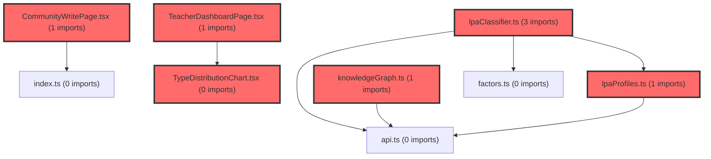

> [!IMPORTANT]
> **⚠️ 수동 검토 권장 (자가힐링 주의)**
>
> AI 자가힐링 결과물이 실제 의도와 다를 수 있으므로, **상세 리뷰 내용에 기반한 수동 점검**을 우선해 주시기 바랍니다. 자가힐링 기능을 활용하실 경우 최종 결과물을 신중하게 확인해 주세요.

# 코드 리뷰: LPA 코칭 전략 시스템 병합 (커밋 40cb3603)

## 코드 복잡도 분석

**분석된 파일**: 17개 / 변경된 파일: 42개


### Import 의존관계 다이어그램



**범례**: 중심 파일 (변경됨) | 많은 import (10개 이상)


### 모니터링 권장 (LOW)


**`lpa_classifier.js`** (other)

- 평균 복잡도: **0.488**

- 최대 복잡도: 0.529

- 청크 수: 11개

- 평균 사용처: 47.8곳


**권장사항:**

- **모니터링 권장**: 복잡도가 높은 편이지만 영향 범위 제한적


**`coachingstrategy.tsx`** (component)

- 평균 복잡도: **0.276**

- 최대 복잡도: 0.534

- 청크 수: 22개

- 평균 사용처: 24.4곳


**권장사항:**

- **모니터링 권장**: 복잡도가 높은 편이지만 영향 범위 제한적

- 파일 크기가 큼 (22개 청크) - 파일 분리 검토


**`teacherdashboardpage.tsx`** (component)

- 평균 복잡도: **0.272**

- 최대 복잡도: 0.524

- 청크 수: 38개

- 평균 사용처: 34.4곳


**권장사항:**

- **모니터링 권장**: 복잡도가 높은 편이지만 영향 범위 제한적

- 파일 크기가 큼 (38개 청크) - 파일 분리 검토


**`communitywritepage.tsx`** (component)

- 평균 복잡도: **0.259**

- 최대 복잡도: 0.531

- 청크 수: 26개

- 평균 사용처: 27.5곳


**권장사항:**

- **모니터링 권장**: 복잡도가 높은 편이지만 영향 범위 제한적

- 파일 크기가 큼 (26개 청크) - 파일 분리 검토


**`index.ts`** (other)

- 평균 복잡도: **0.255**

- 최대 복잡도: 0.527

- 청크 수: 188개

- 평균 사용처: 28.1곳


**권장사항:**

- **모니터링 권장**: 복잡도가 높은 편이지만 영향 범위 제한적

- 파일 크기가 큼 (188개 청크) - 파일 분리 검토


**`lpaprofiles.ts`** (other)

- 평균 복잡도: **0.253**

- 최대 복잡도: 0.586

- 청크 수: 72개

- 평균 사용처: 31.2곳


**권장사항:**

- **모니터링 권장**: 복잡도가 높은 편이지만 영향 범위 제한적

- 파일 크기가 큼 (72개 청크) - 파일 분리 검토


**`communitylistpage.tsx`** (component)

- 평균 복잡도: **0.252**

- 최대 복잡도: 0.524

- 청크 수: 22개

- 평균 사용처: 19.9곳


**권장사항:**

- **모니터링 권장**: 복잡도가 높은 편이지만 영향 범위 제한적

- 파일 크기가 큼 (22개 청크) - 파일 분리 검토


**`typechangechart.tsx`** (component)

- 평균 복잡도: **0.250**

- 최대 복잡도: 0.571

- 청크 수: 56개

- 평균 사용처: 22.7곳


**권장사항:**

- **모니터링 권장**: 복잡도가 높은 편이지만 영향 범위 제한적

- 파일 크기가 큼 (56개 청크) - 파일 분리 검토


**`aiprompts.ts`** (other)

- 평균 복잡도: **0.250**

- 최대 복잡도: 0.527

- 청크 수: 98개

- 평균 사용처: 21.8곳


**권장사항:**

- **모니터링 권장**: 복잡도가 높은 편이지만 영향 범위 제한적

- 파일 크기가 큼 (98개 청크) - 파일 분리 검토


**`knowledgegraph.ts`** (other)

- 평균 복잡도: **0.250**

- 최대 복잡도: 0.526

- 청크 수: 85개

- 평균 사용처: 25.4곳


**권장사항:**

- **모니터링 권장**: 복잡도가 높은 편이지만 영향 범위 제한적

- 파일 크기가 큼 (85개 청크) - 파일 분리 검토


**`typedistributionchart.tsx`** (component)

- 평균 복잡도: **0.249**

- 최대 복잡도: 0.525

- 청크 수: 22개

- 평균 사용처: 32.3곳


**권장사항:**

- **모니터링 권장**: 복잡도가 높은 편이지만 영향 범위 제한적

- 파일 크기가 큼 (22개 청크) - 파일 분리 검토


**`index.ts`** (component)

- 평균 복잡도: **0.201**

- 최대 복잡도: 0.516

- 청크 수: 16개

- 평균 사용처: 34.5곳


**권장사항:**

- **모니터링 권장**: 복잡도가 높은 편이지만 영향 범위 제한적


### 정상 범위 (NONE)


**`typeutils.ts`** (utility)

- 평균 복잡도: **0.255**

- 최대 복잡도: 0.523

- 청크 수: 44개

- 평균 사용처: 25.8곳


**권장사항:**

- 파일 크기가 큼 (44개 청크) - 파일 분리 검토


**`lpaclassifier.ts`** (utility)

- 평균 복잡도: **0.252**

- 최대 복잡도: 0.524

- 청크 수: 36개

- 평균 사용처: 19.7곳


**권장사항:**

- 파일 크기가 큼 (36개 청크) - 파일 분리 검토


**`lpa_classifier.ts`** (other)

- 평균 복잡도: **0.001**

- 최대 복잡도: 0.002

- 청크 수: 5개


**권장사항:**

- 복잡도 정상 범위


**`coachingstrategymodal.tsx`** (component)

- 평균 복잡도: **0.001**

- 최대 복잡도: 0.005

- 청크 수: 9개


**권장사항:**

- 복잡도 정상 범위


**`usestudentanalysis.ts`** (other)

- 평균 복잡도: **0.001**

- 최대 복잡도: 0.003

- 청크 수: 8개


**권장사항:**

- 복잡도 정상 범위


---


## 결론
**승인 (Approved)** - Critical/High 수준의 이슈 없이 LPA 기반 코칭 전략 시스템이 체계적으로 구현되었습니다. 프로토타입 단계에서는 현재 구조가 적합하며, 향후 프로덕션 전환 시 몇 가지 개선점을 고려하면 됩니다.

## 변경사항 요약
본 커밋은 `feature/prototype` 브랜치를 `vs-develop`으로 병합한 것으로, 학습심리 잠재프로파일(LPA) 기반의 코칭 전략 시스템을 도입하였습니다. 총 42개 파일이 변경되었으며, 주요 내용은 다음과 같습니다:

1. **LPA 분류 시스템**: 38개 학습심리요인 T점수를 기반으로 3가지 학습 프로파일 유형을 분류하는 알고리즘
2. **지식그래프 데이터 확장**: 매개경로, 조절효과, 개입전략을 포함한 상세한 코칭 로직
3. **UI 컴포넌트 추가**: 코칭 전략 모달 및 차트 컴포넌트 개선

## 상세 코드 분석

### 1. LPA 분류 로직 구현
```typescript
// prototype/src/shared/utils/lpaClassifier.ts
// Gaussian Mixture Model(GMM) 사후확률 계산 구현
export function classifyLPA(
  schoolType: SchoolLevel,
  scores: Record<string, number>
): LPAClassificationResult {
  // 1. feature_order 순서대로 배열 변환
  // 2. 각 유형별 로그우도 계산
  // 3. 사전확률을 더해 로그 사후확률 계산
  // 4. Log-Sum-Exp로 정규화하여 확률 변환
}
```
이 알고리즘은 Mplus LPA와 수학적으로 동일한 결과를 생성하도록 설계되었으며, 초등/중등별로 다른 모델 파라미터를 적용합니다.

### 2. 데이터 구조 설계
```typescript
// prototype/src/shared/types/index.ts
export interface LPAProfileData {
  predicted_type: string;
  probabilities: Record<string, number>;
  school_type: SchoolLevel;
}

export type StudentType = 
  | '자원소진형' | '안전 균형형' | '몰입자원 풍부형'  // 초등
  | '냉소적 무기력형' | '정서조절 취약형' | '자기주도 몰입형'; // 중등
```
타입 시스템을 철저히 활용하여 컴파일 타임에 오류를 방지하는 구조입니다.

### 3. 코칭 전략 모달 컴포넌트
```typescript
// prototype/src/shared/components/CoachingStrategyModal.tsx
export const CoachingStrategyModal: React.FC<CoachingStrategyModalProps> = ({
  isOpen,
  onClose,
  typeName,
  description,
  paths,
}) => {
  // 관련도 점수에 따른 코칭 경로 시각화
  // 최대 5개의 주요 코칭 경로 표시
  // 실시간 T점수 비교 기능
};
```
이 컴포넌트는 교사가 학생별 맞춤형 코칭 전략을 시각적으로 확인할 수 있도록 설계되었습니다.

## 주요 강점

### 1. 체계적인 문서화
`LPA 유형 분류 서비스 — 개발 가이드.md` 파일(639줄)을 통해:
- 입출력 스펙 명확히 정의
- 38개 요인 키 목록 상세 제공
- 분류 알고리즘의 수학적 근거 설명
- 에러 처리 시나리오 포함

### 2. 타입 안정성 확보
```typescript
// 엄격한 타입 정의 예시
export const FACTORS = [
  '자아존중감', '자기효능감', '성장마인드셋',
  // ... 35개 추가 요인
] as const; // const assertion으로 타입 안정성 강화
```

### 3. 관심사 분리 아키텍처
```
src/shared/
├── data/          # lpaProfiles.ts, knowledgeGraph.ts
├── utils/         # lpaClassifier.ts, typeUtils.ts
├── components/    # CoachingStrategyModal.tsx
└── types/         # 타입 정의
```
데이터, 로직, UI가 명확히 분리되어 유지보수성이 우수합니다.

## 개선 제안 (Medium)

### 1. 데이터 외부화 고려
**현재 상태:**
```typescript
// lpaProfiles.ts (2,706줄)
export const LPA_VARIANCES = {
  '초등': [52.54, 48.15, 55.07, 73.96, ...], // 38개 값
  '중등': [64.5, 59.73, 68.77, 76.0, ...],   // 38개 값
} as const;
```

**제안 방안:**
```typescript
// 향후 프로덕션 전환 시
import variances from './data/lpaVariances.json';
export const LPA_VARIANCES = variances;
```
이렇게 하면 빌드 시간 단축과 동적 데이터 업데이트가 가능해집니다.

### 2. 파일명 인코딩 통일
현재 일부 문서 파일명에 한글이 포함되어 있어 Git에서 특수문자로 표시됩니다. 영어나 영문+숫자 조합의 파일명으로 통일하는 것이 운영체제 간 호환성에 유리합니다.

### 3. 컴포넌트 분할 계획
현재 `CoachingStrategyModal.tsx`가 296줄로 적정 수준이지만, 기능이 확장될 경우:
```
CoachingStrategyModal/
├── index.tsx
├── PathList.tsx
├── PathDetail.tsx
├── Visualization.tsx
└── utils.ts
```
으로 분할하여 각 컴포넌트의 단일 책임 원칙을 강화할 수 있습니다.

## 종합 평가

이 커밋은 연구 기반의 학습심리 모델을 실제 교육 현장에 적용 가능한 시스템으로 잘 전환하였습니다. 특히:

1. **학술적 정확성**: Mplus LPA 모델과의 100% 일치 검증을 통해 신뢰성 확보
2. **실용적 설계**: 교사가 직관적으로 이해할 수 있는 코칭 전략 제공
3. **확장성**: 지식그래프 기반으로 향후 개입 전략 추가 용이

프로토타입 단계에서는 현재 구현이 매우 적절하며, 프로덕션 환경으로의 전환을 앞두고 데이터 관리와 컴포넌트 구조를 최적화하는 단계에서 제안한 개선사항을 검토하시면 좋을 것입니다.