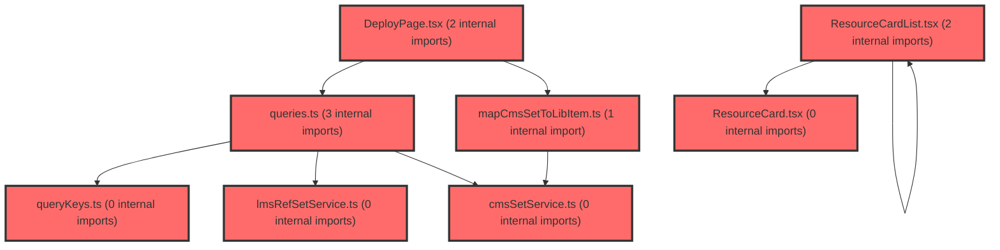

> [!IMPORTANT]
> **⚠️ 수동 검토 권장 (자가힐링 주의)**
>
> AI 자가힐링 결과물이 실제 의도와 다를 수 있으므로, **상세 리뷰 내용에 기반한 수동 점검**을 우선해 주시기 바랍니다. 자가힐링 기능을 활용하실 경우 최종 결과물을 신중하게 확인해 주세요.

# 코드 리뷰 - 43c7b1d3

## 코드 복잡도 분석

**분석된 파일**: 13개 / 변경된 파일: 16개


### Import 의존관계 다이어그램



**범례**: 중심 파일 (변경됨) | 많은 import (10개 이상)


### 정상 범위 (NONE)


**`env.ts`** (config)

- 평균 복잡도: **0.006**

- 최대 복잡도: 0.006

- 청크 수: 1개


**권장사항:**

- Config 파일은 높은 연결도가 정상적임


**`cmssetservice.ts`** (other)

- 평균 복잡도: **0.004**

- 최대 복잡도: 0.010

- 청크 수: 9개


**권장사항:**

- 복잡도 정상 범위


**`lmsrefsetservice.ts`** (other)

- 평균 복잡도: **0.002**

- 최대 복잡도: 0.003

- 청크 수: 16개


**권장사항:**

- 복잡도 정상 범위


**`queries.ts`** (other)

- 평균 복잡도: **0.002**

- 최대 복잡도: 0.007

- 청크 수: 26개


**권장사항:**

- 파일 크기가 큼 (26개 청크) - 파일 분리 검토


**`mapcmssettolibitem.ts`** (utility)

- 평균 복잡도: **0.002**

- 최대 복잡도: 0.005

- 청크 수: 6개


**권장사항:**

- 복잡도 정상 범위


**`lessoneditorpage.tsx`** (component)

- 평균 복잡도: **0.002**

- 최대 복잡도: 0.007

- 청크 수: 7개


**권장사항:**

- 복잡도 정상 범위


**`querykeys.ts`** (other)

- 평균 복잡도: **0.001**

- 최대 복잡도: 0.003

- 청크 수: 5개


**권장사항:**

- 복잡도 정상 범위


**`index.ts`** (other)

- 평균 복잡도: **0.001**

- 최대 복잡도: 0.005

- 청크 수: 22개


**권장사항:**

- 파일 크기가 큼 (22개 청크) - 파일 분리 검토


**`lessonmypage.tsx`** (component)

- 평균 복잡도: **0.001**

- 최대 복잡도: 0.010

- 청크 수: 23개


**권장사항:**

- 파일 크기가 큼 (23개 청크) - 파일 분리 검토


**`deploypage.tsx`** (component)

- 평균 복잡도: **0.000**

- 최대 복잡도: 0.005

- 청크 수: 167개


**권장사항:**

- 파일 크기가 큼 (167개 청크) - 파일 분리 검토


**`resourcecard.tsx`** (other)

- 평균 복잡도: **0.000**

- 최대 복잡도: 0.000

- 청크 수: 19개


**권장사항:**

- 복잡도 정상 범위


**`resourcecardlist.tsx`** (other)

- 평균 복잡도: **0.000**

- 최대 복잡도: 0.000

- 청크 수: 24개


**권장사항:**

- 파일 크기가 큼 (24개 청크) - 파일 분리 검토


**`lessonlibrarycontents.tsx`** (utility)

- 평균 복잡도: **0.000**

- 최대 복잡도: 0.004

- 청크 수: 10개


**권장사항:**

- 복잡도 정상 범위


---


## 변경 배경

이 커밋은 **추가계획9(DeployPage 실시간 수업 → Viewer 이동 + item 전달/재조회)** 와 **추가계획10(나의 자료 실제 API 연동 + 삭제 기능)** 을 구현 완료한 작업입니다. URL 직접 진입 시 `refSetId`/`setId`로 단건 조회하는 로직과, 나의 자료 목록을 LMS `GET /api/ref-set`에 연동하고 `DELETE /api/ref-set/{refSetId}` 삭제 기능을 추가했습니다.

- **목적**: DeployPage의 URL 직접 진입 시 콘텐츠 재조회, 나의 자료 목록의 실제 API 연동 및 삭제 기능 구현
- **도메인**: API 연동(비즈니스 로직) + UI(DeployPage, ResourceCard, LessonMyPage)
- **변경 방향**: mock 데이터 → 실제 LMS/CMS API 연동, 로딩/실패 UX 분리, 썸네일 URL 절대경로 처리

## [GOOD] 잘된 점

- **단건 조회 훅 분리**: `useRefSetQuery`, `useCmsSetDetailQuery`를 추가하고 `enabled` 옵션으로 state 진입 시 API 미호출을 처리한 점이 깔끔합니다.
- **에러 처리 UX 개선**: `isItemLoading`/`isItemFailed` 분리와 `failHandledRef`를 통한 중복 toast 방지, `location.key === 'default'`로 history 유무를 판별한 점이 좋습니다.
- **삭제 기능의 캐시 무효화**: `useDeleteRefSetMutation`에서 `invalidateQueries`로 목록을 자동 갱신한 점이 적절합니다.
- **썸네일 URL 절대경로 처리**: `ENV.CMS_FILE_URL`을 도입해 상대경로 썸네일을 절대 URL로 변환한 점이 좋습니다.

## 변경사항 요약

DeployPage가 URL 직접 진입 시 `refSetId`/`setId`로 단건 조회하고 로딩/실패 UX를 제공하도록 개선되었고, 나의 자료 페이지가 mock에서 실제 LMS API 연동 + 삭제 기능으로 전환되었습니다. 또한 CMS 파일 URL 환경변수(`VITE_CMS_FILE_URL`)가 추가되어 썸네일 절대경로 처리가 가능해졌습니다.

---

## [ISSUE] 개선이 필요한 부분

### Critical (즉시 수정 필요)

없음

### High (우선 수정 권장)

1. **`isItemFailed`의 `!setId` 조건이 항상 실패로 처리되는 문제** (DeployPage.tsx)

`isItemFailed`의 첫 조건이 `!setId`입니다. 즉 `setId`가 없는 URL(`/lesson/deploy` 또는 `/lesson/deploy/:refSetId` 형태)로 진입하면 무조건 실패로 간주되어 toast + navigate가 발생합니다. `refSetId` 단독 경로는 라우트에 없으므로 실질적 영향은 제한적이지만, `setId`가 없으면 `item`도 없으므로 `!item` 조건이 이미 이를 커버합니다. 논리적으로 중복되는 조건입니다.

```ts
// 현재 코드 (78행 부근)
const isItemFailed =
  !setId ||
  (!hasStateItem &&
    !isItemLoading &&
    (refSetId
      ? refSetQuery.isError || (refSetQuery.isSuccess && !item)
      : cmsSetQuery.isError || (cmsSetQuery.isSuccess && !item)));
```

```ts
// 제안 코드
const isItemFailed =
  !hasStateItem &&
  !isItemLoading &&
  (refSetId
    ? refSetQuery.isError || (refSetQuery.isSuccess && !item)
    : cmsSetQuery.isError || (cmsSetQuery.isSuccess && !item));
```

2. **썸네일 URL 조립 로직의 중복 및 `undefined` 처리** (DeployPage.tsx, ResourceCard.tsx)

두 파일에서 동일한 썸네일 URL 조립 로직(`startsWith('/')` 분기)이 중복됩니다. 공용 유틸로 추출하는 것이 좋습니다. 또한 `item.thumbnailUrl`이 `undefined`일 때 `thumbnailUrl` 변수는 `ENV.CMS_FILE_URL + '/' + undefined`가 되어 `"https://cbs.vsaidt.com/undefined"` 같은 잘못된 URL이 생성되지만, 실제 렌더링은 `item.thumbnailUrl ?` 조건으로 가드되어 있어 표시되지는 않습니다. 다만 변수 자체가 오염되므로 조건부 조립이 안전합니다.

```ts
// 현재 코드 (DeployPage.tsx 158행, ResourceCard.tsx 33행)
const thumbnailUrl = item.thumbnailUrl?.startsWith('/') ? `${ENV.CMS_FILE_URL}${item.thumbnailUrl}` : `${ENV.CMS_FILE_URL}/${item.thumbnailUrl}`;
```

```ts
// 제안: 공용 유틸 추출 (lib/resolveThumbnailUrl.ts)
export function resolveThumbnailUrl(url?: string): string | undefined {
  if (!url) return undefined;
  return url.startsWith('/') ? `${ENV.CMS_FILE_URL}${url}` : `${ENV.CMS_FILE_URL}/${url}`;
}
```

### Medium (개선 권장)

1. **`mapRefSetToLibItem`의 `id`가 `lcmsSetId`인 점과 deploy 경로의 일관성**

`mapRefSetToLibItem`에서 `id: item.lcmsSetId`로 매핑하고, ResourceCard의 deploy 경로는 `/lesson/deploy/${item.id}/${item.refSetId}`로 `item.id`(lcmsSetId)를 사용합니다. DeployPage에서 `useCmsSetDetailQuery(setId)`는 `setId`(lcmsSetId)로 CMS 단건을 조회하는데, 이는 나의 자료에서 시작하기를 눌렀을 때 `refSetId`가 있으므로 `useRefSetQuery`가 우선 실행되어 문제는 없습니다. 다만 `id`가 `lcmsSetId`인지 `setId`인지의 의미론적 혼동이 있을 수 있어 주석이나 네이밍 개선이 필요합니다.

2. **`LessonEditorPage.tsx`의 `console.log` 주석 처리 방식**

`if (import.meta.env.DEV)` 가드를 주석 처리하고 `console.log`를 항상 실행하도록 변경했습니다. 디버그 로그가 프로덕션에 남게 되므로, 가드를 유지하거나 로그를 제거하는 것이 좋습니다.

```ts
// 현재 코드 (35~38행)
// if (import.meta.env.DEV) {
  console.log('[LessonEditorPage] onStartLesson', p);
// }
```

```ts
// 제안 코드
if (import.meta.env.DEV) {
  console.log('[LessonEditorPage] onStartLesson', p);
}
```

3. **`LessonMyPage.tsx`의 toast 스타일 주석 처리**

삭제 성공 toast의 `position`/`unstyled`/`style` 옵션이 주석 처리되어 기본 스타일로 변경되었습니다. 의도된 변경이라면 주석을 제거하고, 아니면 복원하는 것이 좋습니다.

---

## 주요 파일 분석

### DeployPage.tsx

**변경 내용:**
URL 직접 진입 시 `refSetId`/`setId`로 단건 조회하고 로딩/실패 UX를 추가했습니다.

**개선 제안:**
1. `isItemFailed`의 `!setId` 조건 제거 — `!item` 조건이 이미 커버하므로 중복입니다.
2. 썸네일 URL 조립 로직을 공용 유틸로 추출 — ResourceCard.tsx와 중복됩니다.

### ResourceCard.tsx

**변경 내용:**
썸네일 URL 절대경로 처리와 deploy 경로에 `refSetId` 포함, 삭제 버튼에 `refSetId` 전달.

**개선 제안:**
1. 썸네일 URL 조립 로직을 공용 유틸로 추출 — DeployPage.tsx와 동일한 중복입니다.

### LessonMyPage.tsx

**변경 내용:**
mock → 실제 LMS `GET /api/ref-set` 연동 + `DELETE /api/ref-set/{refSetId}` 삭제 기능.

**개선 제안:**
1. 삭제 성공 toast의 주석 처리된 스타일 옵션 정리 — 주석이 남아 있으면 코드가 지저분해집니다.

### LessonEditorPage.tsx

**변경 내용:**
`console.log`의 `import.meta.env.DEV` 가드를 주석 처리.

**개선 제안:**
1. 디버그 로그 가드 복원 — 프로덕션 빌드에 디버그 로그가 남지 않도록 DEV 가드를 복원하는 것이 좋습니다.

---

## 최종 평가

**결론**:
- [ ] [OK] **승인 (Approved)** - Critical/High 이슈 없음
- [x] [WARN] **조건부 승인 (Approved with Comments)** - Medium 이하 이슈만 존재
- [ ] [FIX] **수정 필요 (Changes Requested)** - Critical/High 이슈 존재

**종합 의견:**

전반적으로 추가계획9와 추가계획10의 구현이 잘 완료되었습니다. 단건 조회 훅 분리, 로딩/실패 UX, 삭제 기능의 캐시 무효화 등 구조가 명확하고, `failHandledRef`를 통한 중복 toast 방지와 `location.key === 'default'`로 history 유무를 판별하는 세심한 처리가 돋보입니다.

다만 `isItemFailed`의 `!setId` 조건과 썸네일 URL 조립 로직의 중복, 디버그 로그 가드 주석 처리 등은 개선 여지가 있습니다. 이들은 기능을 막는 치명적 문제는 아니므로 조건부 승인을 권장합니다. 특히 썸네일 URL 조립 로직은 두 파일에서 동일하게 반복되므로 공용 유틸로 추출하면 유지보수성이 크게 향상될 것입니다.