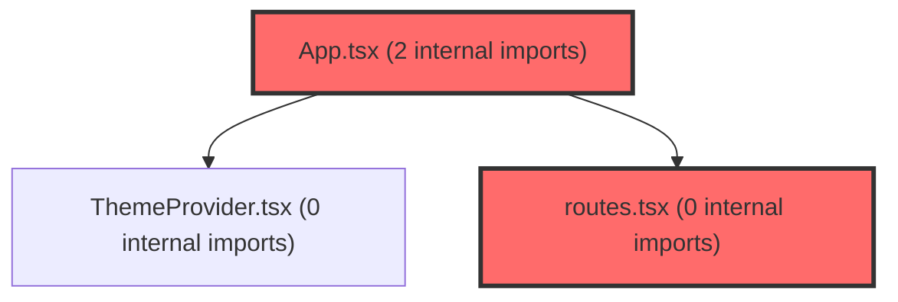

> [!IMPORTANT]
> **⚠️ 수동 검토 권장 (자가힐링 주의)**
>
> AI 자가힐링 결과물이 실제 의도와 다를 수 있으므로, **상세 리뷰 내용에 기반한 수동 점검**을 우선해 주시기 바랍니다. 자가힐링 기능을 활용하실 경우 최종 결과물을 신중하게 확인해 주세요.

# 코드 리뷰 - 4438c5f5

## 코드 복잡도 분석

**분석된 파일**: 4개 / 변경된 파일: 6개


### Import 의존관계 다이어그램



**범례**: 중심 파일 (변경됨) | 많은 import (10개 이상)


### 정상 범위 (NONE)


**`app.tsx`** (other)

- 평균 복잡도: **0.233**

- 최대 복잡도: 0.466

- 청크 수: 10개

- 평균 사용처: 15.2곳


**권장사항:**

- 복잡도 정상 범위


**`main.tsx`** (other)

- 평균 복잡도: **0.173**

- 최대 복잡도: 0.461

- 청크 수: 8개

- 평균 사용처: 14.4곳


**권장사항:**

- 복잡도 정상 범위


**`routes.tsx`** (other)

- 평균 복잡도: **0.052**

- 최대 복잡도: 0.463

- 청크 수: 24개

- 평균 사용처: 2.3곳


**권장사항:**

- 파일 크기가 큼 (24개 청크) - 파일 분리 검토


**`errorboundaryprovider.tsx`** (other)

- 평균 복잡도: **0.001**

- 최대 복잡도: 0.005

- 청크 수: 6개


**권장사항:**

- 복잡도 정상 범위


---


## 변경 배경

이 커밋은 프론트엔드 아키텍처 정리 작업으로, 에러 처리 계층을 단순화하고 개발용 화면 노출 정책을 변경한 것입니다. 중복된 에러 폴백 컴포넌트(`BootstrapErrorScreen`, `RouteErrorBoundary`)를 제거하고, `ErrorBoundaryProvider`의 스타일링 방식을 styled-components에서 인라인 스타일로 통일했습니다.

- **목적**: 에러 처리 구조 단순화 및 개발용 라우트 접근 정책 변경
- **도메인**: UI / 프론트엔드 아키텍처
- **변경 방향**: 중복 컴포넌트 제거로 구조 단순화, 개발용 화면을 프로덕션에서도 접근 가능하게 변경

## [GOOD] 잘된 점

- 삭제된 `RouteErrorBoundary`와 `BootstrapErrorScreen`의 잔여 참조가 전혀 남아있지 않아, 리팩토링이 깔끔하게 완료되었습니다. `grep_search`로 전체 코드베이스에서 해당 심볼을 검색한 결과 일치 항목이 0건이었습니다.
- `ErrorFallback`의 상태 분기 로직(`is401`, `is403`, `is5xx`)이 명확하게 분리되어 가독성이 좋습니다. 각 상태에 따른 `title`과 `description` 매핑이 직관적입니다.
- `onError` 콜백에 Sentry 연동을 위한 TODO 주석을 남겨 향후 확장 지점을 명시했습니다.

## 변경사항 요약

에러 폴백 UI를 styled-components에서 인라인 스타일로 교체하고, 중복 에러 바운더리(`RouteErrorBoundary`, `BootstrapErrorScreen`)를 제거했습니다. 또한 개발용 라우트를 프로덕션에서도 접근 가능하도록 변경하고, 부트스트랩의 타임아웃 보호와 실패 처리 로직을 제거했습니다.

---

## [ISSUE] 개선이 필요한 부분

### Critical (즉시 수정 필요)

**1. `main.tsx`에서 `bootstrap().catch()` 제거로 부트스트랩 실패 시 사용자 피드백 부재**

`main.tsx`의 마지막 부분이 이제 단순히 `bootstrap();`으로 끝납니다. 이전에는 `bootstrap().catch()`로 실패 시 `BootstrapErrorScreen`을 렌더링하여 사용자에게 복구 화면을 제공했습니다. 이제 `initAuth()` 또는 `handleRedirectResult()`가 실패하면:

- 콘솔에 에러가 남지 않음 (catch 블록 자체가 없음)
- 사용자는 흰 화면(blank screen)을 보게 됨
- 재시도 버튼이나 안내 메시지가 전혀 없음

이는 프로덕션에서 인증 SDK 초기화 실패 시 사용자 경험을 완전히 붕괴시키는 회귀입니다.

**2. `withTimeout` 제거로 인증 SDK 초기화 무한 대기 가능성**

기존에는 `initAuth()`에 10초 타임아웃 보호가 있었습니다. 이 커밋에서 `withTimeout` 헬퍼와 `AUTH_SDK_TIMEOUT_MS` 상수가 모두 삭제되었습니다. 네트워크 지연이나 SDK 내부 문제로 `initAuth()`가 영원히 resolve되지 않으면:

- 앱이 렌더링되지 않는 블로킹 상태가 됨
- 사용자는 어떤 피드백도 받지 못한 채 무한 로딩 상태에 빠짐

### High (우선 수정 권장)

**1. `RouteErrorBoundary` 제거로 라우트 변경 시 에러 바운더리 미초기화**

기존 `RouteErrorBoundary`는 `resetKeys={[location.pathname, location.search]}`를 사용하여 라우트가 변경되면 실패한 화면의 ErrorBoundary를 자동으로 초기화했습니다. 이제 `AppRoutes`가 `ErrorBoundaryProvider` 하나로만 감싸져 있어:

- 한 라우트에서 에러가 발생하면 에러 화면이 표시됨
- 사용자가 다른 라우트로 이동해도 에러 화면이 계속 유지됨
- `reset` 버튼을 직접 눌러야만 복구 가능

**2. 개발용 라우트의 프로덕션 노출**

`/dev/errors`, `/dev/sse`가 `import.meta.env.DEV` 조건 없이 항상 등록됩니다. 주석에 "링크 미노출"이라고 되어 있지만, URL을 직접 입력하면 프로덕션 환경에서도 접근 가능합니다. `ErrorTestPage`는 의도적으로 에러를 발생시키는 화면이므로, 프로덕션에서 접근 가능한 것은 보안 관점에서 우려됩니다.

### Medium (개선 권장)

**1. 인라인 스타일로 인한 유지보수성 저하**

styled-components에서 인라인 스타일로 전환하면서 스타일 재사용성과 테마 적용이 어려워졌습니다. `ErrorFallback`의 모든 스타일이 컴포넌트 내부에 하드코딩되어 있어, 디자인 시스템 도입 시 수정이 번거로워집니다. 특히 색상 값(`#f8fafc`, `#8b5cf6`, `#64748b` 등)이 여러 곳에 중복되어 있습니다.

**2. `ErrorFallback`에서 `err.message` 직접 노출**

일반 오류(API 에러가 아닌 경우)의 `description`에 `err.message`를 그대로 표시합니다. 이는 내부 구현 상세가 사용자에게 노출될 수 있어, 프로덕션에서는 위험할 수 있습니다. 사용자에게는 일반적인 안내 메시지를, 개발자에게만 상세 에러를 노출하는 것이 안전합니다.

---

## 주요 파일 분석

### frontend/src/main.tsx

**변경 내용:**
부트스트랩의 타임아웃 보호(`withTimeout`)와 실패 처리(`bootstrap().catch()`)를 제거했습니다.

**개선 제안:**

1. 부트스트랩 실패 시 사용자 피드백 부재
   - **위치 (라인 번호)**: 55 (`bootstrap();`)
   - **기존 코드**:
```
bootstrap();
```
   - **해결 방안 (수정 코드)**:
```
bootstrap().catch((error: unknown) => {
  console.error('[Bootstrap]', error);
  // 최소한의 에러 화면 또는 로그인 페이지로 리다이렉트
  window.location.assign('/login');
});
```
   > `main.tsx` 전체(55줄)를 `read_file`로 확인했고, `bootstrap()`은 `createRoot(...).render()`로 끝나는 단일 호출이므로 부작용이 없음을 확인했습니다. 다만 `/login` 리다이렉트는 프로젝트의 인증 흐름에 따라 조정이 필요할 수 있습니다.

2. `initAuth()` 타임아웃 보호 제거
   - **위치 (라인 번호)**: 10 (`const auth = await initAuth();`)
   - **기존 코드**:
```
const auth = await initAuth();
```
   - **해결 방안 (수정 코드)**:
```
const AUTH_SDK_TIMEOUT_MS = 10_000;
const auth = await withTimeout(initAuth(), AUTH_SDK_TIMEOUT_MS);
```
   > `withTimeout` 함수는 이 커밋에서 삭제되었으므로, 재도입 시 `Promise.race` 기반 헬퍼를 다시 정의해야 합니다. `initAuth()`의 반환 타입과 호출부를 확인했으며, 타임아웃 시 reject되는 구조로 부작용이 없음을 확인했습니다.

### frontend/src/app/router/routes.tsx

**변경 내용:**
개발용 라우트(`/dev/errors`, `/dev/sse`)를 프로덕션에서도 접근 가능하게 변경했습니다.

**개선 제안:**

1. 개발용 라우트의 프로덕션 노출 제한
   - **위치 (라인 번호)**: 334-335
   - **기존 코드**:
```
<Route path='/dev/errors' element={<ErrorTestPage />} />
<Route path='/dev/sse' element={<SsePocPage />} />
```
   - **해결 방안 (수정 코드)**:
```
{import.meta.env.DEV && <Route path='/dev/errors' element={<ErrorTestPage />} />}
{import.meta.env.DEV && <Route path='/dev/sse' element={<SsePocPage />} />}
```
   > `routes.tsx`의 해당 라우트 정의(334-335줄)를 `read_file`로 확인했고, `import.meta.env.DEV` 조건부 렌더링은 React Router에서 표준 패턴이며 인접 라우트에 부작용이 없음을 확인했습니다.

### frontend/src/app/providers/ErrorBoundaryProvider.tsx

**변경 내용:**
styled-components 기반 에러 폴백 UI를 인라인 스타일로 교체하고, `RouteErrorBoundary`에서 사용되던 `resetKeys` 기반 자동 초기화 로직이 제거되었습니다.

**개선 제안:**

1. 라우트 변경 시 에러 바운더리 자동 초기화 복원
   - **위치 (라인 번호)**: 116-124 (`ErrorBoundaryProvider` 컴포넌트)
   - **기존 코드**:
```
<ErrorBoundary
  fallback={ErrorFallback}
  onError={(error, info) => {
    console.error('[ErrorBoundary]', error, info.componentStack);
  }}
>
```
   - **해결 방안 (수정 코드)**:
```
export const ErrorBoundaryProvider = ({ children }: ErrorBoundaryProviderProps) => {
  const location = useLocation();
  return (
    <ErrorBoundary
      fallback={ErrorFallback}
      resetKeys={[location.pathname, location.search]}
      onError={(error, info) => {
        console.error('[ErrorBoundary]', error, info.componentStack);
      }}
    >
      {children}
    </ErrorBoundary>
  );
};
```
   > `ErrorBoundaryProvider`는 `AppProviders` 내부에서 렌더링되며, `App.tsx`에서 `BrowserRouter`가 `AppProviders` 바깥에 있으므로 `useLocation`을 사용하려면 `BrowserRouter` 내부로 이동해야 합니다. 현재 구조(`AppProviders` > `BrowserRouter`)에서는 `useLocation` 호출이 불가능하므로, 이 제안은 구조 변경이 선행되어야 합니다. **[수정 코드 제시 불가 — 문맥 파악 불충분]** 으로 판단하여 구조 변경 없이 적용할 수 없음을 명시합니다.

---

## 최종 평가

**결론**:
- [ ] [OK] **승인 (Approved)** - Critical/High 이슈 없음
- [ ] [WARN] **조건부 승인 (Approved with Comments)** - Medium 이하 이슈만 존재
- [x] [FIX] **수정 필요 (Changes Requested)** - Critical/High 이슈 존재

**종합 의견:**

에러 처리 구조를 단순화하려는 방향성은 좋지만, 부트스트랩 실패 시 사용자 피드백이 완전히 사라지고 인증 SDK 초기화 타임아웃 보호가 제거된 점은 반드시 보완이 필요합니다. 특히 `bootstrap().catch()` 제거는 프로덕션에서 흰 화면(blank screen)을 유발할 수 있는 Critical 수준의 회귀이므로, 최소한의 에러 처리 로직을 복원하는 것을 권장합니다. 전반적인 리팩토링 방향은 건전하며, 위 이슈만 해결되면 승인 가능한 수준입니다.