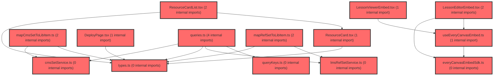

> [!IMPORTANT]
> **⚠️ 수동 검토 권장 (자가힐링 주의)**
>
> AI 자가힐링 결과물이 실제 의도와 다를 수 있으므로, **상세 리뷰 내용에 기반한 수동 점검**을 우선해 주시기 바랍니다. 자가힐링 기능을 활용하실 경우 최종 결과물을 신중하게 확인해 주세요.

# 코드 리뷰 - 44b4c09c

## 코드 복잡도 분석

**분석된 파일**: 25개 / 변경된 파일: 34개


### Import 의존관계 다이어그램



**범례**: 중심 파일 (변경됨) | 많은 import (10개 이상)


### 정상 범위 (NONE)


**`routes.tsx`** (other)

- 평균 복잡도: **0.057**

- 최대 복잡도: 0.463

- 청크 수: 22개

- 평균 사용처: 2.5곳


**권장사항:**

- 파일 크기가 큼 (22개 청크) - 파일 분리 검토


**`index.ts`** (component)

- 평균 복잡도: **0.029**

- 최대 복잡도: 0.461

- 청크 수: 32개

- 평균 사용처: 1.9곳


**권장사항:**

- 파일 크기가 큼 (32개 청크) - 파일 분리 검토


**`env.ts`** (config)

- 평균 복잡도: **0.006**

- 최대 복잡도: 0.006

- 청크 수: 1개


**권장사항:**

- Config 파일은 높은 연결도가 정상적임


**`lessonviewerembed.tsx`** (component)

- 평균 복잡도: **0.003**

- 최대 복잡도: 0.014

- 청크 수: 12개


**권장사항:**

- 복잡도 정상 범위


**`lessonviewerpage.tsx`** (component)

- 평균 복잡도: **0.003**

- 최대 복잡도: 0.008

- 청크 수: 7개


**권장사항:**

- 복잡도 정상 범위


**`cmssetservice.ts`** (other)

- 평균 복잡도: **0.002**

- 최대 복잡도: 0.005

- 청크 수: 5개


**권장사항:**

- 복잡도 정상 범위


**`lmsrefsetservice.ts`** (other)

- 평균 복잡도: **0.002**

- 최대 복잡도: 0.004

- 청크 수: 11개


**권장사항:**

- 복잡도 정상 범위


**`queries.ts`** (other)

- 평균 복잡도: **0.002**

- 최대 복잡도: 0.008

- 청크 수: 16개


**권장사항:**

- 복잡도 정상 범위


**`everycanvasembedsdk.ts`** (utility)

- 평균 복잡도: **0.002**

- 최대 복잡도: 0.005

- 청크 수: 13개


**권장사항:**

- 복잡도 정상 범위


**`mapcmssettolibitem.ts`** (utility)

- 평균 복잡도: **0.002**

- 최대 복잡도: 0.005

- 청크 수: 6개


**권장사항:**

- 복잡도 정상 범위


**`maprefsettolibitem.ts`** (utility)

- 평균 복잡도: **0.002**

- 최대 복잡도: 0.005

- 청크 수: 6개


**권장사항:**

- 복잡도 정상 범위


**`types.ts`** (other)

- 평균 복잡도: **0.002**

- 최대 복잡도: 0.008

- 청크 수: 10개


**권장사항:**

- 복잡도 정상 범위


**`lessoneditorpage.tsx`** (component)

- 평균 복잡도: **0.002**

- 최대 복잡도: 0.010

- 청크 수: 9개


**권장사항:**

- 복잡도 정상 범위


**`querykeys.ts`** (other)

- 평균 복잡도: **0.001**

- 최대 복잡도: 0.002

- 청크 수: 3개


**권장사항:**

- 복잡도 정상 범위


**`index.ts`** (other)

- 평균 복잡도: **0.001**

- 최대 복잡도: 0.005

- 청크 수: 20개


**권장사항:**

- 복잡도 정상 범위


**`useeverycanvasembed.ts`** (utility)

- 평균 복잡도: **0.001**

- 최대 복잡도: 0.009

- 청크 수: 12개


**권장사항:**

- 복잡도 정상 범위


**`lessoneditorembed.tsx`** (other)

- 평균 복잡도: **0.001**

- 최대 복잡도: 0.006

- 청크 수: 12개


**권장사항:**

- 복잡도 정상 범위


**`lessondeploypage.tsx`** (component)

- 평균 복잡도: **0.001**

- 최대 복잡도: 0.001

- 청크 수: 3개


**권장사항:**

- 복잡도 정상 범위


**`lessonlibrarypage.tsx`** (utility)

- 평균 복잡도: **0.001**

- 최대 복잡도: 0.008

- 청크 수: 14개


**권장사항:**

- 복잡도 정상 범위


**`lessonresultpage.tsx`** (component)

- 평균 복잡도: **0.001**

- 최대 복잡도: 0.005

- 청크 수: 13개


**권장사항:**

- 복잡도 정상 범위


**`lessonlibrarycontents.tsx`** (utility)

- 평균 복잡도: **0.001**

- 최대 복잡도: 0.004

- 청크 수: 11개


**권장사항:**

- 복잡도 정상 범위


**`deploypage.tsx`** (component)

- 평균 복잡도: **0.000**

- 최대 복잡도: 0.005

- 청크 수: 178개


**권장사항:**

- 파일 크기가 큼 (178개 청크) - 파일 분리 검토


**`resourcecard.tsx`** (other)

- 평균 복잡도: **0.000**

- 최대 복잡도: 0.010

- 청크 수: 38개


**권장사항:**

- 파일 크기가 큼 (38개 청크) - 파일 분리 검토


**`resourcecardlist.tsx`** (other)

- 평균 복잡도: **0.000**

- 최대 복잡도: 0.000

- 청크 수: 23개


**권장사항:**

- 파일 크기가 큼 (23개 청크) - 파일 분리 검토


**`lessonmypage.tsx`** (component)

- 평균 복잡도: **0.000**

- 최대 복잡도: 0.007

- 청크 수: 21개


**권장사항:**

- 파일 크기가 큼 (21개 청크) - 파일 분리 검토


---


## 변경 배경

이 커밋은 lesson(수업) 기능의 여러 추가계획(4~8)을 일괄 구현한 것입니다. 활동 배포 페이지(DeployPage) 라우트 연결, Editor/Viewer embed 독립 라우트 페이지 전환, LMS ref-set API 연동(onSaved 자동 등록 + 목록 조회), ResourceCard 수정하기 라우트 이동, 전체 자료실 CMS `GET /api/sets` 연동을 포함합니다.

- **목적**: lesson 기능의 자료실·저작·배포·나의 자료 흐름을 실제 API와 라우트 구조로 전환
- **도메인**: API 연동(LMS/CMS), 라우팅, UI(FSD 구조)
- **변경 방향**: 인라인 embed 오버레이 → 독립 fullscreen 라우트 페이지, 목업 데이터 → 실제 API 연동

---

## [GOOD] 잘된 점

1. **FSD 구조 일관성**: `queryKeys.ts` factory 패턴, service/queries 분리를 기존 `assessmentKeys`/`groupKeys` 패턴과 동일하게 적용했습니다. `lessonKeys.refSets()`, `lessonKeys.cmsSets()` 팩토리를 통해 임의 문자열 query key 사용을 방지했습니다.

2. **레이스 컨디션 구조적 해결**: `useCmsSetListQuery`에서 `AbortSignal` + `keepPreviousData` + queryKey(filters, sort) 조합으로 "마지막 요청만 반영"을 구현했습니다. queryKey 변경 시 이전 요청이 자동 abort되고, `keepPreviousData`로 로딩 중 이전 목록을 유지해 UX 단절을 방지했습니다.

3. **안전한 전환 전략**: `mapCmsSetToLibItem`의 미확정 필드에 `TO FIX` 주석을 명시하고, MOCK 경로를 주석으로 보존해 즉시 복구 가능하게 한 점이 실무적으로 좋습니다.

---

## 변경사항 요약

env에 `VITE_SP_LMS_API_URL`/`VITE_CMS_API_URL` 추가, `TeacherFullscreenLayout` 하위에 editor/viewer/deploy 라우트 추가, `cmsSetService`/`lmsRefSetService`/`queries` 신규 작성, `LessonEditorPage`/`LessonMyPage`/`LessonLibraryContents` 개편, 관련 plan 문서 대량 갱신.

---

## [ISSUE] 개선이 필요한 부분

### Critical (즉시 수정 필요)

없음

### High (우선 수정 권장)

**1. `LessonMyPage.tsx`에 디버깅용 `console.log` 잔존**

`frontend/src/pages/lesson/LessonMyPage.tsx` 라인 39에 다음 코드가 프로덕션에 남아 있습니다.

```ts
console.log('[LessonMyPage] refSetData', refSetData, { isRefSetLoading, isRefSetError });
```

데이터 확인용으로 작성된 것으로 보이나, 배포 시 제거해야 합니다. 이 로그는 콘솔에 불필요한 출력을 발생시키고, 민감한 데이터가 노출될 가능성도 있습니다.

**2. `useRegisterRefSetMutation`의 중복 방지가 cache miss 시 무력화**

`frontend/src/features/lesson/api/queries.ts` 라인 22-31의 `mutationFn`을 보면:

```ts
mutationFn: (body: RegisterRefSetBody) => {
  const cached = queryClient.getQueryData<RefSetListData>(lessonKeys.refSets());
  const alreadyRegistered = cached?.list.some(
    (item) => item.lcmsSetId === body.lcmsSetId,
  );
  if (alreadyRegistered) return Promise.resolve({ refSetId: '' });
  return registerRefSet(body);
},
```

`useRefSetListQuery`가 아직 fetch 전이거나 마운트 전이면 `cached`가 `undefined`가 되어 중복 체크가 불가능합니다. 이 경우 POST가 실행되며, LMS가 동일 `lcmsSetId`로 중복 행을 허용하는지에 따라 데이터 중복 삽입이 발생할 수 있습니다. 문서에도 "미확정 항목 #2"로 명시되어 있으나, 이는 데이터 무결성과 직결된 잠재적 오류입니다.

### Medium (개선 권장)

**1. `routes.tsx`의 `TeacherFullscreenLayout` 블록 들여쓰기 불일치**

`frontend/src/app/router/routes.tsx` 라인 263-272를 보면:

```tsx
      <Route element={<TeacherFullscreenLayout />}>
      
      {FEATURES.IA_V2 && (
          <>
            <Route path='/lesson/deploy/:itemId' element={<LessonDeployPage />} />
            ...
          </>
        )}
      </Route>
```

들여쓰기가 일관되지 않아 가독성이 떨어집니다. 다음과 같이 정리하는 것이 좋습니다.

```tsx
      <Route element={<TeacherFullscreenLayout />}>
        {FEATURES.IA_V2 && (
          <>
            <Route path='/lesson/deploy/:itemId' element={<LessonDeployPage />} />
            <Route path='/lesson/editor' element={<LessonEditorPage />} />
            <Route path='/lesson/editor/:slideId' element={<LessonEditorPage />} />
            <Route path='/lesson/viewer/:slideId' element={<LessonViewerPage />} />
          </>
        )}
      </Route>
```

**2. `LessonEditorPage.onStartLesson`에 TODO 주석 추가**

`frontend/src/pages/lesson/LessonEditorPage.tsx` 라인 30-32:

```tsx
onStartLesson={(p: StartLessonPayload) => {
  console.log('[LessonEditorPage] onStartLesson', p);
}}
```

수업 화면 라우트가 미확정이라 no-op으로 남긴 것은 이해되나, 추후 연결 지점을 명확히 하기 위해 TODO 주석을 추가하면 좋습니다.

---

## 주요 파일 분석

### frontend/src/features/lesson/api/queries.ts

**변경 내용:**
`useRefSetListQuery`, `useRegisterRefSetMutation`, `useCmsSetListQuery` 세 훅을 신규 추가.

**분석:**
- `useRefSetListQuery`는 `lessonKeys.refSets()`를 queryKey로 사용하여 `GET /api/ref-set`을 호출합니다.
- `useRegisterRefSetMutation`은 cache 기반 중복 방지를 구현했으나, cache miss 시 중복 POST 가능성이 있습니다.
- `useCmsSetListQuery`는 filters/sort를 queryKey에 넣어 토글마다 새 fetch를 유도하되, API param에는 매핑하지 않는 의도된 설계입니다. `AbortSignal`을 `queryFn`의 `signal`로 전달하여 레이스를 방지합니다.

### frontend/src/pages/lesson/LessonMyPage.tsx

**변경 내용:**
`mode` state 기반 인라인 embed 제거, `useNavigate` 전환, `useRefSetListQuery` 마운트(데이터 확인용).

**분석:**
- 기존 `position: fixed; z-index: 9999` 오버레이 방식에서 독립 라우트 페이지로 전환되어 레이아웃 계층이 명확해졌습니다.
- `useRefSetListQuery`를 마운트하여 데이터를 확인하지만, `ResourceCardList` 연결은 추후 Phase로 남겨두었습니다. `MOCK_LIBRARY_ITEMS`와 `useState`는 유지됩니다.
- 디버깅용 `console.log`가 잔존하므로 제거가 필요합니다.

### frontend/src/app/router/routes.tsx

**변경 내용:**
`TeacherFullscreenLayout` 블록에 deploy/editor/viewer 4개 라우트 추가.

**분석:**
- `/lesson/editor`와 `/lesson/editor/:slideId`를 같은 `LessonEditorPage`에 매핑하여 `useParams`로 신규/편집을 분기합니다.
- `/lesson/viewer/:slideId`는 slideId 필수 경로입니다.
- `FEATURES.IA_V2` 플래그로 감싸져 있어 기능 토글이 가능합니다.
- 들여쓰기 포맷이 어긋나 있어 정리가 필요합니다.

---

## 최종 평가

**결론**: 
- [ ] [OK] **승인 (Approved)** - Critical/High 이슈 없음
- [x] [WARN] **조건부 승인 (Approved with Comments)** - Medium 이하 이슈만 존재
- [ ] [FIX] **수정 필요 (Changes Requested)** - Critical/High 이슈 존재

**종합 의견:**

lesson 기능의 목업에서 실제 API 연동·독립 라우트 전환까지 폭넓게 진행된 커밋으로, FSD 구조와 TanStack Query 패턴을 일관되게 적용한 점이 인상적입니다. 특히 `AbortSignal` 기반 레이스 처리와 `keepPreviousData` 활용은 실무적으로 우수한 설계입니다.

다음 단계에서 정리하면 좋을 사항은 다음과 같습니다.

1. `LessonMyPage`의 디버깅 `console.log` 제거
2. `useRegisterRefSetMutation`의 cache miss 시 중복 POST 가능성에 대해 LMS 중복 허용 여부 확인
3. `routes.tsx` 들여쓰기 정리

전반적으로 실무에서 통용 가능한 수준의 품질을 갖추었으며, 조건부 승인으로 판단합니다.