> [!IMPORTANT]
> **수동 검토 대상 (자가힐링 주의)**
>
> 이 커밋은 변경 범위가 넓거나 로직의 복잡도가 높아 AI 자가힐링이 완벽하지 않을 수 있습니다.
> 아래 리뷰 내용을 바탕으로 **수동 검토를 우선**하시고, 자가힐링 기능을 사용하실 경우 결과물을 신중히 확인해 주시기 바랍니다.

# 코드 리뷰 - 44b6a20b

## 코드 복잡도 분석

**분석된 파일**: 3개 / 변경된 파일: 7개


### Import 의존관계 다이어그램

```mermaid
flowchart TD
    F0["SchoolSyncService.java (0 imports)"]
    F1["User.java (0 imports)"]
    F2["AuthSchoolMap.java (0 imports)"]
    F3["GroupInfoMapper.java (0 imports)"]
    F4["IdGenerator.java (0 imports)"]
    F5["SchoolInfoMapper.java (0 imports)"]
    F6["AdminController.java (11 imports)"]:::center
    F7["GroupQueryMapper.java (0 imports)"]:::center
    F8["JwtUtil.java (0 imports)"]
    F9["AdminUserService.java (0 imports)"]
    F10["RoleGroup.java (0 imports)"]
    F11["PageUtil.java (0 imports)"]
    F6 --> F0
    F6 --> F1
    F6 --> F2
    F6 --> F3
    F6 --> F4
    F6 --> F5
    F6 --> F7
    F6 --> F8
    F6 --> F9
    F6 --> F10
    F6 --> F11
    classDef center fill:#ff6b6b,stroke:#333,stroke-width:3px
    classDef high fill:#ffd93d,stroke:#333,stroke-width:2px
```



**범례**: 중심 파일 (변경됨) | 많은 import (10개 이상)


### 모니터링 권장 (LOW)


**`groupquerymapper.java`** (other)

- 평균 복잡도: **0.265**

- 최대 복잡도: 0.518

- 청크 수: 2개

- 평균 사용처: 35.0곳


**권장사항:**

- **모니터링 권장**: 복잡도가 높은 편이지만 영향 범위 제한적


**`admincontroller.java`** (other)

- 평균 복잡도: **0.264**

- 최대 복잡도: 0.519

- 청크 수: 2개

- 평균 사용처: 17.0곳


**권장사항:**

- **모니터링 권장**: 복잡도가 높은 편이지만 영향 범위 제한적


**`groupquerymapper.xml`** (other)

- 평균 복잡도: **0.263**

- 최대 복잡도: 0.517

- 청크 수: 2개

- 평균 사용처: 7.0곳


**권장사항:**

- **모니터링 권장**: 복잡도가 높은 편이지만 영향 범위 제한적


---


## [GOOD] 잘된 점
1. **일관된 패턴 준수**: 기존 AdminController의 구조와 동일한 패턴으로 그룹 관리 기능을 추가하여 프로젝트의 일관성을 유지하였습니다.
2. **효율적인 SQL 쿼리**: JOIN과 COALESCE를 활용하여 user 테이블과 group_member 테이블의 데이터를 적절히 통합하였으며, 쿼리에 주석을 추가하여 가독성을 높였습니다.
3. **템플릿 구조화**: 기존 Admin 템플릿 구조를 따르며 깔끔한 UI를 구현하고, 검색 필터와 페이징을 포함한 사용자 경험을 고려하였습니다.

## 변경사항 요약
관리자 페이지에 그룹 관리 기능을 추가하는 커밋입니다. 그룹 목록 조회/검색/필터링, 그룹 상세 정보 확인, 멤버 목록 조회 기능을 구현하고, 사이드바 메뉴와 대시보드 UI를 개선하였습니다.

---

## [ISSUE] 개선이 필요한 부분

### Critical (즉시 수정 필요)
없음

### High (우선 수정 권장)
없음

### Medium (개선 권장)
1. **Null 처리 개선**: `findAdminGroupDetail` 메서드에서 groupId에 해당하는 그룹이 없을 때 null을 반환하고 있습니다. 404 에러 페이지로 리다이렉트하거나 명시적인 에러 메시지를 표시하는 것이 더 적절합니다.
2. **페이징 일관성**: `findAdminGroupMemberList` 쿼리에서 status 조건이 없어 탈퇴나 강퇴된 멤버까지 모두 조회됩니다. 관리자 페이지에서는 이것이 의도된 것일 수 있으나, 명확한 의도를 주석으로 표현하는 것이 좋습니다.

---

## 주요 파일 분석

### AdminController.java
**변경 내용:**
그룹 목록 조회(`/groups`)와 그룹 상세 조회(`/groups/{groupId}`) 메서드를 추가하였습니다.

**개선 제안:**
1. **DTO 도입 고려**: 메서드 매개변수가 많아 가독성이 떨어질 수 있습니다. GroupSearchParam 같은 DTO 클래스를 도입하면 더 깔끔해질 것입니다.
   - **해결 방안**: 
   ```java
   @GetMapping("/groups")
   public String groups(GroupSearchParam param, Model model) {
       // param 객체 사용
   }
   
   public class GroupSearchParam {
       private int page = 1;
       private String keyword;
       private String schoolLevel;
       private String useYn;
       // getters, setters
   }
   ```

### GroupQueryMapper.xml
**변경 내용:**
Admin 그룹 관리 관련 5개의 SQL 쿼리(`findAdminGroupList`, `countAdminGroupList`, `findAdminGroupDetail`, `findAdminGroupMemberList`, `countAdminGroupMemberList`)를 추가하였습니다.

**개선 제안:**
1. **중복 로직 추출**: 학교급(school_level)을 한글명으로 변환하는 CASE 문이 여러 쿼리에 중복되어 있습니다. 매퍼 레벨에서 처리하거나 공통 함수로 추출할 수 있습니다.
   - **해결 방안**: MyBatis의 `<sql>` 태그를 사용하여 재사용 가능한 SQL 조각을 정의합니다.
   ```xml
   <sql id="schoolLevelToKorean">
       CASE
           WHEN school_level = 'elementary' THEN '초등'
           WHEN school_level = 'middle' THEN '중등'
           WHEN school_level = 'high' THEN '고등'
           ELSE ''
       END
   </sql>
   ```

### groups.html / group-detail.html
**변경 내용:**
그룹 목록과 상세 정보를 표시하는 Thymeleaf 템플릿을 추가하였습니다.

**개선 제안:**
1. **접근성 향상**: 테이블의 `<th>` 요소에 scope 속성을 추가하여 스크린 리더 사용자를 고려할 수 있습니다.
   - **해결 방안**: `<th scope="col">` 또는 `<th scope="row">` 추가

---

## 최종 평가

**결론**: 
- [x] [OK] **승인 (Approved)** - Critical/High 이슈 없음

**종합 의견:**
CP님, 이 커밋은 관리자용 그룹 관리 기능을 체계적으로 구현하였습니다. 기존 아키텍처 패턴을 잘 따르고 있으며, 검색/필터링/페이징 등 실무에서 필요한 기능을 모두 포함하고 있습니다. 제안드린 개선사항들은 코드 품질을 더욱 높일 수 있는 선택적 제안으로, 현재 상태로도 프로덕션 적용에 문제가 없습니다.