> [!IMPORTANT]
> **⚠️ 수동 검토 권장 (자가힐링 주의)**
>
> AI 자가힐링 결과물이 실제 의도와 다를 수 있으므로, **상세 리뷰 내용에 기반한 수동 점검**을 우선해 주시기 바랍니다. 자가힐링 기능을 활용하실 경우 최종 결과물을 신중하게 확인해 주세요.

# 코드 리뷰 - 45be6c03

## 코드 복잡도 분석

**분석된 파일**: 350개 / 변경된 파일: 443개


### Import 의존관계 다이어그램

```mermaid
flowchart TD
    F0["LandingPage.tsx (2 internal imports)"]:::center
    F1["factors.ts (1 internal import)"]:::center
    F2["RiskStudentsList.tsx (1 internal import)"]:::center
    F3["FourStepInterpretation.tsx (0 internal imports)"]:::center
    F4["LayoutV2.tsx (0 internal imports)"]:::center
    F5["pages/ResourceListPage.tsx (0 internal imports)"]:::center
    F6["pages/AIRoomPage.tsx (1 internal import)"]:::center
    F7["GroupDetailView.tsx (4 internal imports)"]:::center
    F8["LearningDetailTab.tsx (2 internal imports)"]:::center
    F9["api.ts (0 internal imports)"]:::center
    F10["GroupCard.tsx (2 internal imports)"]:::center
    F11["ExamGuideStep.tsx (0 internal imports)"]:::center
    F12["ClassInsights.tsx (1 internal import)"]:::center
    F13["SchoolRecordPanel.tsx (0 internal imports)"]:::center
    F14["piiMasking.ts (0 internal imports)"]:::center
    F15["GroupFormModal.tsx (2 internal imports)"]:::center
    F16["assessment/types.ts (0 internal imports)"]:::center
    F17["AssessmentPage.tsx (2 internal imports)"]:::center
    F18["pages/ClassDashboardPage.tsx (4 internal imports)"]:::center
    F19["RecentCounselingList.tsx (1 internal import)"]:::center
    F20["MyExamListPage.tsx (2 internal imports)"]:::center
    F21["StudentInfoStep.tsx (0 internal imports)"]:::center
    F22["CounselingSummaryCards.tsx (1 internal import)"]:::center
    F23["pages/ClassDashboardPage.tsx (5 internal imports)"]:::center
    F24["LevelBadge.tsx (0 internal imports)"]:::center
    F25["NotificationPanel.tsx (3 internal imports)"]:::center
    F26["ProfileLineChart.tsx (0 internal imports)"]:::center
    F27["DiagnosisSummary.tsx (1 internal import)"]:::center
    F28["RiskStudentsSection.tsx (1 internal import)"]:::center
    F29["ExamPage.tsx (3 internal imports)"]:::center
    F30["TeacherMockHeader.tsx (1 internal import)"]:::center
    F31["AIHelperPanel.tsx (1 internal import)"]:::center
    F32["routes.tsx (21 internal imports)"]:::center
    F33["useTeacherClasses.ts (1 internal import)"]:::center
    F34["pages/AIRoomPage.tsx (1 internal import)"]:::center
    F35["Stepper.tsx (1 internal import)"]:::center
    F36["BellWithPanel.tsx (2 internal imports)"]:::center
    F37["routesV2.tsx (16 internal imports)"]:::center
    F38["StudentStatusTable.tsx (1 internal import)"]:::center
    F39["Button.tsx (0 internal imports)"]:::center
    F40["mockNotifications.ts (1 internal import)"]:::center
    F41["GroupInviteModal.tsx (0 internal imports)"]:::center
    F42["ContextModeSelector.tsx (1 internal import)"]:::center
    F43["ScheduleStudentPicker.tsx (0 internal imports)"]:::center
    F44["classComparisonUtils.ts (2 internal imports)"]:::center
    F45["aiPrompts.ts (0 internal imports)"]:::center
    F46["CreateGroupModal.tsx (0 internal imports)"]:::center
    F47["GuestExamListPage.tsx (2 internal imports)"]:::center
    F48["pages/TeacherDashboardPage.tsx (1 internal import)"]:::center
    F49["components/index.ts (0 internal imports)"]:::center
    F50["CounselingHistoryList.tsx (1 internal import)"]:::center
    F51["ProfileCard.tsx (1 internal import)"]:::center
    F52["ExamSection.tsx (3 internal imports)"]:::center
    F53["StudentCounselingSummaryCard.tsx (1 internal import)"]:::center
    F54["dataHelperService.ts (0 internal imports)"]:::center
    F55["RightPanel.tsx (4 internal imports)"]:::center
    F56["BasicInfoStep.tsx (1 internal import)"]:::center
    F57["pages/TeacherDashboardPage.tsx (1 internal import)"]:::center
    F58["metaApi.ts (0 internal imports)"]:::center
    F59["pages/CounselingDashboardPage.tsx (1 internal import)"]:::center
    F60["studentExamService.ts (1 internal import)"]:::center
    F61["pages/SchedulePage.tsx (0 internal imports)"]:::center
    F62["summaryGenerator.ts (4 internal imports)"]:::center
    F63["ai-room/types.ts (0 internal imports)"]:::center
    F64["StudentPickerModal.tsx (0 internal imports)"]:::center
    F65["LPADistributionChart.tsx (1 internal import)"]:::center
    F66["StudentSummaryHeader.tsx (1 internal import)"]:::center
    F67["pages/GroupListPage.tsx (3 internal imports)"]:::center
    F68["CounselingRecordPanel.tsx (2 internal imports)"]:::center
    F69["StudentMockHeader.tsx (1 internal import)"]:::center
    F70["TeacherNotificationMockPage.tsx (1 internal import)"]:::center
    F71["counseling-dashboard/index.ts (0 internal imports)"]:::center
    F72["StudentNotificationMockPage.tsx (1 internal import)"]:::center
    F73["pages/ResourceListPage.tsx (0 internal imports)"]:::center
    F74["MultiSelectButtonGroup.tsx (0 internal imports)"]:::center
    F75["CounselingStatsCard.tsx (1 internal import)"]:::center
    F76["Badge.tsx (1 internal import)"]:::center
    F77["AssessmentPageV2.tsx (2 internal imports)"]:::center
    F78["useExamState.ts (1 internal import)"]:::center
    F79["PreExamFlowPage.tsx (1 internal import)"]:::center
    F80["CounselingMemoEditor.tsx (1 internal import)"]:::center
    F81["counseling-dashboard/types.ts (0 internal imports)"]:::center
    F82["useStudentAnalysis.ts (1 internal import)"]:::center
    F83["groupService.ts (0 internal imports)"]:::center
    F84["ClassStrategyCard.tsx (1 internal import)"]:::center
    F85["RoundTabs.tsx (1 internal import)"]:::center
    F86["ClassSummaryCard.tsx (1 internal import)"]:::center
    F87["StudentManagementPanel.tsx (1 internal import)"]:::center
    F88["TypeDeviations.tsx (3 internal imports)"]:::center
    F89["pages/JoinGroupPage.tsx (1 internal import)"]:::center
    F90["ChatArea.tsx (1 internal import)"]:::center
    F91["guestExamService.ts (0 internal imports)"]:::center
    F92["AuthContext.tsx (1 internal import)"]:::center
    F93["NotificationList.tsx (3 internal imports)"]:::center
    F94["ClassSummarySection.tsx (3 internal imports)"]:::center
    F95["KeywordBadges.tsx (1 internal import)"]:::center
    F96["features.ts (0 internal imports)"]:::center
    F97["SummaryCards.tsx (1 internal import)"]:::center
    F98["assessment-v2/types.ts (0 internal imports)"]:::center
    F99["ObservationMemoPanel.tsx (0 internal imports)"]:::center
    F100["knowledgeGraph.ts (1 internal import)"]:::center
    F101["constants.ts (1 internal import)"]:::center
    F102["schoolRecordService.ts (1 internal import)"]:::center
    F103["useCredentials.ts (0 internal imports)"]:::center
    F104["classSummaryPrompts.ts (1 internal import)"]:::center
    F105["exam/types.ts (0 internal imports)"]:::center
    F106["renderMessage.tsx (0 internal imports)"]:::center
    F107["components/index.ts (0 internal imports)"]:::center
    F108["TypeDescriptionCard.tsx (1 internal import)"]:::center
    F109["typeUtils.ts (0 internal imports)"]:::center
    F110["subCategoryScripts.ts (0 internal imports)"]:::center
    F111["QuestionRow.tsx (1 internal import)"]:::center
    F112["ExamCardSkeleton.tsx (0 internal imports)"]:::center
    F113["FactorHeatmapSection.tsx (1 internal import)"]:::center
    F114["lpaClassifier.ts (3 internal imports)"]:::center
    F115["formatNotificationTime.ts (0 internal imports)"]:::center
    F116["class-dashboard/types.ts (0 internal imports)"]:::center
    F117["CoreSummaryTab.tsx (2 internal imports)"]:::center
    F118["LoginForm.tsx (0 internal imports)"]:::center
    F119["GuestExamCard.tsx (1 internal import)"]:::center
    F120["ExamProgress.tsx (0 internal imports)"]:::center
    F121["useClassDetailData.ts (0 internal imports)"]:::center
    F122["CommunityWritePage.tsx (1 internal import)"]:::center
    F123["Layout.tsx (0 internal imports)"]:::center
    F124["ExamQuestionStep.tsx (3 internal imports)"]:::center
    F125["ClassCharacteristicsCard.tsx (1 internal import)"]:::center
    F126["QuickPrompts.tsx (1 internal import)"]:::center
    F127["ExamTimelineCard.tsx (3 internal imports)"]:::center
    F128["GroupDetailPage.tsx (2 internal imports)"]:::center
    F129["ExamManagementView.tsx (4 internal imports)"]:::center
    F130["student-exam/types.ts (0 internal imports)"]:::center
    F131["GroupListView.tsx (2 internal imports)"]:::center
    F132["TypeClassification.tsx (3 internal imports)"]:::center
    F133["LoginPage.tsx (2 internal imports)"]:::center
    F134["pages/CounselingDashboardPage.tsx (1 internal import)"]:::center
    F135["pages/SchedulePage.tsx (1 internal import)"]:::center
    F136["ExamCard.tsx (1 internal import)"]:::center
    F137["SELContentList.tsx (1 internal import)"]:::center
    F138["apiClient.ts (0 internal imports)"]:::center
    F139["examDataService.ts (1 internal import)"]:::center
    F140["components/index.ts (0 internal imports)"]:::center
    F141["SignUpPage.tsx (1 internal import)"]:::center
    F142["useClassProfile.ts (0 internal imports)"]:::center
    F143["AIRecommendedQuestions.tsx (1 internal import)"]:::center
    F144["app/App.tsx (3 internal imports)"]:::center
    F145["ExamOverviewTable.tsx (1 internal import)"]:::center
    F146["gemini.ts (1 internal import)"]:::center
    F147["components/index.ts (0 internal imports)"]:::center
    F148["assessment/mock-data.ts (1 internal import)"]:::center
    F149["AlertModal.tsx (1 internal import)"]:::center
    F150["PriorityStudentsList.tsx (1 internal import)"]:::center
    F151["CompletionModal.tsx (0 internal imports)"]:::center
    F152["StrategySection.tsx (1 internal import)"]:::center
    F153["contextBuilder.ts (1 internal import)"]:::center
    F154["unifiedCounselingService.ts (1 internal import)"]:::center
    F155["assistantService.ts (1 internal import)"]:::center
    F156["NotificationTabs.tsx (1 internal import)"]:::center
    F157["ai.ts (2 internal imports)"]:::center
    F158["ExamStatusCard.tsx (1 internal import)"]:::center
    F159["CoachingProgressList.tsx (1 internal import)"]:::center
    F160["LikertScale.tsx (0 internal imports)"]:::center
    F161["pages/GroupListPage.tsx (3 internal imports)"]:::center
    F162["useClassStudents.ts (1 internal import)"]:::center
    F163["GuestCompletePage.tsx (0 internal imports)"]:::center
    F164["OverviewSummaryPanel.tsx (0 internal imports)"]:::center
    F165["ScheduledRecordCard.tsx (0 internal imports)"]:::center
    F166["NotificationItem.tsx (3 internal imports)"]:::center
    F167["lpaProfiles.ts (1 internal import)"]:::center
    F168["MinimalLayout.tsx (0 internal imports)"]:::center
    F169["components/index.ts (0 internal imports)"]:::center
    F170["ScheduleModal.tsx (1 internal import)"]:::center
    F171["utils.ts (1 internal import)"]:::center
    F172["pages/JoinGroupPage.tsx (1 internal import)"]:::center
    F173["selfregFactors.ts (0 internal imports)"]:::center
    F174["dashboardService.ts (1 internal import)"]:::center
    F175["DataHelperChatbot.tsx (1 internal import)"]:::center
    F176["GuideAndConsentStep.tsx (1 internal import)"]:::center
    F177["ClassDetailAnalysisPage.tsx (5 internal imports)"]:::center
    F178["NotificationEmpty.tsx (0 internal imports)"]:::center
    F179["StudentLayout.tsx (0 internal imports)"]:::center
    F180["notification.ts (0 internal imports)"]:::center
    F181["pre-exam-flow/types.ts (1 internal import)"]:::center
    F182["class-dashboard/mock-data.ts (1 internal import)"]:::center
    F183["app/App.tsx (2 internal imports)"]:::center
    F184["studentInfoService.ts (1 internal import)"]:::center
    F185["StudentListTab.tsx (1 internal import)"]:::center
    F186["DeleteGroupModal.tsx (1 internal import)"]:::center
    F187["schedule/types.ts (0 internal imports)"]:::center
    F188["JoinCodeModal.tsx (1 internal import)"]:::center
    F144 --> F37
    F17 --> F16
    F17 --> F140
    F18 --> F2
    F18 --> F116
    F18 --> F182
    F134 --> F84
    F135 --> F80
    F183 --> F32
    F183 --> F92
    F32 --> F107
    F32 --> F3
    F32 --> F5
    F32 --> F61
    F32 --> F11
    F32 --> F12
    F32 --> F64
    F32 --> F118
    F32 --> F20
    F32 --> F163
    F32 --> F164
    F32 --> F74
    F32 --> F122
    F32 --> F168
    F32 --> F123
    F32 --> F169
    F32 --> F128
    F32 --> F179
    F32 --> F87
    F32 --> F92
    F32 --> F96
    F90 --> F63
    F42 --> F63
    F126 --> F63
    F34 --> F64
    F155 --> F63
    F153 --> F63
    F186 --> F98
    F127 --> F98
    F127 --> F101
    F127 --> F171
    F10 --> F98
    F10 --> F171
    F7 --> F98
    F7 --> F87
    F7 --> F101
    F7 --> F127
    F15 --> F98
    F15 --> F171
    F131 --> F98
    F131 --> F10
    F87 --> F98
    F101 --> F98
    F77 --> F87
    F77 --> F101
    F171 --> F101
    F92 --> F118
    F133 --> F118
    F133 --> F92
    F141 --> F92
    F12 --> F142
    F95 --> F109
    F94 --> F121
    F94 --> F142
    F94 --> F51
    F51 --> F142
    F28 --> F121
    F152 --> F142
    F117 --> F142
    F117 --> F109
    F8 --> F142
    F8 --> F26
    F185 --> F109
    F23 --> F142
    F23 --> F117
    F23 --> F8
    F23 --> F109
    F23 --> F185
    F177 --> F28
    F177 --> F142
    F177 --> F94
    F177 --> F152
    F177 --> F121
    F104 --> F121
    F122 --> F147
    F59 --> F107
    F124 --> F105
    F124 --> F111
    F124 --> F120
    F111 --> F160
    F78 --> F105
    F29 --> F184
    F29 --> F21
    F29 --> F78
    F184 --> F21
    F188 --> F83
    F128 --> F41
    F128 --> F83
    F67 --> F46
    F67 --> F41
    F67 --> F83
    F172 --> F83
    F119 --> F91
    F47 --> F119
    F47 --> F91
    F0 --> F169
    F0 --> F92
    F36 --> F25
    F36 --> F180
    F166 --> F115
    F166 --> F106
    F166 --> F180
    F93 --> F166
    F93 --> F178
    F93 --> F180
    F25 --> F93
    F25 --> F156
    F25 --> F180
    F156 --> F180
    F69 --> F36
    F30 --> F36
    F40 --> F180
    F72 --> F69
    F70 --> F30
    F170 --> F43
    F31 --> F54
    F175 --> F55
    F27 --> F9
    F55 --> F13
    F55 --> F99
    F55 --> F31
    F55 --> F68
    F132 --> F9
    F132 --> F167
    F132 --> F114
    F88 --> F9
    F88 --> F1
    F88 --> F114
    F68 --> F151
    F68 --> F165
    F136 --> F130
    F52 --> F112
    F52 --> F136
    F52 --> F130
    F20 --> F130
    F20 --> F49
    F79 --> F130
    F56 --> F181
    F176 --> F181
    F35 --> F181
    F181 --> F130
    F60 --> F130
    F57 --> F164
    F149 --> F39
    F76 --> F167
    F113 --> F24
    F1 --> F9
    F100 --> F9
    F167 --> F9
    F162 --> F103
    F82 --> F103
    F33 --> F103
    F157 --> F146
    F157 --> F45
    F174 --> F138
    F139 --> F58
    F146 --> F14
    F102 --> F157
    F154 --> F138
    F44 --> F9
    F44 --> F173
    F114 --> F9
    F114 --> F1
    F114 --> F167
    F62 --> F110
    F62 --> F157
    F62 --> F167
    F62 --> F45
    F37 --> F17
    F37 --> F143
    F37 --> F4
    F37 --> F71
    F37 --> F73
    F37 --> F48
    F129 --> F16
    F129 --> F38
    F129 --> F158
    F129 --> F85
    F145 --> F16
    F158 --> F16
    F85 --> F16
    F38 --> F16
    F97 --> F16
    F148 --> F16
    F86 --> F116
    F65 --> F116
    F2 --> F116
    F66 --> F116
    F108 --> F116
    F182 --> F116
    F125 --> F81
    F84 --> F81
    F159 --> F81
    F137 --> F81
    F143 --> F187
    F50 --> F187
    F80 --> F187
    F75 --> F187
    F22 --> F187
    F150 --> F187
    F19 --> F187
    F53 --> F187
    classDef center fill:#ff6b6b,stroke:#333,stroke-width:3px
    classDef high fill:#ffd93d,stroke:#333,stroke-width:2px
```



**범례**: 중심 파일 (변경됨) | 많은 import (10개 이상)


### 모니터링 권장 (LOW)


**`grouplistpage.tsx`** (component)

- 평균 복잡도: **0.508**

- 최대 복잡도: 0.560

- 청크 수: 25개

- 평균 사용처: 52.2곳


**권장사항:**

- **모니터링 권장**: 복잡도가 높은 편이지만 영향 범위 제한적

- 파일 크기가 큼 (25개 청크) - 파일 분리 검토


**`joingrouppage.tsx`** (component)

- 평균 복잡도: **0.468**

- 최대 복잡도: 0.536

- 청크 수: 17개

- 평균 사용처: 51.3곳


**권장사항:**

- **모니터링 권장**: 복잡도가 높은 편이지만 영향 범위 제한적


**`classdashboardpage.tsx`** (component)

- 평균 복잡도: **0.390**

- 최대 복잡도: 0.533

- 청크 수: 53개

- 평균 사용처: 58.3곳


**권장사항:**

- **모니터링 권장**: 복잡도가 높은 편이지만 영향 범위 제한적

- 파일 크기가 큼 (53개 청크) - 파일 분리 검토


**`schedulepage.tsx`** (component)

- 평균 복잡도: **0.328**

- 최대 복잡도: 0.507

- 청크 수: 50개

- 평균 사용처: 53.8곳


**권장사항:**

- **모니터링 권장**: 복잡도가 높은 편이지만 영향 범위 제한적

- 파일 크기가 큼 (50개 청크) - 파일 분리 검토


**`assessmentpage.tsx`** (component)

- 평균 복잡도: **0.314**

- 최대 복잡도: 0.526

- 청크 수: 48개

- 평균 사용처: 41.1곳


**권장사항:**

- **모니터링 권장**: 복잡도가 높은 편이지만 영향 범위 제한적

- 파일 크기가 큼 (48개 청크) - 파일 분리 검토


**`app.tsx`** (other)

- 평균 복잡도: **0.301**

- 최대 복잡도: 0.507

- 청크 수: 10개

- 평균 사용처: 50.7곳


**권장사항:**

- **모니터링 권장**: 복잡도가 높은 편이지만 영향 범위 제한적


### 정상 범위 (NONE)


**`studentdashboardpage.tsx`** (component)

- 평균 복잡도: **0.424**

- 최대 복잡도: 0.486

- 청크 수: 23개

- 평균 사용처: 91.7곳


**권장사항:**

- 파일 크기가 큼 (23개 청크) - 파일 분리 검토


**`teacherdashboardpage.tsx`** (component)

- 평균 복잡도: **0.412**

- 최대 복잡도: 0.472

- 청크 수: 22개

- 평균 사용처: 61.6곳


**권장사항:**

- 파일 크기가 큼 (22개 청크) - 파일 분리 검토


**`airoompage.tsx`** (component)

- 평균 복잡도: **0.379**

- 최대 복잡도: 0.471

- 청크 수: 15개

- 평균 사용처: 17.8곳


**권장사항:**

- 복잡도 정상 범위


**`resourcelistpage.tsx`** (component)

- 평균 복잡도: **0.350**

- 최대 복잡도: 0.469

- 청크 수: 8개

- 평균 사용처: 47.1곳


**권장사항:**

- 복잡도 정상 범위


**`index.ts`** (other)

- 평균 복잡도: **0.309**

- 최대 복잡도: 0.463

- 청크 수: 3개

- 평균 사용처: 21.7곳


**권장사항:**

- 복잡도 정상 범위


**`index.ts`** (other)

- 평균 복잡도: **0.307**

- 최대 복잡도: 0.461

- 청크 수: 3개

- 평균 사용처: 40.3곳


**권장사항:**

- 복잡도 정상 범위


**`index.ts`** (other)

- 평균 복잡도: **0.307**

- 최대 복잡도: 0.461

- 청크 수: 3개

- 평균 사용처: 42.0곳


**권장사항:**

- 복잡도 정상 범위


**`index.ts`** (other)

- 평균 복잡도: **0.277**

- 최대 복잡도: 0.461

- 청크 수: 5개

- 평균 사용처: 23.2곳


**권장사항:**

- 복잡도 정상 범위


**`features.ts`** (config)

- 평균 복잡도: **0.266**

- 최대 복잡도: 0.473

- 청크 수: 7개

- 평균 사용처: 35.3곳


**권장사항:**

- Config 파일은 높은 연결도가 정상적임


**`index.ts`** (other)

- 평균 복잡도: **0.231**

- 최대 복잡도: 0.461

- 청크 수: 2개

- 평균 사용처: 29.5곳


**권장사항:**

- 복잡도 정상 범위


**`index.ts`** (other)

- 평균 복잡도: **0.231**

- 최대 복잡도: 0.461

- 청크 수: 2개

- 평균 사용처: 40.0곳


**권장사항:**

- 복잡도 정상 범위


**`index.ts`** (component)

- 평균 복잡도: **0.215**

- 최대 복잡도: 0.461

- 청크 수: 15개

- 평균 사용처: 36.5곳


**권장사항:**

- 복잡도 정상 범위


**`index.ts`** (component)

- 평균 복잡도: **0.215**

- 최대 복잡도: 0.461

- 청크 수: 15개

- 평균 사용처: 28.9곳


**권장사항:**

- 복잡도 정상 범위


**`index.ts`** (component)

- 평균 복잡도: **0.210**

- 최대 복잡도: 0.463

- 청크 수: 11개

- 평균 사용처: 14.9곳


**권장사항:**

- 복잡도 정상 범위


**`counselingdashboardpage.tsx`** (component)

- 평균 복잡도: **0.175**

- 최대 복잡도: 0.467

- 청크 수: 16개

- 평균 사용처: 14.9곳


**권장사항:**

- 복잡도 정상 범위


**`index.ts`** (component)

- 평균 복잡도: **0.154**

- 최대 복잡도: 0.461

- 청크 수: 6개

- 평균 사용처: 5.0곳


**권장사항:**

- 복잡도 정상 범위


**`index.ts`** (other)

- 평균 복잡도: **0.131**

- 최대 복잡도: 0.261

- 청크 수: 2개

- 평균 사용처: 2.5곳


**권장사항:**

- 복잡도 정상 범위


**`tailwind.config.js`** (config)

- 평균 복잡도: **0.017**

- 최대 복잡도: 0.017

- 청크 수: 1개


**권장사항:**

- Config 파일은 높은 연결도가 정상적임


**`multiselectbuttongroup.tsx`** (component)

- 평균 복잡도: **0.016**

- 최대 복잡도: 0.016

- 청크 수: 1개


**권장사항:**

- 복잡도 정상 범위


**`examprogress.tsx`** (component)

- 평균 복잡도: **0.009**

- 최대 복잡도: 0.009

- 청크 수: 1개


**권장사항:**

- 복잡도 정상 범위


**`trialmonitormapper.xml`** (other)

- 평균 복잡도: **0.008**

- 최대 복잡도: 0.008

- 청크 수: 1개


**권장사항:**

- 복잡도 정상 범위


**`formatnotificationtime.ts`** (utility)

- 평균 복잡도: **0.008**

- 최대 복잡도: 0.008

- 청크 수: 2개


**권장사항:**

- 복잡도 정상 범위


**`.eslintrc.cjs`** (other)

- 평균 복잡도: **0.007**

- 최대 복잡도: 0.007

- 청크 수: 1개


**권장사항:**

- 복잡도 정상 범위


**`keywordbadges.tsx`** (component)

- 평균 복잡도: **0.007**

- 최대 복잡도: 0.012

- 청크 수: 5개


**권장사항:**

- 복잡도 정상 범위


**`studentinfoservice.ts`** (other)

- 평균 복잡도: **0.007**

- 최대 복잡도: 0.013

- 청크 수: 6개


**권장사항:**

- 복잡도 정상 범위


**`mock-data.ts`** (other)

- 평균 복잡도: **0.007**

- 최대 복잡도: 0.011

- 청크 수: 2개


**권장사항:**

- 복잡도 정상 범위


**`groupcard.tsx`** (component)

- 평균 복잡도: **0.006**

- 최대 복잡도: 0.015

- 청크 수: 5개


**권장사항:**

- 복잡도 정상 범위


**`types.ts`** (other)

- 평균 복잡도: **0.006**

- 최대 복잡도: 0.013

- 청크 수: 10개


**권장사항:**

- 복잡도 정상 범위


**`piimasking.ts`** (utility)

- 평균 복잡도: **0.006**

- 최대 복잡도: 0.010

- 청크 수: 17개


**권장사항:**

- 복잡도 정상 범위


**`proposal-modes.jsx`** (other)

- 평균 복잡도: **0.005**

- 최대 복잡도: 0.006

- 청크 수: 2개


**권장사항:**

- 복잡도 정상 범위


**`contextmodeselector.tsx`** (component)

- 평균 복잡도: **0.005**

- 최대 복잡도: 0.009

- 청크 수: 5개


**권장사항:**

- 복잡도 정상 범위


**`changefilterbuttons.tsx`** (component)

- 평균 복잡도: **0.005**

- 최대 복잡도: 0.008

- 청크 수: 4개


**권장사항:**

- 복잡도 정상 범위


**`groupservice.ts`** (other)

- 평균 복잡도: **0.005**

- 최대 복잡도: 0.015

- 청크 수: 54개


**권장사항:**

- 파일 크기가 큼 (54개 청크) - 파일 분리 검토


**`subsection.tsx`** (component)

- 평균 복잡도: **0.005**

- 최대 복잡도: 0.011

- 청크 수: 5개


**권장사항:**

- 복잡도 정상 범위


**`emptyexamlist.tsx`** (component)

- 평균 복잡도: **0.005**

- 최대 복잡도: 0.007

- 청크 수: 3개


**권장사항:**

- 복잡도 정상 범위


**`examcardskeleton.tsx`** (component)

- 평균 복잡도: **0.005**

- 최대 복잡도: 0.008

- 청크 수: 3개


**권장사항:**

- 복잡도 정상 범위


**`apiclient.ts`** (other)

- 평균 복잡도: **0.005**

- 최대 복잡도: 0.010

- 청크 수: 33개


**권장사항:**

- 파일 크기가 큼 (33개 청크) - 파일 분리 검토


**`profilelinechart.tsx`** (component)

- 평균 복잡도: **0.004**

- 최대 복잡도: 0.013

- 청크 수: 30개


**권장사항:**

- 파일 크기가 큼 (30개 청크) - 파일 분리 검토


**`examservice.ts`** (other)

- 평균 복잡도: **0.004**

- 최대 복잡도: 0.010

- 청크 수: 29개


**권장사항:**

- 파일 크기가 큼 (29개 청크) - 파일 분리 검토


**`notificationitem.tsx`** (component)

- 평균 복잡도: **0.004**

- 최대 복잡도: 0.011

- 청크 수: 6개


**권장사항:**

- 복잡도 정상 범위


**`rendermessage.tsx`** (utility)

- 평균 복잡도: **0.004**

- 최대 복잡도: 0.010

- 청크 수: 6개


**권장사항:**

- 복잡도 정상 범위


**`dualbar.tsx`** (component)

- 평균 복잡도: **0.004**

- 최대 복잡도: 0.009

- 청크 수: 6개


**권장사항:**

- 복잡도 정상 범위


**`aiprompts.ts`** (other)

- 평균 복잡도: **0.004**

- 최대 복잡도: 0.013

- 청크 수: 49개


**권장사항:**

- 파일 크기가 큼 (49개 청크) - 파일 분리 검토


**`index.ts`** (other)

- 평균 복잡도: **0.004**

- 최대 복잡도: 0.004

- 청크 수: 1개


**권장사항:**

- 복잡도 정상 범위


**`metaapi.ts`** (other)

- 평균 복잡도: **0.004**

- 최대 복잡도: 0.011

- 청크 수: 26개


**권장사항:**

- 파일 크기가 큼 (26개 청크) - 파일 분리 검토


**`calculate4stepdiagnosis.ts`** (utility)

- 평균 복잡도: **0.004**

- 최대 복잡도: 0.012

- 청크 수: 18개


**권장사항:**

- 복잡도 정상 범위


**`colorutils.ts`** (utility)

- 평균 복잡도: **0.004**

- 최대 복잡도: 0.004

- 청크 수: 2개


**권장사항:**

- 복잡도 정상 범위


**`summarygenerator.ts`** (utility)

- 평균 복잡도: **0.004**

- 최대 복잡도: 0.012

- 청크 수: 24개


**권장사항:**

- 파일 크기가 큼 (24개 청크) - 파일 분리 검토


**`mock-data.ts`** (other)

- 평균 복잡도: **0.004**

- 최대 복잡도: 0.013

- 청크 수: 9개


**권장사항:**

- 복잡도 정상 범위


**`trialmonitorcontroller.java`** (other)

- 평균 복잡도: **0.003**

- 최대 복잡도: 0.006

- 청크 수: 4개


**권장사항:**

- 복잡도 정상 범위


**`constants.ts`** (other)

- 평균 복잡도: **0.003**

- 최대 복잡도: 0.009

- 청크 수: 9개


**권장사항:**

- 복잡도 정상 범위


**`utils.ts`** (utility)

- 평균 복잡도: **0.003**

- 최대 복잡도: 0.014

- 청크 수: 29개


**권장사항:**

- 파일 크기가 큼 (29개 청크) - 파일 분리 검토


**`authcontext.tsx`** (other)

- 평균 복잡도: **0.003**

- 최대 복잡도: 0.014

- 청크 수: 26개


**권장사항:**

- 파일 크기가 큼 (26개 청크) - 파일 분리 검토


**`examcompletestep.tsx`** (component)

- 평균 복잡도: **0.003**

- 최대 복잡도: 0.008

- 청크 수: 4개


**권장사항:**

- 복잡도 정상 범위


**`studentidentrystep.tsx`** (component)

- 평균 복잡도: **0.003**

- 최대 복잡도: 0.008

- 청크 수: 4개


**권장사항:**

- 복잡도 정상 범위


**`exampage.tsx`** (component)

- 평균 복잡도: **0.003**

- 최대 복잡도: 0.011

- 청크 수: 27개


**권장사항:**

- 파일 크기가 큼 (27개 청크) - 파일 분리 검토


**`types.ts`** (other)

- 평균 복잡도: **0.003**

- 최대 복잡도: 0.006

- 청크 수: 8개


**권장사항:**

- 복잡도 정상 범위


**`joincodemodal.tsx`** (component)

- 평균 복잡도: **0.003**

- 최대 복잡도: 0.014

- 청크 수: 14개


**권장사항:**

- 복잡도 정상 범위


**`joingrouppage.tsx`** (component)

- 평균 복잡도: **0.003**

- 최대 복잡도: 0.012

- 청크 수: 16개


**권장사항:**

- 복잡도 정상 범위


**`notificationempty.tsx`** (component)

- 평균 복잡도: **0.003**

- 최대 복잡도: 0.005

- 청크 수: 4개


**권장사항:**

- 복잡도 정상 범위


**`studentnotificationmockpage.tsx`** (component)

- 평균 복잡도: **0.003**

- 최대 복잡도: 0.005

- 청크 수: 4개


**권장사항:**

- 복잡도 정상 범위


**`teachernotificationmockpage.tsx`** (component)

- 평균 복잡도: **0.003**

- 최대 복잡도: 0.005

- 청크 수: 4개


**권장사항:**

- 복잡도 정상 범위


**`aihelperpanel.tsx`** (utility)

- 평균 복잡도: **0.003**

- 최대 복잡도: 0.013

- 청크 수: 16개


**권장사항:**

- 복잡도 정상 범위


**`observationmemopanel.tsx`** (component)

- 평균 복잡도: **0.003**

- 최대 복잡도: 0.010

- 청크 수: 16개


**권장사항:**

- 복잡도 정상 범위


**`stepcard.tsx`** (component)

- 평균 복잡도: **0.003**

- 최대 복잡도: 0.006

- 청크 수: 5개


**권장사항:**

- 복잡도 정상 범위


**`datahelperservice.ts`** (utility)

- 평균 복잡도: **0.003**

- 최대 복잡도: 0.009

- 청크 수: 36개


**권장사항:**

- 파일 크기가 큼 (36개 청크) - 파일 분리 검토


**`studentgroupspage.tsx`** (component)

- 평균 복잡도: **0.003**

- 최대 복잡도: 0.012

- 청크 수: 14개


**권장사항:**

- 복잡도 정상 범위


**`types.ts`** (other)

- 평균 복잡도: **0.003**

- 최대 복잡도: 0.006

- 청크 수: 13개


**권장사항:**

- 복잡도 정상 범위


**`studentexamservice.ts`** (other)

- 평균 복잡도: **0.003**

- 최대 복잡도: 0.014

- 청크 수: 19개


**권장사항:**

- 복잡도 정상 범위


**`typedistributionchart.tsx`** (component)

- 평균 복잡도: **0.003**

- 최대 복잡도: 0.009

- 청크 수: 11개


**권장사항:**

- 복잡도 정상 범위


**`button.tsx`** (component)

- 평균 복잡도: **0.003**

- 최대 복잡도: 0.004

- 청크 수: 3개


**권장사항:**

- 복잡도 정상 범위


**`card.tsx`** (component)

- 평균 복잡도: **0.003**

- 최대 복잡도: 0.004

- 청크 수: 3개


**권장사항:**

- 복잡도 정상 범위


**`factorheatmapsection.tsx`** (component)

- 평균 복잡도: **0.003**

- 최대 복잡도: 0.011

- 청크 수: 9개


**권장사항:**

- 복잡도 정상 범위


**`levelbadge.tsx`** (component)

- 평균 복잡도: **0.003**

- 최대 복잡도: 0.004

- 청크 수: 5개


**권장사항:**

- 복잡도 정상 범위


**`loading.tsx`** (component)

- 평균 복잡도: **0.003**

- 최대 복잡도: 0.004

- 청크 수: 6개


**권장사항:**

- 복잡도 정상 범위


**`features.ts`** (config)

- 평균 복잡도: **0.003**

- 최대 복잡도: 0.010

- 청크 수: 4개


**권장사항:**

- Config 파일은 높은 연결도가 정상적임


**`knowledgegraph.ts`** (other)

- 평균 복잡도: **0.003**

- 최대 복잡도: 0.014

- 청크 수: 43개


**권장사항:**

- 파일 크기가 큼 (43개 청크) - 파일 분리 검토


**`lpaprofiles.ts`** (other)

- 평균 복잡도: **0.003**

- 최대 복잡도: 0.010

- 청크 수: 40개


**권장사항:**

- 파일 크기가 큼 (40개 청크) - 파일 분리 검토


**`ai.ts`** (other)

- 평균 복잡도: **0.003**

- 최대 복잡도: 0.010

- 청크 수: 20개


**권장사항:**

- 복잡도 정상 범위


**`apidatatransformer.ts`** (other)

- 평균 복잡도: **0.003**

- 최대 복잡도: 0.008

- 청크 수: 39개


**권장사항:**

- 파일 크기가 큼 (39개 청크) - 파일 분리 검토


**`dashboardservice.ts`** (other)

- 평균 복잡도: **0.003**

- 최대 복잡도: 0.012

- 청크 수: 39개


**권장사항:**

- 파일 크기가 큼 (39개 청크) - 파일 분리 검토


**`examdataservice.ts`** (other)

- 평균 복잡도: **0.003**

- 최대 복잡도: 0.009

- 청크 수: 15개


**권장사항:**

- 복잡도 정상 범위


**`gemini.ts`** (other)

- 평균 복잡도: **0.003**

- 최대 복잡도: 0.012

- 청크 수: 19개


**권장사항:**

- 복잡도 정상 범위


**`memoservice.ts`** (other)

- 평균 복잡도: **0.003**

- 최대 복잡도: 0.008

- 청크 수: 11개


**권장사항:**

- 복잡도 정상 범위


**`storageservice.ts`** (other)

- 평균 복잡도: **0.003**

- 최대 복잡도: 0.004

- 청크 수: 11개


**권장사항:**

- 복잡도 정상 범위


**`api.ts`** (other)

- 평균 복잡도: **0.003**

- 최대 복잡도: 0.012

- 청크 수: 26개


**권장사항:**

- 파일 크기가 큼 (26개 청크) - 파일 분리 검토


**`index.ts`** (other)

- 평균 복잡도: **0.003**

- 최대 복잡도: 0.011

- 청크 수: 94개


**권장사항:**

- 파일 크기가 큼 (94개 청크) - 파일 분리 검토


**`classcomparisonutils.ts`** (utility)

- 평균 복잡도: **0.003**

- 최대 복잡도: 0.008

- 청크 수: 58개


**권장사항:**

- 파일 크기가 큼 (58개 청크) - 파일 분리 검토


**`errorhandler.ts`** (utility)

- 평균 복잡도: **0.003**

- 최대 복잡도: 0.007

- 청크 수: 18개


**권장사항:**

- 복잡도 정상 범위


**`recordgenerator.ts`** (utility)

- 평균 복잡도: **0.003**

- 최대 복잡도: 0.008

- 청크 수: 33개


**권장사항:**

- 파일 크기가 큼 (33개 청크) - 파일 분리 검토


**`summarycards.tsx`** (component)

- 평균 복잡도: **0.003**

- 최대 복잡도: 0.009

- 청크 수: 3개


**권장사항:**

- 복잡도 정상 범위


**`types.ts`** (other)

- 평균 복잡도: **0.003**

- 최대 복잡도: 0.008

- 청크 수: 10개


**권장사항:**

- 복잡도 정상 범위


**`strengthweaknesscard.tsx`** (component)

- 평균 복잡도: **0.003**

- 최대 복잡도: 0.004

- 청크 수: 3개


**권장사항:**

- 복잡도 정상 범위


**`types.ts`** (other)

- 평균 복잡도: **0.003**

- 최대 복잡도: 0.005

- 청크 수: 9개


**권장사항:**

- 복잡도 정상 범위


**`types.ts`** (other)

- 평균 복잡도: **0.003**

- 최대 복잡도: 0.009

- 청크 수: 15개


**권장사항:**

- 복잡도 정상 범위


**`charts.jsx`** (other)

- 평균 복잡도: **0.002**

- 최대 복잡도: 0.008

- 청크 수: 33개


**권장사항:**

- 파일 크기가 큼 (33개 청크) - 파일 분리 검토


**`comp-charts.jsx`** (other)

- 평균 복잡도: **0.002**

- 최대 복잡도: 0.008

- 청크 수: 82개


**권장사항:**

- 파일 크기가 큼 (82개 청크) - 파일 분리 검토


**`data.js`** (other)

- 평균 복잡도: **0.002**

- 최대 복잡도: 0.011

- 청크 수: 46개


**권장사항:**

- 파일 크기가 큼 (46개 청크) - 파일 분리 검토


**`drawer-shell.jsx`** (other)

- 평균 복잡도: **0.002**

- 최대 복잡도: 0.012

- 청크 수: 41개


**권장사항:**

- 파일 크기가 큼 (41개 청크) - 파일 분리 검토


**`tweaks-panel.jsx`** (other)

- 평균 복잡도: **0.002**

- 최대 복잡도: 0.008

- 청크 수: 50개


**권장사항:**

- 파일 크기가 큼 (50개 청크) - 파일 분리 검토


**`postcss.config.js`** (config)

- 평균 복잡도: **0.002**

- 최대 복잡도: 0.002

- 청크 수: 1개


**권장사항:**

- Config 파일은 높은 연결도가 정상적임


**`minimallayout.tsx`** (other)

- 평균 복잡도: **0.002**

- 최대 복잡도: 0.003

- 청크 수: 3개


**권장사항:**

- 복잡도 정상 범위


**`studentlayout.tsx`** (other)

- 평균 복잡도: **0.002**

- 최대 복잡도: 0.007

- 청크 수: 12개


**권장사항:**

- 복잡도 정상 범위


**`chatarea.tsx`** (component)

- 평균 복잡도: **0.002**

- 최대 복잡도: 0.006

- 청크 수: 10개


**권장사항:**

- 복잡도 정상 범위


**`usecontextmode.ts`** (other)

- 평균 복잡도: **0.002**

- 최대 복잡도: 0.005

- 청크 수: 13개


**권장사항:**

- 복잡도 정상 범위


**`contextbuilder.ts`** (other)

- 평균 복잡도: **0.002**

- 최대 복잡도: 0.006

- 청크 수: 41개


**권장사항:**

- 파일 크기가 큼 (41개 청크) - 파일 분리 검토


**`types.ts`** (other)

- 평균 복잡도: **0.002**

- 최대 복잡도: 0.004

- 청크 수: 10개


**권장사항:**

- 복잡도 정상 범위


**`groupformmodal.tsx`** (component)

- 평균 복잡도: **0.002**

- 최대 복잡도: 0.008

- 청크 수: 19개


**권장사항:**

- 복잡도 정상 범위


**`qrcodemodal.tsx`** (component)

- 평균 복잡도: **0.002**

- 최대 복잡도: 0.008

- 청크 수: 9개


**권장사항:**

- 복잡도 정상 범위


**`studentmanagementpanel.tsx`** (component)

- 평균 복잡도: **0.002**

- 최대 복잡도: 0.012

- 청크 수: 8개


**권장사항:**

- 복잡도 정상 범위


**`assessmentpagev2.tsx`** (component)

- 평균 복잡도: **0.002**

- 최대 복잡도: 0.012

- 청크 수: 68개


**권장사항:**

- 파일 크기가 큼 (68개 청크) - 파일 분리 검토


**`types.ts`** (other)

- 평균 복잡도: **0.002**

- 최대 복잡도: 0.004

- 청크 수: 14개


**권장사항:**

- 복잡도 정상 범위


**`signuppage.tsx`** (component)

- 평균 복잡도: **0.002**

- 최대 복잡도: 0.012

- 청크 수: 23개


**권장사항:**

- 파일 크기가 큼 (23개 청크) - 파일 분리 검토


**`typechangechart.tsx`** (component)

- 평균 복잡도: **0.002**

- 최대 복잡도: 0.008

- 청크 수: 28개


**권장사항:**

- 파일 크기가 큼 (28개 청크) - 파일 분리 검토


**`profilecard.tsx`** (component)

- 평균 복잡도: **0.002**

- 최대 복잡도: 0.005

- 청크 수: 4개


**권장사항:**

- 복잡도 정상 범위


**`riskstudentssection.tsx`** (component)

- 평균 복잡도: **0.002**

- 최대 복잡도: 0.009

- 청크 수: 14개


**권장사항:**

- 복잡도 정상 범위


**`classsummaryprompts.ts`** (utility)

- 평균 복잡도: **0.002**

- 최대 복잡도: 0.012

- 청크 수: 19개


**권장사항:**

- 복잡도 정상 범위


**`typeutils.ts`** (utility)

- 평균 복잡도: **0.002**

- 최대 복잡도: 0.008

- 청크 수: 22개


**권장사항:**

- 파일 크기가 큼 (22개 청크) - 파일 분리 검토


**`numberentrystep.tsx`** (component)

- 평균 복잡도: **0.002**

- 최대 복잡도: 0.006

- 청크 수: 4개


**권장사항:**

- 복잡도 정상 범위


**`creategroupmodal.tsx`** (component)

- 평균 복잡도: **0.002**

- 최대 복잡도: 0.006

- 청크 수: 19개


**권장사항:**

- 복잡도 정상 범위


**`groupinvitemodal.tsx`** (component)

- 평균 복잡도: **0.002**

- 최대 복잡도: 0.011

- 청크 수: 13개


**권장사항:**

- 복잡도 정상 범위


**`groupdetailpage.tsx`** (component)

- 평균 복잡도: **0.002**

- 최대 복잡도: 0.010

- 청크 수: 28개


**권장사항:**

- 파일 크기가 큼 (28개 청크) - 파일 분리 검토


**`grouplistpage.tsx`** (component)

- 평균 복잡도: **0.002**

- 최대 복잡도: 0.010

- 청크 수: 23개


**권장사항:**

- 파일 크기가 큼 (23개 청크) - 파일 분리 검토


**`guestexamcard.tsx`** (component)

- 평균 복잡도: **0.002**

- 최대 복잡도: 0.010

- 청크 수: 7개


**권장사항:**

- 복잡도 정상 범위


**`guestexamlistpage.tsx`** (component)

- 평균 복잡도: **0.002**

- 최대 복잡도: 0.009

- 청크 수: 13개


**권장사항:**

- 복잡도 정상 범위


**`guestexamservice.ts`** (other)

- 평균 복잡도: **0.002**

- 최대 복잡도: 0.002

- 청크 수: 1개


**권장사항:**

- 복잡도 정상 범위


**`featuressection.tsx`** (component)

- 평균 복잡도: **0.002**

- 최대 복잡도: 0.006

- 청크 수: 3개


**권장사항:**

- 복잡도 정상 범위


**`notification.ts`** (other)

- 평균 복잡도: **0.002**

- 최대 복잡도: 0.004

- 청크 수: 3개


**권장사항:**

- 복잡도 정상 범위


**`resourcelistpage.tsx`** (component)

- 평균 복잡도: **0.002**

- 최대 복잡도: 0.005

- 청크 수: 6개


**권장사항:**

- 복잡도 정상 범위


**`calendarintegrationmodal.tsx`** (component)

- 평균 복잡도: **0.002**

- 최대 복잡도: 0.004

- 청크 수: 7개


**권장사항:**

- 복잡도 정상 범위


**`monthlycalendar.tsx`** (component)

- 평균 복잡도: **0.002**

- 최대 복잡도: 0.008

- 청크 수: 12개


**권장사항:**

- 복잡도 정상 범위


**`schedulemodal.tsx`** (component)

- 평균 복잡도: **0.002**

- 최대 복잡도: 0.013

- 청크 수: 28개


**권장사항:**

- 파일 크기가 큼 (28개 청크) - 파일 분리 검토


**`weeklycalendar.tsx`** (component)

- 평균 복잡도: **0.002**

- 최대 복잡도: 0.009

- 청크 수: 18개


**권장사항:**

- 복잡도 정상 범위


**`schedulepage.tsx`** (component)

- 평균 복잡도: **0.002**

- 최대 복잡도: 0.010

- 청크 수: 35개


**권장사항:**

- 파일 크기가 큼 (35개 청크) - 파일 분리 검토


**`datahelperanswer.tsx`** (utility)

- 평균 복잡도: **0.002**

- 최대 복잡도: 0.004

- 청크 수: 3개


**권장사항:**

- 복잡도 정상 범위


**`datahelperchatbot.tsx`** (utility)

- 평균 복잡도: **0.002**

- 최대 복잡도: 0.009

- 청크 수: 7개


**권장사항:**

- 복잡도 정상 범위


**`schoolrecordpanel.tsx`** (component)

- 평균 복잡도: **0.002**

- 최대 복잡도: 0.007

- 청크 수: 29개


**권장사항:**

- 파일 크기가 큼 (29개 청크) - 파일 분리 검토


**`selfregfactoranalysis.tsx`** (component)

- 평균 복잡도: **0.002**

- 최대 복잡도: 0.008

- 청크 수: 16개


**권장사항:**

- 복잡도 정상 범위


**`studentfactoranalysis.tsx`** (component)

- 평균 복잡도: **0.002**

- 최대 복잡도: 0.009

- 청크 수: 18개


**권장사항:**

- 복잡도 정상 범위


**`typeclassification.tsx`** (component)

- 평균 복잡도: **0.002**

- 최대 복잡도: 0.005

- 청크 수: 12개


**권장사항:**

- 복잡도 정상 범위


**`typedeviations.tsx`** (component)

- 평균 복잡도: **0.002**

- 최대 복잡도: 0.013

- 청크 수: 9개


**권장사항:**

- 복잡도 정상 범위


**`counselingrecordpanel.tsx`** (component)

- 평균 복잡도: **0.002**

- 최대 복잡도: 0.013

- 청크 수: 40개


**권장사항:**

- 파일 크기가 큼 (40개 청크) - 파일 분리 검토


**`baritem.tsx`** (component)

- 평균 복잡도: **0.002**

- 최대 복잡도: 0.008

- 청크 수: 11개


**권장사항:**

- 복잡도 정상 범위


**`examcard.tsx`** (component)

- 평균 복잡도: **0.002**

- 최대 복잡도: 0.004

- 청크 수: 6개


**권장사항:**

- 복잡도 정상 범위


**`myexamlistpage.tsx`** (component)

- 평균 복잡도: **0.002**

- 최대 복잡도: 0.016

- 청크 수: 24개


**권장사항:**

- 파일 크기가 큼 (24개 청크) - 파일 분리 검토


**`myresultpage.tsx`** (component)

- 평균 복잡도: **0.002**

- 최대 복잡도: 0.010

- 청크 수: 21개


**권장사항:**

- 파일 크기가 큼 (21개 청크) - 파일 분리 검토


**`myselfregresultpage.tsx`** (component)

- 평균 복잡도: **0.002**

- 최대 복잡도: 0.010

- 청크 수: 21개


**권장사항:**

- 파일 크기가 큼 (21개 청크) - 파일 분리 검토


**`preexamflowpage.tsx`** (component)

- 평균 복잡도: **0.002**

- 최대 복잡도: 0.011

- 청크 수: 29개


**권장사항:**

- 파일 크기가 큼 (29개 청크) - 파일 분리 검토


**`guideandconsentstep.tsx`** (component)

- 평균 복잡도: **0.002**

- 최대 복잡도: 0.005

- 청크 수: 15개


**권장사항:**

- 복잡도 정상 범위


**`categorycomparisonchart.tsx`** (component)

- 평균 복잡도: **0.002**

- 최대 복잡도: 0.006

- 청크 수: 10개


**권장사항:**

- 복잡도 정상 범위


**`overviewsummarypanel.tsx`** (component)

- 평균 복잡도: **0.002**

- 최대 복잡도: 0.008

- 청크 수: 31개


**권장사항:**

- 파일 크기가 큼 (31개 청크) - 파일 분리 검토


**`alertmodal.tsx`** (component)

- 평균 복잡도: **0.002**

- 최대 복잡도: 0.006

- 청크 수: 6개


**권장사항:**

- 복잡도 정상 범위


**`badge.tsx`** (component)

- 평균 복잡도: **0.002**

- 최대 복잡도: 0.003

- 청크 수: 3개


**권장사항:**

- 복잡도 정상 범위


**`modal.tsx`** (component)

- 평균 복잡도: **0.002**

- 최대 복잡도: 0.006

- 청크 수: 5개


**권장사항:**

- 복잡도 정상 범위


**`mockstudentrecords.ts`** (other)

- 평균 복잡도: **0.002**

- 최대 복잡도: 0.010

- 청크 수: 29개


**권장사항:**

- 파일 크기가 큼 (29개 청크) - 파일 분리 검토


**`mockunifiedcounseling.ts`** (other)

- 평균 복잡도: **0.002**

- 최대 복잡도: 0.007

- 청크 수: 43개


**권장사항:**

- 파일 크기가 큼 (43개 청크) - 파일 분리 검토


**`schoolrecordsentences.ts`** (other)

- 평균 복잡도: **0.002**

- 최대 복잡도: 0.006

- 청크 수: 20개


**권장사항:**

- 복잡도 정상 범위


**`selfregfactors.ts`** (other)

- 평균 복잡도: **0.002**

- 최대 복잡도: 0.007

- 청크 수: 19개


**권장사항:**

- 복잡도 정상 범위


**`subcategoryscripts.ts`** (other)

- 평균 복잡도: **0.002**

- 최대 복잡도: 0.003

- 청크 수: 8개


**권장사항:**

- 복잡도 정상 범위


**`useapiconfig.ts`** (config)

- 평균 복잡도: **0.002**

- 최대 복잡도: 0.002

- 청크 수: 4개


**권장사항:**

- Config 파일은 높은 연결도가 정상적임


**`useclassanalysis.ts`** (other)

- 평균 복잡도: **0.002**

- 최대 복잡도: 0.008

- 청크 수: 10개


**권장사항:**

- 복잡도 정상 범위


**`usecredentials.ts`** (other)

- 평균 복잡도: **0.002**

- 최대 복잡도: 0.004

- 청크 수: 5개


**권장사항:**

- 복잡도 정상 범위


**`pdfextractionservice.ts`** (other)

- 평균 복잡도: **0.002**

- 최대 복잡도: 0.007

- 청크 수: 21개


**권장사항:**

- 파일 크기가 큼 (21개 청크) - 파일 분리 검토


**`schoolrecordservice.ts`** (other)

- 평균 복잡도: **0.002**

- 최대 복잡도: 0.007

- 청크 수: 9개


**권장사항:**

- 복잡도 정상 범위


**`unifiedcounselingservice.ts`** (other)

- 평균 복잡도: **0.002**

- 최대 복잡도: 0.007

- 청크 수: 24개


**권장사항:**

- 파일 크기가 큼 (24개 청크) - 파일 분리 검토


**`buildstudentdomaindata.ts`** (utility)

- 평균 복잡도: **0.002**

- 최대 복잡도: 0.010

- 청크 수: 12개


**권장사항:**

- 복잡도 정상 범위


**`dateutils.ts`** (utility)

- 평균 복잡도: **0.002**

- 최대 복잡도: 0.002

- 청크 수: 8개


**권장사항:**

- 복잡도 정상 범위


**`interventionranker.ts`** (utility)

- 평균 복잡도: **0.002**

- 최대 복잡도: 0.009

- 청크 수: 16개


**권장사항:**

- 복잡도 정상 범위


**`vite.config.ts`** (config)

- 평균 복잡도: **0.002**

- 최대 복잡도: 0.007

- 청크 수: 7개


**권장사항:**

- Config 파일은 높은 연결도가 정상적임


**`layoutv2.tsx`** (other)

- 평균 복잡도: **0.002**

- 최대 복잡도: 0.007

- 청크 수: 21개


**권장사항:**

- 파일 크기가 큼 (21개 청크) - 파일 분리 검토


**`examoverviewtable.tsx`** (component)

- 평균 복잡도: **0.002**

- 최대 복잡도: 0.008

- 청크 수: 7개


**권장사항:**

- 복잡도 정상 범위


**`mock-data.ts`** (other)

- 평균 복잡도: **0.002**

- 최대 복잡도: 0.005

- 청크 수: 9개


**권장사항:**

- 복잡도 정상 범위


**`resultoverviewview.tsx`** (component)

- 평균 복잡도: **0.002**

- 최대 복잡도: 0.010

- 청크 수: 18개


**권장사항:**

- 복잡도 정상 범위


**`types.ts`** (other)

- 평균 복잡도: **0.002**

- 최대 복잡도: 0.007

- 청크 수: 11개


**권장사항:**

- 복잡도 정상 범위


**`counselingsummarycards.tsx`** (component)

- 평균 복잡도: **0.002**

- 최대 복잡도: 0.006

- 청크 수: 4개


**권장사항:**

- 복잡도 정상 범위


**`prioritystudentslist.tsx`** (component)

- 평균 복잡도: **0.002**

- 최대 복잡도: 0.006

- 청크 수: 5개


**권장사항:**

- 복잡도 정상 범위


**`recentcounselinglist.tsx`** (component)

- 평균 복잡도: **0.002**

- 최대 복잡도: 0.005

- 청크 수: 6개


**권장사항:**

- 복잡도 정상 범위


**`app.jsx`** (other)

- 평균 복잡도: **0.001**

- 최대 복잡도: 0.004

- 청크 수: 7개


**권장사항:**

- 복잡도 정상 범위


**`comp-overview-charts.jsx`** (component)

- 평균 복잡도: **0.001**

- 최대 복잡도: 0.008

- 청크 수: 43개


**권장사항:**

- 파일 크기가 큼 (43개 청크) - 파일 분리 검토


**`overview-variants.jsx`** (component)

- 평균 복잡도: **0.001**

- 최대 복잡도: 0.007

- 청크 수: 82개


**권장사항:**

- 파일 크기가 큼 (82개 청크) - 파일 분리 검토


**`page-class.jsx`** (component)

- 평균 복잡도: **0.001**

- 최대 복잡도: 0.007

- 청크 수: 53개


**권장사항:**

- 파일 크기가 큼 (53개 청크) - 파일 분리 검토


**`page-comp-class.jsx`** (component)

- 평균 복잡도: **0.001**

- 최대 복잡도: 0.006

- 청크 수: 129개


**권장사항:**

- 파일 크기가 큼 (129개 청크) - 파일 분리 검토


**`page-comp-overview.jsx`** (component)

- 평균 복잡도: **0.001**

- 최대 복잡도: 0.007

- 청크 수: 53개


**권장사항:**

- 파일 크기가 큼 (53개 청크) - 파일 분리 검토


**`page-comp-student.jsx`** (component)

- 평균 복잡도: **0.001**

- 최대 복잡도: 0.006

- 청크 수: 67개


**권장사항:**

- 파일 크기가 큼 (67개 청크) - 파일 분리 검토


**`page-overview.jsx`** (component)

- 평균 복잡도: **0.001**

- 최대 복잡도: 0.007

- 청크 수: 32개


**권장사항:**

- 파일 크기가 큼 (32개 청크) - 파일 분리 검토


**`shell.jsx`** (other)

- 평균 복잡도: **0.001**

- 최대 복잡도: 0.008

- 청크 수: 29개


**권장사항:**

- 파일 크기가 큼 (29개 청크) - 파일 분리 검토


**`student-drawer.jsx`** (other)

- 평균 복잡도: **0.001**

- 최대 복잡도: 0.010

- 청크 수: 81개


**권장사항:**

- 파일 크기가 큼 (81개 청크) - 파일 분리 검토


**`lpa_classifier.ts`** (other)

- 평균 복잡도: **0.001**

- 최대 복잡도: 0.002

- 청크 수: 5개


**권장사항:**

- 복잡도 정상 범위


**`layout.tsx`** (other)

- 평균 복잡도: **0.001**

- 최대 복잡도: 0.008

- 청크 수: 15개


**권장사항:**

- 복잡도 정상 범위


**`routes.tsx`** (other)

- 평균 복잡도: **0.001**

- 최대 복잡도: 0.007

- 청크 수: 26개


**권장사항:**

- 파일 크기가 큼 (26개 청크) - 파일 분리 검토


**`classpickermodal.tsx`** (component)

- 평균 복잡도: **0.001**

- 최대 복잡도: 0.002

- 청크 수: 4개


**권장사항:**

- 복잡도 정상 범위


**`quickprompts.tsx`** (component)

- 평균 복잡도: **0.001**

- 최대 복잡도: 0.003

- 청크 수: 3개


**권장사항:**

- 복잡도 정상 범위


**`studentpickermodal.tsx`** (component)

- 평균 복잡도: **0.001**

- 최대 복잡도: 0.010

- 청크 수: 18개


**권장사항:**

- 복잡도 정상 범위


**`useconversations.ts`** (other)

- 평균 복잡도: **0.001**

- 최대 복잡도: 0.006

- 청크 수: 29개


**권장사항:**

- 파일 크기가 큼 (29개 청크) - 파일 분리 검토


**`airoompage.tsx`** (component)

- 평균 복잡도: **0.001**

- 최대 복잡도: 0.005

- 청크 수: 11개


**권장사항:**

- 복잡도 정상 범위


**`assistantservice.ts`** (other)

- 평균 복잡도: **0.001**

- 최대 복잡도: 0.003

- 청크 수: 12개


**권장사항:**

- 복잡도 정상 범위


**`cancelexammodal.tsx`** (component)

- 평균 복잡도: **0.001**

- 최대 복잡도: 0.002

- 청크 수: 4개


**권장사항:**

- 복잡도 정상 범위


**`deletegroupmodal.tsx`** (component)

- 평균 복잡도: **0.001**

- 최대 복잡도: 0.003

- 청크 수: 7개


**권장사항:**

- 복잡도 정상 범위


**`endexammodal.tsx`** (component)

- 평균 복잡도: **0.001**

- 최대 복잡도: 0.002

- 청크 수: 2개


**권장사항:**

- 복잡도 정상 범위


**`examtimelinecard.tsx`** (component)

- 평균 복잡도: **0.001**

- 최대 복잡도: 0.004

- 청크 수: 7개


**권장사항:**

- 복잡도 정상 범위


**`groupdetailview.tsx`** (component)

- 평균 복잡도: **0.001**

- 최대 복잡도: 0.007

- 청크 수: 15개


**권장사항:**

- 복잡도 정상 범위


**`grouplistview.tsx`** (component)

- 평균 복잡도: **0.001**

- 최대 복잡도: 0.004

- 청크 수: 6개


**권장사항:**

- 복잡도 정상 범위


**`nostudentmodal.tsx`** (component)

- 평균 복잡도: **0.001**

- 최대 복잡도: 0.002

- 청크 수: 3개


**권장사항:**

- 복잡도 정상 범위


**`toast.tsx`** (component)

- 평균 복잡도: **0.001**

- 최대 복잡도: 0.003

- 청크 수: 6개


**권장사항:**

- 복잡도 정상 범위


**`loginform.tsx`** (component)

- 평균 복잡도: **0.001**

- 최대 복잡도: 0.006

- 청크 수: 6개


**권장사항:**

- 복잡도 정상 범위


**`forgotpasswordpage.tsx`** (component)

- 평균 복잡도: **0.001**

- 최대 복잡도: 0.008

- 청크 수: 8개


**권장사항:**

- 복잡도 정상 범위


**`loginpage.tsx`** (component)

- 평균 복잡도: **0.001**

- 최대 복잡도: 0.005

- 청크 수: 11개


**권장사항:**

- 복잡도 정상 범위


**`classinsights.tsx`** (component)

- 평균 복잡도: **0.001**

- 최대 복잡도: 0.008

- 청크 수: 14개


**권장사항:**

- 복잡도 정상 범위


**`classsummarysection.tsx`** (component)

- 평균 복잡도: **0.001**

- 최대 복잡도: 0.012

- 청크 수: 10개


**권장사항:**

- 복잡도 정상 범위


**`strategysection.tsx`** (component)

- 평균 복잡도: **0.001**

- 최대 복잡도: 0.003

- 청크 수: 11개


**권장사항:**

- 복잡도 정상 범위


**`coresummarytab.tsx`** (component)

- 평균 복잡도: **0.001**

- 최대 복잡도: 0.007

- 청크 수: 29개


**권장사항:**

- 파일 크기가 큼 (29개 청크) - 파일 분리 검토


**`learningdetailtab.tsx`** (component)

- 평균 복잡도: **0.001**

- 최대 복잡도: 0.014

- 청크 수: 57개


**권장사항:**

- 파일 크기가 큼 (57개 청크) - 파일 분리 검토


**`studentlisttab.tsx`** (component)

- 평균 복잡도: **0.001**

- 최대 복잡도: 0.010

- 청크 수: 42개


**권장사항:**

- 파일 크기가 큼 (42개 청크) - 파일 분리 검토


**`useclassdetaildata.ts`** (other)

- 평균 복잡도: **0.001**

- 최대 복잡도: 0.010

- 청크 수: 24개


**권장사항:**

- 파일 크기가 큼 (24개 청크) - 파일 분리 검토


**`useclassprofile.ts`** (other)

- 평균 복잡도: **0.001**

- 최대 복잡도: 0.006

- 청크 수: 36개


**권장사항:**

- 파일 크기가 큼 (36개 청크) - 파일 분리 검토


**`classdashboardpage.tsx`** (component)

- 평균 복잡도: **0.001**

- 최대 복잡도: 0.005

- 청크 수: 34개


**권장사항:**

- 파일 크기가 큼 (34개 청크) - 파일 분리 검토


**`classdetailanalysispage.tsx`** (component)

- 평균 복잡도: **0.001**

- 최대 복잡도: 0.012

- 청크 수: 27개


**권장사항:**

- 파일 크기가 큼 (27개 청크) - 파일 분리 검토


**`richtexteditor.tsx`** (component)

- 평균 복잡도: **0.001**

- 최대 복잡도: 0.006

- 청크 수: 7개


**권장사항:**

- 복잡도 정상 범위


**`communitydetailpage.tsx`** (component)

- 평균 복잡도: **0.001**

- 최대 복잡도: 0.004

- 청크 수: 8개


**권장사항:**

- 복잡도 정상 범위


**`communitylistpage.tsx`** (component)

- 평균 복잡도: **0.001**

- 최대 복잡도: 0.006

- 청크 수: 11개


**권장사항:**

- 복잡도 정상 범위


**`communitywritepage.tsx`** (component)

- 평균 복잡도: **0.001**

- 최대 복잡도: 0.006

- 청크 수: 13개


**권장사항:**

- 복잡도 정상 범위


**`counselingdashboardpage.tsx`** (component)

- 평균 복잡도: **0.001**

- 최대 복잡도: 0.003

- 청크 수: 6개


**권장사항:**

- 복잡도 정상 범위


**`examauthstep.tsx`** (component)

- 평균 복잡도: **0.001**

- 최대 복잡도: 0.004

- 청크 수: 6개


**권장사항:**

- 복잡도 정상 범위


**`examguidestep.tsx`** (component)

- 평균 복잡도: **0.001**

- 최대 복잡도: 0.003

- 청크 수: 3개


**권장사항:**

- 복잡도 정상 범위


**`guestcompletestep.tsx`** (component)

- 평균 복잡도: **0.001**

- 최대 복잡도: 0.003

- 청크 수: 4개


**권장사항:**

- 복잡도 정상 범위


**`membercompletestep.tsx`** (component)

- 평균 복잡도: **0.001**

- 최대 복잡도: 0.001

- 청크 수: 4개


**권장사항:**

- 복잡도 정상 범위


**`studentinfostep.tsx`** (component)

- 평균 복잡도: **0.001**

- 최대 복잡도: 0.010

- 청크 수: 25개


**권장사항:**

- 파일 크기가 큼 (25개 청크) - 파일 분리 검토


**`useexamstate.ts`** (store)

- 평균 복잡도: **0.001**

- 최대 복잡도: 0.006

- 청크 수: 33개


**권장사항:**

- 파일 크기가 큼 (33개 청크) - 파일 분리 검토

- Store 파일은 높은 연결도가 정상적임


**`guestcompletepage.tsx`** (component)

- 평균 복잡도: **0.001**

- 최대 복잡도: 0.004

- 청크 수: 6개


**권장사항:**

- 복잡도 정상 범위


**`bellwithpanel.tsx`** (component)

- 평균 복잡도: **0.001**

- 최대 복잡도: 0.005

- 청크 수: 15개


**권장사항:**

- 복잡도 정상 범위


**`notificationpanel.tsx`** (component)

- 평균 복잡도: **0.001**

- 최대 복잡도: 0.003

- 청크 수: 14개


**권장사항:**

- 복잡도 정상 범위


**`notificationtabs.tsx`** (component)

- 평균 복잡도: **0.001**

- 최대 복잡도: 0.002

- 청크 수: 3개


**권장사항:**

- 복잡도 정상 범위


**`resourcedetailpage.tsx`** (component)

- 평균 복잡도: **0.001**

- 최대 복잡도: 0.004

- 청크 수: 5개


**권장사항:**

- 복잡도 정상 범위


**`classsummarycards.tsx`** (component)

- 평균 복잡도: **0.001**

- 최대 복잡도: 0.005

- 청크 수: 7개


**권장사항:**

- 복잡도 정상 범위


**`datedetailpanel.tsx`** (component)

- 평균 복잡도: **0.001**

- 최대 복잡도: 0.005

- 청크 수: 10개


**권장사항:**

- 복잡도 정상 범위


**`schedulestudentpicker.tsx`** (component)

- 평균 복잡도: **0.001**

- 최대 복잡도: 0.004

- 청크 수: 19개


**권장사항:**

- 복잡도 정상 범위


**`coachingstrategy.tsx`** (component)

- 평균 복잡도: **0.001**

- 최대 복잡도: 0.004

- 청크 수: 20개


**권장사항:**

- 복잡도 정상 범위


**`fourstepinterpretation.tsx`** (component)

- 평균 복잡도: **0.001**

- 최대 복잡도: 0.008

- 청크 수: 10개


**권장사항:**

- 복잡도 정상 범위


**`rightpanel.tsx`** (component)

- 평균 복잡도: **0.001**

- 최대 복잡도: 0.006

- 청크 수: 12개


**권장사항:**

- 복잡도 정상 범위


**`scheduledrecordcard.tsx`** (component)

- 평균 복잡도: **0.001**

- 최대 복잡도: 0.002

- 청크 수: 9개


**권장사항:**

- 복잡도 정상 범위


**`constants.ts`** (component)

- 평균 복잡도: **0.001**

- 최대 복잡도: 0.004

- 청크 수: 7개


**권장사항:**

- 복잡도 정상 범위


**`studentdashboardpage.tsx`** (component)

- 평균 복잡도: **0.001**

- 최대 복잡도: 0.005

- 청크 수: 21개


**권장사항:**

- 파일 크기가 큼 (21개 청크) - 파일 분리 검토


**`basicinfostep.tsx`** (component)

- 평균 복잡도: **0.001**

- 최대 복잡도: 0.006

- 청크 수: 13개


**권장사항:**

- 복잡도 정상 범위


**`teacherdashboardpage.tsx`** (component)

- 평균 복잡도: **0.001**

- 최대 복잡도: 0.008

- 청크 수: 16개


**권장사항:**

- 복잡도 정상 범위


**`coachingstrategymodal.tsx`** (component)

- 평균 복잡도: **0.001**

- 최대 복잡도: 0.005

- 청크 수: 10개


**권장사항:**

- 복잡도 정상 범위


**`index.ts`** (other)

- 평균 복잡도: **0.001**

- 최대 복잡도: 0.003

- 청크 수: 13개


**권장사항:**

- 복잡도 정상 범위


**`datacontext.tsx`** (other)

- 평균 복잡도: **0.001**

- 최대 복잡도: 0.007

- 청크 수: 24개


**권장사항:**

- 파일 크기가 큼 (24개 청크) - 파일 분리 검토


**`datatransformer.ts`** (other)

- 평균 복잡도: **0.001**

- 최대 복잡도: 0.007

- 청크 수: 27개


**권장사항:**

- 파일 크기가 큼 (27개 청크) - 파일 분리 검토


**`factordefinitions.ts`** (other)

- 평균 복잡도: **0.001**

- 최대 복잡도: 0.003

- 청크 수: 5개


**권장사항:**

- 복잡도 정상 범위


**`factors.ts`** (other)

- 평균 복잡도: **0.001**

- 최대 복잡도: 0.009

- 청크 수: 19개


**권장사항:**

- 복잡도 정상 범위


**`mockdata.ts`** (other)

- 평균 복잡도: **0.001**

- 최대 복잡도: 0.002

- 청크 수: 12개


**권장사항:**

- 복잡도 정상 범위


**`useclassstudents.ts`** (other)

- 평균 복잡도: **0.001**

- 최대 복잡도: 0.003

- 청크 수: 10개


**권장사항:**

- 복잡도 정상 범위


**`usestudentanalysis.ts`** (other)

- 평균 복잡도: **0.001**

- 최대 복잡도: 0.003

- 청크 수: 8개


**권장사항:**

- 복잡도 정상 범위


**`useteacherclasses.ts`** (other)

- 평균 복잡도: **0.001**

- 최대 복잡도: 0.008

- 청크 수: 16개


**권장사항:**

- 복잡도 정상 범위


**`attentionchecker.ts`** (utility)

- 평균 복잡도: **0.001**

- 최대 복잡도: 0.004

- 청크 수: 10개


**권장사항:**

- 복잡도 정상 범위


**`chartutils.ts`** (utility)

- 평균 복잡도: **0.001**

- 최대 복잡도: 0.001

- 청크 수: 4개


**권장사항:**

- 복잡도 정상 범위


**`lpaclassifier.ts`** (utility)

- 평균 복잡도: **0.001**

- 최대 복잡도: 0.006

- 청크 수: 18개


**권장사항:**

- 복잡도 정상 범위


**`vite-env.d.ts`** (other)

- 평균 복잡도: **0.001**

- 최대 복잡도: 0.001

- 청크 수: 1개


**권장사항:**

- 복잡도 정상 범위


**`routesv2.tsx`** (other)

- 평균 복잡도: **0.001**

- 최대 복잡도: 0.007

- 청크 수: 21개


**권장사항:**

- 파일 크기가 큼 (21개 청크) - 파일 분리 검토


**`examstatuscard.tsx`** (component)

- 평균 복잡도: **0.001**

- 최대 복잡도: 0.002

- 청크 수: 6개


**권장사항:**

- 복잡도 정상 범위


**`studentstatustable.tsx`** (component)

- 평균 복잡도: **0.001**

- 최대 복잡도: 0.008

- 청크 수: 16개


**권장사항:**

- 복잡도 정상 범위


**`lpadistributionchart.tsx`** (component)

- 평균 복잡도: **0.001**

- 최대 복잡도: 0.004

- 청크 수: 3개


**권장사항:**

- 복잡도 정상 범위


**`studentsummaryheader.tsx`** (component)

- 평균 복잡도: **0.001**

- 최대 복잡도: 0.003

- 청크 수: 6개


**권장사항:**

- 복잡도 정상 범위


**`typedescriptioncard.tsx`** (component)

- 평균 복잡도: **0.001**

- 최대 복잡도: 0.002

- 청크 수: 7개


**권장사항:**

- 복잡도 정상 범위


**`mock-data.ts`** (other)

- 평균 복잡도: **0.001**

- 최대 복잡도: 0.005

- 청크 수: 17개


**권장사항:**

- 복잡도 정상 범위


**`classcharacteristicscard.tsx`** (component)

- 평균 복잡도: **0.001**

- 최대 복잡도: 0.007

- 청크 수: 11개


**권장사항:**

- 복잡도 정상 범위


**`coachingprogresslist.tsx`** (component)

- 평균 복잡도: **0.001**

- 최대 복잡도: 0.002

- 청크 수: 5개


**권장사항:**

- 복잡도 정상 범위


**`selcontentlist.tsx`** (component)

- 평균 복잡도: **0.001**

- 최대 복잡도: 0.003

- 청크 수: 5개


**권장사항:**

- 복잡도 정상 범위


**`airecommendedquestions.tsx`** (component)

- 평균 복잡도: **0.001**

- 최대 복잡도: 0.004

- 청크 수: 5개


**권장사항:**

- 복잡도 정상 범위


**`counselinghistorylist.tsx`** (component)

- 평균 복잡도: **0.001**

- 최대 복잡도: 0.003

- 청크 수: 7개


**권장사항:**

- 복잡도 정상 범위


**`counselingmemoeditor.tsx`** (component)

- 평균 복잡도: **0.001**

- 최대 복잡도: 0.008

- 청크 수: 13개


**권장사항:**

- 복잡도 정상 범위


**`counselingstatscard.tsx`** (component)

- 평균 복잡도: **0.001**

- 최대 복잡도: 0.006

- 청크 수: 13개


**권장사항:**

- 복잡도 정상 범위


**`studentcounselingsummarycard.tsx`** (component)

- 평균 복잡도: **0.001**

- 최대 복잡도: 0.003

- 청크 수: 4개


**권장사항:**

- 복잡도 정상 범위


**`trialmonitormapper.java`** (other)

- 평균 복잡도: **0.000**

- 최대 복잡도: 0.001

- 청크 수: 5개


**권장사항:**

- 복잡도 정상 범위


**`app.tsx`** (other)

- 평균 복잡도: **0.000**

- 최대 복잡도: 0.000

- 청크 수: 4개


**권장사항:**

- 복잡도 정상 범위


**`conversationsidebar.tsx`** (component)

- 평균 복잡도: **0.000**

- 최대 복잡도: 0.000

- 청크 수: 3개


**권장사항:**

- 복잡도 정상 범위


**`index.ts`** (component)

- 평균 복잡도: **0.000**

- 최대 복잡도: 0.000

- 청크 수: 6개


**권장사항:**

- 복잡도 정상 범위


**`index.ts`** (other)

- 평균 복잡도: **0.000**

- 최대 복잡도: 0.000

- 청크 수: 1개


**권장사항:**

- 복잡도 정상 범위


**`emptystate.tsx`** (store)

- 평균 복잡도: **0.000**

- 최대 복잡도: 0.000

- 청크 수: 2개


**권장사항:**

- Store 파일은 높은 연결도가 정상적임


**`index.ts`** (component)

- 평균 복잡도: **0.000**

- 최대 복잡도: 0.000

- 청크 수: 14개


**권장사항:**

- 복잡도 정상 범위


**`index.ts`** (other)

- 평균 복잡도: **0.000**

- 최대 복잡도: 0.000

- 청크 수: 1개


**권장사항:**

- 복잡도 정상 범위


**`index.ts`** (component)

- 평균 복잡도: **0.000**

- 최대 복잡도: 0.000

- 청크 수: 1개


**권장사항:**

- 복잡도 정상 범위


**`index.ts`** (other)

- 평균 복잡도: **0.000**

- 최대 복잡도: 0.000

- 청크 수: 4개


**권장사항:**

- 복잡도 정상 범위


**`sortableheader.tsx`** (component)

- 평균 복잡도: **0.000**

- 최대 복잡도: 0.000

- 청크 수: 1개


**권장사항:**

- 복잡도 정상 범위


**`factorbar.tsx`** (component)

- 평균 복잡도: **0.000**

- 최대 복잡도: 0.000

- 청크 수: 1개


**권장사항:**

- 복잡도 정상 범위


**`index.ts`** (component)

- 평균 복잡도: **0.000**

- 최대 복잡도: 0.000

- 청크 수: 8개


**권장사항:**

- 복잡도 정상 범위


**`index.ts`** (component)

- 평균 복잡도: **0.000**

- 최대 복잡도: 0.000

- 청크 수: 3개


**권장사항:**

- 복잡도 정상 범위


**`index.ts`** (other)

- 평균 복잡도: **0.000**

- 최대 복잡도: 0.000

- 청크 수: 2개


**권장사항:**

- 복잡도 정상 범위


**`index.ts`** (component)

- 평균 복잡도: **0.000**

- 최대 복잡도: 0.000

- 청크 수: 1개


**권장사항:**

- 복잡도 정상 범위


**`index.ts`** (other)

- 평균 복잡도: **0.000**

- 최대 복잡도: 0.000

- 청크 수: 3개


**권장사항:**

- 복잡도 정상 범위


**`counselingfrequencychart.tsx`** (component)

- 평균 복잡도: **0.000**

- 최대 복잡도: 0.000

- 청크 수: 2개


**권장사항:**

- 복잡도 정상 범위


**`counselingtypechart.tsx`** (component)

- 평균 복잡도: **0.000**

- 최대 복잡도: 0.000

- 청크 수: 1개


**권장사항:**

- 복잡도 정상 범위


**`index.ts`** (component)

- 평균 복잡도: **0.000**

- 최대 복잡도: 0.000

- 청크 수: 2개


**권장사항:**

- 복잡도 정상 범위


**`index.ts`** (other)

- 평균 복잡도: **0.000**

- 최대 복잡도: 0.000

- 청크 수: 1개


**권장사항:**

- 복잡도 정상 범위


**`examquestionstep.tsx`** (component)

- 평균 복잡도: **0.000**

- 최대 복잡도: 0.000

- 청크 수: 5개


**권장사항:**

- 복잡도 정상 범위


**`likertscale.tsx`** (component)

- 평균 복잡도: **0.000**

- 최대 복잡도: 0.000

- 청크 수: 2개


**권장사항:**

- 복잡도 정상 범위


**`questionrow.tsx`** (component)

- 평균 복잡도: **0.000**

- 최대 복잡도: 0.000

- 청크 수: 1개


**권장사항:**

- 복잡도 정상 범위


**`resumechoicestep.tsx`** (component)

- 평균 복잡도: **0.000**

- 최대 복잡도: 0.000

- 청크 수: 1개


**권장사항:**

- 복잡도 정상 범위


**`index.ts`** (component)

- 평균 복잡도: **0.000**

- 최대 복잡도: 0.000

- 청크 수: 13개


**권장사항:**

- 복잡도 정상 범위


**`index.ts`** (other)

- 평균 복잡도: **0.000**

- 최대 복잡도: 0.000

- 청크 수: 2개


**권장사항:**

- 복잡도 정상 범위


**`index.ts`** (component)

- 평균 복잡도: **0.000**

- 최대 복잡도: 0.000

- 청크 수: 3개


**권장사항:**

- 복잡도 정상 범위


**`index.ts`** (other)

- 평균 복잡도: **0.000**

- 최대 복잡도: 0.000

- 청크 수: 3개


**권장사항:**

- 복잡도 정상 범위


**`index.ts`** (component)

- 평균 복잡도: **0.000**

- 최대 복잡도: 0.000

- 청크 수: 1개


**권장사항:**

- 복잡도 정상 범위


**`index.ts`** (other)

- 평균 복잡도: **0.000**

- 최대 복잡도: 0.000

- 청크 수: 3개


**권장사항:**

- 복잡도 정상 범위


**`herosection.tsx`** (component)

- 평균 복잡도: **0.000**

- 최대 복잡도: 0.000

- 청크 수: 2개


**권장사항:**

- 복잡도 정상 범위


**`index.ts`** (component)

- 평균 복잡도: **0.000**

- 최대 복잡도: 0.000

- 청크 수: 2개


**권장사항:**

- 복잡도 정상 범위


**`index.ts`** (other)

- 평균 복잡도: **0.000**

- 최대 복잡도: 0.000

- 청크 수: 1개


**권장사항:**

- 복잡도 정상 범위


**`landingpage.tsx`** (component)

- 평균 복잡도: **0.000**

- 최대 복잡도: 0.002

- 청크 수: 9개


**권장사항:**

- 복잡도 정상 범위


**`notificationlist.tsx`** (component)

- 평균 복잡도: **0.000**

- 최대 복잡도: 0.000

- 청크 수: 3개


**권장사항:**

- 복잡도 정상 범위


**`studentmockheader.tsx`** (component)

- 평균 복잡도: **0.000**

- 최대 복잡도: 0.000

- 청크 수: 2개


**권장사항:**

- 복잡도 정상 범위


**`teachermockheader.tsx`** (component)

- 평균 복잡도: **0.000**

- 최대 복잡도: 0.000

- 청크 수: 3개


**권장사항:**

- 복잡도 정상 범위


**`mocknotifications.ts`** (other)

- 평균 복잡도: **0.000**

- 최대 복잡도: 0.000

- 청크 수: 2개


**권장사항:**

- 복잡도 정상 범위


**`index.ts`** (other)

- 평균 복잡도: **0.000**

- 최대 복잡도: 0.002

- 청크 수: 12개


**권장사항:**

- 복잡도 정상 범위


**`index.ts`** (other)

- 평균 복잡도: **0.000**

- 최대 복잡도: 0.000

- 청크 수: 2개


**권장사항:**

- 복잡도 정상 범위


**`index.ts`** (component)

- 평균 복잡도: **0.000**

- 최대 복잡도: 0.000

- 청크 수: 7개


**권장사항:**

- 복잡도 정상 범위


**`index.ts`** (other)

- 평균 복잡도: **0.000**

- 최대 복잡도: 0.000

- 청크 수: 1개


**권장사항:**

- 복잡도 정상 범위


**`datahelperquestions.tsx`** (utility)

- 평균 복잡도: **0.000**

- 최대 복잡도: 0.000

- 청크 수: 3개


**권장사항:**

- 복잡도 정상 범위


**`diagnosissummary.tsx`** (component)

- 평균 복잡도: **0.000**

- 최대 복잡도: 0.000

- 청크 수: 2개


**권장사항:**

- 복잡도 정상 범위


**`completionmodal.tsx`** (component)

- 평균 복잡도: **0.000**

- 최대 복잡도: 0.000

- 청크 수: 7개


**권장사항:**

- 복잡도 정상 범위


**`index.ts`** (component)

- 평균 복잡도: **0.000**

- 최대 복잡도: 0.000

- 청크 수: 1개


**권장사항:**

- 복잡도 정상 범위


**`fourstepinterpretation.tsx`** (component)

- 평균 복잡도: **0.000**

- 최대 복잡도: 0.002

- 청크 수: 11개


**권장사항:**

- 복잡도 정상 범위


**`index.ts`** (component)

- 평균 복잡도: **0.000**

- 최대 복잡도: 0.000

- 청크 수: 1개


**권장사항:**

- 복잡도 정상 범위


**`index.ts`** (component)

- 평균 복잡도: **0.000**

- 최대 복잡도: 0.000

- 청크 수: 13개


**권장사항:**

- 복잡도 정상 범위


**`index.ts`** (other)

- 평균 복잡도: **0.000**

- 최대 복잡도: 0.000

- 청크 수: 1개


**권장사항:**

- 복잡도 정상 범위


**`examsection.tsx`** (component)

- 평균 복잡도: **0.000**

- 최대 복잡도: 0.000

- 청크 수: 2개


**권장사항:**

- 복잡도 정상 범위


**`index.ts`** (component)

- 평균 복잡도: **0.000**

- 최대 복잡도: 0.000

- 청크 수: 4개


**권장사항:**

- 복잡도 정상 범위


**`index.ts`** (other)

- 평균 복잡도: **0.000**

- 최대 복잡도: 0.000

- 청크 수: 7개


**권장사항:**

- 복잡도 정상 범위


**`stepper.tsx`** (component)

- 평균 복잡도: **0.000**

- 최대 복잡도: 0.000

- 청크 수: 3개


**권장사항:**

- 복잡도 정상 범위


**`index.ts`** (component)

- 평균 복잡도: **0.000**

- 최대 복잡도: 0.000

- 청크 수: 3개


**권장사항:**

- 복잡도 정상 범위


**`index.ts`** (other)

- 평균 복잡도: **0.000**

- 최대 복잡도: 0.000

- 청크 수: 1개


**권장사항:**

- 복잡도 정상 범위


**`lpacomparisonsection.tsx`** (component)

- 평균 복잡도: **0.000**

- 최대 복잡도: 0.002

- 청크 수: 9개


**권장사항:**

- 복잡도 정상 범위


**`index.ts`** (component)

- 평균 복잡도: **0.000**

- 최대 복잡도: 0.000

- 청크 수: 4개


**권장사항:**

- 복잡도 정상 범위


**`index.ts`** (other)

- 평균 복잡도: **0.000**

- 최대 복잡도: 0.000

- 청크 수: 1개


**권장사항:**

- 복잡도 정상 범위


**`main.tsx`** (other)

- 평균 복잡도: **0.000**

- 최대 복잡도: 0.000

- 청크 수: 2개


**권장사항:**

- 복잡도 정상 범위


**`index.ts`** (component)

- 평균 복잡도: **0.000**

- 최대 복잡도: 0.000

- 청크 수: 9개


**권장사항:**

- 복잡도 정상 범위


**`counselingconstants.ts`** (other)

- 평균 복잡도: **0.000**

- 최대 복잡도: 0.001

- 청크 수: 5개


**권장사항:**

- 복잡도 정상 범위


**`useapidata.ts`** (other)

- 평균 복잡도: **0.000**

- 최대 복잡도: 0.000

- 청크 수: 6개


**권장사항:**

- 복잡도 정상 범위


**`index.ts`** (utility)

- 평균 복잡도: **0.000**

- 최대 복잡도: 0.000

- 청크 수: 3개


**권장사항:**

- 복잡도 정상 범위


**`exammanagementview.tsx`** (component)

- 평균 복잡도: **0.000**

- 최대 복잡도: 0.002

- 청크 수: 11개


**권장사항:**

- 복잡도 정상 범위


**`roundtabs.tsx`** (component)

- 평균 복잡도: **0.000**

- 최대 복잡도: 0.000

- 청크 수: 2개


**권장사항:**

- 복잡도 정상 범위


**`aisummarycard.tsx`** (component)

- 평균 복잡도: **0.000**

- 최대 복잡도: 0.000

- 청크 수: 1개


**권장사항:**

- 복잡도 정상 범위


**`classsummarycard.tsx`** (component)

- 평균 복잡도: **0.000**

- 최대 복잡도: 0.002

- 청크 수: 6개


**권장사항:**

- 복잡도 정상 범위


**`riskstudentslist.tsx`** (component)

- 평균 복잡도: **0.000**

- 최대 복잡도: 0.000

- 청크 수: 4개


**권장사항:**

- 복잡도 정상 범위


**`classstrategycard.tsx`** (component)

- 평균 복잡도: **0.000**

- 최대 복잡도: 0.001

- 청크 수: 5개


**권장사항:**

- 복잡도 정상 범위


---


## 변경 배경

이 커밋은 체험단(교사 18명)의 서비스 가입 현황, 그룹 생성, 검사 진행률, 데이터 정합성을 한눈에 모니터링할 수 있는 임시 Admin 대시보드를 추가합니다. 체험단 교사들이 이름 기준으로 여러 계정을 생성한 케이스가 있어, 이름으로 계정을 통합 집계하는 방식으로 설계되었습니다.

- **목적**: 체험단 교사들의 활동 현황(가입/그룹/검사/정합성)을 실시간 모니터링하기 위한 전용 Admin 페이지 신규 개발
- **도메인**: Admin UI (Controller + MyBatis Mapper + Thymeleaf 템플릿)
- **변경 방향**: 기존 Admin 페이지에 새로운 메뉴("체험단 모니터링")를 추가하고, 전용 컨트롤러/매퍼/템플릿을 신규 작성

---

## [GOOD] 잘된 점

**1. 실제 운영 이슈를 반영한 현실적인 설계**

"한 교사가 계정을 여러 개 만든 케이스"라는 실제 운영 경험을 바탕으로, 이름 기준 집계 + 동명이인 방어 로직을 포함시킨 점이 돋보입니다. `TrialMonitorController.java`의 52-67번째 줄에서 `byName` 맵을 `TEACHER_NAMES` 순서대로 초기화한 후, DB 조회 결과를 매칭할 때 `row == null`이면 `continue`로 건너뛰는 방어 로직이 포함되어 있습니다.

```java
// 명단 밖(동명이인 등) 방어
if (row == null) {
    continue;
}
```

**2. 임시 기능임을 명시하고 이관 방향까지 제시**

Javadoc과 주석에 "임시 기능"임을 명확히 표기하고, 상수로 둔 이유와 상시화 시 이관 방향(config/DB)까지 언급하여 유지보수성을 고려했습니다.

```java
/** 체험단 교사 18명 (이름 기준). 임시 기능이라 상수로 둠 — 상시화되면 config/DB로 이관. */
private static final List<String> TEACHER_NAMES = List.of(...);
```

**3. 안전한 타입 변환 유틸리티**

`num(Object v)` 메서드로 SQL 집계 결과(Number)를 안전하게 long으로 변환하는 패턴을 일관되게 적용하여 NPE를 방지했습니다. `instanceof Number n` 패턴을 사용하여 null-safe하게 처리합니다.

```java
private long num(Object v) {
    return v instanceof Number n ? n.longValue() : 0L;
}
```

**4. PDF 미생성에 대한 도메인 지식 반영**

"PDF/요약PDF는 다운로드 클릭 시 lazy 생성 -> 미생성은 정상"이라는 점을 주석과 템플릿 설명에 모두 명시하여, 운영자가 오해하지 않도록 배려했습니다.

---

## 변경사항 요약

- `TrialMonitorController.java`, `TrialMonitorMapper.java`, `TrialMonitorMapper.xml`, `trial-monitor.html` 4개 파일 신규 생성
- `fragments.html`에 사이드바 메뉴 항목 추가
- `application-vs-prod.yml`에서 QCH enabled 기본값을 `false` -> `true`로 변경
- `prototype-legacy/` 디렉토리에 LPA 분류 가이드 문서 및 설정 파일 추가

---

## [ISSUE] 개선이 필요한 부분

### Critical (즉시 수정 필요)

없음. 명백한 버그나 보안 취약점, 데이터 손실 가능성은 발견되지 않았습니다.

### High (우선 수정 권장)

**1. Controller에 비즈니스 로직 과다 — Service 레이어 분리 필요**

- **파일**: `TrialMonitorController.java`
- **위치**: 전체 (약 200줄 중 180줄이 집계/정렬/라벨링 로직)
- **심각도**: High
- **문제 분석**:

Controller가 다음 모든 비즈니스 로직을 직접 처리하고 있습니다:

1. `dashboard()` 메서드 내에서 이름 기준 집계 (52-67번째 줄)
2. `labelTeacher()` 메서드로 user_no -> 이름 역매핑 (185-190번째 줄)
3. `applyTeacherRowspan()` 메서드로 HTML rowspan 계산 (195-209번째 줄)
4. `sumLong()` 메서드로 KPI 합계 계산 (177-183번째 줄)
5. `examProgress` 데이터 가공 (submitRate, pdfGenerated 계산, 103-109번째 줄)
6. `teacherSummary` 데이터 가공 (그룹 수/학생 수 집계, 122-137번째 줄)

이는 단일 책임 원칙(SRP)에 위배되며, 다음과 같은 문제를 야기합니다:

- 단위 테스트 불가능: Controller는 MockMvc를 통한 통합 테스트만 가능
- 재사용성 저하: 동일한 집계 로직을 다른 Controller에서 사용할 수 없음
- 가독성 저하: 200줄의 메서드 하나가 모든 것을 처리

- **해결 방안**:

`TrialMonitorService` 클래스를 생성하여 집계/가공 로직을 이관하세요.

```java
@Service
@RequiredArgsConstructor
public class TrialMonitorService {
    
    private final TrialMonitorMapper trialMonitorMapper;
    
    public TrialMonitorData collectData(List<String> teacherNames, String signupFrom) {
        // 1. 계정 조회
        List<Map<String, Object>> accounts = trialMonitorMapper.selectTrialTeacherAccounts(teacherNames, signupFrom);
        
        // 2. 이름 기준 집계
        Map<String, Map<String, Object>> byName = aggregateByName(teacherNames, accounts);
        
        // 3. user_no 수집 및 라벨링 맵 생성
        List<Long> allUserNos = extractUserNos(byName);
        Map<Long, String> userNoToName = buildUserNoToNameMap(byName);
        
        // 4. 그룹/검사/정합성 데이터 조회
        List<Map<String, Object>> groups = allUserNos.isEmpty() ? List.of() : trialMonitorMapper.selectGroupsByHostUserNos(allUserNos);
        List<Map<String, Object>> examProgress = allUserNos.isEmpty() ? List.of() : trialMonitorMapper.selectExamProgressByHostUserNos(allUserNos);
        List<Map<String, Object>> integrity = allUserNos.isEmpty() ? List.of() : trialMonitorMapper.selectIntegrityByHostUserNos(allUserNos);
        List<Map<String, Object>> lpaTypeDist = allUserNos.isEmpty() ? List.of() : trialMonitorMapper.selectLpaTypeDistribution(allUserNos);
        
        // 5. 라벨링 및 가공
        labelTeacher(groups, userNoToName);
        labelTeacher(examProgress, userNoToName);
        labelTeacher(integrity, userNoToName);
        
        // 6. 검사 진행 데이터 가공
        processExamProgress(examProgress);
        
        // 7. 정합성 데이터 가공
        processIntegrity(integrity);
        
        // 8. 교사별 요약 생성
        List<Map<String, Object>> teacherSummary = buildTeacherSummary(byName, groups);
        
        // 9. KPI 계산
        TrialKpi kpi = calculateKpi(groups, examProgress, integrity);
        
        return new TrialMonitorData(teacherSummary, groups, examProgress, integrity, lpaTypeDist, kpi);
    }
    
    // ... 각 단계별 private 메서드
}
```

Controller는 단순히 Service를 호출하고 Model에 바인딩만 담당합니다:

```java
@GetMapping
public String dashboard(Model model) {
    TrialMonitorData data = trialMonitorService.collectData(TEACHER_NAMES, SIGNUP_FROM);
    
    model.addAttribute("teacherSummary", data.getTeacherSummary());
    model.addAttribute("totalTeachers", TEACHER_NAMES.size());
    model.addAttribute("registeredTeachers", data.getKpi().getRegisteredTeachers());
    // ... 나머지 Model 바인딩
    model.addAttribute("anomalyTotal", data.getKpi().getAnomalyLpaMissing() + data.getKpi().getAnomalyFactor());
    
    return "admin/trial-monitor";
}
```

**2. `selectExamProgressByHostUserNos` 쿼리 — LEFT JOIN + COUNT의 의미적 모호성**

- **파일**: `TrialMonitorMapper.xml`
- **위치**: 47-68번째 줄
- **심각도**: High
- **문제 분석**:

```sql
SELECT ...
     , COUNT(ri.id)                                                        AS totalCount
     , SUM(ri.subm_at = 'Y')                                               AS submittedCount
     , SUM(ri.eak_stts_cd = 2)                                             AS inProgressCount
FROM tb_dgnss_info di
    INNER JOIN group_info gi ON di.cla_id = gi.cla_id
    LEFT JOIN tb_dgnss_result_info ri ON ri.dgnss_id = di.id
WHERE gi.host_user_no IN (...)
GROUP BY di.id, ...
```

`tb_dgnss_info`와 `tb_dgnss_result_info`를 LEFT JOIN하고 `COUNT(ri.id)`로 totalCount를 계산합니다. LEFT JOIN이므로 검사(dgnss_info)는 있지만 응시 결과(result_info)가 없는 경우, `ri.id`는 NULL이 되어 `COUNT(ri.id)`는 0이 됩니다.

이는 "검사는 생성되었지만 아무도 응시하지 않음"과 "검사 자체가 없음"을 구분하지 못합니다. 예를 들어, 교사가 그룹을 만들고 검사를 생성했지만 아직 학생들이 응시하지 않은 상태라면 totalCount=0으로 표시되어, "검사가 아예 없는 것"과 "검사는 있지만 미응시"를 구분할 수 없습니다.

- **해결 방안**:

의도된 동작(검사 생성 자체는 모니터링 대상이 아님)이라면 주석에 명시하세요. 만약 검사 생성 현황도 모니터링해야 한다면, 검사 생성 수(`COUNT(DISTINCT di.id)`)와 응시 수(`COUNT(ri.id)`)를 분리하여 제공하는 것이 좋습니다.

```sql
SELECT ...
     , COUNT(DISTINCT di.id)                                               AS examCount        -- 생성된 검사 수
     , COUNT(ri.id)                                                        AS totalCount       -- 응시 기록 수
     , SUM(ri.subm_at = 'Y')                                               AS submittedCount
     , SUM(ri.eak_stts_cd = 2)                                             AS inProgressCount
FROM tb_dgnss_info di
    INNER JOIN group_info gi ON di.cla_id = gi.cla_id
    LEFT JOIN tb_dgnss_result_info ri ON ri.dgnss_id = di.id
WHERE gi.host_user_no IN (...)
GROUP BY gi.host_user_no, gi.group_nm, di.cla_id, di.paper_idx, di.ord_no, di.dgnss_at
```

### Medium (개선 권장)

**3. `selectLpaTypeDistribution` 쿼리 — `paperIdx = '1'` 조건이 JOIN ON 절에 위치**

- **파일**: `TrialMonitorMapper.xml`
- **위치**: 108번째 줄
- **심각도**: Medium
- **문제 분석**:

```sql
INNER JOIN tb_dgnss_info di ON di.id = ri.dgnss_id AND di.paper_idx = '1'
```

`paperIdx = '1'`(종합검사) 조건이 JOIN ON 절에 있어, 이 조건을 만족하지 않는 `tb_dgnss_info` 레코드는 JOIN 자체에서 제외됩니다. 결과적으로 `paperIdx != '1'`인 검사(자기조절검사)는 LPA 유형 분포 통계에서 완전히 누락됩니다.

의도된 동작(종합검사만 대상)이라면 WHERE 절로 이동하여 쿼리 의도를 명확히 하는 것이 좋습니다. SQL 표준 관점에서도 필터 조건은 WHERE 절에 위치하는 것이 가독성과 유지보수성에 유리합니다.

- **해결 방안**:

```sql
SELECT lpa.type_name AS typeName, COUNT(*) AS cnt
FROM tb_dgnss_lpa_result lpa
    INNER JOIN tb_dgnss_answer a  ON a.ANSWER_IDX = lpa.answer_idx
    INNER JOIN tb_dgnss_result_info ri ON ri.id = a.DGNSS_RESULT_ID
    INNER JOIN tb_dgnss_info di   ON di.id = ri.dgnss_id
    INNER JOIN group_info gi      ON gi.cla_id = di.cla_id
WHERE lpa.status = 'COMPLETED'
  AND di.paper_idx = '1'
  AND gi.host_user_no IN
  <foreach item="uno" collection="userNos" open="(" separator="," close=")">#{uno}</foreach>
GROUP BY lpa.type_name
ORDER BY cnt DESC
```

**4. `labelTeacher`에서 hostUserNo null 처리 개선**

- **파일**: `TrialMonitorController.java`
- **위치**: 185-190번째 줄
- **심각도**: Medium
- **문제 분석**:

```java
private void labelTeacher(List<Map<String, Object>> rows, Map<Long, String> userNoToName) {
    for (Map<String, Object> row : rows) {
        Object hostObj = row.get("hostUserNo");
        Long hostUserNo = hostObj == null ? null : ((Number) hostObj).longValue();
        row.put("teacherName", userNoToName.getOrDefault(hostUserNo, "(알수없음)"));
    }
}
```

`hostUserNo`가 null이면 `userNoToName.getOrDefault(null, ...)`이 호출됩니다. `HashMap`은 null 키를 허용하지만, `userNoToName`에는 null 키가 저장된 적이 없으므로 항상 "(알수없음)"이 반환됩니다. 의도된 동작이지만, null 체크를 더 명시적으로 하여 가독성을 높이는 것이 좋습니다.

- **해결 방안**:

```java
private void labelTeacher(List<Map<String, Object>> rows, Map<Long, String> userNoToName) {
    for (Map<String, Object> row : rows) {
        Object hostObj = row.get("hostUserNo");
        if (hostObj == null) {
            row.put("teacherName", "(알수없음)");
            continue;
        }
        Long hostUserNo = ((Number) hostObj).longValue();
        row.put("teacherName", userNoToName.getOrDefault(hostUserNo, "(알수없음)"));
    }
}
```

**5. `application-vs-prod.yml` — QCH enabled 기본값 변경에 대한 영향 분석 필요**

- **파일**: `application-vs-prod.yml`
- **위치**: 9번째 줄
- **심각도**: Medium
- **문제 분석**:

```yaml
qch:
  enabled: ${QCH_ENABLED:true}  # false -> true로 변경
```

운영 환경에서 QCH(외부 연동 서비스)가 기본적으로 활성화되도록 변경되었습니다. 주석에 "같은 파일의 notification/sso/group-sync 운영 토글과 일관"이라고 명시되어 있어 의도된 변경임을 알 수 있습니다.

그러나 이 변경의 영향 범위가 명확하지 않습니다:
- QCH가 어떤 서비스인지 (외부 API? 내부 배치?)
- 활성화 시 어떤 부수 효과가 있는지 (트래픽 증가? 비용 발생?)
- 비활성화가 필요한 상황은 무엇인지

- **해결 방안**: QCH 서비스의 역할과 활성화 시 영향 범위를 주석에 추가하거나, 커밋 메시지에 상세히 기술하세요. 예를 들어:

```yaml
# ===== QCH 적재 (prod) =====
# QCH(Quick Cognitive Health) 검사 결과를 외부 분석 시스템으로 전송.
# 활성화 시 검사 완료 후 5분 이내에 결과가 QCH로 전송됨.
# 기본 ON — 끄려면 배포 env 에 QCH_ENABLED=false 주입.
qch:
  enabled: ${QCH_ENABLED:true}
```

---

## 주요 파일 분석

### TrialMonitorController.java (신규, 209줄)

**데이터 흐름 분석:**

```
① DB 조회 (selectTrialTeacherAccounts)
   -> 이름 기준 집계 (byName Map)
   -> user_no 수집 (allUserNos)
   
② DB 조회 (selectGroupsByHostUserNos)
   -> teacherName 라벨링 (labelTeacher)
   
③ DB 조회 (selectExamProgressByHostUserNos)
   -> teacherName 라벨링
   -> submitRate/pdfGenerated 계산
   -> teacherName 정렬 + rowspan 적용
   
④ DB 조회 (selectIntegrityByHostUserNos)
   -> teacherName 라벨링
   -> hasAnomaly 계산
   
④ DB 조회 (selectLpaTypeDistribution)
   -> 별도 가공 없이 그대로 전달
```

**핵심 로직 분석:**

1. **이름 기준 집계 (52-67번째 줄)**: `TEACHER_NAMES` 순서대로 `LinkedHashMap`을 초기화하여 명단 순서를 유지합니다. DB 조회 결과를 순회하면서 각 이름에 대해 계정 수(accountCount), 가입 수(registeredCount), user_no 목록을 누적합니다.

2. **user_no -> 이름 역매핑 (72-80번째 줄)**: ②③④ 쿼리 결과는 `host_user_no`만 가지고 있어, 이를 교사 이름으로 변환하기 위해 `Map<Long, String> userNoToName`을 생성합니다.

3. **teacherSummary 생성 (122-137번째 줄)**: 각 교사별로 그룹 수와 총 학생 수를 계산합니다. 이중 루프(O(n*m))로 구현되어 있어, 교사 수(18)와 그룹 수가 많아지면 성능 저하가 발생할 수 있습니다.

4. **applyTeacherRowspan (195-209번째 줄)**: HTML 테이블에서 교사 셀 병합을 위해 rowspan 정보를 부여합니다. 투 포인터 패턴으로 O(n)에 처리됩니다.

### TrialMonitorMapper.xml (신규, 116줄)

**SQL 쿼리 분석:**

1. **selectTrialTeacherAccounts**: SSO 스키마(`superteacher_core.platform_user`)와 앱 스키마(`superplatform_meta.user`)를 LEFT JOIN하여 교사 계정 정보를 조회합니다. `user_no`가 NULL이면 앱 미가입 상태입니다.

2. **selectGroupsByHostUserNos**: `group_info`에서 교사별 생성 그룹과 ACTIVE 학생 수를 서브쿼리로 조회합니다. 서브쿼리는 그룹당 한 번 실행되므로, 그룹 수가 많으면 성능에 영향을 줄 수 있습니다.

3. **selectExamProgressByHostUserNos**: 검사별 진행 현황을 집계합니다. `SUM(ri.subm_at = 'Y')`는 MySQL의 boolean -> 정수 변환 특성을 이용한 MySQL 전용 문법입니다.

4. **selectIntegrityByHostUserNos**: 제출된 검사(INNER JOIN + subm_at='Y')에 한해 요인 완전성, LPA 상태, 신뢰도 주의를 집계합니다. 서브쿼리(`tb_dgnss_answer_report`)로 요인 수를 계산합니다.

5. **selectLpaTypeDistribution**: 종합검사(paperIdx='1')에 한해 LPA 유형 분포를 집계합니다.

### trial-monitor.html (신규, 217줄)

**템플릿 구조 분석:**

1. **KPI 요약 (6개 카드)**: 가입 완료 수, 생성 그룹 수, 학생 수, 제출 수, 제출률, 이상 건수를 시각화합니다. 이상 건수가 0보다 크면 빨간색(bg-danger), 0이면 초록색(bg-success)으로 동적 스타일링됩니다.

2. **교사별 요약 (칩 그리드)**: 18명의 교사를 2열/3열/4열/6열 반응형 그리드로 표시합니다. 미가입 교사는 빨간색 테두리(unreg)와 "미가입" 뱃지로 강조됩니다.

3. **검사 진행 현황 (테이블)**: 교사별 rowspan을 적용한 테이블로, 제출률을 프로그레스 바로 시각화합니다. 100% 제출은 초록색(done)으로 표시됩니다.

4. **데이터 정합성 (테이블)**: 이상이 있는 행은 빨간색 배경(row-alert)으로 강조됩니다. 요인 미달과 LPA 누락은 빨간색(num-danger)으로, 신뢰도 주의는 노란색으로 표시됩니다.

5. **LPA 유형 분포 (사이드 테이블)**: 종합검사 COMPLETED 기준 유형별 인원 분포를 내림차순으로 표시합니다.

---

## 최종 평가

**결론**:
- [ ] [OK] **승인 (Approved)** - Critical/High 이슈 없음
- [ ] [WARN] **조건부 승인 (Approved with Comments)** - Medium 이하 이슈만 존재
- [X] [FIX] **수정 필요 (Changes Requested)** - High 이슈 존재

**종합 의견:**

전체적으로 체험단 모니터링이라는 요구사항을 잘 이해하고, 실제 운영 이슈(계정 중복 생성, PDF lazy 생성 등)를 고려한 현실적인 설계가 돋보입니다. SQL 쿼리들은 대체로 잘 작성되었고, 템플릿도 사용자 경험을 고려한 시각적 요소(프로그레스 바, 색상 강조, rowspan)가 잘 적용되어 있습니다.

다만, Controller에 비즈니스 로직이 과도하게 집중되어 있어(약 200줄 중 180줄), Service 레이어 분리를 통한 단위 테스트 가능성과 유지보수성 확보가 필요합니다. 이는 현재는 문제가 없더라도, 향후 기능이 확장되거나 다른 개발자가 유지보수할 때 큰 부담이 될 수 있습니다.

SQL 쿼리 중 `selectLpaTypeDistribution`의 `paperIdx` 조건이 JOIN ON 절에 있는 것은 WHERE 절로 이동하여 가독성을 높이는 것이 좋습니다. 또한 `selectExamProgressByHostUserNos`의 LEFT JOIN + COUNT 조합은 의도된 동작이라면 주석으로 명시하는 것이 바람직합니다.

QCH enabled 기본값 변경(`false` -> `true`)은 운영 환경에 직접적인 영향을 주므로, 배포 전 QCH 서비스의 역할과 활성화 시 영향 범위를 반드시 확인하시기 바랍니다.

**핵심 액션 아이템:**
1. (필수) Controller 비즈니스 로직을 Service 레이어로 분리
2. (권장) `selectLpaTypeDistribution`의 `paperIdx` 조건을 WHERE 절로 이동
3. (권장) `selectExamProgressByHostUserNos`의 LEFT JOIN 의도에 대한 주석 추가
4. (참고) QCH enabled 변경에 대한 영향 범위 확인