> [!IMPORTANT]
> **⚠️ 수동 검토 권장 (자가힐링 주의)**
>
> AI 자가힐링 결과물이 실제 의도와 다를 수 있으므로, **상세 리뷰 내용에 기반한 수동 점검**을 우선해 주시기 바랍니다. 자가힐링 기능을 활용하실 경우 최종 결과물을 신중하게 확인해 주세요.

# 코드 리뷰 결과 - 커밋 46ffe6d7

## 코드 복잡도 분석

**분석된 파일**: 33개 / 변경된 파일: 33개


### Import 의존관계 다이어그램

```mermaid
flowchart TD
    F0["api/queryKeys.ts (0 internal imports)"]:::center
    F1["formatters.ts (1 internal import)"]:::center
    F2["AiGenerationNotice.tsx (0 internal imports)"]:::center
    F3["examSlotService.ts (1 internal import)"]:::center
    F4["queries.ts (2 internal imports)"]:::center
    F5["assessmentService.ts (1 internal import)"]:::center
    F6["useSchoolRecordStudentData.ts (4 internal imports)"]:::center
    F7["computeStudentProfile.ts (1 internal import)"]:::center
    F8["ExamManagementOverview.tsx (1 internal import)"]:::center
    F9["ClassStatusSection.tsx (1 internal import)"]:::center
    F10["StudentWritingSection.tsx (1 internal import)"]:::center
    F11["school-record/types.ts (0 internal imports)"]:::center
    F12["buildObservationInput.ts (1 internal import)"]:::center
    F13["schoolRecordApi.ts (0 internal imports)"]:::center
    F14["api/queryKeys.ts (0 internal imports)"]:::center
    F15["assessment/types.ts (0 internal imports)"]:::center
    F16["useSchoolRecordClassData.ts (4 internal imports)"]:::center
    F17["RecordPreviewModal.tsx (0 internal imports)"]:::center
    F18["factorInfo.ts (1 internal import)"]:::center
    F19["ScopeTree.tsx (0 internal imports)"]:::center
    F20["MainLayoutV2.tsx (1 internal import)"]:::center
    F21["BulkGenerateSection.tsx (1 internal import)"]:::center
    F22["situations.ts (1 internal import)"]:::center
    F5 --> F15
    F3 --> F15
    F4 --> F15
    F4 --> F0
    F8 --> F15
    F18 --> F11
    F22 --> F11
    F7 --> F11
    F16 --> F11
    F16 --> F13
    F16 --> F7
    F16 --> F14
    F6 --> F11
    F6 --> F13
    F6 --> F7
    F6 --> F14
    F12 --> F11
    F1 --> F11
    F20 --> F19
    F21 --> F2
    F9 --> F17
    F10 --> F2
    classDef center fill:#ff6b6b,stroke:#333,stroke-width:3px
    classDef high fill:#ffd93d,stroke:#333,stroke-width:2px
```



**범례**: 중심 파일 (변경됨) | 많은 import (10개 이상)


### 정상 범위 (NONE)


**`routes.tsx`** (other)

- 평균 복잡도: **0.052**

- 최대 복잡도: 0.463

- 청크 수: 24개

- 평균 사용처: 2.3곳


**권장사항:**

- 파일 크기가 큼 (24개 청크) - 파일 분리 검토


**`assessmentservice.ts`** (other)

- 평균 복잡도: **0.003**

- 최대 복잡도: 0.008

- 청크 수: 32개


**권장사항:**

- 파일 크기가 큼 (32개 청크) - 파일 분리 검토


**`queries.ts`** (other)

- 평균 복잡도: **0.003**

- 최대 복잡도: 0.014

- 청크 수: 45개


**권장사항:**

- 파일 크기가 큼 (45개 청크) - 파일 분리 검토


**`schoolrecordapi.ts`** (other)

- 평균 복잡도: **0.003**

- 최대 복잡도: 0.006

- 청크 수: 9개


**권장사항:**

- 복잡도 정상 범위


**`buildobservationinput.ts`** (utility)

- 평균 복잡도: **0.003**

- 최대 복잡도: 0.006

- 청크 수: 6개


**권장사항:**

- 복잡도 정상 범위


**`downloadcsv.ts`** (utility)

- 평균 복잡도: **0.003**

- 최대 복잡도: 0.005

- 청크 수: 8개


**권장사항:**

- 복잡도 정상 범위


**`scopeconfig.ts`** (config)

- 평균 복잡도: **0.003**

- 최대 복잡도: 0.009

- 청크 수: 13개


**권장사항:**

- Config 파일은 높은 연결도가 정상적임


**`examslotservice.ts`** (other)

- 평균 복잡도: **0.002**

- 최대 복잡도: 0.013

- 청크 수: 6개


**권장사항:**

- 복잡도 정상 범위


**`situations.ts`** (other)

- 평균 복잡도: **0.002**

- 최대 복잡도: 0.004

- 청크 수: 5개


**권장사항:**

- 복잡도 정상 범위


**`computestudentprofile.ts`** (other)

- 평균 복잡도: **0.002**

- 최대 복잡도: 0.010

- 청크 수: 10개


**권장사항:**

- 복잡도 정상 범위


**`types.ts`** (other)

- 평균 복잡도: **0.002**

- 최대 복잡도: 0.006

- 청크 수: 15개


**권장사항:**

- 복잡도 정상 범위


**`formatters.ts`** (utility)

- 평균 복잡도: **0.002**

- 최대 복잡도: 0.005

- 청크 수: 9개


**권장사항:**

- 복잡도 정상 범위


**`assessmentpage.tsx`** (component)

- 평균 복잡도: **0.002**

- 최대 복잡도: 0.009

- 청크 수: 55개


**권장사항:**

- 파일 크기가 큼 (55개 청크) - 파일 분리 검토


**`querykeys.ts`** (other)

- 평균 복잡도: **0.001**

- 최대 복잡도: 0.002

- 청크 수: 3개


**권장사항:**

- 복잡도 정상 범위


**`types.ts`** (other)

- 평균 복잡도: **0.001**

- 최대 복잡도: 0.006

- 청크 수: 11개


**권장사항:**

- 복잡도 정상 범위


**`querykeys.ts`** (other)

- 평균 복잡도: **0.001**

- 최대 복잡도: 0.002

- 청크 수: 3개


**권장사항:**

- 복잡도 정상 범위


**`useschoolrecordclassdata.ts`** (other)

- 평균 복잡도: **0.001**

- 최대 복잡도: 0.005

- 청크 수: 16개


**권장사항:**

- 복잡도 정상 범위


**`useschoolrecordstudentdata.ts`** (other)

- 평균 복잡도: **0.001**

- 최대 복잡도: 0.009

- 청크 수: 26개


**권장사항:**

- 파일 크기가 큼 (26개 청크) - 파일 분리 검토


**`schoolrecordpage.tsx`** (component)

- 평균 복잡도: **0.001**

- 최대 복잡도: 0.009

- 청크 수: 27개


**권장사항:**

- 파일 크기가 큼 (27개 청크) - 파일 분리 검토


**`topchangesummary.tsx`** (other)

- 평균 복잡도: **0.001**

- 최대 복잡도: 0.010

- 청크 수: 62개


**권장사항:**

- 파일 크기가 큼 (62개 청크) - 파일 분리 검토


**`aigenerationnotice.tsx`** (other)

- 평균 복잡도: **0.001**

- 최대 복잡도: 0.004

- 청크 수: 16개


**권장사항:**

- 복잡도 정상 범위


**`classstatussection.tsx`** (other)

- 평균 복잡도: **0.001**

- 최대 복잡도: 0.008

- 청크 수: 89개


**권장사항:**

- 파일 크기가 큼 (89개 청크) - 파일 분리 검토


**`examclassmanagementview.tsx`** (component)

- 평균 복잡도: **0.000**

- 최대 복잡도: 0.005

- 청크 수: 75개


**권장사항:**

- 파일 크기가 큼 (75개 청크) - 파일 분리 검토


**`exammanagementoverview.tsx`** (component)

- 평균 복잡도: **0.000**

- 최대 복잡도: 0.008

- 청크 수: 99개


**권장사항:**

- 파일 크기가 큼 (99개 청크) - 파일 분리 검토


**`index.ts`** (other)

- 평균 복잡도: **0.000**

- 최대 복잡도: 0.000

- 청크 수: 10개


**권장사항:**

- 복잡도 정상 범위


**`factorinfo.ts`** (other)

- 평균 복잡도: **0.000**

- 최대 복잡도: 0.000

- 청크 수: 1개


**권장사항:**

- 복잡도 정상 범위


**`mainlayoutv2.tsx`** (other)

- 평균 복잡도: **0.000**

- 최대 복잡도: 0.008

- 청크 수: 46개


**권장사항:**

- 파일 크기가 큼 (46개 청크) - 파일 분리 검토


**`scopetree.tsx`** (other)

- 평균 복잡도: **0.000**

- 최대 복잡도: 0.006

- 청크 수: 64개


**권장사항:**

- 파일 크기가 큼 (64개 청크) - 파일 분리 검토


**`bulkgeneratesection.tsx`** (other)

- 평균 복잡도: **0.000**

- 최대 복잡도: 0.007

- 청크 수: 59개


**권장사항:**

- 파일 크기가 큼 (59개 청크) - 파일 분리 검토


**`recordemptystate.tsx`** (store)

- 평균 복잡도: **0.000**

- 최대 복잡도: 0.005

- 청크 수: 21개


**권장사항:**

- 파일 크기가 큼 (21개 청크) - 파일 분리 검토

- Store 파일은 높은 연결도가 정상적임


**`recordpreviewmodal.tsx`** (component)

- 평균 복잡도: **0.000**

- 최대 복잡도: 0.003

- 청크 수: 54개


**권장사항:**

- 파일 크기가 큼 (54개 청크) - 파일 분리 검토


**`studentwritingsection.tsx`** (other)

- 평균 복잡도: **0.000**

- 최대 복잡도: 0.009

- 청크 수: 139개


**권장사항:**

- 파일 크기가 큼 (139개 청크) - 파일 분리 검토


**`index.ts`** (other)

- 평균 복잡도: **0.000**

- 최대 복잡도: 0.000

- 청크 수: 4개


**권장사항:**

- 복잡도 정상 범위


---


## 최종 결론

**조건부 승인 (Approved with Comments)** — Critical/High 이슈는 발견되지 않았으며, Medium 수준의 개선 제안 3건이 있습니다. 현재 동작상 문제는 없으므로 머지가 가능한 상태입니다.

---

## 1. 변경 배경

이 커밋은 두 가지 기능을 포함합니다:

1. **검사 유형(paperIdx) 전환 기능**: 기존에는 학습종합검사(paperIdx='1')만 지원했으나, 자기조절학습검사(paperIdx='2')까지 지원하도록 확장했습니다. 교사별 검사 유형 권한을 조회하는 API(`fetchPaperPermission`)를 추가하고, 권한에 따라 UI에서 검사 유형 전환을 허용합니다.
2. **생활기록부(school-record) 도메인 신규 도입**: `/exam/record` 라우트에 `SchoolRecordPage`를 연결하고, 생활기록부 작업본(draft)의 조회/저장/삭제 API 계층과 38개 요인 메타데이터(`factorInfo.ts`), 관찰 상황 데이터(`situations.ts`)를 신규 구축했습니다.

---

## 2. 잘된 점 (GOOD)

### 2.1 쿼리키 설계가 명확함

`queryKeys.ts`에서 `paperIdx`를 쿼리키에 포함시켜 검사 유형별 캐시를 분리했습니다.

```typescript
// frontend/src/features/assessment/api/queryKeys.ts
export const assessmentKeys = {
  all: ['assessment'] as const,
  paperPermission: (userId: string) => [...assessmentKeys.all, 'paper-permission', userId] as const,
  examSlots: (claId: string, userId: string, paperIdx?: string) =>
    [...assessmentKeys.all, 'exam-slots', claId, userId, paperIdx ?? 'all'] as const,
};
```

`paperIdx ?? 'all'`로 기본값을 명시하여 키 충돌을 방지한 점이 좋습니다.

### 2.2 무효화 로직이 접두사 매칭으로 안전함

`useInvalidateAssessmentGroup`이 `[...assessmentKeys.all, 'exam-slots', claId, userId]`로 무효화하는데, React Query의 `invalidateQueries`는 접두사 매칭을 수행하므로 `paperIdx`가 붙은 모든 변형 키(`'all'`, `'1'`, `'2'`)가 함께 갱신됩니다.

```typescript
// frontend/src/features/assessment/api/queries.ts
await queryClient.invalidateQueries({
  queryKey: [...assessmentKeys.all, 'exam-slots', claId, userId],
});
```

이로 인해 검사 유형을 전환한 후에도 데이터가 정합하게 유지됩니다. 검사 시작/종료/취소/재시작 시 해당 반의 모든 검사 유형 데이터가 함께 갱신되는 구조입니다.

### 2.3 권한 기반 UI 제어가 잘 분리됨

`AssessmentPage.tsx`에서 `canSwitchPaper`가 `allowedPaperIndices.length === 2`(권한 2개 모두 보유 시)로 계산됩니다.

```typescript
// frontend/src/pages/assessment/AssessmentPage.tsx
const paperPermissionQuery = usePaperPermissionQuery(user?.id);
const allowedPaperIndices = useMemo<PaperIdx[]>(() => {
  const permission = paperPermissionQuery.data;
  if (!permission) return [];
  return [
    ...(permission.comprehensive ? (['1'] as const) : []),
    ...(permission.selfreg ? (['2'] as const) : []),
  ];
}, [paperPermissionQuery.data]);
const canSwitchPaper = allowedPaperIndices.length === 2;
```

`usePaperPermissionQuery`에 `staleTime: Number.POSITIVE_INFINITY`를 설정하여 세션 중 재조회를 방지한 점도 적절합니다.

### 2.4 생활기록부 API 계층이 타입 안전하게 구성됨

`schoolRecordApi.ts`에서 `DRAFT_STATUS_CODE`/`DRAFT_STATUS_FROM_CODE` 매핑을 통해 서버 코드와 내부 상태를 명시적으로 변환하고, `EMPTY`가 서버로 전송되지 않도록 타입(`Exclude<DraftStatus, 'EMPTY'>`)으로 강제한 점이 좋습니다.

```typescript
// frontend/src/features/school-record/api/schoolRecordApi.ts
export interface SaveDraftPayload {
  studentId: string;
  classId: string;
  status: Exclude<DraftStatus, 'EMPTY'>;  // EMPTY는 서버에 행이 없는 상태라 절대 전송되지 않음
  ...
}
```

---

## 3. 개선이 필요한 부분 (ISSUE)

### 3.1 High — 없음

### 3.2 Medium — 3건

#### 3.2.1 `renderActions`의 전역 `status` 의존성

`ExamClassManagementView.tsx`의 `renderActions` 함수가 인자(`slotDef`, `slot`)를 받으면서도 내부에서 컴포넌트 전역 `status`(selectedRound 기준)를 참조합니다.

```typescript
// frontend/src/features/assessment/ui/ExamClassManagementView.tsx (라인 500~545)
const renderActions = (slotDef: ExamSlotDefinition, slot?: ExamSlotState) => {
  const dgnssId = slot?.dgnssId;
  if (status === 'not_started') {  // 전역 status 사용
    ...
  }
  if (status === 'locked') {
    ...
  }
  if (status === 'in_progress') {
    ...
  }
  ...
};
```

현재 호출부가 `renderActions(selectedDefinition, selectedSlot)`로 `status`와 항상 일치하므로 동작상 문제는 없습니다. 그러나 함수가 인자 기반으로 동작하도록 `status`도 인자로 전달하면 재사용성과 안전성이 높아집니다.

**제안**:
```typescript
const renderActions = (
  slotDef: ExamSlotDefinition,
  slot: ExamSlotState | undefined,
  slotStatus: ExamSlotStatus,
) => {
  ...
  if (slotStatus === 'not_started') { ... }
  ...
};
```

#### 3.2.2 `fetchExamList`의 `_tcId` 파라미터 미사용

`fetchExamList`에서 `tcId`가 `_tcId`로 언더스코어 처리되어 있으나, `getExamSlots`에서 `tcId`를 받아 전달하고 있습니다. `tcId`가 실제로 필요 없다면 시그니처에서 제거하거나, 필요하다면 사용하도록 정리하는 것이 좋습니다.

#### 3.2.3 `PaperSwitch`/`PaperButton` 스타일 중복

`ExamClassManagementView`와 `ExamManagementOverview`에 동일한 `PaperSwitch`/`PaperButton` 스타일이 중복 정의되어 있습니다. 공용 컴포넌트로 추출하면 일관성 유지가 용이합니다.

---

## 4. 주요 파일 분석

### 4.1 `assessmentService.ts` — `fetchExamList` 변경

`paperIdx` 파라미터를 URLSearchParams로 처리하여 쿼리스트링을 구성합니다.

```typescript
export async function fetchExamList(
  claId: string,
  _tcId: string,
  paperIdx?: PaperIdx,
): Promise<ExamListItem[]> {
  const params = new URLSearchParams({ claId });
  if (paperIdx) params.set('paperIdx', paperIdx);
  const endpoint = `/api/dgnss/tc/info?${params.toString()}`;
  ...
}
```

### 4.2 `examSlotService.ts` — `getExamSlots` 변경

`paperIdx`가 주어지면 `EXAM_SLOTS`에서 해당 유형의 슬롯만 필터링합니다.

```typescript
export async function getExamSlots(
  claId: string,
  tcId: string,
  paperIdx?: PaperIdx,
): Promise<ExamSlotState[]> {
  const items = await fetchExamList(claId, tcId, paperIdx);
  const slotDefinitions = paperIdx
    ? EXAM_SLOTS.filter((slot) => slot.paperIdx === paperIdx)
    : EXAM_SLOTS;
  ...
}
```

### 4.3 `ExamClassManagementView.tsx` — 신규 클래스 관리 뷰

검사 유형 전환 UI, 회차 탭, 학생 제출 현황 테이블을 포함한 725줄 규모의 신규 컴포넌트입니다. `getSlotStatus`를 통해 2차 검사는 1차 검사가 완료되지 않으면 `locked` 상태로 처리됩니다.

```typescript
// frontend/src/features/assessment/utils.ts
export function getSlotStatus(
  slotId: string,
  slotState: ExamSlotState | undefined,
  allSlots: ExamSlotState[],
): ExamSlotStatus {
  if (slotId === 'L2') {
    const l1 = allSlots.find((s) => s.slotId === 'L1');
    if (!l1 || l1.status !== 'completed') return 'locked';
  }
  if (slotId === 'S2') {
    const s1 = allSlots.find((s) => s.slotId === 'S1');
    if (!s1 || s1.status !== 'completed') return 'locked';
  }
  return slotState?.status ?? 'not_started';
}
```

### 4.4 `schoolRecordApi.ts` — 생활기록부 API 신규 구축

`getClassDraftList`, `getStudentDraft`, `saveDraft`, `deleteDraft` 4개 API를 제공합니다. 서버 status 코드와 내부 `DraftStatus` 간 변환을 `DRAFT_STATUS_CODE`/`DRAFT_STATUS_FROM_CODE` 매핑으로 처리합니다.

---

## 5. 정리

| 구분 | 내용 |
|------|------|
| **결론** | 조건부 승인 (WARN) |
| **Critical** | 없음 |
| **High** | 없음 |
| **Medium** | 3건 (renderActions 전역 상태 의존, `_tcId` 미사용, 스타일 중복) |
| **권장 사항** | `renderActions`에 `status`를 인자로 전달하여 함수의 순수성 확보 |

검사 유형 전환과 생활기록부 도입이라는 두 가지 기능을 안정적으로 통합한 좋은 커밋입니다. 쿼리키 설계와 무효화 로직이 React Query의 접두사 매칭을 올바르게 활용하고 있어 데이터 정합성이 잘 보장됩니다. 생활기록부 도메인의 타입 안전한 API 계층 구축은 특히 잘된 부분입니다. Medium 이슈들은 코드 품질 향상을 위한 제안이므로, 다음 커밋에서 반영하면 충분합니다.