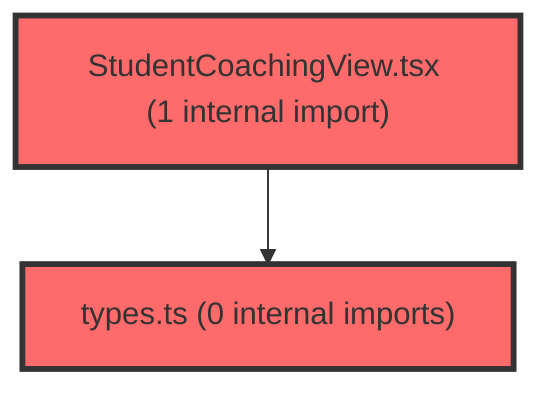

> [!IMPORTANT]
> **⚠️ 수동 검토 권장 (자가힐링 주의)**
>
> AI 자가힐링 결과물이 실제 의도와 다를 수 있으므로, **상세 리뷰 내용에 기반한 수동 점검**을 우선해 주시기 바랍니다. 자가힐링 기능을 활용하실 경우 최종 결과물을 신중하게 확인해 주세요.

# 코드 리뷰 - 4d82fb1f

## 코드 복잡도 분석

**분석된 파일**: 15개 / 변경된 파일: 23개

### Import 의존관계 다이어그램

**범례**: 중심 파일 (변경됨) | 많은 import (10개 이상)

### 정상 범위 (NONE)

**`dgnssmapper.xml`** (other)

- 평균 복잡도: **0.243**

- 최대 복잡도: 0.475

- 청크 수: 2개

- 평균 사용처: 7.0곳

**권장사항:**

- 복잡도 정상 범위

**`dgnsscontroller.java`** (other)

- 평균 복잡도: **0.202**

- 최대 복잡도: 0.470

- 청크 수: 26개

- 평균 사용처: 24.8곳

**권장사항:**

- 파일 크기가 큼 (26개 청크) - 파일 분리 검토

**`dgnssservice.java`** (other)

- 평균 복잡도: **0.110**

- 최대 복잡도: 0.473

- 청크 수: 70개

- 평균 사용처: 12.6곳

**권장사항:**

- 파일 크기가 큼 (70개 청크) - 파일 분리 검토

**`coachingadminmapper.xml`** (other)

- 평균 복잡도: **0.009**

- 최대 복잡도: 0.009

- 청크 수: 1개

**권장사항:**

- 복잡도 정상 범위

**`coachingmapper.xml`** (other)

- 평균 복잡도: **0.009**

- 최대 복잡도: 0.009

- 청크 수: 1개

**권장사항:**

- 복잡도 정상 범위

**`schoolcoachingservice.java`** (other)

- 평균 복잡도: **0.007**

- 최대 복잡도: 0.007

- 청크 수: 1개

**권장사항:**

- 복잡도 정상 범위

**`coachingcontroller.java`** (other)

- 평균 복잡도: **0.006**

- 최대 복잡도: 0.006

- 청크 수: 1개

**권장사항:**

- 복잡도 정상 범위

**`dgnssgraphservice.java`** (other)

- 평균 복잡도: **0.005**

- 최대 복잡도: 0.008

- 청크 수: 9개

**권장사항:**

- 복잡도 정상 범위

**`mock-data.ts`** (other)

- 평균 복잡도: **0.005**

- 최대 복잡도: 0.011

- 청크 수: 5개

**권장사항:**

- 복잡도 정상 범위

**`coachingadmincontroller.java`** (other)

- 평균 복잡도: **0.004**

- 최대 복잡도: 0.007

- 청크 수: 10개

**권장사항:**

- 복잡도 정상 범위

**`coachingadminservice.java`** (other)

- 평균 복잡도: **0.004**

- 최대 복잡도: 0.007

- 청크 수: 4개

**권장사항:**

- 복잡도 정상 범위

**`types.ts`** (other)

- 평균 복잡도: **0.003**

- 최대 복잡도: 0.009

- 청크 수: 30개

**권장사항:**

- 파일 크기가 큼 (30개 청크) - 파일 분리 검토

**`coachingadminmapper.java`** (other)

- 평균 복잡도: **0.001**

- 최대 복잡도: 0.003

- 청크 수: 16개

**권장사항:**

- 복잡도 정상 범위

**`coachingmapper.java`** (other)

- 평균 복잡도: **0.001**

- 최대 복잡도: 0.001

- 청크 수: 2개

**권장사항:**

- 복잡도 정상 범위

**`studentcoachingview.tsx`** (component)

- 평균 복잡도: **0.001**

- 최대 복잡도: 0.005

- 청크 수: 13개

**권장사항:**

- 복잡도 정상 범위

---

## 변경 배경

이 커밋은 **개인화 코칭 v2(B2)** 기능을 신규 도입하고, 이를 운영하기 위한 **admin 편집·이력 관리** 기능을 함께 추가한 것입니다. Neo4j에서 강점/보완점 요인을 선별하고 RDB에서 코칭 문구를 조회·서빙하는 API와, 관리자가 해당 문구를 수정·롤백할 수 있는 관리 화면을 제공합니다. 또한 기존 LERN 학습영역 리포트를 신뢰도 '주의' 학생까지 포함하도록 확장했습니다.

- **목적**: 개인화 코칭 문구의 조회(API)와 편집·이력 관리(admin)를 함께 제공
- **도메인**: API(비즈니스 로직) + Admin(관리 기능) + 그래프(Neo4j 적재)
- **변경 방향**: Neo4j 선별 키와 RDB 텍스트를 분리해 서빙 원본을 관리 가능하게 하고, LERN 리포트를 신뢰도 '주의' 학생까지 확장

---

## [GOOD] 잘된 점

1. **관심사 분리가 명확**: Neo4j 선별(`DgnssGraphService.selectCoachingSelectionByAnswerIdx`)과 RDB 텍스트 조회(`CoachingMapper`/`SchoolCoachingService`)를 분리해, 문구 편집이 그래프 재적재 없이 반영되도록 설계했습니다. `SchoolCoachingService`는 Neo4j에서 선별 키만 받아 RDB에서 텍스트를 조회하므로, admin에서 문구를 수정하면 즉시 API 응답에 반영됩니다.

2. **이력 관리 설계가 견고**: `CoachingAdminService`는 수정 전 pre-image 스냅샷을 `insertStrengthHistoryFromCurrent`/`insertModerationHistoryFromCurrent`로 남기고, 롤백 시에도 되돌리기 직전 값을 다시 이력에 남겨 감사(audit) 추적이 가능합니다. `@Transactional`로 원자성도 보장됩니다.

3. **멱등성 고려**: `DgnssGraphService.loadCoachingV2()`의 Neo4j 적재가 MATCH 기반 in-place 업데이트라 멱등이며, 파일별 `updated_count`를 반환해 검증 가능합니다. 적용 순서(보완점 → 강점)도 주석으로 명시되어 있습니다.

4. **캐시 오염 방지**: `DgnssService.fetchClassTotalReportCached` 반환 리스트를 복사본에서 변형해 원본 캐시를 보호하는 패턴이 잘 적용되었습니다.

---

## 변경사항 요약

개인화 코칭 v2의 API(조회)와 admin(편집·이력·롤백) 계층을 신규 추가하고, Neo4j 적재 엔드포인트와 LERN 리포트 확장을 반영했습니다. 강점/보완점 문구를 RDB에서 관리·서빙하는 구조로 전환했습니다.

---

## [ISSUE] 개선이 필요한 부분

### Critical (즉시 수정 필요)

없음

### High (우선 수정 권장)

없음

### Medium (개선 권장)

1. **`topFactorsByScore`의 부적요인 미보정**
   - `DgnssGraphService.topFactorsByScore`는 개인 T 절대값 기준으로 정렬하지만, 주석에서 명시했듯 스트레스·소진 등 부적요인도 'T가 높다=강점'으로 섞입니다. `absoluteStrengths`/`absoluteWeaknesses`가 FE에 노출되는 값이라면, 요인 성격(정적/부적)에 따른 보정이 필요할 수 있습니다. 현재는 명칭 미확정 상태로 주석 처리되어 있어, FE 계약 확정 시 보정 로직 추가를 권장합니다.

2. **`CoachingAdminController`의 `backParams` 파라미터 조립 방식**
   - `firstPage(backParams)`가 클라이언트가 직접 넘긴 `&k=v` 형태의 문자열을 그대로 `?page=1` + `backParams`로 이어붙입니다. `backParams`가 신뢰할 수 없는 입력이라면 URL 조작 위험이 있습니다. `buildStrengthParams`/`buildModerationParams`처럼 서버에서 파라미터를 재구성하는 방식으로 통일하는 것이 안전합니다.

3. **`SchoolCoachingService`의 raw 타입 캐스팅**
   - `(List<String>) selection.getOrDefault(...)`와 `(Map<String, Object>) selection.get("moderation")`은 Neo4j 서비스 반환 타입에 강하게 결합됩니다. 두 서비스 간 계약이 깨지면 런타임 `ClassCastException`이 발생할 수 있어, 별도 DTO/계약 객체로 분리하는 것을 고려할 수 있습니다.

4. **`appendLernReportForOrd`의 추가 DB 조회**
   - `DgnssService.appendLernReportForOrd`는 `lernInclude='Y'`로 `selectClassTotalReport`를 별도 조회합니다. 이는 신뢰도 '주의' 학생 포함을 위해 의도된 변경이나, 동일 dgnssId에 대해 캐시되지 않은 추가 쿼리가 발생해 성능 부담이 늘어납니다. `fetchClassTotalReportCached` 캐시와 분리된 별도 조회라 평균/lpaByOrd에는 영향이 없지만, 회차 수만큼 추가 쿼리가 발생합니다.

---

## 주요 파일 분석

### DgnssGraphService.java

**변경 내용:**
코칭 v2 선별 키 추출(`selectCoachingSelectionByAnswerIdx`), 개인 T 절대값 기반 강점/약점(`topFactorsByScore`), Neo4j 적재(`loadCoachingV2`) 추가.

**핵심 로직 분석:**

`selectCoachingSelectionByAnswerIdx`는 다음 순서로 동작합니다:
1. `dgnssMapper.selectLpaResultByAnswerIdx`로 LPA 유형/학교급 조회
2. `loadStudentTScores`로 개인 T점수 로드
3. `computeFactorDeviations`로 편차·need 계산 후 need 내림차순 정렬
4. 강점 top2 = need 하위 2개 (가장 강한 순), 보완점 top1 = need 상위 1개 요인의 대표 ModerationPath

**개선 제안:**

1. `topFactorsByScore`의 부적요인 보정
   - **위치**: `topFactorsByScore` 메서드 (개인 T 절대값 정렬)
   - **기존 코드**: 부적요인(스트레스·소진 등)도 T 높은 순으로 강점에 포함됨
   - **해결 방안**: 요인 성격(정적/부적) 메타데이터를 조회해 부적요인은 역방향으로 정렬하거나 제외하는 보정 로직 추가. 다만 FE 계약(명칭)이 미확정 상태이므로, 계약 확정 후 적용 권장. **[수정 코드 제시 불가 — 요인 성격 메타데이터 스키마 미확인]**

### DgnssService.java

**변경 내용:**
LERN 리포트를 신뢰도 '주의' 학생까지 포함하도록 `appendLernReportForOrd`로 분리·확장.

**핵심 로직 분석:**

기존에는 `lpaRows`(캐시)의 json 컬럼을 파싱해 LERN 리포트를 구성했지만, 이제 `appendLernReportForOrd`가 `lernInclude='Y'`로 별도 조회를 수행합니다. 이로써:
- 신뢰도 '주의' 학생도 LERN 리포트에 포함
- 각 row에 `reliabilityWarnings` 배열 부여 (사회적바람직성/반응일관성/연속동일반응)
- 타학급 응시중(N) 학생도 보강

**개선 제안:**

1. 별도 조회로 인한 추가 DB 쿼리
   - **위치**: `appendLernReportForOrd` 내 `selectClassTotalReport(inParam)` 호출
   - **기존 코드**: `lernInclude='Y'`로 별도 조회 (캐시 미사용)
   - **해결 방안**: `fetchClassTotalReportCached` 캐시에 `lernInclude` 분기값을 함께 캐시하거나, 동일 dgnssId에 대한 중복 조회를 줄이는 방안 검토. 다만 신뢰도 '주의' 포함 여부가 평균/lpaByOrd 경로와 다르므로, 캐시 공유 시 오염 위험이 있어 신중한 설계 필요. **[수정 코드 제시 불가 — 캐시 구조 변경의 부작용 범위 미확인]**

### CoachingAdminService.java

**변경 내용:**
강점/보완점 수정 시 pre-image 스냅샷 후 갱신, 롤백 시 되돌리기 직전 값도 이력에 남김.

**핵심 로직 분석:**

`updateStrength`는 `insertStrengthHistoryFromCurrent(id, "UPDATE", adminId)`로 수정 직전 값을 스냅샷한 뒤 `updateStrength`로 본문을 갱신합니다. `rollbackStrength`는 대상 이력 스냅샷을 조회해 해당 값으로 되돌리되, 되돌리기 직전 값도 `"ROLLBACK"` 액션으로 다시 이력에 남깁니다. 이로써 모든 변경이 이력으로 추적됩니다.

**개선 제안:**

1. `MapUtils.getLongValue` 기본값 처리
   - **위치**: `rollbackStrength`/`rollbackModeration`의 `MapUtils.getLongValue(snap, "strengthId")`
   - **기존 코드**: `getLongValue`는 키가 없거나 null이면 0L을 반환
   - **해결 방안**: 스냅샷에 `strengthId`/`moderationRowId`가 없으면 0L로 롤백 대상이 잘못 지정될 수 있습니다. `MapUtils.getLongValue(snap, "strengthId", -1L)`처럼 명시적 기본값을 사용하거나, 0 이하일 때 예외를 던지는 방어 로직을 추가하는 것이 안전합니다.

---

## 최종 평가

**결론**:
- [ ] [OK] **승인 (Approved)** - Critical/High 이슈 없음
- [x] [WARN] **조건부 승인 (Approved with Comments)** - Medium 이하 이슈만 존재
- [ ] [FIX] **수정 필요 (Changes Requested)** - Critical/High 이슈 존재

**종합 의견:**

전반적으로 설계가 명확하고 견고한 커밋입니다. Neo4j 선별과 RDB 텍스트 서빙을 분리한 구조, 이력 스냅샷 기반 롤백, 멱등한 그래프 적재 등 실무적으로 잘 구성되었습니다. 특히 `CoachingAdminService`의 pre-image 스냅샷 방식은 수정 이력 추적이 필요한 관리 기능에서 모범적인 패턴입니다.

다만 `topFactorsByScore`의 부적요인 미보정, `backParams`의 신뢰성, `appendLernReportForOrd`의 추가 DB 조회 등 Medium 수준의 개선 여지가 있어 조건부 승인을 권장합니다. 특히 `MapUtils.getLongValue`의 기본값 처리와 `backParams` 서버측 재구성은 다음 반영 시 함께 개선하면 좋겠습니다.