> [!IMPORTANT]
> **⚠️ 수동 검토 권장 (자가힐링 주의)**
>
> AI 자가힐링 결과물이 실제 의도와 다를 수 있으므로, **상세 리뷰 내용에 기반한 수동 점검**을 우선해 주시기 바랍니다. 자가힐링 기능을 활용하실 경우 최종 결과물을 신중하게 확인해 주세요.

# 코드 리뷰 - 4dae8e61

## 코드 복잡도 분석

**분석된 파일**: 116개 / 변경된 파일: 170개


### Import 의존관계 다이어그램

```mermaid
flowchart TD
    F0["GroupServiceTest.java (12 internal imports)"]:::center
    F1["GroupMemberMapper.java (0 internal imports)"]:::center
    F2["MemberService.java (0 internal imports)"]:::center
    F3["ErrorReportModal.tsx (0 internal imports)"]:::center
    F4["AssessmentList.tsx (1 internal import)"]:::center
    F5["contextBuilder.ts (0 internal imports)"]:::center
    F6["GroupMember.java (0 internal imports)"]:::center
    F7["tools (1 internal import)"]:::center
    F8["ChatArea.tsx (1 internal import)"]:::center
    F9["MemberController.java (7 internal imports)"]:::center
    F10["BellWithPanel.tsx (2 internal imports)"]:::center
    F11["User.java (0 internal imports)"]:::center
    F12["MyResultPage.tsx (1 internal import)"]:::center
    F13["PiiMasker.java (0 internal imports)"]:::center
    F14["GeneralSection.tsx (1 internal import)"]:::center
    F15["assessmentService.ts (0 internal imports)"]:::center
    F16["SsoUserQueryService.java (0 internal imports)"]:::center
    F17["neo4j_tools.py (0 internal imports)"]:::center
    F18["queries.ts (0 internal imports)"]:::center
    F19["studentExamService.ts (0 internal imports)"]:::center
    F20["assistantService.ts (1 internal import)"]:::center
    F21["SsoUserMigrationService.java (3 internal imports)"]:::center
    F22["useNotificationStream.ts (0 internal imports)"]:::center
    F9 --> F2
    F9 --> F11
    F9 --> F21
    F9 --> F16
    F7 --> F17
    F21 --> F13
    F21 --> F11
    F0 --> F1
    F0 --> F2
    F0 --> F6
    F0 --> F11
    F20 --> F5
    F8 --> F3
    F4 --> F15
    F14 --> F4
    F10 --> F18
    F10 --> F22
    F12 --> F19
    classDef center fill:#ff6b6b,stroke:#333,stroke-width:3px
    classDef high fill:#ffd93d,stroke:#333,stroke-width:2px
```



**범례**: 중심 파일 (변경됨) | 많은 import (10개 이상)


### 정상 범위 (NONE)


**`membercontroller.java`** (other)

- 평균 복잡도: **0.391**

- 최대 복잡도: 0.470

- 청크 수: 6개

- 평균 사용처: 53.7곳


**권장사항:**

- 복잡도 정상 범위


**`memberservice.java`** (other)

- 평균 복잡도: **0.381**

- 최대 복잡도: 0.468

- 청크 수: 11개

- 평균 사용처: 73.5곳


**권장사항:**

- 복잡도 정상 범위


**`fileutil.java`** (utility)

- 평균 복잡도: **0.271**

- 최대 복잡도: 0.474

- 청크 수: 19개

- 평균 사용처: 37.5곳


**권장사항:**

- 복잡도 정상 범위


**`filemapper.xml`** (other)

- 평균 복잡도: **0.243**

- 최대 복잡도: 0.474

- 청크 수: 2개

- 평균 사용처: 7.0곳


**권장사항:**

- 복잡도 정상 범위


**`dgnssmapper.xml`** (other)

- 평균 복잡도: **0.242**

- 최대 복잡도: 0.473

- 청크 수: 2개

- 평균 사용처: 7.0곳


**권장사항:**

- 복잡도 정상 범위


**`counselinginfomapper.xml`** (other)

- 평균 복잡도: **0.238**

- 최대 복잡도: 0.469

- 청크 수: 2개

- 평균 사용처: 7.0곳


**권장사항:**

- 복잡도 정상 범위


**`groupmembermapper.xml`** (other)

- 평균 복잡도: **0.238**

- 최대 복잡도: 0.469

- 청크 수: 2개

- 평균 사용처: 7.0곳


**권장사항:**

- 복잡도 정상 범위


**`groupquerymapper.xml`** (other)

- 평균 복잡도: **0.238**

- 최대 복잡도: 0.469

- 청크 수: 2개

- 평균 사용처: 7.0곳


**권장사항:**

- 복잡도 정상 범위


**`usermapper.xml`** (other)

- 평균 복잡도: **0.238**

- 최대 복잡도: 0.469

- 청크 수: 2개

- 평균 사용처: 7.0곳


**권장사항:**

- 복잡도 정상 범위


**`memoinfomapper.xml`** (other)

- 평균 복잡도: **0.238**

- 최대 복잡도: 0.469

- 청크 수: 2개

- 평균 사용처: 7.0곳


**권장사항:**

- 복잡도 정상 범위


**`memocontroller.java`** (other)

- 평균 복잡도: **0.237**

- 최대 복잡도: 0.469

- 청크 수: 8개

- 평균 사용처: 31.1곳


**권장사항:**

- 복잡도 정상 범위


**`counselingcontroller.java`** (other)

- 평균 복잡도: **0.236**

- 최대 복잡도: 0.468

- 청크 수: 20개

- 평균 사용처: 33.8곳


**권장사항:**

- 복잡도 정상 범위


**`guestservice.java`** (other)

- 평균 복잡도: **0.236**

- 최대 복잡도: 0.466

- 청크 수: 2개

- 평균 사용처: 32.5곳


**권장사항:**

- 복잡도 정상 범위


**`memoservice.java`** (other)

- 평균 복잡도: **0.236**

- 최대 복잡도: 0.470

- 청크 수: 8개

- 평균 사용처: 26.0곳


**권장사항:**

- 복잡도 정상 범위


**`indexcontroller.java`** (other)

- 평균 복잡도: **0.236**

- 최대 복잡도: 0.470

- 청크 수: 6개

- 평균 사용처: 13.5곳


**권장사항:**

- 복잡도 정상 범위


**`user.java`** (other)

- 평균 복잡도: **0.233**

- 최대 복잡도: 0.464

- 청크 수: 6개

- 평균 사용처: 42.3곳


**권장사항:**

- 복잡도 정상 범위


**`counselinginfomapper.java`** (other)

- 평균 복잡도: **0.231**

- 최대 복잡도: 0.464

- 청크 수: 16개

- 평균 사용처: 18.7곳


**권장사항:**

- 복잡도 정상 범위


**`memoinfomapper.java`** (other)

- 평균 복잡도: **0.231**

- 최대 복잡도: 0.464

- 청크 수: 10개

- 평균 사용처: 23.4곳


**권장사항:**

- 복잡도 정상 범위


**`index.ts`** (other)

- 평균 복잡도: **0.231**

- 최대 복잡도: 0.461

- 청크 수: 2개

- 평균 사용처: 24.5곳


**권장사항:**

- 복잡도 정상 범위


**`dgnsscontroller.java`** (other)

- 평균 복잡도: **0.227**

- 최대 복잡도: 0.470

- 청크 수: 23개

- 평균 사용처: 28.1곳


**권장사항:**

- 파일 크기가 큼 (23개 청크) - 파일 분리 검토


**`counselingservice.java`** (other)

- 평균 복잡도: **0.226**

- 최대 복잡도: 0.470

- 청크 수: 27개

- 평균 사용처: 20.6곳


**권장사항:**

- 파일 크기가 큼 (27개 청크) - 파일 분리 검토


**`metaapplication.java`** (other)

- 평균 복잡도: **0.214**

- 최대 복잡도: 0.465

- 청크 수: 4개

- 평균 사용처: 9.8곳


**권장사항:**

- 복잡도 정상 범위


**`pdfservice.java`** (other)

- 평균 복잡도: **0.213**

- 최대 복잡도: 0.468

- 청크 수: 11개

- 평균 사용처: 33.8곳


**권장사항:**

- 복잡도 정상 범위


**`groupcontroller.java`** (other)

- 평균 복잡도: **0.205**

- 최대 복잡도: 0.467

- 청크 수: 23개

- 평균 사용처: 24.8곳


**권장사항:**

- 파일 크기가 큼 (23개 청크) - 파일 분리 검토


**`agent_service.py`** (other)

- 평균 복잡도: **0.200**

- 최대 복잡도: 0.464

- 청크 수: 7개

- 평균 사용처: 8.0곳


**권장사항:**

- 복잡도 정상 범위


**`groupmembermapper.java`** (other)

- 평균 복잡도: **0.195**

- 최대 복잡도: 0.465

- 청크 수: 19개

- 평균 사용처: 15.4곳


**권장사항:**

- 복잡도 정상 범위


**`dgnssmapper.java`** (other)

- 평균 복잡도: **0.193**

- 최대 복잡도: 0.466

- 청크 수: 193개

- 평균 사용처: 28.8곳


**권장사항:**

- 파일 크기가 큼 (193개 청크) - 파일 분리 검토


**`admincontroller.java`** (other)

- 평균 복잡도: **0.192**

- 최대 복잡도: 0.470

- 청크 수: 32개

- 평균 사용처: 12.6곳


**권장사항:**

- 파일 크기가 큼 (32개 청크) - 파일 분리 검토


**`groupmember.java`** (other)

- 평균 복잡도: **0.189**

- 최대 복잡도: 0.464

- 청크 수: 5개

- 평균 사용처: 10.0곳


**권장사항:**

- 복잡도 정상 범위


**`groupservice.java`** (other)

- 평균 복잡도: **0.160**

- 최대 복잡도: 0.471

- 청크 수: 6개

- 평균 사용처: 12.5곳


**권장사항:**

- 복잡도 정상 범위


**`main.py`** (other)

- 평균 복잡도: **0.159**

- 최대 복잡도: 0.471

- 청크 수: 9개

- 평균 사용처: 5.3곳


**권장사항:**

- 복잡도 정상 범위


**`globalexceptionhandler.java`** (config)

- 평균 복잡도: **0.132**

- 최대 복잡도: 0.466

- 청크 수: 18개

- 평균 사용처: 13.9곳


**권장사항:**

- Config 파일은 높은 연결도가 정상적임


**`dgnssservice.java`** (other)

- 평균 복잡도: **0.131**

- 최대 복잡도: 0.473

- 청크 수: 58개

- 평균 사용처: 15.2곳


**권장사항:**

- 파일 크기가 큼 (58개 청크) - 파일 분리 검토


**`apiresponseaspect.java`** (other)

- 평균 복잡도: **0.120**

- 최대 복잡도: 0.467

- 청크 수: 4개

- 평균 사용처: 14.8곳


**권장사항:**

- 복잡도 정상 범위


**`fileservice.java`** (other)

- 평균 복잡도: **0.120**

- 최대 복잡도: 0.468

- 청크 수: 16개

- 평균 사용처: 21.9곳


**권장사항:**

- 복잡도 정상 범위


**`client.ts`** (other)

- 평균 복잡도: **0.082**

- 최대 복잡도: 0.473

- 청크 수: 33개

- 평균 사용처: 2.8곳


**권장사항:**

- 파일 크기가 큼 (33개 청크) - 파일 분리 검토


**`ssousermigrationservice.java`** (other)

- 평균 복잡도: **0.015**

- 최대 복잡도: 0.015

- 청크 수: 1개


**권장사항:**

- 복잡도 정상 범위


**`aibugreport.java`** (other)

- 평균 복잡도: **0.013**

- 최대 복잡도: 0.013

- 청크 수: 1개


**권장사항:**

- 복잡도 정상 범위


**`qchskip.java`** (other)

- 평균 복잡도: **0.010**

- 최대 복잡도: 0.010

- 청크 수: 1개


**권장사항:**

- 복잡도 정상 범위


**`groupservicetest.java`** (other)

- 평균 복잡도: **0.010**

- 최대 복잡도: 0.010

- 청크 수: 1개


**권장사항:**

- 복잡도 정상 범위


**`qchtraceclient.java`** (other)

- 평균 복잡도: **0.009**

- 최대 복잡도: 0.009

- 청크 수: 1개


**권장사항:**

- 복잡도 정상 범위


**`qchtraceevent.java`** (other)

- 평균 복잡도: **0.009**

- 최대 복잡도: 0.013

- 청크 수: 2개


**권장사항:**

- 복잡도 정상 범위


**`userprofilecontroller.java`** (other)

- 평균 복잡도: **0.008**

- 최대 복잡도: 0.008

- 청크 수: 1개


**권장사항:**

- 복잡도 정상 범위


**`aiconversation.java`** (other)

- 평균 복잡도: **0.008**

- 최대 복잡도: 0.008

- 청크 수: 1개


**권장사항:**

- 복잡도 정상 범위


**`schoolrecordinfomapper.xml`** (other)

- 평균 복잡도: **0.008**

- 최대 복잡도: 0.008

- 청크 수: 1개


**권장사항:**

- 복잡도 정상 범위


**`notificationtesterpagecontroller.java`** (component)

- 평균 복잡도: **0.007**

- 최대 복잡도: 0.008

- 청크 수: 2개


**권장사항:**

- 복잡도 정상 범위


**`ncpobjectstorageconfig.java`** (config)

- 평균 복잡도: **0.007**

- 최대 복잡도: 0.010

- 청크 수: 2개


**권장사항:**

- Config 파일은 높은 연결도가 정상적임


**`aibugreportmapper.xml`** (other)

- 평균 복잡도: **0.007**

- 최대 복잡도: 0.007

- 청크 수: 1개


**권장사항:**

- 복잡도 정상 범위


**`aiconversationmapper.xml`** (other)

- 평균 복잡도: **0.007**

- 최대 복잡도: 0.007

- 청크 수: 1개


**권장사항:**

- 복잡도 정상 범위


**`aibugreportcontroller.java`** (other)

- 평균 복잡도: **0.006**

- 최대 복잡도: 0.007

- 청크 수: 3개


**권장사항:**

- 복잡도 정상 범위


**`qchasyncconfig.java`** (config)

- 평균 복잡도: **0.006**

- 최대 복잡도: 0.006

- 청크 수: 1개


**권장사항:**

- Config 파일은 높은 연결도가 정상적임


**`qchrequestbodycachingfilter.java`** (config)

- 평균 복잡도: **0.006**

- 최대 복잡도: 0.009

- 청크 수: 2개


**권장사항:**

- Config 파일은 높은 연결도가 정상적임


**`env.ts`** (config)

- 평균 복잡도: **0.006**

- 최대 복잡도: 0.006

- 청크 수: 1개


**권장사항:**

- Config 파일은 높은 연결도가 정상적임


**`neo4j_tools.py`** (other)

- 평균 복잡도: **0.005**

- 최대 복잡도: 0.010

- 청크 수: 7개


**권장사항:**

- 복잡도 정상 범위


**`aibugreportdto.java`** (other)

- 평균 복잡도: **0.005**

- 최대 복잡도: 0.007

- 청크 수: 7개


**권장사항:**

- 복잡도 정상 범위


**`aiconversationservice.java`** (other)

- 평균 복잡도: **0.005**

- 최대 복잡도: 0.009

- 청크 수: 15개


**권장사항:**

- 복잡도 정상 범위


**`schoolrecordcontroller.java`** (other)

- 평균 복잡도: **0.005**

- 최대 복잡도: 0.006

- 청크 수: 3개


**권장사항:**

- 복잡도 정상 범위


**`schoolrecordservice.java`** (other)

- 평균 복잡도: **0.005**

- 최대 복잡도: 0.006

- 청크 수: 4개


**권장사항:**

- 복잡도 정상 범위


**`qchtraceaspect.java`** (other)

- 평균 복잡도: **0.005**

- 최대 복잡도: 0.009

- 청크 수: 5개


**권장사항:**

- 복잡도 정상 범위


**`webclientconfig.java`** (config)

- 평균 복잡도: **0.005**

- 최대 복잡도: 0.006

- 청크 수: 2개


**권장사항:**

- Config 파일은 높은 연결도가 정상적임


**`ssouserregistrationservice.java`** (other)

- 평균 복잡도: **0.004**

- 최대 복잡도: 0.004

- 청크 수: 1개


**권장사항:**

- 복잡도 정상 범위


**`qchproperties.java`** (config)

- 평균 복잡도: **0.004**

- 최대 복잡도: 0.004

- 청크 수: 1개


**권장사항:**

- Config 파일은 높은 연결도가 정상적임


**`piimasker.java`** (utility)

- 평균 복잡도: **0.004**

- 최대 복잡도: 0.009

- 청크 수: 7개


**권장사항:**

- 복잡도 정상 범위


**`chatapiservice.ts`** (other)

- 평균 복잡도: **0.004**

- 최대 복잡도: 0.009

- 청크 수: 18개


**권장사항:**

- 복잡도 정상 범위


**`studentexamservice.ts`** (other)

- 평균 복잡도: **0.004**

- 최대 복잡도: 0.008

- 청크 수: 17개


**권장사항:**

- 복잡도 정상 범위


**`aibugreportservice.java`** (other)

- 평균 복잡도: **0.003**

- 최대 복잡도: 0.005

- 청크 수: 3개


**권장사항:**

- 복잡도 정상 범위


**`notificationcontroller.java`** (other)

- 평균 복잡도: **0.003**

- 최대 복잡도: 0.004

- 청크 수: 4개


**권장사항:**

- 복잡도 정상 범위


**`notificationdebugcontroller.java`** (other)

- 평균 복잡도: **0.003**

- 최대 복잡도: 0.004

- 청크 수: 16개


**권장사항:**

- 복잡도 정상 범위


**`authproxycontroller.java`** (other)

- 평균 복잡도: **0.003**

- 최대 복잡도: 0.005

- 청크 수: 4개


**권장사항:**

- 복잡도 정상 범위


**`spusermappingfilter.java`** (config)

- 평균 복잡도: **0.003**

- 최대 복잡도: 0.005

- 청크 수: 3개


**권장사항:**

- Config 파일은 높은 연결도가 정상적임


**`validationexception.java`** (other)

- 평균 복잡도: **0.003**

- 최대 복잡도: 0.005

- 청크 수: 3개


**권장사항:**

- 복잡도 정상 범위


**`ncpstorageservice.java`** (other)

- 평균 복잡도: **0.003**

- 최대 복잡도: 0.007

- 청크 수: 6개


**권장사항:**

- 복잡도 정상 범위


**`assessmentservice.ts`** (other)

- 평균 복잡도: **0.003**

- 최대 복잡도: 0.007

- 청크 수: 24개


**권장사항:**

- 파일 크기가 큼 (24개 청크) - 파일 분리 검토


**`queries.ts`** (other)

- 평균 복잡도: **0.003**

- 최대 복잡도: 0.014

- 청크 수: 25개


**권장사항:**

- 파일 크기가 큼 (25개 청크) - 파일 분리 검토


**`datahelperservice.ts`** (utility)

- 평균 복잡도: **0.003**

- 최대 복잡도: 0.010

- 청크 수: 36개


**권장사항:**

- 파일 크기가 큼 (36개 청크) - 파일 분리 검토


**`dashboardservice.ts`** (other)

- 평균 복잡도: **0.003**

- 최대 복잡도: 0.008

- 청크 수: 49개


**권장사항:**

- 파일 크기가 큼 (49개 청크) - 파일 분리 검토


**`errorreportservice.ts`** (other)

- 평균 복잡도: **0.003**

- 최대 복잡도: 0.006

- 청크 수: 7개


**권장사항:**

- 복잡도 정상 범위


**`pdfdownloadservice.ts`** (other)

- 평균 복잡도: **0.003**

- 최대 복잡도: 0.009

- 청크 수: 18개


**권장사항:**

- 복잡도 정상 범위


**`index.ts`** (other)

- 평균 복잡도: **0.003**

- 최대 복잡도: 0.010

- 청크 수: 93개


**권장사항:**

- 파일 크기가 큼 (93개 청크) - 파일 분리 검토


**`__init__.py`** (other)

- 평균 복잡도: **0.002**

- 최대 복잡도: 0.002

- 청크 수: 1개


**권장사항:**

- 복잡도 정상 범위


**`ssouserqueryservice.java`** (other)

- 평균 복잡도: **0.002**

- 최대 복잡도: 0.002

- 청크 수: 2개


**권장사항:**

- 복잡도 정상 범위


**`assistantservice.ts`** (other)

- 평균 복잡도: **0.002**

- 최대 복잡도: 0.008

- 청크 수: 11개


**권장사항:**

- 복잡도 정상 범위


**`contextbuilder.ts`** (other)

- 평균 복잡도: **0.002**

- 최대 복잡도: 0.008

- 청크 수: 41개


**권장사항:**

- 파일 크기가 큼 (41개 청크) - 파일 분리 검토


**`useconversations.ts`** (other)

- 평균 복잡도: **0.002**

- 최대 복잡도: 0.010

- 청크 수: 65개


**권장사항:**

- 파일 크기가 큼 (65개 청크) - 파일 분리 검토


**`authcontext.tsx`** (other)

- 평균 복잡도: **0.002**

- 최대 복잡도: 0.008

- 청크 수: 15개


**권장사항:**

- 복잡도 정상 범위


**`usenotificationstream.ts`** (other)

- 평균 복잡도: **0.002**

- 최대 복잡도: 0.009

- 청크 수: 13개


**권장사항:**

- 복잡도 정상 범위


**`assessmentpage.tsx`** (component)

- 평균 복잡도: **0.002**

- 최대 복잡도: 0.011

- 청크 수: 46개


**권장사항:**

- 파일 크기가 큼 (46개 청크) - 파일 분리 검토


**`exampage.tsx`** (component)

- 평균 복잡도: **0.002**

- 최대 복잡도: 0.013

- 청크 수: 38개


**권장사항:**

- 파일 크기가 큼 (38개 청크) - 파일 분리 검토


**`dateutils.ts`** (utility)

- 평균 복잡도: **0.002**

- 최대 복잡도: 0.002

- 청크 수: 8개


**권장사항:**

- 복잡도 정상 범위


**`aibugreportmapper.java`** (other)

- 평균 복잡도: **0.001**

- 최대 복잡도: 0.002

- 청크 수: 8개


**권장사항:**

- 복잡도 정상 범위


**`useapidata.ts`** (other)

- 평균 복잡도: **0.001**

- 최대 복잡도: 0.010

- 청크 수: 38개


**권장사항:**

- 파일 크기가 큼 (38개 청크) - 파일 분리 검토


**`assessmentlist.tsx`** (other)

- 평균 복잡도: **0.001**

- 최대 복잡도: 0.009

- 청크 수: 66개


**권장사항:**

- 파일 크기가 큼 (66개 청크) - 파일 분리 검토


**`creategroupmodal.tsx`** (other)

- 평균 복잡도: **0.001**

- 최대 복잡도: 0.006

- 청크 수: 57개


**권장사항:**

- 파일 크기가 큼 (57개 청크) - 파일 분리 검토


**`bellwithpanel.tsx`** (other)

- 평균 복잡도: **0.001**

- 최대 복잡도: 0.005

- 청크 수: 15개


**권장사항:**

- 복잡도 정상 범위


**`monthlycalendar.tsx`** (other)

- 평균 복잡도: **0.001**

- 최대 복잡도: 0.008

- 청크 수: 35개


**권장사항:**

- 파일 크기가 큼 (35개 청크) - 파일 분리 검토


**`weeklycalendar.tsx`** (other)

- 평균 복잡도: **0.001**

- 최대 복잡도: 0.007

- 청크 수: 61개


**권장사항:**

- 파일 크기가 큼 (61개 청크) - 파일 분리 검토


**`schoolrecordpanel.tsx`** (other)

- 평균 복잡도: **0.001**

- 최대 복잡도: 0.008

- 청크 수: 56개


**권장사항:**

- 파일 크기가 큼 (56개 청크) - 파일 분리 검토


**`studentdashboardpage.tsx`** (component)

- 평균 복잡도: **0.001**

- 최대 복잡도: 0.008

- 청크 수: 50개


**권장사항:**

- 파일 크기가 큼 (50개 청크) - 파일 분리 검토


**`useprofilecheck.ts`** (other)

- 평균 복잡도: **0.001**

- 최대 복잡도: 0.004

- 청크 수: 6개


**권장사항:**

- 복잡도 정상 범위


**`classdashboardwidget.tsx`** (other)

- 평균 복잡도: **0.001**

- 최대 복잡도: 0.009

- 청크 수: 136개


**권장사항:**

- 파일 크기가 큼 (136개 청크) - 파일 분리 검토


**`schedulewidget.tsx`** (other)

- 평균 복잡도: **0.001**

- 최대 복잡도: 0.006

- 청크 수: 100개


**권장사항:**

- 파일 크기가 큼 (100개 청크) - 파일 분리 검토


**`schoolrecordinfomapper.java`** (other)

- 평균 복잡도: **0.000**

- 최대 복잡도: 0.001

- 청크 수: 4개


**권장사항:**

- 복잡도 정상 범위


**`chatarea.tsx`** (other)

- 평균 복잡도: **0.000**

- 최대 복잡도: 0.008

- 청크 수: 82개


**권장사항:**

- 파일 크기가 큼 (82개 청크) - 파일 분리 검토


**`errorreportmodal.tsx`** (other)

- 평균 복잡도: **0.000**

- 최대 복잡도: 0.011

- 청크 수: 136개


**권장사항:**

- 파일 크기가 큼 (136개 청크) - 파일 분리 검토


**`generalsection.tsx`** (other)

- 평균 복잡도: **0.000**

- 최대 복잡도: 0.000

- 청크 수: 45개


**권장사항:**

- 파일 크기가 큼 (45개 청크) - 파일 분리 검토


**`joincodemodal.tsx`** (other)

- 평균 복잡도: **0.000**

- 최대 복잡도: 0.013

- 청크 수: 69개


**권장사항:**

- 파일 크기가 큼 (69개 청크) - 파일 분리 검토


**`datedetailpanel.tsx`** (other)

- 평균 복잡도: **0.000**

- 최대 복잡도: 0.005

- 청크 수: 63개


**권장사항:**

- 파일 크기가 큼 (63개 청크) - 파일 분리 검토


**`myresultpage.tsx`** (component)

- 평균 복잡도: **0.000**

- 최대 복잡도: 0.008

- 청크 수: 93개


**권장사항:**

- 파일 크기가 큼 (93개 청크) - 파일 분리 검토


**`studentgroupspage.tsx`** (component)

- 평균 복잡도: **0.000**

- 최대 복잡도: 0.008

- 청크 수: 126개


**권장사항:**

- 파일 크기가 큼 (126개 청크) - 파일 분리 검토


**`airoompage.tsx`** (component)

- 평균 복잡도: **0.000**

- 최대 복잡도: 0.002

- 청크 수: 9개


**권장사항:**

- 복잡도 정상 범위


**`completeprofilepage.tsx`** (component)

- 평균 복잡도: **0.000**

- 최대 복잡도: 0.006

- 청크 수: 46개


**권장사항:**

- 파일 크기가 큼 (46개 청크) - 파일 분리 검토


**`svgicons.ts`** (other)

- 평균 복잡도: **0.000**

- 최대 복잡도: 0.000

- 청크 수: 1개


**권장사항:**

- 복잡도 정상 범위


**`airoomchatarea.tsx`** (other)

- 평균 복잡도: **0.000**

- 최대 복잡도: 0.000

- 청크 수: 24개


**권장사항:**

- 파일 크기가 큼 (24개 청크) - 파일 분리 검토


**`groupdetailwidget.tsx`** (other)

- 평균 복잡도: **0.000**

- 최대 복잡도: 0.008

- 청크 수: 189개


**권장사항:**

- 파일 크기가 큼 (189개 청크) - 파일 분리 검토


**`mainlayout.tsx`** (other)

- 평균 복잡도: **0.000**

- 최대 복잡도: 0.010

- 청크 수: 125개


**권장사항:**

- 파일 크기가 큼 (125개 청크) - 파일 분리 검토


**`studentlayout.tsx`** (other)

- 평균 복잡도: **0.000**

- 최대 복잡도: 0.007

- 청크 수: 83개


**권장사항:**

- 파일 크기가 큼 (83개 청크) - 파일 분리 검토


---


## 변경 배경

이 커밋은 AI Agent(agent)가 Neo4j 그래프 데이터베이스의 LPA(잠재프로파일분석) 유형 데이터를 Tool Calling 방식으로 조회할 수 있도록 하는 핵심 기능 구현입니다. 기존에는 Agent가 단순히 컨텍스트 텍스트만 참고하여 응답했으나, 이제 LLM이 자율적으로 Neo4j Tool을 호출하여 실제 데이터(유형별 조절/매개 경로, 집단 평균 T점수 등)를 기반으로 한 정확한 상담 응답을 생성할 수 있게 되었습니다.

- **목적**: AI Agent의 LPA 데이터 기반 상담 응답 정확도 향상 (할루시네이션 감소)
- **도메인**: AI Agent (Python FastAPI) - 비즈니스 로직 / 인프라 (Neo4j 연동, CI/CD)
- **변경 방향**: 단순 텍스트 컨텍스트 기반 응답 -> Tool Calling 기반 데이터 조회 + 융합 추론

## [GOOD] 잘된 점

1. **체계적인 Tool Calling 아키텍처**: `run_agent`와 `run_agent_stream` 모두 `max_iterations` 기반의 Tool Calling 루프를 일관되게 구현하여, LLM이 여러 Tool을 순차 호출하며 최종 응답을 생성하는 패턴이 잘 설계되었습니다. `_build_messages`와 `_build_system_prompt`의 분리로 메시지 구성 로직이 명확해졌습니다.

2. **방어적 설계의 우수성**: `_validate_args`를 통한 className/schoolLevel 화이트리스트 검증, `_normalize_tool_args`를 통한 LLM의 잘못된 입력 정규화, `_execute_query`의 세분화된 예외 처리(TIMEOUT, UNAVAILABLE, AUTH_FAILED, CLIENT_ERROR)까지 Graceful Degradation을 고려한 설계가 돋보입니다.

3. **세션 컨텍스트 영속화**: `session_context_store`를 도입하여 첫 메시지의 `context_data`를 이후 턴에서도 재사용할 수 있게 한 점이 좋습니다. 교사가 대화 중간에 새 질문을 해도 동일한 학생 컨텍스트가 유지됩니다.

## 변경사항 요약

- Agent 서비스에 Tool Calling 루프 도입 (비스트리밍/스트리밍 모두 지원)
- Neo4j Tool 5종 신규 생성 (LPA 유형 메타, 조절/매개 경로, 요인 T점수, 통합 개요)
- 시스템 프롬프트를 동적 생성하는 `_build_system_prompt` 도입 (할루시네이션 방지 규칙 포함)
- CI/CD 파이프라인 추가 (backend/frontend 분리 빌드)
- AGENTS.md 가이드 문서 추가

---

## [ISSUE] 개선이 필요한 부분

### Critical (즉시 수정 필요)

없음

### High (우선 수정 권장)

**1. `run_agent_stream`에서 Tool Calling 후 최종 응답 누락 가능성**

`run_agent_stream` 메서드는 Generator(async generator)로 구현되어 있어, yield를 통해 실시간으로 텍스트 청크를 클라이언트에 전송합니다. 문제는 Tool Calling이 발생한 iteration 이후의 흐름에 있습니다.

현재 코드의 핵심 로직을 분석하면 다음과 같습니다:

```python
# agent/app/services/agent_service.py, run_agent_stream 메서드
while iterations < self.max_iterations:
    response = await self.router.acompletion(
        model="meta-agent-service",
        messages=messages,
        tools=self.tools,
        stream=True
    )

    content_buffer = ""
    tool_call_buffer = {}

    async for chunk in response:
        delta = chunk.choices[0].delta
        if getattr(delta, "content", None):
            content_buffer += delta.content
            yield delta.content
        if getattr(delta, "tool_calls", None):
            # tool_call_buffer에 축적
            ...

    if not tool_call_buffer:
        final_content = content_buffer or fallback_message
        history.add_user_message(text)
        history.add_ai_message(final_content)
        break

    # Tool Calling이 발생한 경우: tool_call_buffer를 messages에 추가하고 계속
    ...
    iterations += 1
```

이 코드에서 Tool Calling이 발생하면 `content_buffer`는 Tool 호출 전 LLM이 생성한 텍스트(예: "데이터를 조회하겠습니다...")만 담고 있습니다. 이후 Tool 실행 결과를 messages에 추가하고 다음 iteration으로 넘어갑니다. 다음 iteration에서 LLM이 Tool 결과를 바탕으로 최종 텍스트 응답을 생성하면, 그 응답은 `yield`를 통해 클라이언트에 전송되지만 `final_content` 변수에는 저장되지 않습니다.

**중요한 점**: `run_agent_stream`은 Generator이므로 반환값이 없고, 모든 출력은 `yield`를 통해 이루어집니다. 따라서 `final_content` 변수는 Generator가 종료된 후에는 아무도 읽지 않는 데드 코드(dead code)입니다. 다만, `history.add_ai_message(final_content)`가 호출되는 시점이 `tool_call_buffer`가 비어있을 때(즉, Tool Calling 없이 바로 응답이 완료된 경우)로 한정되어 있어, Tool Calling이 발생한 경우에는 `history.add_ai_message`가 호출되지 않습니다.

**영향**: Tool Calling이 발생한 시나리오에서 대화 이력(history)에 최종 AI 응답이 저장되지 않습니다. 이후 같은 session_id로 추가 질문을 할 때, 이전 AI 응답이 history에 없으므로 맥락이 끊길 수 있습니다.

**해결 방안**:
```python
# Tool Calling이 발생하지 않은 경우 (기존 로직 유지)
if not tool_call_buffer:
    final_content = content_buffer or fallback_message
    history.add_user_message(text)
    history.add_ai_message(final_content)
    break

# Tool Calling이 발생한 경우: content_buffer를 최종 응답의 일부로 저장
# (실제 최종 응답은 다음 iteration에서 생성되므로, 여기서는 저장하지 않고
#  루프 종료 후 최종 응답을 별도로 수집해야 함)
```

하지만 Generator 패턴의 특성상 "루프 종료 후"라는 개념이 모호합니다. 가장 실용적인 해결책은 `run_agent_stream`의 호출부(caller)에서 Generator를 소비하면서 최종 응답을 수집하고, 그 응답을 history에 저장하는 방식으로 책임을 분리하는 것입니다. 현재 코드에서는 이 부분이 불명확하므로, 호출부를 확인한 후 수정 방향을 결정해야 합니다.

**2. `get_lpa_overview`의 Cypher 쿼리에서 Factor 미존재 시 빈 dict 포함 가능성**

`get_lpa_overview` Tool의 Cypher 쿼리에서 `OPTIONAL MATCH`를 사용하여 Factor를 조회하고 있습니다:

```cypher
OPTIONAL MATCH (c)-[r:GROUP_TSCORE]->(f:Factor)
RETURN ...,
       [x IN collect(DISTINCT {factorName: f.name, tScore: r.t_score})
        WHERE x.factorName IS NOT NULL] AS factorScores
```

`OPTIONAL MATCH`는 매칭되는 레코드가 없어도 결과를 반환합니다. 이 경우 `f.name`과 `r.t_score`가 모두 `null`이 되어 `{factorName: null, tScore: null}` 형태의 dict가 collect됩니다. 이후 `WHERE x.factorName IS NOT NULL`로 필터링하고 있지만, Neo4j에서 `null` 비교는 `IS NOT NULL` 연산자로 정상 동작하므로 이 필터 자체는 문제가 없습니다.

**잠재적 문제**: `OPTIONAL MATCH`가 `ModerationPath`와 `MediationPath`에도 사용되고 있습니다. 이 두 경우는 `WHERE x.id IS NOT NULL`로 필터링하고 있어 안전합니다. Factor의 경우도 `WHERE x.factorName IS NOT NULL`로 필터링하고 있으므로, 실제로는 문제가 발생하지 않을 가능성이 높습니다. 다만, `OPTIONAL MATCH`를 사용할 때는 항상 결과에 null이 포함될 수 있다는 점을 인지하고 있어야 합니다.

**권장 사항**: 현재 코드에서 `WHERE x.factorName IS NOT NULL` 필터가 정상 동작하므로, 이 이슈는 실제 버그라기보다는 잠재적 리스크에 가깝습니다. 다만 명시성을 높이기 위해 `OPTIONAL MATCH` 대신 일반 `MATCH`를 사용하거나, collect 전에 `WITH` 절에서 null을 제거하는 방식을 고려할 수 있습니다.

### Medium (개선 권장)

**1. `_normalize_tool_args`의 `_func_name` 파라미터 미사용**

`_func_name` 파라미터를 받지만 현재는 사용하지 않습니다. 향후 Tool별 분기 로직을 위해预留한 것으로 보이나, 현재 상태에서는 정적 분석 도구에서 경고를 발생시킬 수 있습니다. `_func_name` 접두사로 의도를 표현했으므로 허용 가능한 수준입니다.

**2. `_execute_query`의 `driver is None` 데드 코드**

`Neo4jConnectionManager.get_driver()`는 항상 드라이버를 생성/반환하므로 `if driver is None` 분기에 도달할 수 없습니다:

```python
# agent/app/tools/neo4j_tools.py
driver = Neo4jConnectionManager.get_driver()
if driver is None:
    return [{"error": "DRIVER_NOT_INITIALIZED", "message": "Neo4j driver not available"}]
```

`close()` 호출 후 `_driver`가 None이 될 수 있지만, `get_driver()`는 그 시점에 다시 생성합니다. 이 체크는 제거하거나, `close()` 후 재사용을 막기 위한 명시적 플래그를 도입하는 것이 좋습니다.

**3. `.gitlab-ci.yml`의 `set_app_dir` job 참조**

`update_manifest:meta-dashboard-backend`와 `update_manifest:meta-dashboard-front`의 `needs`에 `set_app_dir`이 포함되어 있으나, 이 job이 현재 `.gitlab-ci.yml` 파일 내에 정의되어 있지 않습니다. `include`된 `vs-argocd-manifest.yml` 템플릿에 정의되어 있을 것으로 추정되나, 명시적이지 않아 파이프라인 실행 시 예상치 못한 실패가 발생할 수 있습니다.

---

## 주요 파일 분석

### agent/app/services/agent_service.py

**변경 내용**: Tool Calling 루프 도입, 시스템 프롬프트 동적 생성, 세션 컨텍스트 영속화

**개선 제안**:
1. `run_agent_stream`의 Tool Calling 시나리오에서 history 저장 로직 보강 필요
2. `_normalize_tool_args`의 `_func_name` 파라미터는 향후 확장성을 고려한 설계로 이해 가능

### agent/app/tools/neo4j_tools.py

**변경 내용**: Neo4j Tool 5종 신규 생성, 싱글톤 연결 관리자, 화이트리스트 기반 인자 검증

**개선 제안**:
1. `_execute_query`의 `driver is None` 데드 코드 제거 권장
2. `get_lpa_overview`의 Cypher 쿼리에서 `OPTIONAL MATCH` 사용 시 null 처리 검증 필요

### .gitlab-ci.yml

**변경 내용**: backend/frontend 분리 CI/CD 파이프라인 신규 추가

**개선 제안**:
1. `set_app_dir` job의 출처를 명시적으로 문서화하거나, include된 템플릿의 버전을 고정하여 예측 가능성 확보

---

## 최종 평가

**결론**:
- [ ] [OK] **승인 (Approved)**
- [ ] [WARN] **조건부 승인 (Approved with Comments)**
- [X] [FIX] **수정 필요 (Changes Requested)**

**종합 의견**:

전체적으로 Tool Calling 아키텍처가 체계적으로 설계되었고, 방어적 코딩과 예외 처리 수준이 높습니다. 특히 `_validate_args`의 화이트리스트 검증, `_execute_query`의 세분화된 예외 처리, `_build_system_prompt`의 할루시네이션 방지 규칙 등은 프로덕션 레벨에서 요구되는 품질을 잘 충족하고 있습니다.

다만 두 가지 High 이슈에 대한 검토가 필요합니다:

1. **`run_agent_stream`의 Tool Calling 시나리오에서 history 저장 누락**: Generator 패턴의 특성상 호출부에서 최종 응답을 수집하여 history에 저장하는 방식으로 책임을 분리하는 것이 가장 깔끔한 해결책입니다. 현재 코드에서는 Tool Calling이 발생한 경우 `history.add_ai_message`가 호출되지 않아, 이후 동일 세션의 대화 맥락이 손실될 수 있습니다.

2. **`get_lpa_overview`의 Cypher 쿼리 null 처리**: 현재 `WHERE x.factorName IS NOT NULL` 필터가 정상 동작할 것으로 예상되나, `OPTIONAL MATCH` 사용 시 항상 null 가능성을 염두에 두고 추가 검증을 권장합니다.

이 두 이슈를 해결한 후 승인하는 것을 권장합니다.