> [!IMPORTANT]
> **⚠️ 수동 검토 권장 (자가힐링 주의)**
>
> AI 자가힐링 결과물이 실제 의도와 다를 수 있으므로, **상세 리뷰 내용에 기반한 수동 점검**을 우선해 주시기 바랍니다. 자가힐링 기능을 활용하실 경우 최종 결과물을 신중하게 확인해 주세요.

# 코드 리뷰 - 5122c443

## 코드 복잡도 분석

**분석된 파일**: 111개 / 변경된 파일: 130개


### Import 의존관계 다이어그램

```mermaid
flowchart TD
    F0["ResourcesContext.tsx (3 internal imports)"]:::center
    F1["ResourceGrid.tsx (2 internal imports)"]:::center
    F2["assessment/types.ts (0 internal imports)"]:::center
    F3["SlideCanvas.tsx (2 internal imports)"]:::center
    F4["CurationGuide.tsx (0 internal imports)"]:::center
    F5["components/index.ts (0 internal imports)"]:::center
    F6["StatusPanel.tsx (4 internal imports)"]:::center
    F7["ClassCoachingView.tsx (1 internal import)"]:::center
    F8["counseling-dashboard/types.ts (0 internal imports)"]:::center
    F9["counseling-dashboard/mock-data.ts (0 internal imports)"]:::center
    F10["SlideTab.tsx (2 internal imports)"]:::center
    F11["AIRoomPage.tsx (7 internal imports)"]:::center
    F12["TargetPicker.tsx (2 internal imports)"]:::center
    F13["SchoolRecordTab.tsx (4 internal imports)"]:::center
    F14["ResourceListPage.tsx (7 internal imports)"]:::center
    F15["MessageList.tsx (3 internal imports)"]:::center
    F16["AssistantChatTab.tsx (4 internal imports)"]:::center
    F17["badges.tsx (1 internal import)"]:::center
    F18["TypingIndicator.tsx (0 internal imports)"]:::center
    F19["conversationStore.ts (1 internal import)"]:::center
    F20["targets.ts (3 internal imports)"]:::center
    F21["mockClasses.ts (1 internal import)"]:::center
    F22["MyLessonCard.tsx (4 internal imports)"]:::center
    F23["EditorOverlay.tsx (8 internal imports)"]:::center
    F24["PreviewModal.tsx (0 internal imports)"]:::center
    F25["student-resources/mock-data.ts (1 internal import)"]:::center
    F26["ResultsView.tsx (5 internal imports)"]:::center
    F27["resources/mock-data.ts (1 internal import)"]:::center
    F28["SegmentedRoundTabs.tsx (1 internal import)"]:::center
    F29["format.ts (2 internal imports)"]:::center
    F30["assessment/mock-data.ts (1 internal import)"]:::center
    F31["StudentBanner.tsx (1 internal import)"]:::center
    F32["Toast.tsx (0 internal imports)"]:::center
    F33["ai-room/types.ts (0 internal imports)"]:::center
    F34["routesV2.tsx (15 internal imports)"]:::center
    F35["AssessmentPage.tsx (2 internal imports)"]:::center
    F36["aggregation.ts (3 internal imports)"]:::center
    F37["StudentTaskCard.tsx (2 internal imports)"]:::center
    F38["StudentTab.tsx (5 internal imports)"]:::center
    F39["StudentFactorAnalysis.tsx (0 internal imports)"]:::center
    F40["LiveClock.tsx (0 internal imports)"]:::center
    F41["cardStyles.ts (0 internal imports)"]:::center
    F42["lpaProfiles.ts (1 internal import)"]:::center
    F43["id.ts (0 internal imports)"]:::center
    F44["StudentResourcePage.tsx (2 internal imports)"]:::center
    F45["student-resources/types.ts (0 internal imports)"]:::center
    F46["StudentView.tsx (2 internal imports)"]:::center
    F47["QuestionTemplate.tsx (0 internal imports)"]:::center
    F48["scope/index.ts (0 internal imports)"]:::center
    F49["StudentResultView.tsx (2 internal imports)"]:::center
    F50["screenQuestions.ts (1 internal import)"]:::center
    F51["ReportDetail.tsx (6 internal imports)"]:::center
    F52["ContentPickModal.tsx (3 internal imports)"]:::center
    F53["ObservationMemoEditor.tsx (1 internal import)"]:::center
    F54["ClassResultView.tsx (1 internal import)"]:::center
    F55["RecommendCarousel.tsx (2 internal imports)"]:::center
    F56["assistantService.ts (1 internal import)"]:::center
    F57["FilterPanel.tsx (1 internal import)"]:::center
    F58["SectionHead.tsx (0 internal imports)"]:::center
    F59["StudentCoachingView.tsx (1 internal import)"]:::center
    F60["StudentStatusTable.tsx (1 internal import)"]:::center
    F61["MonitorPanel.tsx (2 internal imports)"]:::center
    F62["ScopeTree.tsx (1 internal import)"]:::center
    F63["Markdown.tsx (0 internal imports)"]:::center
    F64["ReportCard.tsx (7 internal imports)"]:::center
    F65["scopeConfig.ts (0 internal imports)"]:::center
    F66["scopeUtils.ts (1 internal import)"]:::center
    F67["RecommendTop3.tsx (4 internal imports)"]:::center
    F68["useScreenContext.ts (2 internal imports)"]:::center
    F69["ReportCardGrid.tsx (3 internal imports)"]:::center
    F70["LayoutV2.tsx (1 internal import)"]:::center
    F71["LiveWidget.tsx (1 internal import)"]:::center
    F72["resources/types.ts (0 internal imports)"]:::center
    F73["hash.ts (0 internal imports)"]:::center
    F74["schedule/types.ts (0 internal imports)"]:::center
    F75["StudentTaskList.tsx (2 internal imports)"]:::center
    F76["DeployOverlay.tsx (3 internal imports)"]:::center
    F77["GrowthRoadmap.tsx (4 internal imports)"]:::center
    F78["ClassCurationView.tsx (7 internal imports)"]:::center
    F79["UnifiedHistoryList.tsx (1 internal import)"]:::center
    F80["RdTabBar.tsx (1 internal import)"]:::center
    F81["ExamManagementView.tsx (3 internal imports)"]:::center
    F82["StudentResourceContext.tsx (0 internal imports)"]:::center
    F83["CardThumb.tsx (2 internal imports)"]:::center
    F84["CaptureOverlay.tsx (0 internal imports)"]:::center
    F85["LibraryView.tsx (4 internal imports)"]:::center
    F86["FloatingChatbot.tsx (8 internal imports)"]:::center
    F87["SlideStrip.tsx (1 internal import)"]:::center
    F88["MyDataView.tsx (2 internal imports)"]:::center
    F89["ReportSummary.tsx (5 internal imports)"]:::center
    F90["CounselingMemoEditor.tsx (1 internal import)"]:::center
    F91["useScopeSync.ts (2 internal imports)"]:::center
    F92["ClassLiveOverlay.tsx (6 internal imports)"]:::center
    F93["ResourceCard.tsx (4 internal imports)"]:::center
    F94["ReportFilterChips.tsx (1 internal import)"]:::center
    F56 --> F33
    F11 --> F56
    F11 --> F19
    F11 --> F16
    F11 --> F13
    F11 --> F43
    F11 --> F33
    F35 --> F2
    F14 --> F0
    F14 --> F6
    F14 --> F92
    F14 --> F3
    F14 --> F76
    F14 --> F77
    F14 --> F88
    F70 --> F5
    F62 --> F48
    F34 --> F0
    F34 --> F9
    F34 --> F70
    F66 --> F65
    F91 --> F66
    F91 --> F65
    F15 --> F18
    F15 --> F33
    F15 --> F63
    F12 --> F20
    F12 --> F21
    F86 --> F56
    F86 --> F19
    F86 --> F84
    F86 --> F68
    F86 --> F43
    F86 --> F32
    F86 --> F33
    F86 --> F15
    F21 --> F33
    F50 --> F33
    F16 --> F12
    F16 --> F20
    F16 --> F33
    F16 --> F15
    F13 --> F56
    F13 --> F20
    F13 --> F33
    F13 --> F12
    F19 --> F33
    F20 --> F21
    F20 --> F33
    F20 --> F12
    F68 --> F50
    F68 --> F33
    F54 --> F2
    F81 --> F60
    F81 --> F28
    F81 --> F2
    F28 --> F2
    F49 --> F39
    F49 --> F2
    F60 --> F2
    F30 --> F2
    F7 --> F8
    F59 --> F8
    F83 --> F27
    F83 --> F72
    F76 --> F29
    F76 --> F27
    F76 --> F0
    F52 --> F27
    F52 --> F0
    F52 --> F72
    F23 --> F0
    F23 --> F72
    F23 --> F52
    F23 --> F27
    F23 --> F29
    F23 --> F3
    F23 --> F24
    F23 --> F87
    F3 --> F23
    F3 --> F47
    F87 --> F23
    F78 --> F0
    F78 --> F27
    F78 --> F58
    F78 --> F67
    F78 --> F4
    F78 --> F77
    F78 --> F55
    F57 --> F27
    F77 --> F27
    F77 --> F72
    F77 --> F58
    F77 --> F55
    F85 --> F27
    F85 --> F1
    F85 --> F57
    F85 --> F72
    F55 --> F72
    F55 --> F93
    F67 --> F27
    F67 --> F0
    F67 --> F58
    F67 --> F55
    F93 --> F41
    F93 --> F83
    F93 --> F0
    F93 --> F72
    F1 --> F72
    F1 --> F93
    F92 --> F71
    F92 --> F0
    F92 --> F27
    F92 --> F29
    F92 --> F61
    F92 --> F40
    F71 --> F0
    F61 --> F27
    F61 --> F73
    F88 --> F0
    F88 --> F22
    F22 --> F41
    F22 --> F83
    F22 --> F0
    F22 --> F72
    F80 --> F0
    F64 --> F0
    F64 --> F72
    F64 --> F83
    F64 --> F17
    F64 --> F27
    F64 --> F36
    F64 --> F41
    F69 --> F29
    F69 --> F0
    F69 --> F64
    F51 --> F0
    F51 --> F89
    F51 --> F10
    F51 --> F27
    F51 --> F38
    F51 --> F80
    F94 --> F0
    F89 --> F72
    F89 --> F17
    F89 --> F27
    F89 --> F36
    F89 --> F29
    F26 --> F0
    F26 --> F6
    F26 --> F69
    F26 --> F51
    F26 --> F94
    F10 --> F0
    F10 --> F72
    F6 --> F29
    F6 --> F27
    F6 --> F36
    F6 --> F0
    F38 --> F0
    F38 --> F72
    F38 --> F27
    F38 --> F36
    F38 --> F29
    F17 --> F72
    F27 --> F73
    F0 --> F29
    F0 --> F27
    F0 --> F72
    F36 --> F27
    F36 --> F73
    F36 --> F72
    F29 --> F27
    F29 --> F72
    F90 --> F74
    F53 --> F74
    F79 --> F74
    F31 --> F82
    F37 --> F82
    F37 --> F45
    F75 --> F25
    F75 --> F37
    F46 --> F75
    F46 --> F31
    F25 --> F45
    F44 --> F82
    F44 --> F75
    classDef center fill:#ff6b6b,stroke:#333,stroke-width:3px
    classDef high fill:#ffd93d,stroke:#333,stroke-width:2px
```



**범례**: 중심 파일 (변경됨) | 많은 import (10개 이상)


### 모니터링 권장 (LOW)


**`assistantservice.ts`** (other)

- 평균 복잡도: **0.276**

- 최대 복잡도: 0.530

- 청크 수: 23개

- 평균 사용처: 21.8곳


**권장사항:**

- **모니터링 권장**: 복잡도가 높은 편이지만 영향 범위 제한적

- 파일 크기가 큼 (23개 청크) - 파일 분리 검토


**`assessmentpage.tsx`** (component)

- 평균 복잡도: **0.265**

- 최대 복잡도: 0.526

- 청크 수: 57개

- 평균 사용처: 34.6곳


**권장사항:**

- **모니터링 권장**: 복잡도가 높은 편이지만 영향 범위 제한적

- 파일 크기가 큼 (57개 청크) - 파일 분리 검토


**`lpaprofiles.ts`** (other)

- 평균 복잡도: **0.239**

- 최대 복잡도: 0.555

- 청크 수: 75개

- 평균 사용처: 53.6곳


**권장사항:**

- **모니터링 권장**: 복잡도가 높은 편이지만 영향 범위 제한적

- 파일 크기가 큼 (75개 청크) - 파일 분리 검토


### 정상 범위 (NONE)


**`index.ts`** (other)

- 평균 복잡도: **0.307**

- 최대 복잡도: 0.461

- 청크 수: 3개

- 평균 사용처: 42.0곳


**권장사항:**

- 복잡도 정상 범위


**`types.ts`** (other)

- 평균 복잡도: **0.246**

- 최대 복잡도: 0.467

- 청크 수: 19개

- 평균 사용처: 68.8곳


**권장사항:**

- 복잡도 정상 범위


**`resourcelistpage.tsx`** (component)

- 평균 복잡도: **0.166**

- 최대 복잡도: 0.469

- 청크 수: 17개

- 평균 사용처: 22.2곳


**권장사항:**

- 복잡도 정상 범위


**`index.ts`** (component)

- 평균 복잡도: **0.134**

- 최대 복잡도: 0.461

- 청크 수: 24개

- 평균 사용처: 18.0곳


**권장사항:**

- 파일 크기가 큼 (24개 청크) - 파일 분리 검토


**`index.ts`** (other)

- 평균 복잡도: **0.115**

- 최대 복잡도: 0.461

- 청크 수: 4개

- 평균 사용처: 5.2곳


**권장사항:**

- 복잡도 정상 범위


**`airoompage.tsx`** (component)

- 평균 복잡도: **0.112**

- 최대 복잡도: 0.471

- 청크 수: 51개

- 평균 사용처: 5.2곳


**권장사항:**

- 파일 크기가 큼 (51개 청크) - 파일 분리 검토


**`previewmodal.tsx`** (component)

- 평균 복잡도: **0.012**

- 최대 복잡도: 0.012

- 청크 수: 1개


**권장사항:**

- 복잡도 정상 범위


**`questiontemplate.tsx`** (component)

- 평균 복잡도: **0.008**

- 최대 복잡도: 0.008

- 청크 수: 1개


**권장사항:**

- 복잡도 정상 범위


**`trialmonitormapper.xml`** (other)

- 평균 복잡도: **0.007**

- 최대 복잡도: 0.007

- 청크 수: 1개


**권장사항:**

- 복잡도 정상 범위


**`reportfilterchips.tsx`** (component)

- 평균 복잡도: **0.007**

- 최대 복잡도: 0.010

- 청크 수: 4개


**권장사항:**

- 복잡도 정상 범위


**`typingindicator.tsx`** (component)

- 평균 복잡도: **0.006**

- 최대 복잡도: 0.006

- 청크 수: 1개


**권장사항:**

- 복잡도 정상 범위


**`rdtabbar.tsx`** (component)

- 평균 복잡도: **0.006**

- 최대 복잡도: 0.009

- 청크 수: 4개


**권장사항:**

- 복잡도 정상 범위


**`mock-data.ts`** (other)

- 평균 복잡도: **0.005**

- 최대 복잡도: 0.011

- 청크 수: 5개


**권장사항:**

- 복잡도 정상 범위


**`curationguide.tsx`** (utility)

- 평균 복잡도: **0.005**

- 최대 복잡도: 0.008

- 청크 수: 3개


**권장사항:**

- 복잡도 정상 범위


**`studentbanner.tsx`** (component)

- 평균 복잡도: **0.005**

- 최대 복잡도: 0.007

- 청크 수: 3개


**권장사항:**

- 복잡도 정상 범위


**`usescopesync.ts`** (other)

- 평균 복잡도: **0.004**

- 최대 복잡도: 0.014

- 청크 수: 13개


**권장사항:**

- 복잡도 정상 범위


**`markdown.tsx`** (component)

- 평균 복잡도: **0.004**

- 최대 복잡도: 0.008

- 청크 수: 5개


**권장사항:**

- 복잡도 정상 범위


**`toast.tsx`** (component)

- 평균 복잡도: **0.004**

- 최대 복잡도: 0.007

- 청크 수: 4개


**권장사항:**

- 복잡도 정상 범위


**`types.ts`** (other)

- 평균 복잡도: **0.004**

- 최대 복잡도: 0.015

- 청크 수: 16개


**권장사항:**

- 복잡도 정상 범위


**`resourcegrid.tsx`** (utility)

- 평균 복잡도: **0.004**

- 최대 복잡도: 0.007

- 청크 수: 4개


**권장사항:**

- 복잡도 정상 범위


**`trialmonitorcontroller.java`** (other)

- 평균 복잡도: **0.003**

- 최대 복잡도: 0.006

- 청크 수: 4개


**권장사항:**

- 복잡도 정상 범위


**`scopeconfig.ts`** (config)

- 평균 복잡도: **0.003**

- 최대 복잡도: 0.010

- 청크 수: 12개


**권장사항:**

- Config 파일은 높은 연결도가 정상적임


**`scopeutils.ts`** (utility)

- 평균 복잡도: **0.003**

- 최대 복잡도: 0.008

- 청크 수: 11개


**권장사항:**

- 복잡도 정상 범위


**`types.ts`** (other)

- 평균 복잡도: **0.003**

- 최대 복잡도: 0.007

- 청크 수: 31개


**권장사항:**

- 파일 크기가 큼 (31개 청크) - 파일 분리 검토


**`slidestrip.tsx`** (component)

- 평균 복잡도: **0.003**

- 최대 복잡도: 0.006

- 청크 수: 2개


**권장사항:**

- 복잡도 정상 범위


**`classcurationview.tsx`** (utility)

- 평균 복잡도: **0.003**

- 최대 복잡도: 0.014

- 청크 수: 9개


**권장사항:**

- 복잡도 정상 범위


**`growthroadmap.tsx`** (utility)

- 평균 복잡도: **0.003**

- 최대 복잡도: 0.009

- 청크 수: 7개


**권장사항:**

- 복잡도 정상 범위


**`recommendtop3.tsx`** (utility)

- 평균 복잡도: **0.003**

- 최대 복잡도: 0.008

- 청크 수: 6개


**권장사항:**

- 복잡도 정상 범위


**`sectionhead.tsx`** (utility)

- 평균 복잡도: **0.003**

- 최대 복잡도: 0.004

- 청크 수: 3개


**권장사항:**

- 복잡도 정상 범위


**`reportcardgrid.tsx`** (component)

- 평균 복잡도: **0.003**

- 최대 복잡도: 0.009

- 청크 수: 6개


**권장사항:**

- 복잡도 정상 범위


**`hash.ts`** (utility)

- 평균 복잡도: **0.003**

- 최대 복잡도: 0.003

- 청크 수: 2개


**권장사항:**

- 복잡도 정상 범위


**`studentresourcecontext.tsx`** (store)

- 평균 복잡도: **0.003**

- 최대 복잡도: 0.007

- 청크 수: 9개


**권장사항:**

- Store 파일은 높은 연결도가 정상적임


**`layoutv2.tsx`** (other)

- 평균 복잡도: **0.002**

- 최대 복잡도: 0.009

- 청크 수: 41개


**권장사항:**

- 파일 크기가 큼 (41개 청크) - 파일 분리 검토


**`scopetree.tsx`** (component)

- 평균 복잡도: **0.002**

- 최대 복잡도: 0.005

- 청크 수: 15개


**권장사항:**

- 복잡도 정상 범위


**`index.ts`** (other)

- 평균 복잡도: **0.002**

- 최대 복잡도: 0.003

- 청크 수: 4개


**권장사항:**

- 복잡도 정상 범위


**`captureoverlay.tsx`** (component)

- 평균 복잡도: **0.002**

- 최대 복잡도: 0.004

- 청크 수: 5개


**권장사항:**

- 복잡도 정상 범위


**`floatingchatbot.tsx`** (component)

- 평균 복잡도: **0.002**

- 최대 복잡도: 0.012

- 청크 수: 44개


**권장사항:**

- 파일 크기가 큼 (44개 청크) - 파일 분리 검토


**`screenquestions.ts`** (other)

- 평균 복잡도: **0.002**

- 최대 복잡도: 0.004

- 청크 수: 5개


**권장사항:**

- 복잡도 정상 범위


**`id.ts`** (utility)

- 평균 복잡도: **0.002**

- 최대 복잡도: 0.002

- 청크 수: 2개


**권장사항:**

- 복잡도 정상 범위


**`usescreencontext.ts`** (utility)

- 평균 복잡도: **0.002**

- 최대 복잡도: 0.004

- 청크 수: 8개


**권장사항:**

- 복잡도 정상 범위


**`segmentedroundtabs.tsx`** (component)

- 평균 복잡도: **0.002**

- 최대 복잡도: 0.006

- 청크 수: 4개


**권장사항:**

- 복잡도 정상 범위


**`studentfactoranalysis.tsx`** (component)

- 평균 복잡도: **0.002**

- 최대 복잡도: 0.008

- 청크 수: 20개


**권장사항:**

- 복잡도 정상 범위


**`mock-data.ts`** (other)

- 평균 복잡도: **0.002**

- 최대 복잡도: 0.006

- 청크 수: 25개


**권장사항:**

- 파일 크기가 큼 (25개 청크) - 파일 분리 검토


**`resultoverviewview.tsx`** (component)

- 평균 복잡도: **0.002**

- 최대 복잡도: 0.007

- 청크 수: 13개


**권장사항:**

- 복잡도 정상 범위


**`cardthumb.tsx`** (component)

- 평균 복잡도: **0.002**

- 최대 복잡도: 0.006

- 청크 수: 5개


**권장사항:**

- 복잡도 정상 범위


**`contentpickmodal.tsx`** (component)

- 평균 복잡도: **0.002**

- 최대 복잡도: 0.006

- 청크 수: 9개


**권장사항:**

- 복잡도 정상 범위


**`libraryview.tsx`** (utility)

- 평균 복잡도: **0.002**

- 최대 복잡도: 0.010

- 청크 수: 19개


**권장사항:**

- 복잡도 정상 범위


**`liveclock.tsx`** (component)

- 평균 복잡도: **0.002**

- 최대 복잡도: 0.007

- 청크 수: 7개


**권장사항:**

- 복잡도 정상 범위


**`livewidget.tsx`** (component)

- 평균 복잡도: **0.002**

- 최대 복잡도: 0.008

- 청크 수: 9개


**권장사항:**

- 복잡도 정상 범위


**`reportcard.tsx`** (component)

- 평균 복잡도: **0.002**

- 최대 복잡도: 0.011

- 청크 수: 10개


**권장사항:**

- 복잡도 정상 범위


**`resultsview.tsx`** (component)

- 평균 복잡도: **0.002**

- 최대 복잡도: 0.007

- 청크 수: 7개


**권장사항:**

- 복잡도 정상 범위


**`mock-data.ts`** (other)

- 평균 복잡도: **0.002**

- 최대 복잡도: 0.004

- 청크 수: 24개


**권장사항:**

- 파일 크기가 큼 (24개 청크) - 파일 분리 검토


**`types.ts`** (other)

- 평균 복잡도: **0.002**

- 최대 복잡도: 0.007

- 청크 수: 16개


**권장사항:**

- 복잡도 정상 범위


**`aggregation.ts`** (utility)

- 평균 복잡도: **0.002**

- 최대 복잡도: 0.007

- 청크 수: 45개


**권장사항:**

- 파일 크기가 큼 (45개 청크) - 파일 분리 검토


**`types.ts`** (other)

- 평균 복잡도: **0.002**

- 최대 복잡도: 0.007

- 청크 수: 39개


**권장사항:**

- 파일 크기가 큼 (39개 청크) - 파일 분리 검토


**`studentview.tsx`** (component)

- 평균 복잡도: **0.002**

- 최대 복잡도: 0.004

- 청크 수: 4개


**권장사항:**

- 복잡도 정상 범위


**`studentresourcepage.tsx`** (component)

- 평균 복잡도: **0.002**

- 최대 복잡도: 0.004

- 청크 수: 5개


**권장사항:**

- 복잡도 정상 범위


**`types.ts`** (other)

- 평균 복잡도: **0.002**

- 최대 복잡도: 0.002

- 청크 수: 1개


**권장사항:**

- 복잡도 정상 범위


**`studentheader.tsx`** (component)

- 평균 복잡도: **0.002**

- 최대 복잡도: 0.006

- 청크 수: 3개


**권장사항:**

- 복잡도 정상 범위


**`messagelist.tsx`** (component)

- 평균 복잡도: **0.001**

- 최대 복잡도: 0.002

- 청크 수: 9개


**권장사항:**

- 복잡도 정상 범위


**`targetpicker.tsx`** (component)

- 평균 복잡도: **0.001**

- 최대 복잡도: 0.006

- 청크 수: 27개


**권장사항:**

- 파일 크기가 큼 (27개 청크) - 파일 분리 검토


**`assistantchattab.tsx`** (component)

- 평균 복잡도: **0.001**

- 최대 복잡도: 0.006

- 청크 수: 12개


**권장사항:**

- 복잡도 정상 범위


**`schoolrecordtab.tsx`** (component)

- 평균 복잡도: **0.001**

- 최대 복잡도: 0.004

- 청크 수: 14개


**권장사항:**

- 복잡도 정상 범위


**`conversationstore.ts`** (store)

- 평균 복잡도: **0.001**

- 최대 복잡도: 0.006

- 청크 수: 10개


**권장사항:**

- Store 파일은 높은 연결도가 정상적임


**`targets.ts`** (utility)

- 평균 복잡도: **0.001**

- 최대 복잡도: 0.004

- 청크 수: 25개


**권장사항:**

- 파일 크기가 큼 (25개 청크) - 파일 분리 검토


**`classresultview.tsx`** (component)

- 평균 복잡도: **0.001**

- 최대 복잡도: 0.011

- 청크 수: 35개


**권장사항:**

- 파일 크기가 큼 (35개 청크) - 파일 분리 검토


**`exammanagementview.tsx`** (component)

- 평균 복잡도: **0.001**

- 최대 복잡도: 0.006

- 청크 수: 18개


**권장사항:**

- 복잡도 정상 범위


**`studentresultview.tsx`** (component)

- 평균 복잡도: **0.001**

- 최대 복잡도: 0.009

- 청크 수: 36개


**권장사항:**

- 파일 크기가 큼 (36개 청크) - 파일 분리 검토


**`studentstatustable.tsx`** (component)

- 평균 복잡도: **0.001**

- 최대 복잡도: 0.008

- 청크 수: 17개


**권장사항:**

- 복잡도 정상 범위


**`classcoachingview.tsx`** (component)

- 평균 복잡도: **0.001**

- 최대 복잡도: 0.004

- 청크 수: 11개


**권장사항:**

- 복잡도 정상 범위


**`studentcoachingview.tsx`** (component)

- 평균 복잡도: **0.001**

- 최대 복잡도: 0.005

- 청크 수: 13개


**권장사항:**

- 복잡도 정상 범위


**`cardstyles.ts`** (component)

- 평균 복잡도: **0.001**

- 최대 복잡도: 0.001

- 청크 수: 3개


**권장사항:**

- 복잡도 정상 범위


**`deployoverlay.tsx`** (component)

- 평균 복잡도: **0.001**

- 최대 복잡도: 0.005

- 청크 수: 15개


**권장사항:**

- 복잡도 정상 범위


**`editoroverlay.tsx`** (component)

- 평균 복잡도: **0.001**

- 최대 복잡도: 0.006

- 청크 수: 29개


**권장사항:**

- 파일 크기가 큼 (29개 청크) - 파일 분리 검토


**`filterpanel.tsx`** (utility)

- 평균 복잡도: **0.001**

- 최대 복잡도: 0.002

- 청크 수: 8개


**권장사항:**

- 복잡도 정상 범위


**`recommendcarousel.tsx`** (utility)

- 평균 복잡도: **0.001**

- 최대 복잡도: 0.004

- 청크 수: 7개


**권장사항:**

- 복잡도 정상 범위


**`monitorpanel.tsx`** (component)

- 평균 복잡도: **0.001**

- 최대 복잡도: 0.002

- 청크 수: 3개


**권장사항:**

- 복잡도 정상 범위


**`slidetab.tsx`** (component)

- 평균 복잡도: **0.001**

- 최대 복잡도: 0.003

- 청크 수: 4개


**권장사항:**

- 복잡도 정상 범위


**`statuspanel.tsx`** (component)

- 평균 복잡도: **0.001**

- 최대 복잡도: 0.004

- 청크 수: 11개


**권장사항:**

- 복잡도 정상 범위


**`studenttab.tsx`** (component)

- 평균 복잡도: **0.001**

- 최대 복잡도: 0.006

- 청크 수: 8개


**권장사항:**

- 복잡도 정상 범위


**`badges.tsx`** (component)

- 평균 복잡도: **0.001**

- 최대 복잡도: 0.001

- 청크 수: 5개


**권장사항:**

- 복잡도 정상 범위


**`resourcescontext.tsx`** (store)

- 평균 복잡도: **0.001**

- 최대 복잡도: 0.007

- 청크 수: 28개


**권장사항:**

- 파일 크기가 큼 (28개 청크) - 파일 분리 검토

- Store 파일은 높은 연결도가 정상적임


**`format.ts`** (utility)

- 평균 복잡도: **0.001**

- 최대 복잡도: 0.002

- 청크 수: 14개


**권장사항:**

- 복잡도 정상 범위


**`counselingmemoeditor.tsx`** (component)

- 평균 복잡도: **0.001**

- 최대 복잡도: 0.010

- 청크 수: 19개


**권장사항:**

- 복잡도 정상 범위


**`observationmemoeditor.tsx`** (component)

- 평균 복잡도: **0.001**

- 최대 복잡도: 0.008

- 청크 수: 13개


**권장사항:**

- 복잡도 정상 범위


**`unifiedhistorylist.tsx`** (component)

- 평균 복잡도: **0.001**

- 최대 복잡도: 0.008

- 청크 수: 16개


**권장사항:**

- 복잡도 정상 범위


**`mock-data.ts`** (other)

- 평균 복잡도: **0.001**

- 최대 복잡도: 0.002

- 청크 수: 2개


**권장사항:**

- 복잡도 정상 범위


**`trialmonitormapper.java`** (other)

- 평균 복잡도: **0.000**

- 최대 복잡도: 0.001

- 청크 수: 5개


**권장사항:**

- 복잡도 정상 범위


**`index.ts`** (component)

- 평균 복잡도: **0.000**

- 최대 복잡도: 0.000

- 청크 수: 2개


**권장사항:**

- 복잡도 정상 범위


**`routesv2.tsx`** (other)

- 평균 복잡도: **0.000**

- 최대 복잡도: 0.003

- 청크 수: 21개


**권장사항:**

- 파일 크기가 큼 (21개 청크) - 파일 분리 검토


**`mockclasses.ts`** (other)

- 평균 복잡도: **0.000**

- 최대 복잡도: 0.000

- 청크 수: 1개


**권장사항:**

- 복잡도 정상 범위


**`index.ts`** (component)

- 평균 복잡도: **0.000**

- 최대 복잡도: 0.000

- 청크 수: 1개


**권장사항:**

- 복잡도 정상 범위


**`slidecanvas.tsx`** (component)

- 평균 복잡도: **0.000**

- 최대 복잡도: 0.001

- 청크 수: 3개


**권장사항:**

- 복잡도 정상 범위


**`index.ts`** (component)

- 평균 복잡도: **0.000**

- 최대 복잡도: 0.000

- 청크 수: 6개


**권장사항:**

- 복잡도 정상 범위


**`resourcecard.tsx`** (utility)

- 평균 복잡도: **0.000**

- 최대 복잡도: 0.000

- 청크 수: 5개


**권장사항:**

- 복잡도 정상 범위


**`index.ts`** (utility)

- 평균 복잡도: **0.000**

- 최대 복잡도: 0.000

- 청크 수: 10개


**권장사항:**

- 복잡도 정상 범위


**`classliveoverlay.tsx`** (component)

- 평균 복잡도: **0.000**

- 최대 복잡도: 0.002

- 청크 수: 14개


**권장사항:**

- 복잡도 정상 범위


**`index.ts`** (component)

- 평균 복잡도: **0.000**

- 최대 복잡도: 0.000

- 청크 수: 4개


**권장사항:**

- 복잡도 정상 범위


**`mydataview.tsx`** (component)

- 평균 복잡도: **0.000**

- 최대 복잡도: 0.000

- 청크 수: 2개


**권장사항:**

- 복잡도 정상 범위


**`mylessoncard.tsx`** (component)

- 평균 복잡도: **0.000**

- 최대 복잡도: 0.000

- 청크 수: 5개


**권장사항:**

- 복잡도 정상 범위


**`index.ts`** (component)

- 평균 복잡도: **0.000**

- 최대 복잡도: 0.000

- 청크 수: 2개


**권장사항:**

- 복잡도 정상 범위


**`reportdetail.tsx`** (component)

- 평균 복잡도: **0.000**

- 최대 복잡도: 0.000

- 청크 수: 7개


**권장사항:**

- 복잡도 정상 범위


**`reportsummary.tsx`** (component)

- 평균 복잡도: **0.000**

- 최대 복잡도: 0.002

- 청크 수: 7개


**권장사항:**

- 복잡도 정상 범위


**`index.ts`** (component)

- 평균 복잡도: **0.000**

- 최대 복잡도: 0.000

- 청크 수: 11개


**권장사항:**

- 복잡도 정상 범위


**`studenttaskcard.tsx`** (component)

- 평균 복잡도: **0.000**

- 최대 복잡도: 0.000

- 청크 수: 2개


**권장사항:**

- 복잡도 정상 범위


**`studenttasklist.tsx`** (component)

- 평균 복잡도: **0.000**

- 최대 복잡도: 0.000

- 청크 수: 2개


**권장사항:**

- 복잡도 정상 범위


**`index.ts`** (component)

- 평균 복잡도: **0.000**

- 최대 복잡도: 0.000

- 청크 수: 4개


**권장사항:**

- 복잡도 정상 범위


**`index.ts`** (other)

- 평균 복잡도: **0.000**

- 최대 복잡도: 0.000

- 청크 수: 1개


**권장사항:**

- 복잡도 정상 범위


---


## 변경 배경

이 커밋은 크게 두 가지 작업을 포함합니다:

- **백엔드 (TrialMonitorController)**: 체험단 교사 모니터링 페이지에서, 명단과 다른 이름(닉네임/영문명)으로 가입한 교사(류은수, 김민지)를 이메일로 식별하여 정확한 집계가 가능하도록 하는 기능 개선입니다. 기존에는 이름 기준으로만 조회했으나, 이메일 기반 매핑(`EMAIL_TO_NAME`)을 추가하여 이름이 달라도 올바른 교사에게 귀속되도록 했습니다.
- **프론트엔드 문서 (prototype/docs/features/resources/)**: 수업(Class) 서비스의 기획서, QA 시나리오, 작업 계획, 목업 HTML 파일을 신규 추가하여 프로토타입 단계의 문서 기반을 마련했습니다.

- **도메인**: 백엔드 비즈니스 로직 (체험단 모니터링) / 프론트엔드 기획 문서
- **변경 방향**: 이름 기반 단순 조회에서 이메일 기반 예외 매핑을 추가하여 데이터 정합성 향상

---

## [GOOD] 잘된 점

1. **이메일 기반 식별 로직의 우아한 설계**: `EMAIL_TO_NAME` 맵을 상수로 선언하고, Controller의 집계 루프에서 `byName.containsKey(bucketName)` 실패 시에만 이메일 매핑을 시도하는 방식이 간결하고 효율적입니다. 정상 케이스(이름 일치)에서는 불필요한 Map 조회가 발생하지 않습니다.

2. **MyBatis 동적 쿼리 활용**: `<if test="emails != null and !emails.isEmpty()">` 조건으로 이메일 리스트가 비어있을 때는 OR 조건 자체를 SQL에서 제외하여, 불필요한 쿼리 변경을 방지했습니다. 이는 `EMAIL_TO_NAME` 맵이 비어있는 초기 상태나, 향후 맵이 제거되어도 SQL에 영향을 주지 않도록 하는 안전장치입니다.

3. **문서화의 완성도**: 기획서(`00-수업-서비스-기획서.md`)는 서비스 정의부터 데이터 모델, API 설계, 실시간 소켓 방안까지 체계적으로 정리되어 있으며, QA 시나리오(`QA_SCENARIOS.md`)는 Phase별로 검수 항목을 Given-When-Then 형식으로 구체화하여 실무에서 바로 활용 가능한 수준입니다.

---

## 변경사항 요약

- `TrialMonitorController.java`: `EMAIL_TO_NAME` 상수 맵 추가, `selectTrialTeacherAccounts` 호출 시 이메일 리스트 전달, 집계 루프에서 이메일 기반 이름 재매핑 로직 추가
- `TrialMonitorMapper.java`: `selectTrialTeacherAccounts` 메서드에 `@Param("emails") List<String> emails` 파라미터 추가
- `TrialMonitorMapper.xml`: SELECT 쿼리에 `pu.email` 컬럼 추가, WHERE 절에 `OR pu.email IN (...)` 조건 추가
- `prototype/docs/features/resources/`: 기획서, QA 시나리오, 작업 계획, 목업 HTML 4개 파일 신규 추가

---

## [ISSUE] 개선이 필요한 부분

### Critical (즉시 수정 필요)

없음

### High (우선 수정 권장)

**1. 이메일 매핑 실패 시 이름이 명단에 없으면 해당 계정이 집계에서 조용히 누락됨**

- **파일**: `TrialMonitorController.java`
- **위치 (라인 번호)**: 70-76
- **기존 코드**:
```java
String bucketName = (String) acc.get("name");
if (!byName.containsKey(bucketName)) {
    String mapped = EMAIL_TO_NAME.get((String) acc.get("email"));
    if (mapped != null) {
        bucketName = mapped;
    }
}
Map<String, Object> row = byName.get(bucketName);
if (row == null) {
    continue; // 명단 밖(동명이인 등) 방어
}
```

- **문제 분석**: 현재 로직은 다음과 같은 시나리오에서 문제가 발생합니다.
  1. 어떤 교사가 명단에 없는 이름 + 이메일로 가입했는데, 그 이메일이 `EMAIL_TO_NAME` 맵에도 없는 경우
  2. 이 경우 `bucketName`은 원래 이름(명단 밖) 그대로 유지되고, `byName.get(bucketName)`은 `null`을 반환하여 `continue`로 건너뜀
  3. 이는 "명단 밖 동명이인 방어"를 위한 의도된 동작이지만, **새로운 교사가 추가될 때마다 `EMAIL_TO_NAME` 맵 업데이트를 잊으면 해당 계정이 조용히 누락**됩니다.

- **개선 제안**: `EMAIL_TO_NAME` 맵에 없는 이메일로 가입한 계정이 발견되면, 최소한 로그를 남겨서 운영자가 인지할 수 있도록 해야 합니다. `continue` 직전에 다음과 같은 경고 로그를 추가하는 것을 권장합니다:
```java
log.warn("Unmapped trial teacher account: name={}, email={}, publicUserId={}",
         acc.get("name"), acc.get("email"), acc.get("publicUserId"));
```

  또한 `EMAIL_TO_NAME` 맵의 주석에 "이 맵에 없는 이메일로 가입한 계정은 자동 누락되므로, 새 교사 추가 시 반드시 함께 업데이트할 것"이라는 경고를 명시하는 것이 좋습니다.

---

### Medium (개선 권장)

**1. `EMAIL_TO_NAME` 맵의 하드코딩 — 설정/DB 이관 고려**

- **파일**: `TrialMonitorController.java`
- **위치 (라인 번호)**: 38-41
- **기존 코드**:
```java
private static final Map<String, String> EMAIL_TO_NAME = Map.of(
        "fly0328@gmail.com", "류은수",
        "mind9108@gmail.com", "김민지"
);
```

- **개선 제안**: 현재는 2건의 매핑만 존재하지만, 체험단 규모가 확장되거나 교체될 때마다 코드 변경과 재배포가 필요합니다. `TEACHER_NAMES` 상수에도 동일한 주석(`상시화되면 config/DB로 이관`)이 달려 있으므로, 이 매핑도 함께 DB 테이블이나 application.yml 설정으로 이관하는 것을 고려하세요. 다만 현재는 임시 기능이라는 점을 감안하여 Medium으로 분류합니다.

**2. `new ArrayList<>(EMAIL_TO_NAME.keySet())` — 불필요한 복사**

- **파일**: `TrialMonitorController.java`
- **위치 (라인 번호)**: 49
- **기존 코드**:
```java
List<Map<String, Object>> accounts = trialMonitorMapper.selectTrialTeacherAccounts(
        TEACHER_NAMES, new ArrayList<>(EMAIL_TO_NAME.keySet()), SIGNUP_FROM);
```

- **개선 제안**: `EMAIL_TO_NAME.keySet()`은 `Set<String>`을 반환합니다. MyBatis의 `<foreach>`는 `Collection` 타입이면 `Iterable`하므로 `Set`도 직접 사용 가능합니다. `new ArrayList<>()`로 감싸는 것은 불필요한 복사입니다. 단, MyBatis가 `Set`을 정상 처리하는지에 대한 확신이 없다면 현재 코드를 유지해도 무방합니다.

---

## 주요 파일 분석

### TrialMonitorController.java

**변경 내용:**
이메일 기반 이름 재매핑 로직 추가 (라인 38-41 상수 선언, 라인 49 파라미터 전달, 라인 68-76 집계 로직)

**개선 제안:**
1. (High) 이메일 매핑 실패 시 로그 경고 추가 — 위 High 섹션 참조
2. (Medium) `EMAIL_TO_NAME` 하드코딩 — DB/설정 이관 검토

### TrialMonitorMapper.xml

**변경 내용:**
SELECT 절에 `pu.email` 추가, WHERE 절에 `OR pu.email IN (...)` 조건 추가

**개선 제안:**
- 특별한 이슈 없음. 동적 쿼리(`<if>`)로 emails가 비어있을 때 OR 조건을 제외하는 처리가 적절합니다.

### 문서 파일들 (기획서, QA 시나리오, 작업 계획, 목업 HTML)

**변경 내용:**
수업 서비스 프로토타입의 문서 기반 신규 추가

**개선 제안:**
- 특별한 이슈 없음. 문서의 구조와 내용이 체계적으로 잘 정리되어 있습니다.

---

## 최종 평가

**결론**:
- [ ] [OK] **승인 (Approved)** - Critical/High 이슈 없음
- [ ] [WARN] **조건부 승인 (Approved with Comments)** - Medium 이하 이슈만 존재
- [x] [FIX] **수정 필요 (Changes Requested)** - Critical/High 이슈 존재

**종합 의견:**
전반적으로 변경의 목적이 명확하고 구현도 간결합니다. 다만 이메일 매핑에 실패한 계정이 조용히 누락될 수 있는 점(High)은 운영 신뢰성 측면에서 개선이 필요합니다. 최소한 경고 로그를 추가하여 새 교사 추가 시 매핑 누락을 운영자가 인지할 수 있도록 해주세요. 문서 파일들은 매우 훌륭한 수준입니다.