> [!IMPORTANT]
> **⚠️ 수동 검토 권장 (자가힐링 주의)**
>
> AI 자가힐링 결과물이 실제 의도와 다를 수 있으므로, **상세 리뷰 내용에 기반한 수동 점검**을 우선해 주시기 바랍니다. 자가힐링 기능을 활용하실 경우 최종 결과물을 신중하게 확인해 주세요.

# 코드 리뷰 결과 - 커밋 515ffd54

## 코드 복잡도 분석

**분석된 파일**: 286개 / 변경된 파일: 432개


### Import 의존관계 다이어그램

```mermaid
flowchart TD
    F0["service.ts (1 internal import)"]:::center
    F1["GnbHeader.tsx (2 internal imports)"]:::center
    F2["v2/ScopeTree.tsx (1 internal import)"]:::center
    F3["counseling-dashboard/types.ts (0 internal imports)"]:::center
    F4["ClassLiveOverlay.tsx (12 internal imports)"]:::center
    F5["CaptureOverlay.tsx (6 internal imports)"]:::center
    F6["assessment/types.ts (0 internal imports)"]:::center
    F7["AssessmentPage.tsx (3 internal imports)"]:::center
    F8["TypeChangeStudents.tsx (0 internal imports)"]:::center
    F9["api/queryKeys.ts (0 internal imports)"]:::center
    F10["matchLibraryFilters.ts (1 internal import)"]:::center
    F11["StudentResultView.tsx (2 internal imports)"]:::center
    F12["api/queries.ts (1 internal import)"]:::center
    F13["ui/ResourceCard.tsx (1 internal import)"]:::center
    F14["StrategyReport.tsx (3 internal imports)"]:::center
    F15["api/queries.ts (1 internal import)"]:::center
    F16["ClassStatusView.tsx (4 internal imports)"]:::center
    F17["DonutGauge.tsx (3 internal imports)"]:::center
    F18["ResourceListPage.tsx (7 internal imports)"]:::center
    F19["LiveWidget.tsx (2 internal imports)"]:::center
    F20["ClassCurationView.tsx (1 internal import)"]:::center
    F21["ClassTrackingSection.tsx (5 internal imports)"]:::center
    F22["SelfregClassResultView.tsx (1 internal import)"]:::center
    F23["everyCanvasEmbedSdk.ts (0 internal imports)"]:::center
    F24["index.ts (0 internal imports)"]:::center
    F25["TopChangeSummary.tsx (0 internal imports)"]:::center
    F26["SelfregStudentResultView.tsx (2 internal imports)"]:::center
    F27["teacher-dashboard/TeacherDashboardPage.tsx (1 internal import)"]:::center
    F28["LayoutV2.tsx (1 internal import)"]:::center
    F29["resources/types.ts (0 internal imports)"]:::center
    F30["scopeUtils.ts (1 internal import)"]:::center
    F31["ReportCard.tsx (7 internal imports)"]:::center
    F32["LessonEditorEmbed.tsx (3 internal imports)"]:::center
    F33["QuickActions.tsx (0 internal imports)"]:::center
    F34["StudentLayout.tsx (0 internal imports)"]:::center
    F35["MonitorContent.tsx (1 internal import)"]:::center
    F36["ReportDetail.tsx (6 internal imports)"]:::center
    F37["annotationDraw.ts (1 internal import)"]:::center
    F38["mapCmsSetToLibItem.ts (2 internal imports)"]:::center
    F39["getSsoAccessToken.ts (0 internal imports)"]:::center
    F40["PageContent.tsx (7 internal imports)"]:::center
    F41["school-record/types.ts (0 internal imports)"]:::center
    F42["StrategyReport/types.ts (0 internal imports)"]:::center
    F43["IndividualCoachingPage.tsx (2 internal imports)"]:::center
    F44["download.ts (2 internal imports)"]:::center
    F45["ReportSummary.tsx (5 internal imports)"]:::center
    F46["StrategyReportDemo.tsx (2 internal imports)"]:::center
    F47["SlideStrip.tsx (1 internal import)"]:::center
    F48["LayoutContext.tsx (0 internal imports)"]:::center
    F49["student-resources/mock-data.ts (1 internal import)"]:::center
    F50["AnnotationCanvas.tsx (2 internal imports)"]:::center
    F51["RecommendTop3.tsx (3 internal imports)"]:::center
    F52["aggregation.ts (1 internal import)"]:::center
    F53["gnbConfig.ts (0 internal imports)"]:::center
    F54["ClassResultView.tsx (1 internal import)"]:::center
    F55["FloatingAssistant.tsx (1 internal import)"]:::center
    F56["SignificantFactorChanges.tsx (0 internal imports)"]:::center
    F57["CategoryChangeList.tsx (0 internal imports)"]:::center
    F58["DeployPage.tsx (2 internal imports)"]:::center
    F59["strategy.ts (1 internal import)"]:::center
    F60["StudentCoachingView.tsx (1 internal import)"]:::center
    F61["components/badges.tsx (1 internal import)"]:::center
    F62["scope/scopeConfig.ts (0 internal imports)"]:::center
    F63["StatusPanel.tsx (3 internal imports)"]:::center
    F64["components/ScopeTree.tsx (1 internal import)"]:::center
    F65["mockLibraryItems.ts (1 internal import)"]:::center
    F66["StudentFactorAnalysis.tsx (0 internal imports)"]:::center
    F67["RdTabBar.tsx (1 internal import)"]:::center
    F68["apiMapper.ts (1 internal import)"]:::center
    F69["ResultsView.tsx (5 internal imports)"]:::center
    F70["api/queries.ts (4 internal imports)"]:::center
    F71["api/queryKeys.ts (0 internal imports)"]:::center
    F72["ResourcesContext.tsx (3 internal imports)"]:::center
    F73["filterTaxonomy.ts (1 internal import)"]:::center
    F74["ClassInterventionTimeline.tsx (0 internal imports)"]:::center
    F75["MyLessonCard.tsx (4 internal imports)"]:::center
    F76["StudentTab.tsx (7 internal imports)"]:::center
    F77["StudentDashboardPage.tsx (0 internal imports)"]:::center
    F78["ClassCoachingPage.tsx (2 internal imports)"]:::center
    F79["counseling-dashboard/mock-data.ts (0 internal imports)"]:::center
    F80["SchoolRecordPage.tsx (1 internal import)"]:::center
    F81["CardThumb.tsx (2 internal imports)"]:::center
    F82["MainLayoutV2.tsx (4 internal imports)"]:::center
    F83["StudentDetailReport.tsx (2 internal imports)"]:::center
    F84["StudentTrackingView.tsx (2 internal imports)"]:::center
    F85["pages/TeacherDashboardPage.tsx (1 internal import)"]:::center
    F86["ClassTrackingView.tsx (1 internal import)"]:::center
    F87["SelfregAssessmentPage.tsx (3 internal imports)"]:::center
    F88["ReportFilterChips.tsx (2 internal imports)"]:::center
    F89["useMonitorWindow.ts (0 internal imports)"]:::center
    F90["CoachingPage.tsx (2 internal imports)"]:::center
    F91["screenQuestions.ts (0 internal imports)"]:::center
    F92["detail/shared.tsx (1 internal import)"]:::center
    F93["assessment/mock-data.ts (1 internal import)"]:::center
    F94["LessonViewerEmbed.tsx (1 internal import)"]:::center
    F95["model/types.ts (0 internal imports)"]:::center
    F96["ResourceGrid.tsx (2 internal imports)"]:::center
    F97["BulkGenerateView.tsx (3 internal imports)"]:::center
    F98["StrategyRadarChart.tsx (2 internal imports)"]:::center
    F99["format.ts (2 internal imports)"]:::center
    F100["ExamManagementView.tsx (1 internal import)"]:::center
    F101["ExamOverviewTable.tsx (1 internal import)"]:::center
    F102["SelfregOverviewChart.tsx (0 internal imports)"]:::center
    F103["cmsSetService.ts (0 internal imports)"]:::center
    F104["routesV2.tsx (17 internal imports)"]:::center
    F105["PenToolbar.tsx (1 internal import)"]:::center
    F106["MyDataView.tsx (2 internal imports)"]:::center
    F107["PageTab.tsx (4 internal imports)"]:::center
    F108["useSlideAnnotations.ts (1 internal import)"]:::center
    F109["useDraggable.ts (0 internal imports)"]:::center
    F110["EditorOverlay.tsx (6 internal imports)"]:::center
    F111["StudentWritingView.tsx (5 internal imports)"]:::center
    F112["ResourceCardList.tsx (3 internal imports)"]:::center
    F113["annotationTypes.ts (0 internal imports)"]:::center
    F114["data.ts (1 internal import)"]:::center
    F115["InterventionTimeline.tsx (0 internal imports)"]:::center
    F116["StudentResourcePage.tsx (2 internal imports)"]:::center
    F117["MonitorPanel.tsx (1 internal import)"]:::center
    F118["StudentReportDashboard.tsx (2 internal imports)"]:::center
    F119["PageList.tsx (4 internal imports)"]:::center
    F120["useLibraryFilters.ts (1 internal import)"]:::center
    F121["scope/scopeConfig.ts (0 internal imports)"]:::center
    F122["RecommendCarousel.tsx (2 internal imports)"]:::center
    F123["ReportCardGrid.tsx (5 internal imports)"]:::center
    F124["schoolInfo.ts (0 internal imports)"]:::center
    F125["ResponseGrid.tsx (4 internal imports)"]:::center
    F126["StudentTrackingSection.tsx (1 internal import)"]:::center
    F127["studentSelectionKey.ts (0 internal imports)"]:::center
    F128["DeployOverlay.tsx (3 internal imports)"]:::center
    F129["lmsRefSetService.ts (0 internal imports)"]:::center
    F130["level.ts (1 internal import)"]:::center
    F131["school-record/shared.tsx (2 internal imports)"]:::center
    F132["library/ResourceCard.tsx (4 internal imports)"]:::center
    F133["StudentPickerModal.tsx (1 internal import)"]:::center
    F134["resources/mock-data.ts (0 internal imports)"]:::center
    F135["FilterPanel.tsx (1 internal import)"]:::center
    F136["useScopeSync.ts (1 internal import)"]:::center
    F137["AIRoomPage.tsx (3 internal imports)"]:::center
    F138["PopoutWindow.tsx (0 internal imports)"]:::center
    F139["SummaryStrip.tsx (3 internal imports)"]:::center
    F140["student-resources/types.ts (0 internal imports)"]:::center
    F141["cardStyles.ts (0 internal imports)"]:::center
    F142["StrategyCard.tsx (3 internal imports)"]:::center
    F143["api/queryKeys.ts (0 internal imports)"]:::center
    F144["SchoolRecordView.tsx (5 internal imports)"]:::center
    F145["useEveryCanvasEmbed.ts (1 internal import)"]:::center
    F146["ClassCoachingView.tsx (1 internal import)"]:::center
    F147["LibraryView.tsx (3 internal imports)"]:::center
    F148["mapRefSetToLibItem.ts (2 internal imports)"]:::center
    F149["SlideCanvas.tsx (1 internal import)"]:::center
    F150["report/badges.tsx (1 internal import)"]:::center
    F7 --> F87
    F7 --> F26
    F7 --> F6
    F18 --> F5
    F18 --> F72
    F18 --> F106
    F18 --> F108
    F18 --> F128
    F18 --> F110
    F18 --> F20
    F85 --> F33
    F133 --> F127
    F15 --> F71
    F12 --> F143
    F70 --> F9
    F70 --> F103
    F70 --> F95
    F70 --> F129
    F145 --> F23
    F73 --> F95
    F38 --> F103
    F38 --> F95
    F148 --> F95
    F148 --> F129
    F10 --> F95
    F65 --> F95
    F120 --> F95
    F58 --> F65
    F58 --> F95
    F135 --> F95
    F32 --> F145
    F32 --> F39
    F32 --> F23
    F94 --> F145
    F13 --> F95
    F112 --> F13
    F112 --> F112
    F112 --> F95
    F27 --> F77
    F30 --> F121
    F136 --> F121
    F21 --> F56
    F21 --> F57
    F21 --> F74
    F21 --> F8
    F21 --> F25
    F126 --> F115
    F55 --> F91
    F1 --> F48
    F1 --> F53
    F82 --> F1
    F82 --> F48
    F82 --> F2
    F82 --> F53
    F2 --> F48
    F28 --> F64
    F64 --> F62
    F104 --> F28
    F104 --> F5
    F104 --> F24
    F104 --> F33
    F104 --> F34
    F104 --> F118
    F104 --> F26
    F54 --> F6
    F86 --> F6
    F100 --> F6
    F101 --> F6
    F26 --> F102
    F26 --> F6
    F17 --> F42
    F17 --> F59
    F17 --> F130
    F142 --> F17
    F142 --> F42
    F142 --> F59
    F98 --> F42
    F98 --> F59
    F14 --> F42
    F14 --> F142
    F14 --> F98
    F46 --> F14
    F46 --> F42
    F59 --> F42
    F68 --> F42
    F130 --> F42
    F11 --> F66
    F11 --> F6
    F84 --> F66
    F84 --> F6
    F93 --> F6
    F87 --> F22
    F87 --> F26
    F87 --> F6
    F22 --> F6
    F146 --> F3
    F60 --> F3
    F78 --> F79
    F90 --> F79
    F43 --> F79
    F81 --> F134
    F81 --> F29
    F128 --> F99
    F128 --> F72
    F128 --> F134
    F110 --> F99
    F110 --> F29
    F110 --> F72
    F110 --> F134
    F110 --> F47
    F110 --> F149
    F149 --> F110
    F47 --> F110
    F20 --> F51
    F147 --> F134
    F147 --> F29
    F147 --> F96
    F122 --> F132
    F122 --> F29
    F51 --> F72
    F51 --> F134
    F51 --> F122
    F132 --> F72
    F132 --> F81
    F132 --> F29
    F132 --> F141
    F96 --> F132
    F96 --> F29
    F50 --> F37
    F50 --> F113
    F4 --> F99
    F4 --> F113
    F4 --> F72
    F4 --> F134
    F4 --> F105
    F4 --> F138
    F4 --> F19
    F4 --> F108
    F4 --> F35
    F4 --> F89
    F4 --> F117
    F4 --> F50
    F19 --> F72
    F19 --> F109
    F35 --> F134
    F117 --> F35
    F105 --> F113
    F37 --> F113
    F108 --> F113
    F106 --> F72
    F106 --> F75
    F75 --> F72
    F75 --> F81
    F75 --> F29
    F75 --> F141
    F5 --> F99
    F5 --> F52
    F5 --> F29
    F5 --> F72
    F5 --> F134
    F5 --> F150
    F40 --> F52
    F40 --> F29
    F40 --> F92
    F40 --> F72
    F40 --> F139
    F40 --> F125
    F40 --> F150
    F119 --> F72
    F119 --> F52
    F119 --> F29
    F119 --> F150
    F107 --> F52
    F107 --> F29
    F107 --> F119
    F107 --> F40
    F67 --> F72
    F31 --> F99
    F31 --> F52
    F31 --> F29
    F31 --> F72
    F31 --> F81
    F31 --> F141
    F31 --> F150
    F123 --> F99
    F123 --> F52
    F123 --> F29
    F123 --> F72
    F123 --> F31
    F36 --> F72
    F36 --> F134
    F36 --> F107
    F36 --> F45
    F36 --> F76
    F36 --> F67
    F88 --> F99
    F88 --> F72
    F45 --> F99
    F45 --> F52
    F45 --> F29
    F45 --> F134
    F45 --> F150
    F69 --> F72
    F69 --> F123
    F69 --> F88
    F69 --> F36
    F69 --> F63
    F63 --> F99
    F63 --> F52
    F63 --> F72
    F76 --> F99
    F76 --> F52
    F76 --> F29
    F76 --> F92
    F76 --> F72
    F76 --> F125
    F76 --> F150
    F150 --> F29
    F125 --> F99
    F125 --> F29
    F125 --> F92
    F125 --> F150
    F139 --> F72
    F139 --> F52
    F139 --> F29
    F92 --> F29
    F72 --> F99
    F72 --> F134
    F72 --> F29
    F52 --> F29
    F99 --> F134
    F99 --> F29
    F97 --> F0
    F97 --> F41
    F97 --> F114
    F16 --> F124
    F16 --> F44
    F16 --> F41
    F16 --> F131
    F80 --> F144
    F144 --> F111
    F144 --> F16
    F144 --> F41
    F144 --> F114
    F144 --> F97
    F111 --> F0
    F111 --> F41
    F111 --> F131
    F111 --> F124
    F111 --> F114
    F114 --> F41
    F44 --> F41
    F44 --> F131
    F0 --> F41
    F131 --> F41
    F131 --> F114
    F83 --> F49
    F83 --> F61
    F118 --> F49
    F118 --> F61
    F61 --> F140
    F49 --> F140
    F116 --> F83
    F116 --> F118
    classDef center fill:#ff6b6b,stroke:#333,stroke-width:3px
    classDef high fill:#ffd93d,stroke:#333,stroke-width:2px
```



**범례**: 중심 파일 (변경됨) | 많은 import (10개 이상)


### 모니터링 권장 (LOW)


**`assessmentpage.tsx`** (component)

- 평균 복잡도: **0.236**

- 최대 복잡도: 0.526

- 청크 수: 64개

- 평균 사용처: 30.8곳


**권장사항:**

- **모니터링 권장**: 복잡도가 높은 편이지만 영향 범위 제한적

- 파일 크기가 큼 (64개 청크) - 파일 분리 검토


### 정상 범위 (NONE)


**`teacherdashboardpage.tsx`** (component)

- 평균 복잡도: **0.303**

- 최대 복잡도: 0.472

- 청크 수: 30개

- 평균 사용처: 45.2곳


**권장사항:**

- 파일 크기가 큼 (30개 청크) - 파일 분리 검토


**`dgnssmapper.xml`** (other)

- 평균 복잡도: **0.242**

- 최대 복잡도: 0.473

- 청크 수: 2개

- 평균 사용처: 7.0곳


**권장사항:**

- 복잡도 정상 범위


**`studentlayout.tsx`** (other)

- 평균 복잡도: **0.224**

- 최대 복잡도: 0.477

- 청크 수: 23개

- 평균 사용처: 26.0곳


**권장사항:**

- 파일 크기가 큼 (23개 청크) - 파일 분리 검토


**`dgnsscontroller.java`** (other)

- 평균 복잡도: **0.209**

- 최대 복잡도: 0.470

- 청크 수: 25개

- 평균 사용처: 25.8곳


**권장사항:**

- 파일 크기가 큼 (25개 청크) - 파일 분리 검토


**`dgnssmapper.java`** (other)

- 평균 복잡도: **0.187**

- 최대 복잡도: 0.466

- 청크 수: 199개

- 평균 사용처: 27.9곳


**권장사항:**

- 파일 크기가 큼 (199개 청크) - 파일 분리 검토


**`index.ts`** (other)

- 평균 복잡도: **0.185**

- 최대 복잡도: 0.463

- 청크 수: 5개

- 평균 사용처: 13.0곳


**권장사항:**

- 복잡도 정상 범위


**`resourcelistpage.tsx`** (component)

- 평균 복잡도: **0.166**

- 최대 복잡도: 0.469

- 청크 수: 17개

- 평균 사용처: 22.2곳


**권장사항:**

- 복잡도 정상 범위


**`airoompage.tsx`** (component)

- 평균 복잡도: **0.117**

- 최대 복잡도: 0.471

- 청크 수: 49개

- 평균 사용처: 5.4곳


**권장사항:**

- 파일 크기가 큼 (49개 청크) - 파일 분리 검토


**`globalexceptionhandler.java`** (config)

- 평균 복잡도: **0.114**

- 최대 복잡도: 0.466

- 청크 수: 21개

- 평균 사용처: 12.0곳


**권장사항:**

- 파일 크기가 큼 (21개 청크) - 파일 분리 검토

- Config 파일은 높은 연결도가 정상적임


**`theme.ts`** (other)

- 평균 복잡도: **0.111**

- 최대 복잡도: 0.221

- 청크 수: 2개

- 평균 사용처: 2.0곳


**권장사항:**

- 복잡도 정상 범위


**`dgnssservice.java`** (other)

- 평균 복잡도: **0.110**

- 최대 복잡도: 0.473

- 청크 수: 70개

- 평균 사용처: 12.6곳


**권장사항:**

- 파일 크기가 큼 (70개 청크) - 파일 분리 검토


**`index.ts`** (component)

- 평균 복잡도: **0.110**

- 최대 복잡도: 0.463

- 청크 수: 21개

- 평균 사용처: 7.8곳


**권장사항:**

- 파일 크기가 큼 (21개 청크) - 파일 분리 검토


**`index.ts`** (component)

- 평균 복잡도: **0.092**

- 최대 복잡도: 0.461

- 청크 수: 10개

- 평균 사용처: 3.0곳


**권장사항:**

- 복잡도 정상 범위


**`index.ts`** (component)

- 평균 복잡도: **0.077**

- 최대 복잡도: 0.461

- 청크 수: 12개

- 평균 사용처: 6.7곳


**권장사항:**

- 복잡도 정상 범위


**`routes.tsx`** (other)

- 평균 복잡도: **0.059**

- 최대 복잡도: 0.463

- 청크 수: 21개

- 평균 사용처: 2.7곳


**권장사항:**

- 파일 크기가 큼 (21개 청크) - 파일 분리 검토


**`index.ts`** (other)

- 평균 복잡도: **0.052**

- 최대 복잡도: 0.261

- 청크 수: 5개

- 평균 사용처: 1.0곳


**권장사항:**

- 복잡도 정상 범위


**`index.ts`** (component)

- 평균 복잡도: **0.029**

- 최대 복잡도: 0.461

- 청크 수: 32개

- 평균 사용처: 1.9곳


**권장사항:**

- 파일 크기가 큼 (32개 청크) - 파일 분리 검토


**`classsummarytable.tsx`** (component)

- 평균 복잡도: **0.015**

- 최대 복잡도: 0.015

- 청크 수: 1개


**권장사항:**

- 복잡도 정상 범위


**`keymetrics.tsx`** (component)

- 평균 복잡도: **0.012**

- 최대 복잡도: 0.015

- 청크 수: 3개


**권장사항:**

- 복잡도 정상 범위


**`coachingadminmapper.xml`** (other)

- 평균 복잡도: **0.009**

- 최대 복잡도: 0.009

- 청크 수: 1개


**권장사항:**

- 복잡도 정상 범위


**`paperpermissionadminmapper.xml`** (other)

- 평균 복잡도: **0.009**

- 최대 복잡도: 0.009

- 청크 수: 1개


**권장사항:**

- 복잡도 정상 범위


**`coachingmapper.xml`** (other)

- 평균 복잡도: **0.009**

- 최대 복잡도: 0.009

- 청크 수: 1개


**권장사항:**

- 복잡도 정상 범위


**`schoolrecordinfomapper.xml`** (other)

- 평균 복잡도: **0.008**

- 최대 복잡도: 0.008

- 청크 수: 1개


**권장사항:**

- 복잡도 정상 범위


**`mock-data.ts`** (other)

- 평균 복잡도: **0.008**

- 최대 복잡도: 0.015

- 청크 수: 12개


**권장사항:**

- 복잡도 정상 범위


**`schoolcoachingservice.java`** (other)

- 평균 복잡도: **0.007**

- 최대 복잡도: 0.007

- 청크 수: 1개


**권장사항:**

- 복잡도 정상 범위


**`trialmonitormapper.xml`** (other)

- 평균 복잡도: **0.007**

- 최대 복잡도: 0.007

- 청크 수: 1개


**권장사항:**

- 복잡도 정상 범위


**`coachingcontroller.java`** (other)

- 평균 복잡도: **0.006**

- 최대 복잡도: 0.006

- 청크 수: 1개


**권장사항:**

- 복잡도 정상 범위


**`paperpermissioncontroller.java`** (other)

- 평균 복잡도: **0.006**

- 최대 복잡도: 0.008

- 청크 수: 2개


**권장사항:**

- 복잡도 정상 범위


**`schoolrecordcontroller.java`** (other)

- 평균 복잡도: **0.006**

- 최대 복잡도: 0.006

- 청크 수: 5개


**권장사항:**

- 복잡도 정상 범위


**`paperpermissionmapper.xml`** (other)

- 평균 복잡도: **0.006**

- 최대 복잡도: 0.006

- 청크 수: 1개


**권장사항:**

- 복잡도 정상 범위


**`env.ts`** (config)

- 평균 복잡도: **0.006**

- 최대 복잡도: 0.006

- 청크 수: 1개


**권장사항:**

- Config 파일은 높은 연결도가 정상적임


**`coachingpage.tsx`** (component)

- 평균 복잡도: **0.006**

- 최대 복잡도: 0.014

- 청크 수: 5개


**권장사항:**

- 복잡도 정상 범위


**`paperpermissionadmincontroller.java`** (other)

- 평균 복잡도: **0.005**

- 최대 복잡도: 0.010

- 청크 수: 4개


**권장사항:**

- 복잡도 정상 범위


**`paperpermissionadminservice.java`** (other)

- 평균 복잡도: **0.005**

- 최대 복잡도: 0.008

- 청크 수: 2개


**권장사항:**

- 복잡도 정상 범위


**`aiconversationcontroller.java`** (other)

- 평균 복잡도: **0.005**

- 최대 복잡도: 0.006

- 청크 수: 6개


**권장사항:**

- 복잡도 정상 범위


**`aiconversationservice.java`** (other)

- 평균 복잡도: **0.005**

- 최대 복잡도: 0.009

- 청크 수: 16개


**권장사항:**

- 복잡도 정상 범위


**`dgnssgraphservice.java`** (other)

- 평균 복잡도: **0.005**

- 최대 복잡도: 0.008

- 청크 수: 9개


**권장사항:**

- 복잡도 정상 범위


**`paperpermissionservice.java`** (other)

- 평균 복잡도: **0.005**

- 최대 복잡도: 0.005

- 청크 수: 2개


**권장사항:**

- 복잡도 정상 범위


**`groupstudentsbyclass.ts`** (utility)

- 평균 복잡도: **0.005**

- 최대 복잡도: 0.010

- 청크 수: 5개


**권장사항:**

- 복잡도 정상 범위


**`usescopesync.ts`** (other)

- 평균 복잡도: **0.005**

- 최대 복잡도: 0.013

- 청크 수: 11개


**권장사항:**

- 복잡도 정상 범위


**`strategy.ts`** (component)

- 평균 복잡도: **0.005**

- 최대 복잡도: 0.012

- 청크 수: 5개


**권장사항:**

- 복잡도 정상 범위


**`mock-data.ts`** (other)

- 평균 복잡도: **0.005**

- 최대 복잡도: 0.011

- 청크 수: 5개


**권장사항:**

- 복잡도 정상 범위


**`individualcoachingpage.tsx`** (component)

- 평균 복잡도: **0.005**

- 최대 복잡도: 0.015

- 청크 수: 6개


**권장사항:**

- 복잡도 정상 범위


**`rdtabbar.tsx`** (component)

- 평균 복잡도: **0.005**

- 최대 복잡도: 0.009

- 청크 수: 5개


**권장사항:**

- 복잡도 정상 범위


**`shared.tsx`** (component)

- 평균 복잡도: **0.005**

- 최대 복잡도: 0.009

- 청크 수: 7개


**권장사항:**

- 복잡도 정상 범위


**`studentbanner.tsx`** (component)

- 평균 복잡도: **0.005**

- 최대 복잡도: 0.007

- 청크 수: 3개


**권장사항:**

- 복잡도 정상 범위


**`recentactivities.tsx`** (component)

- 평균 복잡도: **0.005**

- 최대 복잡도: 0.005

- 청크 수: 2개


**권장사항:**

- 복잡도 정상 범위


**`coachingadmincontroller.java`** (other)

- 평균 복잡도: **0.004**

- 최대 복잡도: 0.007

- 청크 수: 10개


**권장사항:**

- 복잡도 정상 범위


**`coachingadminservice.java`** (other)

- 평균 복잡도: **0.004**

- 최대 복잡도: 0.007

- 청크 수: 4개


**권장사항:**

- 복잡도 정상 범위


**`schoolrecordservice.java`** (other)

- 평균 복잡도: **0.004**

- 최대 복잡도: 0.006

- 청크 수: 9개


**권장사항:**

- 복잡도 정상 범위


**`chatapiservice.ts`** (other)

- 평균 복잡도: **0.004**

- 최대 복잡도: 0.008

- 청크 수: 23개


**권장사항:**

- 파일 크기가 큼 (23개 청크) - 파일 분리 검토


**`uselibraryfilters.ts`** (utility)

- 평균 복잡도: **0.004**

- 최대 복잡도: 0.010

- 청크 수: 8개


**권장사항:**

- 복잡도 정상 범위


**`scopeutils.ts`** (utility)

- 평균 복잡도: **0.004**

- 최대 복잡도: 0.009

- 청크 수: 13개


**권장사항:**

- 복잡도 정상 범위


**`dashboardservice.ts`** (other)

- 평균 복잡도: **0.004**

- 최대 복잡도: 0.010

- 청크 수: 68개


**권장사항:**

- 파일 크기가 큼 (68개 청크) - 파일 분리 검토


**`strategyreport.tsx`** (component)

- 평균 복잡도: **0.004**

- 최대 복잡도: 0.013

- 청크 수: 7개


**권장사항:**

- 복잡도 정상 범위


**`apimapper.ts`** (component)

- 평균 복잡도: **0.004**

- 최대 복잡도: 0.007

- 청크 수: 6개


**권장사항:**

- 복잡도 정상 범위


**`resourcegrid.tsx`** (utility)

- 평균 복잡도: **0.004**

- 최대 복잡도: 0.007

- 청크 수: 4개


**권장사항:**

- 복잡도 정상 범위


**`monitorpanel.tsx`** (component)

- 평균 복잡도: **0.004**

- 최대 복잡도: 0.006

- 청크 수: 3개


**권장사항:**

- 복잡도 정상 범위


**`trialmonitorcontroller.java`** (other)

- 평균 복잡도: **0.003**

- 최대 복잡도: 0.006

- 청크 수: 4개


**권장사항:**

- 복잡도 정상 범위


**`personinfoclientimpl.java`** (other)

- 평균 복잡도: **0.003**

- 최대 복잡도: 0.006

- 청크 수: 5개


**권장사항:**

- 복잡도 정상 범위


**`exportconversation.ts`** (utility)

- 평균 복잡도: **0.003**

- 최대 복잡도: 0.005

- 청크 수: 7개


**권장사항:**

- 복잡도 정상 범위


**`queries.ts`** (other)

- 평균 복잡도: **0.003**

- 최대 복잡도: 0.012

- 청크 수: 42개


**권장사항:**

- 파일 크기가 큼 (42개 청크) - 파일 분리 검토


**`embedtokenservice.ts`** (other)

- 평균 복잡도: **0.003**

- 최대 복잡도: 0.007

- 청크 수: 5개


**권장사항:**

- 복잡도 정상 범위


**`getssoaccesstoken.ts`** (utility)

- 평균 복잡도: **0.003**

- 최대 복잡도: 0.004

- 청크 수: 3개


**권장사항:**

- 복잡도 정상 범위


**`lessonviewerembed.tsx`** (component)

- 평균 복잡도: **0.003**

- 최대 복잡도: 0.014

- 청크 수: 12개


**권장사항:**

- 복잡도 정상 범위


**`lessonviewerpage.tsx`** (component)

- 평균 복잡도: **0.003**

- 최대 복잡도: 0.008

- 청크 수: 7개


**권장사항:**

- 복잡도 정상 범위


**`features.ts`** (config)

- 평균 복잡도: **0.003**

- 최대 복잡도: 0.011

- 청크 수: 6개


**권장사항:**

- Config 파일은 높은 연결도가 정상적임


**`scopeconfig.ts`** (config)

- 평균 복잡도: **0.003**

- 최대 복잡도: 0.009

- 청크 수: 13개


**권장사항:**

- Config 파일은 높은 연결도가 정상적임


**`usestreamguardstore.ts`** (store)

- 평균 복잡도: **0.003**

- 최대 복잡도: 0.007

- 청크 수: 7개


**권장사항:**

- Store 파일은 높은 연결도가 정상적임


**`screenquestions.ts`** (other)

- 평균 복잡도: **0.003**

- 최대 복잡도: 0.004

- 청크 수: 7개


**권장사항:**

- 복잡도 정상 범위


**`gnbconfig.ts`** (config)

- 평균 복잡도: **0.003**

- 최대 복잡도: 0.013

- 청크 수: 9개


**권장사항:**

- Config 파일은 높은 연결도가 정상적임


**`scopeconfig.ts`** (config)

- 평균 복잡도: **0.003**

- 최대 복잡도: 0.010

- 청크 수: 12개


**권장사항:**

- Config 파일은 높은 연결도가 정상적임


**`selfregoverviewchart.tsx`** (component)

- 평균 복잡도: **0.003**

- 최대 복잡도: 0.012

- 청크 수: 16개


**권장사항:**

- 복잡도 정상 범위


**`strategyreportdemo.tsx`** (component)

- 평균 복잡도: **0.003**

- 최대 복잡도: 0.007

- 청크 수: 5개


**권장사항:**

- 복잡도 정상 범위


**`level.ts`** (utility)

- 평균 복잡도: **0.003**

- 최대 복잡도: 0.004

- 청크 수: 4개


**권장사항:**

- 복잡도 정상 범위


**`types.ts`** (other)

- 평균 복잡도: **0.003**

- 최대 복잡도: 0.015

- 청크 수: 29개


**권장사항:**

- 파일 크기가 큼 (29개 청크) - 파일 분리 검토


**`classcoachingpage.tsx`** (component)

- 평균 복잡도: **0.003**

- 최대 복잡도: 0.008

- 청크 수: 6개


**권장사항:**

- 복잡도 정상 범위


**`types.ts`** (other)

- 평균 복잡도: **0.003**

- 최대 복잡도: 0.009

- 청크 수: 30개


**권장사항:**

- 파일 크기가 큼 (30개 청크) - 파일 분리 검토


**`recommendtop3.tsx`** (utility)

- 평균 복잡도: **0.003**

- 최대 복잡도: 0.008

- 청크 수: 6개


**권장사항:**

- 복잡도 정상 범위


**`resourcecard.tsx`** (utility)

- 평균 복잡도: **0.003**

- 최대 복잡도: 0.011

- 청크 수: 7개


**권장사항:**

- 복잡도 정상 범위


**`annotationcanvas.tsx`** (component)

- 평균 복잡도: **0.003**

- 최대 복잡도: 0.011

- 청크 수: 18개


**권장사항:**

- 복잡도 정상 범위


**`popoutwindow.tsx`** (component)

- 평균 복잡도: **0.003**

- 최대 복잡도: 0.008

- 청크 수: 6개


**권장사항:**

- 복잡도 정상 범위


**`data.ts`** (other)

- 평균 복잡도: **0.003**

- 최대 복잡도: 0.006

- 청크 수: 13개


**권장사항:**

- 복잡도 정상 범위


**`download.ts`** (other)

- 평균 복잡도: **0.003**

- 최대 복잡도: 0.006

- 청크 수: 9개


**권장사항:**

- 복잡도 정상 범위


**`paperpermissiondeniedexception.java`** (other)

- 평균 복잡도: **0.002**

- 최대 복잡도: 0.002

- 청크 수: 2개


**권장사항:**

- 복잡도 정상 범위


**`schoolrecordinfo.java`** (other)

- 평균 복잡도: **0.002**

- 최대 복잡도: 0.002

- 청크 수: 1개


**권장사항:**

- 복잡도 정상 범위


**`groupconversations.ts`** (utility)

- 평균 복잡도: **0.002**

- 최대 복잡도: 0.006

- 청크 수: 8개


**권장사항:**

- 복잡도 정상 범위


**`useapidata.ts`** (other)

- 평균 복잡도: **0.002**

- 최대 복잡도: 0.010

- 청크 수: 59개


**권장사항:**

- 파일 크기가 큼 (59개 청크) - 파일 분리 검토


**`querykeys.ts`** (other)

- 평균 복잡도: **0.002**

- 최대 복잡도: 0.002

- 청크 수: 2개


**권장사항:**

- 복잡도 정상 범위


**`usetrackingclassdata.ts`** (other)

- 평균 복잡도: **0.002**

- 최대 복잡도: 0.004

- 청크 수: 6개


**권장사항:**

- 복잡도 정상 범위


**`usetrackingstudentdata.ts`** (other)

- 평균 복잡도: **0.002**

- 최대 복잡도: 0.005

- 청크 수: 7개


**권장사항:**

- 복잡도 정상 범위


**`difftop3.ts`** (utility)

- 평균 복잡도: **0.002**

- 최대 복잡도: 0.006

- 청크 수: 8개


**권장사항:**

- 복잡도 정상 범위


**`usehomeclassstats.ts`** (other)

- 평균 복잡도: **0.002**

- 최대 복잡도: 0.004

- 청크 수: 7개


**권장사항:**

- 복잡도 정상 범위


**`aggregatetypedistributionbyround.ts`** (utility)

- 평균 복잡도: **0.002**

- 최대 복잡도: 0.008

- 청크 수: 10개


**권장사항:**

- 복잡도 정상 범위


**`cmssetservice.ts`** (other)

- 평균 복잡도: **0.002**

- 최대 복잡도: 0.005

- 청크 수: 5개


**권장사항:**

- 복잡도 정상 범위


**`lmsrefsetservice.ts`** (other)

- 평균 복잡도: **0.002**

- 최대 복잡도: 0.004

- 청크 수: 11개


**권장사항:**

- 복잡도 정상 범위


**`queries.ts`** (other)

- 평균 복잡도: **0.002**

- 최대 복잡도: 0.008

- 청크 수: 16개


**권장사항:**

- 복잡도 정상 범위


**`everycanvasembedsdk.ts`** (utility)

- 평균 복잡도: **0.002**

- 최대 복잡도: 0.005

- 청크 수: 13개


**권장사항:**

- 복잡도 정상 범위


**`mapcmssettolibitem.ts`** (utility)

- 평균 복잡도: **0.002**

- 최대 복잡도: 0.005

- 청크 수: 6개


**권장사항:**

- 복잡도 정상 범위


**`maprefsettolibitem.ts`** (utility)

- 평균 복잡도: **0.002**

- 최대 복잡도: 0.005

- 청크 수: 6개


**권장사항:**

- 복잡도 정상 범위


**`matchlibraryfilters.ts`** (utility)

- 평균 복잡도: **0.002**

- 최대 복잡도: 0.006

- 청크 수: 9개


**권장사항:**

- 복잡도 정상 범위


**`types.ts`** (other)

- 평균 복잡도: **0.002**

- 최대 복잡도: 0.008

- 청크 수: 10개


**권장사항:**

- 복잡도 정상 범위


**`assessmentpage.tsx`** (component)

- 평균 복잡도: **0.002**

- 최대 복잡도: 0.009

- 청크 수: 48개


**권장사항:**

- 파일 크기가 큼 (48개 청크) - 파일 분리 검토


**`lessoneditorpage.tsx`** (component)

- 평균 복잡도: **0.002**

- 최대 복잡도: 0.010

- 청크 수: 9개


**권장사항:**

- 복잡도 정상 범위


**`streamguarddialog.tsx`** (other)

- 평균 복잡도: **0.002**

- 최대 복잡도: 0.007

- 청크 수: 7개


**권장사항:**

- 복잡도 정상 범위


**`layoutcontext.tsx`** (other)

- 평균 복잡도: **0.002**

- 최대 복잡도: 0.009

- 청크 수: 20개


**권장사항:**

- 복잡도 정상 범위


**`layoutv2.tsx`** (other)

- 평균 복잡도: **0.002**

- 최대 복잡도: 0.009

- 청크 수: 45개


**권장사항:**

- 파일 크기가 큼 (45개 청크) - 파일 분리 검토


**`scopetree.tsx`** (component)

- 평균 복잡도: **0.002**

- 최대 복잡도: 0.005

- 청크 수: 15개


**권장사항:**

- 복잡도 정상 범위


**`classtrackingview.tsx`** (component)

- 평균 복잡도: **0.002**

- 최대 복잡도: 0.012

- 청크 수: 55개


**권장사항:**

- 파일 크기가 큼 (55개 청크) - 파일 분리 검토


**`selfregstudentresultview.tsx`** (component)

- 평균 복잡도: **0.002**

- 최대 복잡도: 0.008

- 청크 수: 33개


**권장사항:**

- 파일 크기가 큼 (33개 청크) - 파일 분리 검토


**`strategyradarchart.tsx`** (component)

- 평균 복잡도: **0.002**

- 최대 복잡도: 0.006

- 청크 수: 9개


**권장사항:**

- 복잡도 정상 범위


**`types.ts`** (component)

- 평균 복잡도: **0.002**

- 최대 복잡도: 0.007

- 청크 수: 6개


**권장사항:**

- 복잡도 정상 범위


**`studentfactoranalysis.tsx`** (component)

- 평균 복잡도: **0.002**

- 최대 복잡도: 0.008

- 청크 수: 20개


**권장사항:**

- 복잡도 정상 범위


**`mock-data.ts`** (other)

- 평균 복잡도: **0.002**

- 최대 복잡도: 0.012

- 청크 수: 38개


**권장사항:**

- 파일 크기가 큼 (38개 청크) - 파일 분리 검토


**`selfregassessmentpage.tsx`** (component)

- 평균 복잡도: **0.002**

- 최대 복잡도: 0.007

- 청크 수: 38개


**권장사항:**

- 파일 크기가 큼 (38개 청크) - 파일 분리 검토


**`selfregclassresultview.tsx`** (component)

- 평균 복잡도: **0.002**

- 최대 복잡도: 0.011

- 청크 수: 63개


**권장사항:**

- 파일 크기가 큼 (63개 청크) - 파일 분리 검토


**`resultoverviewview.tsx`** (component)

- 평균 복잡도: **0.002**

- 최대 복잡도: 0.007

- 청크 수: 17개


**권장사항:**

- 복잡도 정상 범위


**`libraryview.tsx`** (utility)

- 평균 복잡도: **0.002**

- 최대 복잡도: 0.010

- 청크 수: 19개


**권장사항:**

- 복잡도 정상 범위


**`livewidget.tsx`** (component)

- 평균 복잡도: **0.002**

- 최대 복잡도: 0.007

- 청크 수: 15개


**권장사항:**

- 복잡도 정상 범위


**`pentoolbar.tsx`** (component)

- 평균 복잡도: **0.002**

- 최대 복잡도: 0.004

- 청크 수: 4개


**권장사항:**

- 복잡도 정상 범위


**`annotationdraw.ts`** (component)

- 평균 복잡도: **0.002**

- 최대 복잡도: 0.004

- 청크 수: 8개


**권장사항:**

- 복잡도 정상 범위


**`usemonitorwindow.ts`** (component)

- 평균 복잡도: **0.002**

- 최대 복잡도: 0.009

- 청크 수: 11개


**권장사항:**

- 복잡도 정상 범위


**`useslideannotations.ts`** (component)

- 평균 복잡도: **0.002**

- 최대 복잡도: 0.009

- 청크 수: 11개


**권장사항:**

- 복잡도 정상 범위


**`pagetab.tsx`** (component)

- 평균 복잡도: **0.002**

- 최대 복잡도: 0.007

- 청크 수: 7개


**권장사항:**

- 복잡도 정상 범위


**`reportcardgrid.tsx`** (component)

- 평균 복잡도: **0.002**

- 최대 복잡도: 0.009

- 청크 수: 10개


**권장사항:**

- 복잡도 정상 범위


**`reportfilterchips.tsx`** (component)

- 평균 복잡도: **0.002**

- 최대 복잡도: 0.010

- 청크 수: 5개


**권장사항:**

- 복잡도 정상 범위


**`resultsview.tsx`** (component)

- 평균 복잡도: **0.002**

- 최대 복잡도: 0.008

- 청크 수: 9개


**권장사항:**

- 복잡도 정상 범위


**`badges.tsx`** (component)

- 평균 복잡도: **0.002**

- 최대 복잡도: 0.004

- 청크 수: 12개


**권장사항:**

- 복잡도 정상 범위


**`mock-data.ts`** (other)

- 평균 복잡도: **0.002**

- 최대 복잡도: 0.008

- 청크 수: 44개


**권장사항:**

- 파일 크기가 큼 (44개 청크) - 파일 분리 검토


**`types.ts`** (other)

- 평균 복잡도: **0.002**

- 최대 복잡도: 0.007

- 청크 수: 16개


**권장사항:**

- 복잡도 정상 범위


**`schoolrecordpage.tsx`** (component)

- 평균 복잡도: **0.002**

- 최대 복잡도: 0.005

- 청크 수: 6개


**권장사항:**

- 복잡도 정상 범위


**`factorinfo.ts`** (other)

- 평균 복잡도: **0.002**

- 최대 복잡도: 0.005

- 청크 수: 8개


**권장사항:**

- 복잡도 정상 범위


**`schoolinfo.ts`** (other)

- 평균 복잡도: **0.002**

- 최대 복잡도: 0.002

- 청크 수: 3개


**권장사항:**

- 복잡도 정상 범위


**`shared.tsx`** (other)

- 평균 복잡도: **0.002**

- 최대 복잡도: 0.005

- 청크 수: 11개


**권장사항:**

- 복잡도 정상 범위


**`types.ts`** (other)

- 평균 복잡도: **0.002**

- 최대 복잡도: 0.008

- 청크 수: 9개


**권장사항:**

- 복잡도 정상 범위


**`selfregfactoranalysis.tsx`** (component)

- 평균 복잡도: **0.002**

- 최대 복잡도: 0.008

- 청크 수: 18개


**권장사항:**

- 복잡도 정상 범위


**`mock-data.ts`** (other)

- 평균 복잡도: **0.002**

- 최대 복잡도: 0.006

- 청크 수: 5개


**권장사항:**

- 복잡도 정상 범위


**`studentresourcepage.tsx`** (component)

- 평균 복잡도: **0.002**

- 최대 복잡도: 0.008

- 청크 수: 8개


**권장사항:**

- 복잡도 정상 범위


**`types.ts`** (other)

- 평균 복잡도: **0.002**

- 최대 복잡도: 0.006

- 청크 수: 8개


**권장사항:**

- 복잡도 정상 범위


**`learningcharacteristics.tsx`** (component)

- 평균 복잡도: **0.002**

- 최대 복잡도: 0.004

- 청크 수: 4개


**권장사항:**

- 복잡도 정상 범위


**`selcompetencymatrix.tsx`** (component)

- 평균 복잡도: **0.002**

- 최대 복잡도: 0.005

- 청크 수: 6개


**권장사항:**

- 복잡도 정상 범위


**`studenttypedistribution.tsx`** (component)

- 평균 복잡도: **0.002**

- 최대 복잡도: 0.008

- 청크 수: 14개


**권장사항:**

- 복잡도 정상 범위


**`selfregfactors.ts`** (other)

- 평균 복잡도: **0.002**

- 최대 복잡도: 0.007

- 청크 수: 19개


**권장사항:**

- 복잡도 정상 범위


**`coachingadminmapper.java`** (other)

- 평균 복잡도: **0.001**

- 최대 복잡도: 0.003

- 청크 수: 16개


**권장사항:**

- 복잡도 정상 범위


**`paperpermissionadminmapper.java`** (other)

- 평균 복잡도: **0.001**

- 최대 복잡도: 0.002

- 청크 수: 3개


**권장사항:**

- 복잡도 정상 범위


**`coachingmapper.java`** (other)

- 평균 복잡도: **0.001**

- 최대 복잡도: 0.001

- 청크 수: 2개


**권장사항:**

- 복잡도 정상 범위


**`usersearchresult.java`** (other)

- 평균 복잡도: **0.001**

- 최대 복잡도: 0.001

- 청크 수: 1개


**권장사항:**

- 복잡도 정상 범위


**`usecontextmode.ts`** (other)

- 평균 복잡도: **0.001**

- 최대 복잡도: 0.005

- 청크 수: 13개


**권장사항:**

- 복잡도 정상 범위


**`useconversations.ts`** (other)

- 평균 복잡도: **0.001**

- 최대 복잡도: 0.010

- 청크 수: 84개


**권장사항:**

- 파일 크기가 큼 (84개 청크) - 파일 분리 검토


**`studentpickermodal.tsx`** (other)

- 평균 복잡도: **0.001**

- 최대 복잡도: 0.007

- 청크 수: 88개


**권장사항:**

- 파일 크기가 큼 (88개 청크) - 파일 분리 검토


**`studentselectionkey.ts`** (utility)

- 평균 복잡도: **0.001**

- 최대 복잡도: 0.001

- 청크 수: 3개


**권장사항:**

- 복잡도 정상 범위


**`queries.ts`** (other)

- 평균 복잡도: **0.001**

- 최대 복잡도: 0.004

- 청크 수: 6개


**권장사항:**

- 복잡도 정상 범위


**`querykeys.ts`** (other)

- 평균 복잡도: **0.001**

- 최대 복잡도: 0.002

- 청크 수: 3개


**권장사항:**

- 복잡도 정상 범위


**`usehomeexamstats.ts`** (other)

- 평균 복잡도: **0.001**

- 최대 복잡도: 0.003

- 청크 수: 24개


**권장사항:**

- 파일 크기가 큼 (24개 청크) - 파일 분리 검토


**`querykeys.ts`** (other)

- 평균 복잡도: **0.001**

- 최대 복잡도: 0.002

- 청크 수: 3개


**권장사항:**

- 복잡도 정상 범위


**`index.ts`** (other)

- 평균 복잡도: **0.001**

- 최대 복잡도: 0.005

- 청크 수: 20개


**권장사항:**

- 복잡도 정상 범위


**`useeverycanvasembed.ts`** (utility)

- 평균 복잡도: **0.001**

- 최대 복잡도: 0.009

- 청크 수: 12개


**권장사항:**

- 복잡도 정상 범위


**`filtertaxonomy.ts`** (other)

- 평균 복잡도: **0.001**

- 최대 복잡도: 0.005

- 청크 수: 12개


**권장사항:**

- 복잡도 정상 범위


**`lessoneditorembed.tsx`** (other)

- 평균 복잡도: **0.001**

- 최대 복잡도: 0.006

- 청크 수: 12개


**권장사항:**

- 복잡도 정상 범위


**`resultcounselingobservationsection.tsx`** (other)

- 평균 복잡도: **0.001**

- 최대 복잡도: 0.011

- 청크 수: 96개


**권장사항:**

- 파일 크기가 큼 (96개 청크) - 파일 분리 검토


**`typeclassification.tsx`** (other)

- 평균 복잡도: **0.001**

- 최대 복잡도: 0.012

- 청크 수: 54개


**권장사항:**

- 파일 크기가 큼 (54개 청크) - 파일 분리 검토


**`airoompage.tsx`** (component)

- 평균 복잡도: **0.001**

- 최대 복잡도: 0.008

- 청크 수: 16개


**권장사항:**

- 복잡도 정상 범위


**`examtrackingpage.tsx`** (component)

- 평균 복잡도: **0.001**

- 최대 복잡도: 0.003

- 청크 수: 9개


**권장사항:**

- 복잡도 정상 범위


**`lessondeploypage.tsx`** (component)

- 평균 복잡도: **0.001**

- 최대 복잡도: 0.001

- 청크 수: 3개


**권장사항:**

- 복잡도 정상 범위


**`lessonlibrarypage.tsx`** (utility)

- 평균 복잡도: **0.001**

- 최대 복잡도: 0.008

- 청크 수: 14개


**권장사항:**

- 복잡도 정상 범위


**`lessonresultpage.tsx`** (component)

- 평균 복잡도: **0.001**

- 최대 복잡도: 0.005

- 청크 수: 13개


**권장사항:**

- 복잡도 정상 범위


**`studentdashboardpage.tsx`** (component)

- 평균 복잡도: **0.001**

- 최대 복잡도: 0.009

- 청크 수: 73개


**권장사항:**

- 파일 크기가 큼 (73개 청크) - 파일 분리 검토


**`teacherdashboardpage.tsx`** (component)

- 평균 복잡도: **0.001**

- 최대 복잡도: 0.005

- 청크 수: 37개


**권장사항:**

- 파일 크기가 큼 (37개 청크) - 파일 분리 검토


**`usecapturestore.ts`** (store)

- 평균 복잡도: **0.001**

- 최대 복잡도: 0.006

- 청크 수: 12개


**권장사항:**

- Store 파일은 높은 연결도가 정상적임


**`iav2toggle.tsx`** (other)

- 평균 복잡도: **0.001**

- 최대 복잡도: 0.008

- 청크 수: 13개


**권장사항:**

- 복잡도 정상 범위


**`classdashboardv2widget.tsx`** (other)

- 평균 복잡도: **0.001**

- 최대 복잡도: 0.012

- 청크 수: 168개


**권장사항:**

- 파일 크기가 큼 (168개 청크) - 파일 분리 검토


**`categorychangelist.tsx`** (other)

- 평균 복잡도: **0.001**

- 최대 복잡도: 0.010

- 청크 수: 24개


**권장사항:**

- 파일 크기가 큼 (24개 청크) - 파일 분리 검토


**`topchangesummary.tsx`** (other)

- 평균 복잡도: **0.001**

- 최대 복잡도: 0.010

- 청크 수: 62개


**권장사항:**

- 파일 크기가 큼 (62개 청크) - 파일 분리 검토


**`homegreetingband.tsx`** (other)

- 평균 복잡도: **0.001**

- 최대 복잡도: 0.008

- 청크 수: 12개


**권장사항:**

- 복잡도 정상 범위


**`inprogresslessoncard.tsx`** (other)

- 평균 복잡도: **0.001**

- 최대 복잡도: 0.006

- 청크 수: 23개


**권장사항:**

- 파일 크기가 큼 (23개 청크) - 파일 분리 검토


**`lessonstatussection.tsx`** (other)

- 평균 복잡도: **0.001**

- 최대 복잡도: 0.009

- 청크 수: 21개


**권장사항:**

- 파일 크기가 큼 (21개 청크) - 파일 분리 검토


**`lessonlibrarycontents.tsx`** (utility)

- 평균 복잡도: **0.001**

- 최대 복잡도: 0.004

- 청크 수: 11개


**권장사항:**

- 복잡도 정상 범위


**`captureoverlay.tsx`** (other)

- 평균 복잡도: **0.001**

- 최대 복잡도: 0.011

- 청크 수: 26개


**권장사항:**

- 파일 크기가 큼 (26개 청크) - 파일 분리 검토


**`comparisonsection.tsx`** (other)

- 평균 복잡도: **0.001**

- 최대 복잡도: 0.012

- 청크 수: 99개


**권장사항:**

- 파일 크기가 큼 (99개 청크) - 파일 분리 검토


**`classresultview.tsx`** (component)

- 평균 복잡도: **0.001**

- 최대 복잡도: 0.011

- 청크 수: 35개


**권장사항:**

- 파일 크기가 큼 (35개 청크) - 파일 분리 검토


**`exammanagementview.tsx`** (component)

- 평균 복잡도: **0.001**

- 최대 복잡도: 0.006

- 청크 수: 18개


**권장사항:**

- 복잡도 정상 범위


**`examoverviewtable.tsx`** (component)

- 평균 복잡도: **0.001**

- 최대 복잡도: 0.003

- 청크 수: 7개


**권장사항:**

- 복잡도 정상 범위


**`index.ts`** (component)

- 평균 복잡도: **0.001**

- 최대 복잡도: 0.003

- 청크 수: 8개


**권장사항:**

- 복잡도 정상 범위


**`studentresultview.tsx`** (component)

- 평균 복잡도: **0.001**

- 최대 복잡도: 0.009

- 청크 수: 37개


**권장사항:**

- 파일 크기가 큼 (37개 청크) - 파일 분리 검토


**`studenttrackingview.tsx`** (component)

- 평균 복잡도: **0.001**

- 최대 복잡도: 0.010

- 청크 수: 35개


**권장사항:**

- 파일 크기가 큼 (35개 청크) - 파일 분리 검토


**`classcoachingview.tsx`** (component)

- 평균 복잡도: **0.001**

- 최대 복잡도: 0.004

- 청크 수: 12개


**권장사항:**

- 복잡도 정상 범위


**`studentcoachingview.tsx`** (component)

- 평균 복잡도: **0.001**

- 최대 복잡도: 0.005

- 청크 수: 13개


**권장사항:**

- 복잡도 정상 범위


**`cardthumb.tsx`** (component)

- 평균 복잡도: **0.001**

- 최대 복잡도: 0.002

- 청크 수: 5개


**권장사항:**

- 복잡도 정상 범위


**`cardstyles.ts`** (component)

- 평균 복잡도: **0.001**

- 최대 복잡도: 0.001

- 청크 수: 3개


**권장사항:**

- 복잡도 정상 범위


**`deployoverlay.tsx`** (component)

- 평균 복잡도: **0.001**

- 최대 복잡도: 0.005

- 청크 수: 15개


**권장사항:**

- 복잡도 정상 범위


**`editoroverlay.tsx`** (component)

- 평균 복잡도: **0.001**

- 최대 복잡도: 0.006

- 청크 수: 30개


**권장사항:**

- 파일 크기가 큼 (30개 청크) - 파일 분리 검토


**`classcurationview.tsx`** (utility)

- 평균 복잡도: **0.001**

- 최대 복잡도: 0.002

- 청크 수: 3개


**권장사항:**

- 복잡도 정상 범위


**`classliveoverlay.tsx`** (component)

- 평균 복잡도: **0.001**

- 최대 복잡도: 0.005

- 청크 수: 34개


**권장사항:**

- 파일 크기가 큼 (34개 청크) - 파일 분리 검토


**`monitorcontent.tsx`** (component)

- 평균 복잡도: **0.001**

- 최대 복잡도: 0.002

- 청크 수: 3개


**권장사항:**

- 복잡도 정상 범위


**`annotationtypes.ts`** (component)

- 평균 복잡도: **0.001**

- 최대 복잡도: 0.003

- 청크 수: 11개


**권장사항:**

- 복잡도 정상 범위


**`usedraggable.ts`** (component)

- 평균 복잡도: **0.001**

- 최대 복잡도: 0.004

- 청크 수: 13개


**권장사항:**

- 복잡도 정상 범위


**`captureoverlay.tsx`** (component)

- 평균 복잡도: **0.001**

- 최대 복잡도: 0.005

- 청크 수: 23개


**권장사항:**

- 파일 크기가 큼 (23개 청크) - 파일 분리 검토


**`pagecontent.tsx`** (component)

- 평균 복잡도: **0.001**

- 최대 복잡도: 0.005

- 청크 수: 9개


**권장사항:**

- 복잡도 정상 범위


**`studenttab.tsx`** (component)

- 평균 복잡도: **0.001**

- 최대 복잡도: 0.008

- 청크 수: 16개


**권장사항:**

- 복잡도 정상 범위


**`responsegrid.tsx`** (component)

- 평균 복잡도: **0.001**

- 최대 복잡도: 0.006

- 청크 수: 7개


**권장사항:**

- 복잡도 정상 범위


**`resourcescontext.tsx`** (store)

- 평균 복잡도: **0.001**

- 최대 복잡도: 0.007

- 청크 수: 35개


**권장사항:**

- 파일 크기가 큼 (35개 청크) - 파일 분리 검토

- Store 파일은 높은 연결도가 정상적임


**`aggregation.ts`** (utility)

- 평균 복잡도: **0.001**

- 최대 복잡도: 0.006

- 청크 수: 42개


**권장사항:**

- 파일 크기가 큼 (42개 청크) - 파일 분리 검토


**`format.ts`** (utility)

- 평균 복잡도: **0.001**

- 최대 복잡도: 0.002

- 청크 수: 23개


**권장사항:**

- 파일 크기가 큼 (23개 청크) - 파일 분리 검토


**`bulkgenerateview.tsx`** (component)

- 평균 복잡도: **0.001**

- 최대 복잡도: 0.004

- 청크 수: 17개


**권장사항:**

- 복잡도 정상 범위


**`classstatusview.tsx`** (component)

- 평균 복잡도: **0.001**

- 최대 복잡도: 0.004

- 청크 수: 32개


**권장사항:**

- 파일 크기가 큼 (32개 청크) - 파일 분리 검토


**`schoolrecordview.tsx`** (component)

- 평균 복잡도: **0.001**

- 최대 복잡도: 0.006

- 청크 수: 22개


**권장사항:**

- 파일 크기가 큼 (22개 청크) - 파일 분리 검토


**`studentwritingview.tsx`** (component)

- 평균 복잡도: **0.001**

- 최대 복잡도: 0.005

- 청크 수: 30개


**권장사항:**

- 파일 크기가 큼 (30개 청크) - 파일 분리 검토


**`service.ts`** (other)

- 평균 복잡도: **0.001**

- 최대 복잡도: 0.005

- 청크 수: 15개


**권장사항:**

- 복잡도 정상 범위


**`badges.tsx`** (component)

- 평균 복잡도: **0.001**

- 최대 복잡도: 0.003

- 청크 수: 7개


**권장사항:**

- 복잡도 정상 범위


**`activeexams.tsx`** (component)

- 평균 복잡도: **0.001**

- 최대 복잡도: 0.003

- 청크 수: 4개


**권장사항:**

- 복잡도 정상 범위


**`recommendedcontents.tsx`** (component)

- 평균 복잡도: **0.001**

- 최대 복잡도: 0.002

- 청크 수: 4개


**권장사항:**

- 복잡도 정상 범위


**`trialmonitormapper.java`** (other)

- 평균 복잡도: **0.000**

- 최대 복잡도: 0.001

- 청크 수: 9개


**권장사항:**

- 복잡도 정상 범위


**`paperpermissionmapper.java`** (other)

- 평균 복잡도: **0.000**

- 최대 복잡도: 0.000

- 청크 수: 1개


**권장사항:**

- 복잡도 정상 범위


**`schoolrecordinfomapper.java`** (other)

- 평균 복잡도: **0.000**

- 최대 복잡도: 0.001

- 청크 수: 7개


**권장사항:**

- 복잡도 정상 범위


**`personinfoclient.java`** (other)

- 평균 복잡도: **0.000**

- 최대 복잡도: 0.000

- 청크 수: 4개


**권장사항:**

- 복잡도 정상 범위


**`chatarea.tsx`** (other)

- 평균 복잡도: **0.000**

- 최대 복잡도: 0.008

- 청크 수: 65개


**권장사항:**

- 파일 크기가 큼 (65개 청크) - 파일 분리 검토


**`conversationsidebar.tsx`** (other)

- 평균 복잡도: **0.000**

- 최대 복잡도: 0.003

- 청크 수: 42개


**권장사항:**

- 파일 크기가 큼 (42개 청크) - 파일 분리 검토


**`index.ts`** (other)

- 평균 복잡도: **0.000**

- 최대 복잡도: 0.000

- 청크 수: 5개


**권장사항:**

- 복잡도 정상 범위


**`exammanagementoverview.tsx`** (component)

- 평균 복잡도: **0.000**

- 최대 복잡도: 0.008

- 청크 수: 88개


**권장사항:**

- 파일 크기가 큼 (88개 청크) - 파일 분리 검토


**`index.ts`** (other)

- 평균 복잡도: **0.000**

- 최대 복잡도: 0.000

- 청크 수: 9개


**권장사항:**

- 복잡도 정상 범위


**`calculatesubcategoryaveragesbyround.ts`** (utility)

- 평균 복잡도: **0.000**

- 최대 복잡도: 0.002

- 청크 수: 10개


**권장사항:**

- 복잡도 정상 범위


**`index.ts`** (other)

- 평균 복잡도: **0.000**

- 최대 복잡도: 0.000

- 청크 수: 3개


**권장사항:**

- 복잡도 정상 범위


**`mocklibraryitems.ts`** (utility)

- 평균 복잡도: **0.000**

- 최대 복잡도: 0.000

- 청크 수: 1개


**권장사항:**

- 복잡도 정상 범위


**`deploypage.tsx`** (component)

- 평균 복잡도: **0.000**

- 최대 복잡도: 0.005

- 청크 수: 178개


**권장사항:**

- 파일 크기가 큼 (178개 청크) - 파일 분리 검토


**`filterpanel.tsx`** (other)

- 평균 복잡도: **0.000**

- 최대 복잡도: 0.006

- 청크 수: 47개


**권장사항:**

- 파일 크기가 큼 (47개 청크) - 파일 분리 검토


**`resourcecard.tsx`** (other)

- 평균 복잡도: **0.000**

- 최대 복잡도: 0.010

- 청크 수: 38개


**권장사항:**

- 파일 크기가 큼 (38개 청크) - 파일 분리 검토


**`resourcecardlist.tsx`** (other)

- 평균 복잡도: **0.000**

- 최대 복잡도: 0.000

- 청크 수: 23개


**권장사항:**

- 파일 크기가 큼 (23개 청크) - 파일 분리 검토


**`homepage.tsx`** (component)

- 평균 복잡도: **0.000**

- 최대 복잡도: 0.005

- 청크 수: 26개


**권장사항:**

- 파일 크기가 큼 (26개 청크) - 파일 분리 검토


**`landingpage.tsx`** (component)

- 평균 복잡도: **0.000**

- 최대 복잡도: 0.003

- 청크 수: 15개


**권장사항:**

- 복잡도 정상 범위


**`lessonmypage.tsx`** (component)

- 평균 복잡도: **0.000**

- 최대 복잡도: 0.007

- 청크 수: 21개


**권장사항:**

- 파일 크기가 큼 (21개 청크) - 파일 분리 검토


**`index.ts`** (other)

- 평균 복잡도: **0.000**

- 최대 복잡도: 0.000

- 청크 수: 2개


**권장사항:**

- 복잡도 정상 범위


**`airoomchatarea.tsx`** (other)

- 평균 복잡도: **0.000**

- 최대 복잡도: 0.003

- 청크 수: 53개


**권장사항:**

- 파일 크기가 큼 (53개 청크) - 파일 분리 검토


**`index.ts`** (other)

- 평균 복잡도: **0.000**

- 최대 복잡도: 0.000

- 청크 수: 1개


**권장사항:**

- 복잡도 정상 범위


**`classinterventiontimeline.tsx`** (other)

- 평균 복잡도: **0.000**

- 최대 복잡도: 0.008

- 청크 수: 36개


**권장사항:**

- 파일 크기가 큼 (36개 청크) - 파일 분리 검토


**`classtrackingsection.tsx`** (other)

- 평균 복잡도: **0.000**

- 최대 복잡도: 0.000

- 청크 수: 24개


**권장사항:**

- 파일 크기가 큼 (24개 청크) - 파일 분리 검토


**`interventiontimeline.tsx`** (other)

- 평균 복잡도: **0.000**

- 최대 복잡도: 0.003

- 청크 수: 51개


**권장사항:**

- 파일 크기가 큼 (51개 청크) - 파일 분리 검토


**`significantfactorchanges.tsx`** (other)

- 평균 복잡도: **0.000**

- 최대 복잡도: 0.008

- 청크 수: 42개


**권장사항:**

- 파일 크기가 큼 (42개 청크) - 파일 분리 검토


**`studentfactorchangelist.tsx`** (other)

- 평균 복잡도: **0.000**

- 최대 복잡도: 0.008

- 청크 수: 23개


**권장사항:**

- 파일 크기가 큼 (23개 청크) - 파일 분리 검토


**`studenttrackingsection.tsx`** (other)

- 평균 복잡도: **0.000**

- 최대 복잡도: 0.010

- 청크 수: 108개


**권장사항:**

- 파일 크기가 큼 (108개 청크) - 파일 분리 검토


**`trackingemptystate.tsx`** (store)

- 평균 복잡도: **0.000**

- 최대 복잡도: 0.004

- 청크 수: 21개


**권장사항:**

- 파일 크기가 큼 (21개 청크) - 파일 분리 검토

- Store 파일은 높은 연결도가 정상적임


**`typechangestudents.tsx`** (other)

- 평균 복잡도: **0.000**

- 최대 복잡도: 0.003

- 청크 수: 45개


**권장사항:**

- 파일 크기가 큼 (45개 청크) - 파일 분리 검토


**`index.ts`** (other)

- 평균 복잡도: **0.000**

- 최대 복잡도: 0.000

- 청크 수: 6개


**권장사항:**

- 복잡도 정상 범위


**`floatingassistant.tsx`** (other)

- 평균 복잡도: **0.000**

- 최대 복잡도: 0.008

- 청크 수: 168개


**권장사항:**

- 파일 크기가 큼 (168개 청크) - 파일 분리 검토


**`index.ts`** (other)

- 평균 복잡도: **0.000**

- 최대 복잡도: 0.000

- 청크 수: 1개


**권장사항:**

- 복잡도 정상 범위


**`activeexamscard.tsx`** (other)

- 평균 복잡도: **0.000**

- 최대 복잡도: 0.009

- 청크 수: 82개


**권장사항:**

- 파일 크기가 큼 (82개 청크) - 파일 분리 검토


**`examkpisection.tsx`** (other)

- 평균 복잡도: **0.000**

- 최대 복잡도: 0.002

- 청크 수: 28개


**권장사항:**

- 파일 크기가 큼 (28개 청크) - 파일 분리 검토


**`examstatussection.tsx`** (other)

- 평균 복잡도: **0.000**

- 최대 복잡도: 0.008

- 청크 수: 53개


**권장사항:**

- 파일 크기가 큼 (53개 청크) - 파일 분리 검토


**`learningcharacteristicssection.tsx`** (other)

- 평균 복잡도: **0.000**

- 최대 복잡도: 0.000

- 청크 수: 17개


**권장사항:**

- 복잡도 정상 범위


**`quicklinkscard.tsx`** (other)

- 평균 복잡도: **0.000**

- 최대 복잡도: 0.001

- 청크 수: 27개


**권장사항:**

- 파일 크기가 큼 (27개 청크) - 파일 분리 검토


**`selcompetencymatrixsection.tsx`** (other)

- 평균 복잡도: **0.000**

- 최대 복잡도: 0.002

- 청크 수: 32개


**권장사항:**

- 파일 크기가 큼 (32개 청크) - 파일 분리 검토


**`typedistributionsection.tsx`** (other)

- 평균 복잡도: **0.000**

- 최대 복잡도: 0.012

- 청크 수: 57개


**권장사항:**

- 파일 크기가 큼 (57개 청크) - 파일 분리 검토


**`index.ts`** (other)

- 평균 복잡도: **0.000**

- 최대 복잡도: 0.000

- 청크 수: 10개


**권장사항:**

- 복잡도 정상 범위


**`mainlayout.tsx`** (other)

- 평균 복잡도: **0.000**

- 최대 복잡도: 0.008

- 청크 수: 137개


**권장사항:**

- 파일 크기가 큼 (137개 청크) - 파일 분리 검토


**`gnbheader.tsx`** (other)

- 평균 복잡도: **0.000**

- 최대 복잡도: 0.003

- 청크 수: 59개


**권장사항:**

- 파일 크기가 큼 (59개 청크) - 파일 분리 검토


**`mainlayoutv2.tsx`** (other)

- 평균 복잡도: **0.000**

- 최대 복잡도: 0.012

- 청크 수: 37개


**권장사항:**

- 파일 크기가 큼 (37개 청크) - 파일 분리 검토


**`scopetree.tsx`** (other)

- 평균 복잡도: **0.000**

- 최대 복잡도: 0.006

- 청크 수: 71개


**권장사항:**

- 파일 크기가 큼 (71개 청크) - 파일 분리 검토


**`v2placeholder.tsx`** (other)

- 평균 복잡도: **0.000**

- 최대 복잡도: 0.002

- 청크 수: 13개


**권장사항:**

- 복잡도 정상 범위


**`index.ts`** (other)

- 평균 복잡도: **0.000**

- 최대 복잡도: 0.000

- 청크 수: 1개


**권장사항:**

- 복잡도 정상 범위


**`index.ts`** (other)

- 평균 복잡도: **0.000**

- 최대 복잡도: 0.000

- 청크 수: 1개


**권장사항:**

- 복잡도 정상 범위


**`index-dtdso09s.js`** (other)

- 평균 복잡도: **0.000**

- 최대 복잡도: 0.000

- 청크 수: 15개


**권장사항:**

- 복잡도 정상 범위


**`routesv2.tsx`** (other)

- 평균 복잡도: **0.000**

- 최대 복잡도: 0.003

- 청크 수: 23개


**권장사항:**

- 파일 크기가 큼 (23개 청크) - 파일 분리 검토


**`donutgauge.tsx`** (component)

- 평균 복잡도: **0.000**

- 최대 복잡도: 0.000

- 청크 수: 3개


**권장사항:**

- 복잡도 정상 범위


**`strategycard.tsx`** (component)

- 평균 복잡도: **0.000**

- 최대 복잡도: 0.000

- 청크 수: 3개


**권장사항:**

- 복잡도 정상 범위


**`coachingoverviewview.tsx`** (component)

- 평균 복잡도: **0.000**

- 최대 복잡도: 0.000

- 청크 수: 2개


**권장사항:**

- 복잡도 정상 범위


**`noexamresultcta.tsx`** (component)

- 평균 복잡도: **0.000**

- 최대 복잡도: 0.001

- 청크 수: 4개


**권장사항:**

- 복잡도 정상 범위


**`slidecanvas.tsx`** (component)

- 평균 복잡도: **0.000**

- 최대 복잡도: 0.001

- 청크 수: 3개


**권장사항:**

- 복잡도 정상 범위


**`slidestrip.tsx`** (component)

- 평균 복잡도: **0.000**

- 최대 복잡도: 0.000

- 청크 수: 1개


**권장사항:**

- 복잡도 정상 범위


**`recommendcarousel.tsx`** (utility)

- 평균 복잡도: **0.000**

- 최대 복잡도: 0.002

- 청크 수: 5개


**권장사항:**

- 복잡도 정상 범위


**`index.ts`** (utility)

- 평균 복잡도: **0.000**

- 최대 복잡도: 0.000

- 청크 수: 8개


**권장사항:**

- 복잡도 정상 범위


**`index.ts`** (component)

- 평균 복잡도: **0.000**

- 최대 복잡도: 0.000

- 청크 수: 12개


**권장사항:**

- 복잡도 정상 범위


**`mydataview.tsx`** (component)

- 평균 복잡도: **0.000**

- 최대 복잡도: 0.000

- 청크 수: 2개


**권장사항:**

- 복잡도 정상 범위


**`mylessoncard.tsx`** (component)

- 평균 복잡도: **0.000**

- 최대 복잡도: 0.000

- 청크 수: 6개


**권장사항:**

- 복잡도 정상 범위


**`pagelist.tsx`** (component)

- 평균 복잡도: **0.000**

- 최대 복잡도: 0.000

- 청크 수: 4개


**권장사항:**

- 복잡도 정상 범위


**`reportcard.tsx`** (component)

- 평균 복잡도: **0.000**

- 최대 복잡도: 0.002

- 청크 수: 10개


**권장사항:**

- 복잡도 정상 범위


**`reportdetail.tsx`** (component)

- 평균 복잡도: **0.000**

- 최대 복잡도: 0.000

- 청크 수: 7개


**권장사항:**

- 복잡도 정상 범위


**`reportsummary.tsx`** (component)

- 평균 복잡도: **0.000**

- 최대 복잡도: 0.002

- 청크 수: 7개


**권장사항:**

- 복잡도 정상 범위


**`statuspanel.tsx`** (component)

- 평균 복잡도: **0.000**

- 최대 복잡도: 0.004

- 청크 수: 13개


**권장사항:**

- 복잡도 정상 범위


**`summarystrip.tsx`** (component)

- 평균 복잡도: **0.000**

- 최대 복잡도: 0.004

- 청크 수: 9개


**권장사항:**

- 복잡도 정상 범위


**`index.ts`** (component)

- 평균 복잡도: **0.000**

- 최대 복잡도: 0.000

- 청크 수: 12개


**권장사항:**

- 복잡도 정상 범위


**`index.ts`** (other)

- 평균 복잡도: **0.000**

- 최대 복잡도: 0.000

- 청크 수: 2개


**권장사항:**

- 복잡도 정상 범위


**`studentdetailreport.tsx`** (component)

- 평균 복잡도: **0.000**

- 최대 복잡도: 0.003

- 청크 수: 7개


**권장사항:**

- 복잡도 정상 범위


**`studentreportdashboard.tsx`** (component)

- 평균 복잡도: **0.000**

- 최대 복잡도: 0.002

- 청크 수: 5개


**권장사항:**

- 복잡도 정상 범위


**`index.ts`** (component)

- 평균 복잡도: **0.000**

- 최대 복잡도: 0.000

- 청크 수: 7개


**권장사항:**

- 복잡도 정상 범위


**`lessonactivity.tsx`** (component)

- 평균 복잡도: **0.000**

- 최대 복잡도: 0.000

- 청크 수: 3개


**권장사항:**

- 복잡도 정상 범위


**`quickactions.tsx`** (component)

- 평균 복잡도: **0.000**

- 최대 복잡도: 0.000

- 청크 수: 3개


**권장사항:**

- 복잡도 정상 범위


---


## 결론

**조건부 승인 (Approved with Comments)** 입니다. Critical 이슈는 없으며, High 1건과 Medium 3건의 개선 제안을 확인했습니다. 전반적으로 이력 스냅샷·롤백 패턴과 `@Transactional` 적용, 문서 이동 시 링크 정리 등 품질이 우수한 커밋입니다.

---

## 변경 배경

이 커밋은 **관리자(admin) 기능 확장**과 **FE 전달 문서 정리**를 함께 담고 있습니다.

- **목적**: 관리자 운영 효율화(코칭 문구 직접 편집·이력 관리, 검사 유형 권한 부여) 및 FE 개발자 전달 문서 일원화
- **도메인**: 비즈니스 로직(admin 컨트롤러/서비스/매퍼) + 문서(API 스펙) + 모니터링 UI 데이터
- **변경 방향**: 기존 RDB 기반 데이터를 admin에서 직접 조회·수정·롤백할 수 있게 확장하고, 문서를 `fe-handoff/`로 재구성해 FE 전달 체계를 명확히 함

---

## 잘된 점

1. **이력 스냅샷(pre-image) + 롤백 패턴의 일관성**: `CoachingAdminService`가 수정 직전 값을 이력에 남기고, 롤백 시에도 되돌리기 직전 값을 다시 이력에 남겨 추적성을 확보했습니다. `updateStrength`와 `rollbackStrength` 모두 동일한 패턴을 따릅니다.

2. **`@Transactional`의 적절한 배치**: 수정/롤백 서비스 메서드에 트랜잭션을 적용하여 원자성을 보장했습니다.

3. **문서 이동 시 상대 링크 정확성**: `ai-chat-api-spec.md`를 `fe-handoff/`로 이동하면서 `../ai_chat_ddl.sql`, `../ai-bug-report-api-spec.md` 등 상대 경로를 정확히 수정했고, `fe-handoff/README.md`로 문서 목차를 제공했습니다.

4. **PaperPermissionAdminService의 구조 분리**: 로컬 교사 계정과 Auth API(이름/이메일)를 교집합으로 병합하는 구조를 `listLocal`/`listSearch`로 명확히 분리했습니다.

---

## 개선이 필요한 부분

### High — TrialMonitorController의 `TEACHER_NAMES` 기반 그룹핑 누락 위험

**문제**: `aiByName`/`counselByName`/`recordByName` 맵을 `TEACHER_NAMES` 상수로 초기화하고, 이후 `userNoToName.get(...)`으로 얻은 이름이 `aiByName.containsKey(name)`일 때만 데이터를 추가합니다. 만약 `TEACHER_NAMES`에 없는 교사(예: 코호트에 새로 추가된 교사)가 데이터를 보유하면 해당 데이터가 **조용히 누락**됩니다.

**실제 코드**:
```java
// TrialMonitorController.java
for (String name : TEACHER_NAMES) {
    aiByName.put(name, new ArrayList<>());
    counselByName.put(name, new ArrayList<>());
    recordByName.put(name, new ArrayList<>());
}
for (Map<String, Object> c : aiConversations) {
    String name = userNoToName.get(num(c.get("ownerUserNo")));
    if (name != null && aiByName.containsKey(name)) {
        aiByName.get(name).add(c);
    }
}
```

`teacherSummary`는 `summary`(실제 코호트) 기준으로 만들어지는데, 상세 맵은 `TEACHER_NAMES` 기준이라 두 집합이 어긋날 수 있습니다. `TEACHER_NAMES`가 코호트 명단과 항상 동일하다는 전제가 깨지면 팝업 상세가 비어 보이는 문제가 발생합니다.

**해결 방안**: `teacherSummary`를 먼저 만든 뒤, 그 이름 집합으로 그룹핑 맵을 초기화하면 코호트와 항상 일치합니다.

```java
Set<String> names = teacherSummary.stream()
        .map(r -> (String) r.get("name"))
        .collect(Collectors.toSet());
for (String name : names) {
    aiByName.put(name, new ArrayList<>());
    counselByName.put(name, new ArrayList<>());
    recordByName.put(name, new ArrayList<>());
}
```

### Medium 1 — `num()`의 `0L` 폴백으로 인한 잘못된 그룹핑

**문제**: `num(c.get("ownerUserNo"))`가 `Number`가 아닌 값에 대해 `0L`을 반환하므로, DB에서 `ownerUserNo`가 `null`이거나 숫자가 아닌 값이면 `0L`로 매핑되어 잘못된 이름(또는 null)으로 그룹핑될 수 있습니다.

**해결 방안**:
```java
Object owner = c.get("ownerUserNo");
String name = (owner instanceof Number n) ? userNoToName.get(n.longValue()) : null;
```

### Medium 2 — `resolveAdminId` 중복

**문제**: `CoachingAdminController`와 `PaperPermissionAdminController`에 동일한 `resolveAdminId(Authentication)` 로직이 중복 구현되어 있습니다.

**해결 방안**: 공통 유틸 클래스로 추출해 재사용합니다.

```java
public final class AdminAuthSupport {
    public static long resolveAdminId(AdminAccountMapper mapper, Authentication auth) {
        AdminAccount admin = mapper.findByEmail(auth.getName());
        if (admin == null) {
            throw new IllegalStateException("관리자 계정을 찾을 수 없습니다: " + auth.getName());
        }
        return admin.getId();
    }
}
```

### Medium 3 — `@RequestParam boolean`의 미전송 시 400 위험

**문제**: `PaperPermissionAdminController.update`에서 체크박스 미체크 시 파라미터가 아예 전송되지 않으면 `400`이 발생할 수 있습니다.

**해결 방안**: 기본값을 부여해 방어합니다.

```java
@RequestParam(defaultValue = "false") boolean comprehensive,
@RequestParam(defaultValue = "false") boolean selfreg,
```

---

## 주요 파일 분석 요약

| 파일 | 변경 내용 | 평가 |
|---|---|---|
| `TrialMonitorController.java` | 교사별 AI 대화·상담·생기부 상세 데이터 조회 및 `teacherDetails` 모델 추가 | 그룹핑 기준(`TEACHER_NAMES`)이 실제 코호트와 어긋날 수 있는 잠재 위험 |
| `CoachingAdminController/Service/Mapper` | 강점/보완점 코칭 문구 편집 + 이력 스냅샷 + 롤백 | 이력 관리 패턴이 우수, `resolveAdminId` 중복 |
| `PaperPermissionAdminController/Service/Mapper` | 검사 유형 권한 관리, 체크박스 즉시 UPSERT | Auth API 연동 구조가 명확, `@RequestParam boolean` 방어 필요 |
| `fe-handoff/` 문서 4종 + auth 가이드 | FE 전달 문서 일원화, AI Chat API 문서 이동 | 링크 수정이 정확하고 문서 품질이 높음 |

---

## 정리

이 커밋은 관리자 기능 확장과 문서 정리를 함께 수행한 의미 있는 작업입니다. 이력 스냅샷·롤백 패턴과 `@Transactional` 적용, 문서 이동 시 링크 정리 등 품질이 우수합니다. 다만 TrialMonitorController의 `TEACHER_NAMES` 기반 그룹핑이 실제 코호트와 어긋날 경우 데이터가 조용히 누락될 수 있는 잠재적 위험이 있어, 실제 코호트 기준으로 그룹핑 맵을 구성하도록 개선을 권장합니다. 이 외에는 실무에서 통용 가능한 수준으로 판단되어 **조건부 승인**합니다.