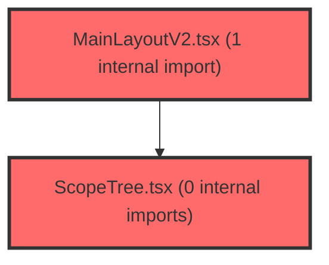

> [!IMPORTANT]
> **⚠️ 수동 검토 권장 (자가힐링 주의)**
>
> AI 자가힐링 결과물이 실제 의도와 다를 수 있으므로, **상세 리뷰 내용에 기반한 수동 점검**을 우선해 주시기 바랍니다. 자가힐링 기능을 활용하실 경우 최종 결과물을 신중하게 확인해 주세요.

# 코드 리뷰 - 53d8aa6f

## 코드 복잡도 분석

**분석된 파일**: 6개 / 변경된 파일: 6개


### Import 의존관계 다이어그램



**범례**: 중심 파일 (변경됨) | 많은 import (10개 이상)


### 정상 범위 (NONE)


**`routes.tsx`** (other)

- 평균 복잡도: **0.066**

- 최대 복잡도: 0.463

- 청크 수: 19개

- 평균 사용처: 2.9곳


**권장사항:**

- 복잡도 정상 범위


**`features.ts`** (config)

- 평균 복잡도: **0.003**

- 최대 복잡도: 0.011

- 청크 수: 4개


**권장사항:**

- Config 파일은 높은 연결도가 정상적임


**`mainlayoutv2.tsx`** (other)

- 평균 복잡도: **0.001**

- 최대 복잡도: 0.012

- 청크 수: 28개


**권장사항:**

- 파일 크기가 큼 (28개 청크) - 파일 분리 검토


**`landingpage.tsx`** (component)

- 평균 복잡도: **0.000**

- 최대 복잡도: 0.003

- 청크 수: 15개


**권장사항:**

- 복잡도 정상 범위


**`scopetree.tsx`** (other)

- 평균 복잡도: **0.000**

- 최대 복잡도: 0.006

- 청크 수: 70개


**권장사항:**

- 파일 크기가 큼 (70개 청크) - 파일 분리 검토


**`v2placeholder.tsx`** (other)

- 평균 복잡도: **0.000**

- 최대 복잡도: 0.002

- 청크 수: 13개


**권장사항:**

- 복잡도 정상 범위


---


## 변경 배경

이 커밋은 v2 정보구조(IA) 기반의 새로운 레이아웃 시스템을 도입하는 기반 작업(foundation)입니다. 기존 단일 레이아웃(MainLayout)을 유지하면서, `FEATURES.IA_V2` 플래그를 통해 v2 레이아웃(MainLayoutV2)으로 점진적 전환(progressive migration)할 수 있는 구조를 마련했습니다.

- **목적**: v2 IA(GNB + scope LNB) 기반의 새로운 내비게이션 구조를 도입하고, 기존 기능을 유지한 채 플래그 기반으로 점진 전환할 수 있는 기반을 구축
- **도메인**: UI / 라우팅 / 레이아웃
- **변경 방향**: 기존 라우팅 구조를 유지하면서 `FEATURES.IA_V2` 플래그에 따라 v2 경로로 분기 처리. 신규 레이아웃 컴포넌트(MainLayoutV2, ScopeTree, V2Placeholder)를 추가하고, GNB/서브탭/스코프 트리 구성을 데이터 기반(gnbConfig)으로 정의

---

## [GOOD] 잘된 점

1. **플래그 기반 점진 전환 설계가 우수합니다.** `FEATURES.IA_V2` 단일 플래그로 라우팅과 레이아웃을 일괄 전환할 수 있어, 기능 플래그를 통한 단계적 롤아웃이 용이합니다. 기존 v1 경로가 완전히 제거되지 않고 유지되어 롤백이 쉽습니다.

2. **GNB 구성 데이터를 단일 소스(gnbConfig.ts)로 분리한 점이 좋습니다.** `GNB_ITEMS` 배열에 GNB 항목과 서브탭을 정의하고, `getActiveGnbId`/`getActiveSubTabId`가 경로에서 활성 상태를 파생하므로, 컨텍스트 없이도 현재 메뉴 상태를 결정할 수 있습니다.

3. **ScopeTree의 lazy fetch 패턴이 효율적입니다.** 펼쳐진 반의 멤버만 `useGroupMembersQuery`로 조회하고, `enabled` 옵션으로 불필요한 API 호출을 방지합니다. 또한 `currentMenuConfig.student`가 false인 메뉴에서는 학생 목록 UI를 숨기는 등 메뉴별 스코프 지원 여부를 유연하게 처리합니다.

4. **V2Placeholder를 통한 화면 골격 정의가 명확합니다.** 아직 구현되지 않은 화면을 플레이스홀더로 정의하여 라우팅 구조를 먼저 확정하고, 후속 phase에서 실제 화면으로 교체할 수 있는 확장성을 확보했습니다.

---

## 변경사항 요약

- `routes.tsx`: `FEATURES.IA_V2` 플래그에 따라 기존 경로를 v2 경로로 리다이렉트하고, v2 전용 라우트 블록을 추가
- `LandingPage.tsx`: 로그인 후 교사 리다이렉트 경로를 플래그에 따라 `/home` 또는 `/assessment`로 분기
- `features.ts`: `IA_V2` 플래그 추가 (기본 false)
- `MainLayoutV2.tsx`: GNB 헤더 + 스코프 사이드바 + 서브탭 내비게이션을 포함한 v2 레이아웃 신규 추가
- `ScopeTree.tsx`: 전체 → 반(아코디언) → 학생 3레벨 스코프 선택 트리 신규 추가
- `V2Placeholder.tsx`: 미구현 화면용 플레이스홀더 컴포넌트 신규 추가

---

## [ISSUE] 개선이 필요한 부분

### Critical (즉시 수정 필요)

없음

### High (우선 수정 권장)

**1. `ScopeTree`의 `useGroupMembersQuery` 호출 조건이 불완전합니다.**

`ScopeTree.tsx` 291행에서 `useGroupMembersQuery(currentMenuConfig.student ? expandedClassId : null, user?.id)`로 호출합니다. `currentMenuConfig.student`가 true이고 `expandedClassId`가 null인 경우(예: 학생 지원 메뉴에서 아직 반을 펼치지 않은 상태), `groupId`가 null이 되어 `enabled: false`로 쿼리가 비활성화됩니다. 이는 의도된 동작일 수 있으나, `expandedClassId`가 null일 때 `members`가 이전 상태로 남아있을 수 있습니다. React Query는 `enabled: false`일 때 이전 데이터를 유지하므로, 반을 접었다가 다른 반을 펼칠 때 이전 반의 멤버 데이터가 잠깐 표시될 수 있습니다.

- **위치**: `ScopeTree.tsx` 291행
- **기존 코드**:
```tsx
const {
  data: members = [],
  isLoading: membersLoading,
  isError: membersError,
  refetch: refetchMembers,
} = useGroupMembersQuery(currentMenuConfig.student ? expandedClassId : null, user?.id);
```
- **해결 방안**: `expandedClassId`가 변경될 때 이전 데이터를 명시적으로 초기화하거나, `queryKey`에 `expandedClassId`를 포함하여 캐시를 분리하는 것이 안전합니다. 다만 `useGroupMembersQuery`의 `queryKey`가 `groupKeys.members(groupId, userId)`로 이미 `groupId`를 포함하므로, 반을 전환하면 새 쿼리 키로 새 데이터를 가져옵니다. 다만 `enabled: false` 상태에서 이전 데이터가 유지되는 문제는 `isLoading` 상태를 함께 체크하여 해결할 수 있습니다.

**[수정 코드 제시 불가 — 문맥 파악 불충분]**: `groupKeys.members`의 정확한 구현과 `ScopeTree`의 렌더링 조건을 전체적으로 확인해야 정확한 수정 코드를 제시할 수 있습니다.

**2. `routes.tsx`의 `/exam/management`가 기존 `AssessmentPage`를 그대로 사용하면서, v1의 `/assessment/:groupId` 경로가 v2에서도 여전히 노출됩니다.**

`routes.tsx`에서 `/assessment/:groupId`는 `FEATURES.IA_V2`와 무관하게 항상 `AssessmentPage`로 렌더링됩니다. v2 모드에서 `/assessment/:groupId`로 직접 접근하면 v2 레이아웃(MainLayoutV2) 안에서 v1 페이지가 렌더링되는데, 이때 스코프 쿼리(`?class=`)가 없어 `AssessmentPage`가 올바른 컨텍스트를 찾지 못할 수 있습니다.

- **위치**: `routes.tsx` 160행 부근
- **기존 코드**:
```tsx
<Route path='/assessment/:groupId' element={<AssessmentPage />} />
```
- **해결 방안**: v2 모드에서는 `/assessment/:groupId`를 `/exam/management?class={groupId}`로 리다이렉트하는 것이 일관적입니다.

**[수정 코드 제시 불가 — 문맥 파악 불충분]**: `AssessmentPage`가 `groupId` 파라미터를 어떻게 사용하는지, v2 레이아웃과의 호환성을 확인해야 정확한 수정 코드를 제시할 수 있습니다.

### Medium (개선 권장)

**1. `MainLayoutV2`의 `isFullWidth` 판정이 하드코딩되어 있습니다.**

`MainLayoutV2.tsx` 88행에서 `location.pathname === '/home' || location.pathname.startsWith('/ai-assistant')`로 전체 너비 여부를 판정합니다. 향후 전체 너비가 필요한 화면이 추가되면 이 조건이 계속 늘어나게 됩니다. `gnbConfig.ts`에 `fullWidth` 속성을 추가하거나, 라우트 설정에서 관리하는 것이 더 확장성 있는 설계입니다.

**2. `ScopeTree`의 `searchQuery`가 반을 전환할 때 초기화되지만, 반을 접었다가 다시 펼칠 때도 초기화됩니다.**

`handleClassHeaderClick`에서 `willExpand`일 때만 `setSearchQuery('')`를 호출합니다. 반을 접었다가 다시 펼칠 때는 `willExpand`가 true이므로 초기화됩니다. 다만, 이미 펼쳐진 반에서 다른 반을 펼치면 `expandedClassId`가 변경되면서 `willExpand`가 true가 되어 초기화됩니다. 이는 의도된 동작으로 보이나, 사용자가 검색 중 실수로 다른 반을 클릭하면 검색어가 사라지는 UX 이슈가 있을 수 있습니다.

**3. `V2Placeholder`의 `description` 기본값이 하드코딩되어 있습니다.**

`V2Placeholder.tsx` 31행에서 `description ?? '다음 구현 단계에서 이 화면의 기능을 연결합니다.'`로 기본값을 설정합니다. 이는 모든 플레이스홀더에 동일한 문구가 표시되는데, 화면별로 다른 안내 문구가 필요할 수 있습니다. `routes.tsx`에서 각 라우트에 `description`을 명시적으로 전달하는 것이 좋습니다.

---

## 주요 파일 분석

### `frontend/src/widgets/layout/v2/MainLayoutV2.tsx`

**변경 내용:**
v2 레이아웃의 핵심 컴포넌트로, GNB 헤더 + 스코프 사이드바 + 서브탭 내비게이션을 조합합니다.

**개선 제안:**
1. `isFullWidth` 판정 로직을 데이터 기반으로 변경
   - **위치**: 88행
   - **기존 코드**:
```tsx
const isFullWidth =
  location.pathname === '/home' || location.pathname.startsWith('/ai-assistant');
```
   - **해결 방안**: `gnbConfig.ts`에 `fullWidth` 속성을 추가하거나, 별도 상수 배열로 관리
```tsx
// gnbConfig.ts에 추가
export const FULL_WIDTH_PATHS = ['/home', '/ai-assistant'];

// MainLayoutV2.tsx에서 사용
const isFullWidth = FULL_WIDTH_PATHS.some(
  (path) => location.pathname === path || location.pathname.startsWith(`${path}/`),
);
```

### `frontend/src/widgets/layout/v2/ScopeTree.tsx`

**변경 내용:**
전체 → 반(아코디언) → 학생 3레벨 스코프 선택 트리. React Query로 그룹/멤버 데이터를 직접 소비합니다.

**개선 제안:**
1. `members` 데이터의 이전 상태 잔존 문제
   - **위치**: 291행
   - **기존 코드**:
```tsx
const {
  data: members = [],
  isLoading: membersLoading,
  isError: membersError,
  refetch: refetchMembers,
} = useGroupMembersQuery(currentMenuConfig.student ? expandedClassId : null, user?.id);
```
   - **해결 방안**: `expandedClassId`가 null일 때 `members`를 빈 배열로 초기화하는 것이 안전합니다. `useMemo`로 `expandedClassId`가 null이면 빈 배열을 반환하도록 처리할 수 있습니다.

2. `activeStudents` 필터링에서 `member.status === 'active'` 비교가 대소문자에 민감합니다.
   - **위치**: 300행
   - **기존 코드**:
```tsx
const activeStudents = useMemo(
  () => members.filter((member) => member.status === 'active'),
  [members],
);
```
   - **해결 방안**: 백엔드 응답의 status 값이 'ACTIVE'인지 'active'인지 확인이 필요합니다. `groupService.ts`의 `getGroupMembers` 구현을 확인하여 일관된 비교를 사용해야 합니다.

### `frontend/src/app/router/routes.tsx`

**변경 내용:**
`FEATURES.IA_V2` 플래그에 따라 기존 경로를 v2 경로로 리다이렉트하고, v2 전용 라우트 블록을 추가합니다.

**개선 제안:**
1. `/assessment/:groupId` 경로가 v2 모드에서도 그대로 노출되는 문제
   - **위치**: 160행
   - **기존 코드**:
```tsx
<Route path='/assessment/:groupId' element={<AssessmentPage />} />
```
   - **해결 방안**: v2 모드에서는 `/exam/management?class={groupId}`로 리다이렉트하는 것이 일관적입니다.

2. `GroupDetailRedirect`에서 `encodeURIComponent(groupId ?? '')`를 사용하는데, `groupId`가 undefined일 때 빈 문자열이 전달되어 `/exam/management?class=`로 이동할 수 있습니다.
   - **위치**: 50-55행
   - **기존 코드**:
```tsx
return FEATURES.IA_V2 ? (
  <Navigate to={`/exam/management?class=${encodeURIComponent(groupId ?? '')}`} replace />
) : (
  <Navigate to={`/assessment/${groupId}`} replace />
);
```
   - **해결 방안**: `groupId`가 없을 때는 `/exam/management`로만 이동하도록 처리하는 것이 안전합니다.

---

## 최종 평가

**결론**:
- [ ] [OK] **승인 (Approved)** - Critical/High 이슈 없음
- [x] [WARN] **조건부 승인 (Approved with Comments)** - Medium 이하 이슈만 존재
- [ ] [FIX] **수정 필요 (Changes Requested)** - Critical/High 이슈 존재

**종합 의견:**

이 커밋은 v2 IA 전환의 기반을 잘 설계했습니다. `FEATURES.IA_V2` 플래그를 통한 점진 전환 전략, GNB 구성의 데이터 기반 분리, ScopeTree의 lazy fetch 패턴 등 확장성을 고려한 구조가 돋보입니다. 다만, v2 모드에서 기존 v1 경로(`/assessment/:groupId`)가 그대로 노출되는 문제와 ScopeTree의 이전 데이터 잔존 가능성은 후속 phase에서 보완이 필요합니다. 전반적으로 실무에서 통용될 수 있는 수준의 품질을 갖추었으며, 후속 phase에서 상세 화면이 구현되면서 자연스럽게 개선될 것으로 기대합니다.