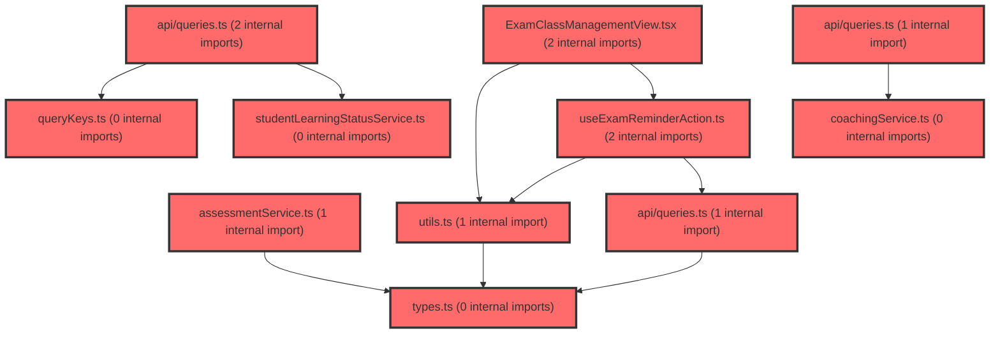

# 코드 리뷰 - 5475054f

## 코드 복잡도 분석

**분석된 파일**: 23개 / 변경된 파일: 23개

### Import 의존관계 다이어그램

**범례**: 중심 파일 (변경됨) | 많은 import (10개 이상)

### 정상 범위 (NONE)

**`assessmentservice.ts`** (other)

- 평균 복잡도: **0.003**

- 최대 복잡도: 0.008

- 청크 수: 34개

**권장사항:**

- 파일 크기가 큼 (34개 청크) - 파일 분리 검토

**`queries.ts`** (other)

- 평균 복잡도: **0.003**

- 최대 복잡도: 0.014

- 청크 수: 48개

**권장사항:**

- 파일 크기가 큼 (48개 청크) - 파일 분리 검토

**`utils.ts`** (utility)

- 평균 복잡도: **0.003**

- 최대 복잡도: 0.008

- 청크 수: 19개

**권장사항:**

- 복잡도 정상 범위

**`useexamreminderaction.ts`** (other)

- 평균 복잡도: **0.002**

- 최대 복잡도: 0.009

- 청크 수: 7개

**권장사항:**

- 복잡도 정상 범위

**`coachingservice.ts`** (other)

- 평균 복잡도: **0.002**

- 최대 복잡도: 0.004

- 청크 수: 6개

**권장사항:**

- 복잡도 정상 범위

**`individualcoachingcontent.ts`** (other)

- 평균 복잡도: **0.002**

- 최대 복잡도: 0.004

- 청크 수: 5개

**권장사항:**

- 복잡도 정상 범위

**`querykeys.ts`** (other)

- 평균 복잡도: **0.002**

- 최대 복잡도: 0.002

- 청크 수: 2개

**권장사항:**

- 복잡도 정상 범위

**`studentlearningstatusservice.ts`** (other)

- 평균 복잡도: **0.002**

- 최대 복잡도: 0.008

- 청크 수: 12개

**권장사항:**

- 복잡도 정상 범위

**`types.ts`** (other)

- 평균 복잡도: **0.001**

- 최대 복잡도: 0.006

- 청크 수: 13개

**권장사항:**

- 복잡도 정상 범위

**`queries.ts`** (other)

- 평균 복잡도: **0.001**

- 최대 복잡도: 0.003

- 청크 수: 7개

**권장사항:**

- 복잡도 정상 범위

**`queries.ts`** (other)

- 평균 복잡도: **0.001**

- 최대 복잡도: 0.004

- 청크 수: 6개

**권장사항:**

- 복잡도 정상 범위

**`typeclassification.tsx`** (other)

- 평균 복잡도: **0.001**

- 최대 복잡도: 0.012

- 청크 수: 54개

**권장사항:**

- 파일 크기가 큼 (54개 청크) - 파일 분리 검토

**`coachingclasspage.tsx`** (component)

- 평균 복잡도: **0.001**

- 최대 복잡도: 0.002

- 청크 수: 2개

**권장사항:**

- 복잡도 정상 범위

**`coachingindividualpage.tsx`** (component)

- 평균 복잡도: **0.001**

- 최대 복잡도: 0.002

- 청크 수: 7개

**권장사항:**

- 복잡도 정상 범위

**`timeline.tsx`** (other)

- 평균 복잡도: **0.001**

- 최대 복잡도: 0.005

- 청크 수: 19개

**권장사항:**

- 복잡도 정상 범위

**`examclassmanagementview.tsx`** (component)

- 평균 복잡도: **0.000**

- 최대 복잡도: 0.005

- 청크 수: 76개

**권장사항:**

- 파일 크기가 큼 (76개 청크) - 파일 분리 검토

**`airoomchatarea.tsx`** (other)

- 평균 복잡도: **0.000**

- 최대 복잡도: 0.003

- 청크 수: 53개

**권장사항:**

- 파일 크기가 큼 (53개 청크) - 파일 분리 검토

**`classcoachingsection.tsx`** (other)

- 평균 복잡도: **0.000**

- 최대 복잡도: 0.008

- 청크 수: 91개

**권장사항:**

- 파일 크기가 큼 (91개 청크) - 파일 분리 검토

**`coachingpageframe.tsx`** (component)

- 평균 복잡도: **0.000**

- 최대 복잡도: 0.002

- 청크 수: 9개

**권장사항:**

- 복잡도 정상 범위

**`individualcoachingsection.tsx`** (other)

- 평균 복잡도: **0.000**

- 최대 복잡도: 0.007

- 청크 수: 102개

**권장사항:**

- 파일 크기가 큼 (102개 청크) - 파일 분리 검토

**`index.ts`** (other)

- 평균 복잡도: **0.000**

- 최대 복잡도: 0.000

- 청크 수: 4개

**권장사항:**

- 복잡도 정상 범위

**`studenttrackingsection.tsx`** (other)

- 평균 복잡도: **0.000**

- 최대 복잡도: 0.010

- 청크 수: 114개

**권장사항:**

- 파일 크기가 큼 (114개 청크) - 파일 분리 검토

**`examstatussection.tsx`** (other)

- 평균 복잡도: **0.000**

- 최대 복잡도: 0.008

- 청크 수: 54개

**권장사항:**

- 파일 크기가 큼 (54개 청크) - 파일 분리 검토

---

## 변경 배경

이 커밋은 `feature/frontend-architecture` 브랜치의 원격 변경사항을 병합한 **merge 커밋**입니다. 실제 변경된 파일은 `reviews/REVIEW_57641c7c.md`와 `reviews/REVIEW_cc77976a.md` 두 개의 코드 리뷰 문서뿐이며, 소스 코드 변경은 포함하지 않습니다.

- **목적**: 브랜치 동기화 및 기존 커밋(57641c7c, cc77976a)에 대한 리뷰 문서 추가
- **도메인**: 문서/리뷰 산출물 (코드 변경 없음)
- **변경 방향**: 병합을 통한 브랜치 최신화, 리뷰 기록 보존

## [GOOD] 잘된 점

1. **리뷰 산출물을 저장소에 보존**: 코드 리뷰 결과를 `reviews/` 디렉토리에 문서화하여 추적 가능한 리뷰 히스토리를 남긴 점이 좋습니다.
2. **병합 충돌 없이 정리**: 두 브랜치를 충돌 없이 병합하여 브랜치 상태를 깔끔하게 유지했습니다.

## 변경사항 요약

- `reviews/REVIEW_57641c7c.md` (143줄): 검사 미완료 학생 fallback 데이터 및 Coaching 페이지 ID 매핑 관련 리뷰
- `reviews/REVIEW_cc77976a.md` (306줄): 백엔드 보안 설정 관련 리뷰

---

## [ISSUE] 개선이 필요한 부분

### Critical (즉시 수정 필요)

없음

### High (우선 수정 권장)

없음

### Medium (개선 권장)

1. **리뷰 문서와 실제 커밋 변경사항의 불일치**
   - 이 커밋(5475054f)은 merge 커밋으로 실제 코드 변경이 없음에도, 리뷰 대상으로 제공된 Diff에는 assessment reminder, coaching API 연동 등 **이 커밋에 포함되지 않은 코드 변경사항**이 포함되어 있습니다. 리뷰 문서가 실제 병합된 코드와 정확히 대응되는지 확인이 필요합니다.
   - **위치**: `reviews/REVIEW_57641c7c.md`, `reviews/REVIEW_cc77976a.md`
   - **분석**: 리뷰 문서가 참조하는 커밋(57641c7c, cc77976a)과 현재 병합 커밋(5475054f)의 관계를 명확히 하여, 리뷰 대상 코드가 실제 병합된 코드와 일치하는지 검증하는 것이 좋습니다.

---

## 주요 파일 분석

### reviews/REVIEW_57641c7c.md

**변경 내용:**
검사 미완료 학생의 fallback 데이터 처리 개선 및 Coaching 페이지의 학생 ID 매핑 오류 수정에 대한 리뷰 문서 추가.

**개선 제안:**
1. 리뷰 문서 내 `useGroupMembersQuery`의 `enabled` 옵션 제안은 `useGroupMembersQuery` 시그니처가 옵션 객체를 지원하는지 확인이 필요하며, 문서 자체에서도 이를 명시적으로 언급하고 있어 안전하게 처리되었습니다.

### reviews/REVIEW_cc77976a.md

**변경 내용:**
백엔드 보안 설정(SecurityConfig, AdminUserDetailsService 등) 관련 리뷰 문서 추가.

**개선 제안:**
1. 문서 상단에 "수동 검토 권장" 경고를 명시하여 자가힐링 결과물의 신중한 검토를 유도한 점이 적절합니다.

---

## 최종 평가

**결론**: 
- [x] [OK] **승인 (Approved)** - Critical/High 이슈 없음

**종합 의견:**
이 커밋은 코드 변경 없이 리뷰 문서만 추가한 merge 커밋으로, 승인 가능합니다. 다만 리뷰 대상으로 제공된 Diff가 실제 커밋 변경사항과 일치하지 않으므로, 리뷰 문서가 실제 병합된 코드와 정확히 대응되는지 확인하는 것이 좋습니다.